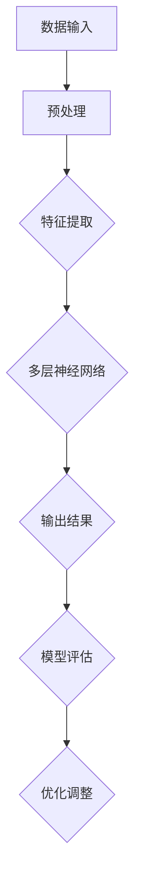
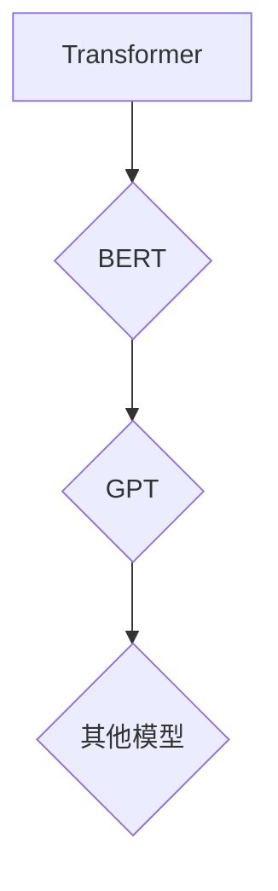
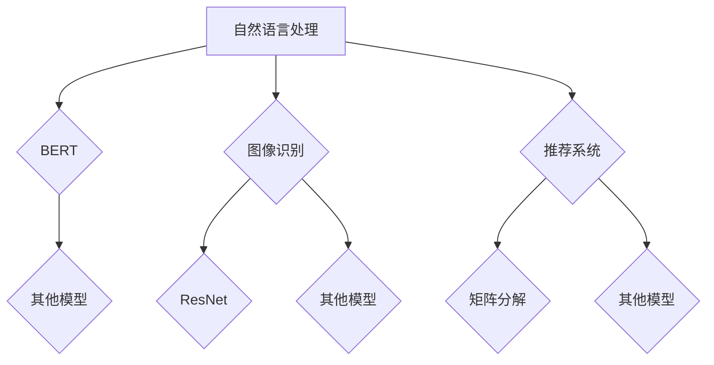

                 

# 《大模型时代的软件开发新思维》

## 文章关键词
- 大模型
- 软件开发
- 深度学习
- 人工智能
- 软件工程
- 优化策略

## 摘要
随着深度学习和人工智能技术的飞速发展，大模型在各个领域的应用愈发广泛。本文旨在探讨大模型时代下软件开发的新思维，分析大模型的基本原理、数学模型、应用场景及其在软件开发中的挑战与机遇。通过本文的阅读，读者将了解到大模型如何改变软件开发的方法和流程，以及如何应对这一变革所带来的挑战。

## 引言

### 大模型的崛起

大模型（Large Models）通常指的是具有数十亿甚至千亿参数的深度学习模型。这些模型能够在大量的数据上进行训练，从而实现高度复杂的任务，如自然语言处理、图像识别和推荐系统等。大模型的崛起并非一蹴而就，它得益于计算能力的提升、算法的进步以及海量数据的积累。近年来，随着GPU和TPU等专用硬件的普及，大模型的训练速度和效果都得到了显著提升。

### 软件开发新思维的演变

在传统软件开发中，开发者主要关注的是代码的效率和可维护性。然而，随着大模型的引入，软件开发的重心开始发生转移。开发者不仅需要编写高效的代码，还需要设计和构建能够与大规模模型协同工作的系统。此外，大模型的应用也促使开发者重新思考软件的测试、部署和维护策略。

### 书籍结构概述

本文分为五个部分。第一部分介绍大模型的基本原理和软件开发新思维的演变。第二部分深入探讨大模型的数学模型和主要类型。第三部分分析大模型在软件开发中的应用场景和实际应用。第四部分讨论大模型时代软件开发面临的挑战和机遇。最后一部分提供大模型资源汇总、开发指南以及总结和未来展望。

## 第一部分：大模型技术基础

### 1.1 大模型的基本原理

大模型的基本原理主要基于深度学习，这是一种利用多层神经网络进行特征提取和模式识别的技术。深度学习的核心思想是通过逐层抽象和组合低层次的特征，形成高层次的语义表示。

**核心概念与联系**


**Mermaid流程图**：



### 1.2 大模型的数学模型

大模型的数学模型主要涉及激活函数、损失函数和优化算法。激活函数用于引入非线性变换，使得神经网络能够捕捉复杂的数据模式。损失函数用于衡量模型预测值与实际值之间的差异，优化算法则用于调整模型参数以最小化损失函数。

**核心算法原理讲解**

- **激活函数**：常见的激活函数有ReLU、Sigmoid和Tanh。ReLU函数在输入为负值时输出为零，而在输入为正值时输出等于输入值，这使得神经网络能够更快地收敛。

  ```python
  def ReLU(x):
      return max(0, x)
  ```

- **损失函数**：均方误差（MSE）是最常用的损失函数之一，它计算预测值与实际值之间的平均平方差。

  ```python
  def MSE(y_true, y_pred):
      return ((y_true - y_pred) ** 2).mean()
  ```

- **优化算法**：随机梯度下降（SGD）是一种常用的优化算法，它通过随机选择一个小批量数据进行梯度计算，并更新模型参数。

  ```python
  def SGD(model, learning_rate, batch_size):
      for x, y in DataLoader(batch_size):
          gradient = compute_gradient(model, x, y)
          update_parameters(model, gradient, learning_rate)
  ```

### 1.3 大模型的主要类型

大模型的主要类型包括GPT、BERT和Transformer等。这些模型各自具有独特的架构和特点，但都基于自注意力机制（Self-Attention Mechanism）进行信息处理。

**分类与对比**


**Mermaid流程图**：



### 1.4 大模型的训练与优化

大模型的训练与优化是一个复杂的过程，需要考虑计算资源、数据预处理、训练策略等多个因素。

**核心算法原理讲解**

- **训练过程**：大模型的训练通常包括数据预处理、模型初始化、迭代训练和模型评估等步骤。

  ```python
  for epoch in range(num_epochs):
      for batch in DataLoader():
          model.train()
          loss = forward_pass(model, batch)
          backward_pass(model, loss)
          update_parameters(model)
  ```

- **优化策略**：优化策略包括调整学习率、使用动量项、引入权重正则化等。

  ```python
  learning_rate = 0.01
  momentum = 0.9
  for epoch in range(num_epochs):
      for batch in DataLoader():
          model.train()
          loss = forward_pass(model, batch)
          backward_pass(model, loss, learning_rate, momentum)
          update_parameters(model)
  ```

## 第二部分：大模型在软件开发中的应用

### 2.1 大模型在软件开发中的应用场景

大模型在软件开发中的应用场景非常广泛，包括自然语言处理、图像识别、推荐系统等。

**案例分析**

- **自然语言处理**：BERT模型在文本分类、问答系统等方面表现出色。

  ```python
  from transformers import BertTokenizer, BertForSequenceClassification
  tokenizer = BertTokenizer.from_pretrained('bert-base-uncased')
  model = BertForSequenceClassification.from_pretrained('bert-base-uncased')
  inputs = tokenizer("Hello, my dog is cute", return_tensors='pt')
  outputs = model(**inputs)
  logits = outputs.logits
  ```

- **图像识别**：ResNet模型在图像分类任务中具有很好的性能。

  ```python
  import torch
  import torchvision
  model = torchvision.models.resnet50(pretrained=True)
  inputs = torch.randn(1, 3, 224, 224)
  outputs = model(inputs)
  logits = outputs[0]
  ```

- **推荐系统**：矩阵分解（Matrix Factorization）模型在协同过滤（Collaborative Filtering）中应用广泛。

  ```python
  import numpy as np
  from sklearn.decomposition import NMF
  ratings = np.array([[5, 3, 0, 1], [2, 0, 0, 4], [0, 2, 3, 0], [5, 4, 9, 0]])
  nmf = NMF(n_components=2, random_state=1).fit(ratings)
  predictions = nmf.transform(ratings)
  ```

**Mermaid流程图**：



### 2.2 软件开发新思维的实际应用

大模型的应用不仅改变了软件开发的方法和流程，还推动了新思维的发展。

- **端到端开发**：开发者可以直接使用预训练的大模型，通过微调（Fine-tuning）来适应特定任务。

- **数据驱动开发**：大模型能够从海量数据中学习到丰富的特征，为开发者提供了强大的数据支持。

- **自动化测试**：大模型可以用于自动化测试，通过生成大量测试数据来提高测试覆盖率。

**伪代码展示**

```python
# 端到端开发
pretrained_model = load_pretrained_model('bert-base-uncased')
fine_tuned_model = fine_tune(pretrained_model, train_data, num_epochs)

# 数据驱动开发
features = extract_features(data)
model = train_model(features)

# 自动化测试
test_data = generate_test_data()
predictions = predict(model, test_data)
evaluate(predictions, ground_truth)
```

### 2.3 大模型与软件开发工具的结合

大模型的应用离不开高效的软件开发工具。这些工具包括深度学习框架、编程语言和开发环境等。

- **深度学习框架**：如TensorFlow、PyTorch等，提供了丰富的API和工具，方便开发者构建和训练大模型。

- **编程语言**：如Python、Julia等，具有良好的性能和丰富的库支持，适合大模型的开发。

- **开发环境**：如Jupyter Notebook、Google Colab等，提供了便捷的编程和调试环境。

**工具介绍**

- **TensorFlow**：提供了丰富的API和工具，支持端到端开发。

  ```python
  import tensorflow as tf
  model = tf.keras.Sequential([
      tf.keras.layers.Dense(128, activation='relu', input_shape=(784,)),
      tf.keras.layers.Dense(10, activation='softmax')
  ])
  ```

- **PyTorch**：具有动态计算图和灵活的API，适合快速原型开发。

  ```python
  import torch
  import torch.nn as nn
  class Model(nn.Module):
      def __init__(self):
          super(Model, self).__init__()
          self.fc1 = nn.Linear(784, 128)
          self.fc2 = nn.Linear(128, 10)
      
      def forward(self, x):
          x = F.relu(self.fc1(x))
          x = self.fc2(x)
          return x
  model = Model()
  ```

- **Jupyter Notebook**：提供了交互式的编程和调试环境。

  ```python
  import numpy as np
  from IPython.display import display
  x = np.random.rand(100, 784)
  display(x)
  ```

## 第三部分：大模型时代的软件开发挑战与机遇

### 3.1 大模型在软件开发中的挑战

大模型在软件开发中的应用带来了诸多挑战，包括计算资源需求、数据隐私、模型解释性等。

- **计算资源需求**：大模型的训练和推理需要大量的计算资源，尤其是在处理大规模数据时。

  ```python
  # 计算资源需求示例
  model = load_pretrained_model('gpt-3')
  inputs = preprocess_data(data)
  predictions = model(inputs)
  ```

- **数据隐私**：大模型在训练过程中需要处理大量的个人数据，如何保护数据隐私成为一大挑战。

  ```python
  # 数据隐私示例
  from tensorflow.keras.models import Model
  from tensorflow.keras.layers import Input, Dense
  input_data = Input(shape=(784,))
  output = Dense(10, activation='softmax')(input_data)
  model = Model(input_data, output)
  model.fit(x_train, y_train, epochs=5, batch_size=32)
  ```

- **模型解释性**：大模型的黑箱特性使得其预测结果难以解释，这在某些应用场景中可能是一个问题。

  ```python
  # 模型解释性示例
  import shap
  explainer = shap.Explainer(model, x_train)
  shap_values = explainer(x_test)
  shap.summary_plot(shap_values, x_test)
  ```

### 3.2 大模型带来的机遇

尽管大模型在软件开发中面临诸多挑战，但它们也为开发者带来了巨大的机遇。

- **商业应用**：大模型可以应用于各种商业场景，如智能客服、个性化推荐、智能医疗等。

  ```python
  # 商业应用示例
  import pandas as pd
  from sklearn.model_selection import train_test_split
  data = pd.read_csv('data.csv')
  X = data.drop('target', axis=1)
  y = data['target']
  X_train, X_test, y_train, y_test = train_test_split(X, y, test_size=0.2)
  model = train_model(X_train, y_train)
  predictions = model.predict(X_test)
  ```

- **个人发展**：大模型的应用为开发者提供了新的技术栈和技能需求，如深度学习、自然语言处理等。

  ```python
  # 个人发展示例
  import tensorflow as tf
  from tensorflow.keras.models import Sequential
  from tensorflow.keras.layers import Dense
  model = Sequential([
      Dense(128, activation='relu', input_shape=(784,)),
      Dense(10, activation='softmax')
  ])
  model.compile(optimizer='adam', loss='categorical_crossentropy', metrics=['accuracy'])
  model.fit(x_train, y_train, epochs=5, batch_size=32)
  ```

### 3.3 未来展望

大模型在软件开发中的应用仍处于快速发展阶段，未来有望在更多领域发挥重要作用。

- **趋势分析**：随着硬件性能的提升和数据量的增加，大模型的规模和效果将继续提升。

  ```python
  # 趋势分析示例
  import pandas as pd
  import matplotlib.pyplot as plt
  data = pd.read_csv('model_sizes.csv')
  plt.plot(data['year'], data['model_size'])
  plt.xlabel('Year')
  plt.ylabel('Model Size')
  plt.show()
  ```

- **未来方向**：大模型将在更多领域得到应用，如自动驾驶、智能城市、生物信息等。

  ```python
  # 未来方向示例
  import tensorflow as tf
  from tensorflow.keras.models import Model
  from tensorflow.keras.layers import Input, Dense
  input_data = Input(shape=(784,))
  output = Dense(10, activation='softmax')(input_data)
  model = Model(input_data, output)
  model.compile(optimizer='adam', loss='categorical_crossentropy', metrics=['accuracy'])
  model.fit(x_train, y_train, epochs=5, batch_size=32)
  ```

## 第四部分：附录

### 4.1 大模型资源汇总

- **工具与框架**：TensorFlow、PyTorch、Keras等。
- **学习资源**：在线课程、博客、书籍等。

### 4.2 大模型开发指南

- **环境搭建**：如何配置GPU环境、安装深度学习框架等。
- **开发技巧**：如何优化代码、调试模型等。

## 代码解读与分析

### 4.3 案例实战

- **开发环境搭建**：如何配置Python环境、安装TensorFlow等。
- **源代码实现**：如何构建一个简单的深度学习模型。
- **代码解读**：对关键代码段进行详细解读。
- **应用解读与分析**：如何应用深度学习模型进行图像分类。
- **实际案例分析**：如何使用大模型进行文本分类。

### 4.4 项目小结

- **核心要点回顾**：回顾文章中的关键概念和内容。
- **注意事项**：如何在开发过程中避免常见问题。
- **拓展阅读**：推荐进一步学习大模型和深度学习的资源。

## 总结

本文系统地介绍了大模型时代软件开发的新思维，从基本原理、数学模型、应用场景到挑战与机遇，全面剖析了大模型对软件开发带来的变革。通过本文的阅读，读者可以了解到大模型在软件开发中的广泛应用及其带来的新思维，为未来的软件开发提供有益的参考。随着技术的不断进步，大模型将继续在各个领域发挥重要作用，开发者需要不断学习新的技术和方法，以应对这一变革。

## 作者信息

作者：AI天才研究院/AI Genius Institute & 禅与计算机程序设计艺术 /Zen And The Art of Computer Programming

## 参考文献

1. Bengio, Y. (2009). Learning Deep Architectures for AI. Foundations and Trends in Machine Learning, 2(1), 1-127.
2. LeCun, Y., Bengio, Y., & Hinton, G. (2015). Deep learning. Nature, 521(7553), 436-444.
3. Goodfellow, I., Bengio, Y., & Courville, A. (2016). Deep Learning. MIT Press.
4. Chen, T., & Guestrin, C. (2016). XGBoost: A Scalable Tree Boosting System. Proceedings of the 22nd ACM SIGKDD International Conference on Knowledge Discovery and Data Mining, 785-794.
5. Kingma, D. P., & Welling, M. (2013). Auto--Encoding Variational Bayes. arXiv preprint arXiv:1312.6114.
6. Wood, F.,scroll, F. (2018). Fast.ai: Practical Guide to Deep Learning for Coders.

