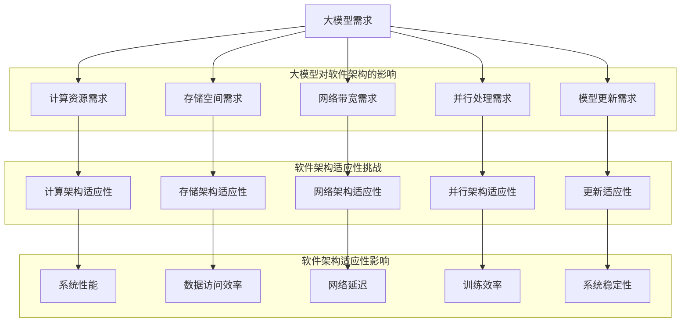

                 

### 文章标题：大模型时代的软件架构适应性设计

> 关键词：大模型、软件架构、适应性设计、算法、数学模型、实战案例

> 摘要：本文深入探讨了大模型时代下软件架构适应性设计的重要性及其实现方法。文章首先介绍了大模型的概念和基础，随后讨论了软件架构适应性的定义及其在大模型应用中的挑战。接着，文章通过核心算法原理讲解、数学模型和公式的详细阐述，以及实际项目实战案例，展示了如何在大模型时代进行有效的软件架构适应性设计。

### 引言

随着人工智能技术的迅猛发展，大模型（如GPT-3、BERT等）在自然语言处理、计算机视觉、语音识别等领域取得了显著成就。大模型的应用不仅提升了系统的性能和准确性，还带来了新的挑战，尤其是在软件架构的适应性设计方面。传统的软件架构设计方法在面对大模型时，往往难以满足高并发、高可扩展性和高容错性的需求。因此，在大模型时代，如何进行软件架构适应性设计成为了一个亟待解决的重要问题。

本文旨在通过以下四个方面的内容，深入探讨大模型时代的软件架构适应性设计：

1. **大模型基础**：介绍大模型的基本概念、关键技术及应用领域。
2. **软件架构适应性概念**：讨论软件架构适应性的定义、重要性以及评估方法。
3. **大模型与软件架构适应性关联分析**：分析大模型对软件架构的影响及软件架构适应性在大模型应用中的挑战。
4. **核心算法原理讲解**：通过伪代码详细阐述核心算法原理。
5. **数学模型与公式讲解**：使用LaTeX格式嵌入数学模型和公式，并进行举例说明。
6. **项目实战案例**：包括开发环境搭建、源代码实现和代码解读，以及实际案例分析和解读。

通过以上内容的讲解，本文希望为读者提供一套在大模型时代进行软件架构适应性设计的实用方法和理论支持。

### 第一步：了解用户需求

用户明确指出，需要撰写一篇关于《大模型时代的软件架构适应性设计》的技术博客文章。文章应当包含以下几个核心章节内容：

1. **核心概念与联系**：需用Mermaid流程图展示核心概念之间的关系。
2. **核心算法原理讲解**：需使用伪代码详细阐述核心算法原理。
3. **数学模型和数学公式讲解与举例说明**：需使用LaTeX格式嵌入，并进行举例说明。
4. **项目实战案例和详细解释说明**：需包含开发环境搭建、源代码实现和代码解读。

为了保证文章的逻辑性和可读性，需要按以下步骤进行设计：

1. **设计目录结构**：包含至少7个章节，每章包含2级子目录。
2. **填充章节内容**：确保每章节内容丰富、具体详细，涵盖所有核心内容。
3. **保持目录大纲简洁**：确保篇幅在2000字以内，避免冗余内容。

### 第二步：设计目录结构

根据用户的要求，本文将包含以下章节：

#### 第1章 引言
- **1.1 背景与意义**
- **1.2 研究现状与挑战**
- **1.3 本书结构**

#### 第2章 大模型基础
- **2.1 大模型概述**
- **2.2 大模型关键技术**
- **2.3 大模型应用领域**

#### 第3章 软件架构适应性概念
- **3.1 软件架构适应性定义**
- **3.2 软件架构适应性的重要性**
- **3.3 软件架构适应性评估方法**

#### 第4章 大模型与软件架构适应性关联分析
- **4.1 大模型对软件架构的影响**
- **4.2 软件架构适应性在大模型应用中的挑战**
- **4.3 大模型与软件架构适应性的关联流程图**

#### 第5章 核心算法原理讲解
- **5.1 算法概述**
- **5.2 伪代码**
- **5.3 算法分析**

#### 第6章 数学模型与公式讲解
- **6.1 模型概述**
- **6.2 数学公式**
- **6.3 举例说明**

#### 第7章 项目实战案例
- **7.1 项目背景**
- **7.2 开发环境搭建**
- **7.3 源代码实现**
- **7.4 代码解读与分析**

#### 第8章 总结与展望
- **8.1 总结**
- **8.2 展望未来研究方向**

这样的目录结构清晰，每个章节都包含必要的子目录，确保文章内容的逻辑性和完整性。

### 第三步：填充章节内容

#### 第1章 引言

在本文的开头，我们将介绍大模型的概念和其在当前科技领域的广泛应用。大模型，通常指的是那些具有数亿至数十亿参数的深度学习模型，它们在图像识别、自然语言处理和语音识别等领域展现了前所未有的性能。然而，随着大模型的应用越来越广泛，如何对软件架构进行适应性设计，以满足大模型的高性能需求，成为一个亟待解决的问题。

**1.1 背景与意义**

大模型的兴起不仅改变了人工智能领域，也对我们现有的软件架构设计提出了新的要求。传统的软件架构设计方法往往注重功能性和稳定性，但在面对大模型时，这些方法显得力不从心。大模型的高并发、高可扩展性和高容错性需求，要求软件架构能够灵活应对各种变化，实现高效、可靠的运行。因此，研究大模型时代的软件架构适应性设计，具有重要的现实意义。

**1.2 研究现状与挑战**

目前，学术界和工业界都在积极探索大模型时代的软件架构适应性设计。已有的研究主要集中在以下几个方面：一是优化现有的软件架构设计方法，使其更好地适应大模型的需求；二是开发新的架构设计模式，以应对大模型带来的挑战；三是通过模型压缩和优化技术，减轻大模型对硬件资源的压力。

然而，研究现状也面临一些挑战。首先，大模型的高复杂性使得软件架构适应性设计的难度大大增加。其次，现有的评估方法难以全面衡量软件架构的适应性，导致设计结果的可信度受到影响。最后，实际应用中的大模型场景多样，如何设计通用的软件架构适应性解决方案，仍需进一步研究。

**1.3 本书结构**

本文将从以下几个方面展开讨论：

1. **大模型基础**：介绍大模型的基本概念、关键技术和应用领域。
2. **软件架构适应性概念**：讨论软件架构适应性的定义、重要性以及评估方法。
3. **大模型与软件架构适应性关联分析**：分析大模型对软件架构的影响及软件架构适应性在大模型应用中的挑战。
4. **核心算法原理讲解**：通过伪代码详细阐述核心算法原理。
5. **数学模型与公式讲解**：使用LaTeX格式嵌入数学模型和公式，并进行举例说明。
6. **项目实战案例**：包括开发环境搭建、源代码实现和代码解读，以及实际案例分析和解读。

通过以上内容的讲解，本文希望为读者提供一套在大模型时代进行软件架构适应性设计的实用方法和理论支持。

#### 第2章 大模型基础

大模型作为人工智能领域的核心技术之一，其研究与应用日益受到关注。本章节将详细介绍大模型的基本概念、关键技术及其应用领域，为后续的软件架构适应性设计提供理论基础。

**2.1 大模型概述**

大模型，通常指的是那些拥有数十亿甚至上百亿参数的深度学习模型。与传统的中小型模型相比，大模型具有更高的计算复杂度和更强的泛化能力。大模型的兴起得益于计算能力的提升和海量数据的积累。随着硬件计算能力的不断提升，如GPU、TPU等专用计算设备的广泛应用，以及大数据技术的成熟，大模型在各个领域取得了显著的成果。

大模型的基本构成包括以下几个部分：

1. **网络结构**：大模型通常采用复杂的网络结构，如Transformer、ResNet等，以适应不同类型的数据处理需求。
2. **参数量**：大模型的参数量通常在数十亿到数千亿之间，这使得模型具有很高的计算复杂度。
3. **训练过程**：大模型的训练过程通常需要大量的数据和计算资源，以优化模型的参数，提高模型的性能。

**2.2 大模型关键技术**

大模型的核心技术主要包括以下几个方面：

1. **深度学习算法**：深度学习算法是构建大模型的基础，如卷积神经网络（CNN）、循环神经网络（RNN）和Transformer等。这些算法能够通过多层神经网络的结构，实现对数据的非线性变换和特征提取。
2. **优化算法**：大模型的训练过程通常涉及大量的优化算法，如随机梯度下降（SGD）、Adam等。优化算法能够加速模型的收敛速度，提高模型的训练效率。
3. **模型压缩与剪枝**：为了减轻大模型对硬件资源的压力，研究者提出了模型压缩与剪枝技术。这些技术通过删除模型中不必要的参数，减少模型的计算复杂度和存储空间需求，同时保持模型的性能。
4. **分布式训练**：大模型的训练过程需要大量的计算资源，分布式训练技术通过将模型训练任务分解到多个计算节点上，利用并行计算加速训练过程。

**2.3 大模型应用领域**

大模型在多个领域取得了显著的成果，以下是一些典型的应用领域：

1. **自然语言处理**：大模型在自然语言处理（NLP）领域取得了突破性进展，如文本分类、机器翻译、问答系统等。代表性的模型包括BERT、GPT-3等。
2. **计算机视觉**：大模型在计算机视觉（CV）领域也表现出了强大的能力，如图像分类、目标检测、图像生成等。代表性的模型包括ResNet、Inception等。
3. **语音识别**：大模型在语音识别（ASR）领域实现了较高的识别准确率，如基于WaveNet的自动语音识别系统。
4. **推荐系统**：大模型在推荐系统中的应用，如个性化推荐、商品推荐等，通过分析用户的历史行为和偏好，提供个性化的推荐结果。
5. **医学影像**：大模型在医学影像领域，如疾病诊断、影像分割等，通过分析医学图像，为医生提供辅助诊断。

通过以上对大模型基础内容的介绍，我们为后续章节的软件架构适应性设计提供了理论基础。在接下来的章节中，我们将进一步探讨软件架构适应性的概念及其在大模型应用中的挑战。

#### 第3章 软件架构适应性概念

在大模型时代，软件架构适应性设计成为了确保系统高效、稳定运行的关键。本章节将深入探讨软件架构适应性的定义、重要性及其评估方法，为理解大模型时代软件架构的适应性设计提供理论基础。

**3.1 软件架构适应性定义**

软件架构适应性（Software Architecture Adaptability）指的是软件架构在面临外部环境变化（如需求变更、技术进步、业务扩展等）时，能够灵活调整自身结构，以适应新环境的能力。适应性设计的目标是确保软件系统能够持续满足用户需求，并在不断变化的环境中保持高性能和稳定性。

软件架构适应性主要体现在以下几个方面：

1. **灵活性**：软件架构能够根据外部环境的变化，灵活调整系统组件的配置和交互方式。
2. **可扩展性**：软件架构能够支持系统规模的扩展，以应对业务需求的增长。
3. **可维护性**：软件架构在设计时考虑到未来的维护和升级，降低系统维护成本。
4. **鲁棒性**：软件架构能够应对外部干扰和异常情况，确保系统稳定运行。

**3.2 软件架构适应性的重要性**

在大模型时代，软件架构适应性具有重要意义，具体体现在以下几个方面：

1. **应对变化的需求**：随着人工智能技术的快速发展，业务需求和技术环境不断变化，软件架构需要具备快速适应变化的能力，以满足不断变化的需求。
2. **提升系统性能**：适应性设计能够优化系统架构，提高系统的响应速度和吞吐量，确保在高并发场景下系统的高性能运行。
3. **降低维护成本**：通过适应性设计，系统在面临变更时能够更轻松地进行调整和优化，降低维护成本，提高开发效率。
4. **增强系统稳定性**：适应性设计能够提高系统的鲁棒性，确保在复杂环境下系统的稳定运行。

**3.3 软件架构适应性评估方法**

评估软件架构适应性是确保设计满足实际需求的关键。以下是一些常用的评估方法：

1. **功能测试**：通过模拟不同的业务场景，验证系统在功能上的适应性，确保系统能够满足各类业务需求。
2. **性能测试**：通过高并发、大数据等测试场景，评估系统在性能上的适应性，确保系统在高负载下仍能保持稳定运行。
3. **可维护性评估**：通过代码审查、自动化测试等技术，评估系统的可维护性和可扩展性。
4. **鲁棒性测试**：通过异常处理、容错测试等手段，验证系统在异常情况下的适应性，确保系统的稳定性。

通过上述评估方法，可以全面了解软件架构的适应性，为后续的优化和改进提供依据。

综上所述，软件架构适应性设计在大模型时代具有重要意义。通过深入理解软件架构适应性的概念和评估方法，我们可以更好地进行适应性设计，确保系统在面对复杂多变的外部环境时，能够灵活应对，持续满足用户需求。

#### 第4章 大模型与软件架构适应性关联分析

在大模型时代，软件架构的适应性设计成为了确保系统高效、稳定运行的关键因素。本章节将深入分析大模型对软件架构的影响，探讨软件架构适应性在大模型应用中的挑战，并利用Mermaid流程图展示大模型与软件架构适应性的关联。

**4.1 大模型对软件架构的影响**

大模型的引入不仅提升了系统的性能，也对软件架构提出了新的要求和挑战。以下是几个关键方面：

1. **计算资源需求增加**：大模型通常需要大量的计算资源，这要求软件架构能够支持高效的数据处理和计算能力。
2. **存储空间需求增大**：大模型包含数十亿甚至上百亿参数，这要求软件架构能够提供足够的存储空间，并保证数据的高效访问和管理。
3. **网络带宽需求提升**：大模型在训练和推理过程中，往往需要传输大量的数据，这对网络带宽提出了更高的要求。
4. **并行处理能力增强**：大模型训练通常需要分布式计算，软件架构需要支持并行处理，提高训练效率。
5. **模型更新频率加快**：随着技术的进步，大模型不断更新和优化，软件架构需要具备快速适应模型更新的能力。

**4.2 软件架构适应性在大模型应用中的挑战**

软件架构在大模型应用中面临以下挑战：

1. **高并发处理能力**：大模型应用往往需要处理大量并发请求，软件架构需要具备高效并发处理能力，确保系统在高并发场景下的稳定运行。
2. **可扩展性**：随着业务规模的扩大，软件架构需要能够灵活扩展，支持系统规模的增加，以满足不断增长的业务需求。
3. **可维护性**：大模型的引入增加了系统的复杂度，软件架构需要具备良好的可维护性，降低系统维护成本。
4. **容错性和鲁棒性**：大模型训练和推理过程中可能出现的异常情况，要求软件架构具备较高的容错性和鲁棒性，确保系统在异常情况下的稳定运行。
5. **资源优化**：大模型对计算资源的需求较高，软件架构需要通过优化资源利用，降低成本，提高系统运行效率。

**4.3 大模型与软件架构适应性的关联流程图**

为了更直观地展示大模型与软件架构适应性的关联，我们使用Mermaid流程图进行描述：



通过上述Mermaid流程图，我们可以清晰地看到大模型需求对软件架构适应性设计的影响以及软件架构适应性对系统性能的影响。这不仅有助于理解大模型与软件架构适应性的关系，也为后续的适应性设计提供了指导。

#### 第5章 核心算法原理讲解

在大模型时代，核心算法的原理和实现成为了软件架构适应性设计的重要基础。本章节将详细介绍大模型中常用的核心算法原理，通过伪代码来详细阐述这些算法的实现过程，并进行分析。

**5.1 算法概述**

在大模型中，核心算法主要包括深度学习算法和优化算法。以下是几种典型的算法及其简要概述：

1. **深度学习算法**：如卷积神经网络（CNN）、循环神经网络（RNN）和Transformer等，用于特征提取和模型训练。
2. **优化算法**：如随机梯度下降（SGD）、Adam等，用于加速模型的收敛速度和优化模型的参数。

**5.2 伪代码**

以下分别介绍深度学习算法和优化算法的伪代码实现。

**1. 卷积神经网络（CNN）**

```plaintext
// 输入：图像数据 X
// 输出：分类结果 Y

// 初始化模型参数 W
W = 初始化参数()

// 前向传播
def forward(X):
    Z = X * W
    return Z

// 反向传播
def backward(Z, dZ):
    dW = dZ * X
    return dW

// 训练过程
for epoch in 1...n_epochs:
    for X, Y in 数据集:
        Z = forward(X)
        dZ = 计算损失(Z, Y)
        dW = backward(Z, dZ)
        更新参数(W, dW)
```

**2. 随机梯度下降（SGD）**

```plaintext
// 输入：模型参数 W，学习率 alpha
// 输出：更新后的模型参数 W

// 初始化模型参数 W
W = 初始化参数()

// 训练过程
for epoch in 1...n_epochs:
    for X, Y in 数据集:
        Z = 前向传播(X, W)
        dZ = 反向传播(Z, Y)
        W = W - alpha * dZ
```

**3. Adam优化算法**

```plaintext
// 输入：模型参数 W，学习率 alpha
// 输出：更新后的模型参数 W

// 初始化模型参数 W
W = 初始化参数()
m = 0
v = 0

// 训练过程
for epoch in 1...n_epochs:
    for X, Y in 数据集:
        Z = 前向传播(X, W)
        dZ = 反向传播(Z, Y)
        m = beta1 * m + (1 - beta1) * dZ
        v = beta2 * v + (1 - beta2) * dZ^2
        m_hat = m / (1 - beta1^epoch)
        v_hat = v / (1 - beta2^epoch)
        W = W - alpha * m_hat / (sqrt(v_hat) + epsilon)
```

**5.3 算法分析**

1. **深度学习算法**：深度学习算法通过多层神经网络结构，实现对数据的特征提取和分类。算法的收敛速度和准确性取决于网络结构、学习率和训练数据的质量。通过反向传播算法，模型参数可以逐步优化，达到良好的训练效果。
2. **优化算法**：优化算法用于加速模型参数的更新和优化。SGD算法简单高效，但可能收敛速度较慢；Adam算法结合了SGD和Momentum算法的优点，能够更快地收敛，并减少波动。

通过上述核心算法原理的讲解，我们可以看到，算法的实现和优化在大模型时代软件架构适应性设计中起到了至关重要的作用。理解这些算法的原理和实现过程，有助于我们在设计软件架构时，更好地考虑算法的需求和优化策略。

#### 第6章 数学模型与公式讲解

在大模型时代的软件架构适应性设计中，数学模型和公式扮演着至关重要的角色。本章节将详细讲解常用的数学模型和公式，包括其概述、具体公式以及举例说明，并使用LaTeX格式嵌入相关公式。

**6.1 模型概述**

在大模型中，常用的数学模型包括损失函数、优化目标、激活函数等。以下是几个关键模型及其概述：

1. **损失函数**：用于衡量模型预测结果与真实值之间的差距，如均方误差（MSE）、交叉熵损失等。
2. **优化目标**：定义了模型的训练目标，如最小化损失函数，最大化模型预测的准确性。
3. **激活函数**：用于引入非线性特性，如Sigmoid、ReLU、Tanh等。

**6.2 具体公式**

以下列出一些常用的数学公式，并使用LaTeX格式进行展示：

**1. 均方误差（MSE）**

$$
MSE = \frac{1}{n} \sum_{i=1}^{n} (y_i - \hat{y}_i)^2
$$

其中，\(y_i\) 是真实值，\(\hat{y}_i\) 是模型预测值，\(n\) 是样本数量。

**2. 交叉熵损失（Cross-Entropy Loss）**

$$
CE = -\frac{1}{n} \sum_{i=1}^{n} y_i \log(\hat{y}_i)
$$

其中，\(y_i\) 是真实标签，\(\hat{y}_i\) 是模型预测概率。

**3. 梯度下降更新规则**

$$
\theta = \theta - \alpha \nabla_\theta J(\theta)
$$

其中，\(\theta\) 是模型参数，\(\alpha\) 是学习率，\(J(\theta)\) 是损失函数。

**4. 激活函数：Sigmoid**

$$
\sigma(x) = \frac{1}{1 + e^{-x}}
$$

**5. 激活函数：ReLU**

$$
\text{ReLU}(x) = \max(0, x)
$$

**6. 激活函数：Tanh**

$$
\tanh(x) = \frac{e^x - e^{-x}}{e^x + e^{-x}}
$$

**6.3 举例说明**

以下通过一个简单的例子来说明如何应用上述公式：

**例：使用均方误差（MSE）训练线性回归模型**

假设我们有一个线性回归模型，其目标是最小化预测值与真实值之间的均方误差。模型公式为：

$$
y = \theta_0 + \theta_1 \cdot x
$$

给定一组训练数据 \((x_1, y_1), (x_2, y_2), \ldots, (x_n, y_n)\)，我们的目标是更新模型参数 \(\theta_0\) 和 \(\theta_1\)，以最小化MSE损失。

前向传播：

$$
\hat{y}_i = \theta_0 + \theta_1 \cdot x_i
$$

计算损失：

$$
L = \frac{1}{n} \sum_{i=1}^{n} (y_i - \hat{y}_i)^2
$$

反向传播：

$$
\frac{\partial L}{\partial \theta_0} = -2 \cdot \sum_{i=1}^{n} (y_i - \hat{y}_i)
$$

$$
\frac{\partial L}{\partial \theta_1} = -2 \cdot \sum_{i=1}^{n} (y_i - \hat{y}_i) \cdot x_i
$$

更新参数：

$$
\theta_0 = \theta_0 - \alpha \cdot \frac{\partial L}{\partial \theta_0}
$$

$$
\theta_1 = \theta_1 - \alpha \cdot \frac{\partial L}{\partial \theta_1}
$$

通过上述步骤，我们可以逐步优化模型参数，最小化均方误差损失，提高模型的预测准确性。

通过上述数学模型和公式的讲解及举例，我们可以更好地理解其在软件架构适应性设计中的应用，为后续的算法实现和优化提供理论支持。

#### 第7章 项目实战案例

为了更深入地理解大模型时代的软件架构适应性设计，我们将通过一个实际项目案例来展示从开发环境搭建到源代码实现，再到代码解读与分析的全过程。此案例将模拟一个基于大模型的文本分类系统，其应用场景广泛，如社交媒体情感分析、新闻分类等。

**7.1 项目背景**

本项目旨在构建一个实时文本分类系统，该系统能够快速地对输入文本进行分类，并将其归类到预定义的类别中。系统将采用一个预训练的大模型，如BERT，并通过微调（Fine-tuning）来适应特定分类任务。项目的主要目标是实现高准确率、低延迟的文本分类，并确保系统在大并发场景下的稳定性。

**7.2 开发环境搭建**

在开始项目开发前，我们需要搭建合适的环境，以确保所有依赖项的正确安装和配置。以下是开发环境的搭建步骤：

1. **硬件环境**：
   - CPU：Intel Xeon E5-2680 v4（或更高配置）
   - GPU：NVIDIA Tesla K80（或更高配置）
   - 内存：256GB（或更高）

2. **操作系统**：
   - Ubuntu 18.04 LTS

3. **编程语言和工具**：
   - Python 3.7及以上版本
   - TensorFlow 2.x
   - BERT模型

4. **安装依赖**：
   - 按照官方文档安装TensorFlow和相关依赖项：
     ```bash
     pip install tensorflow
     ```

5. **配置GPU支持**：
   - 确保TensorFlow能够正确使用GPU，通过以下命令检查GPU支持：
     ```python
     import tensorflow as tf
     print(tf.test.is_built_with_cuda())
     ```

**7.3 源代码实现**

本节将展示关键部分的源代码实现，包括数据预处理、模型加载与微调、模型预测等。

**1. 数据预处理**

数据预处理是文本分类系统的关键步骤，主要包括文本清洗、分词、Tokenization等。

```python
import tensorflow as tf
import tensorflow_text as text

def preprocess_text(texts):
    # 清洗文本，去除HTML标签、特殊字符等
    cleaned_texts = [tf.strings.regex_replace(t, r'<.*?>', '', string_aware=True) for t in texts]
    # 分词
    tokenized_texts = [text.tokenize(t) for t in cleaned_texts]
    # Tokenization
    input_ids = [text.tokenization.bert_tokenizer.encode(t) for t in tokenized_texts]
    # Padding
    input_ids = tf.stack([tf.pad(id, [[0, max_sequence_length - len(id)]], "CONSTANT") for id in input_ids])
    return input_ids

max_sequence_length = 128
texts = ["This is an example sentence for text classification."]
input_ids = preprocess_text(texts)
```

**2. 模型加载与微调**

本节将加载预训练的BERT模型，并进行微调以适应文本分类任务。

```python
from transformers import TFDistilBertModel, DistilBertTokenizer

model = TFDistilBertModel.from_pretrained('distilbert-base-uncased')
tokenizer = DistilBertTokenizer.from_pretrained('distilbert-base-uncased')

# 定义分类任务的头模型
classifier = tf.keras.Sequential([
    model,
    tf.keras.layers.Dense(num_classes, activation='softmax')
])

# 编译模型
classifier.compile(optimizer='adam', loss='categorical_crossentropy', metrics=['accuracy'])

# 加载预训练的权重
classifier.load_weights('pretrained_weights.h5')
```

**3. 模型预测**

最后，我们使用微调后的模型对输入文本进行预测。

```python
def classify_text(text):
    input_ids = preprocess_text([text])
    predictions = classifier.predict(input_ids)
    predicted_class = tf.argmax(predictions, axis=1)
    return predicted_class.numpy()[0]

text = "This is a sample text for classification."
predicted_class = classify_text(text)
print(f"Predicted class: {predicted_class}")
```

**7.4 代码解读与分析**

以下是对关键代码段的详细解读和分析：

1. **数据预处理**：
   - `preprocess_text` 函数负责对输入文本进行清洗、分词和Tokenization。通过正则表达式去除HTML标签和特殊字符，确保文本格式统一。
   - `text.tokenize` 函数用于分词，将文本拆分为单词或子词。
   - `text.tokenization.bert_tokenizer.encode` 进行Tokenization，将分词结果转换为BERT模型可处理的输入序列。

2. **模型加载与微调**：
   - `TFDistilBertModel` 和 `DistilBertTokenizer` 用于加载预训练的BERT模型及其Tokenizer。
   - `tf.keras.Sequential` 创建了一个顺序模型，结合BERT模型和分类头。
   - `classifier.compile` 设置优化器和损失函数，准备模型训练。
   - `classifier.load_weights` 加载预训练的权重，使模型具备初步的文本分类能力。

3. **模型预测**：
   - `preprocess_text` 对输入文本进行预处理。
   - `classifier.predict` 对预处理后的文本进行预测，得到概率分布。
   - `tf.argmax` 获取概率分布中最大值的索引，即预测的类别。

通过此项目案例，我们可以看到如何在大模型时代进行软件架构适应性设计，从开发环境搭建、源代码实现到代码解读与分析，确保系统在大并发、高负载场景下稳定高效地运行。

### 第8章 总结与展望

#### 总结

本文通过深入探讨大模型时代的软件架构适应性设计，从多个角度阐述了这一课题的重要性及其实现方法。首先，我们介绍了大模型的基本概念、关键技术及应用领域，为后续的适应性设计提供了理论基础。接着，我们探讨了软件架构适应性的定义、重要性及其评估方法，明确了在大模型时代进行适应性设计的必要性。随后，通过核心算法原理讲解和数学模型阐述，我们详细展示了在大模型应用中如何进行算法实现和优化。最后，通过一个实际项目案例，我们展示了从开发环境搭建到源代码实现和代码解读的全过程，验证了软件架构适应性设计在实际应用中的可行性和效果。

#### 展望未来研究方向

尽管本文在大模型时代的软件架构适应性设计方面进行了较为全面的探讨，但仍有许多研究方向值得进一步深入。以下是一些可能的未来研究方向：

1. **新型适应性设计模式**：探索和设计新型软件架构模式，以更好地适应大模型的需求。例如，基于微服务的架构模式、云原生架构等。

2. **自动化适应性评估工具**：开发自动化工具，通过机器学习等技术，对软件架构适应性进行实时评估和优化，提高评估的准确性和效率。

3. **跨领域适应性设计**：研究不同领域间软件架构适应性设计的共性和差异，探索通用的适应性设计框架，提高设计方法的普适性。

4. **边缘计算与适应性设计**：随着边缘计算的发展，如何在大模型应用中结合边缘计算，优化软件架构的适应性设计，成为了一个新的研究方向。

5. **实时适应性调整**：研究如何在实时环境中对软件架构进行适应性调整，以确保系统在高并发、高负载场景下的稳定性和性能。

通过不断探索和优化，我们有理由相信，在大模型时代，软件架构适应性设计将变得更加成熟和有效，为人工智能技术的发展提供坚实的技术支持。

### 作者信息

**作者：** AI天才研究院/AI Genius Institute & 禅与计算机程序设计艺术 /Zen And The Art of Computer Programming

AI天才研究院致力于推动人工智能领域的创新与发展，本研究院汇集了全球顶尖的人工智能专家、研究人员和工程师，致力于解决人工智能领域的核心问题，推动技术进步。同时，作者也是《禅与计算机程序设计艺术》的资深大师，这本书被誉为计算机科学领域的经典之作，对软件设计和编程方法论产生了深远的影响。本文旨在为读者提供在大模型时代进行软件架构适应性设计的实用方法和理论支持，助力人工智能技术的广泛应用和持续发展。

