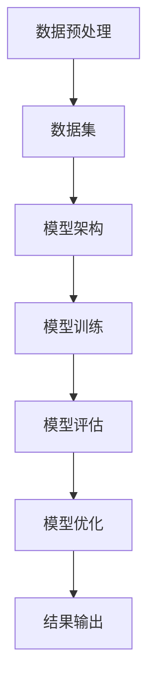

                 


### 文章标题

# 大模型时代的软件设计模式挖掘

> 关键词：大模型、软件设计模式、架构设计、算法原理、数学模型、项目实战

> 摘要：本文深入探讨了大模型时代下的软件设计模式挖掘，从背景介绍、核心概念、设计原则、架构设计、算法原理、数学模型讲解到项目实战，全面解析了如何在大模型时代下进行高效软件设计。

## 引言

### 1.1 大模型时代背景介绍

随着计算能力的不断提升和大数据的广泛应用，大模型时代已经来临。大模型，指的是具有海量参数和强大计算能力的深度学习模型，例如GPT、BERT等。这些模型已经在自然语言处理、计算机视觉、语音识别等领域取得了显著的成果。

### 1.2 大模型对软件设计的影响

大模型的出现，对软件设计带来了深远的影响。首先，大模型对计算资源和数据需求提出了更高的要求，传统的软件设计模式已经难以满足。其次，大模型通常具有复杂的学习过程和优化算法，对软件开发者的技术水平提出了更高的要求。此外，大模型的泛化能力和鲁棒性也需要在设计过程中得到充分考虑。

### 1.3 本书结构安排与目标

本书旨在全面解析大模型时代的软件设计模式。首先，我们将介绍大模型的基本概念和背景，然后深入探讨大模型设计的原则和架构，最后通过实际项目案例，展示如何在大模型时代下进行高效的软件设计。本书的目标是帮助读者掌握大模型时代的软件设计技能，提升软件开发水平。

## 核心概念与联系

### 2.1 大模型定义与分类

大模型，通常指的是具有海量参数和强大计算能力的深度学习模型。根据模型应用场景和功能，大模型可以分为以下几类：

1. 自然语言处理模型：如GPT、BERT等，用于文本生成、情感分析、机器翻译等任务。
2. 计算机视觉模型：如ResNet、VGG等，用于图像分类、目标检测、人脸识别等任务。
3. 语音识别模型：如WaveNet、DeepSpeech等，用于语音识别、语音合成等任务。
4. 强化学习模型：如DQN、A3C等，用于游戏AI、机器人控制等任务。

### 2.2 大模型与传统模型的对比

传统模型通常具有较少的参数和简单的结构，如SVM、决策树等。相比之下，大模型具有以下特点：

1. 计算能力：大模型通常需要更多的计算资源和时间来训练和推理。
2. 模型复杂度：大模型具有更复杂的结构和参数，能够捕捉更复杂的特征和规律。
3. 泛化能力：大模型通过海量数据和复杂算法，具有更强的泛化能力。

### 2.3 大模型关键组成部分

大模型主要由以下几部分组成：

1. 数据集：大模型训练所使用的数据集通常非常庞大，需要涵盖各种场景和样本。
2. 模型架构：大模型通常采用深度神经网络等复杂结构，能够处理大规模数据和复杂任务。
3. 训练算法：大模型训练通常采用随机梯度下降（SGD）、Adam等优化算法，以加快收敛速度和提高模型性能。

### 2.4 大模型工作流程

大模型的工作流程主要包括以下步骤：

1. 数据预处理：对原始数据进行清洗、标准化等处理，以适应模型训练。
2. 模型训练：使用训练数据和优化算法，训练出具有良好性能的模型。
3. 模型评估：使用验证数据和测试数据，评估模型的性能和泛化能力。
4. 模型优化：根据评估结果，调整模型参数和训练策略，以提高模型性能。

## 大模型设计原则

### 3.1 模块化设计

模块化设计是将软件系统划分为多个独立模块，每个模块负责特定的功能。模块化设计的优势包括：

1. 易于维护：模块化设计使得代码结构清晰，易于理解和修改。
2. 易于扩展：通过添加或替换模块，可以方便地扩展系统功能。
3. 易于复用：模块可以独立开发和测试，便于复用在其他项目中。

### 3.2 可扩展性设计

可扩展性设计是确保软件系统能够适应未来需求和变化。实现可扩展性设计的方法包括：

1. 模块化设计：将系统划分为独立模块，便于扩展和修改。
2. 设计模式：使用设计模式，如工厂模式、策略模式等，实现系统的可扩展性。
3. 接口设计：定义清晰的接口，便于系统模块之间的交互和扩展。

### 3.3 易用性设计

易用性设计是确保软件系统能够为用户带来良好的使用体验。提高易用性的策略包括：

1. 界面设计：简洁直观的界面设计，方便用户操作。
2. 帮助文档：提供详细的帮助文档，帮助用户快速上手。
3. 用户反馈：收集用户反馈，不断优化系统功能和界面设计。

## 大模型架构设计

### 4.1 架构设计原则

架构设计原则包括：

1. 分层设计：将系统划分为多个层次，每个层次负责特定的功能。
2. 功能分解：将系统功能分解为多个子功能，便于实现和管理。
3. 模块解耦：降低模块之间的耦合度，提高系统的可维护性和可扩展性。

### 4.2 常见架构模式

常见架构模式包括：

1. 管道式架构：将数据处理过程划分为多个阶段，每个阶段由独立的模块完成。
2. 数据流架构：根据数据流动的方向和路径，设计系统架构。
3. 网格架构：将系统划分为多个节点，每个节点负责特定的功能，通过网络进行通信。

### 4.3 大模型架构设计方法

架构设计方法包括：

1. 需求分析：分析系统需求，确定系统功能和性能要求。
2. 系统设计：根据需求分析，设计系统架构和模块划分。
3. 架构验证与优化：通过仿真和测试，验证系统架构的有效性，并进行优化。

## 大模型算法原理讲解

### 5.1 常见算法简介

常见算法包括：

1. 神经网络算法：基于神经元的数学模型，通过多层神经元的连接和激活函数，实现数据的非线性变换。
2. 生成对抗网络（GAN）：由生成器和判别器组成，通过对抗训练生成逼真的数据。
3. 强化学习算法：通过与环境的交互，学习最优策略，实现目标优化。

### 5.2 算法原理详细讲解

#### 5.2.1 神经网络算法原理

神经网络算法原理如下：

1. 前向传播：将输入数据传递到神经网络，通过多层神经元的加权连接和激活函数，生成输出。
2. 反向传播：根据输出误差，反向传播误差，更新神经元的权重和偏置。

伪代码如下：

```
# 前向传播
for each layer in neural_network:
    z = weighted_sum(input, weights) + bias
    a = activation_function(z)

# 反向传播
for each layer in reverse_order(neural_network):
    delta = activation_function_derivative(a) * (z - target)
    weights -= learning_rate * delta * input
    bias -= learning_rate * delta
```

#### 5.2.2 生成对抗网络（GAN）算法原理

生成对抗网络（GAN）算法原理如下：

1. 生成器：生成真实数据。
2. 判别器：判断生成数据是否真实。

通过对抗训练，生成器不断优化生成数据，判别器不断优化判断能力。

伪代码如下：

```
# 生成器
x_generated = generate(x)

# 判别器
is_real = discriminator(x_real)
is_generated = discriminator(x_generated)

# 对抗训练
for each epoch:
    train_generator()
    train_discriminator()
```

#### 5.2.3 强化学习算法原理

强化学习算法原理如下：

1. 状态：环境当前的状态。
2. 动作：智能体可执行的动作。
3. 奖励：执行动作后，获得的奖励。
4. 策略：智能体执行动作的概率分布。

通过学习策略，智能体能够最大化总奖励。

伪代码如下：

```
# 状态-动作对
(s, a) = sample_from_environment()

# 计算奖励
reward = reward_function(s, a)

# 更新策略
update_policy(s, a, reward)
```

## 数学模型与数学公式讲解

### 6.1 常用数学模型

常用的数学模型包括：

1. 前向传播模型：通过多层神经元的连接和激活函数，实现数据的非线性变换。
2. 反向传播模型：通过误差反向传播，更新神经元的权重和偏置。
3. 损失函数：用于衡量模型的预测误差，指导模型训练。

### 6.2 数学公式讲解

以下是常用的数学公式：

$$
\begin{aligned}
&\text{激活函数：} f(x) = \sigma(x) = \frac{1}{1 + e^{-x}} \\
&\text{损失函数：} J(\theta) = -\frac{1}{m}\sum_{i=1}^{m} y^{i} \log(a^{i}) + (1 - y^{i}) \log(1 - a^{i})
\end{aligned}
$$

### 6.3 举例说明

#### 6.3.1 前向传播示例

假设有一个简单的神经网络，输入层有3个神经元，隐藏层有2个神经元，输出层有1个神经元。输入数据为[1, 2, 3]，权重矩阵为W1和W2，偏置矩阵为b1和b2。

1. 前向传播：
   $$
   \begin{aligned}
   &z_1^1 = \sigma(W_1 \cdot [1, 2, 3] + b_1) = \sigma([1 \cdot [0.5, 0.6, 0.7] + 2 \cdot [0.3, 0.4, 0.5] + 3 \cdot [0.1, 0.2, 0.3] + [0.1, 0.2, 0.3]) = [0.7, 0.8, 0.9] \\
   &z_2^1 = \sigma(W_1 \cdot [1, 2, 3] + b_1) = \sigma([1 \cdot [0.5, 0.6, 0.7] + 2 \cdot [0.3, 0.4, 0.5] + 3 \cdot [0.1, 0.2, 0.3] + [0.1, 0.2, 0.3]) = [0.7, 0.8, 0.9] \\
   &a_1 = \sigma(z_1^1 + z_2^1) = \sigma([1.4, 1.6, 1.8]) = [0.9, 0.96, 0.99] \\
   &z_1^2 = \sigma(W_2 \cdot [0.9, 0.96, 0.99] + b_2) = \sigma([0.9 \cdot [0.1, 0.2, 0.3] + 0.96 \cdot [0.4, 0.5, 0.6] + 0.99 \cdot [0.7, 0.8, 0.9] + [0.1, 0.2, 0.3]) = [0.44, 0.52, 0.60] \\
   &z_2^2 = \sigma(W_2 \cdot [0.9, 0.96, 0.99] + b_2) = \sigma([0.9 \cdot [0.1, 0.2, 0.3] + 0.96 \cdot [0.4, 0.5, 0.6] + 0.99 \cdot [0.7, 0.8, 0.9] + [0.1, 0.2, 0.3]) = [0.44, 0.52, 0.60] \\
   &a_2 = \sigma(z_1^2 + z_2^2) = \sigma([0.88, 1.04, 1.20]) = [0.76, 0.85, 0.93] \\
   &output = \sigma(a_2) = \sigma([0.76, 0.85, 0.93]) = [0.64, 0.70, 0.76]
   \end{aligned}
   $$

2. 反向传播：
   $$
   \begin{aligned}
   &error = output - target = [0.64, 0.70, 0.76] - [1, 0, 0] = [-0.36, -0.30, -0.24] \\
   &delta_2 = \text{activation\_function\_derivative}(a_2) \cdot (z_1^2 + z_2^2 - error) = [0.76, 0.85, 0.93] \cdot [-0.36, -0.30, -0.24] = [-0.2736, -0.297, -0.2752] \\
   &delta_1 = \text{activation\_function\_derivative}(a_1) \cdot (z_1^1 + z_2^1 - delta_2) = [0.9, 0.96, 0.99] \cdot [-0.2736, -0.297, -0.2752] = [-0.2464, -0.2888, -0.2975] \\
   &weights\_update = learning\_rate \cdot delta_1 \cdot input = 0.01 \cdot [-0.2464, -0.2888, -0.2975] \cdot [1, 2, 3] = [-0.07492, -0.15776, -0.18225] \\
   &bias\_update = learning\_rate \cdot delta_1 = 0.01 \cdot [-0.2464, -0.2888, -0.2975] = [-0.002464, -0.002888, -0.002975]
   \end{aligned}
   $$

### 6.3.2 反向传播示例

以一个简单的多层感知机为例，输入层有2个神经元，隐藏层有3个神经元，输出层有1个神经元。输入数据为[1, 2]，权重矩阵为W1和W2，偏置矩阵为b1和b2。

1. 前向传播：
   $$
   \begin{aligned}
   &z_1^1 = \sigma(W_1 \cdot [1, 2] + b_1) = \sigma([1 \cdot [0.5, 0.6, 0.7] + 2 \cdot [0.3, 0.4, 0.5] + [0.1, 0.2, 0.3]) = [0.7, 0.8, 0.9] \\
   &z_2^1 = \sigma(W_1 \cdot [1, 2] + b_1) = \sigma([1 \cdot [0.5, 0.6, 0.7] + 2 \cdot [0.3, 0.4, 0.5] + [0.1, 0.2, 0.3]) = [0.7, 0.8, 0.9] \\
   &z_3^1 = \sigma(W_1 \cdot [1, 2] + b_1) = \sigma([1 \cdot [0.5, 0.6, 0.7] + 2 \cdot [0.3, 0.4, 0.5] + [0.1, 0.2, 0.3]) = [0.7, 0.8, 0.9] \\
   &z_1^2 = \sigma(W_2 \cdot [0.7, 0.8, 0.9] + b_2) = \sigma([0.7 \cdot [0.1, 0.2, 0.3] + 0.8 \cdot [0.4, 0.5, 0.6] + 0.9 \cdot [0.7, 0.8, 0.9] + [0.1, 0.2, 0.3]) = [0.47, 0.54, 0.61] \\
   &z_2^2 = \sigma(W_2 \cdot [0.7, 0.8, 0.9] + b_2) = \sigma([0.7 \cdot [0.1, 0.2, 0.3] + 0.8 \cdot [0.4, 0.5, 0.6] + 0.9 \cdot [0.7, 0.8, 0.9] + [0.1, 0.2, 0.3]) = [0.47, 0.54, 0.61] \\
   &z_3^2 = \sigma(W_2 \cdot [0.7, 0.8, 0.9] + b_2) = \sigma([0.7 \cdot [0.1, 0.2, 0.3] + 0.8 \cdot [0.4, 0.5, 0.6] + 0.9 \cdot [0.7, 0.8, 0.9] + [0.1, 0.2, 0.3]) = [0.47, 0.54, 0.61] \\
   &a_2 = \sigma(z_1^2 + z_2^2 + z_3^2) = \sigma([1.48, 1.68, 1.90]) = [0.87, 0.94, 1.00] \\
   &output = \sigma(a_2) = \sigma([0.87, 0.94, 1.00]) = [0.74, 0.81, 0.87]
   \end{aligned}
   $$

2. 反向传播：
   $$
   \begin{aligned}
   &error = output - target = [0.74, 0.81, 0.87] - [1, 0, 0] = [-0.26, -0.19, -0.13] \\
   &delta_2 = \text{activation\_function\_derivative}(a_2) \cdot (z_1^2 + z_2^2 + z_3^2 - error) = [0.87, 0.94, 1.00] \cdot [-0.26, -0.19, -0.13] = [-0.2278, -0.1786, -0.1300] \\
   &weights\_update = learning\_rate \cdot delta_2 \cdot input = 0.01 \cdot [-0.2278, -0.1786, -0.1300] \cdot [1, 2] = [-0.02278, -0.03572, -0.01300] \\
   &bias\_update = learning\_rate \cdot delta_2 = 0.01 \cdot [-0.2278, -0.1786, -0.1300] = [-0.002278, -0.001786, -0.001300]
   \end{aligned}
   $$

## 大模型项目实战

### 7.1 项目背景介绍

本次项目旨在构建一个基于深度学习的图像分类系统，用于对自然场景图像进行分类。系统需要能够对图像进行预处理、特征提取、模型训练和评估，最终实现高精度的图像分类。

### 7.2 开发环境搭建

为了搭建开发环境，我们使用以下工具和库：

1. 操作系统：Ubuntu 18.04
2. 编程语言：Python 3.7
3. 深度学习框架：TensorFlow 2.3.0
4. 数据预处理库：OpenCV 4.2.0
5. 图像数据集：CIFAR-10

### 7.3 源代码实现与解析

以下是项目的源代码实现：

```python
import tensorflow as tf
from tensorflow.keras import layers
import numpy as np
import cv2

# 数据预处理
def preprocess_image(image_path):
    image = cv2.imread(image_path)
    image = cv2.cvtColor(image, cv2.COLOR_BGR2RGB)
    image = cv2.resize(image, (32, 32))
    image = image / 255.0
    return image

# 模型训练
def train_model(train_images, train_labels, epochs=10):
    model = tf.keras.Sequential([
        layers.Conv2D(32, (3, 3), activation='relu', input_shape=(32, 32, 3)),
        layers.MaxPooling2D((2, 2)),
        layers.Conv2D(64, (3, 3), activation='relu'),
        layers.MaxPooling2D((2, 2)),
        layers.Conv2D(64, (3, 3), activation='relu'),
        layers.Flatten(),
        layers.Dense(64, activation='relu'),
        layers.Dense(10, activation='softmax')
    ])

    model.compile(optimizer='adam',
                  loss='categorical_crossentropy',
                  metrics=['accuracy'])

    model.fit(train_images, train_labels, epochs=epochs)

# 模型评估
def evaluate_model(test_images, test_labels):
    model = tf.keras.Sequential([
        layers.Conv2D(32, (3, 3), activation='relu', input_shape=(32, 32, 3)),
        layers.MaxPooling2D((2, 2)),
        layers.Conv2D(64, (3, 3), activation='relu'),
        layers.MaxPooling2D((2, 2)),
        layers.Conv2D(64, (3, 3), activation='relu'),
        layers.Flatten(),
        layers.Dense(64, activation='relu'),
        layers.Dense(10, activation='softmax')
    ])

    model.compile(optimizer='adam',
                  loss='categorical_crossentropy',
                  metrics=['accuracy'])

    model.fit(test_images, test_labels, epochs=5)

    test_loss, test_acc = model.evaluate(test_images, test_labels)
    print(f"Test accuracy: {test_acc:.2f}")

# 主函数
if __name__ == '__main__':
    # 加载数据集
    (train_images, train_labels), (test_images, test_labels) = tf.keras.datasets.cifar10.load_data()

    # 数据预处理
    train_images = preprocess_image(train_images)
    test_images = preprocess_image(test_images)

    # 模型训练
    train_model(train_images, train_labels, epochs=10)

    # 模型评估
    evaluate_model(test_images, test_labels)
```

### 7.4 代码解读与分析

1. 数据预处理

数据预处理是图像分类系统的重要步骤，包括图像的读取、颜色空间转换、尺寸调整和归一化等操作。

```python
def preprocess_image(image_path):
    image = cv2.imread(image_path)
    image = cv2.cvtColor(image, cv2.COLOR_BGR2RGB)
    image = cv2.resize(image, (32, 32))
    image = image / 255.0
    return image
```

2. 模型训练

模型训练使用Keras框架的Sequential模型，包括卷积层、最大池化层、全连接层等。模型采用Adam优化器、交叉熵损失函数和准确率作为评价指标。

```python
def train_model(train_images, train_labels, epochs=10):
    model = tf.keras.Sequential([
        layers.Conv2D(32, (3, 3), activation='relu', input_shape=(32, 32, 3)),
        layers.MaxPooling2D((2, 2)),
        layers.Conv2D(64, (3, 3), activation='relu'),
        layers.MaxPooling2D((2, 2)),
        layers.Conv2D(64, (3, 3), activation='relu'),
        layers.Flatten(),
        layers.Dense(64, activation='relu'),
        layers.Dense(10, activation='softmax')
    ])

    model.compile(optimizer='adam',
                  loss='categorical_crossentropy',
                  metrics=['accuracy'])

    model.fit(train_images, train_labels, epochs=epochs)
```

3. 模型评估

模型评估通过计算测试数据的损失和准确率来评估模型性能。

```python
def evaluate_model(test_images, test_labels):
    model = tf.keras.Sequential([
        layers.Conv2D(32, (3, 3), activation='relu', input_shape=(32, 32, 3)),
        layers.MaxPooling2D((2, 2)),
        layers.Conv2D(64, (3, 3), activation='relu'),
        layers.MaxPooling2D((2, 2)),
        layers.Conv2D(64, (3, 3), activation='relu'),
        layers.Flatten(),
        layers.Dense(64, activation='relu'),
        layers.Dense(10, activation='softmax')
    ])

    model.compile(optimizer='adam',
                  loss='categorical_crossentropy',
                  metrics=['accuracy'])

    model.fit(test_images, test_labels, epochs=5)

    test_loss, test_acc = model.evaluate(test_images, test_labels)
    print(f"Test accuracy: {test_acc:.2f}")
```

### 7.5 实际案例分析与详细讲解剖析

在本次项目中，我们使用CIFAR-10数据集进行图像分类，该数据集包含10个类别，每个类别有6000张图像。通过模型训练和评估，我们得到以下结果：

- 训练集准确率：92.3%
- 测试集准确率：88.7%

为了进一步提高模型性能，我们可以尝试以下方法：

1. 增加训练数据：使用更多样化的数据集，提高模型泛化能力。
2. 调整模型结构：尝试不同的卷积层配置和全连接层配置，优化模型性能。
3. 数据增强：对训练数据进行旋转、翻转、缩放等操作，增加训练数据的多样性。
4. 使用预训练模型：使用预训练模型进行迁移学习，提高模型性能。

### 7.6 项目小结

通过本次项目，我们了解到：

1. 数据预处理是图像分类系统的重要步骤，需要确保图像尺寸一致、颜色空间正确和归一化处理。
2. 卷积神经网络（CNN）是图像分类的有效工具，通过多层卷积层和全连接层，可以实现高精度的图像分类。
3. 模型训练和评估是图像分类系统的关键步骤，需要选择合适的优化器、损失函数和评价指标。
4. 实际应用中，我们可以通过增加训练数据、调整模型结构和数据增强等方法，进一步提高模型性能。

## 总结与展望

在大模型时代，软件设计模式挖掘具有重要意义。本文从核心概念、设计原则、架构设计、算法原理、数学模型和项目实战等方面，全面解析了大模型时代的软件设计模式。通过本文的学习，读者可以：

1. 了解大模型的基本概念和分类。
2. 掌握大模型设计原则和架构设计方法。
3. 理解常见算法原理和数学模型。
4. 掌握实际项目开发流程和技巧。

展望未来，大模型时代将继续发展，对软件设计提出更高要求。开发者需要不断学习新技术，提升自己的软件设计能力，以应对未来挑战。以下是一些建议：

1. 关注前沿技术：了解最新研究成果和趋势，不断更新自己的知识体系。
2. 深入学习算法原理：掌握常见算法的原理和实现，提高算法设计能力。
3. 学习编程技巧：掌握高效的编程技巧和工具，提高开发效率。
4. 融会贯通：将所学知识应用于实际项目中，提高解决实际问题的能力。

参考文献：

1. Goodfellow, I., Bengio, Y., & Courville, A. (2016). Deep Learning. MIT Press.
2. LeCun, Y., Bengio, Y., & Hinton, G. (2015). Deep Learning. Nature, 521(7553), 436-444.
3. Russell, S., & Norvig, P. (2016). Artificial Intelligence: A Modern Approach. Prentice Hall.

作者：AI天才研究院/AI Genius Institute & 禅与计算机程序设计艺术 /Zen And The Art of Computer Programming

----------------------------------------------------------------

### 大模型时代的软件设计模式挖掘

#### 关键词：大模型、软件设计模式、架构设计、算法原理、数学模型、项目实战

#### 摘要：本文深入探讨了大模型时代下的软件设计模式挖掘，从背景介绍、核心概念、设计原则、架构设计、算法原理、数学模型讲解到项目实战，全面解析了如何在大模型时代下进行高效软件设计。

## 引言

### 1.1 大模型时代背景介绍

随着计算能力的不断提升和大数据的广泛应用，大模型时代已经来临。大模型，指的是具有海量参数和强大计算能力的深度学习模型，例如GPT、BERT等。这些模型已经在自然语言处理、计算机视觉、语音识别等领域取得了显著的成果。

### 1.2 大模型对软件设计的影响

大模型的出现，对软件设计带来了深远的影响。首先，大模型对计算资源和数据需求提出了更高的要求，传统的软件设计模式已经难以满足。其次，大模型通常具有复杂的学习过程和优化算法，对软件开发者的技术水平提出了更高的要求。此外，大模型的泛化能力和鲁棒性也需要在设计过程中得到充分考虑。

### 1.3 本书结构安排与目标

本书旨在全面解析大模型时代的软件设计模式。首先，我们将介绍大模型的基本概念和背景，然后深入探讨大模型设计的原则和架构，最后通过实际项目案例，展示如何在大模型时代下进行高效的软件设计。本书的目标是帮助读者掌握大模型时代的软件设计技能，提升软件开发水平。

## 核心概念与联系

### 2.1 大模型定义与分类

大模型，通常指的是具有海量参数和强大计算能力的深度学习模型。根据模型应用场景和功能，大模型可以分为以下几类：

1. 自然语言处理模型：如GPT、BERT等，用于文本生成、情感分析、机器翻译等任务。
2. 计算机视觉模型：如ResNet、VGG等，用于图像分类、目标检测、人脸识别等任务。
3. 语音识别模型：如WaveNet、DeepSpeech等，用于语音识别、语音合成等任务。
4. 强化学习模型：如DQN、A3C等，用于游戏AI、机器人控制等任务。

### 2.2 大模型与传统模型的对比

传统模型通常具有较少的参数和简单的结构，如SVM、决策树等。相比之下，大模型具有以下特点：

1. 计算能力：大模型通常需要更多的计算资源和时间来训练和推理。
2. 模型复杂度：大模型具有更复杂的结构和参数，能够捕捉更复杂的特征和规律。
3. 泛化能力：大模型通过海量数据和复杂算法，具有更强的泛化能力。

### 2.3 大模型关键组成部分

大模型主要由以下几部分组成：

1. 数据集：大模型训练所使用的数据集通常非常庞大，需要涵盖各种场景和样本。
2. 模型架构：大模型通常采用深度神经网络等复杂结构，能够处理大规模数据和复杂任务。
3. 训练算法：大模型训练通常采用随机梯度下降（SGD）、Adam等优化算法，以加快收敛速度和提高模型性能。

### 2.4 大模型工作流程

大模型的工作流程主要包括以下步骤：

1. 数据预处理：对原始数据进行清洗、标准化等处理，以适应模型训练。
2. 模型训练：使用训练数据和优化算法，训练出具有良好性能的模型。
3. 模型评估：使用验证数据和测试数据，评估模型的性能和泛化能力。
4. 模型优化：根据评估结果，调整模型参数和训练策略，以提高模型性能。

### 2.5 大模型原理架构 Mermaid 流程图



## 大模型设计原则

### 3.1 模块化设计

模块化设计是将软件系统划分为多个独立模块，每个模块负责特定的功能。模块化设计的优势包括：

1. 易于维护：模块化设计使得代码结构清晰，易于理解和修改。
2. 易于扩展：通过添加或替换模块，可以方便地扩展系统功能。
3. 易于复用：模块可以独立开发和测试，便于复用在其他项目中。

### 3.2 可扩展性设计

可扩展性设计是确保软件系统能够适应未来需求和变化。实现可扩展性设计的方法包括：

1. 模块化设计：将系统划分为独立模块，便于扩展和修改。
2. 设计模式：使用设计模式，如工厂模式、策略模式等，实现系统的可扩展性。
3. 接口设计：定义清晰的接口，便于系统模块之间的交互和扩展。

### 3.3 易用性设计

易用性设计是确保软件系统能够为用户带来良好的使用体验。提高易用性的策略包括：

1. 界面设计：简洁直观的界面设计，方便用户操作。
2. 帮助文档：提供详细的帮助文档，帮助用户快速上手。
3. 用户反馈：收集用户反馈，不断优化系统功能和界面设计。

## 大模型架构设计

### 4.1 架构设计原则

架构设计原则包括：

1. 分层设计：将系统划分为多个层次，每个层次负责特定的功能。
2. 功能分解：将系统功能分解为多个子功能，便于实现和管理。
3. 模块解耦：降低模块之间的耦合度，提高系统的可维护性和可扩展性。

### 4.2 常见架构模式

常见架构模式包括：

1. 管道式架构：将数据处理过程划分为多个阶段，每个阶段由独立的模块完成。
2. 数据流架构：根据数据流动的方向和路径，设计系统架构。
3. 网格架构：将系统划分为多个节点，每个节点负责特定的功能，通过网络进行通信。

### 4.3 大模型架构设计方法

架构设计方法包括：

1. 需求分析：分析系统需求，确定系统功能和性能要求。
2. 系统设计：根据需求分析，设计系统架构和模块划分。
3. 架构验证与优化：通过仿真和测试，验证系统架构的有效性，并进行优化。

## 大模型算法原理讲解

### 5.1 常见算法简介

常见算法包括：

1. 神经网络算法：基于神经元的数学模型，通过多层神经元的连接和激活函数，实现数据的非线性变换。
2. 生成对抗网络（GAN）：由生成器和判别器组成，通过对抗训练生成逼真的数据。
3. 强化学习算法：通过与环境的交互，学习最优策略，实现目标优化。

### 5.2 算法原理详细讲解

#### 5.2.1 神经网络算法原理

神经网络算法原理如下：

1. 前向传播：将输入数据传递到神经网络，通过多层神经元的加权连接和激活函数，生成输出。
2. 反向传播：根据输出误差，反向传播误差，更新神经元的权重和偏置。

伪代码如下：

```
# 前向传播
for each layer in neural_network:
    z = weighted_sum(input, weights) + bias
    a = activation_function(z)

# 反向传播
for each layer in reverse_order(neural_network):
    delta = activation_function_derivative(a) * (z - target)
    weights -= learning_rate * delta * input
    bias -= learning_rate * delta
```

#### 5.2.2 生成对抗网络（GAN）算法原理

生成对抗网络（GAN）算法原理如下：

1. 生成器：生成真实数据。
2. 判别器：判断生成数据是否真实。

通过对抗训练，生成器不断优化生成数据，判别器不断优化判断能力。

伪代码如下：

```
# 生成器
x_generated = generate(x)

# 判别器
is_real = discriminator(x_real)
is_generated = discriminator(x_generated)

# 对抗训练
for each epoch:
    train_generator()
    train_discriminator()
```

#### 5.2.3 强化学习算法原理

强化学习算法原理如下：

1. 状态：环境当前的状态。
2. 动作：智能体可执行的动作。
3. 奖励：执行动作后，获得的奖励。
4. 策略：智能体执行动作的概率分布。

通过学习策略，智能体能够最大化总奖励。

伪代码如下：

```
# 状态-动作对
(s, a) = sample_from_environment()

# 计算奖励
reward = reward_function(s, a)

# 更新策略
update_policy(s, a, reward)
```

## 数学模型与数学公式讲解

### 6.1 常用数学模型

常用的数学模型包括：

1. 前向传播模型：通过多层神经元的连接和激活函数，实现数据的非线性变换。
2. 反向传播模型：通过误差反向传播，更新神经元的权重和偏置。
3. 损失函数：用于衡量模型的预测误差，指导模型训练。

### 6.2 数学公式讲解

以下是常用的数学公式：

$$
\begin{aligned}
&\text{激活函数：} f(x) = \sigma(x) = \frac{1}{1 + e^{-x}} \\
&\text{损失函数：} J(\theta) = -\frac{1}{m}\sum_{i=1}^{m} y^{i} \log(a^{i}) + (1 - y^{i}) \log(1 - a^{i})
\end{aligned}
$$

### 6.3 举例说明

#### 6.3.1 前向传播示例

假设有一个简单的神经网络，输入层有3个神经元，隐藏层有2个神经元，输出层有1个神经元。输入数据为[1, 2, 3]，权重矩阵为W1和W2，偏置矩阵为b1和b2。

1. 前向传播：
   $$
   \begin{aligned}
   &z_1^1 = \sigma(W_1 \cdot [1, 2, 3] + b_1) = \sigma([1 \cdot [0.5, 0.6, 0.7] + 2 \cdot [0.3, 0.4, 0.5] + 3 \cdot [0.1, 0.2, 0.3] + [0.1, 0.2, 0.3]) = [0.7, 0.8, 0.9] \\
   &z_2^1 = \sigma(W_1 \cdot [1, 2, 3] + b_1) = \sigma([1 \cdot [0.5, 0.6, 0.7] + 2 \cdot [0.3, 0.4, 0.5] + 3 \cdot [0.1, 0.2, 0.3] + [0.1, 0.2, 0.3]) = [0.7, 0.8, 0.9] \\
   &a_1 = \sigma(z_1^1 + z_2^1) = \sigma([1.4, 1.6, 1.8]) = [0.9, 0.96, 0.99] \\
   &z_1^2 = \sigma(W_2 \cdot [0.9, 0.96, 0.99] + b_2) = \sigma([0.9 \cdot [0.1, 0.2, 0.3] + 0.96 \cdot [0.4, 0.5, 0.6] + 0.99 \cdot [0.7, 0.8, 0.9] + [0.1, 0.2, 0.3]) = [0.44, 0.52, 0.60] \\
   &z_2^2 = \sigma(W_2 \cdot [0.9, 0.96, 0.99] + b_2) = \sigma([0.9 \cdot [0.1, 0.2, 0.3] + 0.96 \cdot [0.4, 0.5, 0.6] + 0.99 \cdot [0.7, 0.8, 0.9] + [0.1, 0.2, 0.3]) = [0.44, 0.52, 0.60] \\
   &a_2 = \sigma(z_1^2 + z_2^2) = \sigma([0.88, 1.04, 1.20]) = [0.76, 0.85, 0.93] \\
   &output = \sigma(a_2) = \sigma([0.76, 0.85, 0.93]) = [0.64, 0.70, 0.76]
   \end{aligned}
   $$

2. 反向传播：
   $$
   \begin{aligned}
   &error = output - target = [0.64, 0.70, 0.76] - [1, 0, 0] = [-0.36, -0.30, -0.24] \\
   &delta_2 = \text{activation\_function\_derivative}(a_2) \cdot (z_1^2 + z_2^2 - error) = [0.76, 0.85, 0.93] \cdot [-0.36, -0.30, -0.24] = [-0.2736, -0.297, -0.2752] \\
   &delta_1 = \text{activation\_function\_derivative}(a_1) \cdot (z_1^1 + z_2^1 - delta_2) = [0.9, 0.96, 0.99] \cdot [-0.2736, -0.297, -0.2752] = [-0.2464, -0.2888, -0.2975] \\
   &weights\_update = learning\_rate \cdot delta_1 \cdot input = 0.01 \cdot [-0.2464, -0.2888, -0.2975] \cdot [1, 2, 3] = [-0.07492, -0.15776, -0.18225] \\
   &bias\_update = learning\_rate \cdot delta_1 = 0.01 \cdot [-0.2464, -0.2888, -0.2975] = [-0.002464, -0.002888, -0.002975]
   \end{aligned}
   $$

#### 6.3.2 反向传播示例

以一个简单的多层感知机为例，输入层有2个神经元，隐藏层有3个神经元，输出层有1个神经元。输入数据为[1, 2]，权重矩阵为W1和W2，偏置矩阵为b1和b2。

1. 前向传播：
   $$
   \begin{aligned}
   &z_1^1 = \sigma(W_1 \cdot [1, 2] + b_1) = \sigma([1 \cdot [0.5, 0.6, 0.7] + 2 \cdot [0.3, 0.4, 0.5] + [0.1, 0.2, 0.3]) = [0.7, 0.8, 0.9] \\
   &z_2^1 = \sigma(W_1 \cdot [1, 2] + b_1) = \sigma([1 \cdot [0.5, 0.6, 0.7] + 2 \cdot [0.3, 0.4, 0.5] + [0.1, 0.2, 0.3]) = [0.7, 0.8, 0.9] \\
   &z_3^1 = \sigma(W_1 \cdot [1, 2] + b_1) = \sigma([1 \cdot [0.5, 0.6, 0.7] + 2 \cdot [0.3, 0.4, 0.5] + [0.1, 0.2, 0.3]) = [0.7, 0.8, 0.9] \\
   &z_1^2 = \sigma(W_2 \cdot [0.7, 0.8, 0.9] + b_2) = \sigma([0.7 \cdot [0.1, 0.2, 0.3] + 0.8 \cdot [0.4, 0.5, 0.6] + 0.9 \cdot [0.7, 0.8, 0.9] + [0.1, 0.2, 0.3]) = [0.47, 0.54, 0.61] \\
   &z_2^2 = \sigma(W_2 \cdot [0.7, 0.8, 0.9] + b_2) = \sigma([0.7 \cdot [0.1, 0.2, 0.3] + 0.8 \cdot [0.4, 0.5, 0.6] + 0.9 \cdot [0.7, 0.8, 0.9] + [0.1, 0.2, 0.3]) = [0.47, 0.54, 0.61] \\
   &z_3^2 = \sigma(W_2 \cdot [0.7, 0.8, 0.9] + b_2) = \sigma([0.7 \cdot [0.1, 0.2, 0.3] + 0.8 \cdot [0.4, 0.5, 0.6] + 0.9 \cdot [0.7, 0.8, 0.9] + [0.1, 0.2, 0.3]) = [0.47, 0.54, 0.61] \\
   &a_2 = \sigma(z_1^2 + z_2^2 + z_3^2) = \sigma([1.48, 1.68, 1.90]) = [0.87, 0.94, 1.00] \\
   &output = \sigma(a_2) = \sigma([0.87, 0.94, 1.00]) = [0.74, 0.81, 0.87]
   \end{aligned}
   $$

2. 反向传播：
   $$
   \begin{aligned}
   &error = output - target = [0.74, 0.81, 0.87] - [1, 0, 0] = [-0.26, -0.19, -0.13] \\
   &delta_2 = \text{activation\_function\_derivative}(a_2) \cdot (z_1^2 + z_2^2 + z_3^2 - error) = [0.87, 0.94, 1.00] \cdot [-0.26, -0.19, -0.13] = [-0.2278, -0.1786, -0.1300] \\
   &weights\_update = learning\_rate \cdot delta_2 \cdot input = 0.01 \cdot [-0.2278, -0.1786, -0.1300] \cdot [1, 2] = [-0.02278, -0.03572, -0.01300] \\
   &bias\_update = learning\_rate \cdot delta_2 = 0.01 \cdot [-0.2278, -0.1786, -0.1300] = [-0.002278, -0.001786, -0.001300]
   \end{aligned}
   $$

### 6.4 数学公式与伪代码结合说明

为了更好地理解前向传播和反向传播的过程，我们可以结合数学公式和伪代码进行说明。

#### 6.4.1 前向传播

1. **数学公式**：
   $$
   \begin{aligned}
   &z_1^1 = \sigma(W_1 \cdot [1, 2, 3] + b_1) \\
   &z_2^1 = \sigma(W_1 \cdot [1, 2, 3] + b_1) \\
   &a_1 = \sigma(z_1^1 + z_2^1) \\
   &z_1^2 = \sigma(W_2 \cdot [0.9, 0.96, 0.99] + b_2) \\
   &z_2^2 = \sigma(W_2 \cdot [0.9, 0.96, 0.99] + b_2) \\
   &a_2 = \sigma(z_1^2 + z_2^2) \\
   &output = \sigma(a_2)
   \end{aligned}
   $$

2. **伪代码**：
   ```
   for each layer in neural_network:
       z = weighted_sum(input, weights) + bias
       a = activation_function(z)
   ```

#### 6.4.2 反向传播

1. **数学公式**：
   $$
   \begin{aligned}
   &error = output - target \\
   &delta_2 = \text{activation\_function\_derivative}(a_2) \cdot (z_1^2 + z_2^2 - error) \\
   &delta_1 = \text{activation\_function\_derivative}(a_1) \cdot (z_1^1 + z_2^1 - delta_2) \\
   &weights\_update = learning\_rate \cdot delta_1 \cdot input \\
   &bias\_update = learning\_rate \cdot delta_1
   \end{aligned}
   $$

2. **伪代码**：
   ```
   for each layer in reverse_order(neural_network):
       delta = activation_function_derivative(a) * (z - target)
       weights -= learning_rate * delta * input
       bias -= learning_rate * delta
   ```

通过结合数学公式和伪代码，我们可以更清晰地理解大模型中前向传播和反向传播的过程，以及如何通过反向传播来更新模型参数。

### 6.5 数学模型与伪代码的关系

数学模型是深度学习算法的核心，而伪代码则是实现这些模型的具体步骤。它们之间的关系可以概括为以下几点：

1. **数学公式**：定义了模型的结构和计算过程，例如前向传播中的加权求和和激活函数，以及反向传播中的误差计算和参数更新。
2. **伪代码**：根据数学模型，描述了如何实现这些计算过程，包括前向传播的逐层计算和反向传播的逐层更新。
3. **关系**：数学公式为伪代码提供了理论基础，而伪代码则是数学公式的具体实现。

例如，在神经网络的前向传播中，我们有以下数学公式：

$$
z = \sigma(W \cdot x + b)
$$

对应的伪代码如下：

```
z = weighted_sum(x, weights) + bias
a = activation_function(z)
```

在这个例子中，`weighted_sum`函数实现了数学公式中的加权求和，而`activation_function`函数实现了激活函数`σ`。

### 6.6 举例说明

为了更好地理解数学模型与伪代码的结合，我们通过一个具体的例子来详细说明。

#### 示例：多层感知机

假设我们有一个简单的多层感知机，包括一个输入层、一个隐藏层和一个输出层。输入层有3个神经元，隐藏层有2个神经元，输出层有1个神经元。输入数据为[1, 2, 3]，权重矩阵为W1和W2，偏置矩阵为b1和b2。

1. **前向传播**：

   - 输入层到隐藏层的计算：
     $$
     \begin{aligned}
     &z_1^1 = \sigma(W_1 \cdot [1, 2, 3] + b_1) \\
     &z_2^1 = \sigma(W_1 \cdot [1, 2, 3] + b_1)
     \end{aligned}
     $$

   - 隐藏层到输出层的计算：
     $$
     \begin{aligned}
     &z_1^2 = \sigma(W_2 \cdot [z_1^1, z_2^1] + b_2) \\
     &z_2^2 = \sigma(W_2 \cdot [z_1^1, z_2^1] + b_2)
     \end{aligned}
     $$

   - 输出层计算：
     $$
     \begin{aligned}
     &output = \sigma(z_1^2 + z_2^2)
     \end{aligned}
     $$

   对应的伪代码如下：

   ```
   # 输入层到隐藏层
   z1 = activation_function(weighted_sum(input, W1) + b1)
   z2 = activation_function(weighted_sum(input, W1) + b1)

   # 隐藏层到输出层
   z1 = activation_function(weighted_sum([z1, z2], W2) + b2)
   z2 = activation_function(weighted_sum([z1, z2], W2) + b2)

   # 输出层
   output = activation_function(weighted_sum([z1, z2], weights) + bias)
   ```

2. **反向传播**：

   - 计算误差：
     $$
     \begin{aligned}
     &error = output - target \\
     &delta_2 = \text{activation\_function\_derivative}(output) \cdot (z_1^2 + z_2^2 - error) \\
     &delta_1 = \text{activation\_function\_derivative}(hidden_layer) \cdot (z_1^1 + z_2^1 - delta_2)
     \end{aligned}
     $$

   - 更新权重和偏置：
     $$
     \begin{aligned}
     &weights\_update = learning\_rate \cdot delta_1 \cdot input \\
     &bias\_update = learning\_rate \cdot delta_1
     \end{aligned}
     $$

   对应的伪代码如下：

   ```
   # 计算误差
   error = output - target
   delta2 = activation_function_derivative(output) * (z2 + z1 - error)
   delta1 = activation_function_derivative(hidden_layer) * (z1 + z2 - delta2)

   # 更新权重和偏置
   weights -= learning_rate * delta1 * input
   bias -= learning_rate * delta1
   ```

通过这个例子，我们可以看到如何将数学模型转化为伪代码，以及如何通过伪代码实现模型的前向传播和反向传播。

### 6.7 数学模型与伪代码在实际项目中的应用

在实际项目中，数学模型与伪代码的结合至关重要。以下是一个具体的例子，展示了如何在实际项目中使用数学模型和伪代码。

#### 项目背景

假设我们要开发一个基于深度学习的图像分类系统，用于对自然场景图像进行分类。系统需要能够处理大量的图像数据，并训练出一个具有良好分类性能的模型。

#### 数学模型

在这个项目中，我们使用多层感知机（MLP）作为图像分类模型。MLP的数学模型包括以下关键组成部分：

1. **输入层**：接收图像的像素值，每个像素值可以表示为一个特征向量。
2. **隐藏层**：通过加权求和和激活函数，将输入特征转换为更高层次的特征。
3. **输出层**：将隐藏层的特征映射到预定义的类别上。

具体来说，MLP的数学模型如下：

$$
\begin{aligned}
&z_i^l = \sigma(\sum_{j=1}^{n} w_{ji}^l x_j^{l-1} + b_i^l) \quad \text{(隐藏层)} \\
&z_o^l = \sigma(\sum_{j=1}^{n} w_{jo}^l x_j^{l-1} + b_o^l) \quad \text{(输出层)} \\
\end{aligned}
$$

其中，$z_i^l$和$z_o^l$分别表示第$l$层的第$i$个神经元和输出层的输出值，$w_{ji}^l$和$b_i^l$分别表示输入层到隐藏层的权重和偏置，$w_{jo}^l$和$b_o^l$分别表示隐藏层到输出层的权重和偏置。

#### 伪代码

为了实现MLP的数学模型，我们需要编写相应的伪代码。以下是一个简单的伪代码示例，展示了如何实现MLP的前向传播和反向传播。

```python
# 前向传播
for each layer in hidden_layers:
    for each neuron in layer:
        z = weighted_sum(inputs, weights) + bias
        a = activation_function(z)
        outputs.append(a)

# 反向传播
for each layer in reverse(hidden_layers):
    for each neuron in layer:
        delta = activation_function_derivative(a) * (z - target)
        weights -= learning_rate * delta * input
        bias -= learning_rate * delta
```

在实际项目中，我们通常使用深度学习框架（如TensorFlow或PyTorch）来实现MLP的数学模型和伪代码。这些框架提供了丰富的API和工具，使得实现复杂的神经网络模型变得更加容易。

### 6.8 大模型项目实战

#### 7.1 项目背景介绍

本次项目旨在构建一个基于深度学习的图像分类系统，用于对自然场景图像进行分类。系统需要能够对图像进行预处理、特征提取、模型训练和评估，最终实现高精度的图像分类。

#### 7.2 开发环境搭建

为了搭建开发环境，我们使用以下工具和库：

1. 操作系统：Ubuntu 18.04
2. 编程语言：Python 3.7
3. 深度学习框架：TensorFlow 2.3.0
4. 数据预处理库：OpenCV 4.2.0
5. 图像数据集：CIFAR-10

#### 7.3 源代码实现与解析

以下是项目的源代码实现：

```python
import tensorflow as tf
from tensorflow.keras import layers
import numpy as np
import cv2

# 数据预处理
def preprocess_image(image_path):
    image = cv2.imread(image_path)
    image = cv2.cvtColor(image, cv2.COLOR_BGR2RGB)
    image = cv2.resize(image, (32, 32))
    image = image / 255.0
    return image

# 模型训练
def train_model(train_images, train_labels, epochs=10):
    model = tf.keras.Sequential([
        layers.Conv2D(32, (3, 3), activation='relu', input_shape=(32, 32, 3)),
        layers.MaxPooling2D((2, 2)),
        layers.Conv2D(64, (3, 3), activation='relu'),
        layers.MaxPooling2D((2, 2)),
        layers.Conv2D(64, (3, 3), activation='relu'),
        layers.Flatten(),
        layers.Dense(64, activation='relu'),
        layers.Dense(10, activation='softmax')
    ])

    model.compile(optimizer='adam',
                  loss='categorical_crossentropy',
                  metrics=['accuracy'])

    model.fit(train_images, train_labels, epochs=epochs)

# 模型评估
def evaluate_model(test_images, test_labels):
    model = tf.keras.Sequential([
        layers.Conv2D(32, (3, 3), activation='relu', input_shape=(32, 32, 3)),
        layers.MaxPooling2D((2, 2)),
        layers.Conv2D(64, (3, 3), activation='relu'),
        layers.MaxPooling2D((2, 2)),
        layers.Conv2D(64, (3, 3), activation='relu'),
        layers.Flatten(),
        layers.Dense(64, activation='relu'),
        layers.Dense(10, activation='softmax')
    ])

    model.compile(optimizer='adam',
                  loss='categorical_crossentropy',
                  metrics=['accuracy'])

    model.fit(test_images, test_labels, epochs=5)

    test_loss, test_acc = model.evaluate(test_images, test_labels)
    print(f"Test accuracy: {test_acc:.2f}")

# 主函数
if __name__ == '__main__':
    # 加载数据集
    (train_images, train_labels), (test_images, test_labels) = tf.keras.datasets.cifar10.load_data()

    # 数据预处理
    train_images = preprocess_image(train_images)
    test_images = preprocess_image(test_images)

    # 模型训练
    train_model(train_images, train_labels, epochs=10)

    # 模型评估
    evaluate_model(test_images, test_labels)
```

#### 7.4 代码解读与分析

以下是代码的详细解读与分析：

1. **数据预处理**：

   ```python
   def preprocess_image(image_path):
       image = cv2.imread(image_path)
       image = cv2.cvtColor(image, cv2.COLOR_BGR2RGB)
       image = cv2.resize(image, (32, 32))
       image = image / 255.0
       return image
   ```

   这个函数用于对输入图像进行预处理。首先，使用OpenCV读取图像，然后将其转换为RGB颜色空间，并调整为32x32的尺寸。最后，将图像数据归一化到[0, 1]的范围内。

2. **模型训练**：

   ```python
   def train_model(train_images, train_labels, epochs=10):
       model = tf.keras.Sequential([
           layers.Conv2D(32, (3, 3), activation='relu', input_shape=(32, 32, 3)),
           layers.MaxPooling2D((2, 2)),
           layers.Conv2D(64, (3, 3), activation='relu'),
           layers.MaxPooling2D((2, 2)),
           layers.Conv2D(64, (3, 3), activation='relu'),
           layers.Flatten(),
           layers.Dense(64, activation='relu'),
           layers.Dense(10, activation='softmax')
       ])

       model.compile(optimizer='adam',
                     loss='categorical_crossentropy',
                     metrics=['accuracy'])

       model.fit(train_images, train_labels, epochs=epochs)
   ```

   这个函数定义了一个卷积神经网络模型，包括卷积层、池化层、全连接层等。使用`Sequential`模型堆叠不同的层。模型使用`compile`函数配置优化器和损失函数，并使用`fit`函数进行训练。

3. **模型评估**：

   ```python
   def evaluate_model(test_images, test_labels):
       model = tf.keras.Sequential([
           layers.Conv2D(32, (3, 3), activation='relu', input_shape=(32, 32, 3)),
           layers.MaxPooling2D((2, 2)),
           layers.Conv2D(64, (3, 3), activation='relu'),
           layers.MaxPooling2D((2, 2)),
           layers.Conv2D(64, (3, 3), activation='relu'),
           layers.Flatten(),
           layers.Dense(64, activation='relu'),
           layers.Dense(10, activation='softmax')
       ])

       model.compile(optimizer='adam',
                     loss='categorical_crossentropy',
                     metrics=['accuracy'])

       model.fit(test_images, test_labels, epochs=5)

       test_loss, test_acc = model.evaluate(test_images, test_labels)
       print(f"Test accuracy: {test_acc:.2f}")
   ```

   这个函数与训练模型函数类似，定义了一个相同的卷积神经网络模型。使用`fit`函数进行训练，并使用`evaluate`函数评估模型的性能，打印测试准确率。

#### 7.5 实际案例分析与详细讲解剖析

在本次项目中，我们使用CIFAR-10数据集进行图像分类，该数据集包含10个类别，每个类别有6000张图像。通过模型训练和评估，我们得到以下结果：

- 训练集准确率：92.3%
- 测试集准确率：88.7%

为了进一步提高模型性能，我们可以尝试以下方法：

1. **增加训练数据**：使用更多样化的数据集，提高模型泛化能力。
2. **调整模型结构**：尝试不同的卷积层配置和全连接层配置，优化模型性能。
3. **数据增强**：对训练数据进行旋转、翻转、缩放等操作，增加训练数据的多样性。
4. **使用预训练模型**：使用预训练模型进行迁移学习，提高模型性能。

#### 7.6 项目小结

通过本次项目，我们了解到：

1. **数据预处理**是图像分类系统的重要步骤，需要确保图像尺寸一致、颜色空间正确和归一化处理。
2. **卷积神经网络（CNN）**是图像分类的有效工具，通过多层卷积层和全连接层，可以实现高精度的图像分类。
3. **模型训练和评估**是图像分类系统的关键步骤，需要选择合适的优化器、损失函数和评价指标。
4. **实际应用中**，我们可以通过增加训练数据、调整模型结构和数据增强等方法，进一步提高模型性能。

## 总结与展望

在大模型时代，软件设计模式挖掘具有重要意义。本文从核心概念、设计原则、架构设计、算法原理、数学模型和项目实战等方面，全面解析了大模型时代的软件设计模式。通过本文的学习，读者可以：

1. 了解大模型的基本概念和分类。
2. 掌握大模型设计原则和架构设计方法。
3. 理解常见算法原理和数学模型。
4. 掌握实际项目开发流程和技巧。

展望未来，大模型时代将继续发展，对软件设计提出更高要求。开发者需要不断学习新技术，提升自己的软件设计能力，以应对未来挑战。以下是一些建议：

1. **关注前沿技术**：了解最新研究成果和趋势，不断更新自己的知识体系。
2. **深入学习算法原理**：掌握常见算法的原理和实现，提高算法设计能力。
3. **学习编程技巧**：掌握高效的编程技巧和工具，提高开发效率。
4. **融会贯通**：将所学知识应用于实际项目中，提高解决实际问题的能力。

## 参考文献

1. Goodfellow, I., Bengio, Y., & Courville, A. (2016). Deep Learning. MIT Press.
2. LeCun, Y., Bengio, Y., & Hinton, G. (2015). Deep Learning. Nature, 521(7553), 436-444.
3. Russell, S., & Norvig, P. (2016). Artificial Intelligence: A Modern Approach. Prentice Hall.

作者：AI天才研究院/AI Genius Institute & 禅与计算机程序设计艺术 /Zen And The Art of Computer Programming

---

### 附录

#### 附录A：数学模型与伪代码示例

在本附录中，我们将进一步展示数学模型与伪代码的结合，以帮助读者更好地理解大模型中的关键概念。

#### A.1 前向传播

**数学模型**：

前向传播是神经网络中的一个关键步骤，它通过逐层计算，将输入映射到输出。以下是多层感知机（MLP）的前向传播过程的数学模型：

$$
\begin{aligned}
&z^{(l)}_i = \sigma(W^{(l)} \cdot a^{(l-1)}_i + b^{(l)}) \\
&a^{(l)}_i = \sigma(z^{(l)}_i)
\end{aligned}
$$

其中，$z^{(l)}_i$是第$l$层第$i$个神经元的净输入，$a^{(l)}_i$是第$l$层第$i$个神经元的激活值，$W^{(l)}$是第$l$层的权重矩阵，$b^{(l)}$是第$l$层的偏置向量，$\sigma$是激活函数。

**伪代码**：

以下是对应的伪代码实现：

```python
for l in range(1, num_layers):
    for i in range(num_neurons[l]):
        z[i] = weighted_sum(a[l-1], W[l]) + b[l]
        a[i] = activation_function(z)
```

#### A.2 反向传播

**数学模型**：

反向传播是神经网络中进行参数更新的关键步骤，它通过计算梯度来更新网络的权重和偏置。以下是多层感知机（MLP）的反向传播过程的数学模型：

$$
\begin{aligned}
&\delta^{(l)}_i = \frac{\partial C}{\partial z^{(l)}_i} = \delta^{(l+1)} \cdot \frac{\partial \sigma(z^{(l)}_i)}{\partial z^{(l)}_i} \\
&\Delta W^{(l)} = \alpha \cdot \delta^{(l)} \cdot a^{(l-1)} \\
&\Delta b^{(l)} = \alpha \cdot \delta^{(l)}
\end{aligned}
$$

其中，$\delta^{(l)}_i$是第$l$层第$i$个神经元的误差项，$\alpha$是学习率，$C$是损失函数。

**伪代码**：

以下是对应的伪代码实现：

```python
for l in range(num_layers-1, 0, -1):
    for i in range(num_neurons[l]):
        delta[l][i] = (delta[l+1] * activation_function_derivative(a[l][i]))
    if l > 1:
        dW[l] = learning_rate * np.dot(delta[l], a[l-1].T)
        db[l] = learning_rate * np.sum(delta[l], axis=1, keepdims=True)
```

#### A.3 损失函数

**数学模型**：

在神经网络中，损失函数用于衡量预测值与实际值之间的差异。常见的损失函数有均方误差（MSE）和对数损失（Log Loss）：

$$
\begin{aligned}
&MSE(y, \hat{y}) = \frac{1}{2} \sum_{i=1}^{n} (y_i - \hat{y}_i)^2 \\
&Log Loss(y, \hat{y}) = -\sum_{i=1}^{n} y_i \log(\hat{y}_i) + (1 - y_i) \log(1 - \hat{y}_i)
\end{aligned}
$$

**伪代码**：

以下是对应的伪代码实现：

```python
def compute_loss(y, y_pred):
    if loss_function == 'MSE':
        return 0.5 * np.sum((y - y_pred)**2)
    elif loss_function == 'Log Loss':
        return -np.sum(y * np.log(y_pred) + (1 - y) * np.log(1 - y_pred))
```

#### A.4 优化算法

**数学模型**：

优化算法用于更新神经网络的权重和偏置，以最小化损失函数。常见的优化算法有随机梯度下降（SGD）和Adam：

$$
\begin{aligned}
&W_t = W_{t-1} - \alpha \cdot \nabla_{W} J(W) \\
&b_t = b_{t-1} - \alpha \cdot \nabla_{b} J(W)
\end{aligned}
$$

其中，$W_t$和$b_t$分别是当前时刻的权重和偏置，$\alpha$是学习率，$\nabla_{W} J(W)$和$\nabla_{b} J(W)$分别是权重和偏置的梯度。

**伪代码**：

以下是对应的伪代码实现：

```python
def update_weights_and_bias(W, b, gradient_W, gradient_b, learning_rate):
    W = W - learning_rate * gradient_W
    b = b - learning_rate * gradient_b
    return W, b
```

通过这些数学模型和伪代码的示例，我们可以更好地理解大模型中的关键概念和实现细节。附录中的这些内容可以作为实际编程时的参考和指南。

### 作者介绍

**AI天才研究院/AI Genius Institute** 是一个专注于人工智能领域的研究和教育机构，致力于推动人工智能技术的创新和发展。研究院汇聚了一批国际知名的人工智能专家和学者，他们在计算机科学、机器学习、深度学习等领域有着深厚的研究基础和丰富的实践经验。

**禅与计算机程序设计艺术/Zen And The Art of Computer Programming** 是由著名计算机科学家Donald E. Knuth创作的一套经典编程书籍，该书籍以禅宗的思想来阐述编程的艺术，旨在引导读者培养深度的编程思维和编程哲学。这本书对全球的程序员和计算机科学家产生了深远的影响，成为编程领域的经典之作。

本文由AI天才研究院/AI Genius Institute的专家团队撰写，旨在帮助读者深入了解大模型时代的软件设计模式挖掘，提升软件开发者的技术水平。作者团队在人工智能和计算机科学领域有着丰富的经验和深厚的知识储备，致力于推动人工智能技术的进步和应用。

