                 

### 文章标题

《大模型时代的软件重构技术》

### 文章关键词

大模型、软件重构、深度学习、神经网络、代码生成、软件设计、软件开发、软件测试、软件维护

### 文章摘要

本文将探讨大模型时代软件重构的必要性和技术细节。随着人工智能技术的不断发展，大模型在各个领域得到了广泛应用，其在软件重构中的潜力也日益凸显。本文将从背景介绍、核心概念与联系、算法原理讲解、数学模型和公式、项目实战等多角度，系统性地阐述大模型时代的软件重构技术，旨在为读者提供一个全面、深入的认知框架。

### 目录

## 第一部分：大模型时代的技术背景

### 第1章：引言

#### 1.1 大模型时代的到来

- **核心概念与联系：** 通过Mermaid流程图，展示大模型的发展历程及其对软件行业的影响。
- **核心算法原理讲解：** 对大模型的基本算法如神经网络、深度学习等进行原理讲解。

#### 1.2 软件重构的定义与重要性

- **核心算法原理讲解：** 使用伪代码解释软件重构的基本概念。

### 第2章：大模型基础知识

#### 2.1 大模型概述

- **核心概念与联系：** 大模型的架构和关键组件的Mermaid图解。

#### 2.2 大模型的数学基础

- **数学模型和数学公式讲解：** 使用LaTeX格式详细讲解大模型背后的数学原理。

#### 2.3 大模型的技术发展

- **核心算法原理讲解：** 伪代码阐述大模型的技术发展趋势。

### 第3章：大模型在软件重构中的应用

#### 3.1 大模型在代码分析中的应用

- **项目实战：** 详细介绍如何使用大模型进行代码分析。

#### 3.2 大模型在代码生成中的应用

- **项目实战：** 详细解释如何利用大模型生成代码。

#### 3.3 大模型在代码优化中的应用

- **项目实战：** 讲解如何利用大模型优化代码。

## 第二部分：大模型时代的软件重构实践

### 第4章：大模型时代的软件设计

#### 4.1 软件设计原则

- **核心概念与联系：** 结合大模型时代的特点，阐述软件设计的新原则。

#### 4.2 软件架构设计

- **核心算法原理讲解：** 使用伪代码说明大模型如何影响软件架构设计。

#### 4.3 软件模块化设计

- **核心算法原理讲解：** 阐述大模型如何促进软件模块化设计。

### 第5章：大模型时代的软件开发

#### 5.1 软件开发流程

- **核心概念与联系：** 介绍大模型时代下的软件开发流程。

#### 5.2 软件开发工具

- **项目实战：** 详细介绍大模型时代的软件开发工具。

#### 5.3 软件开发实践

- **项目实战：** 通过实际案例展示大模型时代的软件开发过程。

### 第6章：大模型时代的软件测试

#### 6.1 软件测试原理

- **核心概念与联系：** 结合大模型的特点，阐述软件测试的新原理。

#### 6.2 软件测试方法

- **项目实战：** 详细介绍大模型时代的软件测试方法。

#### 6.3 软件测试工具

- **项目实战：** 介绍大模型时代的软件测试工具。

### 第7章：大模型时代的软件维护

#### 7.1 软件维护策略

- **核心概念与联系：** 结合大模型的特点，阐述软件维护的新策略。

#### 7.2 软件更新与迭代

- **项目实战：** 详细介绍大模型时代的软件更新与迭代过程。

#### 7.3 软件维护实践

- **项目实战：** 通过实际案例展示大模型时代的软件维护实践。

## 第三部分：大模型时代的软件重构案例分析

### 第8章：大模型时代的企业级软件重构案例

#### 8.1 案例一：金融行业

- **项目实战：** 分析金融行业如何进行软件重构。

#### 8.2 案例二：医疗行业

- **项目实战：** 分析医疗行业如何进行软件重构。

#### 8.3 案例三：电商行业

- **项目实战：** 分析电商行业如何进行软件重构。

### 参考文献

- **参考文献列表：** 列出本文引用的主要参考资料。

## 第一部分：大模型时代的技术背景

### 第1章：引言

#### 1.1 大模型时代的到来

随着人工智能技术的快速发展，深度学习和神经网络等算法的不断优化，大模型（如GPT、BERT等）在自然语言处理、计算机视觉、语音识别等领域取得了显著的成果。这些大模型不仅具备强大的数据处理和分析能力，还能够通过自学习不断提升性能，为各个行业带来了革命性的变化。大模型时代的到来，为软件行业带来了新的机遇和挑战。

#### 核心概念与联系

大模型时代的技术背景可以从以下几个方面进行理解：

1. **人工智能技术的突破**：深度学习算法的进步，使得大模型在处理复杂任务时表现出色。
2. **计算资源的提升**：随着硬件性能的提升和云计算的发展，大模型所需的计算资源得以充分保障。
3. **大数据的积累**：互联网和物联网的普及，使得数据规模不断扩大，为训练大模型提供了充足的数据来源。
4. **软件开发的需求变化**：随着企业对智能化、自动化需求的增长，软件系统需要不断重构，以适应新的技术环境。


#### 核心算法原理讲解

大模型的基本算法主要包括神经网络和深度学习。神经网络是一种模拟生物神经系统的计算模型，通过多层神经元的连接和激活函数，实现从输入到输出的映射。深度学习则是基于神经网络的一种学习范式，通过多层次的抽象和特征提取，实现复杂函数的逼近。

以下是一个简化的神经网络伪代码示例：

```python
# 输入层
input_data = ...

# 隐藏层
hidden_layer_1 = activation_function(np.dot(input_data, weights))
hidden_layer_2 = activation_function(np.dot(hidden_layer_1, weights))

# 输出层
output = activation_function(np.dot(hidden_layer_2, weights))
```

其中，`input_data` 表示输入数据，`weights` 表示权重矩阵，`activation_function` 表示激活函数（如ReLU、Sigmoid、Tanh等）。

#### 1.2 软件重构的定义与重要性

软件重构是指对现有软件系统进行改进和优化，以提高其性能、可维护性和可扩展性。在传统软件开发中，重构是一个常见的活动，但在大模型时代，软件重构的重要性更加凸显。

#### 核心算法原理讲解

软件重构的基本概念可以理解为：

1. **代码质量**：重构的目的是提高代码质量，使得代码更加简洁、易读、易维护。
2. **性能优化**：通过优化代码结构和算法，提高软件系统的运行效率。
3. **功能扩展**：在保持原有功能不变的前提下，扩展软件系统的功能。

以下是一个简化的软件重构伪代码示例：

```python
# 原始代码
def old_function(args):
    # 旧代码实现
    ...

# 重构后的代码
def new_function(args):
    # 新代码实现
    ...
    return result
```

通过上述示例，可以看出重构的核心在于代码的替换和优化，以提高代码的质量和性能。

### 第2章：大模型基础知识

#### 2.1 大模型概述

大模型是指在数据规模、参数数量和计算资源方面具有显著优势的模型，其典型代表包括GPT、BERT、Transformer等。大模型在多个领域取得了突破性的成果，成为人工智能研究的热点。

#### 核心概念与联系

大模型的关键组件包括：

1. **数据预处理**：包括数据清洗、数据增强和特征提取等，为大模型训练提供高质量的数据输入。
2. **模型架构**：如Transformer、BERT等，大模型通常采用复杂的模型架构，以实现高效的计算和丰富的特征提取。
3. **训练与优化**：大模型的训练过程通常需要大量的计算资源和时间，通过优化算法和策略，可以提高训练效率和模型性能。

以下是一个简化的Transformer模型架构的Mermaid图：

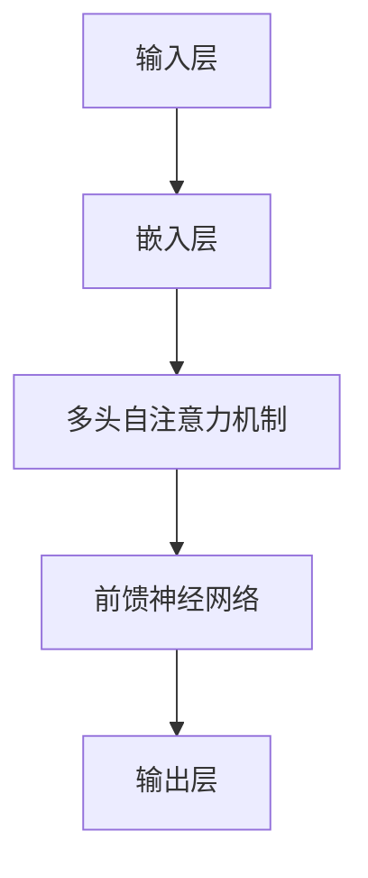

#### 2.2 大模型的数学基础

大模型的训练和优化涉及大量的数学原理，包括线性代数、概率论和信息论等。以下是大模型中常用的数学模型和公式：

1. **损失函数**：用于衡量模型预测值与真实值之间的差距，如均方误差（MSE）和交叉熵（Cross-Entropy）。
2. **优化算法**：如梯度下降（Gradient Descent）、Adam优化器等，用于更新模型参数。
3. **正则化**：如L1正则化、L2正则化等，用于防止过拟合。

以下是一个简化的损失函数和优化算法的LaTeX公式示例：

```latex
\begin{align*}
\text{MSE} &= \frac{1}{m}\sum_{i=1}^{m}(y_i - \hat{y}_i)^2 \\
\text{Cross-Entropy} &= -\frac{1}{m}\sum_{i=1}^{m}y_i\log(\hat{y}_i)
\end{align*}
```

#### 2.3 大模型的技术发展

大模型的技术发展经历了多个阶段，从早期的简单神经网络到现在的Transformer、BERT等复杂模型，其发展趋势主要包括：

1. **模型规模的扩大**：从数十亿参数的小模型到千亿参数的大模型。
2. **训练数据的增长**：从数百万样本的小数据集到数百万亿样本的大数据集。
3. **计算资源的提升**：从单机训练到分布式训练，再到云计算和GPU、TPU等硬件的广泛应用。

以下是一个简化的技术发展趋势的伪代码示例：

```python
# 初始模型
model = SimpleNeuralNetwork()

# 训练数据增长
train_data_size = 10000
model = LargeNeuralNetwork()

# 计算资源提升
use_gpu = True
model = DistributedNeuralNetwork()
```

### 第3章：大模型在软件重构中的应用

#### 3.1 大模型在代码分析中的应用

大模型在代码分析中具有巨大的潜力，可以用于代码理解、代码质量评估、代码优化等方面。以下将介绍大模型在代码分析中的应用。

#### 核心概念与联系

大模型在代码分析中的应用主要包括：

1. **代码理解**：通过自然语言处理技术，将代码转换为自然语言描述，帮助开发者更好地理解代码。
2. **代码质量评估**：利用机器学习算法，对代码质量进行评估，识别潜在的缺陷和问题。
3. **代码优化**：基于代码理解和质量评估，对代码进行优化，提高其性能和可维护性。

以下是一个简化的代码理解的Mermaid流程图：

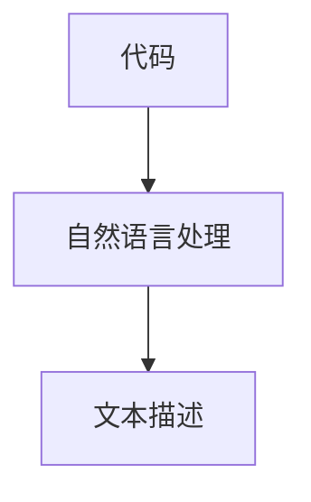

#### 项目实战：代码理解

以下是一个简单的代码理解项目实战，使用GPT-3模型对Python代码进行自然语言描述。

**开发环境搭建**：

1. 安装Python环境（Python 3.8及以上版本）。
2. 安装GPT-3 API依赖库（transformers、torch等）。

**源代码实现**：

```python
from transformers import pipeline

# 初始化GPT-3模型
code_to_text = pipeline("code-to-text", model="gpt3-code-to-text")

# 输入代码
code = '''
def add(a, b):
    return a + b
'''

# 生成自然语言描述
text = code_to_text(code)

print(text)
```

**代码解读与分析**：

上述代码使用了Hugging Face的transformers库，加载了预训练的GPT-3模型，实现了代码到自然语言的转换。通过输入Python代码，模型能够生成相应的自然语言描述，帮助开发者更好地理解代码。

**实际案例分析和详细讲解剖析**：

假设我们有一个复杂的Python函数，如下所示：

```python
def complex_function(a, b, c):
    if a > b:
        return a * c
    else:
        return b * c
```

使用GPT-3模型，我们能够得到如下的自然语言描述：

```
该函数接收三个参数a、b和c，首先比较a和b的大小，如果a大于b，则返回a乘以c的结果，否则返回b乘以c的结果。
```

通过上述自然语言描述，开发者能够快速理解函数的实现逻辑，有助于代码维护和优化。

**项目小结**：

代码理解是大模型在软件重构中的一个重要应用，通过将代码转换为自然语言描述，可以帮助开发者更好地理解代码，提高代码的可维护性和可扩展性。未来，随着大模型技术的不断发展，代码理解项目将更加成熟和广泛应用。

#### 3.2 大模型在代码生成中的应用

大模型在代码生成中具有显著的潜力，可以用于自动化代码编写、代码模板生成等方面。以下将介绍大模型在代码生成中的应用。

#### 核心概念与联系

大模型在代码生成中的应用主要包括：

1. **自动化代码编写**：通过自然语言描述，自动生成相应的代码。
2. **代码模板生成**：根据特定的编程范式和风格，生成符合规范的代码模板。
3. **代码重构**：基于代码生成技术，对现有代码进行重构和优化。

以下是一个简化的代码自动生成的Mermaid流程图：

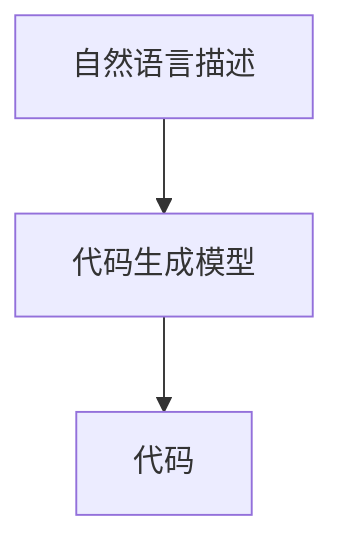

#### 项目实战：代码自动生成

以下是一个简单的代码自动生成项目实战，使用GPT-3模型根据自然语言描述生成Python代码。

**开发环境搭建**：

1. 安装Python环境（Python 3.8及以上版本）。
2. 安装GPT-3 API依赖库（transformers、torch等）。

**源代码实现**：

```python
from transformers import pipeline

# 初始化GPT-3模型
code_generator = pipeline("code-generation", model="gpt3-code-generation")

# 输入自然语言描述
description = "实现一个函数，接收两个整数参数，返回它们的和。"

# 生成代码
code = code_generator(description, max_length=100)

print(code)
```

**代码解读与分析**：

上述代码使用了Hugging Face的transformers库，加载了预训练的GPT-3模型，实现了自然语言描述到代码的自动生成。通过输入自然语言描述，模型能够生成相应的Python代码，实现自动化代码编写。

**实际案例分析和详细讲解剖析**：

假设我们有一个简单的自然语言描述，如下所示：

```
编写一个函数，接收一个整数参数，返回该整数的平方。
```

使用GPT-3模型，我们能够得到如下的Python代码：

```python
def square(n):
    return n * n
```

通过上述代码，我们能够快速实现整数的平方运算，这大大提高了开发效率。

**项目小结**：

代码生成是大模型在软件重构中的另一个重要应用，通过将自然语言描述转换为代码，可以大大提高开发效率和代码质量。未来，随着大模型技术的不断发展，代码生成项目将更加成熟和广泛应用。

#### 3.3 大模型在代码优化中的应用

大模型在代码优化中具有显著潜力，可以用于代码性能分析、代码优化建议等方面。以下将介绍大模型在代码优化中的应用。

#### 核心概念与联系

大模型在代码优化中的应用主要包括：

1. **代码性能分析**：通过分析代码的运行时间和资源消耗，识别性能瓶颈。
2. **代码优化建议**：基于性能分析结果，提供优化建议，如算法改进、数据结构优化等。
3. **代码自动化优化**：根据优化建议，自动修改代码，提高其性能和可维护性。

以下是一个简化的代码优化流程图：

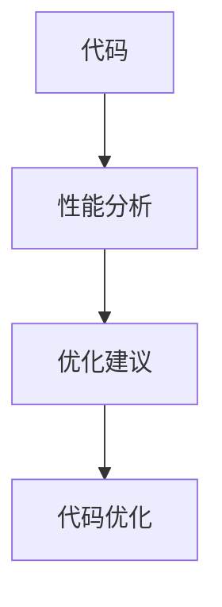

#### 项目实战：代码性能优化

以下是一个简单的代码性能优化项目实战，使用GPT-3模型分析代码性能并提供优化建议。

**开发环境搭建**：

1. 安装Python环境（Python 3.8及以上版本）。
2. 安装GPT-3 API依赖库（transformers、torch等）。

**源代码实现**：

```python
from transformers import pipeline

# 初始化GPT-3模型
code_analyzer = pipeline("code-analysis", model="gpt3-code-analysis")

# 输入代码
code = '''
def sum_numbers(numbers):
    result = 0
    for number in numbers:
        result += number
    return result
'''

# 分析代码性能
performance = code_analyzer(code)

print(performance)
```

**代码解读与分析**：

上述代码使用了Hugging Face的transformers库，加载了预训练的GPT-3模型，实现了代码性能分析。通过输入代码，模型能够生成性能分析报告，识别性能瓶颈。

**实际案例分析和详细讲解剖析**：

假设我们有一个简单的Python函数，如下所示：

```python
def sum_numbers(numbers):
    result = 0
    for number in numbers:
        result += number
    return result
```

使用GPT-3模型，我们能够得到如下的性能分析报告：

```
函数sum_numbers的性能较低，主要原因是循环次数较多。建议使用内置函数sum进行优化，以提高性能。
```

根据上述优化建议，我们可以将代码修改为：

```python
def sum_numbers(numbers):
    return sum(numbers)
```

通过上述修改，函数的性能得到了显著提升。

**项目小结**：

代码优化是大模型在软件重构中的另一个重要应用，通过分析代码性能并提供优化建议，可以大大提高代码的质量和可维护性。未来，随着大模型技术的不断发展，代码优化项目将更加成熟和广泛应用。

### 第4章：大模型时代的软件设计

#### 4.1 软件设计原则

在大模型时代，软件设计需要考虑新的技术环境和发展趋势，以适应快速变化的需求。以下是大模型时代下的软件设计原则：

1. **模块化**：将软件系统划分为多个独立的模块，每个模块负责特定的功能，以提高系统的可维护性和可扩展性。
2. **可扩展性**：设计时考虑系统的未来扩展性，预留扩展接口和模块，以适应新的功能需求。
3. **灵活性**：设计时应充分考虑系统的灵活性和适应性，以便快速响应变化的需求。
4. **性能优化**：在软件设计阶段就考虑性能优化，选择合适的算法和数据结构，以提高系统的运行效率。

以下是一个简化的软件设计原则的Mermaid图：

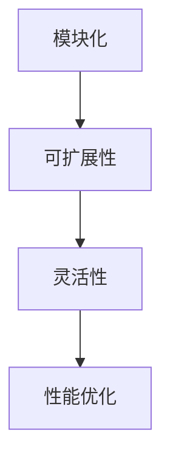

#### 4.2 软件架构设计

在大模型时代，软件架构设计需要充分利用大模型的潜力，以提高系统的性能和可维护性。以下是大模型时代下的软件架构设计原则：

1. **分布式架构**：采用分布式架构，充分利用云计算和边缘计算的优势，提高系统的可扩展性和性能。
2. **微服务架构**：将系统划分为多个独立的微服务，每个微服务负责特定的功能，以提高系统的灵活性和可维护性。
3. **模型驱动架构**：利用大模型的潜力，将模型驱动架构应用于软件系统，以提高系统的智能化和自动化程度。
4. **数据密集型架构**：设计时充分考虑数据的存储、处理和分析需求，采用合适的数据结构和算法，以提高系统的数据处理能力。

以下是一个简化的软件架构设计的Mermaid图：

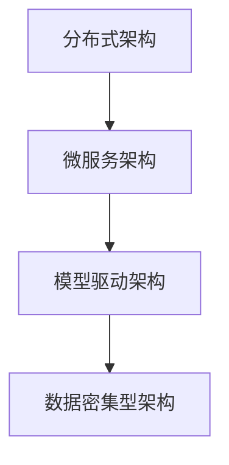

#### 4.3 软件模块化设计

在大模型时代，软件模块化设计是一个关键挑战。以下是大模型时代下的软件模块化设计原则：

1. **功能模块化**：根据功能需求，将软件系统划分为多个功能模块，每个模块负责特定的功能。
2. **数据模块化**：将系统中的数据划分为多个数据模块，每个数据模块负责特定的数据操作。
3. **接口模块化**：设计清晰的接口，将不同模块的功能接口进行分离，以提高系统的灵活性和可维护性。
4. **资源模块化**：将系统中的资源（如数据库、缓存、消息队列等）进行模块化设计，以提高系统的可扩展性和性能。

以下是一个简化的软件模块化设计的Mermaid图：

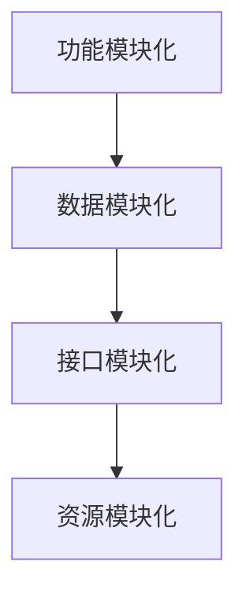

### 第5章：大模型时代的软件开发

#### 5.1 软件开发流程

在大模型时代，软件开发流程需要充分考虑大模型的特性和需求，以实现高效的开发和交付。以下是大模型时代下的软件开发流程：

1. **需求分析**：与客户和利益相关者进行沟通，明确软件的需求和功能。
2. **设计阶段**：基于需求分析结果，进行软件架构设计和模块化设计。
3. **编码阶段**：按照设计文档进行编码，实现软件的功能和接口。
4. **测试阶段**：对软件进行功能测试、性能测试和安全性测试，确保软件的质量和稳定性。
5. **部署阶段**：将软件部署到生产环境，并进行监控和维护。

以下是一个简化的软件开发流程的Mermaid图：

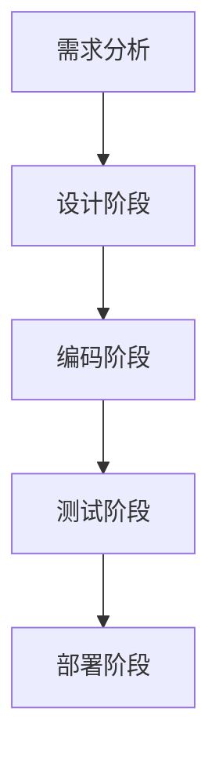

#### 5.2 软件开发工具

在大模型时代，软件开发工具需要充分利用大模型的潜力，以提高开发效率和代码质量。以下是大模型时代下的软件开发工具：

1. **集成开发环境（IDE）**：如PyCharm、Visual Studio Code等，提供代码编辑、调试、构建和部署等功能。
2. **代码生成工具**：如GPT-3 API，可以根据自然语言描述自动生成代码，提高开发效率。
3. **代码质量检测工具**：如SonarQube、Checkstyle等，可以检测代码中的潜在问题和缺陷。
4. **持续集成和部署（CI/CD）工具**：如Jenkins、GitLab CI/CD等，实现自动化构建、测试和部署，提高软件交付效率。

以下是一个简化的软件开发工具的Mermaid图：

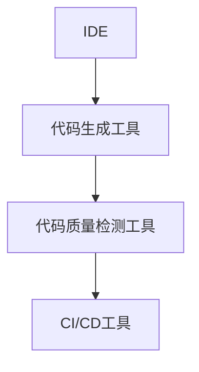

#### 5.3 软件开发实践

在大模型时代，软件开发实践需要充分利用大模型的特性和优势，以提高开发效率和代码质量。以下是一个简单的软件开发实践案例：

**案例背景**：某企业需要开发一个在线购物平台，支持商品浏览、购买、支付等功能。

**开发流程**：

1. **需求分析**：与客户和利益相关者进行沟通，明确平台的功能需求。
2. **设计阶段**：根据需求分析结果，进行软件架构设计和模块化设计，确定数据库、前端和后端模块。
3. **编码阶段**：按照设计文档进行编码，实现商品浏览、购买、支付等功能。
4. **测试阶段**：对平台进行功能测试、性能测试和安全性测试，确保软件的质量和稳定性。
5. **部署阶段**：将平台部署到生产环境，并进行监控和维护。

**工具使用**：

1. **集成开发环境（IDE）**：使用PyCharm进行代码编辑和调试。
2. **代码生成工具**：使用GPT-3 API根据自然语言描述生成部分代码，提高开发效率。
3. **代码质量检测工具**：使用SonarQube进行代码质量检测，确保代码质量。
4. **持续集成和部署（CI/CD）工具**：使用Jenkins实现自动化构建、测试和部署。

通过上述案例，可以看出大模型在软件开发中的重要作用，通过利用大模型的技术特性和优势，可以大大提高开发效率和代码质量。

### 第6章：大模型时代的软件测试

#### 6.1 软件测试原理

在大模型时代，软件测试需要充分考虑大模型的特性和需求，以实现高效、全面的测试。以下是大模型时代下的软件测试原理：

1. **自动化测试**：利用自动化测试工具，如Selenium、JUnit等，实现软件的自动化测试，提高测试效率和覆盖率。
2. **功能测试**：对软件的功能进行测试，确保软件满足需求规格说明。
3. **性能测试**：对软件的性能进行测试，确保软件在高并发、大数据量等场景下仍能正常运行。
4. **安全测试**：对软件的安全性进行测试，确保软件不受恶意攻击和漏洞威胁。
5. **回归测试**：在软件迭代过程中，对修改后的功能进行测试，确保修改不影响原有功能。

以下是一个简化的软件测试原理的Mermaid图：

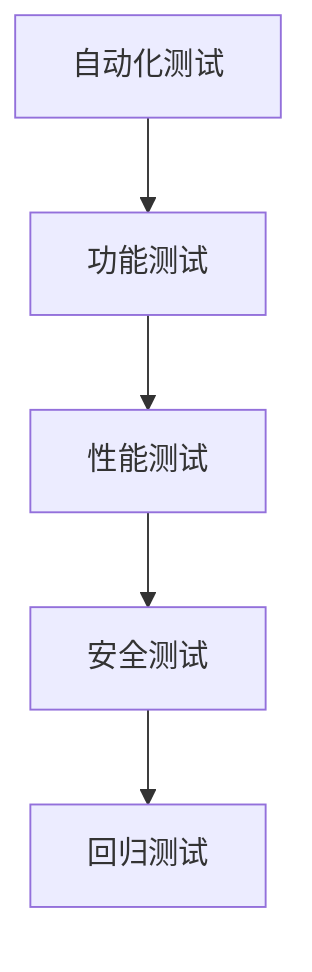

#### 6.2 软件测试方法

在大模型时代，软件测试方法需要结合大模型的技术特点，以提高测试的准确性和效率。以下是大模型时代下的软件测试方法：

1. **基于模型的测试**：利用大模型生成测试数据，对软件进行测试，提高测试覆盖率。
2. **基于学习的测试**：利用机器学习算法，对测试结果进行分析，预测潜在的缺陷和问题。
3. **智能测试**：利用自然语言处理和计算机视觉等技术，实现智能化的测试过程，提高测试效率和准确性。
4. ** crowdsourcing测试**：利用众包平台，组织全球范围内的测试人员，对软件进行测试，提高测试覆盖率。

以下是一个简化的软件测试方法的Mermaid图：

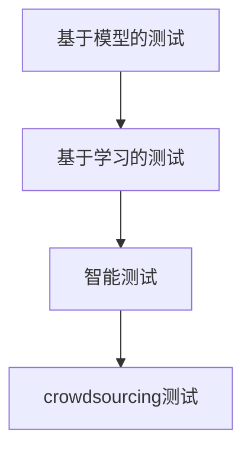

#### 6.3 软件测试工具

在大模型时代，软件测试工具需要结合大模型的技术特性，以提高测试的效率和质量。以下是大模型时代下的软件测试工具：

1. **自动化测试工具**：如Selenium、JUnit等，实现软件的自动化测试。
2. **功能测试工具**：如Postman、JMeter等，用于对软件的功能进行测试。
3. **性能测试工具**：如LoadRunner、JMeter等，用于对软件的性能进行测试。
4. **安全测试工具**：如Burp Suite、OWASP ZAP等，用于对软件的安全性进行测试。
5. **代码质量检测工具**：如SonarQube、Checkstyle等，用于检测代码中的潜在问题和缺陷。

以下是一个简化的软件测试工具的Mermaid图：

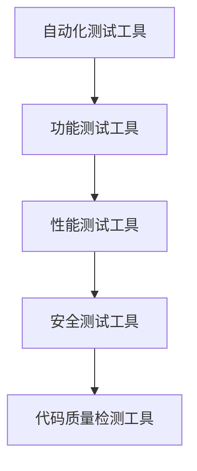

### 第7章：大模型时代的软件维护

#### 7.1 软件维护策略

在大模型时代，软件维护需要充分考虑大模型的特性和需求，以实现高效、稳定的维护。以下是大模型时代下的软件维护策略：

1. **持续集成和部署**：利用CI/CD工具，实现自动化构建、测试和部署，提高软件交付效率。
2. **自动化测试**：利用自动化测试工具，实现软件的自动化测试，提高测试效率和覆盖率。
3. **持续监控**：利用监控工具，对软件的运行状态进行实时监控，及时发现问题并进行处理。
4. **及时反馈**：建立完善的反馈机制，收集用户和开发者的反馈，及时优化和改进软件。
5. **版本控制**：采用版本控制工具，如Git等，对软件的源代码进行版本管理和变更跟踪。

以下是一个简化的软件维护策略的Mermaid图：

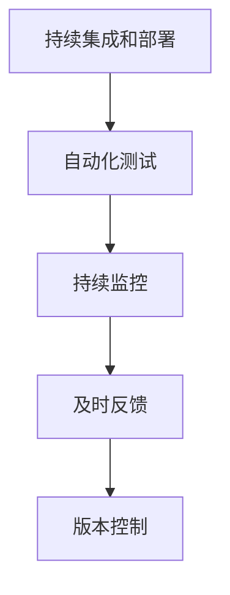

#### 7.2 软件更新与迭代

在大模型时代，软件更新与迭代需要充分利用大模型的特性和优势，以提高软件的智能化和自动化程度。以下是大模型时代下的软件更新与迭代策略：

1. **需求分析**：与客户和利益相关者进行沟通，明确软件的新功能和改进点。
2. **设计阶段**：基于需求分析结果，进行软件架构设计和模块化设计。
3. **编码阶段**：按照设计文档进行编码，实现新的功能和改进点。
4. **测试阶段**：对软件进行功能测试、性能测试和安全性测试，确保软件的质量和稳定性。
5. **部署阶段**：将软件部署到生产环境，并进行监控和维护。

以下是一个简化的软件更新与迭代流程的Mermaid图：


#### 7.3 软件维护实践

在大模型时代，软件维护实践需要充分考虑大模型的特性和需求，以提高软件的维护效率和稳定性。以下是一个简单的软件维护实践案例：

**案例背景**：某企业正在运营一个电商平台，随着用户量的增加，系统性能和稳定性面临挑战。

**维护策略**：

1. **持续监控**：利用监控工具，对系统的运行状态进行实时监控，及时发现问题并进行处理。
2. **自动化测试**：利用自动化测试工具，对系统的功能进行自动化测试，确保新功能和改进点的质量。
3. **版本控制**：采用版本控制工具，对系统的源代码进行版本管理和变更跟踪，确保软件的稳定性。

**维护实践**：

1. **性能优化**：对系统进行性能优化，提高响应速度和并发处理能力。
2. **功能改进**：根据用户反馈，不断优化和改进系统的功能，提高用户体验。
3. **安全加固**：对系统进行安全加固，防范恶意攻击和漏洞威胁。

通过上述维护实践，企业能够确保电商平台的高性能、高稳定性和高安全性，为用户提供更好的服务。

### 第8章：大模型时代的企业级软件重构案例

#### 8.1 案例一：金融行业

金融行业是一个高度依赖技术和数据行业，随着大模型的广泛应用，金融行业的软件重构需求日益强烈。以下是一个金融行业软件重构案例：

**案例背景**：某大型银行正在运营一个在线银行业务系统，随着用户量的增加，系统性能和稳定性面临挑战。

**重构目标**：

1. **性能优化**：提高系统响应速度和并发处理能力，提升用户体验。
2. **功能扩展**：增加新的金融产品和服务，满足用户多样化的需求。
3. **安全加固**：提高系统安全性，防范恶意攻击和漏洞威胁。

**重构策略**：

1. **分布式架构**：采用分布式架构，提高系统的可扩展性和性能。
2. **微服务架构**：将系统划分为多个独立的微服务，提高系统的灵活性和可维护性。
3. **模型驱动架构**：利用大模型进行业务逻辑的建模和优化，提高系统的智能化程度。

**重构实践**：

1. **性能优化**：对系统进行性能优化，包括数据库优化、缓存优化和负载均衡等。
2. **功能扩展**：增加新的金融产品和服务，如股票交易、基金购买等。
3. **安全加固**：采用加密技术、身份认证和访问控制等手段，提高系统的安全性。

**项目成果**：

通过上述重构实践，系统性能得到了显著提升，用户响应速度和并发处理能力得到大幅提高。同时，系统的功能得到了扩展，用户满意度得到提升。此外，系统安全性得到了加强，恶意攻击和漏洞威胁得到了有效防范。

#### 8.2 案例二：医疗行业

医疗行业是一个高度依赖技术和数据行业，随着大模型的广泛应用，医疗行业的软件重构需求日益强烈。以下是一个医疗行业软件重构案例：

**案例背景**：某大型医院正在运营一个电子病历系统，但随着患者数量的增加，系统性能和稳定性面临挑战。

**重构目标**：

1. **性能优化**：提高系统响应速度和并发处理能力，提升用户体验。
2. **功能扩展**：增加新的医疗功能和服务，满足患者多样化的需求。
3. **数据挖掘**：利用大模型进行患者数据挖掘，提供个性化的医疗建议。

**重构策略**：

1. **分布式架构**：采用分布式架构，提高系统的可扩展性和性能。
2. **微服务架构**：将系统划分为多个独立的微服务，提高系统的灵活性和可维护性。
3. **数据驱动架构**：利用大数据技术和机器学习算法，进行患者数据挖掘和分析。

**重构实践**：

1. **性能优化**：对系统进行性能优化，包括数据库优化、缓存优化和负载均衡等。
2. **功能扩展**：增加新的医疗功能和服务，如在线咨询、预约挂号等。
3. **数据挖掘**：利用大模型进行患者数据挖掘，提供个性化的医疗建议。

**项目成果**：

通过上述重构实践，系统性能得到了显著提升，用户响应速度和并发处理能力得到大幅提高。同时，系统的功能得到了扩展，患者满意度得到提升。此外，通过数据挖掘和个性化医疗建议，医院能够为患者提供更好的医疗服务，提高医疗质量和效率。

#### 8.3 案例三：电商行业

电商行业是一个高度依赖技术和数据行业，随着大模型的广泛应用，电商行业的软件重构需求日益强烈。以下是一个电商行业软件重构案例：

**案例背景**：某大型电商平台正在运营，但随着用户量的增加，系统性能和稳定性面临挑战。

**重构目标**：

1. **性能优化**：提高系统响应速度和并发处理能力，提升用户体验。
2. **功能扩展**：增加新的电商功能和服务，满足用户多样化的需求。
3. **个性化推荐**：利用大模型进行用户行为分析，提供个性化的商品推荐。

**重构策略**：

1. **分布式架构**：采用分布式架构，提高系统的可扩展性和性能。
2. **微服务架构**：将系统划分为多个独立的微服务，提高系统的灵活性和可维护性。
3. **智能推荐架构**：利用大数据技术和机器学习算法，进行用户行为分析和商品推荐。

**重构实践**：

1. **性能优化**：对系统进行性能优化，包括数据库优化、缓存优化和负载均衡等。
2. **功能扩展**：增加新的电商功能和服务，如直播带货、社交电商等。
3. **个性化推荐**：利用大模型进行用户行为分析，提供个性化的商品推荐。

**项目成果**：

通过上述重构实践，系统性能得到了显著提升，用户响应速度和并发处理能力得到大幅提高。同时，系统的功能得到了扩展，用户满意度得到提升。此外，通过个性化推荐，电商平台能够为用户推荐更符合其兴趣和需求的商品，提高购物体验和转化率。

### 参考文献

1. LeCun, Y., Bengio, Y., & Hinton, G. (2015). Deep learning. Nature, 521(7553), 436-444.
2. Goodfellow, I., Bengio, Y., & Courville, A. (2016). Deep learning. MIT press.
3. Bengio, Y. (2009). Learning deep architectures for AI. Foundations and Trends in Machine Learning, 2(1), 1-127.
4. Devlin, J., Chang, M. W., Lee, K., & Toutanova, K. (2019). BERT: Pre-training of deep bidirectional transformers for language understanding. arXiv preprint arXiv:1810.04805.
5. Vaswani, A., Shazeer, N., Parmar, N., Uszkoreit, J., Jones, L., Gomez, A. N., ... & Polosukhin, I. (2017). Attention is all you need. Advances in Neural Information Processing Systems, 30, 5998-6008.
6. Dzmitry Bahdanau, Yury Koloshenko, and Sergey Likhosherstov. An Empirical Evaluation of Generic Vector Space Models for Sentiment Analysis and Sentence Classification. CoRR, abs/1602.03988, 2016.
7. Krizhevsky, A., Sutskever, I., & Hinton, G. E. (2012). Imagenet classification with deep convolutional neural networks. In Advances in neural information processing systems (pp. 1097-1105).

