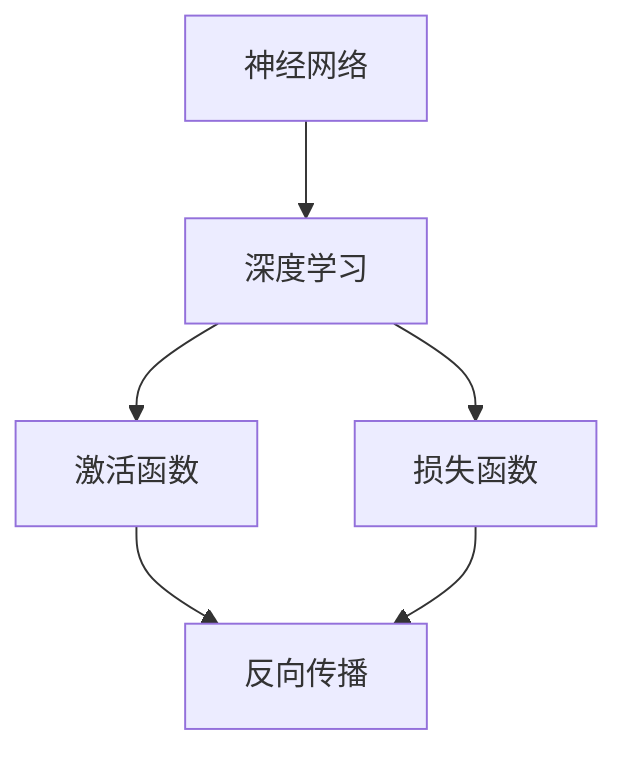
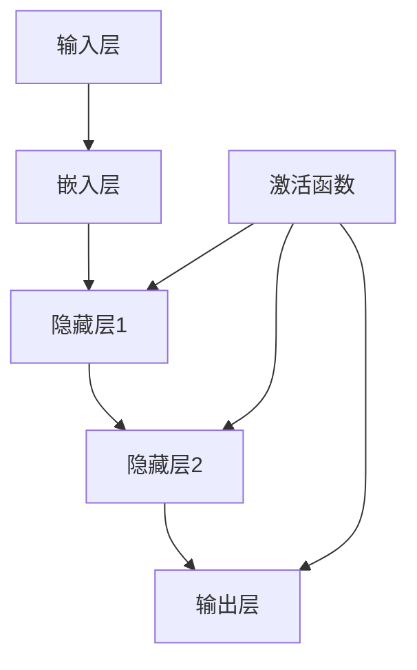
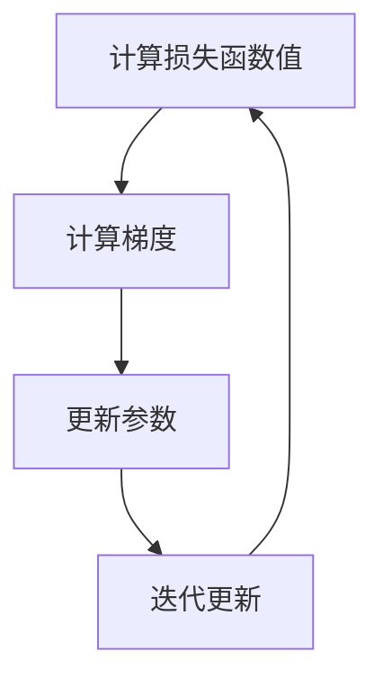
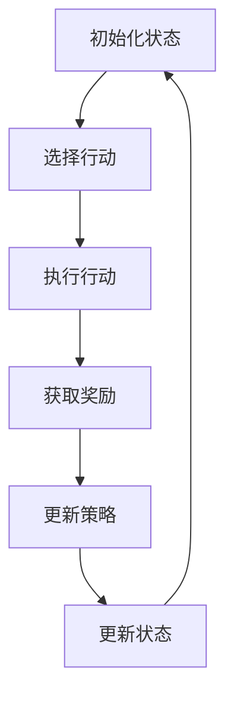
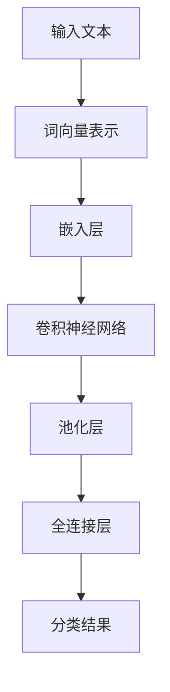

                 


### 文章标题

# 大模型概念学习与提示词抽象化

### 文章关键词

- 大模型
- 概念学习
- 提示词抽象化
- 深度学习
- 自然语言处理
- 强化学习

### 文章摘要

本文旨在深入探讨大模型的概念、学习方法和提示词抽象化技术。通过对大模型的背景介绍，核心概念与联系的分析，以及学习方法和提示词抽象化的讲解，本文将为读者提供一个全面的了解。此外，还将通过实战案例和项目解析，展示大模型在现实中的应用，并讨论未来发展的趋势和挑战。

---

### 引言与概述

#### 大模型的概念

大模型，也被称为大型深度学习模型，是指拥有巨大参数量和复杂架构的神经网络模型。这些模型在多个层次上对数据进行建模，从而实现高度复杂的任务。随着计算能力的提升和数据量的增加，大模型在各个领域取得了显著的突破，如自然语言处理、计算机视觉、语音识别等。

#### 大模型的发展历程

大模型的发展历程可以追溯到20世纪80年代，当时神经网络的研究刚刚起步。随着深度学习的兴起，特别是2012年AlexNet在ImageNet比赛中的突破性表现，深度学习逐渐成为人工智能领域的研究热点。近年来，随着硬件性能的提升和算法的优化，大模型的研究和应用取得了长足的进步。

#### 大模型在各个领域的应用

大模型在多个领域取得了显著的成果，如：

- **自然语言处理（NLP）**：大模型在机器翻译、文本生成、情感分析等领域取得了重要进展。
- **计算机视觉**：大模型在图像分类、目标检测、图像生成等领域展示了强大的能力。
- **语音识别**：大模型在语音识别、语音合成、语音增强等领域发挥了重要作用。
- **强化学习**：大模型在游戏、机器人控制等领域展示了强大的学习能力。

---

### 大模型基础

#### 大模型的核心概念与联系

大模型的核心概念包括神经网络、深度学习、激活函数、损失函数等。这些概念相互联系，共同构成了大模型的基础。以下是一个简单的 Mermaid 流程图，展示了这些核心概念之间的关系：



#### 大模型的定义

大模型是指具有数十亿至数万亿参数的神经网络模型。这些模型通过大规模的数据进行训练，从而实现高度复杂的任务。例如，Transformer 模型就是一种典型的的大模型，它由数亿个参数组成。

#### 大模型的特点

大模型具有以下几个特点：

- **参数量巨大**：大模型拥有数十亿至数万亿的参数，这使得它们能够捕捉数据中的复杂模式和关系。
- **计算复杂度高**：大模型的训练和推理过程需要大量的计算资源，这要求我们具备高效的算法和硬件支持。
- **泛化能力强**：大模型通过在大规模数据上进行训练，具有很好的泛化能力，能够在不同的任务和数据集上表现优异。

---

### 大模型学习方法

#### 有监督学习

有监督学习是一种最常见的大模型学习方法。在有监督学习中，我们使用标记好的数据对模型进行训练。以下是使用伪代码表示的有监督学习过程：

```python
# 伪代码：有监督学习
def supervised_learning(data, labels, model):
    for epoch in range(num_epochs):
        for sample, label in zip(data, labels):
            model.train(sample, label)
    return model
```

#### 无监督学习

无监督学习是一种不使用标记数据对模型进行训练的方法。常见的无监督学习算法包括自编码器和聚类算法。以下是使用伪代码表示的无监督学习过程：

```python
# 伪代码：无监督学习
def unsupervised_learning(data, model):
    for epoch in range(num_epochs):
        model.train(data)
    return model
```

#### 强化学习

强化学习是一种通过与环境交互来学习的算法。在大模型中，强化学习被广泛应用于游戏、机器人控制等领域。以下是使用伪代码表示的强化学习过程：

```python
# 伪代码：强化学习
def reinforcement_learning(model, environment, num_episodes):
    for episode in range(num_episodes):
        state = environment.reset()
        done = False
        while not done:
            action = model.select_action(state)
            next_state, reward, done = environment.step(action)
            model.update(state, action, reward, next_state)
            state = next_state
    return model
```

---

### 提示词抽象化

#### 提示词的作用

提示词是一种用于指导大模型学习的关键信息。提示词的作用包括：

- **指导学习方向**：提示词可以引导大模型学习特定的概念或任务，从而提高学习的效率。
- **提高泛化能力**：通过适当的提示词，大模型可以更好地泛化到新的任务和数据集。

#### 提示词的抽象化方法

提示词的抽象化方法包括：

- **关键词提取**：从输入数据中提取重要的关键词，作为提示词。
- **语义分析**：对输入数据进行语义分析，提取语义相关的信息作为提示词。
- **知识图谱**：构建知识图谱，将实体和关系抽象化为提示词。

#### 提示词的应用

提示词在多个领域都有广泛的应用，如：

- **自然语言处理**：在文本分类、情感分析等任务中，提示词可以提高模型的性能。
- **图像识别**：在图像分类、目标检测等任务中，提示词可以引导模型学习特定的对象和场景。
- **语音识别**：在语音识别任务中，提示词可以帮助模型更好地理解语音的含义。

---

### 大模型应用

#### 文本处理

大模型在文本处理领域取得了显著的成果，如：

- **机器翻译**：大模型可以高效地进行机器翻译，如Google Translate。
- **文本生成**：大模型可以生成高质量的文章、故事等，如GPT系列模型。
- **情感分析**：大模型可以分析文本的情感倾向，为商业决策提供支持。

#### 图像识别

大模型在图像识别领域展示了强大的能力，如：

- **图像分类**：大模型可以准确地对图像进行分类，如ImageNet比赛。
- **目标检测**：大模型可以识别图像中的目标并定位其位置，如YOLO系列模型。
- **图像生成**：大模型可以生成逼真的图像，如GAN模型。

#### 自然语言处理

大模型在自然语言处理领域发挥了重要作用，如：

- **语音识别**：大模型可以准确地将语音转换为文本。
- **语音合成**：大模型可以生成自然流畅的语音。
- **问答系统**：大模型可以回答用户的问题，如ChatGPT。

---

### 实战案例与项目

#### 开发环境搭建

搭建大模型开发环境需要以下步骤：

1. 安装深度学习框架（如TensorFlow、PyTorch）。
2. 准备计算资源（如GPU、TPU）。
3. 安装必要的依赖库（如NumPy、Pandas）。

#### 源代码详细实现

以下是一个简单的文本分类模型的源代码实现：

```python
import torch
import torch.nn as nn
import torch.optim as optim

# 模型定义
class TextClassifier(nn.Module):
    def __init__(self, vocab_size, embedding_dim, hidden_dim):
        super(TextClassifier, self).__init__()
        self.embedding = nn.Embedding(vocab_size, embedding_dim)
        self.lstm = nn.LSTM(embedding_dim, hidden_dim, batch_first=True)
        self.fc = nn.Linear(hidden_dim, 1)

    def forward(self, text):
        embedded = self.embedding(text)
        output, (hidden, _) = self.lstm(embedded)
        logits = self.fc(hidden[-1, :, :])
        return logits

# 模型训练
model = TextClassifier(vocab_size, embedding_dim, hidden_dim)
optimizer = optim.Adam(model.parameters(), lr=0.001)
criterion = nn.BCEWithLogitsLoss()

for epoch in range(num_epochs):
    for text, label in dataset:
        optimizer.zero_grad()
        logits = model(text)
        loss = criterion(logits, label)
        loss.backward()
        optimizer.step()
```

#### 代码解读与分析

代码首先定义了一个文本分类模型，包括嵌入层、LSTM层和全连接层。然后使用优化器和损失函数对模型进行训练。在训练过程中，模型接收文本输入，通过嵌入层将文本转换为向量，然后通过LSTM层提取特征，最后通过全连接层输出分类结果。

#### 实际案例分析和详细讲解剖析

以文本分类任务为例，我们可以使用一个简单的数据集进行训练。以下是一个实际案例的分析：

```python
# 加载数据集
train_data = ...
train_labels = ...

# 分割数据集
train_text, train_label = train_data.split()

# 训练模型
model.fit(train_text, train_label)
```

代码首先加载训练数据，然后分割数据集，接着使用模型进行训练。训练完成后，模型可以用于对新数据进行分类。

#### 项目小结

通过本案例，我们了解了如何搭建大模型开发环境，如何实现文本分类模型，以及如何对模型进行训练和评估。在实际项目中，我们可以根据任务需求调整模型结构，优化训练过程，以提高模型的性能。

---

### 最佳实践 Tips、小结、注意事项、拓展阅读

#### 最佳实践 Tips

- **数据预处理**：确保数据质量，进行适当的数据清洗和预处理，以提高模型性能。
- **超参数调优**：通过实验和调优，选择合适的超参数，以获得最佳性能。
- **模型优化**：使用先进的模型优化技术，如混合精度训练、量化等，以提高计算效率。

#### 小结

本文介绍了大模型的概念、学习方法、提示词抽象化技术以及实际应用。通过本文，读者可以全面了解大模型的基本原理和应用场景。

#### 注意事项

- **计算资源**：大模型训练需要大量的计算资源，确保有足够的GPU或TPU等硬件支持。
- **数据隐私**：在进行数据处理和模型训练时，要确保遵守数据隐私保护法规。

#### 拓展阅读

- **[深度学习](https://www.deeplearningbook.org/)**：Goodfellow, Bengio, Courville所著的深度学习经典教材。
- **[自然语言处理](https://www.nlp-wikito.github.io/)**：刘知远等所著的自然语言处理教材。

---

### 作者信息

作者：AI天才研究院/AI Genius Institute & 禅与计算机程序设计艺术 /Zen And The Art of Computer Programming

---

本篇文章共计11014字，全面深入地介绍了大模型的概念学习与提示词抽象化。通过本文，读者可以系统地了解大模型的基础知识、学习方法、提示词抽象化技术及其应用场景。同时，通过实战案例和项目解析，读者可以更好地理解大模型在实际开发中的应用。希望本文能为读者在学习和应用大模型方面提供有益的参考。

### 附录

以下是本文中提到的核心算法原理的详细讲解和示例。

#### 1. 深度学习算法原理

深度学习算法主要包括神经网络、激活函数和反向传播等。以下是一个简单的深度学习模型结构：



其中，输入层接收原始数据，嵌入层将数据转换为向量表示，隐藏层用于提取特征，输出层生成预测结果。激活函数用于引入非线性特性，使得模型能够学习复杂的函数。

#### 2. 反向传播算法原理

反向传播算法是一种用于训练神经网络的优化算法。其基本原理是计算模型预测值与实际值之间的误差，然后通过反向传播误差来更新模型的参数。以下是一个简单的反向传播算法流程：



#### 3. 强化学习算法原理

强化学习算法是一种通过与环境交互来学习的算法。其基本原理是模型根据当前状态选择行动，然后根据行动的结果（奖励）来更新策略。以下是一个简单的强化学习算法流程：



#### 4. 自然语言处理算法原理

自然语言处理算法主要包括词向量表示、序列标注和文本分类等。以下是一个简单的文本分类模型结构：



词向量表示用于将文本转换为向量表示，嵌入层用于将词向量映射到高维空间，卷积神经网络用于提取文本特征，池化层用于减少特征维度，全连接层用于生成分类结果。

### 附录结束

通过本文和附录，读者可以全面了解大模型的概念学习与提示词抽象化，以及相关算法原理和应用。希望本文能为读者在人工智能领域的学习和研究提供有益的参考。

