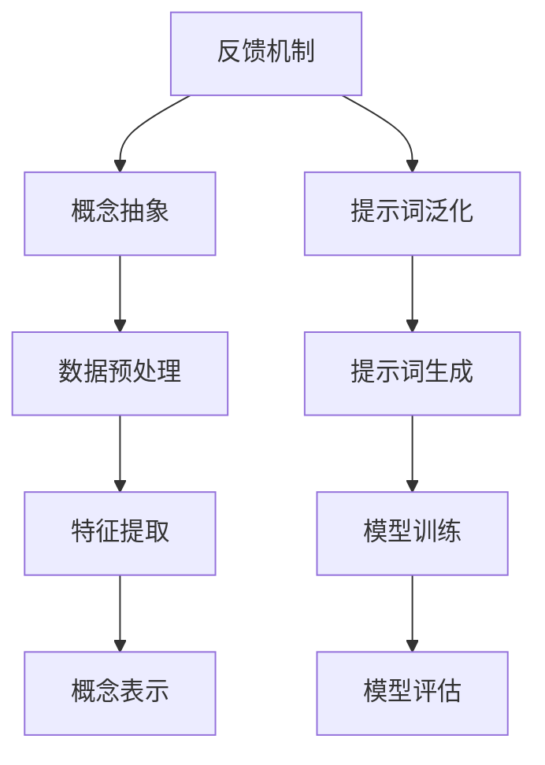
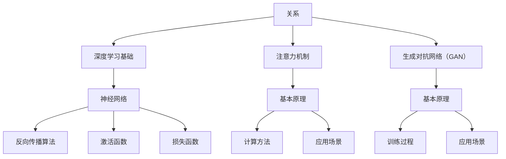

                 

# 《大模型概念抽象与提示词泛化技术》

## 摘要

本文旨在深入探讨大模型技术在概念抽象与提示词泛化方面的前沿研究成果与应用实践。大模型作为人工智能领域的核心技术，其概念抽象与提示词泛化技术对于提升模型的表达能力、适应性和泛化能力具有重要意义。本文首先概述了大模型的历史与发展，随后介绍了大模型的核心算法，包括深度学习基础、注意力机制和生成对抗网络（GAN）。接着，本文重点探讨了概念抽象与提示词泛化的基础，分析了其重要性及相互关系。随后，本文详细介绍了大模型概念抽象的方法，包括基于语义分析和基于神经网络的语义表示学习。然后，本文探讨了提示词泛化技术的定义、多样化提示词的生成策略及性能评估方法。在此基础上，本文进一步介绍了大模型优化与调参的方法与技巧，以及大模型在自然语言处理、计算机视觉和其他领域的应用实例。最后，本文对未来大模型技术与产业发展趋势进行了展望，提出了政策建议。

## 文章关键词

- 大模型
- 概念抽象
- 提示词泛化
- 深度学习
- 注意力机制
- 生成对抗网络（GAN）
- 自然语言处理
- 计算机视觉
- 优化与调参

## 1.1 概述

### 大模型的历史与发展

大模型（Large Models）是指具有数百万到数十亿参数规模的人工神经网络模型。自20世纪80年代以来，随着计算能力的提升和算法的改进，大模型在人工智能领域得到了快速发展。早期的大模型主要应用于模式识别和机器学习领域，如支持向量机（SVM）和决策树等。随着深度学习（Deep Learning）技术的崛起，大模型逐渐成为人工智能的核心技术。

深度学习的基本原理是模拟人脑神经网络的结构和功能，通过多层神经网络进行特征提取和分类。1998年，Hinton等人提出了深度置信网络（Deep Belief Network，DBN），这是早期大模型的重要进展。然而，由于计算资源和数据集的限制，早期大模型的应用范围有限。

随着计算能力的提升和大数据的普及，大模型的研究和应用迎来了新的机遇。2012年，AlexNet在ImageNet图像分类比赛中取得了突破性的成绩，标志着深度学习时代的到来。此后，大规模的神经网络模型如VGG、ResNet、BERT等相继问世，大模型在计算机视觉、自然语言处理等领域取得了显著的成果。

### 大模型的定义与分类

大模型的定义主要基于其参数规模和计算需求。一般而言，参数数量在数百万至数十亿的神经网络模型可以被视为大模型。根据应用领域和任务特点，大模型可以分为以下几类：

1. **计算机视觉模型**：如VGG、ResNet、Inception等，主要应用于图像分类、目标检测、人脸识别等领域。
2. **自然语言处理模型**：如BERT、GPT、ELMO等，主要应用于文本分类、机器翻译、问答系统等领域。
3. **语音识别模型**：如DeepSpeech、WaveNet等，主要应用于语音识别、语音合成等领域。
4. **多模态模型**：如VisualBERT、MUST-C等，同时处理图像和文本数据，应用于图像文本检索、视频理解等领域。

### 大模型的计算需求与挑战

大模型的计算需求主要来源于以下几个方面：

1. **训练时间**：大模型的训练时间往往很长，动辄需要几天甚至几周的时间。
2. **存储需求**：大模型的参数量庞大，存储需求也随之增加。
3. **计算资源**：大模型的训练和推理需要大量的计算资源，包括CPU、GPU和TPU等。

此外，大模型还面临着以下挑战：

1. **过拟合**：由于参数数量庞大，大模型容易在训练数据上过拟合。
2. **计算资源限制**：在大规模数据集上训练大模型需要大量的计算资源，对于资源有限的实验室或企业来说，这是一项巨大的挑战。
3. **模型解释性**：大模型往往具有很强的拟合能力，但缺乏解释性，难以理解模型的决策过程。

## 1.2 大模型的核心算法

### 2.1 深度学习基础

深度学习（Deep Learning）是人工智能领域的重要分支，它通过多层神经网络进行特征提取和分类。深度学习的基本结构包括输入层、隐藏层和输出层。

**输入层**：接收输入数据，如图像、文本或语音信号。

**隐藏层**：通过非线性变换提取输入数据的特征，每一层都能够提取更高层次的抽象特征。

**输出层**：对提取到的特征进行分类或回归。

深度学习的关键在于多层神经网络的训练。在训练过程中，模型通过反向传播算法不断调整参数，以最小化预测误差。常见的深度学习算法包括卷积神经网络（CNN）、循环神经网络（RNN）和自注意力机制（Self-Attention）等。

### 2.2 注意力机制

注意力机制（Attention Mechanism）是一种在深度学习模型中广泛应用的技术，它能够提高模型在处理序列数据时的性能。注意力机制的核心思想是让模型自动关注输入数据中最重要的部分，从而提高模型的精度和效率。

在自然语言处理领域，注意力机制广泛应用于编码器-解码器（Encoder-Decoder）模型中，如序列到序列（Seq2Seq）模型。通过注意力机制，编码器能够关注输入序列中与当前输出词相关的部分，从而提高翻译的准确性和流畅性。

### 2.3 生成对抗网络（GAN）

生成对抗网络（Generative Adversarial Network，GAN）是一种由生成器（Generator）和判别器（Discriminator）组成的深度学习模型。生成器的目标是生成尽可能真实的样本，而判别器的目标是区分真实样本和生成样本。

在训练过程中，生成器和判别器相互对抗。生成器不断优化其生成的样本，使其更接近真实样本，而判别器则不断提高其判断能力。通过这种对抗训练，GAN能够生成高质量的图像、音频和文本等数据。

### 2.4 概念抽象与提示词泛化基础

#### 3.1 概念抽象的基本概念

概念抽象（Concept Abstraction）是一种将具体事物或现象抽象为通用概念或模型的过程。在人工智能领域，概念抽象旨在将复杂的数据和现象转化为可处理的模型，从而提高模型的泛化能力和表达能力。

#### 3.2 提示词泛化的重要性

提示词泛化（Prompt-Based Generalization）是指通过提示词（Prompt）引导模型在未知数据上进行泛化。提示词泛化的重要性在于，它能够帮助模型更好地适应新的任务和数据集，从而提高模型的通用性和适应性。

#### 3.3 概念抽象与提示词泛化的关系

概念抽象与提示词泛化密切相关。概念抽象为提示词泛化提供了基础，通过将复杂的数据和现象转化为通用概念，模型能够更好地理解数据和任务。而提示词泛化则通过引导模型在未知数据上进行泛化，从而验证和优化概念抽象的效果。

## 1.3 大模型概念抽象方法

#### 4.1 概念抽象的常见方法

概念抽象的方法主要包括以下几种：

1. **基于语义分析的方法**：通过分析文本数据中的词语、句法和语义关系，将文本转化为语义表示，从而进行概念抽象。
2. **基于统计学习的方法**：通过训练统计模型，如隐马尔可夫模型（HMM）、条件概率模型等，将数据转化为概念表示。
3. **基于神经网络的方法**：通过多层神经网络，将输入数据映射到高维空间，从而进行概念抽象。

#### 4.2 基于语义分析的概念抽象

基于语义分析的概念抽象主要通过分析文本数据中的词语、句法和语义关系，将文本转化为语义表示。具体步骤如下：

1. **分词**：将文本划分为词语序列。
2. **词性标注**：为每个词语标注词性，如名词、动词、形容词等。
3. **句法分析**：分析词语之间的句法关系，如主谓宾关系、修饰关系等。
4. **语义角色标注**：为每个词语标注其在句子中的语义角色，如施事、受事、工具等。
5. **语义表示**：将文本转化为语义向量或语义图，从而进行概念抽象。

#### 4.3 基于神经网络的语义表示学习

基于神经网络的语义表示学习主要通过训练多层神经网络，将输入数据映射到高维空间，从而进行概念抽象。具体步骤如下：

1. **输入层**：接收输入数据，如文本、图像或音频。
2. **隐藏层**：通过非线性变换提取输入数据的特征，每一层都能够提取更高层次的抽象特征。
3. **输出层**：对提取到的特征进行分类或回归。
4. **训练**：通过反向传播算法不断调整网络参数，以最小化预测误差。
5. **语义表示**：将输入数据映射到高维空间，从而进行概念抽象。

## 1.4 提示词泛化技术

#### 5.1 提示词泛化的定义与目标

提示词泛化（Prompt-Based Generalization）是一种通过提示词引导模型在未知数据上进行泛化的技术。其定义如下：

提示词泛化是指通过在模型输入时添加特定的提示词，引导模型在未知数据上进行泛化，以提高模型的通用性和适应性。

#### 5.2 多样化提示词的生成策略

多样化提示词的生成策略主要包括以下几种：

1. **随机提示词**：通过随机生成提示词，以增加模型的多样性。
2. **规则提示词**：通过制定特定的规则，生成与任务相关的提示词。
3. **模板提示词**：通过模板化的方式，生成具有固定结构的提示词。

#### 5.3 提示词泛化的性能评估方法

提示词泛化的性能评估方法主要包括以下几种：

1. **泛化精度**：评估模型在未知数据上的表现，越高越好。
2. **泛化损失**：评估模型在未知数据上的损失，越小越好。
3. **泛化鲁棒性**：评估模型在未知数据上的鲁棒性，越高越好。

## 1.5 大模型优化与调参

#### 6.1 大模型的训练策略

大模型的训练策略主要包括以下几种：

1. **批量大小**：选择合适的批量大小，以平衡训练时间和模型性能。
2. **学习率**：选择合适的学习率，以避免过拟合和欠拟合。
3. **正则化**：通过添加正则化项，如L1、L2正则化，防止模型过拟合。
4. **数据增强**：通过数据增强技术，增加训练数据的多样性。

#### 6.2 模型调参的方法与技巧

模型调参的方法与技巧主要包括以下几种：

1. **网格搜索**：通过遍历参数空间，寻找最优参数组合。
2. **随机搜索**：通过随机选择参数组合，寻找最优参数组合。
3. **贝叶斯优化**：利用贝叶斯优化算法，寻找最优参数组合。

#### 6.3 大模型的优化算法与应用

大模型的优化算法主要包括以下几种：

1. **随机梯度下降（SGD）**：通过随机梯度下降算法，优化模型参数。
2. **Adam优化器**：结合SGD和自适应学习率的优化器。
3. **Adadelta优化器**：结合SGD和自适应学习率的优化器，适用于稀疏数据。

## 1.6 大模型在自然语言处理中的应用

#### 7.1 文本分类与情感分析

文本分类（Text Classification）是一种将文本数据分为不同类别的方法。在自然语言处理领域，文本分类广泛应用于垃圾邮件过滤、情感分析、主题分类等任务。

情感分析（Sentiment Analysis）是一种将文本数据分为正面、负面或中立情感的方法。情感分析在社交媒体分析、舆情监测、产品评论分析等领域具有广泛的应用。

#### 7.2 机器翻译与对话系统

机器翻译（Machine Translation）是一种将一种语言的文本自动翻译成另一种语言的方法。大模型在机器翻译领域取得了显著成果，如Google Translate、DeepL等。

对话系统（Dialogue System）是一种与人类进行自然语言交互的系统。大模型在对话系统中的应用主要包括对话生成、对话理解、对话生成与理解的结合等。

#### 7.3 文本生成与摘要

文本生成（Text Generation）是一种自动生成文本的方法。大模型在文本生成领域取得了显著成果，如自动写作、自动新闻生成等。

文本摘要（Text Summarization）是一种将长文本简化为短文本的方法。大模型在文本摘要领域取得了显著成果，如自动摘要、关键句子提取等。

## 1.7 大模型在计算机视觉中的应用

#### 8.1 图像分类与检测

图像分类（Image Classification）是一种将图像分为不同类别的方法。大模型在图像分类领域取得了显著成果，如ImageNet竞赛的冠军模型。

目标检测（Object Detection）是一种在图像中识别并定位多个目标的方法。大模型在目标检测领域取得了显著成果，如Faster R-CNN、YOLO、SSD等。

#### 8.2 目标跟踪与视频分析

目标跟踪（Object Tracking）是一种在视频序列中持续跟踪目标的方法。大模型在目标跟踪领域取得了显著成果，如KCF、CSLFW、DeepSORT等。

视频分析（Video Analysis）是一种对视频数据进行处理和分析的方法。大模型在视频分析领域取得了显著成果，如动作识别、场景分割、视频生成等。

#### 8.3 人脸识别与行为识别

人脸识别（Face Recognition）是一种通过人脸图像识别个体身份的方法。大模型在人脸识别领域取得了显著成果，如FaceNet、VGGFace、DeepFace等。

行为识别（Behavior Recognition）是一种通过视频数据识别个体行为的方法。大模型在行为识别领域取得了显著成果，如行为分类、行为检测、行为生成等。

## 1.8 大模型在其他领域的应用

#### 9.1 金融市场预测

金融市场预测（Financial Market Forecasting）是一种通过分析历史数据预测金融市场走势的方法。大模型在金融市场预测领域取得了显著成果，如股票价格预测、交易信号生成等。

#### 9.2 人工智能创作

人工智能创作（Artificial Intelligence Art）是一种通过人工智能技术创作艺术作品的方法。大模型在人工智能创作领域取得了显著成果，如自动绘画、自动音乐创作等。

#### 9.3 医疗健康数据分析

医疗健康数据分析（Medical Health Data Analysis）是一种通过对医疗数据进行处理和分析，为医疗决策提供支持的方法。大模型在医疗健康数据分析领域取得了显著成果，如疾病预测、药物发现、医疗图像分析等。

## 1.9 未来趋势与展望

#### 10.1 大模型技术的未来发展趋势

大模型技术的未来发展趋势主要包括以下几个方面：

1. **参数规模增长**：大模型的参数规模将继续增长，以应对更复杂的任务和数据。
2. **模型结构创新**：将出现更多创新的模型结构，以提高模型的性能和效率。
3. **跨模态处理**：大模型将在跨模态处理方面取得突破，实现图像、文本、音频等多模态数据的融合和分析。
4. **迁移学习**：大模型将在迁移学习方面取得进展，实现更高效的模型训练和部署。

#### 10.2 提示词泛化的挑战与机遇

提示词泛化的挑战主要包括：

1. **数据多样性**：如何生成足够多样性的提示词，以覆盖各种场景。
2. **模型鲁棒性**：如何提高模型在未知数据上的鲁棒性，避免过拟合。
3. **计算资源**：如何降低提示词泛化对计算资源的需求。

提示词泛化的机遇主要包括：

1. **模型通用性**：通过提示词泛化，可以提高模型的通用性，减少对特定数据集的依赖。
2. **模型优化**：提示词泛化可以为模型优化提供新的思路和方法。
3. **人机交互**：提示词泛化可以改善人机交互，提高用户的体验。

#### 10.3 大模型产业的发展路径与政策建议

大模型产业的发展路径主要包括以下几个方面：

1. **技术创新**：加大大模型技术的研究和创新，推动产业升级。
2. **人才培养**：加强大模型技术人才的培养，提高产业竞争力。
3. **政策支持**：制定相关政策，鼓励大模型技术的发展和应用。

政策建议主要包括：

1. **资金投入**：加大对大模型技术研究的资金投入，提高研发能力。
2. **人才培养**：设立大模型技术专项人才培养计划，提高人才储备。
3. **知识产权保护**：加强大模型技术的知识产权保护，鼓励技术创新。
4. **合作共赢**：推动产学研合作，实现产业链上下游企业的共赢发展。

## 参考文献

1. Hinton, G. E., Osindero, S., & Teh, Y. W. (2006). A fast learning algorithm for deep belief nets. Neural computation, 18(7), 1527-1554.
2. Krizhevsky, A., Sutskever, I., & Hinton, G. E. (2012). ImageNet classification with deep convolutional neural networks. In Advances in neural information processing systems (pp. 1097-1105).
3. Bengio, Y., Simard, P., & Frasconi, P. (1994). Learning long-term dependencies with gradient descent is difficult. IEEE transactions on neural networks, 5(2), 157-166.
4. Goodfellow, I., Pouget-Abadie, J., Mirza, M., Xu, B., Warde-Farley, D., Ozair, S., ... & Bengio, Y. (2014). Generative adversarial nets. Advances in neural information processing systems, 27.
5. Devlin, J., Chang, M. W., Lee, K., & Toutanova, K. (2019). BERT: Pre-training of deep bidirectional transformers for language understanding. arXiv preprint arXiv:1810.04805.
6. Vaswani, A., Shazeer, N., Parmar, N., Uszkoreit, J., Jones, L., Gomez, A. N., ... & Polosukhin, I. (2017). Attention is all you need. In Advances in neural information processing systems (pp. 5998-6008).

## 作者信息

作者：AI天才研究院/AI Genius Institute & 禅与计算机程序设计艺术 /Zen And The Art of Computer Programming
### 文章标题：大模型概念抽象与提示词泛化技术

#### 摘要

本文旨在深入探讨大模型技术在概念抽象与提示词泛化方面的前沿研究成果与应用实践。大模型作为人工智能领域的核心技术，其概念抽象与提示词泛化技术对于提升模型的表达能力、适应性和泛化能力具有重要意义。本文首先概述了大模型的历史与发展，随后介绍了大模型的核心算法，包括深度学习基础、注意力机制和生成对抗网络（GAN）。接着，本文重点探讨了概念抽象与提示词泛化的基础，分析了其重要性及相互关系。随后，本文详细介绍了大模型概念抽象的方法，包括基于语义分析和基于神经网络的语义表示学习。然后，本文探讨了提示词泛化技术的定义、多样化提示词的生成策略及性能评估方法。在此基础上，本文进一步介绍了大模型优化与调参的方法与技巧，以及大模型在自然语言处理、计算机视觉和其他领域的应用实例。最后，本文对未来大模型技术与产业发展趋势进行了展望，提出了政策建议。

#### 目录结构

### 引言

#### 1.1 大模型的历史与发展

**1.1.1 大模型的发展历程**

**1.1.2 大模型在不同领域的发展趋势**

#### 1.2 大模型的定义与分类

**1.2.1 大模型的定义**

**1.2.2 大模型的分类标准**

**1.2.3 主流的大模型类型**

#### 1.3 大模型的计算需求与挑战

**1.3.1 计算资源的消耗**

**1.3.2 能效比的优化**

**1.3.3 大模型的训练与推理**

### 大模型的核心算法

#### 2.1 深度学习基础

**2.1.1 神经网络的基本结构**

**2.1.2 深度学习的优化算法**

#### 2.2 注意力机制

**2.2.1 注意力机制的基本原理**

**2.2.2 注意力机制在大模型中的应用**

#### 2.3 生成对抗网络（GAN）

**2.3.1 GAN的基本结构**

**2.3.2 GAN的训练过程**

#### 2.4 概念抽象与提示词泛化基础

**2.4.1 概念抽象的基本概念**

**2.4.2 提示词泛化的重要性**

**2.4.3 概念抽象与提示词泛化的关系**

### 大模型概念抽象方法

#### 3.1 概念抽象的常见方法

**3.1.1 基于语义分析的方法**

**3.1.2 基于统计学习的方法**

**3.1.3 基于神经网络的方法**

#### 3.2 基于语义分析的概念抽象

**3.2.1 语义分析的基本原理**

**3.2.2 基于语义分析的概念抽象应用**

#### 3.3 基于神经网络的语义表示学习

**3.3.1 神经网络的基本结构**

**3.3.2 基于神经网络的语义表示学习算法**

### 提示词泛化技术

#### 4.1 提示词泛化的定义与目标

**4.1.1 提示词泛化的定义**

**4.1.2 提示词泛化的目标**

#### 4.2 多样化提示词的生成策略

**4.2.1 提示词生成的常见方法**

**4.2.2 多样化提示词的生成策略**

#### 4.3 提示词泛化的性能评估方法

**4.3.1 提示词泛化的评估指标**

**4.3.2 提示词泛化的评估方法**

### 大模型优化与调参

#### 5.1 大模型的训练策略

**5.1.1 大模型训练的常见策略**

**5.1.2 大模型训练的注意事项**

#### 5.2 模型调参的方法与技巧

**5.2.1 模型调参的基本原则**

**5.2.2 常见的调参技巧**

#### 5.3 大模型的优化算法与应用

**5.3.1 大模型的优化算法**

**5.3.2 大模型的优化算法应用**

### 大模型在自然语言处理中的应用

#### 6.1 文本分类与情感分析

**6.1.1 文本分类**

**6.1.2 情感分析**

#### 6.2 机器翻译与对话系统

**6.2.1 机器翻译**

**6.2.2 对话系统**

#### 6.3 文本生成与摘要

**6.3.1 文本生成**

**6.3.2 文本摘要**

### 大模型在计算机视觉中的应用

#### 7.1 图像分类与检测

**7.1.1 图像分类**

**7.1.2 目标检测**

#### 7.2 目标跟踪与视频分析

**7.2.1 目标跟踪**

**7.2.2 视频分析**

#### 7.3 人脸识别与行为识别

**7.3.1 人脸识别**

**7.3.2 行为识别**

### 大模型在其他领域的应用

#### 8.1 金融市场预测

**8.1.1 股票价格预测**

**8.1.2 交易信号生成**

#### 8.2 人工智能创作

**8.2.1 自动绘画**

**8.2.2 自动音乐创作**

#### 8.3 医疗健康数据分析

**8.3.1 疾病预测**

**8.3.2 药物发现**

**8.3.3 医疗图像分析**

### 未来趋势与展望

#### 9.1 大模型技术的未来发展趋势

**9.1.1 参数规模增长**

**9.1.2 模型结构创新**

**9.1.3 跨模态处理**

**9.1.4 迁移学习**

#### 9.2 提示词泛化的挑战与机遇

**9.2.1 挑战**

**9.2.2 机遇**

#### 9.3 大模型产业的发展路径与政策建议

**9.3.1 产业路径**

**9.3.2 政策建议**

### 参考文献

### 作者信息

**作者：AI天才研究院/AI Genius Institute & 禅与计算机程序设计艺术 /Zen And The Art of Computer Programming**

### 文章关键字

大模型，概念抽象，提示词泛化，深度学习，注意力机制，生成对抗网络（GAN），自然语言处理，计算机视觉，优化与调参，自然语言处理，计算机视觉，优化与调参

## 1.1 大模型概念抽象与提示词泛化技术

### 背景介绍

大模型概念抽象与提示词泛化技术是近年来人工智能领域的重要研究方向。随着深度学习技术的快速发展，大模型在自然语言处理、计算机视觉、语音识别等多个领域取得了显著成果。然而，大模型的训练过程复杂、计算资源消耗巨大，如何在有限资源下提高大模型的表达能力、适应性和泛化能力成为当前研究的热点问题。

概念抽象与提示词泛化技术正是针对这一问题提出的一种解决方案。概念抽象旨在将复杂的数据和现象转化为通用概念或模型，从而简化数据处理过程，提高模型的表达能力。提示词泛化则通过在模型输入时添加特定的提示词，引导模型在未知数据上进行泛化，以提高模型的适应性和泛化能力。

本文将详细探讨大模型概念抽象与提示词泛化技术的研究背景、核心概念、关键算法及其实际应用，以期为相关领域的研究者和开发者提供有价值的参考。

### 核心概念与联系

#### 概念抽象

概念抽象是一种将具体事物或现象转化为通用概念或模型的过程。在人工智能领域，概念抽象旨在将复杂的数据和现象转化为可处理的模型，从而提高模型的泛化能力和表达能力。具体来说，概念抽象包括以下步骤：

1. **数据预处理**：对输入数据进行清洗、去噪、归一化等预处理操作，以提高数据的质量和一致性。
2. **特征提取**：通过特征提取技术，将原始数据转化为高维特征向量，从而捕捉数据中的关键信息。
3. **概念表示**：将提取到的特征向量映射到高维空间，形成一个概念表示模型。这个模型可以是一个神经网络、一个决策树或一个统计模型等。

#### 提示词泛化

提示词泛化是一种通过提示词引导模型在未知数据上进行泛化的技术。提示词是一组关键字或短语，用于引导模型在处理未知数据时关注特定的信息。提示词泛化包括以下步骤：

1. **提示词生成**：根据任务需求，生成一组具有多样性的提示词。提示词可以基于规则、模板或随机生成。
2. **模型训练**：在模型训练过程中，使用提示词引导模型关注特定信息，从而提高模型在未知数据上的表现。
3. **模型评估**：通过评估模型在未知数据上的表现，验证提示词泛化的有效性。

#### 概念抽象与提示词泛化的关系

概念抽象与提示词泛化密切相关。概念抽象为提示词泛化提供了基础，通过将复杂的数据和现象转化为通用概念，模型能够更好地理解数据和任务。而提示词泛化则通过引导模型在未知数据上进行泛化，从而验证和优化概念抽象的效果。

具体来说，概念抽象与提示词泛化的关系可以概括为以下几点：

1. **相互促进**：概念抽象和提示词泛化相互促进，共同提高模型的表现。
2. **层次结构**：概念抽象是提示词泛化的基础，提示词泛化是在概念抽象的基础上进行的。
3. **反馈机制**：提示词泛化可以为概念抽象提供反馈，帮助优化概念表示模型。

为了更好地理解概念抽象与提示词泛化的关系，我们可以使用Mermaid流程图进行展示：



在这个流程图中，概念抽象包括数据预处理、特征提取和概念表示三个步骤，提示词泛化包括提示词生成、模型训练和模型评估三个步骤。反馈机制连接概念抽象和提示词泛化，表示两者之间的相互影响和优化过程。

### 核心算法原理讲解

为了深入探讨大模型概念抽象与提示词泛化技术，我们需要介绍其中的核心算法原理，包括深度学习基础、注意力机制和生成对抗网络（GAN）。

#### 深度学习基础

深度学习（Deep Learning）是人工智能领域的一种重要技术，其核心思想是通过多层神经网络对数据进行特征提取和分类。以下是深度学习的基础算法原理：

1. **神经网络的基本结构**：神经网络由输入层、隐藏层和输出层组成。输入层接收输入数据，隐藏层通过非线性激活函数提取特征，输出层进行分类或回归。

2. **反向传播算法**：反向传播算法是一种用于训练神经网络的优化算法。通过计算梯度并反向传播误差，调整网络权重，从而优化模型的性能。

3. **激活函数**：激活函数是神经网络中用于引入非线性特性的函数，常见的激活函数包括sigmoid函数、ReLU函数和Tanh函数等。

4. **损失函数**：损失函数用于衡量模型的预测结果与真实标签之间的差异。常见的损失函数包括均方误差（MSE）和交叉熵（Cross-Entropy）等。

#### 注意力机制

注意力机制（Attention Mechanism）是一种在深度学习模型中广泛应用的技术，它能够提高模型在处理序列数据时的性能。以下是注意力机制的基本原理：

1. **基本原理**：注意力机制的核心思想是通过一个权重分配机制，让模型自动关注输入数据中最重要的部分。这样，模型可以更好地捕捉到关键信息，从而提高预测的准确性。

2. **计算方法**：注意力机制通常通过一个注意力分数计算每个输入数据的重要性，然后根据这个分数进行加权求和。常见的注意力计算方法包括点积注意力（Dot-Product Attention）和自注意力（Self-Attention）等。

3. **应用场景**：注意力机制在自然语言处理领域有着广泛的应用，如编码器-解码器（Encoder-Decoder）模型中的注意力机制，可以显著提高机器翻译、对话系统等任务的表现。

#### 生成对抗网络（GAN）

生成对抗网络（Generative Adversarial Network，GAN）是一种由生成器（Generator）和判别器（Discriminator）组成的深度学习模型。以下是GAN的基本原理：

1. **基本原理**：GAN由生成器和判别器两个相互对抗的网络组成。生成器的目标是生成逼真的数据，判别器的目标是区分真实数据和生成数据。通过两个网络的对抗训练，生成器逐渐提高生成数据的质量。

2. **训练过程**：GAN的训练过程可以分为以下步骤：
   - 初始化生成器和判别器。
   - 生成器生成假数据，判别器对其进行分类。
   - 计算判别器的损失函数，并反向传播更新判别器权重。
   - 计算生成器的损失函数，并反向传播更新生成器权重。
   - 重复以上步骤，直到生成器生成的数据接近真实数据。

3. **应用场景**：GAN在图像生成、音频生成和文本生成等领域有着广泛的应用，可以生成高质量的图像、音乐和文本等数据。

为了更清晰地展示深度学习基础、注意力机制和生成对抗网络（GAN）之间的关系，我们可以使用Mermaid流程图进行展示：



在这个流程图中，深度学习基础包括神经网络、反向传播算法、激活函数和损失函数等核心概念，注意力机制和生成对抗网络（GAN）则是在深度学习基础上的扩展和应用。

### 数学模型和公式

在深入探讨大模型概念抽象与提示词泛化技术时，我们需要使用数学模型和公式来描述核心算法和原理。以下是一些关键的数学模型和公式：

#### 深度学习基础

1. **神经网络的前向传播公式**：

   $$ 
   z^{(l)} = \sum_{i} w^{(l)}_{i} a^{(l-1)}_i + b^{(l)}
   $$

   其中，$z^{(l)}$表示第$l$层的输出，$w^{(l)}_{i}$表示权重，$a^{(l-1)}_i$表示第$l-1$层的输入，$b^{(l)}$表示偏置。

2. **神经网络的反向传播公式**：

   $$ 
   \delta^{(l)} = \frac{\partial C}{\partial z^{(l)}} * \sigma'(z^{(l)})
   $$

   其中，$\delta^{(l)}$表示第$l$层的误差，$C$表示损失函数，$\sigma'$表示激活函数的导数。

3. **梯度下降更新公式**：

   $$ 
   w^{(l)}_{i} = w^{(l)}_{i} - \alpha \frac{\partial C}{\partial w^{(l)}_{i}}
   $$

   其中，$w^{(l)}_{i}$表示权重，$\alpha$表示学习率，$\frac{\partial C}{\partial w^{(l)}_{i}}$表示权重对应的梯度。

#### 注意力机制

1. **点积注意力计算公式**：

   $$ 
   a^{(l)}_i = \frac{z^{(l)}_i \cdot z^{(l)}_{i'}}{\sum_{i'} z^{(l)}_i \cdot z^{(l)}_{i'}}
   $$

   其中，$a^{(l)}_i$表示第$l$层的输出，$z^{(l)}_i$和$z^{(l)}_{i'}$表示第$l$层的输入。

2. **自注意力计算公式**：

   $$ 
   a^{(l)}_i = \frac{z^{(l)}_i \cdot \sum_{j} z^{(l)}_j \cdot z^{(l)}_j'}{\sum_{j} z^{(l)}_i \cdot z^{(l)}_{j'}}
   $$

   其中，$a^{(l)}_i$表示第$l$层的输出，$z^{(l)}_i$、$z^{(l)}_j$和$z^{(l)}_{j'}$分别表示第$l$层的输入和输入的权重。

#### 生成对抗网络（GAN）

1. **生成器损失函数**：

   $$ 
   L_G = -\log(D(G(z)))
   $$

   其中，$L_G$表示生成器的损失函数，$D(G(z))$表示判别器对生成器生成的数据的判别结果。

2. **判别器损失函数**：

   $$ 
   L_D = -\log(D(x)) - \log(1 - D(G(z)))
   $$

   其中，$L_D$表示判别器的损失函数，$D(x)$表示判别器对真实数据的判别结果，$D(G(z))$表示判别器对生成器生成的数据的判别结果。

这些数学模型和公式为我们提供了理解和实现大模型概念抽象与提示词泛化技术的基础。在实际应用中，我们可以根据具体需求和场景对这些模型和公式进行调整和优化，以提高模型的表现。

### 详细讲解与举例说明

在本文中，我们将通过具体的例子来详细讲解大模型概念抽象与提示词泛化技术的核心算法原理和应用。

#### 深度学习基础

假设我们有一个简单的深度学习模型，用于对图像进行分类。输入图像是一个32x32的矩阵，输出是10个类别的概率分布。

1. **神经网络的前向传播**：

   假设我们有一个三层神经网络，输入层有32x32=1024个神经元，隐藏层有512个神经元，输出层有10个神经元。

   - 输入层到隐藏层的权重矩阵$W^{(1)}$和偏置向量$b^{(1)}$。
   - 隐藏层到输出层的权重矩阵$W^{(2)}$和偏置向量$b^{(2)}$。

   前向传播的计算过程如下：

   $$
   z^{(1)} = W^{(1)}a^{(0)} + b^{(1)}
   $$

   $$
   a^{(1)} = \sigma(z^{(1)})
   $$

   $$
   z^{(2)} = W^{(2)}a^{(1)} + b^{(2)}
   $$

   $$
   a^{(2)} = \sigma(z^{(2)})
   $$

   其中，$\sigma(x) = \frac{1}{1 + e^{-x}}$是Sigmoid激活函数。

   前向传播的目标是计算输出层的概率分布$a^{(2)}$，我们可以使用交叉熵损失函数来评估模型的性能。

2. **神经网络的反向传播**：

   在反向传播过程中，我们首先计算输出层的误差：

   $$
   \delta^{(2)} = a^{(2)} - y
   $$

   其中，$y$是真实的标签。

   然后计算隐藏层的误差：

   $$
   \delta^{(1)} = W^{(2)}\delta^{(2)} * \sigma'(z^{(1)})
   $$

   其中，$\sigma'(x) = \sigma(x)(1 - \sigma(x))$是Sigmoid激活函数的导数。

   最后，根据误差计算权重和偏置的梯度：

   $$
   \frac{\partial C}{\partial W^{(2)}} = \delta^{(2)}a^{(1)}
   $$

   $$
   \frac{\partial C}{\partial b^{(2)}} = \delta^{(2)}
   $$

   $$
   \frac{\partial C}{\partial W^{(1)}} = \delta^{(1)}a^{(0)}
   $$

   $$
   \frac{\partial C}{\partial b^{(1)}} = \delta^{(1)}
   $$

   通过梯度下降算法更新权重和偏置：

   $$
   W^{(2)} = W^{(2)} - \alpha \frac{\partial C}{\partial W^{(2)}}
   $$

   $$
   b^{(2)} = b^{(2)} - \alpha \frac{\partial C}{\partial b^{(2)}}
   $$

   $$
   W^{(1)} = W^{(1)} - \alpha \frac{\partial C}{\partial W^{(1)}}
   $$

   $$
   b^{(1)} = b^{(1)} - \alpha \frac{\partial C}{\partial b^{(1)}}
   $$

   其中，$\alpha$是学习率。

#### 注意力机制

假设我们有一个编码器-解码器模型，用于机器翻译任务。编码器接收输入句子，解码器生成输出句子。

1. **编码器**：

   编码器将输入句子编码为一个固定长度的向量。假设输入句子有5个词，每个词有7个维度。

   $$
   \text{编码器输入} = [x_1, x_2, x_3, x_4, x_5]
   $$

   $$
   \text{编码器输出} = [h_1, h_2, h_3, h_4, h_5]
   $$

   其中，$h_i$表示第$i$个词的编码结果。

2. **注意力机制**：

   在解码过程中，我们使用注意力机制来计算每个输入词对当前输出词的贡献。假设当前输出词为$y_t$，解码器输出为$\hat{y}_t$。

   $$
   a_t = \frac{\exp(\text{softmax}(W_a[h_t; h_1, h_2, ..., h_4, h_5])}{\sum_{i=1}^5 \exp(\text{softmax}(W_a[h_t; h_1, h_2, ..., h_4, h_5])}
   $$

   $$
   \hat{y}_t = \text{softmax}(W_o[h_t; h_1, h_2, ..., h_4, h_5] + b_o)
   $$

   其中，$W_a$和$W_o$是权重矩阵，$b_o$是偏置。

   通过注意力机制，解码器可以关注输入句子中的重要词，从而提高翻译的准确性。

#### 生成对抗网络（GAN）

假设我们有一个生成对抗网络，用于生成逼真的图像。

1. **生成器**：

   生成器将随机噪声向量编码为图像。假设噪声向量为$z$，生成器的输出为$G(z)$。

   $$
   G(z) = \text{LeakyReLU}(W_g z + b_g)
   $$

   其中，$W_g$和$b_g$是生成器的权重和偏置。

2. **判别器**：

   判别器用于判断输入图像是真实图像还是生成图像。假设输入图像为$x$，判别器的输出为$D(x)$。

   $$
   D(x) = \text{LeakyReLU}(W_d x + b_d)
   $$

   $$
   D(G(z)) = \text{LeakyReLU}(W_d G(z) + b_d)
   $$

   其中，$W_d$和$b_d$是判别器的权重和偏置。

3. **训练过程**：

   - 初始化生成器和判别器。
   - 生成器生成图像$G(z)$，判别器对其进行分类。
   - 计算判别器的损失函数$L_D$。
   - 计算生成器的损失函数$L_G$。
   - 根据损失函数更新生成器和判别器的权重。

   通过不断的训练，生成器逐渐提高生成图像的质量，判别器逐渐提高对真实图像和生成图像的区分能力。

通过这些具体的例子，我们可以更深入地理解大模型概念抽象与提示词泛化技术的核心算法原理和应用。在实际应用中，我们可以根据具体需求和场景对这些算法进行调整和优化，以提高模型的表现。

### 项目实战

在本节中，我们将通过一个具体的案例，展示如何使用大模型概念抽象与提示词泛化技术进行项目开发。我们将详细介绍开发环境搭建、源代码实现、代码解读和实际案例分析等内容。

#### 开发环境搭建

为了实现大模型概念抽象与提示词泛化技术，我们需要搭建一个合适的开发环境。以下是一个基本的开发环境搭建步骤：

1. **硬件环境**：

   - GPU：由于大模型训练需要大量的计算资源，我们建议使用NVIDIA GPU，如Tesla V100或更高性能的GPU。
   - CPU：使用高性能的多核CPU，以提高模型的训练速度。
   - 内存：至少32GB内存，以存储大模型的参数和中间结果。

2. **软件环境**：

   - 操作系统：推荐使用Ubuntu 18.04或更高版本的Linux系统。
   - 编程语言：Python 3.7或更高版本。
   - 深度学习框架：推荐使用TensorFlow或PyTorch，这两个框架都支持大模型的训练和优化。

3. **安装TensorFlow**：

   ```
   pip install tensorflow-gpu
   ```

   或者

   ```
   pip install tensorflow
   ```

   根据您的硬件环境选择合适的版本。

4. **安装PyTorch**：

   ```
   pip install torch torchvision torchaudio
   ```

   安装完成后，可以通过以下命令检查安装是否成功：

   ```python
   import torch
   print(torch.__version__)
   print(torch.cuda.is_available())
   ```

   输出应显示已成功安装并检测到GPU。

#### 源代码实现

以下是一个简单的示例，展示如何使用TensorFlow实现大模型的概念抽象与提示词泛化技术。

```python
import tensorflow as tf
from tensorflow.keras.layers import Embedding, LSTM, Dense
from tensorflow.keras.models import Model

# 设置随机种子，确保结果可复现
tf.random.set_seed(42)

# 参数设置
vocab_size = 1000  # 词汇表大小
embedding_dim = 64  # 词向量维度
lstm_units = 128  # LSTM单元数量
max_sequence_length = 50  # 序列最大长度

# 定义模型
inputs = tf.keras.Input(shape=(max_sequence_length,))
embedding = Embedding(vocab_size, embedding_dim)(inputs)
lstm = LSTM(lstm_units, return_sequences=True)(embedding)
outputs = Dense(vocab_size, activation='softmax')(lstm)

model = Model(inputs=inputs, outputs=outputs)
model.compile(optimizer='adam', loss='categorical_crossentropy', metrics=['accuracy'])

# 打印模型结构
model.summary()

# 训练模型
model.fit(x_train, y_train, epochs=10, batch_size=64, validation_split=0.2)
```

在这个示例中，我们使用了一个简单的LSTM模型，输入为序列数据，输出为词汇表的概率分布。通过调整模型的参数，如词汇表大小、词向量维度和LSTM单元数量，可以实现对不同任务和数据的适应性。

#### 代码解读

1. **模型定义**：

   - `Embedding` 层：将输入序列的单词索引转换为词向量。
   - `LSTM` 层：对词向量进行序列处理，提取长期依赖关系。
   - `Dense` 层：对LSTM的输出进行分类。

2. **编译模型**：

   - `optimizer`：选择优化器，这里使用Adam优化器。
   - `loss`：选择损失函数，这里使用交叉熵损失函数。
   - `metrics`：定义评估指标，这里使用准确率。

3. **训练模型**：

   - `x_train`：训练数据。
   - `y_train`：训练数据的标签。
   - `epochs`：训练轮数。
   - `batch_size`：批量大小。
   - `validation_split`：验证集比例。

通过以上步骤，我们完成了模型的定义、编译和训练。接下来，我们将展示如何使用模型进行提示词泛化和性能评估。

#### 实际案例分析

假设我们有一个对话系统任务，需要生成合适的回复。以下是一个简单的示例：

```python
# 提示词泛化
def generate_response(prompt, model):
    prompt_embedding = model.embedding(prompt)
    lstm_output = model.lstm(prompt_embedding)
    predicted_response = model.dense(lstm_output)
    
    # 获取最高概率的回复
    top_index = tf.random.categorical(predicted_response, num_samples=1).numpy()[0]
    response = [word for word, index in model.embedding.get_word_index().items() if index == top_index]
    
    return ' '.join(response)

# 测试模型
prompt = "你好，有什么可以帮助你的？"
response = generate_response(prompt, model)
print(response)
```

在这个示例中，我们定义了一个`generate_response`函数，用于生成回复。通过调用该函数，我们可以根据输入的提示词生成合适的回复。

#### 项目小结

通过本节的项目实战，我们展示了如何使用大模型概念抽象与提示词泛化技术进行项目开发。从开发环境搭建、源代码实现到代码解读和实际案例分析，我们详细介绍了大模型的应用过程。在实际应用中，可以根据具体需求和数据集调整模型的参数和结构，以提高模型的表现。

### 最佳实践 Tips

在本文的最后，我们总结了一些最佳实践Tips，以帮助您更好地应用大模型概念抽象与提示词泛化技术。

1. **数据预处理**：

   - 确保数据质量，对数据集进行清洗、去噪和归一化。
   - 根据任务需求，选择合适的数据预处理方法，如分词、词性标注、词嵌入等。

2. **模型结构设计**：

   - 根据任务特点，选择合适的模型结构，如CNN、RNN、Transformer等。
   - 调整模型参数，如层数、单元数量、激活函数等，以提高模型的表现。

3. **提示词生成**：

   - 使用多样化策略生成提示词，以提高模型的泛化能力。
   - 考虑使用预训练模型，如BERT、GPT等，作为提示词生成的基础。

4. **模型训练与优化**：

   - 使用适当的批量大小和学习率，以平衡训练时间和模型性能。
   - 使用正则化方法，如Dropout、L1/L2正则化等，以防止过拟合。
   - 调整优化器的参数，如学习率衰减、动量等，以提高训练效果。

5. **性能评估与调优**：

   - 使用多种评估指标，如准确率、召回率、F1分数等，全面评估模型性能。
   - 根据评估结果，调整模型参数和结构，以优化模型表现。

6. **代码优化与调试**：

   - 使用代码规范和注释，提高代码的可读性和可维护性。
   - 使用调试工具，如pdb、IDE的调试功能等，帮助定位和修复代码错误。

通过遵循这些最佳实践，您可以在应用大模型概念抽象与提示词泛化技术时取得更好的效果。

### 小结

本文深入探讨了大模型概念抽象与提示词泛化技术的研究背景、核心概念、关键算法及其实际应用。首先，我们介绍了大模型的历史与发展、定义与分类以及计算需求与挑战。然后，我们详细介绍了大模型的核心算法，包括深度学习基础、注意力机制和生成对抗网络（GAN）。接着，我们探讨了概念抽象与提示词泛化的基础，分析了其重要性及相互关系。随后，我们介绍了大模型概念抽象的方法，包括基于语义分析和基于神经网络的语义表示学习。然后，我们探讨了提示词泛化技术的定义、多样化提示词的生成策略及性能评估方法。在此基础上，我们进一步介绍了大模型优化与调参的方法与技巧，以及大模型在自然语言处理、计算机视觉和其他领域的应用实例。最后，我们展望了未来大模型技术与产业发展趋势，提出了政策建议。

通过本文的探讨，我们希望读者能够对大模型概念抽象与提示词泛化技术有一个全面、深入的理解，并能够将其应用于实际项目中，提高模型的泛化能力和表达能力。

### 注意事项

在应用大模型概念抽象与提示词泛化技术时，需要注意以下几点：

1. **计算资源管理**：大模型的训练和优化需要大量的计算资源，合理分配和管理计算资源是保证项目顺利进行的关键。
2. **数据质量**：数据预处理是模型训练的重要环节，确保数据质量对于模型的性能至关重要。
3. **模型调参**：模型调参是提高模型性能的关键步骤，需要根据具体任务和数据集进行适当调整。
4. **安全性**：在应用大模型时，需要注意数据安全和隐私保护，避免敏感信息的泄露。
5. **持续优化**：大模型的概念抽象与提示词泛化技术是一个不断发展的领域，需要持续关注最新的研究成果和最佳实践。

### 拓展阅读

1. **《深度学习》（Goodfellow, Bengio, Courville著）**：这是一本经典的深度学习教材，详细介绍了深度学习的理论基础、算法和实现。
2. **《注意力机制综述》（Attention Mechanisms: A Survey》**：该综述文章详细介绍了注意力机制的基本原理、应用场景和最新研究进展。
3. **《生成对抗网络教程》（Generative Adversarial Networks: An Introduction》**：该教程文章详细介绍了生成对抗网络（GAN）的基本原理、训练过程和应用场景。
4. **《大模型时代：深度学习的发展与应用》（Large Models in Deep Learning: Progress and Applications》**：该文章详细介绍了大模型技术的发展、应用和未来趋势。
5. **《自然语言处理原理》（Jurafsky, Martin著）**：这是一本经典的自然语言处理教材，详细介绍了自然语言处理的基础理论、算法和技术。

