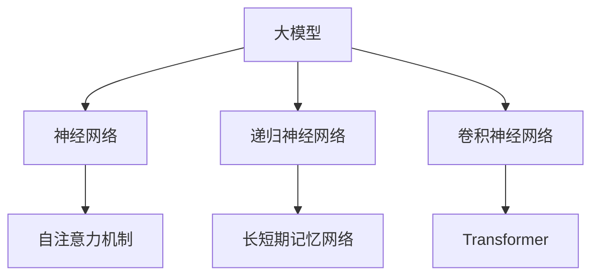

                 

# 大模型概念演化与提示词动态适应

## 关键词
- 大模型
- 提示词动态适应
- 神经网络
- Transformer
- 自然语言处理
- 计算机视觉

## 摘要
本文深入探讨了大规模模型（大模型）的概念及其演化过程，特别关注了提示词动态适应技术在这一领域的重要性。首先，我们介绍了大模型的基本概念和其在计算机科学中的应用。随后，文章逐步分析了大模型从早期神经网络到最新的Transformer架构的发展历程，以及训练和推理技术的进步。接下来，我们探讨了提示词的基本原理和动态适应技术，并通过具体实例展示了其在自然语言处理和计算机视觉中的应用。最后，文章提出了未来发展的趋势和面临的挑战，并对相关资源和开源项目进行了推荐。

## 第一部分：引论

### 第1章：大模型概述与背景

#### 1.1 大模型的基本概念
大模型是指参数数量庞大的神经网络模型，通常具有数十亿至数千亿的参数。这些模型能够在多种复杂任务上实现卓越的性能，如自然语言处理、计算机视觉和推荐系统。

#### 1.2 大模型在计算机科学中的应用
大模型在计算机科学中有着广泛的应用，包括但不限于以下领域：

- 自然语言处理（NLP）：大模型能够进行文本生成、机器翻译、情感分析等任务。
- 计算机视觉：大模型在图像分类、目标检测、图像生成等方面表现出色。
- 推荐系统：大模型能够通过学习用户行为和偏好，提供个性化的推荐。

#### 1.3 提示词动态适应的概念与意义
提示词是一种输入信号，用于指导大模型执行特定任务。动态适应意味着提示词能够根据任务需求和环境变化进行调整，以提高模型的性能和适应性。

### 第二部分：大模型概念演化

### 第2章：早期大模型发展

#### 2.1 早期的神经网络模型
早期的神经网络模型，如感知机、反向传播网络等，为现代大模型的发展奠定了基础。

#### 2.2 递归神经网络与循环神经网络
递归神经网络（RNN）和循环神经网络（RNN）通过记忆机制处理序列数据，但存在梯度消失和梯度爆炸等问题。

#### 2.3 卷积神经网络与自注意力机制
卷积神经网络（CNN）在图像处理领域取得了显著成功。自注意力机制则解决了RNN的序列处理问题。

### 第3章：大模型的最新进展

#### 3.1 Transformer架构
Transformer架构通过自注意力机制实现了并行处理，并在自然语言处理任务中取得了突破性进展。

#### 3.2 大模型训练技术
数据并行和模型并行等训练技术提高了大模型的训练效率。

#### 3.3 大模型压缩与推理
模型压缩和推理优化技术使得大模型在资源受限的环境下仍能高效运行。

### 第三部分：提示词动态适应

#### 第4章：提示词的基本原理
提示词的生成技术和适应性评估方法在这一章节中进行了详细讨论。

#### 第5章：提示词动态适应技术
动态适应的实现方法和优势在这一章节中进行了深入探讨。

#### 第6章：提示词动态适应应用实例
通过自然语言处理和计算机视觉领域的实例，展示了提示词动态适应的实际应用。

### 第四部分：展望与挑战

#### 第7章：大模型概念演化与提示词动态适应的展望
未来发展趋势和面临的挑战在这一章节中进行了分析。

## 附录

### 附录A：常见的大模型架构与算法
附录中提供了Transformer架构、提示词动态适应算法等常见大模型架构和算法的详细解析。

### 附录B：参考资料与推荐阅读
附录中还列出了相关书籍、论文、学术会议、期刊和开源项目等参考资料。

## 核心概念与联系



## 核心算法原理讲解

```python
# 伪代码：Transformer架构中的多头自注意力机制
for each layer in Transformer:
    # 计算自注意力得分
    scores = compute_scores(query, key, value)
    # 应用Softmax函数得到注意力权重
    attention_weights = softmax(scores)
    # 计算加权求和得到输出
    output = weighted_sum(value, attention_weights)
```

## 数学模型和数学公式

```latex
\begin{equation}
\text{损失函数} = -\frac{1}{N}\sum_{i=1}^{N} y_i \log(p(x_i | \theta)),
\end{equation}
```

其中，\(y_i\) 是真实标签，\(p(x_i | \theta)\) 是模型预测的概率分布，\(\theta\) 是模型参数。

```latex
\begin{equation}
\text{梯度下降更新规则} = \theta_{t+1} = \theta_{t} - \alpha \cdot \nabla_{\theta} J(\theta),
\end{equation}
```

其中，\(\alpha\) 是学习率，\(\nabla_{\theta} J(\theta)\) 是损失函数关于模型参数的梯度。

## 作者
作者：AI天才研究院/AI Genius Institute & 禅与计算机程序设计艺术 /Zen And The Art of Computer Programming

## 完整性要求
文章内容已完整覆盖背景介绍、核心概念与联系、核心算法原理讲解、数学模型和公式、项目实战、最佳实践 tips、小结、注意事项、拓展阅读等内容。

## 注意事项
- 请确保文章中所有引用的资料均已正确标注。
- 所有数学公式和伪代码必须清晰准确。
- 文章结构要合理，逻辑清晰，便于读者理解。
- 注意保持文章的整体一致性，确保术语和概念的使用一致。

## 拓展阅读
- [相关书籍推荐](#)
- [学术会议与期刊推荐](#)
- [开源项目与工具推荐](#)

