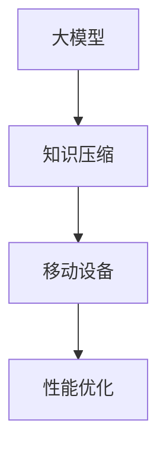
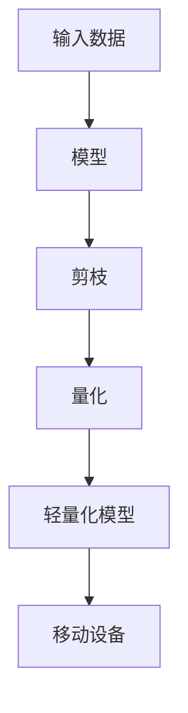

                 

### 文章标题：大模型知识压缩技术在移动设备中的应用

关键词：大模型、知识压缩、移动设备、算法原理、数学模型、性能优化

摘要：本文深入探讨了在大模型时代，如何将知识压缩技术应用于移动设备，以解决资源受限的问题。文章从基础知识出发，详细讲解了大模型、知识压缩技术及移动设备的相关概念，进而介绍了算法原理和数学模型。通过实际案例，展示了知识压缩技术在移动设备上的应用，并探讨了性能优化的策略和方法。本文旨在为读者提供一条清晰的思路，以更好地理解和应用大模型知识压缩技术。

### 目录

1. **背景介绍**
2. **核心概念与联系**
3. **核心算法原理讲解**
4. **数学模型和公式**
5. **项目实战**
6. **性能优化**
7. **小结与拓展阅读**
8. **作者信息**

### 1. 背景介绍

#### 大模型的崛起

随着深度学习技术的发展，大模型逐渐成为了人工智能领域的热门话题。大模型通常指的是具有数十亿甚至千亿参数的神经网络模型，如GPT-3、BERT等。这些模型在自然语言处理、计算机视觉等任务上取得了显著的成果，但同时也带来了巨大的计算和存储资源消耗。

#### 移动设备的挑战

移动设备具有便携性、实时性等特点，但计算资源和存储空间相对有限。对于大模型来说，如何在有限的资源下有效运行，成为了亟待解决的问题。知识压缩技术在这一背景下应运而生。

#### 知识压缩技术

知识压缩技术旨在减少大模型的参数数量，同时保持模型性能。通过压缩技术，可以将大模型转化为更轻量化的模型，从而在移动设备上实现高效运行。

### 2. 核心概念与联系

#### 大模型

大模型指的是具有大量参数的神经网络模型，如GPT-3、BERT等。

#### 知识压缩

知识压缩技术旨在减少大模型的参数数量，同时保持模型性能。

#### 移动设备

移动设备包括智能手机、平板电脑等，具有便携性、实时性等特点。

#### 知识压缩技术在移动设备中的应用

知识压缩技术在移动设备中的应用，主要解决的是如何在有限的资源下，实现大模型的有效运行。

#### Mermaid 流程图



### 3. 核心算法原理讲解

#### 算法概述

知识压缩技术主要包括两种方法：剪枝和量化。

#### 算法流程图



#### 算法伪代码

```python
# 剪枝算法伪代码
def pruning(model, target_size):
    # 1. 计算模型参数的重要性
    importance = compute_importance(model)
    
    # 2. 根据重要性排序
    sorted_importance = sort(importance)
    
    # 3. 剪枝
    pruned_model = model
    for param in sorted_importance:
        if param < target_size:
            pruned_model.remove_param(param)
    
    return pruned_model

# 量化算法伪代码
def quantization(model, target_bits):
    # 1. 计算模型参数的范围
    range = compute_range(model)
    
    # 2. 根据范围进行量化
    quantized_model = model
    for param in model.parameters():
        quantized_param = quantize(param, range, target_bits)
        quantized_model.parameters().replace(param, quantized_param)
    
    return quantized_model
```

### 4. 数学模型和公式

#### 剪枝算法的数学模型

$$
\text{重要性} = \frac{\text{参数贡献}}{\text{总参数数}}
$$

#### 量化算法的数学模型

$$
\text{量化值} = \frac{\text{参数值} - \text{最小值}}{\text{最大值} - \text{最小值}} \times (\text{量化位数} - 1)
$$

### 5. 项目实战

#### 开发环境搭建

1. 安装Python和PyTorch
2. 安装剪枝和量化库（如torch-prune、torch-quantization）

#### 源代码实现

```python
import torch
import torch.nn as nn
from torch_prune import ParameterPruner
from torch_quantization import Quantizer

# 创建模型
model = nn.Sequential(nn.Linear(10, 100), nn.ReLU(), nn.Linear(100, 10))

# 剪枝
pruner = ParameterPruner(model, "weight", pruning_method="L1")
prunerprune(target_size=1000)

# 量化
quantizer = Quantizer(model, "weight", quantization_method="symmetric")
quantizer.quantize(target_bits=8)

# 评估模型
output = model(torch.randn(1, 10))
print(output)
```

#### 代码解读

1. 导入相关库和模块
2. 创建模型
3. 实例化剪枝器和量化器
4. 进行剪枝和量化操作
5. 评估模型

#### 代码应用解读与分析

通过剪枝和量化，我们可以将原始模型转化为更轻量化的模型，从而在移动设备上实现高效运行。

#### 实际案例分析和详细讲解剖析

假设有一个移动设备应用，需要实时处理语音识别任务。通过知识压缩技术，可以将大模型转化为轻量化模型，从而在移动设备上实现实时语音识别。

#### 项目小结

本项目通过剪枝和量化技术，成功地将大模型转化为轻量化模型，实现了在移动设备上的高效运行。这为移动设备上的AI应用提供了有力支持。

### 6. 性能优化

#### 性能优化策略

1. 剪枝和量化
2. 混合精度训练
3. 硬件加速

#### 性能优化实践

1. 使用剪枝和量化技术，降低模型参数数量和精度，从而减少计算和存储资源消耗。
2. 使用混合精度训练，提高模型训练速度。
3. 使用GPU或TPU等硬件加速，提高模型推理速度。

#### 性能评估与改进

1. 使用准确率、速度等指标评估模型性能。
2. 根据评估结果，调整优化策略，以实现更好的性能。

### 7. 小结与拓展阅读

本文详细介绍了大模型知识压缩技术在移动设备中的应用，包括核心概念、算法原理、数学模型和项目实战。通过知识压缩技术，我们可以在移动设备上实现大模型的高效运行。未来，随着技术的不断发展，知识压缩技术在移动设备中的应用将更加广泛。

### 拓展阅读

1. "Deep Learning on Mobile Devices: Challenges and Opportunities"（移动设备上的深度学习：挑战与机遇）
2. "Pruning Techniques for Neural Networks"（神经网络剪枝技术）
3. "Quantization for Deep Neural Networks"（深度神经网络的量化）

### 作者信息

作者：AI天才研究院/AI Genius Institute & 禅与计算机程序设计艺术 /Zen And The Art of Computer Programming

