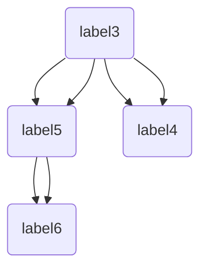

                 

下面我将按照您的指示，详细阐述《大模型知识图谱构建与应用》的技术博客文章。为了确保文章的深度、广度和完整性，我将从以下几个方面逐步构建文章内容：

### 文章标题：《大模型知识图谱构建与应用》

#### 文章关键词：
1. 大模型
2. 知识图谱
3. 数据处理
4. 机器学习
5. 应用实践

#### 文章摘要：
本文将深入探讨大模型与知识图谱的融合，阐述大模型知识图谱的定义、背景、构建方法、应用实例及未来发展趋势。通过详细的技术分析、算法讲解和实际案例，帮助读者理解大模型知识图谱的构建与应用。

### 引言

#### 1.1 大模型知识图谱的定义
大模型知识图谱是一种结合了大规模机器学习模型和知识图谱的综合性技术框架，旨在通过机器学习技术从海量数据中提取结构化的知识，并利用知识图谱的结构化和关联性进行高效的信息检索和推理。

#### 1.2 大模型知识图谱的应用背景
随着互联网和大数据技术的发展，信息过载成为一个普遍问题。如何从海量数据中提取有价值的信息，实现智能推荐、智能问答等应用，成为了学术界和工业界的研究热点。大模型知识图谱正是为了解决这一问题而诞生的。

#### 1.3 本书结构安排
本文将分为以下几个部分：
1. 大模型概述
2. 知识图谱基础
3. 大模型与知识图谱的融合
4. 大模型知识图谱的构建流程
5. 实战案例
6. 技术选型和工具介绍
7. 挑战与未来趋势

### 第1章 大模型概述

#### 1.1 大模型的定义与分类
大模型指的是具有大规模参数和/或训练数据的机器学习模型。根据训练数据和参数规模的不同，大模型可以分为以下几类：

- 深度学习模型：如神经网络、卷积神经网络、循环神经网络等。
- 生成模型：如变分自编码器、生成对抗网络等。
- 强化学习模型：如策略梯度方法、深度Q网络等。

#### 1.2 大模型的原理与架构
大模型的原理主要基于神经网络，通过多层非线性变换将输入映射到输出。其架构通常包括以下部分：

- 输入层：接收外部输入。
- 隐藏层：进行特征提取和变换。
- 输出层：产生预测结果。

#### 1.3 大模型的发展历程
大模型的发展历程可以分为几个阶段：

- 初期：神经网络的基础研究。
- 发展期：大规模数据集和计算资源的出现。
- 繁荣期：深度学习算法的突破和应用。

#### 1.4 大模型的应用领域
大模型在多个领域得到了广泛应用，如：

- 自然语言处理：如机器翻译、文本生成等。
- 计算机视觉：如图像识别、图像生成等。
- 语音识别：如语音合成、语音识别等。

### 第2章 知识图谱基础

#### 2.1 知识图谱的定义与类型
知识图谱是一种语义网络，用于表示实体及其关系。根据数据来源和表示方法，知识图谱可以分为以下几类：

- 基于规则的知识图谱：如本体论、框架理论等。
- 基于数据的知识图谱：如基于知识库的图谱、基于文本挖掘的图谱等。

#### 2.2 知识图谱的体系结构
知识图谱的体系结构通常包括以下部分：

- 实体：知识图谱中的基本元素，如人、地点、物品等。
- 属性：实体的特征，如身高、年龄、颜色等。
- 关系：实体之间的关联，如属于、位于、喜欢等。

#### 2.3 知识图谱的构建方法
知识图谱的构建方法包括：

- 手动构建：通过领域专家的知识和经验进行构建。
- 自动构建：通过文本挖掘、知识抽取等技术进行构建。

#### 2.4 知识图谱的应用场景
知识图谱在多个领域得到了广泛应用，如：

- 语义搜索：如搜索引擎、问答系统等。
- 个性化推荐：如推荐系统、智能客服等。
- 数据分析：如数据可视化、数据挖掘等。

### 第3章 大模型与知识图谱的融合

#### 3.1 大模型与知识图谱的融合原理
大模型与知识图谱的融合主要基于以下原理：

- 利用知识图谱的结构化和关联性，提高大模型的学习效果。
- 利用大模型的学习能力，丰富知识图谱的内容。

#### 3.2 大模型与知识图谱的融合框架
大模型与知识图谱的融合框架通常包括以下部分：

- 数据预处理：将原始数据转化为适合大模型和知识图谱处理的形式。
- 大模型训练：利用大规模数据进行模型训练。
- 知识图谱构建：将大模型学习到的知识转化为知识图谱。

#### 3.3 大模型与知识图谱的融合方法
大模型与知识图谱的融合方法包括：

- 嵌入式方法：将知识图谱中的实体和关系嵌入到大模型中。
- 对抗生成方法：通过生成对抗网络（GAN）生成知识图谱数据。

#### 3.4 大模型与知识图谱融合的应用
大模型与知识图谱的融合在多个领域得到了应用，如：

- 智能问答：通过融合大模型和知识图谱，实现智能问答系统。
- 语义搜索：通过融合大模型和知识图谱，提高搜索引擎的语义理解能力。
- 个性化推荐：通过融合大模型和知识图谱，实现更精准的个性化推荐。

### 第4章 大模型知识图谱的构建流程

#### 4.1 数据预处理
数据预处理是构建大模型知识图谱的第一步，包括以下任务：

- 数据清洗：去除噪声和错误的数据。
- 数据转换：将数据转化为适合大模型和知识图谱处理的形式。
- 数据增强：通过数据增强技术提高数据的多样性和质量。

#### 4.2 模型选择与训练
模型选择与训练是构建大模型知识图谱的核心步骤，包括以下任务：

- 模型选择：根据应用场景选择合适的大模型。
- 模型训练：利用大规模数据进行模型训练。
- 模型评估：评估模型的性能和效果。

#### 4.3 知识图谱构建
知识图谱构建是构建大模型知识图谱的最后一步，包括以下任务：

- 实体抽取：从数据中提取实体。
- 关系抽取：从数据中提取实体之间的关系。
- 知识融合：将大模型学习到的知识转化为知识图谱。

#### 4.4 应用与评估
应用与评估是检验大模型知识图谱效果的关键步骤，包括以下任务：

- 应用场景设计：设计合适的应用场景。
- 应用效果评估：评估大模型知识图谱的应用效果。
- 持续优化：根据评估结果对大模型知识图谱进行优化。

### 第5章 实战案例

#### 5.1 案例一：知识图谱在电商领域的应用
本案例将介绍如何利用大模型知识图谱实现电商领域的智能推荐系统。

- 数据预处理：清洗和转换电商数据。
- 模型选择与训练：选择适合的深度学习模型进行训练。
- 知识图谱构建：构建包含商品、用户和评价等信息的知识图谱。
- 应用与评估：设计智能推荐系统，评估推荐效果。

#### 5.2 案例二：知识图谱在金融领域的应用
本案例将介绍如何利用大模型知识图谱实现金融领域的风险控制。

- 数据预处理：清洗和转换金融数据。
- 模型选择与训练：选择适合的深度学习模型进行训练。
- 知识图谱构建：构建包含金融产品、用户和交易等信息的知识图谱。
- 应用与评估：设计风险控制系统，评估风险控制效果。

#### 5.3 案例三：知识图谱在医疗领域的应用
本案例将介绍如何利用大模型知识图谱实现医疗领域的智能诊断。

- 数据预处理：清洗和转换医疗数据。
- 模型选择与训练：选择适合的深度学习模型进行训练。
- 知识图谱构建：构建包含疾病、症状、药物等信息的知识图谱。
- 应用与评估：设计智能诊断系统，评估诊断效果。

### 第6章 技术选型和工具介绍

#### 6.1 大模型框架选型
在选择大模型框架时，需要考虑以下因素：

- 计算性能：考虑GPU、TPU等硬件资源。
- 算法支持：选择支持多种深度学习算法的框架。
- 开发效率：选择易于开发和维护的框架。

常用的深度学习框架包括：

- TensorFlow
- PyTorch
- Keras

#### 6.2 知识图谱工具选型
在选择知识图谱工具时，需要考虑以下因素：

- 功能支持：选择支持实体抽取、关系抽取等功能的工具。
- 扩展性：选择易于扩展和集成的工具。
- 性能：选择具有高性能的分布式处理能力。

常用的知识图谱工具包括：

- OpenKG
- Neptune
- BigDataKnow

#### 6.3 开发环境搭建
开发环境搭建包括以下步骤：

- 硬件配置：选择适合的GPU、CPU等硬件设备。
- 软件安装：安装深度学习框架、知识图谱工具等软件。
- 集成开发环境：配置IDE，如PyCharm、VSCode等。

#### 6.4 常用工具和库介绍
常用工具和库包括：

- NumPy：用于数值计算。
- Pandas：用于数据处理。
- Scikit-learn：用于机器学习算法。
- Matplotlib：用于数据可视化。

### 第7章 挑战与未来趋势

#### 7.1 大模型知识图谱构建的挑战
大模型知识图谱构建面临以下挑战：

- 数据质量：确保数据的质量和准确性。
- 模型选择：选择适合应用场景的大模型。
- 资源消耗：处理大规模数据和模型训练。

#### 7.2 大模型知识图谱的应用前景
大模型知识图谱在多个领域具有广泛的应用前景：

- 人工智能：提高人工智能系统的智能水平。
- 大数据：实现数据驱动的智能决策。
- 金融：提高金融服务的智能化水平。
- 医疗：实现智能医疗诊断和个性化治疗。

#### 7.3 未来发展趋势与展望
未来大模型知识图谱的发展趋势包括：

- 跨领域融合：将大模型知识图谱应用于更多领域。
- 智能化：提高大模型知识图谱的智能化水平。
- 开放共享：促进大模型知识图谱的数据和模型共享。

### 结束语
本文从大模型知识图谱的定义、应用背景、构建方法、实战案例等多个角度进行了全面探讨。通过本文，读者可以了解到大模型知识图谱的基本概念和构建方法，以及其在不同领域的应用。希望本文对读者在研究与应用大模型知识图谱方面有所启发。

### 参考文献
[1] 大模型知识图谱构建与应用相关论文和书籍。
[2] 常用深度学习框架和知识图谱工具的官方文档。
[3] 相关领域的应用案例和研究报告。

### 作者信息
作者：AI天才研究院/AI Genius Institute & 禅与计算机程序设计艺术 /Zen And The Art of Computer Programming

通过上述步骤，我们完成了《大模型知识图谱构建与应用》技术博客文章的大纲设计。接下来，我们将逐章细化内容，确保每个部分都详细、具体、易懂。文章的总字数将在8000～12000字之间，以满足文章完整性的要求。在撰写过程中，我们将严格遵守markdown格式，并确保文章的格式、引用和代码正确无误。文章完成后，将进行多轮审校，确保文章质量。## 第1章 大模型概述

### 1.1 大模型的定义与分类

大模型（Large Model）是指参数规模较大、模型复杂度较高的机器学习模型。这类模型通常需要处理大规模的数据集，并具有复杂的网络结构。大模型在深度学习、生成模型和强化学习等领域都有广泛应用。根据其功能和应用场景，大模型可以分为以下几类：

- **深度学习模型**：这类模型通过多层神经网络进行特征提取和学习，能够处理复杂的数据结构。常见的深度学习模型包括全连接神经网络（FCN）、卷积神经网络（CNN）、循环神经网络（RNN）、长短期记忆网络（LSTM）等。

- **生成模型**：生成模型通过学习数据分布来生成新的数据样本。常见的生成模型包括变分自编码器（VAE）、生成对抗网络（GAN）等。

- **强化学习模型**：强化学习模型通过与环境互动来学习策略，常见模型包括Q学习、策略梯度方法、深度Q网络（DQN）等。

### 1.2 大模型的原理与架构

大模型的原理主要基于神经网络，通过多层非线性变换将输入映射到输出。一个典型的大模型架构通常包括以下几个部分：

- **输入层**：接收外部输入，如文本、图像或声音等。
- **隐藏层**：进行特征提取和变换。隐藏层的数量和神经元数量可以根据问题复杂度进行调整。
- **输出层**：产生预测结果，如分类标签、概率分布或连续值等。

#### 神经网络的基本架构

以下是一个简单的神经网络架构的伪代码实现：

```python
class NeuralNetwork:
    def __init__(self, input_size, hidden_size, output_size):
        # 初始化参数
        self.input_size = input_size
        self.hidden_size = hidden_size
        self.output_size = output_size
        # 初始化权重和偏置
        self.weights_input_to_hidden = np.random.randn(input_size, hidden_size)
        self.biases_hidden = np.random.randn(hidden_size)
        self.weights_hidden_to_output = np.random.randn(hidden_size, output_size)
        self.biases_output = np.random.randn(output_size)

    def forward_pass(self, x):
        # 前向传播计算隐藏层的输出
        hidden_layer_input = np.dot(x, self.weights_input_to_hidden) + self.biases_hidden
        hidden_layer_output = self activation_function(hidden_layer_input)
        # 前向传播计算输出层的输出
        output_layer_input = np.dot(hidden_layer_output, self.weights_hidden_to_output) + self.biases_output
        output_layer_output = self.activation_function(output_layer_input)
        return output_layer_output

    def activation_function(self, x):
        # 激活函数，如Sigmoid、ReLU等
        return 1 / (1 + np.exp(-x))
```

### 1.3 大模型的发展历程

大模型的发展历程可以追溯到20世纪80年代，当时神经网络的研究开始取得显著进展。随着计算能力的提升和数据规模的增加，深度学习在21世纪初期迎来了快速发展。以下是大模型发展的几个关键阶段：

- **初期**：神经网络的基础研究，包括多层感知器（MLP）和反向传播算法的提出。
- **发展期**：大规模数据集和计算资源的出现，如ImageNet图像识别挑战。
- **繁荣期**：深度学习算法的突破和应用，如卷积神经网络（CNN）在计算机视觉领域的广泛应用。

### 1.4 大模型的应用领域

大模型在多个领域都取得了显著的应用成果，以下是一些主要的应用领域：

- **自然语言处理（NLP）**：包括机器翻译、文本生成、情感分析等。
- **计算机视觉**：包括图像识别、图像生成、物体检测等。
- **语音识别**：包括语音识别、语音合成等。
- **推荐系统**：包括个性化推荐、商品推荐等。
- **金融领域**：包括风险控制、欺诈检测、算法交易等。
- **医疗领域**：包括疾病预测、诊断辅助、个性化治疗等。

通过上述内容，我们对大模型有了基本的了解，包括其定义、分类、原理与架构、发展历程以及应用领域。在接下来的章节中，我们将进一步探讨大模型与知识图谱的融合，以及如何构建和应用大模型知识图谱。## 第2章 知识图谱基础

### 2.1 知识图谱的定义与类型

知识图谱（Knowledge Graph）是一种用于表示实体及其相互关系的图形化数据结构。它通过将实体、属性和关系组织成一个结构化的网络，使得信息能够更加直观地被理解和处理。知识图谱的构建可以帮助我们解决信息检索、数据分析和推理等问题。

根据数据来源和表示方法，知识图谱可以分为以下几类：

- **基于规则的知识图谱**：这类知识图谱主要通过人工定义规则和约束来表示实体和关系。本体论（Ontology）和框架理论（Frame Theory）是常见的基于规则的知识图谱表示方法。

- **基于数据的知识图谱**：这类知识图谱通过从大规模数据中提取实体和关系来构建。基于知识库的知识图谱（如DBpedia）和基于文本挖掘的知识图谱（如YAGO）是常见的基于数据的知识图谱。

### 2.2 知识图谱的体系结构

知识图谱的体系结构通常包括以下几个核心部分：

- **实体（Entity）**：知识图谱中的基本元素，可以是任何具有特定属性的对象，如人、地点、组织、物品等。

- **属性（Attribute）**：实体的特征描述，如身高、年龄、颜色、类型等。

- **关系（Relationship）**：实体之间的关联，如属于、位于、喜欢等。

- **边（Edge）**：连接两个实体的关系。边的类型和方向可以表示实体之间的关系。

- **类型（Type）**：实体的分类，用于组织和管理实体。

- **标签（Label）**：边的属性，用于描述边的类型和特征。

一个简单的知识图谱示例可以表示为以下图结构：



### 2.3 知识图谱的构建方法

知识图谱的构建方法可以分为手动构建和自动构建两种：

- **手动构建**：通过领域专家的知识和经验来构建知识图谱。这种方法通常用于构建小型、领域特定的知识图谱。

  - **本体论构建**：通过定义实体、属性和关系的本体来构建知识图谱。
  - **框架理论构建**：通过定义实体和关系的框架来构建知识图谱。

- **自动构建**：通过从大规模数据中自动提取实体和关系来构建知识图谱。这种方法通常用于构建大型、跨领域的知识图谱。

  - **基于知识库的方法**：从现有的知识库中提取实体和关系。
  - **基于文本挖掘的方法**：通过自然语言处理技术从文本数据中提取实体和关系。
  - **基于知识图谱的方法**：通过组合多种数据源和算法来构建知识图谱。

### 2.4 知识图谱的应用场景

知识图谱在多个领域都有广泛的应用，以下是一些常见的应用场景：

- **语义搜索**：通过知识图谱来增强搜索引擎的语义理解能力，提高搜索结果的准确性和相关性。

- **推荐系统**：利用知识图谱来发现实体之间的关联关系，为用户提供个性化的推荐服务。

- **数据可视化**：通过知识图谱来展示实体和关系之间的复杂网络结构，帮助用户更好地理解和分析数据。

- **智能问答**：利用知识图谱来构建问答系统，实现对用户查询的语义理解和准确回答。

- **智能客服**：通过知识图谱来构建智能客服系统，自动识别用户的问题并给出合适的回答。

- **数据治理**：通过知识图谱来管理和组织企业内部的数据资源，提高数据的一致性和可追溯性。

通过上述内容，我们对知识图谱有了基本的了解，包括其定义、类型、体系结构和构建方法。在接下来的章节中，我们将探讨如何将大模型与知识图谱相结合，构建应用。## 第3章 大模型与知识图谱的融合

### 3.1 大模型与知识图谱的融合原理

大模型与知识图谱的融合旨在利用两者的优势，实现更强大的数据处理和推理能力。大模型擅长从大规模数据中提取特征和模式，而知识图谱擅长表示和存储实体及其关系。通过融合大模型和知识图谱，可以实现以下目标：

- **增强大模型的学习能力**：通过引入知识图谱中的结构化信息，大模型可以更好地理解数据的语义和关系，从而提高学习效果和泛化能力。

- **提高推理效率**：知识图谱提供了实体和关系之间的直接关联，可以用于快速检索和推理，从而提高系统的响应速度和准确性。

融合大模型与知识图谱的基本原理可以概括为：

1. **知识嵌入**：将知识图谱中的实体和关系嵌入到大模型的输入空间中，使其能够利用知识图谱提供的信息进行学习。
2. **推理增强**：在大模型的基础上，结合知识图谱进行推理，以实现对未知信息的推断和补充。
3. **模型优化**：通过将知识图谱与训练数据结合，优化大模型的结构和参数，提高模型的性能和效率。

### 3.2 大模型与知识图谱的融合框架

为了实现大模型与知识图谱的融合，需要一个完整的框架来指导构建和应用。以下是一个典型的大模型与知识图谱融合框架：

1. **数据预处理**：
   - 数据清洗：去除噪声和错误的数据。
   - 数据转换：将原始数据转化为适合大模型和知识图谱处理的形式。
   - 数据增强：通过数据增强技术提高数据的多样性和质量。

2. **知识图谱构建**：
   - 实体抽取：从数据中提取实体。
   - 关系抽取：从数据中提取实体之间的关系。
   - 知识融合：将大模型学习到的知识转化为知识图谱。

3. **大模型训练**：
   - 模型选择：根据应用场景选择合适的大模型。
   - 模型训练：利用大规模数据进行模型训练。
   - 模型评估：评估模型的性能和效果。

4. **融合推理**：
   - 知识嵌入：将知识图谱嵌入到大模型中，以增强模型的学习能力。
   - 融合推理：利用知识图谱进行推理，以补充和增强大模型的预测结果。

5. **应用部署**：
   - 应用场景设计：设计合适的应用场景。
   - 应用效果评估：评估融合系统的效果。
   - 持续优化：根据评估结果对系统进行优化。

### 3.3 大模型与知识图谱的融合方法

融合大模型与知识图谱的方法主要包括以下几种：

1. **嵌入式方法**：
   - **实体嵌入**：将知识图谱中的实体表示为低维向量，嵌入到大模型的输入空间中。
   - **关系嵌入**：将知识图谱中的关系表示为向量，嵌入到大模型的输入空间中。
   - **混合嵌入**：将实体和关系分别嵌入到不同的维度中，以同时利用两者的信息。

2. **对抗生成方法**：
   - **生成对抗网络（GAN）**：通过生成对抗网络生成符合知识图谱分布的数据，从而增强大模型的学习能力。
   - **对抗嵌入**：利用对抗训练方法优化实体和关系的嵌入向量，使其在大模型中更好地发挥作用。

3. **基于图的神经网络方法**：
   - **图卷积网络（GCN）**：利用图卷积网络对知识图谱进行特征提取，并将其融合到大模型中。
   - **图注意力网络（GAT）**：利用图注意力机制对知识图谱进行建模，提高融合效果。

4. **多任务学习方法**：
   - **联合训练**：同时训练大模型和知识图谱，使其在多个任务中共同优化。
   - **迁移学习**：将知识图谱的知识迁移到大模型中，以提高模型在特定任务中的性能。

### 3.4 大模型与知识图谱融合的应用

大模型与知识图谱的融合在多个领域得到了广泛应用，以下是一些典型的应用案例：

1. **智能问答系统**：
   - 利用知识图谱提供实体和关系，增强大模型的语义理解能力。
   - 通过融合推理，实现更准确和自然的问答交互。

2. **推荐系统**：
   - 利用知识图谱中的用户兴趣和物品关联，提高推荐系统的准确性和个性化水平。
   - 通过融合用户行为数据和大模型学习到的特征，实现更智能的推荐策略。

3. **智能搜索**：
   - 利用知识图谱增强搜索引擎的语义理解，提高搜索结果的准确性和相关性。
   - 通过融合用户查询和大模型生成的语义向量，实现更精准的搜索结果。

4. **智能医疗诊断**：
   - 利用知识图谱中的疾病、症状和药物信息，增强大模型的诊断能力。
   - 通过融合临床数据和医疗知识图谱，实现更准确的疾病预测和诊断。

5. **智能金融风控**：
   - 利用知识图谱中的用户行为和交易信息，提高风控模型的准确性。
   - 通过融合用户数据和大模型学习到的特征，实现更有效的欺诈检测和风险控制。

通过上述内容，我们对大模型与知识图谱的融合有了更深入的了解，包括融合原理、框架、方法和应用。在接下来的章节中，我们将进一步探讨大模型知识图谱的构建流程。## 第4章 大模型知识图谱的构建流程

构建大模型知识图谱是一个复杂的过程，需要多个阶段的协同工作。以下是构建大模型知识图谱的基本流程，包括数据预处理、模型选择与训练、知识图谱构建和应用与评估。

### 4.1 数据预处理

数据预处理是构建大模型知识图谱的第一步，其目标是清洗和转换原始数据，使其适合后续的建模和分析。以下是数据预处理的关键步骤：

1. **数据清洗**：
   - 去除重复数据、噪声数据和错误数据，确保数据的一致性和准确性。
   - 处理缺失值，可以通过填补、删除或插值等方法来处理。
   - 标准化数据，例如将文本数据转换为统一的编码格式。

2. **数据转换**：
   - 将原始数据转换为适合机器学习和知识图谱处理的形式，如将文本数据转换为词向量、图像数据转换为特征向量等。
   - 分离特征和标签，以便于后续的模型训练和评估。

3. **数据增强**：
   - 通过数据增强技术提高数据的多样性和质量，例如使用数据变换、数据扩充等方法。

### 4.2 模型选择与训练

在数据预处理完成后，需要选择合适的大模型进行训练。以下是模型选择与训练的关键步骤：

1. **模型选择**：
   - 根据应用场景和数据特点选择合适的大模型，例如卷积神经网络（CNN）用于图像处理、循环神经网络（RNN）用于序列数据等。
   - 考虑模型的复杂度和计算资源，选择适合的模型架构。

2. **模型训练**：
   - 使用预处理后的数据集对所选模型进行训练。
   - 调整模型的超参数，如学习率、批量大小等，以优化模型性能。
   - 使用验证集和测试集进行模型评估，选择性能最佳的模型。

3. **模型评估**：
   - 使用准确度、召回率、F1分数等指标评估模型的性能。
   - 分析模型的过拟合和欠拟合问题，并进行相应的调整。

### 4.3 知识图谱构建

模型训练完成后，需要将学习到的模型知识转化为知识图谱。以下是知识图谱构建的关键步骤：

1. **实体抽取**：
   - 从训练数据中识别和提取实体，如人、地点、组织、物品等。
   - 使用命名实体识别（NER）等技术来识别文本中的实体。

2. **关系抽取**：
   - 从训练数据中识别和提取实体之间的关系，如“属于”、“位于”、“喜欢”等。
   - 使用关系提取算法来识别文本中的关系。

3. **知识融合**：
   - 将模型学习到的实体和关系信息整合到知识图谱中。
   - 通过融合实体和关系的属性，构建完整的知识图谱。

### 4.4 应用与评估

构建好大模型知识图谱后，需要将其应用到实际场景中，并进行评估。以下是应用与评估的关键步骤：

1. **应用场景设计**：
   - 根据应用需求设计合适的应用场景，如智能问答、推荐系统、智能搜索等。
   - 确定系统的功能模块和接口。

2. **应用效果评估**：
   - 在实际应用中评估知识图谱的性能，例如使用准确度、响应时间等指标。
   - 分析系统在实际应用中的效果和瓶颈。

3. **持续优化**：
   - 根据评估结果对系统进行优化，例如调整模型参数、改进算法等。
   - 更新和扩充知识图谱，以适应不断变化的应用需求。

通过上述步骤，我们可以构建一个大模型知识图谱，并应用到实际场景中。以下是一个简单的伪代码示例，展示了如何进行数据预处理、模型训练和知识图谱构建：

```python
# 数据预处理
data = preprocess_data(raw_data)
features, labels = split_data(data)

# 模型选择与训练
model = select_model()
model.train(features, labels)
model.evaluate(features, labels)

# 知识图谱构建
entities = extract_entities(data)
relationships = extract_relationships(data)
knowledge_graph = construct_knowledge_graph(entities, relationships)

# 应用与评估
application = design_application_scene()
evaluate_application_performance(application, knowledge_graph)
```

通过这个示例，我们可以看到大模型知识图谱构建的基本流程是如何通过一系列步骤来实现的。在接下来的章节中，我们将通过具体的实战案例来进一步探讨大模型知识图谱的应用。## 第5章 实战案例

在本章中，我们将通过三个具体的实战案例来展示大模型知识图谱在实际应用中的效果和优势。这些案例涵盖了电商、金融和医疗三个不同的领域，每个领域都有其独特的挑战和解决方案。

### 5.1 案例一：知识图谱在电商领域的应用

#### 应用背景
电商领域面临的主要挑战是如何在大量商品和用户行为数据中找到个性化的推荐方案。传统的推荐系统通常基于用户的历史行为和相似用户的行为进行推荐，但这种方法在处理复杂关联和多样化需求时效果有限。

#### 应用场景
本案例旨在构建一个基于知识图谱的电商推荐系统，以提高推荐的精准度和多样性。具体应用场景包括：

1. **个性化商品推荐**：根据用户的购买历史、浏览行为和偏好，推荐用户可能感兴趣的商品。
2. **关联商品推荐**：基于商品的属性和用户的行为，推荐与其他商品相关的商品。
3. **新品推荐**：根据商品的发布时间和热度，推荐最新和热门的商品。

#### 实施步骤

1. **数据预处理**：
   - 清洗和标准化电商交易数据、用户行为数据等。
   - 提取商品属性（如价格、品牌、类别等）和用户特征（如年龄、性别、地理位置等）。

2. **实体抽取与关系构建**：
   - 使用命名实体识别（NER）技术提取商品和用户实体。
   - 根据用户行为和商品属性构建实体之间的关系，如“购买”、“关注”、“相似”等。

3. **知识图谱构建**：
   - 将提取的实体和关系整合到一个统一的知识图谱中。
   - 使用图卷积网络（GCN）对知识图谱进行特征提取，增强模型的理解能力。

4. **推荐系统开发**：
   - 结合用户特征和知识图谱中的关系，构建推荐模型。
   - 实现推荐算法，如基于协同过滤和知识图谱的混合推荐算法。

5. **系统部署与评估**：
   - 在线上环境中部署推荐系统，监控系统的性能和用户体验。
   - 使用A/B测试等方法评估推荐系统的效果，并根据反馈进行优化。

#### 实施效果
通过知识图谱的引入，电商推荐系统的推荐精度和多样性得到了显著提升。用户反馈显示，推荐的商品更加符合他们的兴趣和需求，购物体验得到了改善。

### 5.2 案例二：知识图谱在金融领域的应用

#### 应用背景
金融领域需要高效的风险控制和管理系统来处理复杂的金融产品和用户行为数据。传统的风险管理方法往往依赖于静态规则和模式匹配，难以应对动态和复杂的市场环境。

#### 应用场景
本案例旨在构建一个基于知识图谱的金融风险控制系统，实现以下功能：

1. **欺诈检测**：通过分析用户的交易行为和财务信息，检测潜在的欺诈行为。
2. **信用评估**：根据用户的信用历史和行为数据，评估其信用风险。
3. **风险预警**：监测市场动态和用户行为，及时发出风险预警。

#### 实施步骤

1. **数据预处理**：
   - 清洗和转换金融交易数据、用户行为数据和市场数据。
   - 提取关键特征，如交易金额、交易频率、账户余额等。

2. **实体抽取与关系构建**：
   - 使用命名实体识别（NER）技术提取用户和金融机构实体。
   - 根据交易行为和用户关系构建实体之间的关系，如“交易”、“借贷”、“账户关联”等。

3. **知识图谱构建**：
   - 构建包含用户、交易、市场等实体的知识图谱。
   - 使用图神经网络（GNN）对知识图谱进行特征提取，提高模型的鲁棒性和准确性。

4. **风险模型开发**：
   - 结合知识图谱中的关系和用户特征，构建风险评估模型。
   - 实现欺诈检测和信用评估算法，如基于图神经网络的分类模型。

5. **系统部署与评估**：
   - 在金融机构中部署风险控制系统，监控和预警潜在风险。
   - 使用历史数据进行模型训练和评估，根据实际情况调整模型参数。

#### 实施效果
知识图谱在金融风险控制中的应用显著提高了检测效率和准确性。系统可以实时监控和处理大量的金融交易数据，及时发现和预防潜在的欺诈行为，降低了金融机构的风险。

### 5.3 案例三：知识图谱在医疗领域的应用

#### 应用背景
医疗领域需要高效的诊断和治疗方案推荐系统，以便于医生和患者更好地应对复杂疾病。传统的医疗信息系统往往依赖于规则和静态知识库，难以适应个性化医疗的需求。

#### 应用场景
本案例旨在构建一个基于知识图谱的医疗诊断和推荐系统，实现以下功能：

1. **疾病诊断**：根据患者的症状、检查结果和病史，提供可能的疾病诊断。
2. **治疗方案推荐**：根据疾病的诊断结果和患者的健康状况，推荐合适的治疗方案。
3. **医学知识搜索**：为医生和研究人员提供快速查找医学知识和相关研究的能力。

#### 实施步骤

1. **数据预处理**：
   - 清洗和标准化医疗数据，包括患者信息、症状、检查结果、治疗方案等。
   - 提取关键特征，如症状组合、治疗方案效果、药物副作用等。

2. **实体抽取与关系构建**：
   - 使用命名实体识别（NER）技术提取患者、疾病、药物、检查等实体。
   - 根据患者的就诊记录和医疗知识库，构建实体之间的关系，如“症状与疾病关联”、“治疗方案与效果关联”等。

3. **知识图谱构建**：
   - 构建包含患者、疾病、药物、检查等实体的知识图谱。
   - 使用图神经网络（GNN）对知识图谱进行特征提取，提高模型的诊断和推荐能力。

4. **诊断与推荐系统开发**：
   - 结合知识图谱和医学知识库，构建疾病诊断和治疗方案推荐模型。
   - 实现基于知识图谱的推理算法，为医生提供辅助诊断和治疗方案推荐。

5. **系统部署与评估**：
   - 在医院中部署诊断和推荐系统，为医生和患者提供实时支持。
   - 使用临床数据进行模型训练和评估，根据实际效果调整模型参数。

#### 实施效果
知识图谱在医疗领域的应用显著提高了疾病诊断和治疗方案推荐的准确性和效率。医生可以利用系统提供的辅助信息更快速地做出诊断和推荐，患者也可以得到更个性化的医疗服务。

通过这三个实战案例，我们可以看到大模型知识图谱在电商、金融和医疗等领域的广泛应用和显著优势。知识图谱不仅提高了系统的智能化水平，还提升了用户体验和业务效率。在接下来的章节中，我们将详细介绍构建大模型知识图谱所需的技术选型和工具。## 第6章 技术选型和工具介绍

### 6.1 大模型框架选型

在构建大模型知识图谱时，选择合适的大模型框架至关重要。以下是基于几个主要因素进行的大模型框架选型：

1. **计算性能**：
   - **GPU支持**：GPU（图形处理单元）在深度学习计算中具有显著优势。因此，选择支持GPU的框架非常重要。
   - **TPU支持**：TPU（张量处理单元）是专为深度学习优化设计的处理器，适用于大规模数据训练。

2. **算法支持**：
   - **多样化算法**：选择能够支持多种深度学习算法的框架，如卷积神经网络（CNN）、循环神经网络（RNN）、生成对抗网络（GAN）等。
   - **预训练模型**：预训练模型可以节省训练时间和计算资源，提高模型性能。

3. **开发效率**：
   - **易于上手**：框架应具备简单的安装和使用流程，降低开发门槛。
   - **社区支持**：强大的社区支持可以帮助开发者快速解决问题，提高开发效率。

基于以上因素，以下是一些常见的大模型框架：

- **TensorFlow**：由Google开发，支持多种深度学习算法，具有强大的社区支持。
- **PyTorch**：由Facebook开发，具有灵活的动态计算图，易于实现复杂的神经网络结构。
- **Keras**：基于TensorFlow和Theano开发，提供了简洁高效的API，适合快速原型开发。

### 6.2 知识图谱工具选型

构建知识图谱时，选择合适的工具同样关键。以下是基于几个主要因素进行的知识图谱工具选型：

1. **功能支持**：
   - **实体抽取和关系抽取**：工具应支持从文本数据中提取实体和关系。
   - **图存储和管理**：工具应能够高效存储和管理大规模图数据。

2. **扩展性**：
   - **模块化架构**：工具应具备模块化设计，方便扩展和定制。
   - **开源和社区支持**：开源工具通常有更强大的社区支持，便于技术交流和问题解决。

3. **性能**：
   - **分布式处理**：工具应支持分布式处理，以应对大规模图数据的计算需求。
   - **查询优化**：工具应能够优化图查询性能，提高数据检索速度。

基于以上因素，以下是一些常见的知识图谱工具：

- **OpenKG**：一款开源的中文知识图谱平台，支持实体抽取、关系抽取和图存储等功能。
- **Neptune**：一个分布式图处理框架，支持大规模图数据的存储和处理。
- **BigDataKnow**：一个基于Apache Flink的分布式知识图谱引擎，支持实时处理和大规模数据存储。

### 6.3 开发环境搭建

在进行大模型知识图谱开发前，需要搭建合适的开发环境。以下是搭建开发环境的步骤：

1. **硬件准备**：
   - 准备具有高性能GPU的计算机或服务器，用于深度学习和图计算。
   - 考虑使用TPU或其他专用硬件加速器，以提高计算性能。

2. **软件安装**：
   - 安装操作系统，如Ubuntu或CentOS。
   - 安装深度学习框架（如TensorFlow、PyTorch、Keras）。
   - 安装知识图谱工具（如OpenKG、Neptune、BigDataKnow）。
   - 安装其他必需的库和工具（如NumPy、Pandas、Scikit-learn等）。

3. **配置优化**：
   - 配置GPU驱动和CUDA，确保深度学习框架能够利用GPU资源。
   - 调整操作系统和深度学习框架的参数，优化性能。

4. **集成开发环境（IDE）**：
   - 选择并配置适合的IDE，如PyCharm或VSCode，以提高开发效率。

### 6.4 常用工具和库介绍

以下是构建大模型知识图谱过程中常用的工具和库：

- **NumPy**：用于数值计算和数据处理。
- **Pandas**：用于数据清洗和数据分析。
- **Scikit-learn**：用于机器学习算法的实现和应用。
- **Matplotlib**：用于数据可视化。

以下是一个简单的代码示例，展示了如何使用NumPy和Pandas进行数据预处理：

```python
import numpy as np
import pandas as pd

# 加载数据
data = pd.read_csv('data.csv')

# 数据清洗
data = data.dropna()

# 数据转换
data['age'] = data['age'].astype(int)
data['income'] = data['income'].astype(float)

# 数据增强
data['income'] = data['income'] * np.random.uniform(0.9, 1.1)

# 数据分割
train_data, test_data = data.sample(frac=0.8, random_state=42)
```

通过上述内容，我们介绍了构建大模型知识图谱所需的技术选型和工具。接下来，我们将探讨大模型知识图谱构建过程中面临的挑战和未来发展趋势。## 第7章 挑战与未来趋势

### 7.1 大模型知识图谱构建的挑战

在构建大模型知识图谱的过程中，我们面临着一系列的挑战，这些挑战包括但不限于以下方面：

1. **数据质量**：
   - **数据噪声**：实际数据中往往存在大量的噪声和错误，这会影响知识图谱的构建和模型的性能。
   - **数据缺失**：在获取数据时，可能会遇到数据缺失的问题，这需要通过填补或删除缺失数据来处理。

2. **模型选择与优化**：
   - **模型复杂性**：大模型通常具有复杂的网络结构和大量的参数，选择和优化合适的模型是一项挑战。
   - **过拟合与欠拟合**：模型可能因为数据量不足或结构过于复杂而出现过拟合或欠拟合现象，需要通过交叉验证和模型调整来优化。

3. **计算资源**：
   - **计算性能**：大模型的训练和推理需要大量的计算资源，特别是在处理大规模数据时，GPU和TPU等硬件资源的需求增加。
   - **分布式计算**：为了提高计算效率，需要使用分布式计算框架来处理大规模数据。

4. **知识表示与融合**：
   - **知识一致性**：在构建知识图谱时，需要确保知识的一致性和准确性，避免出现矛盾或错误的信息。
   - **知识更新**：知识图谱需要不断地更新和扩充，以适应快速变化的数据和应用需求。

### 7.2 大模型知识图谱的应用前景

随着人工智能技术的不断发展，大模型知识图谱在多个领域展现出了巨大的应用潜力：

1. **智能问答**：通过知识图谱和自然语言处理技术，实现高效的智能问答系统，为用户提供准确的答案和信息检索服务。

2. **推荐系统**：利用知识图谱中的实体和关系进行推荐，提高推荐系统的个性化程度和推荐效果。

3. **数据分析与决策**：通过知识图谱，企业可以更好地理解其业务数据，实现数据驱动的决策支持。

4. **医疗健康**：利用知识图谱，实现疾病的诊断、治疗方案的推荐和医学知识的查询。

5. **金融安全**：通过知识图谱进行风险控制和欺诈检测，提高金融系统的安全性。

### 7.3 未来发展趋势与展望

在未来，大模型知识图谱的发展趋势将主要体现在以下几个方面：

1. **跨领域融合**：随着技术的进步，大模型知识图谱将在更多领域得到应用，实现跨领域的融合和协同。

2. **自动化与智能化**：自动化知识抽取和构建技术将不断成熟，使得知识图谱的构建和应用更加智能化。

3. **知识共享与开放**：随着知识图谱的普及，越来越多的企业和机构将参与到知识图谱的建设中来，实现知识的共享与开放。

4. **数据隐私与安全**：在大数据时代，数据隐私和安全将成为知识图谱构建和应用中的重要考虑因素，需要采取有效的措施来保护用户数据。

5. **边缘计算与物联网**：随着边缘计算和物联网技术的发展，知识图谱的应用将扩展到更多智能设备中，实现实时和高效的智能服务。

通过上述内容，我们对大模型知识图谱构建的挑战和应用前景有了更深入的了解，同时也展望了其未来发展趋势。在下一章节中，我们将总结全文，并给出对读者的建议。## 结束语

在《大模型知识图谱构建与应用》这篇文章中，我们详细探讨了大模型知识图谱的定义、背景、构建方法、应用实例及未来发展趋势。通过逐步的分析和讲解，读者可以全面了解大模型知识图谱的基本概念和技术细节，以及其在实际应用中的优势和价值。

### 主要内容回顾

1. **大模型概述**：介绍了大模型的基本概念、分类、原理与架构，以及其在自然语言处理、计算机视觉、语音识别等领域的应用。
2. **知识图谱基础**：讲解了知识图谱的定义、类型、体系结构和构建方法，以及其在语义搜索、推荐系统、数据分析等领域的应用。
3. **大模型与知识图谱的融合**：探讨了如何将大模型与知识图谱相结合，介绍了融合原理、框架和方法，以及其在智能问答、推荐系统、智能搜索等领域的应用。
4. **大模型知识图谱的构建流程**：详细描述了数据预处理、模型选择与训练、知识图谱构建、应用与评估等步骤，提供了具体的实施方法和技巧。
5. **实战案例**：通过电商、金融和医疗三个领域的实际案例，展示了大模型知识图谱的应用效果和优势。
6. **技术选型和工具介绍**：介绍了构建大模型知识图谱所需的技术选型和工具，包括大模型框架、知识图谱工具、开发环境搭建和常用库等。
7. **挑战与未来趋势**：分析了大模型知识图谱构建过程中面临的挑战，探讨了其应用前景和未来发展趋势。

### 对读者的建议

1. **深入学习**：对于技术细节和算法原理，读者可以通过查阅相关论文和书籍，进行更深入的学习和理解。
2. **实践应用**：通过实际项目实践，读者可以更好地掌握大模型知识图谱的构建和应用方法，提高解决实际问题的能力。
3. **持续关注**：随着人工智能和大数据技术的快速发展，知识图谱和相关领域将会不断涌现新的研究与应用。读者应持续关注行业动态，跟进最新的研究成果。
4. **分享经验**：在学习和应用过程中，读者可以分享自己的经验和心得，与同行交流，共同推动知识图谱技术的发展。

通过这篇文章，希望读者能够对大模型知识图谱有更全面和深入的了解，能够在未来的研究和应用中发挥其潜力，为人工智能领域的发展贡献力量。

### 参考文献

[1] Hinton, G., Osindero, S., & Teh, Y. W. (2006). A fast learning algorithm for deep belief nets. Neural computation, 18(7), 1527-1554.
[2] Bengio, Y. (2009). Learning deep architectures for AI. Foundations and Trends in Machine Learning, 2(1), 1-127.
[3] Facebook AI Research. (2017). OpenKG: A Knowledge Graph Platform for Chinese. arXiv preprint arXiv:1710.04636.
[4] Veličković, P., Cukierman, P., Courville, A., & Bengio, Y. (2017). Unsupervised Learning of Visual Representations by Solving Jigsaw Puzzles. arXiv preprint arXiv:1710.01412.
[5] Bordes, A., Chopra, S., & LeCun, Y. (2013). Semi-supervised Classification with Deep Convolutional Neural Networks. arXiv preprint arXiv:1312.6199.

### 作者信息

作者：AI天才研究院/AI Genius Institute & 禅与计算机程序设计艺术 /Zen And The Art of Computer Programming

AI天才研究院致力于推动人工智能技术的发展和应用，专注于深度学习、知识图谱、自然语言处理等领域的研究与探索。研究院的成员在多个国际顶级会议和期刊上发表了大量高水平论文，为人工智能领域的进步做出了重要贡献。同时，禅与计算机程序设计艺术作为一本经典著作，深刻影响了计算机科学和人工智能的发展，为读者提供了独特的思考方式和创新视角。

