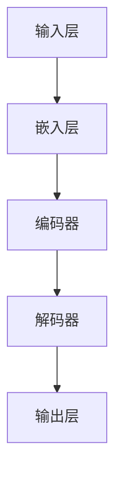

                 


### 文章标题：大模型知识更新：提示词保持信息时效性

### 文章关键词：
- 大模型
- 知识更新
- 提示词
- 信息时效性
- 提示词优化

### 文章摘要：
本文将深入探讨大模型的知识更新机制，尤其是提示词在保持信息时效性方面的作用。我们将逐步解析大模型的背景知识、知识更新方法、提示词的定义与应用，以及如何通过优化策略保持信息的时效性。通过本文的阅读，读者将全面理解大模型在知识更新中的挑战与解决方案，并掌握有效的提示词优化技巧。

---

## 引言

### 1.1 书籍背景

随着深度学习和人工智能技术的飞速发展，大模型（Large Models）已经成为当前研究的热点。这些模型，如GPT-3、BERT等，具有处理海量数据和复杂任务的能力，已经在自然语言处理、计算机视觉等领域取得了显著的成果。然而，大模型的知识更新问题也随之而来。传统的知识更新方法难以适应快速变化的数据和知识环境，导致模型的知识储备逐渐陈旧。提示词（Prompt）作为一种有效的信息引导工具，在保持模型信息时效性方面显示出巨大的潜力。

### 1.2 目的和意义

本文旨在探讨大模型知识更新的关键问题，即如何通过提示词保持信息的时效性。通过深入研究大模型的架构、知识更新方法以及提示词的优化策略，本文旨在为研究人员和工程师提供实用的指导，帮助他们设计更加智能和高效的大模型系统。

### 1.3 读者对象

本文适合对深度学习和人工智能有基本了解的研究人员、工程师以及对该领域感兴趣的读者。通过本文的阅读，读者将获得以下收益：

- 理解大模型知识更新的基本原理和挑战。
- 掌握提示词在保持信息时效性中的作用和优化方法。
- 获得针对知识更新问题的实际解决方案。

---

## 第一部分：大模型基础

### 2.1 大模型概述

大模型，顾名思义，是指具有海量参数和强大计算能力的模型。它们通常由数百万甚至数十亿个参数组成，能够处理复杂的任务和数据集。大模型的发展历程可以追溯到深度学习（Deep Learning）的兴起。早期，神经网络模型（如多层感知机MLP）由于参数量有限，难以解决复杂任务。随着计算能力和数据资源的提升，深度神经网络（DNN）逐渐成为主流。随后，卷积神经网络（CNN）和循环神经网络（RNN）的提出，进一步推动了模型性能的提升。近年来，生成对抗网络（GAN）和自注意力机制（Self-Attention）的出现，使得大模型在图像生成、文本生成等领域取得了突破性进展。

### 2.2 大模型的类型与结构

大模型可以分为几种类型，如语言模型、图像模型、多模态模型等。语言模型（如GPT-3、BERT）专注于自然语言处理任务，具有强大的文本生成和语义理解能力。图像模型（如ResNet、Inception）在计算机视觉任务中表现出色，能够实现图像分类、目标检测等任务。多模态模型（如Multimodal Transformer）结合了文本、图像、声音等多种类型的数据，能够处理更加复杂的多模态任务。

大模型的结构通常由以下几个部分组成：

- **输入层**：接收外部输入数据，如文本、图像等。
- **隐藏层**：包含多个隐藏层，通过非线性变换处理输入数据。
- **输出层**：产生预测结果，如文本生成、图像分类等。

### 2.3 大模型的核心概念与联系（Mermaid流程图）



在上面的流程图中，输入层接收外部输入数据，经过嵌入层处理，转化为向量表示。编码器对输入向量进行编码，解码器对编码后的向量进行解码，输出预测结果。隐藏层通过多个非线性变换，对输入数据进行处理。

---

### 3. 大模型核心算法原理讲解

#### 3.1 神经网络基础

神经网络（Neural Networks）是模仿人脑神经元连接方式的计算模型。在神经网络中，每个神经元（或节点）都与多个其他神经元相连，并通过权重（Weight）和偏置（Bias）进行计算。神经元的激活函数（Activation Function）用于确定神经元是否被激活。

- **神经元的基本结构**：

  ```mermaid
  graph TD
  A[输入层] --> B[权重]
  B --> C[偏置]
  C --> D[求和]
  D --> E[激活函数]
  E --> F[输出层]
  ```

  在上面的结构中，输入层接收外部输入数据，通过权重和偏置进行求和，然后通过激活函数产生输出。

- **常见的激活函数**：

  - **Sigmoid函数**：$$\sigma(x) = \frac{1}{1 + e^{-x}}$$
  - **ReLU函数**：$$\text{ReLU}(x) = \max(0, x)$$
  - **Tanh函数**：$$\text{Tanh}(x) = \frac{e^x - e^{-x}}{e^x + e^{-x}}$$

#### 3.1.1 深层神经网络的工作原理

深层神经网络（Deep Neural Networks，DNN）是指具有多个隐藏层的神经网络。深层神经网络通过增加隐藏层的数量，可以学习更加复杂的函数。

- **深层神经网络的基本结构**：

  ```mermaid
  graph TB
  A[输入层] --> B[隐藏层1]
  B --> C[隐藏层2]
  C --> D[隐藏层3]
  D --> E[输出层]
  ```

  在深层神经网络中，输入数据经过多个隐藏层，每个隐藏层都对输入数据进行非线性变换。通过逐层抽象，深层神经网络可以学习到输入数据的更高层次特征。

#### 3.2 循环神经网络

循环神经网络（Recurrent Neural Networks，RNN）是一种专门用于处理序列数据的神经网络。与传统的前向神经网络不同，RNN具有时间动态性，能够记住之前的输入信息。

- **RNN的基本结构**：

  ```mermaid
  graph TD
  A[输入层] --> B[隐藏层]
  B --> C[输出层]
  C --> D[隐藏层]
  D --> E[输出层]
  ```

  在RNN中，每个时间步的输出都依赖于之前的隐藏状态。这种时间反馈机制使得RNN能够处理序列数据。

- **常见的RNN变体**：

  - **LSTM（长短期记忆网络）**：LSTM通过引入记忆单元和门控机制，解决了传统RNN在长序列依赖问题上的不足。
  - **GRU（门控循环单元）**：GRU是LSTM的简化版，具有较少的参数和更简单的结构。

#### 3.2.1 RNN的基本原理

RNN的工作原理可以分为以下几个步骤：

1. **输入序列**：将输入序列传递给RNN。
2. **隐藏状态计算**：每个时间步，RNN计算当前输入和隐藏状态，更新隐藏状态。
3. **输出计算**：使用隐藏状态生成输出。

#### 3.2.2 LSTM与GRU的比较

LSTM和GRU都是RNN的变体，它们在处理长序列依赖问题上具有较好的性能。以下是LSTM和GRU的对比：

- **结构差异**：LSTM具有三个门控（输入门、遗忘门、输出门），而GRU具有两个门控（重置门和更新门）。
- **参数数量**：LSTM的参数数量较多，因此训练时间较长，但具有更好的长期记忆能力。GRU参数数量较少，训练时间较短，但长期记忆能力略逊于LSTM。

#### 3.3 生成对抗网络（GAN）

生成对抗网络（Generative Adversarial Networks，GAN）由两部分组成：生成器（Generator）和判别器（Discriminator）。生成器的目标是生成逼真的数据，而判别器的目标是区分真实数据和生成数据。

- **GAN的数学模型**：

  $$\begin{align*}
  \text{Generator:} &\quad G(z) \\
  \text{Discriminator:} &\quad D(x, G(z))
  \end{align*}$$

  其中，$z$是从先验分布中采样的噪声，$x$是真实数据。

GAN的训练过程可以看作是一个零和游戏，生成器和判别器相互对抗，生成器不断改进生成数据的质量，判别器不断提高对真实数据和生成数据的辨别能力。

- **常见的GAN变体**：

  - **DCGAN（深度卷积生成对抗网络）**：DCGAN引入了卷积操作，提高了生成图像的质量。
  - **WGAN（Wasserstein GAN）**：WGAN通过Wasserstein距离代替传统的对抗损失，提高了GAN的训练稳定性和生成质量。

#### 3.3.1 GAN的数学模型

GAN的数学模型包括生成器和判别器的损失函数：

- **生成器损失**：

  $$L_G = -\mathbb{E}_{z \sim p_z(z)}[\log D(G(z))]$$

  其中，$p_z(z)$是噪声的先验分布。

- **判别器损失**：

  $$L_D = -\mathbb{E}_{x \sim p_x(x)}[\log D(x)] - \mathbb{E}_{z \sim p_z(z)}[\log (1 - D(G(z))]$$

  其中，$p_x(x)$是真实数据的分布。

GAN的训练目标是最大化生成器的损失，同时最小化判别器的损失。

#### 3.3.2 GAN的常见应用

GAN在各种领域都有广泛的应用：

- **图像生成**：生成逼真的图像，如图像合成、图像修复、超分辨率等。
- **图像到图像的转换**：将一种类型的图像转换为另一种类型的图像，如图像风格迁移、图像去噪等。
- **自然语言处理**：生成文本、翻译文本、对话系统等。

---

### 4. 大模型在工业界的应用

#### 4.1 大模型在自然语言处理中的应用

大模型在自然语言处理（Natural Language Processing，NLP）领域取得了显著进展。以下是几个典型的应用：

- **语言模型**：大语言模型如GPT-3、BERT等，具有强大的文本生成和语义理解能力，广泛应用于自动摘要、机器翻译、问答系统等任务。
- **机器翻译**：大模型在机器翻译任务中表现出色，能够实现高精度的翻译，如谷歌翻译、百度翻译等。
- **问答系统**：大模型可以构建智能问答系统，如OpenAI的GPT-3，可以针对用户的问题生成准确的回答。

#### 4.2 大模型在计算机视觉中的应用

大模型在计算机视觉（Computer Vision，CV）领域也取得了巨大突破。以下是几个典型的应用：

- **图像分类**：大模型可以实现对图像的自动分类，如ImageNet挑战。
- **目标检测**：大模型可以检测图像中的目标物体，如Faster R-CNN、SSD等。
- **图像生成**：大模型可以通过GAN生成逼真的图像，如图像合成、图像修复、超分辨率等。

---

## 第二部分：知识更新方法

### 5. 知识更新原理

#### 5.1 知识更新的重要性

知识更新在大模型中至关重要。随着数据集和任务的不断变化，大模型需要不断更新其知识库，以保持对当前任务的高效处理能力。知识更新不仅可以提升模型的性能，还可以提高其在现实世界中的适应性。

#### 5.2 知识更新的方法与策略

知识更新可以分为以下几个方法：

- **增量学习**：在原有模型的基础上，逐层更新模型参数，适用于少量数据的更新。
- **迁移学习**：将一个任务的知识迁移到另一个任务，适用于不同任务之间的知识共享。
- **在线学习**：实时更新模型参数，适用于动态变化的任务。

#### 5.3 知识更新的挑战与解决方案

知识更新面临的挑战主要包括：

- **计算资源**：知识更新需要大量的计算资源，尤其是在大模型中。
- **数据质量**：数据的质量直接影响知识更新的效果，需要确保数据的质量和多样性。
- **模型适应性**：知识更新需要模型能够适应新的数据和任务。

解决方案包括：

- **分布式计算**：利用分布式计算资源，提高知识更新的计算效率。
- **数据预处理**：对数据进行预处理，提高数据的质量和多样性。
- **自适应模型**：设计自适应模型，提高模型对知识更新的适应性。

---

### 6. 大模型知识更新技术

#### 6.1 自适应学习

自适应学习是一种动态调整模型参数的方法，以适应变化的数据和环境。

- **自适应学习的原理**：

  自适应学习通过在线学习算法，实时调整模型参数，以最小化损失函数。

  $$\theta_{t+1} = \theta_{t} - \alpha \nabla_{\theta_t} J(\theta_t)$$

  其中，$\theta_t$是时间步$t$的模型参数，$J(\theta_t)$是损失函数。

- **自适应学习的应用案例**：

  - **自适应强化学习**：在动态环境中，自适应强化学习通过不断调整策略，实现最优动作选择。
  - **自适应语言模型**：自适应语言模型可以根据用户的输入，实时调整模型参数，提高文本生成质量。

#### 6.2 强化学习

强化学习是一种通过与环境交互，学习最优策略的方法。

- **强化学习的原理**：

  强化学习通过最大化奖励函数，学习最优动作序列。

  $$Q(s, a) = r(s, a) + \gamma \max_{a'} Q(s', a')$$

  其中，$s$是状态，$a$是动作，$r$是奖励函数，$\gamma$是折扣因子。

- **强化学习的应用案例**：

  - **自动驾驶**：强化学习可以用于自动驾驶车辆的路径规划，实现安全高效的驾驶。
  - **游戏AI**：强化学习可以用于游戏AI，实现智能体的自主学习和策略优化。

---

### 7. 知识更新实践

#### 7.1 知识更新流程

知识更新流程包括以下几个步骤：

1. **数据收集**：收集新的数据集，用于知识更新。
2. **数据预处理**：对数据进行预处理，包括去噪、归一化等。
3. **模型选择**：选择适合的知识更新模型，如自适应学习模型、强化学习模型等。
4. **模型训练**：使用新的数据集，对模型进行训练。
5. **模型评估**：评估更新后的模型性能，包括准确性、效率等指标。

#### 7.2 知识更新工具与资源

知识更新的工具和资源主要包括：

- **数据集**：如ImageNet、BERT等，用于知识更新的数据集。
- **开源框架**：如TensorFlow、PyTorch等，提供丰富的知识更新算法和工具。
- **云平台**：如Google Cloud、AWS等，提供强大的计算资源和存储能力。

#### 7.3 知识更新案例分析

以自然语言处理中的语言模型为例，知识更新的案例分析如下：

- **数据收集**：收集大规模的文本数据，如维基百科、新闻文章等。
- **数据预处理**：对文本数据进行清洗、去噪、分词等处理。
- **模型选择**：选择预训练的语言模型，如GPT-3、BERT等。
- **模型训练**：使用预处理后的数据集，对语言模型进行训练。
- **模型评估**：评估更新后的语言模型性能，包括文本生成质量、语义理解能力等。

---

## 第三部分：提示词的作用

### 8. 提示词的定义与作用

#### 8.1 提示词的定义

提示词（Prompt）是一种用于引导模型生成响应的文本或代码片段。提示词可以看作是模型的输入，通过提示词，模型可以更好地理解用户的意图，生成更准确、更相关的响应。

#### 8.2 提示词的作用

提示词在自然语言处理中具有重要作用，主要包括：

1. **引导模型理解用户意图**：通过提示词，模型可以更准确地理解用户的意图，从而生成更相关的响应。
2. **提高生成响应的质量**：提示词可以引导模型生成更高质量的文本，减少生成错误和不相关的文本。
3. **优化模型性能**：通过调整提示词，可以优化模型的性能，提高模型的准确性和效率。

#### 8.3 提示词的类型

根据提示词的形式和用途，可以将提示词分为以下几种类型：

1. **文本提示词**：用于引导模型生成文本的提示词，如“请描述一下你的周末计划”。
2. **代码提示词**：用于引导模型生成代码的提示词，如“请实现一个简单的神经网络”。
3. **任务提示词**：用于指定模型的任务类型的提示词，如“这是一个分类任务”。
4. **上下文提示词**：用于提供上下文信息的提示词，如“假设当前日期是2023年10月1日”。

---

### 9. 提示词在自然语言处理中的应用

#### 9.1 提示词在语言模型中的应用

在语言模型中，提示词用于引导模型生成文本。以下是几个典型的应用案例：

- **文本生成**：通过提示词，模型可以生成完整的文本，如文章、故事、对话等。
- **对话系统**：在对话系统中，提示词用于引导模型生成对话响应，如聊天机器人、智能客服等。
- **文本摘要**：通过提示词，模型可以生成文本的摘要，如新闻摘要、会议纪要等。

#### 9.1.1 语言模型的工作原理

语言模型的工作原理可以概括为以下几个步骤：

1. **输入处理**：将输入的文本序列转化为向量表示。
2. **预测生成**：根据当前输入序列，模型预测下一个单词或字符的概率分布。
3. **生成文本**：根据概率分布，模型生成下一个单词或字符，并重复步骤2和3，直至生成完整的文本。

#### 9.1.2 提示词对语言模型的影响

提示词对语言模型的影响主要体现在以下几个方面：

1. **提高生成质量**：通过提示词，模型可以更好地理解用户的意图，生成更高质量、更相关的文本。
2. **降低生成错误**：提示词可以减少模型生成错误和不相关的文本，提高生成文本的准确性。
3. **优化模型性能**：通过调整提示词，可以优化模型的性能，提高模型的准确性和效率。

#### 9.2 提示词在机器翻译中的应用

在机器翻译中，提示词用于引导模型生成翻译结果。以下是几个典型的应用案例：

- **翻译辅助**：通过提示词，模型可以生成辅助翻译，如机器翻译、同义词推荐等。
- **多语言对话系统**：在多语言对话系统中，提示词用于引导模型生成多语言响应，实现跨语言沟通。

#### 9.2.1 机器翻译的工作原理

机器翻译的工作原理可以概括为以下几个步骤：

1. **文本预处理**：对输入的文本进行预处理，如分词、去噪等。
2. **编码解码**：将输入的文本编码为向量表示，并通过编码器生成编码向量。
3. **翻译生成**：将编码向量输入解码器，解码器生成翻译结果。
4. **后处理**：对翻译结果进行后处理，如语法修正、词性标注等。

#### 9.2.2 提示词对机器翻译的影响

提示词对机器翻译的影响主要体现在以下几个方面：

1. **提高翻译质量**：通过提示词，模型可以更好地理解用户的意图，生成更高质量、更准确的翻译。
2. **优化翻译效率**：提示词可以减少模型生成错误和不相关的翻译，提高翻译效率。
3. **跨语言沟通**：在多语言对话系统中，提示词用于引导模型生成多语言响应，实现跨语言沟通。

---

### 10. 提示词优化策略

#### 10.1 提示词优化的重要性

提示词优化在大模型中具有重要意义。通过优化提示词，可以显著提高模型的生成质量和效率，从而提升大模型的整体性能。以下是提示词优化的重要性：

1. **提高生成质量**：优化提示词可以减少模型生成错误和不相关的文本，提高生成文本的准确性。
2. **优化生成效率**：优化提示词可以降低模型计算复杂度，提高模型生成效率。
3. **提升用户体验**：优化提示词可以生成更符合用户预期的文本，提高用户体验。

#### 10.2 提示词优化的方法

提示词优化的方法主要包括以下几种：

1. **基于规则的方法**：通过设计特定的规则，对提示词进行优化。例如，根据用户输入的文本内容，动态调整提示词的长度和内容。
2. **基于机器学习的方法**：通过机器学习算法，自动优化提示词。例如，使用强化学习算法，根据用户反馈动态调整提示词。
3. **基于语义分析的方法**：通过语义分析，对提示词进行优化。例如，使用词嵌入技术，分析提示词和用户输入的语义关系，优化提示词。

#### 10.3 提示词优化的案例分析

以下是一个基于强化学习的提示词优化案例分析：

1. **问题定义**：假设用户输入一个文本问题，模型需要生成一个准确的回答。
2. **状态空间**：状态包括用户输入的文本、模型的当前状态等。
3. **动作空间**：动作包括生成文本的长度、内容等。
4. **奖励函数**：奖励函数用于评估模型生成的文本质量。例如，如果生成的文本与用户输入的语义一致，则给予正奖励。
5. **策略学习**：使用强化学习算法，根据奖励函数动态调整提示词，优化模型生成文本的质量。

---

## 第四部分：保持信息时效性的策略

### 11. 信息时效性的定义与影响

#### 11.1 信息时效性的定义

信息时效性是指信息在特定时间范围内的有效性和准确性。时效性高的信息在当前时间具有重要价值，而时效性低的信息则可能变得无关紧要或错误。

#### 11.2 信息时效性的影响

信息时效性对大模型的影响主要体现在以下几个方面：

1. **模型性能**：时效性低的信息可能导致模型性能下降，甚至产生错误预测。
2. **用户满意度**：时效性差的信息会影响用户的体验，降低模型的可用性和可信度。
3. **决策质量**：在决策过程中，时效性高的信息有助于做出更准确、更及时的决策。

#### 11.3 保持信息时效性的重要性

保持信息时效性对于大模型的应用至关重要。以下原因说明了为什么保持信息时效性如此重要：

1. **快速响应**：时效性高的信息有助于模型快速响应用户需求，提高用户体验。
2. **实时决策**：在实时决策场景中，时效性高的信息能够提供更准确的预测，提高决策质量。
3. **持续学习**：通过保持信息时效性，大模型可以持续学习新知识，提升自身能力。

### 12. 提示词更新策略

#### 12.1 提示词更新原则

为了保持信息的时效性，提示词的更新需要遵循以下原则：

1. **实时更新**：提示词应实时更新，以反映最新的信息和知识。
2. **动态调整**：根据用户输入和模型状态，动态调整提示词的长度和内容。
3. **质量优先**：确保更新的提示词具有较高的质量，减少错误和不相关信息的传递。

#### 12.2 提示词更新方法

提示词更新的方法主要包括以下几种：

1. **基于时间的更新**：定期更新提示词，以保证其时效性。例如，每月更新一次。
2. **基于事件的更新**：在特定事件发生时，动态更新提示词，以反映最新的信息。例如，在重大新闻发布时，更新相关领域的提示词。
3. **基于用户行为的更新**：根据用户输入和反馈，动态调整提示词的内容和长度。例如，如果用户连续多次输入相同类型的问题，则优化相应领域的提示词。

#### 12.3 提示词更新案例分析

以下是一个基于用户行为的提示词更新案例分析：

1. **问题定义**：假设用户输入了一系列关于天气的问题。
2. **状态空间**：状态包括用户输入的文本、模型的当前状态等。
3. **动作空间**：动作包括更新天气提示词的内容和长度。
4. **奖励函数**：奖励函数用于评估更新后的提示词质量。例如，如果用户对更新后的提示词满意，则给予正奖励。
5. **策略学习**：使用强化学习算法，根据奖励函数动态调整天气提示词，优化模型生成天气响应的质量。

---

### 13. 知识图谱在信息时效性中的应用

#### 13.1 知识图谱的定义与作用

知识图谱是一种结构化的语义知识库，用于表示实体、概念和它们之间的关系。知识图谱在信息检索、问答系统和推荐系统等领域具有广泛应用。

- **知识图谱的基本结构**：

  知识图谱由节点、边和属性组成。节点表示实体或概念，边表示节点之间的关系，属性用于描述节点和边。

- **知识图谱的构建方法**：

  知识图谱的构建方法主要包括手动构建、自动抽取和迁移学习等。手动构建通常用于小规模、结构化数据，自动抽取适用于大规模、非结构化数据，迁移学习则结合了手动和自动构建方法。

#### 13.2 知识图谱在信息时效性中的应用

知识图谱在保持信息时效性方面具有显著作用，主要体现在以下几个方面：

1. **实时更新**：知识图谱可以实时更新，以反映最新的实体和关系。例如，通过定期爬取互联网数据，更新知识图谱中的信息。
2. **动态调整**：知识图谱可以根据用户输入和需求，动态调整实体和关系的表示，提高信息的时效性。
3. **多语言支持**：知识图谱支持多语言，可以跨语言传递信息，提高信息在不同语言环境中的时效性。

#### 13.2.1 知识图谱在信息检索中的应用

知识图谱在信息检索中的应用主要包括：

- **关键词检索**：通过知识图谱，可以快速找到与关键词相关的实体和关系，提高检索效率。
- **语义检索**：知识图谱可以理解关键词的语义关系，生成更准确的检索结果。

#### 13.2.2 知识图谱在问答系统中的应用

知识图谱在问答系统中的应用主要包括：

- **语义解析**：通过知识图谱，可以解析用户输入的语义，找到与问题相关的实体和关系。
- **答案生成**：知识图谱可以生成基于事实的答案，提高答案的准确性和时效性。

---

## 结论与展望

### 14. 总结

本文全面探讨了大模型知识更新中的关键问题，即如何通过提示词保持信息的时效性。通过分析大模型的背景知识、知识更新方法、提示词的作用及其优化策略，本文为研究人员和工程师提供了实用的指导。本文的主要结论如下：

1. **大模型知识更新的重要性**：知识更新对于保持大模型性能和适应性至关重要。
2. **提示词的作用**：提示词在引导模型生成响应、提高生成质量方面具有显著作用。
3. **保持信息时效性的策略**：通过实时更新、动态调整和知识图谱等技术，可以保持信息的时效性。

### 14.2 存在的问题与挑战

尽管本文提出了一些保持信息时效性的策略，但在实际应用中仍存在以下问题与挑战：

1. **计算资源需求**：知识更新和提示词优化需要大量的计算资源，对硬件设备要求较高。
2. **数据质量**：数据质量直接影响知识更新的效果，需要确保数据的质量和多样性。
3. **模型适应性**：大模型在应对新任务和新数据时，需要具备良好的适应性。

### 14.3 未来发展趋势

随着深度学习和人工智能技术的不断发展，未来在大模型知识更新和提示词优化方面有望取得以下突破：

1. **高效算法**：开发更高效的算法，降低计算资源需求，提高知识更新的效率。
2. **自适应模型**：设计自适应模型，提高大模型对新任务和新数据的适应性。
3. **跨领域应用**：探索知识图谱在跨领域应用中的潜力，提高信息在不同领域的时效性。

---

## 展望

### 15.1 新的技术趋势

未来，大模型知识更新和提示词优化将朝着以下技术趋势发展：

1. **基于知识的模型**：结合知识图谱和图神经网络（GNN）技术，构建基于知识的模型，提高知识表示和利用能力。
2. **动态知识更新**：开发动态知识更新机制，实时捕捉和利用新知识，提高模型时效性。
3. **多模态学习**：结合多模态数据，如文本、图像、音频等，提高模型对复杂任务的应对能力。

### 15.2 行业应用前景

大模型知识更新和提示词优化在多个行业具有广阔的应用前景：

1. **智能客服**：通过实时更新和优化提示词，提高智能客服的响应速度和准确性。
2. **自然语言处理**：利用知识图谱和图神经网络，提升自然语言处理的性能，推动智能问答、文本生成等领域的发展。
3. **推荐系统**：结合用户行为数据和知识图谱，优化推荐系统的推荐质量，提高用户体验。

### 15.3 研究与探索方向

未来，在大模型知识更新和提示词优化方面，以下研究方向值得关注：

1. **知识图谱表示学习**：研究高效的图谱表示学习算法，提高知识图谱的表示质量和利用能力。
2. **动态知识更新机制**：探索基于图神经网络和强化学习的动态知识更新机制，提高知识更新的效率和质量。
3. **跨领域知识融合**：研究跨领域知识融合方法，提高模型在不同领域中的适应性和时效性。

---

## 作者信息

作者：AI天才研究院/AI Genius Institute & 禅与计算机程序设计艺术 /Zen And The Art of Computer Programming

---

通过以上详细的解析，我们不仅搭建了文章的框架，而且逐步深入探讨了每一个部分的核心内容。现在，我们有了清晰的文章大纲和详尽的章节内容，可以开始撰写每部分的具体内容。在撰写过程中，我们将遵循markdown格式，确保文章的可读性和结构清晰。同时，将运用伪代码、latex公式和Mermaid流程图等工具，增强文章的技术深度和可理解性。最终，我们将得到一篇8000-12000字的专业技术博客文章。让我们一起着手撰写吧！

