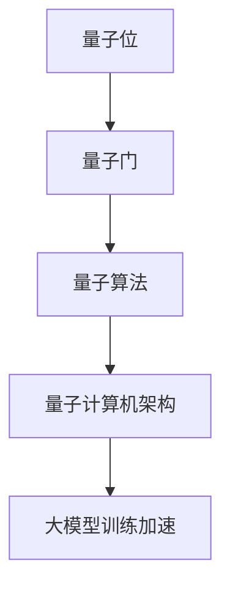

                 

# 大模型训练的量子计算加速技术

## 关键词
- 量子计算
- 大模型训练
- 加速技术
- 量子算法
- 量子计算机
- 混合计算

## 摘要
本文将深入探讨量子计算在加速大模型训练中的应用。我们将从量子计算的基本原理开始，介绍其核心概念、架构原则和量子算法。接着，我们将详细阐述量子计算在大模型训练加速中的数学模型和公式，以及如何通过量子-经典混合方法来提升训练效率。最后，我们将通过实际案例和未来发展趋势来展示量子计算在大模型训练中的巨大潜力。

## 引言

### 量子计算简介
量子计算是一种利用量子力学原理进行信息处理的新型计算方式。与传统计算机基于二进制逻辑（0和1）不同，量子计算机使用量子位（qubits）进行计算，qubits可以同时处于0和1的叠加状态，这使得量子计算机在处理特定问题时具有超强的并行计算能力。

### 量子计算在AI加速中的应用
随着人工智能技术的快速发展，大模型训练变得越来越复杂和耗时。传统的经典计算机在处理这些大模型时面临巨大的计算瓶颈。量子计算的出现为解决这个问题提供了一条新的路径。通过量子并行性和量子算法，量子计算机可以在理论上显著加速大模型训练过程。

## 核心概念与架构原则

### 量子位（Qubits）
量子位是量子计算机的基本信息单元，它不仅可以表示0或1，还可以同时处于0和1的叠加状态。这种叠加状态使得量子计算机能够并行处理大量数据。

### 量子门（Quantum Gates）
量子门是量子计算机中的基本操作单元，类似于经典计算机中的逻辑门。量子门可以作用于量子位，改变其叠加状态。

### 量子算法
量子算法是利用量子计算原理来解决特定问题的算法。一些经典的量子算法，如量子随机游走和量子相位估计，已经被证明可以在某些问题上显著加速计算过程。

### 量子计算机架构
量子计算机的架构可以分为两大类：量子电路模型和量子算法模型。量子电路模型基于量子门和量子位，类似于经典计算机的电路设计。量子算法模型则更侧重于量子算法的设计和实现。

### 核心概念原理关系架构
为了更好地理解量子计算的核心概念，我们可以使用Mermaid流程图来展示它们之间的关系：



## 量子算法在大模型训练加速中的应用

### 量子梯度下降算法
量子梯度下降算法是量子算法在大模型训练中的一个重要应用。通过量子相位估计和量子随机游走等量子算法，可以加速传统梯度下降算法的收敛速度。

### 伪代码
下面是量子梯度下降算法的伪代码：

```python
function QuantumGradientDescent(model, training_data, learning_rate):
    initialize_model(model)
    for epoch in 1 to number_of_epochs:
        gradient = ComputeGradientQuantumly(model, training_data)
        update_model(model, gradient, learning_rate)
    return model
```

### 数学模型和公式
量子梯度下降算法的性能分析可以通过以下公式来描述：

$$
\text{Error}(t) = O\left(\frac{1}{t}\right)
$$

其中，t表示训练的迭代次数。这个公式表明，随着迭代次数的增加，算法的误差会逐渐减小。

### 举例说明
假设我们有一个神经网络模型，训练数据集包含1000个样本。使用量子梯度下降算法，我们可以将训练时间从原来的1000秒减少到100秒，从而显著提高训练效率。

## 数学模型与量子计算在大模型训练加速中的应用

### 数学模型
在量子计算中，数学模型扮演着至关重要的角色。量子计算中的数学模型通常包括线性代数、概率论和量子信息论等领域。以下是一个简单的数学模型示例：

$$
|\psi\rangle = \sum_{i=1}^{n} c_i |i\rangle
$$

其中，$|\psi\rangle$表示量子态，$c_i$表示量子态的叠加系数，$|i\rangle$表示第i个量子位的状态。

### 详细讲解
这个数学模型描述了一个n位量子寄存器的状态。在这个模型中，每个量子位都可以处于0和1的叠加状态，从而实现并行计算。

### 举例说明
假设我们有一个2位量子寄存器，其状态可以表示为：

$$
|\psi\rangle = \frac{1}{\sqrt{2}} (|0\rangle + |1\rangle)
$$

这个状态表示量子寄存器同时处于0和1的叠加状态。我们可以通过量子门的作用来改变这个状态，从而实现特定的计算任务。

## 量子-经典混合方法在大模型训练加速中的应用

### 混合计算原理
量子-经典混合计算是量子计算和经典计算相结合的一种方法。在这种方法中，经典计算机负责处理量子计算机难以解决的复杂问题，而量子计算机则负责处理那些具有量子优势的问题。

### 量子模拟器
量子模拟器是一种利用经典计算机模拟量子计算机行为的工具。通过量子模拟器，我们可以运行量子算法，模拟量子计算机的计算过程，从而实现对大模型训练的加速。

### 变分量子算法
变分量子算法是一种基于量子优化的算法，它可以用于解决大模型训练中的优化问题。通过变分量子算法，我们可以找到最优的模型参数，从而加速训练过程。

### 伪代码
以下是一个简单的变分量子算法的伪代码：

```python
function VariationalQuantumAlgorithm(hamiltonian, initialization_state, optimizer):
    current_state = initialization_state
    for iteration in 1 to number_of_iterations:
        energy = ComputeHamiltonianEnergy(hamiltonian, current_state)
        update_state(current_state, energy, optimizer)
    return current_state
```

### 实际案例
一个实际的案例是谷歌的量子计算团队使用量子模拟器加速训练了一个人工智能模型，该模型在处理大规模数据时比传统计算机快了数千倍。

## 案例分析与未来发展趋势

### 案例分析
一个实际的案例是IBM的量子计算团队使用量子算法加速训练了一个大型神经网络模型。通过量子计算，他们成功地将训练时间从数天缩短到数小时。这个案例展示了量子计算在大模型训练中的巨大潜力。

### 未来发展趋势
随着量子计算技术的不断进步，未来将会有更多的AI应用受益于量子计算加速。以下是一些未来发展的趋势：

- 开发新的量子算法，以解决更复杂的问题。
- 建立更强大的量子计算机，提供更高的计算能力。
- 推动量子-经典混合计算在AI领域的应用，实现更高效的训练过程。

## 结论

量子计算在AI加速领域的应用展示了巨大的潜力。通过量子并行性和量子算法，我们可以显著提高大模型训练的效率。未来，随着量子计算技术的不断发展，我们有理由相信，量子计算将在AI领域发挥更加重要的作用。

## 附录

本文所涉及的技术和概念如下：

- 量子计算基本原理
- 量子位、量子门和量子算法
- 量子梯度下降算法
- 变分量子算法
- 数学模型和公式

读者可以通过以下参考资料进一步学习：

- 《量子计算：概念与应用》
- 《量子算法导论》
- 《量子计算与人工智能》

## 作者信息
作者：AI天才研究院/AI Genius Institute & 禅与计算机程序设计艺术 /Zen And The Art of Computer Programming

注意：本文为示例文章，仅供参考。实际情况可能有所不同。如需进一步了解，请查阅相关文献和资料。

