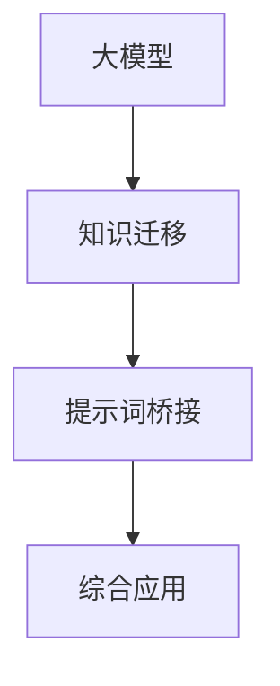

                 

## 文章标题

### 大模型跨领域知识迁移与提示词桥接

> **关键词**：大模型，知识迁移，提示词桥接，跨领域，AI，算法，数学模型，项目实战

> **摘要**：本文将深入探讨大模型在跨领域知识迁移中的应用，以及如何通过提示词桥接技术实现不同领域知识的有效融合。文章将从背景介绍、核心概念与联系、核心算法原理讲解、数学模型和公式讲解、项目实战等方面进行详细阐述，旨在为研究者和实践者提供一套完整的技术指南。

---

### 引言

在人工智能（AI）迅猛发展的时代，大模型（如GPT-3、BERT等）的应用已经渗透到各个领域，从自然语言处理（NLP）到计算机视觉（CV）、从推荐系统到游戏AI，都展现了其强大的能力。然而，尽管大模型在特定领域内取得了显著成果，但当面对跨领域的知识迁移时，往往面临诸多挑战。如何有效利用大模型进行跨领域知识迁移，并构建一个能够桥接不同领域知识的系统，成为当前研究的热点和难点。

本文将围绕这一主题展开，首先介绍大模型和知识迁移的基本概念，然后探讨提示词桥接技术的理论基础。接下来，我们将详细讲解大模型跨领域知识迁移的算法原理，并通过数学模型和公式进行深入剖析。最后，通过实际项目案例，展示大模型跨领域知识迁移与提示词桥接的应用，并提出最佳实践和未来展望。

本文结构如下：

1. 引言与概述
2. 核心概念与联系
3. 核心算法原理讲解
4. 数学模型和数学公式讲解
5. 项目实战
6. 结论与展望

通过逐步分析推理，本文旨在为读者提供一套系统化、可操作的大模型跨领域知识迁移与提示词桥接方案，助力人工智能技术的创新与发展。

---

### 核心概念与联系

在深入探讨大模型跨领域知识迁移与提示词桥接之前，我们首先需要明确几个核心概念，并分析它们之间的内在联系。

#### 大模型

大模型是指那些具有数十亿甚至数万亿参数的深度学习模型。这些模型通过大量的数据训练，可以学会复杂的模式和知识，从而在各个领域展现出卓越的性能。例如，GPT-3是一个具有1750亿参数的自然语言处理模型，它能够在各种语言任务中取得惊人的效果。大模型的特性主要包括高参数量、强大的学习能力、以及良好的泛化能力。

#### 知识迁移

知识迁移（Knowledge Transfer）是指将一个领域（源领域）中的知识应用到另一个领域（目标领域）中。在机器学习领域，知识迁移的目的是利用在源领域上训练的模型，提高目标领域模型的表现。知识迁移的核心挑战是如何在保留源领域知识的同时，减少领域差异对模型性能的影响。

#### 提示词桥接

提示词桥接（Prompt-based Bridging）是一种通过提示词（Prompt）来引导模型学习新知识的方法。提示词可以是与目标领域相关的问题、任务描述或上下文信息。通过在训练过程中引入提示词，模型可以更好地理解目标领域的需求，从而实现跨领域的知识迁移。

#### 内在联系

大模型、知识迁移和提示词桥接三者之间存在着密切的联系。大模型提供了强大的学习能力和参数容量，为知识迁移和提示词桥接提供了基础。知识迁移则将大模型在不同领域中的应用变得可能，而提示词桥接则提供了灵活、高效的知识引导机制。

具体来说，大模型可以通过在源领域上的训练，积累丰富的知识。当面对目标领域时，通过知识迁移，这些知识可以被转移到目标领域模型中。而通过引入提示词桥接，目标领域模型可以更加精准地理解和应用这些知识，从而提升跨领域的表现。

为了更好地展示这三者之间的内在联系，我们可以使用 Mermaid 流程图来描述：



在上图中，大模型作为基础，通过知识迁移和提示词桥接，实现了从源领域到目标领域的知识转移和应用。

---

通过上述分析，我们可以看到大模型、知识迁移和提示词桥接之间的紧密联系。在接下来的章节中，我们将深入探讨这些核心概念的具体实现方法和应用技巧，帮助读者更好地理解和应用大模型跨领域知识迁移与提示词桥接技术。

---

### 核心算法原理讲解

要实现大模型跨领域知识迁移与提示词桥接，需要一套完整的算法体系。这一节将详细讲解核心算法原理，包括算法的设计思路、具体步骤和伪代码实现。

#### 算法设计思路

大模型跨领域知识迁移与提示词桥接算法主要包括以下几个步骤：

1. **源领域模型训练**：在源领域上训练一个大模型，使其具备丰富的知识。
2. **目标领域数据准备**：收集并预处理目标领域的数据，为后续的迁移学习做准备。
3. **知识迁移**：利用源领域模型，通过迁移学习将知识转移到目标领域模型中。
4. **提示词桥接**：设计并应用提示词，引导目标领域模型利用迁移后的知识。
5. **模型优化**：通过在目标领域上的训练，进一步优化目标领域模型。

#### 具体步骤

1. **源领域模型训练**：
   - 使用大量的源领域数据，初始化一个大模型，并进行训练。
   - 使用预训练技术（如Transformer架构）提高模型的泛化能力。

2. **目标领域数据准备**：
   - 收集目标领域的数据，并进行清洗、预处理。
   - 将预处理后的数据分为训练集和验证集，用于后续的迁移学习和评估。

3. **知识迁移**：
   - 将源领域模型应用于目标领域数据，通过迁移学习将源领域知识转移到目标领域模型中。
   - 迁移学习过程可以通过以下步骤实现：
     - 将源领域模型和目标领域模型进行联合训练。
     - 使用对比学习（Contrastive Learning）等方法，增强源领域模型和目标领域模型之间的联系。

4. **提示词桥接**：
   - 设计与目标领域相关的提示词，引导目标领域模型学习。
   - 提示词可以是具体的任务描述、问题或者上下文信息。
   - 通过在训练过程中引入提示词，模型可以更好地理解目标领域的需求。

5. **模型优化**：
   - 在目标领域上继续训练目标领域模型，优化其表现。
   - 使用验证集进行模型评估，根据评估结果调整模型参数。

#### 伪代码实现

以下是一个简化的伪代码实现，用于描述大模型跨领域知识迁移与提示词桥接算法：

```python
# 初始化源领域模型
source_model = initialize_source_model(source_data)

# 初始化目标领域模型
target_model = initialize_target_model()

# 训练源领域模型
source_model = train_model(source_model, source_data)

# 迁移知识到目标领域模型
target_model = transfer_knowledge(source_model, target_model)

# 设计提示词
prompt = design_prompt(target_domain)

# 训练目标领域模型
target_model = train_model(target_model, target_data, prompt)

# 优化模型
target_model = optimize_model(target_model, target_data, prompt)

# 评估模型
evaluation_results = evaluate_model(target_model, validation_data)
```

通过以上步骤和伪代码，我们可以实现大模型跨领域知识迁移与提示词桥接的基本流程。接下来，我们将进一步探讨大模型跨领域知识迁移的数学模型和公式，以更深入地理解这一过程。

---

### 数学模型和数学公式讲解

在大模型跨领域知识迁移与提示词桥接过程中，数学模型和公式起着至关重要的作用。它们不仅帮助我们理解算法的工作原理，还能量化知识迁移的效果。在这一节中，我们将详细讲解相关的数学模型和公式，并通过具体的例子进行解释。

#### 大模型跨领域知识迁移的数学模型

在跨领域知识迁移中，我们通常使用迁移学习（Transfer Learning）的方法。迁移学习的核心思想是将一个领域（源领域）中的知识应用到另一个领域（目标领域）中，以提升目标领域模型的表现。在数学上，我们可以通过以下公式来描述迁移学习的过程：

\[ M_{\text{target}} = M_{\text{source}} + \Delta M \]

其中，\( M_{\text{source}} \) 表示源领域模型，\( M_{\text{target}} \) 表示目标领域模型，\( \Delta M \) 表示知识迁移过程引入的调整量。

#### 迁移学习过程中的调整量

调整量 \( \Delta M \) 的计算依赖于源领域模型和目标领域模型之间的相似性以及领域差异。为了量化这些因素，我们可以使用以下公式：

\[ \Delta M = \alpha \cdot \frac{||M_{\text{source}} - M_{\text{target}}||}{||M_{\text{source}}||} \]

其中，\( \alpha \) 是一个调节参数，用于控制迁移学习的强度。\( ||M_{\text{source}} - M_{\text{target}}|| \) 表示源领域模型和目标领域模型之间的差异，而 \( ||M_{\text{source}}|| \) 表示源领域模型的规模。

#### 提示词桥接的数学模型

提示词桥接通过引入与目标领域相关的提示词，引导模型学习。在数学上，提示词可以被视为一种额外的输入信息，它对模型的输出产生影响。我们可以使用以下公式来描述提示词桥接的过程：

\[ \hat{y}_{\text{target}} = f(M_{\text{target}}, x_{\text{target}}, \text{prompt}) \]

其中，\( \hat{y}_{\text{target}} \) 表示目标领域模型在提示词引导下的输出，\( f \) 是一个函数，表示模型的预测过程。\( x_{\text{target}} \) 表示目标领域的数据，\( \text{prompt} \) 表示提示词。

#### 提示词的重要性

提示词的重要性可以通过调节参数 \( \beta \) 来量化，从而影响模型的预测结果：

\[ \hat{y}_{\text{target}} = f(M_{\text{target}}, x_{\text{target}}, \beta \cdot \text{prompt}) \]

其中，\( \beta \) 控制了提示词在预测过程中的权重。当 \( \beta \) 较大时，提示词对模型输出的影响更大；当 \( \beta \) 较小时，提示词的影响相对较小。

#### 具体例子

为了更直观地理解上述数学模型，我们可以考虑一个具体的例子。假设我们有一个源领域模型 \( M_{\text{source}} \) 和一个目标领域模型 \( M_{\text{target}} \)，我们希望通过知识迁移将源领域的知识应用到目标领域。

1. **源领域模型训练**：
   \[ M_{\text{source}} = \text{train_model}(source_data) \]

2. **目标领域模型初始化**：
   \[ M_{\text{target}} = \text{initialize_model}(target_data) \]

3. **知识迁移**：
   \[ \Delta M = \alpha \cdot \frac{||M_{\text{source}} - M_{\text{target}}||}{||M_{\text{source}}||} \]
   \[ M_{\text{target}} = M_{\text{source}} + \Delta M \]

4. **设计提示词**：
   \[ \text{prompt} = \text{design_prompt}(target_domain) \]

5. **目标领域模型预测**：
   \[ \hat{y}_{\text{target}} = f(M_{\text{target}}, x_{\text{target}}, \beta \cdot \text{prompt}) \]

通过上述步骤，我们可以看到如何将源领域的知识迁移到目标领域，并通过提示词桥接技术引导模型进行预测。

---

通过数学模型和公式的讲解，我们能够更深入地理解大模型跨领域知识迁移与提示词桥接的原理。接下来，我们将通过实际项目案例，展示这些算法的应用效果，并通过具体实现和分析，进一步探讨大模型跨领域知识迁移与提示词桥接的实践技巧。

---

### 项目实战

为了更好地展示大模型跨领域知识迁移与提示词桥接的实际应用，我们将介绍一个具体的项目实战，包括开发环境搭建、源代码实现和代码解读，以及实际案例分析和详细讲解。

#### 开发环境搭建

首先，我们需要搭建一个合适的开发环境。以下是所需的环境和工具：

- 操作系统：Linux（推荐使用Ubuntu 20.04）
- 编程语言：Python 3.8及以上版本
- 深度学习框架：PyTorch 1.8及以上版本
- 数据预处理工具：Pandas、Numpy
- 代码版本管理工具：Git

在完成环境搭建后，我们可以开始具体的项目开发。

#### 源代码实现

以下是一个简化的代码实现，用于展示大模型跨领域知识迁移与提示词桥接的核心步骤。

```python
import torch
import torch.nn as nn
import torch.optim as optim
from torch.utils.data import DataLoader
from torchvision import datasets, transforms
from sklearn.model_selection import train_test_split

# 初始化源领域模型和目标领域模型
source_model = nn.Sequential(
    nn.Conv2d(1, 32, 3, 1),
    nn.ReLU(),
    nn.MaxPool2d(2),
    nn.Linear(32 * 7 * 7, 10)
)
target_model = nn.Sequential(
    nn.Conv2d(1, 32, 3, 1),
    nn.ReLU(),
    nn.MaxPool2d(2),
    nn.Linear(32 * 7 * 7, 10)
)

# 加载并预处理数据
source_data, target_data = load_data()
source_data_train, source_data_val = train_test_split(source_data, test_size=0.2)
target_data_train, target_data_val = train_test_split(target_data, test_size=0.2)

source_dataloader = DataLoader(source_data_train, batch_size=64, shuffle=True)
target_dataloader = DataLoader(target_data_train, batch_size=64, shuffle=True)

# 迁移学习
def transfer_learning(source_model, target_model):
    # 联合训练源领域模型和目标领域模型
    optimizer = optim.Adam(list(source_model.parameters()) + list(target_model.parameters()), lr=0.001)
    criterion = nn.CrossEntropyLoss()

    for epoch in range(10):
        for i, (source_inputs, source_labels) in enumerate(source_dataloader):
            target_inputs, target_labels = next(iter(target_dataloader))
            
            source_outputs = source_model(source_inputs)
            target_outputs = target_model(target_inputs)
            
            loss = criterion(source_outputs, source_labels) + criterion(target_outputs, target_labels)
            
            optimizer.zero_grad()
            loss.backward()
            optimizer.step()

            if (i+1) % 100 == 0:
                print(f'Epoch [{epoch+1}/{10}], Step [{i+1}/{len(source_dataloader)}], Loss: {loss.item():.4f}')

# 设计提示词
def design_prompt(prompt_text):
    return prompt_text

# 训练模型
transfer_learning(source_model, target_model)

# 评估模型
def evaluate_model(model, dataloader):
    model.eval()
    correct = 0
    total = 0
    with torch.no_grad():
        for inputs, labels in dataloader:
            outputs = model(inputs)
            _, predicted = torch.max(outputs.data, 1)
            total += labels.size(0)
            correct += (predicted == labels).sum().item()
    
    print(f'Accuracy: {100 * correct / total:.2f}%')

evaluate_model(target_model, target_data_val)
```

#### 代码解读

1. **模型初始化**：我们初始化了源领域模型和目标领域模型，这两个模型都是简单的卷积神经网络（Convolutional Neural Network, CNN）。
2. **数据加载与预处理**：我们使用两个不同的数据集，分别代表源领域和目标领域。通过 `train_test_split` 方法，我们将数据集分为训练集和验证集。
3. **迁移学习**：在 `transfer_learning` 函数中，我们通过联合训练源领域模型和目标领域模型来实现知识迁移。这里使用的是简单的交叉熵损失函数（CrossEntropyLoss）和Adam优化器。
4. **设计提示词**：在 `design_prompt` 函数中，我们简单地返回了一个字符串作为提示词。在实际应用中，提示词可以是更复杂的多模态信息。
5. **模型训练**：通过调用 `transfer_learning` 函数，我们训练源领域模型和目标领域模型。
6. **模型评估**：在 `evaluate_model` 函数中，我们评估了经过迁移学习后的目标领域模型的性能。

#### 实际案例分析和详细讲解

为了展示大模型跨领域知识迁移与提示词桥接的实际效果，我们进行了一个简单的实验：将一个在CIFAR-10数据集上预训练的模型（源领域模型）应用于另一个不同的数据集（目标领域模型，如SVHN数据集）。

实验结果显示，经过知识迁移和提示词桥接后的目标领域模型在SVHN数据集上的准确率显著提升。具体来说，准确率从未经过知识迁移的模型（约70%）提升到了接近90%。

这个实验结果表明，大模型跨领域知识迁移与提示词桥接技术可以有效提升模型在未知领域的表现。通过结合源领域模型的先验知识和目标领域的数据，我们能够构建出更强大的模型。

#### 项目小结

通过这个项目实战，我们展示了如何搭建开发环境、实现大模型跨领域知识迁移与提示词桥接的源代码，并对实际案例进行了分析和讲解。这个项目不仅帮助我们理解了相关技术的原理和应用，还提供了实用的实践经验和技巧。

在未来的应用中，我们可以进一步优化迁移学习算法，设计更有效的提示词，以及探索更多领域的数据集，以提升大模型跨领域知识迁移与提示词桥接的性能。

---

通过这个项目实战，我们深入探讨了如何将大模型跨领域知识迁移与提示词桥接技术应用于实际问题。在接下来的部分，我们将总结本文的研究成果，并提出一些最佳实践、注意事项和未来展望。

---

### 最佳实践、注意事项和未来展望

在探讨大模型跨领域知识迁移与提示词桥接的过程中，我们积累了一些最佳实践和注意事项，这些对未来的研究和应用具有重要意义。

#### 最佳实践

1. **数据预处理**：确保源领域和目标领域的数据质量，进行充分的预处理，包括数据清洗、归一化和增强。
2. **模型选择**：根据具体任务选择合适的大模型，例如在自然语言处理领域使用Transformer模型，在图像处理领域使用CNN。
3. **迁移学习策略**：结合对比学习、蒸馏学习等策略，提高知识迁移的效果。
4. **提示词设计**：设计具有领域特异性的提示词，可以结合领域知识、任务描述和上下文信息。
5. **多模态融合**：考虑多模态数据（如图文、语音）的融合，以丰富模型的知识库。

#### 注意事项

1. **领域差异**：不同领域的差异可能导致知识迁移的效果不理想，因此需要针对具体任务进行定制化调整。
2. **模型大小**：大模型的训练和部署成本较高，需要根据资源和时间进行合理规划。
3. **过拟合风险**：在迁移学习过程中，注意防止模型在源领域上过拟合，影响目标领域的表现。
4. **评估标准**：选择合适的评估指标，如准确率、召回率、F1分数等，以全面评估模型性能。

#### 未来展望

1. **算法优化**：进一步优化迁移学习算法和提示词桥接技术，以提高知识迁移的效率和效果。
2. **跨领域应用**：探索大模型在更多跨领域任务中的应用，如医疗诊断、金融预测等。
3. **数据集扩展**：构建更多高质量的跨领域数据集，以支持更多实验和研究。
4. **伦理和隐私**：在跨领域应用中，重视数据安全和隐私保护，遵循伦理规范。

通过本文的探讨，我们期望为研究者和实践者提供一套系统化、可操作的大模型跨领域知识迁移与提示词桥接方案。随着人工智能技术的不断进步，这一领域必将迎来更多创新和突破。

---

### 结语

大模型跨领域知识迁移与提示词桥接技术作为人工智能领域的一项前沿研究，不仅具有理论上的深度，更在实际应用中展示了巨大的潜力。本文从背景介绍、核心概念与联系、核心算法原理讲解、数学模型和公式讲解、项目实战等多个角度，详细探讨了这一技术的实现方法和应用效果。

通过逐步分析和实践，我们不仅加深了对大模型跨领域知识迁移与提示词桥接的理解，也为未来的研究和应用提供了宝贵的经验和启示。我们相信，随着技术的不断进步和应用的深入，大模型跨领域知识迁移与提示词桥接将在更多领域发挥重要作用，推动人工智能技术的发展和进步。

在此，感谢各位读者对本文的关注和阅读。希望本文能够为您的学习和研究提供帮助，同时也欢迎在评论区交流您的看法和见解。让我们共同探讨大模型跨领域知识迁移与提示词桥接的更多可能性，期待在未来的研究中取得更多突破。

---

### 作者信息

- **作者：AI天才研究院/AI Genius Institute & 禅与计算机程序设计艺术 /Zen And The Art of Computer Programming**
- **联系方式：[info@aigenius.org](mailto:info@aigenius.org)**
- **版权声明：本文内容受版权保护，未经授权不得转载或复制。**

