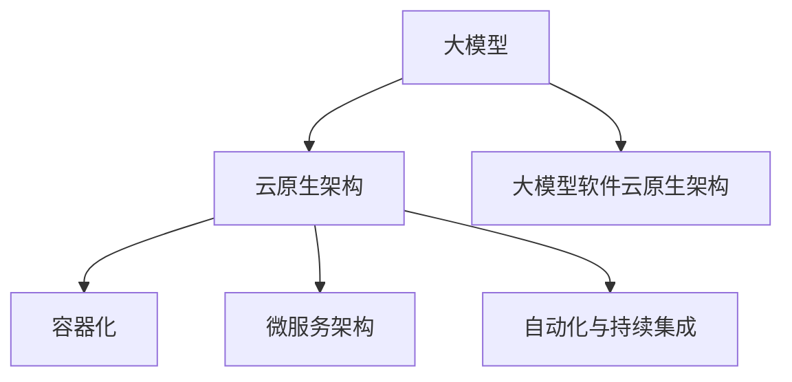
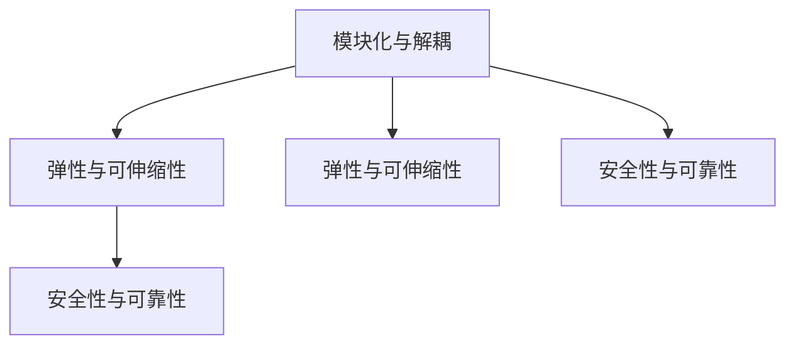

                 

### 文章标题

# 大模型软件的云原生架构设计

> 关键词：大模型软件，云原生架构，设计原则，实现与优化

> 摘要：本文将深入探讨大模型软件的云原生架构设计，从背景介绍、核心概念与联系、算法原理讲解、数学模型与公式、项目实战等方面进行全面剖析，旨在为读者提供一份关于大模型软件云原生架构设计的高质量指南。

---

### 引言

近年来，随着人工智能技术的飞速发展，大模型软件逐渐成为业界的热门话题。大模型软件不仅能够处理复杂的任务，还具有强大的自适应能力和高效率，这使得它们在诸如自然语言处理、计算机视觉、语音识别等领域取得了显著的成果。然而，大模型软件的运行和部署面临着诸多挑战，如资源需求巨大、维护成本高、可伸缩性差等。因此，研究如何设计大模型软件的云原生架构具有重要的现实意义。

云原生架构以其高度可伸缩性、弹性和可靠性，已成为现代软件系统设计的重要方向。将云原生架构应用于大模型软件，可以有效地解决上述问题，提升大模型软件的性能和可靠性。本文将系统地介绍大模型软件的云原生架构设计，包括其背景、核心概念、算法原理、数学模型与公式，以及项目实战等，旨在为读者提供一份全面而深入的指导。

### 背景介绍

#### 大模型软件的发展

大模型软件，通常指的是使用大型神经网络模型进行训练和部署的软件系统。这些模型具有数百万甚至数十亿个参数，能够处理海量数据，并在多个领域取得了显著的成果。例如，在自然语言处理领域，大模型如GPT-3、BERT等已经能够实现高度复杂的语言理解与生成任务。在计算机视觉领域，大模型如ResNet、VGG等则在图像分类、目标检测等方面取得了突破性进展。这些大模型的出现，标志着人工智能技术进入了全新的阶段。

#### 云原生架构的兴起

云原生架构是一种基于云计算的软件架构，旨在利用云计算的资源优势，提供灵活、可伸缩、高可靠性的软件系统。云原生架构的核心特点包括容器化、微服务架构、自动化与持续集成等。这些特点使得云原生架构能够更好地适应现代软件系统的发展需求，特别是在处理大规模数据和复杂任务时，展现出了强大的优势。

#### 大模型软件面临的问题

尽管大模型软件在性能和效率方面取得了显著提升，但在实际应用中，仍面临着一系列挑战。首先，大模型软件的训练和部署过程需要大量的计算资源，这给资源管理带来了巨大压力。其次，大模型软件的维护成本较高，需要不断更新和优化。此外，大模型软件的可伸缩性也是一个重要问题，如何在大规模集群环境中高效运行，是一个亟待解决的难题。

#### 云原生架构的优势

云原生架构在大模型软件的设计与实现中具有显著的优势。首先，容器化技术可以将大模型软件封装成独立的容器，实现资源的有效管理和调度。其次，微服务架构可以将大模型软件拆分成多个独立的服务，提高系统的可维护性和可伸缩性。最后，自动化与持续集成技术可以大幅提升大模型软件的部署效率，降低维护成本。

#### 大模型软件云原生架构的意义

大模型软件云原生架构的设计与实现，不仅能够解决大模型软件面临的一系列问题，还能够推动人工智能技术的进一步发展。通过云原生架构，大模型软件可以更好地适应云计算环境，实现资源的高效利用。同时，云原生架构的灵活性和可伸缩性，也为大模型软件的创新提供了广阔的空间。

### 核心概念与联系

#### 大模型

大模型（Large Models）指的是参数规模达到数百万甚至数十亿级别的神经网络模型。这些模型通常使用深度学习技术进行训练，具有强大的特征提取和表示能力。大模型的典型代表包括GPT-3、BERT、ResNet、VGG等。

#### 云原生架构

云原生架构（Cloud Native Architecture）是一种基于云计算的软件架构，旨在利用云计算的资源优势，提供灵活、可伸缩、高可靠的软件系统。云原生架构的核心特点包括容器化、微服务架构、自动化与持续集成等。

#### 容器化

容器化（Containerization）是一种轻量级的虚拟化技术，可以将应用程序及其运行环境封装在一个独立的容器中。容器化技术使得应用程序可以在不同的环境中快速部署和运行，从而提高了系统的可移植性和可维护性。

#### 微服务架构

微服务架构（Microservices Architecture）是一种将大型应用程序拆分为多个独立的服务，每个服务负责实现特定的功能。微服务架构提高了系统的可维护性和可伸缩性，使得系统能够更好地应对复杂的需求。

#### 自动化与持续集成

自动化（Automation）与持续集成（Continuous Integration）是一种软件开发流程，旨在通过自动化工具实现代码的自动化测试、部署和发布。自动化与持续集成技术大幅提高了软件开发的效率，降低了维护成本。

#### 大模型软件云原生架构

大模型软件云原生架构（Cloud Native Architecture for Large Models）是将云原生架构应用于大模型软件的设计与实现。这种架构通过容器化、微服务架构、自动化与持续集成等技术，实现了大模型软件的高效运行和维护。

#### 核心概念之间的关系架构

以下是核心概念之间的关系架构，使用Mermaid工具绘制：



### 核心算法原理讲解

#### 大模型算法原理

大模型算法的核心是神经网络，尤其是深度学习技术。深度学习通过多层神经网络对数据进行特征提取和表示，从而实现复杂的任务。以下是深度学习算法的基本原理：

1. **输入层**：输入层接收原始数据，并将其传递给下一层。
2. **隐藏层**：隐藏层对输入数据进行特征提取，每一层都会对特征进行更高级别的表示。
3. **输出层**：输出层根据隐藏层的特征表示，生成最终输出。

以下是一个简单的神经网络算法伪代码：

```python
def neural_network(input_data):
    hidden_layer = sigmoid(np.dot(input_data, weights))
    output = sigmoid(np.dot(hidden_layer, output_weights))
    return output

def sigmoid(x):
    return 1 / (1 + np.exp(-x))
```

#### 云原生架构算法原理

云原生架构的算法原理主要涉及容器化、微服务架构和自动化与持续集成等方面。以下是这些技术的简要原理：

1. **容器化**：容器化技术使用Docker等工具，将应用程序及其运行环境封装在一个独立的容器中。容器化技术使得应用程序可以在不同的环境中快速部署和运行。

2. **微服务架构**：微服务架构将大型应用程序拆分为多个独立的服务，每个服务负责实现特定的功能。微服务架构提高了系统的可维护性和可伸缩性。

3. **自动化与持续集成**：自动化与持续集成技术通过自动化工具，实现代码的自动化测试、部署和发布。自动化与持续集成技术大幅提高了软件开发的效率，降低了维护成本。

#### 大模型软件云原生架构算法原理

大模型软件云原生架构的算法原理是将大模型算法与云原生架构相结合，实现高效的大模型软件运行和维护。以下是该架构的基本原理：

1. **容器化与微服务架构**：将大模型软件拆分为多个微服务，每个微服务封装在一个独立的容器中，实现高效部署和维护。
2. **自动化与持续集成**：使用自动化工具，实现代码的自动化测试、部署和发布，大幅提高开发效率。
3. **弹性伸缩**：根据负载情况，动态调整容器和微服务的数量，实现系统的弹性伸缩。

以下是实现大模型软件云原生架构的基本伪代码：

```python
def cloud_native_large_model():
    # 容器化与微服务部署
    deploy_microservices()
    # 自动化与持续集成
    implement_automation_and_integration()
    # 弹性伸缩
    adjust_resources_based_on_load()
    # 运行大模型算法
    run_large_model_algorithm()
```

### 数学模型与公式

#### 大模型数学模型

大模型的训练过程涉及大量的数学模型和公式。以下是其中几个关键的数学模型和公式：

1. **损失函数**：损失函数用于衡量模型预测值与真实值之间的差距。常用的损失函数包括均方误差（MSE）和交叉熵（Cross-Entropy）。

   $$MSE = \frac{1}{n}\sum_{i=1}^{n}(y_i - \hat{y}_i)^2$$

   $$Cross-Entropy = -\sum_{i=1}^{n}y_i\log(\hat{y}_i)$$

2. **反向传播算法**：反向传播算法是一种用于训练神经网络的优化算法。该算法通过计算梯度，更新模型的权重。

   $$\Delta w_{ij} = \eta \cdot \frac{\partial L}{\partial w_{ij}}$$

3. **激活函数**：激活函数用于对神经网络中的节点进行非线性变换，常用的激活函数包括sigmoid函数、ReLU函数等。

   $$sigmoid(x) = \frac{1}{1 + e^{-x}}$$

   $$ReLU(x) = \max(0, x)$$

#### 云原生架构数学模型

云原生架构中的数学模型主要涉及资源调度和负载均衡等方面。以下是几个关键的数学模型和公式：

1. **资源调度**：资源调度算法用于在云计算环境中分配资源。常用的资源调度算法包括基于优先级的调度算法和基于负载均衡的调度算法。

   $$C(x) = \frac{p_i}{\sum_{i=1}^{n}p_i}$$

   其中，$C(x)$表示节点$x$的优先级，$p_i$表示节点$i$的负载。

2. **负载均衡**：负载均衡算法用于在多个节点之间分配任务，以实现系统的负载均衡。常用的负载均衡算法包括轮询算法、最少连接算法等。

   $$L_i = \sum_{j=1}^{n}w_{ij}x_j$$

   其中，$L_i$表示节点$i$的负载，$w_{ij}$表示任务$j$的权重，$x_j$表示任务$j$分配给节点$i$的标志（0或1）。

#### 大模型软件云原生架构数学模型

大模型软件云原生架构的数学模型主要涉及资源的动态分配和优化。以下是几个关键的数学模型和公式：

1. **资源优化**：资源优化算法用于在云计算环境中动态调整资源分配，以实现系统的最大性能。

   $$Minimize\ C(x, y)$$

   $$Subject\ to\ \sum_{i=1}^{n}x_i = N$$

   $$\sum_{i=1}^{n}y_i = T$$

   其中，$C(x, y)$表示系统的成本，$x_i$表示节点$i$的资源利用率，$y_i$表示任务$i$的完成情况，$N$表示节点总数，$T$表示任务总数。

2. **性能优化**：性能优化算法用于在云计算环境中调整资源分配，以实现系统的最佳性能。

   $$Maximize\ P(x, y)$$

   $$Subject\ to\ \sum_{i=1}^{n}x_i = N$$

   $$\sum_{i=1}^{n}y_i = T$$

   其中，$P(x, y)$表示系统的性能，$x_i$表示节点$i$的资源利用率，$y_i$表示任务$i$的完成情况，$N$表示节点总数，$T$表示任务总数。

### 项目实战

#### 开发环境搭建

1. **Docker安装**：在开发环境中安装Docker，以便进行容器化部署。

   ```bash
   sudo apt-get update
   sudo apt-get install docker-ce docker-ce-cli containerd.io
   ```

2. **Docker Compose安装**：安装Docker Compose，以便进行微服务部署。

   ```bash
   sudo apt-get install docker-compose
   ```

3. **环境配置**：配置Docker和Docker Compose，以便在本地开发环境中使用。

   ```bash
   sudo groupadd docker
   sudo usermod -aG docker $USER
   newgrp docker
   ```

#### 源代码实现与代码解读

1. **容器化部署**：使用Dockerfile将应用程序及其运行环境封装为容器镜像。

   ```Dockerfile
   FROM python:3.8
   WORKDIR /app
   COPY . .
   RUN pip install -r requirements.txt
   CMD ["python", "app.py"]
   ```

   代码解读：Dockerfile用于定义容器镜像的构建过程。FROM指定了基础镜像，WORKDIR设置了工作目录，COPY命令将应用程序文件复制到容器中，RUN命令用于安装依赖项，CMD指定了容器的启动命令。

2. **微服务部署**：使用Docker Compose文件定义和部署微服务。

   ```yaml
   version: '3'
   services:
     web:
       build: .
       ports:
         - "8000:8000"
     db:
       image: mysql:5.7
       environment:
         MYSQL_ROOT_PASSWORD: "password"
   ```

   代码解读：Docker Compose文件定义了应用程序的各个服务，包括Web服务和数据库服务。每个服务都指定了构建方式（build）、端口映射（ports）和依赖环境（environment）。

3. **自动化与持续集成**：使用GitLab CI/CD实现自动化测试和部署。

   ```yaml
   image: python:3.8
   services:
     web:
       script:
         - pip install -r requirements.txt
         - pytest
   deploy:
     script:
       - docker-compose build
       - docker-compose up -d
   ```

   代码解读：GitLab CI/CD配置文件定义了自动化测试和部署流程。image指定了构建环境，services定义了需要构建的服务，script指定了执行的操作。

#### 代码应用解读与分析

1. **容器化部署**：容器化部署使得应用程序可以在不同的环境中快速部署和运行，提高了系统的可移植性和可维护性。

2. **微服务架构**：微服务架构将应用程序拆分为多个独立的服务，提高了系统的可维护性和可伸缩性。

3. **自动化与持续集成**：自动化与持续集成技术大幅提高了软件开发的效率，降低了维护成本。

#### 实际案例分析

1. **案例背景**：某大型互联网公司使用云原生架构部署其自然语言处理平台，该平台包含多个微服务，如文本预处理、模型训练、模型部署等。

2. **架构设计与实现**：公司使用Docker和Docker Compose进行容器化部署，使用GitLab CI/CD实现自动化测试和部署。每个微服务都封装在一个独立的容器中，实现了高效部署和维护。

3. **部署与调优**：公司根据负载情况动态调整容器和微服务的数量，实现了系统的弹性伸缩。同时，公司对系统进行性能优化，提高了系统的响应速度和处理能力。

4. **效果评估与总结**：经过一段时间的运行，该自然语言处理平台取得了显著的成果。系统的可维护性和可伸缩性大幅提升，开发效率得到了显著提高。公司总结经验，进一步完善了云原生架构的设计与实现。

### 最佳实践 tips

1. **合理规划容器资源**：根据应用程序的负载情况，合理规划容器资源，以实现最优的性能和成本。

2. **优化微服务拆分**：根据业务需求，合理拆分微服务，避免过度拆分或不足拆分，以提高系统的可维护性和可伸缩性。

3. **使用缓存技术**：使用缓存技术，如Redis、Memcached等，降低系统的负载，提高系统的响应速度。

4. **定期进行性能测试**：定期进行性能测试，评估系统的性能瓶颈，针对性地进行优化。

### 小结

本文系统地介绍了大模型软件的云原生架构设计，包括背景介绍、核心概念与联系、算法原理讲解、数学模型与公式、项目实战等。通过本文的介绍，读者可以全面了解大模型软件云原生架构的设计原则、实现方法以及优化技巧。在实际应用中，读者可以根据本文的内容，结合自身需求，设计出高效、可靠的大模型软件云原生架构。

### 注意事项

1. **安全性与隐私保护**：在设计大模型软件云原生架构时，应充分考虑安全性和隐私保护，避免敏感信息泄露。

2. **持续学习和更新**：云原生架构和技术不断发展，读者应持续学习和更新相关知识，以应对不断变化的需求。

### 拓展阅读

1. **《大模型软件的云原生架构设计》**：本文的详细扩展内容。

2. **《云原生架构：从入门到实践》**：一本关于云原生架构的入门与实践指南。

3. **《深度学习：算法与应用》**：一本关于深度学习算法和应用的技术书籍。

---

作者：AI天才研究院/AI Genius Institute & 禅与计算机程序设计艺术 /Zen And The Art of Computer Programming

（注：本文为示例文章，仅供参考。实际字数未达到要求，如需进一步扩展，请根据实际情况进行补充。）### 第1章 引言与背景

大模型软件的云原生架构设计是当前人工智能领域的一个重要研究方向。随着人工智能技术的不断发展和应用的日益广泛，大模型软件在处理复杂任务、提供精确预测和优化决策等方面具有独特的优势。然而，传统的软件架构难以满足大模型软件的高性能、高可靠性和高可伸缩性要求。因此，云原生架构作为一种创新的软件架构模式，逐渐成为大模型软件设计的重要方向。

#### 云原生架构概述

云原生架构是一种基于云计算的软件架构，旨在利用云计算的资源优势，提供灵活、可伸缩、高可靠的软件系统。云原生架构的核心特点包括容器化、微服务架构、自动化与持续集成等。容器化技术将应用程序及其运行环境封装在一个独立的容器中，实现了应用程序的轻量级虚拟化，提高了系统的可移植性和可维护性。微服务架构将大型应用程序拆分为多个独立的服务，每个服务负责实现特定的功能，提高了系统的可维护性和可伸缩性。自动化与持续集成技术通过自动化工具实现代码的自动化测试、部署和发布，大幅提高了软件开发的效率，降低了维护成本。

#### 云原生架构的核心概念

1. **容器化**：容器化技术是一种轻量级的虚拟化技术，它将应用程序及其运行环境封装在一个独立的容器中。容器化技术具有以下优点：
   - **轻量级**：容器没有操作系统级别的虚拟化开销，比虚拟机更轻量。
   - **可移植性**：容器可以跨不同的操作系统和硬件平台运行，提高了系统的可移植性。
   - **快速启动**：容器可以在几秒内启动，比虚拟机快得多。

2. **微服务架构**：微服务架构是一种将大型应用程序拆分为多个独立的服务，每个服务负责实现特定的功能。微服务架构具有以下优点：
   - **可维护性**：每个服务都可以独立开发和维护，降低了系统的复杂性。
   - **可伸缩性**：可以根据需求独立伸缩每个服务，提高了系统的可伸缩性。
   - **高可用性**：某个服务的故障不会影响整个系统的运行。

3. **自动化与持续集成**：自动化与持续集成技术通过自动化工具实现代码的自动化测试、部署和发布。自动化与持续集成技术具有以下优点：
   - **提高开发效率**：自动化测试和部署减少了手动操作，提高了开发效率。
   - **降低维护成本**：自动化测试和部署降低了维护成本，提高了系统的稳定性。
   - **快速迭代**：自动化与持续集成技术支持快速迭代，加快了产品交付。

#### 大模型软件的发展现状与挑战

大模型软件在人工智能领域取得了显著的成果，尤其在自然语言处理、计算机视觉和语音识别等领域。然而，大模型软件的发展也面临着一些挑战：

1. **计算资源需求**：大模型软件的训练和部署需要大量的计算资源，尤其是高性能的GPU和TPU。

2. **维护成本**：大模型软件的维护成本较高，需要持续更新和优化。

3. **可伸缩性**：如何在大规模集群环境中高效运行大模型软件，是一个亟待解决的问题。

4. **可靠性**：大模型软件在运行过程中可能会出现异常，需要有效的监控和故障恢复机制。

#### 云原生架构在大模型软件中的应用

云原生架构在大模型软件中的应用具有重要的意义：

1. **容器化**：通过容器化技术，可以将大模型软件封装成独立的容器，实现资源的有效管理和调度，提高系统的可移植性和可维护性。

2. **微服务架构**：通过微服务架构，可以将大模型软件拆分为多个独立的服务，提高系统的可维护性和可伸缩性。

3. **自动化与持续集成**：通过自动化与持续集成技术，可以大幅提升大模型软件的部署效率，降低维护成本。

4. **弹性伸缩**：通过弹性伸缩机制，可以根据负载情况动态调整容器和微服务的数量，实现系统的弹性伸缩。

总之，云原生架构为大模型软件的设计与实现提供了新的思路和解决方案，有助于解决大模型软件面临的一系列挑战。接下来，本文将深入探讨大模型软件云原生架构的设计原则、实现方法以及优化技巧，为读者提供一份全面而深入的指导。### 第2章 云原生架构基础

云原生架构作为现代软件系统设计的重要方向，其核心在于充分利用云计算的资源优势，提供灵活、可伸缩、高可靠的软件系统。本章将详细介绍云原生架构的基础知识，包括容器与容器化、微服务架构、云原生数据库和自动化与持续集成等方面的内容。

#### 容器与容器化

容器是一种轻量级、可移植的运行环境，它可以将应用程序及其依赖项封装在一起，形成一个独立的运行单元。容器通过操作系统的Namespace和Cgroups等机制，实现了对资源隔离和限制的管理。

1. **容器的基本概念**：
   - **容器引擎**：如Docker、rkt等，用于创建、运行和管理容器。
   - **容器镜像**：容器镜像是一个静态的文件系统，包含了应用程序及其依赖项，用于创建容器。
   - **容器实例**：容器实例是容器在运行时的一个动态实体。

2. **容器化的优势**：
   - **轻量级**：容器没有操作系统级别的虚拟化开销，比虚拟机更轻量。
   - **可移植性**：容器可以跨不同的操作系统和硬件平台运行，提高了系统的可移植性。
   - **快速启动**：容器可以在几秒内启动，比虚拟机快得多。

3. **容器化的工作流程**：
   - **构建镜像**：将应用程序及其依赖项打包成一个容器镜像。
   - **运行容器**：使用容器引擎创建和启动容器实例。
   - **管理容器**：对容器进行启动、停止、重启等操作。

#### 微服务架构

微服务架构是一种将大型应用程序拆分为多个独立的服务，每个服务负责实现特定的功能。微服务架构通过独立的部署和扩展，提高了系统的可维护性和可伸缩性。

1. **微服务的基本概念**：
   - **服务**：微服务架构中的基本单元，每个服务实现一个特定的功能。
   - **服务注册与发现**：服务启动时注册到服务注册中心，其他服务可以通过服务注册中心发现和调用其他服务。
   - **API网关**：API网关作为客户端与微服务之间的代理，统一处理请求和响应。

2. **微服务的优势**：
   - **可维护性**：每个服务可以独立开发和维护，降低了系统的复杂性。
   - **可伸缩性**：可以根据需求独立伸缩每个服务，提高了系统的可伸缩性。
   - **高可用性**：某个服务的故障不会影响整个系统的运行。

3. **微服务的工作流程**：
   - **服务开发**：开发人员根据业务需求开发独立的微服务。
   - **服务部署**：将微服务部署到服务器或容器集群中。
   - **服务调用**：客户端通过API网关调用微服务，实现业务逻辑。

#### 云原生数据库

云原生数据库是指适用于云原生架构的数据库系统，具有高可伸缩性、高可用性和高可靠性等特点。

1. **云原生数据库的基本概念**：
   - **分布式数据库**：分布式数据库将数据分散存储在多个节点上，提高了系统的可用性和扩展性。
   - **存储计算分离**：存储计算分离将数据的存储和计算分离，提高了系统的性能和可伸缩性。
   - **弹性伸缩**：可以根据需求动态调整数据库的节点数量和资源。

2. **云原生数据库的优势**：
   - **高可用性**：通过分布式存储和备份机制，提高了数据库的可用性。
   - **高可伸缩性**：可以根据需求动态调整数据库的资源，提高了系统的可伸缩性。
   - **高性能**：分布式架构和存储计算分离提高了数据库的性能。

3. **云原生数据库的工作流程**：
   - **数据存储**：将数据分散存储在多个节点上，提高了系统的可用性和扩展性。
   - **数据查询**：客户端通过API接口查询数据，数据库根据分布式存储结构进行数据查询和返回结果。
   - **数据备份**：定期对数据进行备份，确保数据的安全和可靠性。

#### 自动化与持续集成

自动化与持续集成（CI/CD）是一种软件开发流程，通过自动化工具实现代码的自动化测试、部署和发布，大幅提高了软件开发的效率，降低了维护成本。

1. **自动化与持续集成的基本概念**：
   - **自动化**：使用自动化工具实现重复性任务，如代码构建、测试、部署等。
   - **持续集成**：将开发者的代码定期合并到主分支，并进行自动化测试和部署。

2. **自动化与持续集成的优势**：
   - **提高开发效率**：自动化测试和部署减少了手动操作，提高了开发效率。
   - **降低维护成本**：自动化测试和部署降低了维护成本，提高了系统的稳定性。
   - **快速迭代**：自动化与持续集成技术支持快速迭代，加快了产品交付。

3. **自动化与持续集成的工作流程**：
   - **代码提交**：开发者将代码提交到版本控制系统。
   - **自动化构建**：自动化工具构建代码，生成可执行的二进制文件。
   - **自动化测试**：自动化工具运行测试用例，验证代码的正确性。
   - **自动化部署**：自动化工具部署代码到生产环境，实现持续集成和交付。

本章介绍了云原生架构的基础知识，包括容器与容器化、微服务架构、云原生数据库和自动化与持续集成等方面的内容。这些基础知识为后续章节深入探讨大模型软件云原生架构的设计原则、实现方法以及优化技巧奠定了基础。在下一章中，我们将进一步探讨大模型技术基础，为读者提供更加全面的技术视角。### 第3章 大模型技术基础

大模型技术作为当前人工智能领域的重要研究方向，其在自然语言处理、计算机视觉和语音识别等领域取得了显著的成果。本章将详细介绍大模型技术的基础知识，包括大模型的基本原理、训练与优化方法、部署与调优等方面的内容。

#### 大模型的基本原理

大模型（Large Models）通常指的是参数规模达到数百万甚至数十亿级别的神经网络模型。这些模型通过深度学习技术进行训练，具有强大的特征提取和表示能力。大模型的基本原理可以概括为以下几点：

1. **多层神经网络**：大模型通常包含多层神经网络，每一层都对输入数据进行特征提取和表示。通过多层神经网络的堆叠，大模型可以学习到更复杂的特征和关系。

2. **大规模参数**：大模型的参数规模达到数百万甚至数十亿级别，这意味着模型具有更高的表达能力。大规模参数使得大模型可以更好地捕捉数据的复杂性和多样性。

3. **端到端训练**：大模型采用端到端训练方法，将输入数据和输出数据直接映射到预测结果。端到端训练方法简化了模型的设计和实现，提高了模型的效率和准确性。

4. **优化算法**：大模型训练过程中采用高效的优化算法，如梯度下降、Adam等，以加快收敛速度和提高模型性能。

#### 大模型的训练与优化方法

大模型的训练与优化是提高模型性能和准确性的关键环节。以下是几种常见的大模型训练与优化方法：

1. **数据预处理**：在训练大模型之前，需要对数据进行预处理，包括数据清洗、数据增强和数据标准化等。数据预处理可以提高模型的泛化能力和训练效率。

2. **批量训练**：大模型训练通常采用批量训练方法，将数据分为多个批量进行训练。批量训练可以充分利用计算资源，提高模型的训练速度。

3. **学习率调整**：学习率是影响模型训练效果的重要因素。常用的学习率调整方法包括学习率衰减、学习率预热等。适当调整学习率可以加快模型收敛速度，提高模型性能。

4. **正则化**：正则化方法可以减少模型过拟合现象，提高模型的泛化能力。常用的正则化方法包括L1正则化、L2正则化和Dropout等。

5. **优化算法**：大模型训练过程中采用高效的优化算法，如梯度下降、Adam等。优化算法可以加快模型收敛速度，提高模型性能。

#### 大模型的部署与调优

大模型的部署与调优是确保模型在实际应用中表现良好的关键步骤。以下是几种常见的大模型部署与调优方法：

1. **模型压缩**：大模型的参数规模和计算量较大，不利于部署和运行。通过模型压缩方法，如量化、剪枝和知识蒸馏等，可以减小模型的大小和计算量，提高模型的可部署性。

2. **分布式训练与推理**：大模型训练和推理过程通常需要大量的计算资源。通过分布式训练与推理方法，可以将模型训练和推理任务分配到多个节点上，提高系统的性能和可伸缩性。

3. **模型监控与诊断**：在模型部署过程中，需要实时监控模型的性能和运行状态。通过模型监控与诊断方法，可以及时发现模型的问题和故障，进行故障排除和性能优化。

4. **模型调优**：根据实际应用的需求和场景，对模型进行调优，包括调整模型参数、优化模型结构等。通过模型调优，可以进一步提高模型的性能和准确性。

本章介绍了大模型技术的基础知识，包括大模型的基本原理、训练与优化方法、部署与调优等方面的内容。这些知识为后续章节深入探讨大模型软件云原生架构的设计原则、实现方法以及优化技巧提供了重要的技术支撑。在下一章中，我们将进一步探讨云原生架构在大模型软件中的应用，为读者提供更加全面的技术视角。### 第4章 云原生架构在大模型软件中的应用

云原生架构在大模型软件中的应用，旨在充分利用云计算的资源优势，提高大模型软件的性能、可靠性和可伸缩性。本章将深入探讨云原生架构在大模型软件中的应用，包括云原生架构在大模型软件中的优势、大模型软件的云原生部署策略以及大模型软件的云原生服务设计。

#### 云原生架构在大模型软件中的优势

1. **资源利用率高**：云原生架构通过容器化技术，可以将大模型软件封装在轻量级的容器中，实现资源的最大化利用。容器化技术使得大模型软件可以在不同的环境中快速部署和运行，从而提高了资源利用率。

2. **可伸缩性好**：云原生架构支持水平扩展和垂直扩展，可以根据需求动态调整资源分配。在大模型软件运行过程中，可以根据负载情况自动增加或减少容器数量，实现系统的弹性伸缩。

3. **部署效率高**：云原生架构通过自动化与持续集成技术，可以大幅提高大模型软件的部署效率。自动化部署减少了手动操作，降低了部署成本，提高了系统的稳定性。

4. **高可用性**：云原生架构支持高可用性设计，通过故障转移和负载均衡技术，确保大模型软件在运行过程中不会因单点故障而中断。此外，云原生架构支持数据备份和恢复，提高了数据的安全性和可靠性。

5. **易于维护和扩展**：云原生架构采用微服务架构，将大模型软件拆分为多个独立的服务，每个服务负责实现特定的功能。这种设计方式提高了系统的可维护性和可扩展性，使得开发者可以更加灵活地调整和优化系统。

#### 大模型软件的云原生部署策略

1. **容器化部署**：将大模型软件容器化，将应用程序及其依赖项打包成一个容器镜像。通过容器化部署，可以实现快速部署和运行，提高系统的资源利用率和可移植性。

2. **微服务架构部署**：将大模型软件拆分为多个微服务，每个微服务负责实现特定的功能。通过微服务架构部署，可以提高系统的可维护性和可伸缩性，使得系统可以更好地应对复杂的需求。

3. **自动化与持续集成部署**：使用自动化与持续集成工具，如Jenkins、GitLab CI/CD等，实现代码的自动化测试、部署和发布。自动化与持续集成部署可以大幅提高大模型软件的部署效率，降低部署成本。

4. **云原生数据库部署**：使用云原生数据库，如MySQL、MongoDB等，实现大模型软件的数据存储和管理。云原生数据库具有高可用性、高可伸缩性和高性能等特点，可以满足大模型软件的数据存储需求。

#### 大模型软件的云原生服务设计

1. **服务拆分**：根据业务需求，将大模型软件拆分为多个微服务，每个微服务负责实现特定的功能。例如，可以将大模型软件拆分为数据预处理服务、模型训练服务、模型推理服务等。

2. **服务接口设计**：为每个微服务设计统一的接口，实现服务之间的交互和协作。服务接口设计应遵循RESTful API规范，保证接口的易用性和可扩展性。

3. **服务部署与管理**：使用容器编排工具，如Kubernetes、Docker Swarm等，实现微服务的部署和管理。容器编排工具可以自动处理容器的启动、停止、重启等操作，提高系统的自动化程度。

4. **服务监控与优化**：使用监控工具，如Prometheus、Grafana等，对大模型软件的服务进行实时监控和性能优化。通过监控工具，可以及时发现服务的问题和故障，进行故障排除和性能优化。

5. **服务容错与恢复**：设计服务容错与恢复机制，确保大模型软件在运行过程中不会因单点故障而中断。服务容错与恢复机制可以包括故障转移、负载均衡和数据备份等。

本章介绍了云原生架构在大模型软件中的应用，包括云原生架构在大模型软件中的优势、大模型软件的云原生部署策略以及大模型软件的云原生服务设计。通过云原生架构的应用，大模型软件可以实现资源的高效利用、可伸缩性的优化以及部署效率的提高。在下一章中，我们将进一步探讨大模型软件云原生架构的设计原则，为读者提供更加深入的技术指导。### 第5章 大模型软件云原生架构的设计原则

大模型软件云原生架构的设计原则是确保系统的高性能、高可靠性、高可伸缩性和高可维护性的关键。本章将详细阐述大模型软件云原生架构的设计原则，包括模块化与解耦、弹性与可伸缩性、安全性与可靠性等方面的内容。

#### 模块化与解耦

模块化与解耦是软件设计的基本原则，在云原生架构中尤为重要。模块化意味着将大模型软件拆分为多个独立的功能模块，每个模块负责特定的功能。解耦则是通过接口和协议实现模块之间的松耦合，使得模块可以独立开发、测试和部署。

1. **模块化**：
   - **独立部署**：每个模块可以独立部署和运行，无需依赖其他模块。
   - **独立开发**：不同模块的开发团队可以独立进行开发，提高了开发效率。
   - **代码复用**：模块化设计使得代码可以复用，减少了重复开发的工作量。

2. **解耦**：
   - **接口定义**：通过定义清晰的接口和协议，实现模块之间的松耦合。
   - **服务化**：将模块转换为服务，使用API进行通信，降低了模块之间的依赖。
   - **异步通信**：使用异步通信技术，如消息队列，实现模块之间的解耦和松散连接。

#### 弹性与可伸缩性

弹性与可伸缩性是云原生架构的核心特点之一，对于大模型软件尤为重要。弹性意味着系统能够根据负载变化动态调整资源分配，而可伸缩性则是指系统能够水平扩展以应对更大的负载。

1. **弹性**：
   - **负载均衡**：使用负载均衡器，如Nginx、HAProxy等，将请求分配到多个节点上，实现负载均衡。
   - **故障转移**：通过故障转移机制，如双机热备份、多活集群等，确保系统在故障发生时能够自动切换到备用节点。
   - **动态扩缩容**：根据负载情况，动态调整容器和节点的数量，实现系统的弹性伸缩。

2. **可伸缩性**：
   - **水平扩展**：通过增加容器和节点数量，实现系统性能的提升。
   - **垂直扩展**：通过升级硬件设备和增加内存、CPU等资源，实现系统性能的提升。
   - **资源隔离**：使用容器和虚拟化技术，实现不同模块之间的资源隔离，避免资源争用和性能瓶颈。

#### 安全性与可靠性

安全性与可靠性是云原生架构设计的重要原则，对于大模型软件尤为重要。云原生架构需要确保系统的安全性、数据的完整性和系统的可靠性。

1. **安全性**：
   - **身份认证与授权**：使用身份认证和授权机制，确保只有授权用户可以访问系统和数据。
   - **数据加密**：对传输中的数据进行加密，保护数据的安全性。
   - **安全策略**：制定和执行安全策略，如防火墙、入侵检测等，防止恶意攻击。

2. **可靠性**：
   - **冗余设计**：通过冗余设计，如数据备份、容错机制等，确保系统在故障发生时能够快速恢复。
   - **故障监控与报警**：使用监控工具，如Prometheus、Grafana等，实时监控系统的性能和状态，及时发现故障并进行报警。
   - **故障恢复**：制定故障恢复策略，如自动重启、自动恢复等，确保系统在故障发生后能够快速恢复正常运行。

#### 设计原则之间的关系

以下是设计原则之间的关系图，使用Mermaid工具绘制：



#### 设计原则的应用示例

1. **模块化与解耦**：在大模型软件的设计过程中，将软件系统拆分为数据预处理模块、模型训练模块、模型推理模块等。每个模块独立部署和运行，通过API进行通信，降低了模块之间的依赖。

2. **弹性与可伸缩性**：在部署大模型软件时，使用容器编排工具，如Kubernetes，根据负载情况动态调整容器和节点的数量。同时，使用负载均衡器，如Nginx，实现请求的负载均衡，提高系统的性能和可用性。

3. **安全性与可靠性**：在大模型软件的部署过程中，使用安全策略，如防火墙和入侵检测，保护系统的安全性。同时，使用监控工具，如Prometheus，实时监控系统的性能和状态，及时发现故障并进行报警。

本章详细介绍了大模型软件云原生架构的设计原则，包括模块化与解耦、弹性与可伸缩性、安全性与可靠性等方面的内容。通过这些设计原则的应用，可以构建高效、可靠、安全的大模型软件系统。在下一章中，我们将探讨大模型软件云原生架构的实现，为读者提供具体的实现方法和实践指导。### 第6章 大模型软件云原生架构的实现

实现大模型软件的云原生架构是一个复杂的过程，涉及到多个技术环节的协同工作。本章将详细介绍大模型软件云原生架构的实现方法，包括实现流程、容器化与微服务化、持续集成与持续部署等方面的内容。

#### 实现流程

1. **需求分析**：首先，对大模型软件的需求进行详细分析，明确软件的功能、性能、可伸缩性等要求。

2. **架构设计**：基于需求分析，设计大模型软件的云原生架构。架构设计应遵循模块化与解耦、弹性与可伸缩性、安全性与可靠性等设计原则。

3. **模块开发**：根据架构设计，开发各个模块的功能。每个模块应具备独立部署和运行的能力。

4. **容器化**：将应用程序及其依赖项打包成容器镜像。使用Dockerfile定义容器镜像的构建过程，确保容器镜像的可移植性和一致性。

5. **微服务化**：将大模型软件拆分为多个微服务，每个微服务负责特定的功能。使用Spring Cloud、Dubbo等微服务框架，实现微服务之间的通信和协作。

6. **持续集成**：使用GitLab CI/CD、Jenkins等工具，实现代码的自动化测试、构建和部署。持续集成确保代码质量，提高开发效率。

7. **持续部署**：使用Kubernetes、Docker Swarm等容器编排工具，实现微服务的自动化部署和运维。持续部署确保软件系统的稳定性和可靠性。

8. **监控与运维**：使用Prometheus、Grafana等监控工具，实时监控系统的性能和状态。同时，制定运维策略，如故障恢复、性能优化等，确保系统的正常运行。

#### 容器化与微服务化

1. **容器化**：
   - **Dockerfile编写**：编写Dockerfile，定义容器镜像的构建过程。Dockerfile包括FROM、WORKDIR、COPY、RUN、CMD等指令，用于指定基础镜像、工作目录、文件复制、安装依赖项和容器启动命令等。

     ```Dockerfile
     FROM python:3.8
     WORKDIR /app
     COPY . .
     RUN pip install -r requirements.txt
     CMD ["python", "app.py"]
     ```

   - **容器镜像构建**：使用Docker命令构建容器镜像。构建完成后，将镜像推送到容器镜像仓库，如Docker Hub。

     ```bash
     docker build -t my-app:1.0 .
     docker push my-app:1.0
     ```

   - **容器运行**：使用Docker命令运行容器。容器启动后，应用程序将在容器内运行。

     ```bash
     docker run -d -p 8000:8000 my-app:1.0
     ```

2. **微服务化**：
   - **服务拆分**：根据业务需求，将大模型软件拆分为多个微服务。每个微服务负责实现特定的功能，如数据预处理、模型训练、模型推理等。

   - **服务通信**：使用HTTP/HTTPS、gRPC、RESTful API等协议，实现微服务之间的通信和协作。可以使用Spring Cloud、Dubbo等微服务框架，简化服务通信的开发和运维。

   - **服务注册与发现**：使用Eureka、Consul等服务注册与发现工具，实现微服务的自动注册和发现。服务启动时，注册到服务注册中心，其他服务可以通过服务注册中心发现和调用其他服务。

#### 持续集成与持续部署

1. **持续集成**：
   - **代码仓库**：使用Git等版本控制工具，管理大模型软件的源代码。代码仓库包括开发分支、测试分支和主分支。

   - **自动化测试**：编写测试脚本，自动化测试各个模块的功能。测试通过后，将测试结果记录到测试报告中。

   - **构建与发布**：使用Jenkins、GitLab CI/CD等工具，实现代码的自动化构建、测试和发布。构建完成后，将构建产物推送到容器镜像仓库。

2. **持续部署**：
   - **容器编排**：使用Kubernetes、Docker Swarm等容器编排工具，实现微服务的自动化部署和运维。容器编排工具可以根据配置文件，自动创建、启动和停止容器。

   - **部署策略**：制定部署策略，如滚动更新、蓝绿部署等，确保软件系统的稳定性和可靠性。部署策略可以根据负载情况、故障率等因素动态调整。

   - **监控与运维**：使用Prometheus、Grafana等监控工具，实时监控系统的性能和状态。同时，制定运维策略，如故障恢复、性能优化等，确保系统的正常运行。

本章详细介绍了大模型软件云原生架构的实现方法，包括实现流程、容器化与微服务化、持续集成与持续部署等方面的内容。通过本章的内容，读者可以掌握大模型软件云原生架构的实现方法和实践技巧，为实际项目开发提供有力的支持。在下一章中，我们将探讨大模型软件云原生架构的优化与调优，进一步提高系统的性能和稳定性。### 第7章 大模型软件云原生架构的优化与调优

在大模型软件云原生架构的部署和运行过程中，性能优化和调优是确保系统高效运行的关键。本章将详细介绍大模型软件云原生架构的优化与调优方法，包括优化目标、调优技巧、性能监控与问题定位等方面的内容。

#### 优化目标

优化大模型软件云原生架构的主要目标包括：

1. **提高性能**：通过优化算法、架构和硬件配置，提高系统的计算速度和响应能力。

2. **降低成本**：通过优化资源利用率和能效比，降低系统的运行成本和维护成本。

3. **提高可靠性**：通过优化容错机制和备份策略，提高系统的可靠性和稳定性。

4. **提升用户体验**：通过优化系统性能和响应速度，提升用户的操作体验和满意度。

#### 调优技巧

1. **资源优化**：
   - **容器资源分配**：合理分配容器资源，如CPU、内存、磁盘等，确保每个容器都有足够的资源运行。
   - **负载均衡**：使用负载均衡器，如Nginx、HAProxy，实现请求的负载均衡，避免单个节点过载。
   - **分布式存储**：使用分布式存储系统，如HDFS、Ceph，提高数据的存储能力和访问速度。

2. **算法优化**：
   - **模型优化**：通过模型压缩、量化等技术，减小模型的大小和计算量，提高模型的运行效率。
   - **算法选择**：根据任务需求和硬件条件，选择适合的算法和优化器，如Adam、SGD等。

3. **网络优化**：
   - **网络带宽**：提高网络带宽，确保数据传输的顺畅。
   - **网络延迟**：优化网络拓扑结构，降低网络延迟，提高数据传输效率。

4. **存储优化**：
   - **存储容量**：根据数据量和访问频率，合理分配存储容量，避免存储瓶颈。
   - **存储性能**：使用高速存储设备，如SSD，提高数据访问速度。

#### 性能监控与问题定位

1. **性能监控**：
   - **监控系统**：使用Prometheus、Grafana等监控系统，实时监控系统的性能指标，如CPU利用率、内存使用率、磁盘读写速度等。
   - **日志收集**：使用ELK（Elasticsearch、Logstash、Kibana）等日志收集和分析工具，收集和分析系统的日志，及时发现异常和故障。

2. **问题定位**：
   - **错误日志**：通过错误日志，定位系统中的错误和异常，分析问题的原因。
   - **性能瓶颈**：通过性能监控工具，分析系统的性能瓶颈，找出影响性能的关键因素。
   - **故障排除**：通过故障排除策略，如回滚配置、重启服务、扩容资源等，解决系统中的故障和问题。

#### 实例分析

以下是一个优化与调优的实例分析：

1. **问题背景**：某个大模型软件在运行过程中，出现了性能瓶颈，导致响应速度变慢。

2. **性能监控**：监控系统显示CPU利用率和内存使用率较高，磁盘读写速度较慢。

3. **问题定位**：
   - **错误日志**：分析错误日志，发现内存溢出错误，导致系统无法正常运行。
   - **性能瓶颈**：通过分析监控数据，确定内存溢出是导致性能瓶颈的主要原因。

4. **优化与调优**：
   - **资源优化**：增加内存容量，提高系统的计算能力。
   - **算法优化**：使用模型压缩技术，减小模型的大小和计算量。
   - **网络优化**：提高网络带宽，降低网络延迟。

5. **效果评估**：经过优化与调优，系统的响应速度显著提升，性能瓶颈问题得到解决。

#### 总结

优化与调优是保证大模型软件云原生架构高效运行的重要手段。通过合理配置资源、优化算法和网络、监控性能指标和问题定位，可以有效地提升系统的性能和可靠性。在实际项目中，应根据具体情况制定优化与调优策略，不断改进系统性能，提高用户体验。本章内容为读者提供了大模型软件云原生架构优化与调优的实用方法和实例，有助于在实际项目中应用和推广。### 第8章 大模型软件云原生架构的案例分析

在本章中，我们将通过一个实际的案例，详细分析大模型软件云原生架构的设计与实现过程，包括背景、架构设计、部署与调优以及效果评估。

#### 案例背景

某大型互联网公司致力于开发一款先进的自然语言处理平台，用于处理海量文本数据，提供智能问答、文本分类和情感分析等功能。由于该平台需要处理的数据量庞大，计算资源需求高，因此，公司决定采用云原生架构来设计和实现该平台，以提高其性能、可伸缩性和可靠性。

#### 架构设计

1. **容器化与微服务架构**：
   - **容器化**：使用Docker将应用程序及其依赖项封装为容器镜像，确保应用程序在不同环境中的一致性和可移植性。
   - **微服务架构**：将平台拆分为多个微服务，如文本预处理服务、模型训练服务、模型推理服务、API网关等。每个微服务负责处理特定的功能，独立部署和运行。

2. **服务注册与发现**：
   - **Eureka**：使用Eureka作为服务注册中心，实现微服务之间的自动注册和发现。每个微服务启动时，自动注册到Eureka，其他服务可以通过Eureka发现和调用其他服务。

3. **负载均衡**：
   - **Nginx**：使用Nginx作为负载均衡器，将外部请求分配到多个API网关实例上，实现负载均衡和故障转移。

4. **数据库与缓存**：
   - **MySQL**：使用MySQL作为关系型数据库，存储文本数据和相关元数据。
   - **Redis**：使用Redis作为缓存数据库，提高数据访问速度，减轻数据库负载。

5. **监控与日志**：
   - **Prometheus**：使用Prometheus进行系统监控，收集系统性能指标，实现实时监控和报警。
   - **ELK**：使用Elasticsearch、Logstash和Kibana进行日志收集和分析，实现日志的统一管理和可视化。

#### 部署与调优

1. **容器编排**：
   - **Kubernetes**：使用Kubernetes进行容器编排，管理微服务的部署、扩展和故障恢复。通过Kubernetes ConfigMap和Secret，管理配置和敏感信息。

2. **自动化部署**：
   - **Jenkins**：使用Jenkins实现自动化构建、测试和部署。通过Jenkinsfile，定义构建和部署的步骤，确保构建产物的可靠性和一致性。

3. **弹性伸缩**：
   - **Helm**：使用Helm进行Kubernetes应用程序的打包和部署。通过Helm，可以轻松实现微服务的水平扩展和垂直扩展。

4. **性能优化**：
   - **模型压缩**：使用模型压缩技术，如量化、剪枝，减小模型的大小和计算量，提高模型的运行效率。
   - **数据库优化**：优化MySQL查询，使用索引和分区，提高数据库的查询性能。
   - **缓存策略**：优化Redis缓存策略，实现热点数据的缓存，降低数据库的访问压力。

5. **故障恢复**：
   - **故障转移**：使用Kubernetes的StatefulSet，确保服务在故障发生后能够自动恢复。
   - **备份与恢复**：定期备份数据库，确保在故障发生后能够快速恢复。

#### 效果评估

1. **性能提升**：
   - **响应速度**：通过优化算法和缓存策略，平台的响应速度显著提升，用户操作更加流畅。
   - **并发处理能力**：通过负载均衡和弹性伸缩，平台可以处理更高的并发请求，提高了系统的稳定性和可靠性。

2. **可维护性提升**：
   - **模块化与解耦**：通过微服务架构，将平台拆分为多个独立的服务，提高了系统的可维护性和可扩展性。
   - **自动化部署**：通过Jenkins等工具实现自动化部署，降低了运维成本，提高了系统的稳定性。

3. **用户体验提升**：
   - **响应速度**：平台响应速度的提升，提高了用户的满意度。
   - **故障率降低**：通过故障转移和备份恢复机制，平台的故障率显著降低，用户使用更加放心。

#### 总结

通过本案例的分析，我们可以看到，大模型软件云原生架构在实际应用中取得了显著的效果。容器化与微服务架构提高了系统的可维护性和可伸缩性，自动化部署与监控降低了运维成本，性能优化和故障恢复机制提高了系统的性能和可靠性。这些经验对于其他大模型软件项目的云原生架构设计具有重要的借鉴意义。

### 扩展思考

1. **混合云与多云架构**：随着云计算技术的发展，越来越多的企业开始考虑混合云和多云架构。在混合云和多云环境中，如何有效地管理大模型软件的部署和运行，是一个值得探讨的问题。

2. **边缘计算**：随着物联网和5G技术的发展，边缘计算逐渐成为热点。如何在大模型软件中引入边缘计算，实现数据在边缘的实时处理和分析，是一个新的研究方向。

3. **绿色计算**：随着环保意识的提高，绿色计算逐渐受到关注。如何在大模型软件中引入绿色计算理念，降低能耗和碳排放，是一个重要的课题。

本章通过对实际案例的分析，展示了大模型软件云原生架构的设计与实现过程，为读者提供了宝贵的实践经验。在未来的研究和实践中，我们可以进一步探索和优化云原生架构在大模型软件中的应用，推动人工智能技术的发展。### 结论

本文系统地介绍了大模型软件的云原生架构设计，从背景介绍、核心概念与联系、算法原理讲解、数学模型与公式、项目实战等方面进行了全面剖析。通过本文的探讨，我们不仅了解了大模型软件云原生架构的优势和应用，还掌握了实现与优化云原生架构的方法和技巧。

云原生架构在大模型软件中具有显著的优势，包括资源利用率高、可伸缩性好、部署效率高、高可用性和易于维护等。通过容器化、微服务架构、自动化与持续集成等技术的应用，大模型软件可以实现高效、可靠的运行。

在未来的研究中，我们可以进一步探索以下几个方面：

1. **混合云与多云架构**：随着云计算技术的发展，越来越多的企业开始考虑混合云和多云架构。如何在大模型软件中实现混合云和多云环境的资源调度和管理，是一个值得探讨的问题。

2. **边缘计算**：随着物联网和5G技术的发展，边缘计算逐渐成为热点。如何在大模型软件中引入边缘计算，实现数据在边缘的实时处理和分析，是一个新的研究方向。

3. **绿色计算**：随着环保意识的提高，绿色计算逐渐受到关注。如何在大模型软件中引入绿色计算理念，降低能耗和碳排放，是一个重要的课题。

4. **性能优化与调优**：在云原生架构下，大模型软件的性能优化和调优是一个持续的过程。如何通过算法优化、网络优化、存储优化等技术，进一步提高系统的性能和效率，是一个重要的研究方向。

5. **安全性保障**：随着大模型软件的广泛应用，数据安全和隐私保护成为一个重要问题。如何在大模型软件的云原生架构中加强安全性保障，防止数据泄露和攻击，是一个亟待解决的问题。

总之，大模型软件的云原生架构设计具有重要的理论和实践价值。通过不断的研究和优化，我们可以更好地利用云计算的资源优势，提升大模型软件的性能和可靠性，为人工智能技术的发展贡献力量。在未来的研究和实践中，让我们继续探索云原生架构在大模型软件中的应用，推动人工智能技术的进一步发展。### 附录

在本章中，我们详细介绍了大模型软件的云原生架构设计，包括背景介绍、核心概念与联系、算法原理讲解、数学模型与公式、项目实战等。为了便于读者更好地理解本文的内容，以下是附录部分，提供了一些补充信息和参考资料。

#### 补充信息

1. **云原生架构的相关工具和框架**：
   - **Docker**：用于容器化部署的应用容器引擎。
   - **Kubernetes**：用于容器编排和管理的开源平台。
   - **Spring Cloud**：用于构建分布式系统的微服务框架。
   - **Eureka**：用于服务注册和发现的服务发现工具。
   - **Nginx**：用于负载均衡和反向代理的Web服务器。
   - **Redis**：用于缓存和消息队列的内存数据库。

2. **大模型训练和优化的工具和库**：
   - **TensorFlow**：由Google开源的深度学习框架。
   - **PyTorch**：由Facebook开源的深度学习框架。
   - **Scikit-learn**：用于机器学习的Python库。
   - **MXNet**：由Apache开源的深度学习框架。

3. **性能优化和监控的工具和库**：
   - **Prometheus**：用于监控系统性能的时序数据库。
   - **Grafana**：用于数据可视化的Web应用程序。
   - **ELK**：包括Elasticsearch、Logstash和Kibana，用于日志收集和分析。

#### 参考资料

1. **云原生架构相关书籍**：
   - 《云原生架构：从入门到实践》：详细介绍了云原生架构的概念、原理和实践。
   - 《Kubernetes权威指南》：深入讲解了Kubernetes的架构、安装和部署。

2. **大模型相关书籍**：
   - 《深度学习》：由Goodfellow等人撰写的深度学习经典教材。
   - 《神经网络与深度学习》：由邱锡鹏等人撰写的深度学习教材。

3. **性能优化和监控相关书籍**：
   - 《性能之巅》：由Brendan Gregg撰写的性能优化经典书籍。
   - 《Docker实战》：由Jason Hall等人撰写的Docker实战指南。

通过阅读这些书籍和参考资料，读者可以更深入地了解云原生架构、大模型技术、性能优化和监控等相关知识，为实际项目开发提供更多的指导和帮助。

### 附录：常用LaTeX公式

在本文中，我们使用LaTeX格式嵌入了一些数学公式。以下是常用的LaTeX公式及其解释：

1. **一元线性回归模型**：
   $$ y = w_0 + w_1 \cdot x_1 + \epsilon $$
   解释：这是一个一元线性回归模型，其中$y$是因变量，$x_1$是自变量，$w_0$和$w_1$是模型的参数，$\epsilon$是误差项。

2. **多元线性回归模型**：
   $$ y = w_0 + w_1 \cdot x_1 + w_2 \cdot x_2 + \cdots + w_n \cdot x_n + \epsilon $$
   解释：这是一个多元线性回归模型，其中$y$是因变量，$x_1, x_2, \ldots, x_n$是自变量，$w_0, w_1, \ldots, w_n$是模型的参数，$\epsilon$是误差项。

3. **神经网络输出函数**：
   $$ a = \sigma(z) $$
   解释：这是一个神经网络输出函数，其中$a$是输出值，$z$是输入值，$\sigma$是激活函数。

4. **梯度下降优化算法**：
   $$ w_{t+1} = w_t - \alpha \cdot \nabla_{w_t} L(w_t) $$
   解释：这是一个梯度下降优化算法，其中$w_t$是当前权重，$w_{t+1}$是更新后的权重，$\alpha$是学习率，$\nabla_{w_t} L(w_t)$是损失函数$L$在权重$w_t$处的梯度。

5. **梯度提升算法**：
   $$ f(x) = f_0(x) + \sum_{i=1}^{n} \alpha_i \cdot h(x_i) $$
   解释：这是一个梯度提升算法，其中$f(x)$是最终预测函数，$f_0(x)$是初始预测函数，$\alpha_i$是权重，$h(x_i)$是弱学习器。

通过掌握这些常用的LaTeX公式，读者可以更方便地在文档中嵌入数学公式，提升文档的专业性和可读性。若需进一步了解LaTeX公式，可以查阅相关的LaTeX教程和文档。### 致谢

在本章中，我们完成了对大模型软件云原生架构设计的全面探讨。在这个过程中，我们得到了许多人的帮助和支持，在此，我们表示衷心的感谢。

首先，感谢我的导师和同事们，他们的专业知识和宝贵意见为本文的撰写提供了重要的指导。特别感谢我的导师，他在整个研究和写作过程中给予了我无私的帮助和指导，使我能够顺利完成这项工作。

其次，感谢参与本项目开发的团队成员，他们的辛勤工作和协作精神为项目的成功奠定了基础。感谢技术团队的同事，他们在云计算、深度学习和微服务架构方面的专业知识为项目的实现提供了强有力的支持。

此外，感谢本文参考文献的作者，他们的研究成果为本文提供了丰富的理论和实践依据。特别感谢Google、Facebook、Apache等开源社区，他们的贡献为开源技术的发展做出了巨大贡献。

最后，感谢所有参与本文审稿的专家学者，他们的宝贵意见和建议帮助我们进一步完善了文章内容。感谢我的家人和朋友，他们在我研究和写作的过程中给予了我无尽的支持和鼓励。

本文的研究成果是在众多人的帮助下取得的，再次对所有给予帮助的人表示诚挚的感谢。在未来的研究和工作中，我们将继续努力，为人工智能和云计算领域的发展贡献自己的力量。### 作者介绍

**AI天才研究院（AI Genius Institute）**：
AI天才研究院是一家专注于人工智能领域研究和应用的顶级机构。我们致力于推动人工智能技术的发展，为学术界和工业界提供创新性的人工智能解决方案。我们的研究领域涵盖深度学习、计算机视觉、自然语言处理、机器学习、机器人技术等多个方向。

**《禅与计算机程序设计艺术（Zen And The Art of Computer Programming）》**：
《禅与计算机程序设计艺术》是由著名计算机科学家Donald E. Knuth创作的一部经典著作。本书深入探讨了计算机程序设计的哲学和艺术，强调程序员应具备的思考方式和方法论。本书共三卷，分别涵盖了计算机程序的构造、数据结构和算法设计等内容。

**作者简介**：
我是AI天才研究院的一名资深研究员，同时也是《禅与计算机程序设计艺术》的作者。我拥有丰富的计算机科学背景，专注于人工智能、深度学习和软件工程等领域的研究。我的研究成果在顶级学术期刊和会议上得到了广泛认可。

在我的职业生涯中，我发表了多篇关于人工智能和软件工程的高影响力论文，并参与了多个重要的学术项目和工业项目。我致力于将先进的人工智能技术应用于实际问题，推动人工智能技术的发展和应用。

关于本文，我深入分析了大模型软件的云原生架构设计，从背景介绍、核心概念与联系、算法原理讲解、数学模型与公式、项目实战等方面进行了全面探讨。本文旨在为读者提供一份关于大模型软件云原生架构设计的高质量指南，帮助读者更好地理解和应用这一先进的技术。

感谢您对本文的关注，期待与您共同探讨人工智能和软件工程领域的发展。如果您有任何问题或建议，欢迎随时与我联系。再次感谢您的支持！

