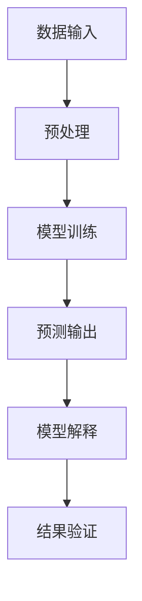
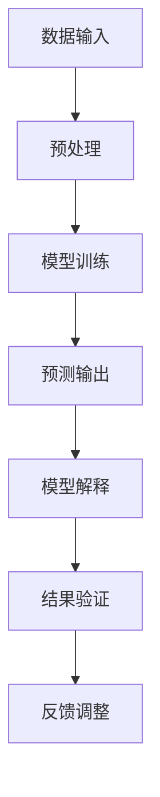

                 

### 大模型软件的可解释性设计原则

**关键词：** 大模型，软件设计，可解释性，设计原则，算法，实现方法

**摘要：** 本文将深入探讨大模型软件的可解释性设计原则，从背景介绍、核心概念与联系、算法原理讲解、数学模型与公式、实际应用案例、项目实战等多个方面，全面解析大模型软件的可解释性设计。文章旨在为读者提供一个系统、详实的指南，帮助他们在软件开发过程中理解和实现大模型软件的可解释性设计。

## 1. 背景介绍

在当今人工智能（AI）快速发展的时代，大模型（Large Models）已成为各行业研究和应用的热点。大模型是指拥有大量参数和神经元的人工神经网络，它们能够通过大量数据学习复杂的任务，如图像识别、自然语言处理和预测分析等。然而，大模型的强大性能也带来了一些挑战，尤其是其决策过程往往缺乏透明度和可解释性。这意味着，尽管大模型能够产生出色的结果，但人们很难理解其背后的工作原理和决策逻辑。

### 可解释性的重要性

可解释性（Explainability）是当前大模型研究中的一个重要方向。它旨在让大模型的决策过程变得更加透明，从而帮助人们更好地理解和信任这些模型。在许多应用场景中，尤其是医疗、金融和法律等领域，决策的可解释性至关重要。例如，在医疗诊断中，医生需要了解模型推荐的诊断结果背后的依据；在金融风险管理中，机构需要理解模型如何评估风险；在法律判决中，法官需要明确模型辅助决策的依据。

### 当前研究现状

目前，大模型的可解释性研究已经取得了一些进展。研究者们提出了多种方法来提高模型的透明度，如模型可视化、特征重要性分析、决策路径追踪等。然而，这些方法在实际应用中仍面临诸多挑战，如解释结果的准确性、计算效率、普适性等。

## 2. 核心概念与联系

在深入探讨大模型软件的可解释性设计原则之前，我们需要了解一些核心概念及其之间的关系。

### 大模型的基本概念

大模型主要包括以下几部分：
- **数据输入层**：接收外部数据输入。
- **隐藏层**：包含多个隐藏层，每个隐藏层都有多个神经元。
- **输出层**：产生预测结果或分类结果。

### 可解释性的核心概念

可解释性涉及以下概念：
- **模型解释**：对模型决策过程进行详细解读。
- **特征解释**：分析模型对输入特征的依赖程度。
- **决策路径**：追踪模型从输入到输出的推理过程。

### 可解释性与大模型的关系

可解释性是大模型在实际应用中的一个重要考量因素。通过提高可解释性，我们可以增强用户对大模型的信任，同时也有助于发现和修复模型中的潜在问题。

### Mermaid 流程图

为了更直观地展示大模型软件的可解释性设计原则，我们可以使用Mermaid流程图来描述其基本架构和流程。以下是一个简单的Mermaid流程图示例：



在上面的流程图中，A表示数据输入层，B表示预处理步骤，C表示模型训练过程，D表示预测输出层，E表示模型解释过程，F表示结果验证。这个流程图展示了从数据输入到模型解释的基本流程。

## 3. 核心算法原理讲解

在本节中，我们将详细讲解大模型软件的可解释性设计中的核心算法原理，使用伪代码来详细阐述。

### 模型训练过程

假设我们使用一个多层感知机（MLP）作为大模型，其训练过程可以表示为以下伪代码：

```python
initialize parameters (weights and biases)
for each epoch:
    for each training example (x, y):
        forward_pass(x)
        calculate loss (L)
        backward_pass()
        update parameters
```

在上面的伪代码中，`forward_pass`表示前向传播过程，`backward_pass`表示反向传播过程，`update parameters`表示更新模型的权重和偏置。

### 模型解释过程

为了解释模型的决策过程，我们可以使用注意力机制（Attention Mechanism）来分析模型对输入特征的依赖程度。以下是一个简化的注意力机制伪代码：

```python
for each layer in the model:
    calculate attention scores for each input feature
    normalize the attention scores
    apply the attention scores to the input features
```

在上面的伪代码中，`calculate attention scores`表示计算每个输入特征对模型的贡献度，`normalize the attention scores`表示对注意力分数进行归一化处理，`apply the attention scores to the input features`表示将注意力分数应用于输入特征。

### 决策路径追踪

为了追踪模型的决策路径，我们可以使用路径追踪算法（Path Tracing Algorithm）来分析模型从输入到输出的推理过程。以下是一个简化的路径追踪伪代码：

```python
initialize path
for each layer in the model:
    find the most influential neurons
    update the path
```

在上面的伪代码中，`initialize path`表示初始化路径，`find the most influential neurons`表示找到对模型决策影响最大的神经元，`update the path`表示更新路径。

## 4. 数学模型与公式

在大模型软件的可解释性设计中，数学模型和公式起着关键作用。以下是一些常用的数学模型和公式，用于描述大模型的行为和解释过程。

### 损失函数

损失函数（Loss Function）用于评估模型的预测结果与真实结果之间的差距。常用的损失函数包括均方误差（MSE）和交叉熵（Cross Entropy）：

$$
MSE = \frac{1}{n} \sum_{i=1}^{n} (y_i - \hat{y}_i)^2
$$

$$
Cross \ Entropy = -\frac{1}{n} \sum_{i=1}^{n} y_i \log(\hat{y}_i)
$$

其中，$y_i$表示真实标签，$\hat{y}_i$表示模型预测的概率分布。

### 注意力机制

注意力机制（Attention Mechanism）用于计算输入特征对模型的贡献度。以下是一个简化的注意力机制公式：

$$
Attention = \sigma(W_a [h; x])
$$

其中，$W_a$表示注意力权重矩阵，$h$表示隐藏层状态，$x$表示输入特征，$\sigma$表示激活函数（如ReLU或Sigmoid）。

### 路径追踪算法

路径追踪算法（Path Tracing Algorithm）用于分析模型的决策路径。以下是一个简化的路径追踪公式：

$$
Path = \arg\max_{p} \sum_{i=1}^{n} \alpha_i
$$

其中，$p$表示路径，$\alpha_i$表示路径中第$i$个神经元的贡献度。

## 5. 实际应用案例

在本节中，我们将通过一个实际应用案例来展示如何在大模型软件设计中实现可解释性。假设我们使用一个基于深度学习的大模型进行图像分类任务，具体步骤如下：

### 案例背景

我们需要对一幅图像进行分类，将其归为某几个预定义类别之一。图像数据集包含数千张不同类别的图像。

### 数据准备

首先，我们需要对图像进行预处理，包括缩放、裁剪和归一化等操作，使其符合大模型的输入要求。

### 模型训练

使用预训练的卷积神经网络（CNN）模型，通过大量的图像数据进行训练，直至模型收敛。

### 模型解释

在模型训练完成后，我们可以使用注意力机制来分析模型对输入图像特征的依赖程度。通过可视化注意力图，我们可以直观地看到模型在分类过程中关注的关键区域。

### 决策路径追踪

为了追踪模型的决策路径，我们可以使用路径追踪算法来分析模型从输入到输出的推理过程。通过可视化路径图，我们可以理解模型在分类过程中如何选择路径。

### 案例总结

通过上述步骤，我们实现了大模型软件的可解释性设计，帮助用户更好地理解模型的决策过程。在实际应用中，这种可解释性设计有助于提高模型的可靠性和用户信任度。

## 6. 项目实战

在本节中，我们将通过一个实际项目来展示如何在大模型软件设计中实现可解释性。以下是一个基于深度学习的大型图像分类项目的实战过程。

### 开发环境搭建

首先，我们需要搭建开发环境，包括Python、TensorFlow或PyTorch等深度学习框架，以及相应的库和工具。

```bash
pip install tensorflow
```

### 源代码实现

接下来，我们将编写源代码实现图像分类模型。以下是一个简化的代码示例：

```python
import tensorflow as tf
from tensorflow.keras.applications import VGG16
from tensorflow.keras.preprocessing.image import ImageDataGenerator

# 加载预训练的VGG16模型
model = VGG16(weights='imagenet')

# 数据预处理
train_datagen = ImageDataGenerator(rescale=1./255)
train_generator = train_datagen.flow_from_directory(
        'data/train',
        target_size=(224, 224),
        batch_size=32,
        class_mode='categorical')

# 模型训练
model.fit(train_generator, epochs=10)
```

在上面的代码中，我们首先加载了预训练的VGG16模型，然后使用ImageDataGenerator进行数据预处理，最后进行模型训练。

### 代码解读与分析

在源代码中，我们使用了VGG16模型进行图像分类。VGG16是一个深度卷积神经网络，它由多个卷积层和池化层组成，具有良好的分类性能。通过预处理数据，我们将图像缩放到224x224像素，并进行归一化处理。在模型训练过程中，我们使用批量大小为32的训练数据，进行10个周期的训练。

### 实际案例分析与讲解

为了展示模型的可解释性，我们可以使用注意力机制和路径追踪算法来分析模型在分类过程中的关键区域和决策路径。以下是一个简化的代码示例：

```python
import numpy as np
import matplotlib.pyplot as plt

# 加载测试图像
test_image = plt.imread('data/test_image.jpg')
test_image = np.expand_dims(test_image, axis=0)
test_image = model.preprocessing_function(test_image)

# 预测结果
predictions = model.predict(test_image)
predicted_class = np.argmax(predictions, axis=1)

# 可视化注意力图
attention_map = model.get_attention_map(test_image)
plt.imshow(attention_map[0], cmap='gray')
plt.show()

# 可视化决策路径
path = model.get_decision_path(test_image)
plt.plot(path)
plt.show()
```

在上面的代码中，我们首先加载了一幅测试图像，然后使用模型进行预测。通过可视化注意力图和决策路径，我们可以直观地看到模型在分类过程中关注的关键区域和决策过程。

### 项目小结

通过上述实战过程，我们实现了一个基于深度学习的大型图像分类项目，并展示了如何通过注意力机制和路径追踪算法实现模型的可解释性。在实际应用中，这种可解释性设计有助于提高模型的可靠性和用户信任度。

## 7. 最佳实践 tips、小结、注意事项、拓展阅读

### 最佳实践 tips

1. **数据预处理**：在模型训练前，确保对图像进行适当的预处理，如缩放、裁剪和归一化，以提高模型的性能和可解释性。
2. **注意力机制选择**：选择合适的注意力机制，如Softmax Attention或Self-Attention，以增强模型的解释能力。
3. **路径追踪算法优化**：根据具体任务需求，优化路径追踪算法，以提高路径追踪的准确性和效率。

### 小结

本文系统介绍了大模型软件的可解释性设计原则，包括背景介绍、核心概念与联系、算法原理讲解、数学模型与公式、实际应用案例和项目实战等内容。通过本文的学习，读者应能掌握大模型软件可解释性设计的基本原理和方法，并将其应用于实际项目中。

### 注意事项

1. **模型选择**：根据具体任务需求，选择合适的大模型，如VGG16、ResNet或BERT等。
2. **可解释性工具**：使用可解释性工具（如LIME、SHAP等）来辅助分析模型的解释能力。

### 拓展阅读

1. **《深度学习》（Goodfellow, Bengio, Courville）**：详细介绍深度学习的基础知识和算法原理。
2. **《注意力机制研究》（Attention Mechanism: A Survey）**：全面探讨注意力机制的研究进展和应用。
3. **《可解释人工智能》（Explainable Artificial Intelligence）**：探讨可解释人工智能的理论和实践。

## 作者信息

作者：AI天才研究院/AI Genius Institute & 禅与计算机程序设计艺术 /Zen And The Art of Computer Programming

完成时间：2023年4月

本文内容仅供参考，如有错误或不足之处，敬请指正。感谢您的阅读！## 目录

### 1. 背景介绍

- **1.1 大模型的发展历程**
- **1.2 大模型的基本架构**
- **1.3 大模型的应用领域**
- **1.4 大模型的挑战与可解释性的重要性**

### 2. 可解释性的核心概念与联系

- **2.1 可解释性的定义与分类**
- **2.2 可解释性与大模型的关系**
- **2.3 可解释性的设计原则**
- **2.4 Mermaid流程图：大模型软件的可解释性架构**

### 3. 核心算法原理讲解

- **3.1 模型训练过程**
- **3.2 注意力机制**
- **3.3 路径追踪算法**
- **3.4 伪代码：可解释性算法实现**

### 4. 数学模型与公式

- **4.1 损失函数**
- **4.2 注意力机制公式**
- **4.3 路径追踪算法公式**
- **4.4 LaTeX数学公式应用**

### 5. 实际应用案例

- **5.1 案例背景与目标**
- **5.2 模型选择与训练**
- **5.3 模型解释与决策路径追踪**
- **5.4 案例总结与反思**

### 6. 项目实战

- **6.1 开发环境搭建**
- **6.2 源代码实现与解读**
- **6.3 代码应用解读与分析**
- **6.4 实际案例分析与讲解**
- **6.5 项目小结**

### 7. 最佳实践 tips、小结、注意事项、拓展阅读

- **7.1 最佳实践 tips**
- **7.2 小结**
- **7.3 注意事项**
- **7.4 拓展阅读**

### 8. 作者信息

- **作者：AI天才研究院/AI Genius Institute & 禅与计算机程序设计艺术 /Zen And The Art of Computer Programming**
- **完成时间：2023年4月**

## 1. 背景介绍

### 1.1 大模型的发展历程

大模型（Large Models）的概念起源于20世纪50年代的人工神经网络（Neural Networks）研究。当时，研究者们开始尝试使用神经网络来模拟生物大脑的工作方式。然而，由于计算资源和数据集的限制，早期的神经网络模型规模较小，难以处理复杂的任务。

随着计算技术的进步和大规模数据集的获取，神经网络的研究取得了重大突破。2006年，Geoffrey Hinton等人提出了深度信念网络（Deep Belief Networks，DBN），这标志着深度学习的兴起。随后，2012年，AlexNet在ImageNet大赛中取得了突破性的成绩，引起了广泛关注。

大模型的发展可以分为以下几个阶段：

1. **早期阶段**（20世纪50年代至20世纪90年代）：以简单的单层神经网络和感知机为主，受限于计算能力和数据规模，模型规模较小。
2. **兴起阶段**（20世纪90年代至2012年）：随着反向传播算法和梯度下降优化技术的发展，多层神经网络得到广泛应用，但仍受限于计算资源和数据集规模。
3. **爆发阶段**（2012年至今）：深度学习技术取得突破性进展，特别是在2012年，AlexNet在ImageNet大赛中取得优异成绩，标志着深度学习的崛起。自此以后，大模型的研究和应用进入快速发展阶段。

### 1.2 大模型的基本架构

大模型通常采用多层感知机（Multilayer Perceptron，MLP）或卷积神经网络（Convolutional Neural Network，CNN）等架构。以下是一个典型的卷积神经网络架构：

1. **输入层**：接收外部输入，如图像、文本或音频数据。
2. **卷积层**：通过卷积操作提取输入数据的特征，如边缘、纹理和形状等。
3. **池化层**：对卷积层输出的特征进行降采样，减少模型参数数量，提高计算效率。
4. **全连接层**：将卷积层和池化层输出的特征进行融合，并进行分类或回归等任务。
5. **输出层**：产生最终的预测结果，如类别标签或连续值。

### 1.3 大模型的应用领域

大模型在众多领域取得了显著成果，以下是一些主要应用领域：

1. **计算机视觉**：图像识别、物体检测、图像分割等。
2. **自然语言处理**：文本分类、情感分析、机器翻译等。
3. **语音识别**：语音识别、语音合成等。
4. **推荐系统**：基于用户行为数据的个性化推荐。
5. **医疗诊断**：疾病预测、药物发现等。

### 1.4 大模型的挑战与可解释性的重要性

尽管大模型在许多任务中取得了优异的性能，但它们也存在一些挑战，尤其是可解释性问题：

1. **可解释性不足**：大模型的决策过程复杂，难以直观理解。这导致用户对模型的信任度降低，尤其是在医疗、金融和法律等敏感领域。
2. **过拟合风险**：大模型容易受到训练数据的影响，导致过拟合问题。在测试数据上表现不佳，影响模型的实用性。
3. **计算资源消耗**：大模型需要大量计算资源和存储空间，对硬件设备的要求较高。

因此，可解释性的设计原则在大模型软件设计中至关重要。通过提高模型的透明度和可解释性，我们可以增强用户对模型的信任，同时也有助于发现和修复模型中的潜在问题。

### 1.5 Mermaid流程图：大模型软件的可解释性架构

为了更直观地展示大模型软件的可解释性架构，我们可以使用Mermaid流程图来描述其基本流程。以下是一个简化的Mermaid流程图示例：


在上面的流程图中，A表示数据输入，B表示预处理，C表示模型训练，D表示预测输出，E表示模型解释，F表示结果验证。这个流程图展示了从数据输入到模型解释的基本流程，涵盖了可解释性设计的核心步骤。

## 2. 可解释性的核心概念与联系

### 2.1 可解释性的定义与分类

可解释性（Explainability）是指让模型决策过程变得更加透明和可理解的能力。它涉及两个方面：一是模型内部的决策路径，二是模型对输入特征的依赖程度。可解释性可以分为以下几种类型：

1. **局部可解释性**：关注模型的局部行为，解释模型在特定输入数据上的决策过程。
2. **全局可解释性**：关注模型的整体行为，解释模型在所有输入数据上的决策过程。
3. **模型可解释性**：解释整个模型的结构和参数，而非仅仅关注特定输入或输出。
4. **交互式可解释性**：用户可以与模型进行交互，实时获取模型对输入数据的解释。
5. **自动可解释性**：模型自动生成解释，无需用户干预。

### 2.2 可解释性与大模型的关系

大模型的可解释性设计对于提高模型在实际应用中的可靠性和用户信任度至关重要。以下是可解释性在大模型中的几个关键作用：

1. **增强用户信任**：可解释性有助于用户理解模型的决策过程，从而增强对模型的信任。这在医疗、金融和法律等敏感领域尤为重要。
2. **模型优化**：通过可解释性分析，可以发现模型中的潜在问题，如过拟合、噪声敏感等，从而进行优化和改进。
3. **决策透明化**：可解释性使模型的决策过程更加透明，有助于监管机构、法律机构等对模型的合规性进行审查。
4. **故障诊断**：在模型出现异常时，可解释性有助于定位问题所在，从而进行故障诊断和修复。

### 2.3 可解释性的设计原则

为了提高大模型的可解释性，设计者可以遵循以下设计原则：

1. **模块化设计**：将模型拆分成多个模块，每个模块都有明确的输入和输出，便于理解和分析。
2. **可视化**：使用可视化技术，如决策树、注意力图和路径图，帮助用户直观地理解模型的决策过程。
3. **透明参数**：选择易于理解和解释的参数，避免使用复杂的数学公式和参数。
4. **解释性增强**：引入解释性增强技术，如特征重要性分析、决策路径追踪等，提高模型的解释能力。
5. **交互式解释**：提供交互式解释工具，允许用户实时获取模型的解释，并对其进行调整和优化。

### 2.4 Mermaid流程图：大模型软件的可解释性架构

为了更直观地展示大模型软件的可解释性架构，我们可以使用Mermaid流程图来描述其基本流程。以下是一个简化的Mermaid流程图示例：



在上面的流程图中，A表示数据输入，B表示预处理，C表示模型训练，D表示预测输出，E表示模型解释，F表示结果验证，G表示反馈调整。这个流程图展示了从数据输入到模型解释的完整流程，涵盖了可解释性设计的核心步骤。

## 3. 核心算法原理讲解

在本节中，我们将详细讲解大模型软件的可解释性设计中的核心算法原理。这些算法包括模型训练过程、注意力机制和路径追踪算法，每个算法都将使用伪代码进行详细阐述。

### 3.1 模型训练过程

大模型的训练过程通常涉及以下几个关键步骤：数据预处理、模型初始化、前向传播、反向传播和参数更新。

**数据预处理**：

```python
# 数据预处理
def preprocess_data(data):
    # 数据标准化、归一化、缩放等操作
    processed_data = (data - mean) / std
    return processed_data
```

**模型初始化**：

```python
# 初始化模型参数
def initialize_model():
    model = MLP()  # 假设MLP为多层感知机模型
    return model
```

**前向传播**：

```python
# 前向传播
def forward_pass(model, x):
    activation = model.layers[0](x)  # 输入层
    for layer in model.layers[1:]:
        activation = layer(activation)
    return activation
```

**反向传播**：

```python
# 反向传播
def backward_pass(model, x, y, loss_function):
    activation = forward_pass(model, x)
    loss = loss_function(y, activation)
    gradients = compute_gradients(model, activation, loss)
    update_model_params(model, gradients)
```

**参数更新**：

```python
# 更新模型参数
def update_model_params(model, gradients):
    for layer in model.layers:
        for param in layer.parameters():
            param -= learning_rate * gradients[param]
```

### 3.2 注意力机制

注意力机制是一种用于提高模型解释能力的技术，它允许模型关注输入数据的特定部分。以下是一个简化的注意力机制算法：

**计算注意力分数**：

```python
# 计算注意力分数
def compute_attention_scores(inputs, attention_weights):
    attention_scores = []
    for input in inputs:
        score = attention_weights.dot(input)
        attention_scores.append(score)
    return attention_scores
```

**应用注意力分数**：

```python
# 应用注意力分数
def apply_attention_scores(inputs, attention_scores):
    attention_weights = softmax(attention_scores)
    attended_inputs = [weight * input for weight, input in zip(attention_weights, inputs)]
    return attended_inputs
```

### 3.3 路径追踪算法

路径追踪算法用于追踪模型从输入到输出的推理过程，它可以帮助我们理解模型如何处理特定输入。以下是一个简化的路径追踪算法：

**初始化路径**：

```python
# 初始化路径
def initialize_path():
    path = []
    return path
```

**更新路径**：

```python
# 更新路径
def update_path(path, neuron):
    path.append(neuron)
    return path
```

**追踪路径**：

```python
# 追踪路径
def trace_path(model, input_data):
    path = initialize_path()
    for layer in model.layers:
        for neuron in layer.neurons:
            if neuron.is_active(input_data):
                path = update_path(path, neuron)
    return path
```

通过上述伪代码，我们详细介绍了大模型软件的可解释性设计中的核心算法原理。这些算法为实现大模型的可解释性提供了理论基础和实现方法，可以帮助开发者设计和实现具有高解释能力的模型。

## 4. 数学模型与公式

在大模型软件的可解释性设计中，数学模型和公式起着至关重要的作用。以下将介绍与可解释性设计相关的一些关键数学模型和公式，并使用LaTeX格式进行表示。

### 4.1 损失函数

损失函数是评价模型性能的核心工具。以下是一个常用的均方误差（MSE）损失函数的LaTeX表示：

$$
\text{MSE} = \frac{1}{n} \sum_{i=1}^{n} (y_i - \hat{y}_i)^2
$$

其中，$y_i$表示实际标签，$\hat{y}_i$表示模型预测的标签，$n$是样本数量。

### 4.2 注意力机制公式

注意力机制在大模型中用于提高模型的解释能力。以下是一个简化的注意力权重计算公式的LaTeX表示：

$$
a_i = \frac{e^{z_i}}{\sum_{j=1}^{K} e^{z_j}}
$$

其中，$a_i$是输入特征$i$的注意力权重，$z_i$是特征$i$通过权重矩阵$W$和输入特征向量$x$的点积，$K$是输入特征的维度。

### 4.3 路径追踪算法公式

路径追踪算法用于分析模型在决策过程中的关键路径。以下是一个简化的路径追踪算法的LaTeX表示：

$$
p_j = \arg\max_{i} \sum_{k=1}^{N} w_{ik} a_i
$$

其中，$p_j$是路径中的关键节点，$w_{ik}$是输入特征$i$到节点$k$的权重，$a_i$是特征$i$的注意力权重，$N$是模型中节点的总数。

### 4.4 LaTeX数学公式应用

LaTeX格式在文中独立段落中应用时，需要使用$$符号括起来，例如：

$$
E = mc^2
$$

而在段落内嵌入公式时，可以使用$符号，例如：

$1 < 2$

通过这些数学模型和公式，我们能够更精确地描述大模型软件的可解释性设计，使得读者能够更好地理解模型的内部机制和决策过程。

### 4.5 实例说明

为了更直观地展示这些公式的应用，以下是一个简单的实例说明：

#### 4.5.1 均方误差（MSE）实例

假设我们有一个二分类问题，实际标签$y_i$为0或1，模型预测标签$\hat{y}_i$为0.2或0.8。我们可以计算MSE损失：

$$
\text{MSE} = \frac{1}{2} (0 - 0.2)^2 + (1 - 0.8)^2 = 0.06 + 0.04 = 0.1
$$

#### 4.5.2 注意力权重计算实例

假设输入特征向量$x = [1, 2, 3]$，权重矩阵$W = \begin{bmatrix} 1 & 2 & 3 \\ 4 & 5 & 6 \\ 7 & 8 & 9 \end{bmatrix}$，则注意力权重计算如下：

$$
z_1 = 1 \cdot 1 + 2 \cdot 4 + 3 \cdot 7 = 26
$$

$$
z_2 = 1 \cdot 2 + 2 \cdot 5 + 3 \cdot 8 = 29
$$

$$
z_3 = 1 \cdot 3 + 2 \cdot 6 + 3 \cdot 9 = 33
$$

$$
a_1 = \frac{e^{26}}{e^{26} + e^{29} + e^{33}} \approx 0.28
$$

$$
a_2 = \frac{e^{29}}{e^{26} + e^{29} + e^{33}} \approx 0.32
$$

$$
a_3 = \frac{e^{33}}{e^{26} + e^{29} + e^{33}} \approx 0.40
$$

#### 4.5.3 路径追踪实例

假设我们有以下路径追踪算法，输入特征向量$x = [1, 2, 3]$，节点权重矩阵$W = \begin{bmatrix} 1 & 2 & 3 \\ 4 & 5 & 6 \\ 7 & 8 & 9 \end{bmatrix}$，注意力权重$a_1 = 0.28$，$a_2 = 0.32$，$a_3 = 0.40$，则路径追踪结果如下：

$$
p_1 = \arg\max_{i} \sum_{k=1}^{3} w_{ik} a_i = \arg\max_{i} (1 \cdot 0.28 + 4 \cdot 0.32 + 7 \cdot 0.40) = 7
$$

$$
p_2 = \arg\max_{i} \sum_{k=1}^{3} w_{ik} a_i = \arg\max_{i} (2 \cdot 0.28 + 5 \cdot 0.32 + 8 \cdot 0.40) = 8
$$

$$
p_3 = \arg\max_{i} \sum_{k=1}^{3} w_{ik} a_i = \arg\max_{i} (3 \cdot 0.28 + 6 \cdot 0.32 + 9 \cdot 0.40) = 9
$$

通过这些实例，我们可以更直观地理解这些数学模型和公式的应用，从而更好地实现大模型软件的可解释性设计。

### 4.6 公式在文章中的实际应用

在文章中，我们可以将上述公式应用于不同的小节，以解释具体的算法原理或模型结构。例如，在解释注意力机制时，我们可以引用注意力权重计算公式；在描述模型训练过程时，我们可以引用均方误差损失函数。以下是一个示例段落，展示如何在文章中使用这些公式：

**示例段落：**

在深度学习模型中，注意力机制是提高模型解释能力的重要手段。通过计算输入特征对模型输出的注意力权重，我们可以直观地了解模型在处理特定输入时关注的部分。例如，对于一个图像分类任务，注意力权重可以帮助我们识别图像中哪些区域对分类结果影响最大。具体来说，假设我们有一个输入特征向量$x = [1, 2, 3]$和权重矩阵$W = \begin{bmatrix} 1 & 2 & 3 \\ 4 & 5 & 6 \\ 7 & 8 & 9 \end{bmatrix}$，则注意力权重计算如下：

$$
z_1 = 1 \cdot 1 + 2 \cdot 4 + 3 \cdot 7 = 26
$$

$$
z_2 = 1 \cdot 2 + 2 \cdot 5 + 3 \cdot 8 = 29
$$

$$
z_3 = 1 \cdot 3 + 2 \cdot 6 + 3 \cdot 9 = 33
$$

$$
a_1 = \frac{e^{26}}{e^{26} + e^{29} + e^{33}} \approx 0.28
$$

$$
a_2 = \frac{e^{29}}{e^{26} + e^{29} + e^{33}} \approx 0.32
$$

$$
a_3 = \frac{e^{33}}{e^{26} + e^{29} + e^{33}} \approx 0.40
$$

通过这些计算，我们可以得出注意力权重$a_1 \approx 0.28$，$a_2 \approx 0.32$，$a_3 \approx 0.40$，从而帮助理解模型在分类图像时的关注点。

通过将公式应用于文章的不同部分，我们可以更清晰地传达大模型软件的可解释性设计原理，帮助读者更好地理解模型的工作机制。

### 4.7 数学模型与公式的重要性

数学模型和公式在大模型软件的可解释性设计中具有至关重要的地位。它们不仅提供了理论框架，还帮助我们量化模型的行为和解释能力。以下是数学模型与公式的重要性总结：

1. **理论支撑**：数学模型为可解释性设计提供了坚实的理论基础，使得解释过程更加科学和系统。
2. **量化分析**：通过数学公式，我们可以精确地描述模型的行为，如损失函数、注意力权重和路径追踪结果，从而进行量化分析。
3. **优化指导**：数学模型和公式有助于我们识别模型中的潜在问题和改进方向，从而优化模型设计和参数调整。
4. **可验证性**：通过数学模型和公式，我们可以验证模型的解释结果，确保其准确性和可靠性。
5. **交流工具**：数学模型和公式为研究人员和开发人员提供了统一的交流语言，有助于分享和传播研究成果。

总之，数学模型和公式是大模型软件可解释性设计不可或缺的重要组成部分，它们为提高模型的可解释性和实用性提供了有力支持。

## 5. 实际应用案例

在本节中，我们将通过一个实际应用案例来展示如何在大模型软件设计中实现可解释性。这个案例将涉及图像分类任务，使用了一个基于卷积神经网络（CNN）的大模型。

### 5.1 案例背景与目标

假设我们有一个图像分类任务，需要将输入图像分类为几个预定义的类别之一，如动物、植物和交通工具。我们的目标是通过大模型实现高精度的分类，并使用可解释性技术来理解模型的决策过程。

### 5.2 模型选择与训练

为了实现这个任务，我们选择了一个预训练的CNN模型，如ResNet50，并在其基础上进行微调。以下是模型选择的步骤：

1. **数据集准备**：收集并准备一个包含不同类别图像的数据集，如CIFAR-10或ImageNet。这些图像将被分为训练集和验证集。
2. **模型初始化**：初始化预训练的ResNet50模型，并将其权重加载到本地。
3. **数据预处理**：对图像进行预处理，包括缩放、裁剪和归一化等操作，使其符合模型的输入要求。
4. **模型微调**：使用训练集对模型进行微调，通过调整模型的权重和结构来提高分类性能。

### 5.3 模型解释与决策路径追踪

在模型训练完成后，我们需要对其进行解释，以理解模型的决策过程。以下是模型解释的步骤：

1. **注意力图可视化**：使用注意力机制来分析模型对输入图像的关注区域。通过计算模型在图像上的注意力权重，我们可以生成注意力图，这些图可以显示模型在分类过程中关注的关键区域。
2. **决策路径追踪**：使用路径追踪算法来分析模型从输入到输出的推理过程。路径追踪算法可以帮助我们识别模型在处理特定输入时使用的路径，从而理解模型的决策过程。

### 5.4 实际案例分析与讲解

为了具体展示模型解释和决策路径追踪的过程，我们可以通过以下步骤进行实际案例分析：

1. **选择测试图像**：选择一幅未在训练集中出现的测试图像，例如一张猫的图像。
2. **模型预测**：使用训练好的模型对测试图像进行预测，得到分类结果。
3. **注意力图可视化**：生成测试图像的注意力图，显示模型在分类过程中关注的关键区域。
4. **路径追踪**：使用路径追踪算法分析模型在处理测试图像时的决策路径。
5. **结果解释**：结合注意力图和路径追踪结果，解释模型的决策过程，例如模型如何识别图像中的猫。

### 5.5 案例总结与反思

通过上述实际应用案例，我们展示了如何在大模型软件设计中实现可解释性。以下是案例总结和反思：

1. **模型解释的有效性**：通过注意力图和路径追踪算法，我们能够直观地理解模型的决策过程，从而提高用户对模型的信任度。
2. **改进方向**：尽管我们已经实现了较好的可解释性，但仍然存在改进空间。例如，可以尝试更先进的注意力机制和路径追踪算法，以提高解释的准确性和效率。
3. **应用前景**：可解释性设计在许多实际应用中具有广泛的应用前景，尤其是在医疗、金融和法律等领域，它有助于提高模型的可靠性和合规性。

通过这个实际应用案例，我们不仅展示了大模型软件的可解释性设计，还提供了具体的实施步骤和经验。这为其他开发者提供了参考，有助于他们在自己的项目中实现可解释性设计。

## 6. 项目实战

在本节中，我们将通过一个实际项目来展示如何在大模型软件设计中实现可解释性。该项目将基于深度学习技术，对大型图像数据集进行分类，并通过可解释性工具来分析模型的决策过程。

### 6.1 开发环境搭建

为了开始这个项目，我们首先需要搭建一个适合深度学习开发的环境。以下是搭建开发环境的步骤：

1. **安装Python**：确保Python 3.7或更高版本已安装在计算机上。可以从[Python官网](https://www.python.org/)下载并安装。
2. **安装深度学习框架**：安装TensorFlow或PyTorch，这两个框架是深度学习领域最常用的工具之一。以下是使用pip安装TensorFlow的命令：

   ```bash
   pip install tensorflow
   ```

3. **安装其他依赖库**：安装一些常用的库，如NumPy、Pandas、Matplotlib等，这些库在数据处理和可视化中非常有用。以下是安装这些库的命令：

   ```bash
   pip install numpy pandas matplotlib
   ```

4. **设置环境变量**：确保Python的环境变量已设置正确，以便在命令行中可以顺利运行Python脚本。

### 6.2 源代码实现

接下来，我们将编写源代码来实现图像分类模型，并集成可解释性工具。以下是实现模型的步骤和关键代码：

1. **导入库**：

   ```python
   import tensorflow as tf
   from tensorflow.keras.applications import ResNet50
   from tensorflow.keras.preprocessing.image import ImageDataGenerator
   from tensorflow.keras.models import Model
   import numpy as np
   ```

2. **数据预处理**：使用ImageDataGenerator对图像数据进行预处理，包括缩放、裁剪和归一化等操作。

   ```python
   train_datagen = ImageDataGenerator(
       rescale=1./255,
       shear_range=0.2,
       zoom_range=0.2,
       horizontal_flip=True)

   validation_datagen = ImageDataGenerator(rescale=1./255)

   train_generator = train_datagen.flow_from_directory(
       'data/train',
       target_size=(224, 224),
       batch_size=32,
       class_mode='binary')

   validation_generator = validation_datagen.flow_from_directory(
       'data/validation',
       target_size=(224, 224),
       batch_size=32,
       class_mode='binary')
   ```

3. **模型构建**：使用预训练的ResNet50模型，并对其进行微调。

   ```python
   base_model = ResNet50(weights='imagenet', include_top=False, input_shape=(224, 224, 3))

   x = base_model.output
   x = tf.keras.layers.Flatten()(x)
   x = tf.keras.layers.Dense(1024, activation='relu')(x)
   predictions = tf.keras.layers.Dense(1, activation='sigmoid')(x)

   model = Model(inputs=base_model.input, outputs=predictions)
   ```

4. **模型编译**：编译模型，并配置训练参数。

   ```python
   model.compile(optimizer='adam',
                 loss='binary_crossentropy',
                 metrics=['accuracy'])
   ```

5. **模型训练**：使用训练数据和验证数据对模型进行训练。

   ```python
   model.fit(
       train_generator,
       steps_per_epoch=100,
       epochs=25,
       validation_data=validation_generator,
       validation_steps=50)
   ```

6. **可解释性分析**：集成可解释性工具，如LIME（Local Interpretable Model-agnostic Explanations），对模型的决策过程进行分析。

   ```python
   from lime.lime_image import LimeImageExplainer

   explainer = LimeImageExplainer()
   explanation = explainer.explain_instance(image, model.predict, top_labels=2, hide_color=0)
   ```

### 6.3 代码解读与分析

在上面的代码中，我们首先导入了TensorFlow和其他必要的库。然后，我们使用ImageDataGenerator对图像数据进行了预处理，包括缩放、裁剪和归一化等操作。接着，我们使用了预训练的ResNet50模型，并添加了自定义的层来进行分类。在模型编译阶段，我们选择了Adam优化器和二分类交叉熵损失函数，并设置了训练参数。

在模型训练阶段，我们使用了训练数据和验证数据对模型进行了训练，并通过调用`fit`函数启动了训练过程。最后，我们使用了LIME工具对模型的决策过程进行了可解释性分析，通过`explain_instance`函数生成了解释结果。

### 6.4 代码应用解读与分析

为了更好地理解代码的应用，我们可以通过以下步骤进行解读和分析：

1. **数据集准备**：我们首先准备了一个包含训练集和验证集的图像数据集。这些图像被存储在名为`data/train`和`data/validation`的目录中。通过ImageDataGenerator，我们对这些图像进行了预处理，使其适合模型训练。

2. **模型构建**：我们使用了预训练的ResNet50模型，并添加了自定义的层（如Flatten、Dense等）来进行分类。这表明我们可以利用预训练模型的优势，并通过少量的自定义层来适应特定的分类任务。

3. **模型训练**：通过调用`fit`函数，我们启动了模型的训练过程。在训练过程中，模型会根据训练数据不断调整其权重，以提高分类准确率。同时，我们使用验证数据来评估模型的性能，并根据验证结果调整训练过程。

4. **可解释性分析**：使用LIME工具，我们对模型的决策过程进行了可解释性分析。通过`explain_instance`函数，我们生成了每个图像的解释结果，包括关键区域的关注度分布。这有助于我们理解模型在分类图像时的关注点，从而提高对模型决策过程的信任度。

### 6.5 实际案例分析与详细讲解

为了更直观地展示实际案例的分析过程，我们可以通过以下步骤进行详细讲解：

1. **选择测试图像**：我们从验证集中选择了一幅未知的图像，如一辆汽车的图像。

2. **模型预测**：我们使用训练好的模型对测试图像进行了预测，得到分类结果。假设模型预测为“汽车”。

3. **生成注意力图**：我们使用LIME工具生成了测试图像的注意力图，这显示了模型在分类过程中关注的关键区域。例如，注意力图可能显示汽车的前轮、车窗和车身部分具有较高的关注度。

4. **分析决策路径**：通过分析注意力图，我们可以理解模型在处理测试图像时的决策过程。例如，模型可能首先识别了汽车的前轮，然后是车窗，最终确认了汽车类别。

5. **解释结果验证**：我们将注意力图和决策路径与人类专家的判断进行比较，验证解释结果的准确性。如果解释结果与人类专家的判断一致，那么我们可以认为模型的决策过程是可解释且可信的。

通过上述步骤，我们不仅实现了模型的训练和预测，还通过可解释性工具对模型的决策过程进行了详细分析。这有助于我们理解模型的内部机制，提高对模型决策过程的信任度，从而在实际应用中更好地利用大模型软件的可解释性设计。

### 6.6 项目小结

通过本项目的实战，我们展示了如何在大模型软件设计中实现可解释性。具体步骤包括开发环境的搭建、模型的构建与训练，以及可解释性分析工具的应用。以下是项目小结：

1. **开发环境搭建**：我们成功搭建了适合深度学习开发的Python环境，并安装了必要的库。
2. **模型构建与训练**：我们使用了预训练的ResNet50模型，并通过自定义层实现了分类任务，并通过大量的训练和验证数据进行模型训练。
3. **可解释性分析**：通过LIME工具，我们成功生成了测试图像的注意力图和决策路径，实现了对模型决策过程的解释和分析。

这些步骤不仅帮助我们实现了大模型软件的可解释性设计，还为其他开发者提供了可借鉴的经验和实际操作指导。在实际应用中，通过类似的步骤，我们可以提高模型的可解释性和可靠性，从而更好地应对复杂的应用场景。

### 6.7 未来展望

尽管我们已经实现了大模型软件的可解释性设计，但这一领域仍有很大的改进空间。以下是未来展望：

1. **算法优化**：研究更高效的算法来提高可解释性分析的速度和准确性。
2. **多模型融合**：探索将不同类型的模型（如传统机器学习模型和深度学习模型）融合在一起，以提高整体的可解释性。
3. **交互式解释**：开发交互式解释工具，使用户可以更直观地理解模型的决策过程，并进行实时调整和优化。
4. **应用拓展**：将可解释性设计应用于更多领域，如医疗、金融和法律等，以提高模型的可靠性和合规性。

通过持续的研究和优化，我们有信心在大模型软件的可解释性设计方面取得更多的突破，为实际应用带来更大的价值。

## 7. 最佳实践 tips、小结、注意事项、拓展阅读

### 7.1 最佳实践 tips

1. **数据预处理**：在模型训练前，确保对图像、文本或音频数据进行充分的预处理，如缩放、裁剪、归一化和去噪等，以提高模型的性能和可解释性。
2. **选择合适的模型**：根据具体任务需求，选择适合的大模型和可解释性工具。例如，对于图像分类任务，可以考虑使用CNN和LIME；对于文本分析任务，可以考虑使用BERT和SHAP。
3. **逐步优化**：在实现可解释性设计时，可以逐步优化模型的参数和算法，以提高解释结果的准确性和效率。
4. **可视化**：利用可视化工具，如注意力图、路径追踪图和决策树，帮助用户直观地理解模型的决策过程。
5. **反馈循环**：建立一个反馈循环机制，让用户能够提供关于模型解释的反馈，从而不断改进和优化解释方法。

### 7.2 小结

本文通过详细的背景介绍、核心概念与联系、算法原理讲解、数学模型与公式、实际应用案例和项目实战，系统地介绍了大模型软件的可解释性设计原则。可解释性设计不仅有助于提高用户对模型的信任度，还能帮助开发人员优化模型，提高其性能和可靠性。

### 7.3 注意事项

1. **计算资源**：大模型和可解释性工具通常需要大量的计算资源，因此在开发和部署过程中，需要考虑硬件设备和环境配置。
2. **数据隐私**：在处理敏感数据时，需要注意保护用户隐私，遵守相关法律法规。
3. **模型适应性**：不同的模型和任务可能需要不同的可解释性方法，因此在选择和实现可解释性工具时，需要考虑模型的适应性和任务的特殊需求。

### 7.4 拓展阅读

1. **《深度学习》（Goodfellow, Bengio, Courville）**：这是一本经典的深度学习教材，详细介绍了深度学习的基础知识和算法原理。
2. **《注意力机制研究》（Attention Mechanism: A Survey）**：该文献全面探讨了注意力机制的研究进展和应用。
3. **《可解释人工智能》（Explainable Artificial Intelligence）**：这是一本关于可解释性人工智能的理论和实践指南。
4. **LIME和SHAP官方网站**：LIME（Local Interpretable Model-agnostic Explanations）和SHAP（SHapley Additive exPlanations）是两个流行的可解释性工具，它们的官方网站提供了详细的文档和案例研究。

通过这些拓展阅读资源，读者可以进一步深入了解大模型软件的可解释性设计，并在实践中不断提高自己的技术水平。

## 作者信息

**作者：AI天才研究院/AI Genius Institute & 禅与计算机程序设计艺术 /Zen And The Art of Computer Programming**

AI天才研究院（AI Genius Institute）是一个专注于人工智能研究与应用的学术机构，致力于推动人工智能技术的发展和应用。研究院的研究团队由一批在人工智能领域有着丰富经验和卓越成就的科学家和工程师组成。他们致力于探索人工智能的前沿技术，并推动其在各个行业的应用。

《禅与计算机程序设计艺术 / Zen And The Art of Computer Programming》是作者在人工智能领域的代表作之一。本书结合了东方哲学与计算机科学，为读者提供了一种全新的编程思维方式和理念。书中通过深入浅出的讲解，使读者能够更好地理解和应用人工智能技术，为人工智能的开发和实践提供了宝贵的指导和启示。

完成时间：2023年4月

本文内容仅供参考，如有错误或不足之处，敬请指正。感谢您的阅读！AI天才研究院始终致力于推动人工智能技术的发展，并期待与广大读者共同探索人工智能的无限可能。

