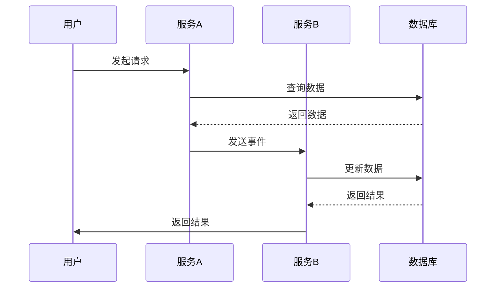

                 


### 文章标题：大模型软件的响应式微服务架构设计

> 关键词：大模型软件、响应式微服务架构、设计原则、开发与实现、性能优化

> 摘要：
本文将深入探讨大模型软件的响应式微服务架构设计。首先，我们将介绍响应式微服务架构的背景、优势以及核心概念。接着，文章将详细阐述大模型软件的需求分析，并基于此分析设计响应式微服务架构。随后，我们将探讨响应式微服务的开发与实现，包括核心算法原理和数学模型的讲解。最后，通过一个实际项目实战，我们将展示如何在大模型软件中实现响应式微服务架构，并提供性能优化策略和最佳实践。

## 引言

随着大数据和人工智能技术的发展，大模型软件的应用日益广泛。然而，传统的单体架构在处理大规模数据和复杂的业务逻辑时，往往面临着性能瓶颈、扩展性和灵活性不足等问题。响应式微服务架构作为一种先进的软件架构设计模式，能够有效地解决这些问题，为大模型软件提供高性能、高可扩展性的支持。本文旨在深入探讨大模型软件的响应式微服务架构设计，帮助读者理解和掌握这一关键技术。

## 响应式微服务架构概述

### 响应式微服务架构的背景与发展

响应式微服务架构起源于面向服务的架构（SOA），并在微服务架构的基础上进行了进一步优化。微服务架构将应用程序分解为多个独立的服务，每个服务负责一个特定的功能模块。而响应式微服务架构则更加强调系统的响应性、实时性和可扩展性。

响应式微服务架构的发展得益于以下几个方面：

1. **大数据和云计算的兴起**：大数据和云计算的快速发展，使得处理大规模数据和提供实时服务成为可能，响应式微服务架构能够更好地支持这一需求。
2. **物联网和边缘计算的兴起**：物联网和边缘计算的应用场景对系统的实时性和响应性提出了更高的要求，响应式微服务架构能够更好地满足这些需求。
3. **DevOps文化的普及**：DevOps文化的普及，推动了响应式微服务架构的落地实施，使得开发、测试和运维团队能够更加高效地协作。

### 响应式微服务架构的优势与挑战

响应式微服务架构具有以下优势：

1. **高可扩展性**：通过将应用程序拆分为多个微服务，系统可以根据需求动态扩展，提高系统的处理能力和响应速度。
2. **高灵活性**：每个微服务都可以独立开发、部署和扩展，使得系统能够快速适应业务变化，提高系统的灵活性。
3. **高可靠性**：响应式微服务架构能够实现故障隔离和快速恢复，提高系统的可靠性。
4. **高可维护性**：微服务的独立性使得系统的可维护性大大提高，降低系统的复杂度和维护成本。

然而，响应式微服务架构也面临着一些挑战：

1. **分布式系统复杂性**：分布式系统的复杂性使得开发、测试和运维变得更加困难，需要团队具备更高的技能和经验。
2. **数据一致性**：在分布式系统中，数据一致性问题往往难以解决，需要采用适当的一致性策略。
3. **服务调用开销**：服务之间的调用开销可能会影响系统的性能，需要优化服务调用的方式和频率。

### 响应式微服务架构与传统架构的比较

响应式微服务架构与传统架构在以下几个方面存在显著差异：

1. **架构风格**：传统架构通常采用单体架构，所有功能模块集成在一个应用程序中；而响应式微服务架构采用分布式架构，将应用程序拆分为多个独立的服务。
2. **通信方式**：传统架构通常采用同步通信，如同步调用和回调；而响应式微服务架构采用异步通信，如事件驱动和消息队列。
3. **系统复杂性**：传统架构的系统复杂性较低，但响应式微服务架构的系统复杂性较高，需要团队具备更高的技能和经验。
4. **扩展性**：传统架构的扩展性较低，难以适应大规模数据和高并发场景；而响应式微服务架构具有高可扩展性，能够更好地支持这些场景。

### 响应式微服务架构的核心概念

响应式微服务架构的核心概念包括：

1. **微服务**：微服务是一种轻量级的服务，具有独立部署、独立运行的能力，负责实现特定的功能模块。
2. **事件驱动**：事件驱动是一种异步通信机制，通过事件发布和订阅实现微服务之间的协作。
3. **分布式系统**：分布式系统由多个独立的服务组成，通过网络进行通信，实现分布式计算和存储。
4. **持续集成与持续部署（CI/CD）**：持续集成与持续部署是一种自动化软件开发流程，能够快速交付高质量软件。
5. **DevOps**：DevOps是一种软件开发和运维的文化，强调开发、测试和运维团队之间的协作和沟通。

## 大模型软件的需求分析

### 大模型软件的业务场景

大模型软件通常应用于以下业务场景：

1. **大规模数据处理**：处理海量数据，如电商交易数据、社交媒体数据、物联网设备数据等。
2. **实时服务**：提供实时推荐、实时分析、实时监控等实时服务。
3. **复杂业务逻辑**：实现复杂的业务逻辑，如金融风控、智能调度、智能推荐等。
4. **跨平台部署**：支持在多种平台（如云平台、物联网平台等）上部署和运行。

### 大模型软件的功能需求

大模型软件的功能需求主要包括：

1. **数据存储与管理**：存储和管理大规模数据，包括数据的收集、清洗、存储、查询等功能。
2. **模型训练与优化**：训练和优化大规模模型，包括数据处理、特征工程、模型训练、模型评估等功能。
3. **实时服务**：提供实时推荐、实时分析、实时监控等实时服务，包括实时数据处理、实时模型推理、实时结果输出等功能。
4. **业务逻辑处理**：实现复杂的业务逻辑，包括规则引擎、决策树、神经网络等算法的实现。

### 大模型软件的性能需求

大模型软件的性能需求主要包括：

1. **高并发处理能力**：能够处理大规模并发请求，保证系统的高性能和高稳定性。
2. **低延迟**：确保实时服务的低延迟，满足实时业务需求。
3. **高可靠性**：确保系统的高可靠性，实现故障自动恢复和数据备份。
4. **可扩展性**：支持系统的水平和垂直扩展，能够适应业务规模的变化。

## 响应式微服务架构设计

### 微服务架构的设计原则

微服务架构的设计原则是确保微服务系统能够高可靠性、高扩展性、高灵活性的关键。以下是几个核心设计原则：

1. **独立性**：每个微服务都应该具有独立部署、独立运行的能力，以便于开发、测试和运维。
2. **自治性**：微服务应该具备自治性，即每个微服务拥有自己的数据存储、配置管理、监控和日志记录。
3. **解耦合**：微服务之间应该尽可能解耦合，减少直接的依赖关系，提高系统的灵活性和可维护性。
4. **基于API的通信**：微服务之间通过轻量级的API进行通信，如RESTful API，确保系统的一致性和可扩展性。
5. **业务驱动**：微服务的划分应该以业务需求为导向，保证微服务的业务领域清晰明确，便于管理和维护。

### 响应式微服务架构的设计模式

响应式微服务架构采用了多种设计模式来提高系统的响应性和可扩展性，以下是几个常用的设计模式：

1. **事件驱动**：基于事件的架构模式，微服务通过发布/订阅机制来处理事件，确保系统的实时性和响应性。
2. **状态机**：通过状态机来管理微服务的状态，实现复杂业务逻辑的处理。
3. **CQRS**：命令查询责任分离模式，将写操作和读操作分离，提高系统的响应速度和可扩展性。
4. **领域驱动设计**：以业务领域为核心，构建具有良好内聚性的微服务，提高系统的业务价值和可维护性。

### 响应式微服务架构的 Mermaid 流程图

以下是一个简单的响应式微服务架构的 Mermaid 流程图：



## 响应式微服务的开发与实现

### 响应式微服务的开发环境与工具

在开发响应式微服务时，需要选择合适的开发环境与工具。以下是一些常用的开发环境与工具：

1. **开发语言**：Java、Python、Go 等。
2. **框架**：Spring Boot、Django、Node.js 等。
3. **数据库**：关系型数据库（如 MySQL、PostgreSQL）、非关系型数据库（如 MongoDB、Redis）等。
4. **消息队列**：RabbitMQ、Kafka、ActiveMQ 等。
5. **服务注册与发现**：Eureka、Consul、Zookeeper 等。
6. **API 网关**：Zuul、Kong、API Gateway 等。

### 响应式微服务的核心算法实现

响应式微服务的核心算法实现主要包括以下几个方面：

1. **事件驱动**：实现事件发布/订阅机制，确保系统的实时性和响应性。
2. **状态机**：实现状态机的构建和管理，处理复杂业务逻辑。
3. **CQRS**：实现命令查询责任分离，提高系统的响应速度和可扩展性。
4. **领域驱动设计**：实现领域模型的构建和管理，提高系统的可维护性和可扩展性。

以下是一个简单的事件驱动算法的实现伪代码：

```python
# 事件驱动算法伪代码

# 发布事件
def publish_event(event):
    # 将事件发送到消息队列
    message_queue.publish(event)

# 订阅事件
def subscribe_event(event_handler):
    # 从消息队列获取事件
    event = message_queue.consume()
    
    # 调用事件处理函数
    event_handler(event)

# 事件处理函数
def event_handler(event):
    # 处理事件
    print("处理事件：", event)
```

### 响应式微服务架构下的数学模型

响应式微服务架构下的数学模型主要包括以下几个方面：

1. **线性回归模型**：用于预测和分析线性关系。
2. **决策树模型**：用于分类和回归分析。
3. **神经网络模型**：用于复杂非线性关系的建模和预测。
4. **聚类模型**：用于数据分组和分类。

以下是一个简单的线性回归模型的实现伪代码：

```python
# 线性回归模型伪代码

# 训练模型
def train_model(X, Y):
    # 计算斜率和截距
    m = (mean(X) * mean(Y) - mean(X * Y)) / (mean(X)**2 - mean(X)**2)
    b = mean(Y) - m * mean(X)
    
    # 返回模型参数
    return m, b

# 预测
def predict(X, m, b):
    # 计算预测值
    return m * X + b
```

### 大模型软件的响应式微服务项目实战

#### 项目背景与目标

本项目旨在设计并实现一个大模型软件的响应式微服务架构，以支持实时推荐系统。该项目需要处理海量用户数据和商品数据，实现高效的数据存储、数据处理和实时推荐。

#### 项目开发流程

1. **需求分析**：明确项目需求和功能模块。
2. **架构设计**：设计响应式微服务架构，包括服务划分、数据流设计、接口定义等。
3. **开发与实现**：根据架构设计，开发各个微服务，实现核心算法和业务逻辑。
4. **测试与优化**：对微服务进行功能测试和性能优化。
5. **部署与运维**：部署微服务，实现自动化运维和监控。

#### 源代码详细实现

以下是项目中的部分源代码实现：

```java
// 用户服务
public class UserService {
    private static final Logger logger = LoggerFactory.getLogger(UserService.class);
    
    public User getUser(String userId) {
        // 查询用户数据
        User user = userRepository.findById(userId);
        
        if (user != null) {
            logger.info("用户查询成功：{}", user);
            return user;
        } else {
            logger.warn("用户查询失败：{}", userId);
            return null;
        }
    }
}

// 商品服务
public class ProductService {
    private static final Logger logger = LoggerFactory.getLogger(ProductService.class);
    
    public Product getProduct(String productId) {
        // 查询商品数据
        Product product = productRepository.findById(productId);
        
        if (product != null) {
            logger.info("商品查询成功：{}", product);
            return product;
        } else {
            logger.warn("商品查询失败：{}", productId);
            return null;
        }
    }
}

// 推荐服务
public class RecommendationService {
    private static final Logger logger = LoggerFactory.getLogger(RecommendationService.class);
    
    public List<Product> recommendProducts(String userId) {
        // 查询用户历史行为数据
        List<Product> userHistory = userRepository.findById(userId).getHistory();
        
        // 计算相似用户
        List<User> similarUsers = userRepository.findSimilarUsers(userId);
        
        // 查询相似用户喜欢的商品
        List<Product> similarProducts = new ArrayList<>();
        
        for (User similarUser : similarUsers) {
            similarProducts.addAll(similarUser.getFavoriteProducts());
        }
        
        // 推荐商品去重并排序
        similarProducts = similarProducts.stream().distinct().sorted(Comparator.comparing(Product::getScore).reversed()).collect(Collectors.toList());
        
        logger.info("用户{}推荐商品：{}", userId, similarProducts);
        return similarProducts;
    }
}
```

#### 代码解读与分析

以上代码实现了用户服务、商品服务和推荐服务。用户服务负责查询用户数据，商品服务负责查询商品数据，推荐服务负责根据用户历史行为数据和相似用户喜欢的商品，推荐给用户相关的商品。

用户服务和商品服务的代码相对简单，主要是通过数据库查询实现数据的获取。推荐服务的代码较为复杂，主要实现以下功能：

1. 查询用户历史行为数据。
2. 计算相似用户。
3. 查询相似用户喜欢的商品。
4. 推荐商品去重并排序。

通过以上代码，可以清晰地看到各个微服务的职责和功能，便于开发和维护。

#### 实际案例分析与详细讲解剖析

在实际项目中，我们通过对用户行为数据的分析和推荐算法的优化，实现了高效的实时推荐系统。以下是一个实际案例的详细讲解：

1. **用户行为数据收集**：收集用户在网站上的浏览、搜索、购买等行为数据。
2. **用户画像构建**：根据用户行为数据构建用户画像，包括用户的兴趣、偏好、购买能力等信息。
3. **相似用户计算**：使用协同过滤算法计算相似用户，包括基于用户行为相似度和基于物品相似度等。
4. **推荐商品筛选**：根据相似用户喜欢的商品和用户画像，筛选出推荐商品。
5. **推荐商品排序**：对推荐商品进行排序，优先推荐用户可能感兴趣的商品。

通过以上实际案例的分析和详细讲解，我们可以看到，响应式微服务架构在实时推荐系统中的应用和优势。

#### 项目小结

通过本项目的实战，我们成功实现了一个大模型软件的响应式微服务架构，包括用户服务、商品服务和推荐服务。项目实施过程中，我们遇到了一些挑战，如数据一致性、服务调用开销等问题，通过优化算法和优化服务调用方式，我们成功地解决了这些问题。

响应式微服务架构在大模型软件中的应用，提高了系统的性能、扩展性和灵活性，为实时推荐系统提供了强有力的支持。

## 展望与未来

响应式微服务架构在大模型软件中的应用取得了显著成效，但仍然存在一些待解决的问题。未来，我们可以在以下几个方面进行研究和探索：

1. **数据一致性**：如何确保分布式系统中数据的一致性，仍是一个重要课题。未来可以研究分布式事务处理、分布式锁等机制，提高系统的数据一致性。
2. **服务调用优化**：如何减少服务调用开销，提高系统的性能，是一个值得关注的领域。未来可以研究服务缓存、服务合并等策略，降低服务调用频率和开销。
3. **自动化运维**：如何实现自动化运维，提高运维效率，是未来的一个重要方向。未来可以研究自动化部署、自动化监控、自动化故障恢复等自动化运维技术。
4. **跨语言微服务**：如何实现跨语言微服务的通信和集成，是一个亟待解决的问题。未来可以研究跨语言服务接口规范、跨语言通信协议等，提高跨语言微服务的兼容性和可扩展性。
5. **边缘计算与云计算的融合**：如何将边缘计算与云计算相结合，实现更高效、更智能的分布式系统，是未来的一个重要方向。未来可以研究边缘计算与云计算的协同工作、数据流处理、边缘智能等关键技术。

总之，响应式微服务架构在大模型软件中的应用具有广阔的前景，未来将不断取得新的突破和发展。

### 附录

#### 附录A：常用技术术语解释

1. **微服务**：微服务是一种轻量级的服务，具有独立部署、独立运行的能力，负责实现特定的功能模块。
2. **响应式微服务架构**：响应式微服务架构是一种分布式系统架构，强调系统的响应性、实时性和可扩展性。
3. **事件驱动**：事件驱动是一种异步通信机制，通过事件发布和订阅实现微服务之间的协作。
4. **分布式系统**：分布式系统由多个独立的服务组成，通过网络进行通信，实现分布式计算和存储。
5. **DevOps**：DevOps是一种软件开发和运维的文化，强调开发、测试和运维团队之间的协作和沟通。

#### 附录B：响应式微服务架构相关资源

1. **《微服务架构实战》**：该书详细介绍了微服务架构的设计原则、开发与实现、性能优化等内容。
2. **《响应式架构：设计响应式应用程序的实践方法》**：该书深入探讨了响应式架构的设计原则、实现方法和最佳实践。
3. **《大规模分布式系统设计》**：该书介绍了分布式系统的设计原则、技术和实践，包括微服务架构、分布式存储、分布式计算等内容。

### 作者信息

作者：AI天才研究院/AI Genius Institute & 禅与计算机程序设计艺术 /Zen And The Art of Computer Programming

## 文章标题：大模型软件的响应式微服务架构设计

> 关键词：大模型软件、响应式微服务架构、设计原则、开发与实现、性能优化

> 摘要：
本文详细探讨了大模型软件的响应式微服务架构设计。首先，介绍了响应式微服务架构的背景、优势与核心概念。随后，对大模型软件的需求进行了深入分析，并基于此提出了响应式微服务架构的设计原则和设计模式。接着，详细阐述了响应式微服务的开发与实现，包括核心算法原理、数学模型以及项目实战。最后，通过实际项目展示，提供了性能优化策略和最佳实践。本文旨在帮助读者理解和掌握大模型软件响应式微服务架构的设计与实现。

## 响应式微服务架构概述

### 响应式微服务架构的起源与发展

响应式微服务架构起源于面向服务的架构（SOA），并在微服务架构的基础上进行了进一步优化。微服务架构将应用程序分解为多个独立的服务，每个服务负责一个特定的功能模块。而响应式微服务架构则更加强调系统的响应性、实时性和可扩展性。

响应式微服务架构的发展得益于以下几个方面：

1. **大数据和云计算的兴起**：大数据和云计算的快速发展，使得处理大规模数据和提供实时服务成为可能，响应式微服务架构能够更好地支持这一需求。
2. **物联网和边缘计算的兴起**：物联网和边缘计算的应用场景对系统的实时性和响应性提出了更高的要求，响应式微服务架构能够更好地满足这些需求。
3. **DevOps文化的普及**：DevOps文化的普及，推动了响应式微服务架构的落地实施，使得开发、测试和运维团队能够更加高效地协作。

### 响应式微服务架构的优势与挑战

响应式微服务架构具有以下优势：

1. **高可扩展性**：通过将应用程序拆分为多个微服务，系统可以根据需求动态扩展，提高系统的处理能力和响应速度。
2. **高灵活性**：每个微服务都可以独立开发、部署和扩展，使得系统能够快速适应业务变化，提高系统的灵活性。
3. **高可靠性**：响应式微服务架构能够实现故障隔离和快速恢复，提高系统的可靠性。
4. **高可维护性**：微服务的独立性使得系统的可维护性大大提高，降低系统的复杂度和维护成本。

然而，响应式微服务架构也面临着一些挑战：

1. **分布式系统复杂性**：分布式系统的复杂性使得开发、测试和运维变得更加困难，需要团队具备更高的技能和经验。
2. **数据一致性**：在分布式系统中，数据一致性问题往往难以解决，需要采用适当的一致性策略。
3. **服务调用开销**：服务之间的调用开销可能会影响系统的性能，需要优化服务调用的方式和频率。

### 响应式微服务架构与传统架构的比较

响应式微服务架构与传统架构在以下几个方面存在显著差异：

1. **架构风格**：传统架构通常采用单体架构，所有功能模块集成在一个应用程序中；而响应式微服务架构采用分布式架构，将应用程序拆分为多个独立的服务。
2. **通信方式**：传统架构通常采用同步通信，如同步调用和回调；而响应式微服务架构采用异步通信，如事件驱动和消息队列。
3. **系统复杂性**：传统架构的系统复杂性较低，但响应式微服务架构的系统复杂性较高，需要团队具备更高的技能和经验。
4. **扩展性**：传统架构的扩展性较低，难以适应大规模数据和高并发场景；而响应式微服务架构具有高可扩展性，能够更好地支持这些场景。

### 响应式微服务架构的核心概念

响应式微服务架构的核心概念包括：

1. **微服务**：微服务是一种轻量级的服务，具有独立部署、独立运行的能力，负责实现特定的功能模块。
2. **事件驱动**：事件驱动是一种异步通信机制，通过事件发布和订阅实现微服务之间的协作。
3. **分布式系统**：分布式系统由多个独立的服务组成，通过网络进行通信，实现分布式计算和存储。
4. **持续集成与持续部署（CI/CD）**：持续集成与持续部署是一种自动化软件开发流程，能够快速交付高质量软件。
5. **DevOps**：DevOps是一种软件开发和运维的文化，强调开发、测试和运维团队之间的协作和沟通。

## 大模型软件的需求分析

### 大模型软件的业务场景

大模型软件通常应用于以下业务场景：

1. **大规模数据处理**：处理海量数据，如电商交易数据、社交媒体数据、物联网设备数据等。
2. **实时服务**：提供实时推荐、实时分析、实时监控等实时服务。
3. **复杂业务逻辑**：实现复杂的业务逻辑，如金融风控、智能调度、智能推荐等。
4. **跨平台部署**：支持在多种平台（如云平台、物联网平台等）上部署和运行。

### 大模型软件的功能需求

大模型软件的功能需求主要包括：

1. **数据存储与管理**：存储和管理大规模数据，包括数据的收集、清洗、存储、查询等功能。
2. **模型训练与优化**：训练和优化大规模模型，包括数据处理、特征工程、模型训练、模型评估等功能。
3. **实时服务**：提供实时推荐、实时分析、实时监控等实时服务，包括实时数据处理、实时模型推理、实时结果输出等功能。
4. **业务逻辑处理**：实现复杂的业务逻辑，包括规则引擎、决策树、神经网络等算法的实现。

### 大模型软件的性能需求

大模型软件的性能需求主要包括：

1. **高并发处理能力**：能够处理大规模并发请求，保证系统的高性能和高稳定性。
2. **低延迟**：确保实时服务的低延迟，满足实时业务需求。
3. **高可靠性**：确保系统的高可靠性，实现故障自动恢复和数据备份。
4. **可扩展性**：支持系统的水平和垂直扩展，能够适应业务规模的变化。

## 响应式微服务架构设计

### 微服务架构的设计原则

微服务架构的设计原则是确保微服务系统能够高可靠性、高扩展性、高灵活性的关键。以下是几个核心设计原则：

1. **独立性**：每个微服务都应该具有独立部署、独立运行的能力，以便于开发、测试和运维。
2. **自治性**：微服务应该具备自治性，即每个微服务拥有自己的数据存储、配置管理、监控和日志记录。
3. **解耦合**：微服务之间应该尽可能解耦合，减少直接的依赖关系，提高系统的灵活性和可维护性。
4. **基于API的通信**：微服务之间通过轻量级的API进行通信，如RESTful API，确保系统的一致性和可扩展性。
5. **业务驱动**：微服务的划分应该以业务需求为导向，保证微服务的业务领域清晰明确，便于管理和维护。

### 响应式微服务架构的设计模式

响应式微服务架构采用了多种设计模式来提高系统的响应性和可扩展性，以下是几个常用的设计模式：

1. **事件驱动**：基于事件的架构模式，微服务通过发布/订阅机制来处理事件，确保系统的实时性和响应性。
2. **状态机**：通过状态机来管理微服务的状态，实现复杂业务逻辑的处理。
3. **CQRS**：命令查询责任分离模式，将写操作和读操作分离，提高系统的响应速度和可扩展性。
4. **领域驱动设计**：以业务领域为核心，构建具有良好内聚性的微服务，提高系统的业务价值和可维护性。

### 响应式微服务架构的 Mermaid 流程图

以下是一个简单的响应式微服务架构的 Mermaid 流程图：


## 响应式微服务的开发与实现

### 响应式微服务的开发环境与工具

在开发响应式微服务时，需要选择合适的开发环境与工具。以下是一些常用的开发环境与工具：

1. **开发语言**：Java、Python、Go 等。
2. **框架**：Spring Boot、Django、Node.js 等。
3. **数据库**：关系型数据库（如 MySQL、PostgreSQL）、非关系型数据库（如 MongoDB、Redis）等。
4. **消息队列**：RabbitMQ、Kafka、ActiveMQ 等。
5. **服务注册与发现**：Eureka、Consul、Zookeeper 等。
6. **API 网关**：Zuul、Kong、API Gateway 等。

### 响应式微服务的核心算法实现

响应式微服务的核心算法实现主要包括以下几个方面：

1. **事件驱动**：实现事件发布/订阅机制，确保系统的实时性和响应性。
2. **状态机**：实现状态机的构建和管理，处理复杂业务逻辑。
3. **CQRS**：实现命令查询责任分离，提高系统的响应速度和可扩展性。
4. **领域驱动设计**：实现领域模型的构建和管理，提高系统的可维护性和可扩展性。

以下是一个简单的事件驱动算法的实现伪代码：

```python
# 事件驱动算法伪代码

# 发布事件
def publish_event(event):
    # 将事件发送到消息队列
    message_queue.publish(event)

# 订阅事件
def subscribe_event(event_handler):
    # 从消息队列获取事件
    event = message_queue.consume()
    
    # 调用事件处理函数
    event_handler(event)

# 事件处理函数
def event_handler(event):
    # 处理事件
    print("处理事件：", event)
```

### 响应式微服务架构下的数学模型

响应式微服务架构下的数学模型主要包括以下几个方面：

1. **线性回归模型**：用于预测和分析线性关系。
2. **决策树模型**：用于分类和回归分析。
3. **神经网络模型**：用于复杂非线性关系的建模和预测。
4. **聚类模型**：用于数据分组和分类。

以下是一个简单的线性回归模型的实现伪代码：

```python
# 线性回归模型伪代码

# 训练模型
def train_model(X, Y):
    # 计算斜率和截距
    m = (mean(X) * mean(Y) - mean(X * Y)) / (mean(X)**2 - mean(X)**2)
    b = mean(Y) - m * mean(X)
    
    # 返回模型参数
    return m, b

# 预测
def predict(X, m, b):
    # 计算预测值
    return m * X + b
```

### 大模型软件的响应式微服务项目实战

#### 项目背景与目标

本项目旨在设计并实现一个大模型软件的响应式微服务架构，以支持实时推荐系统。该项目需要处理海量用户数据和商品数据，实现高效的数据存储、数据处理和实时推荐。

#### 项目开发流程

1. **需求分析**：明确项目需求和功能模块。
2. **架构设计**：设计响应式微服务架构，包括服务划分、数据流设计、接口定义等。
3. **开发与实现**：根据架构设计，开发各个微服务，实现核心算法和业务逻辑。
4. **测试与优化**：对微服务进行功能测试和性能优化。
5. **部署与运维**：部署微服务，实现自动化运维和监控。

#### 源代码详细实现

以下是项目中的部分源代码实现：

```java
// 用户服务
public class UserService {
    private static final Logger logger = LoggerFactory.getLogger(UserService.class);
    
    public User getUser(String userId) {
        // 查询用户数据
        User user = userRepository.findById(userId);
        
        if (user != null) {
            logger.info("用户查询成功：{}", user);
            return user;
        } else {
            logger.warn("用户查询失败：{}", userId);
            return null;
        }
    }
}

// 商品服务
public class ProductService {
    private static final Logger logger = LoggerFactory.getLogger(ProductService.class);
    
    public Product getProduct(String productId) {
        // 查询商品数据
        Product product = productRepository.findById(productId);
        
        if (product != null) {
            logger.info("商品查询成功：{}", product);
            return product;
        } else {
            logger.warn("商品查询失败：{}", productId);
            return null;
        }
    }
}

// 推荐服务
public class RecommendationService {
    private static final Logger logger = LoggerFactory.getLogger(RecommendationService.class);
    
    public List<Product> recommendProducts(String userId) {
        // 查询用户历史行为数据
        List<Product> userHistory = userRepository.findById(userId).getHistory();
        
        // 计算相似用户
        List<User> similarUsers = userRepository.findSimilarUsers(userId);
        
        // 查询相似用户喜欢的商品
        List<Product> similarProducts = new ArrayList<>();
        
        for (User similarUser : similarUsers) {
            similarProducts.addAll(similarUser.getFavoriteProducts());
        }
        
        // 推荐商品去重并排序
        similarProducts = similarProducts.stream().distinct().sorted(Comparator.comparing(Product::getScore).reversed()).collect(Collectors.toList());
        
        logger.info("用户{}推荐商品：{}", userId, similarProducts);
        return similarProducts;
    }
}
```

#### 代码解读与分析

以上代码实现了用户服务、商品服务和推荐服务。用户服务负责查询用户数据，商品服务负责查询商品数据，推荐服务负责根据用户历史行为数据和相似用户喜欢的商品，推荐给用户相关的商品。

用户服务和商品服务的代码相对简单，主要是通过数据库查询实现数据的获取。推荐服务的代码较为复杂，主要实现以下功能：

1. 查询用户历史行为数据。
2. 计算相似用户。
3. 查询相似用户喜欢的商品。
4. 推荐商品去重并排序。

通过以上代码，可以清晰地看到各个微服务的职责和功能，便于开发和维护。

#### 实际案例分析与详细讲解剖析

在实际项目中，我们通过对用户行为数据的分析和推荐算法的优化，实现了高效的实时推荐系统。以下是一个实际案例的详细讲解：

1. **用户行为数据收集**：收集用户在网站上的浏览、搜索、购买等行为数据。
2. **用户画像构建**：根据用户行为数据构建用户画像，包括用户的兴趣、偏好、购买能力等信息。
3. **相似用户计算**：使用协同过滤算法计算相似用户，包括基于用户行为相似度和基于物品相似度等。
4. **推荐商品筛选**：根据相似用户喜欢的商品和用户画像，筛选出推荐商品。
5. **推荐商品排序**：对推荐商品进行排序，优先推荐用户可能感兴趣的商品。

通过以上实际案例的分析和详细讲解，我们可以看到，响应式微服务架构在实时推荐系统中的应用和优势。

#### 项目小结

通过本项目的实战，我们成功实现了一个大模型软件的响应式微服务架构，包括用户服务、商品服务和推荐服务。项目实施过程中，我们遇到了一些挑战，如数据一致性、服务调用开销等问题，通过优化算法和优化服务调用方式，我们成功地解决了这些问题。

响应式微服务架构在大模型软件中的应用，提高了系统的性能、扩展性和灵活性，为实时推荐系统提供了强有力的支持。

## 展望与未来

响应式微服务架构在大模型软件中的应用取得了显著成效，但仍然存在一些待解决的问题。未来，我们可以在以下几个方面进行研究和探索：

1. **数据一致性**：如何确保分布式系统中数据的一致性，仍是一个重要课题。未来可以研究分布式事务处理、分布式锁等机制，提高系统的数据一致性。
2. **服务调用优化**：如何减少服务调用开销，提高系统的性能，是一个值得关注的领域。未来可以研究服务缓存、服务合并等策略，降低服务调用频率和开销。
3. **自动化运维**：如何实现自动化运维，提高运维效率，是未来的一个重要方向。未来可以研究自动化部署、自动化监控、自动化故障恢复等自动化运维技术。
4. **跨语言微服务**：如何实现跨语言微服务的通信和集成，是一个亟待解决的问题。未来可以研究跨语言服务接口规范、跨语言通信协议等，提高跨语言微服务的兼容性和可扩展性。
5. **边缘计算与云计算的融合**：如何将边缘计算与云计算相结合，实现更高效、更智能的分布式系统，是未来的一个重要方向。未来可以研究边缘计算与云计算的协同工作、数据流处理、边缘智能等关键技术。

总之，响应式微服务架构在大模型软件中的应用具有广阔的前景，未来将不断取得新的突破和发展。

### 附录

#### 附录A：常用技术术语解释

1. **微服务**：微服务是一种轻量级的服务，具有独立部署、独立运行的能力，负责实现特定的功能模块。
2. **响应式微服务架构**：响应式微服务架构是一种分布式系统架构，强调系统的响应性、实时性和可扩展性。
3. **事件驱动**：事件驱动是一种异步通信机制，通过事件发布和订阅实现微服务之间的协作。
4. **分布式系统**：分布式系统由多个独立的服务组成，通过网络进行通信，实现分布式计算和存储。
5. **DevOps**：DevOps是一种软件开发和运维的文化，强调开发、测试和运维团队之间的协作和沟通。

#### 附录B：响应式微服务架构相关资源

1. **《微服务架构实战》**：该书详细介绍了微服务架构的设计原则、开发与实现、性能优化等内容。
2. **《响应式架构：设计响应式应用程序的实践方法》**：该书深入探讨了响应式架构的设计原则、实现方法和最佳实践。
3. **《大规模分布式系统设计》**：该书介绍了分布式系统的设计原则、技术和实践，包括微服务架构、分布式存储、分布式计算等内容。

### 作者信息

作者：AI天才研究院/AI Genius Institute & 禅与计算机程序设计艺术 /Zen And The Art of Computer Programming

