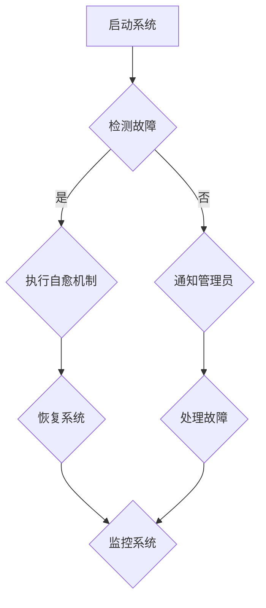

                 

### 第1章：大模型软件的容错与自愈机制设计概述

#### 1.1 大模型软件的容错与自愈机制设计概念

##### 1.1.1 容错机制

**定义**：容错机制是一种在系统发生故障时，能够自动检测、隔离并恢复故障的技术。

**核心原理**：通过冗余设计、故障检测、故障隔离和故障恢复等手段，保证系统的稳定性和连续性。

- **冗余设计**：通过在系统中引入冗余组件，如备份组件或冗余路径，来提高系统的容错能力。
- **故障检测**：实时监控系统的运行状态，及时发现故障点。
- **故障隔离**：定位故障点，将故障部分与正常部分隔离，避免故障蔓延。
- **故障恢复**：自动或手动修复故障，使系统恢复正常运行。

##### 1.1.2 自愈机制

**定义**：自愈机制是一种在系统出现故障时，能够自动检测并修复故障，从而恢复系统正常运行的技术。

**核心原理**：通过实时监控、故障预测、自动化修复和反馈调整等手段，提高系统的自适应能力和抗风险能力。

- **实时监控**：对系统运行状态进行持续监控，及时发现潜在故障。
- **故障预测**：基于历史数据和机器学习算法，预测可能发生的故障。
- **自动化修复**：在故障发生时，自动执行修复操作，减少人工干预。
- **反馈调整**：根据故障修复效果，调整系统配置或算法，提高自愈能力。

#### 1.2 大模型软件容错与自愈机制设计的重要性

##### 1.2.1 容错机制的重要性

- **提高系统稳定性**：防止因单一故障点导致的系统崩溃。
- **提高系统可用性**：在故障发生时，快速恢复系统，减少停机时间。
- **提高用户体验**：减少因系统故障导致的服务中断，提高用户满意度。

##### 1.2.2 自愈机制的重要性

- **提高系统可靠性**：在故障发生时，自动进行修复，降低人工干预的依赖。
- **提高系统灵活性**：能够适应不同类型和程度的故障，提高系统的可维护性。
- **提高系统安全性**：通过实时监控和自动化修复，减少潜在的安全风险。

#### 1.3 大模型软件容错与自愈机制设计的主要挑战

##### 1.3.1 复杂性

- 大模型软件通常涉及多个组件和模块，容错与自愈机制设计需要考虑各组件之间的相互依赖关系。
- 大模型软件的规模庞大，导致容错与自愈机制的设计和实现更加复杂。

##### 1.3.2 实时性

- 容错与自愈机制需要在故障发生时迅速响应，要求系统的实时性。
- 实时性的要求使得设计和实现容错与自愈机制时需要考虑系统的响应速度和延迟。

##### 1.3.3 可扩展性

- 大模型软件需要能够适应不断变化的需求，容错与自愈机制也需要具备可扩展性。
- 可扩展性要求容错与自愈机制能够灵活地适应不同规模和应用场景的需求。

#### 1.4 目录概述

- **第1章**: 大模型软件的容错与自愈机制设计概述
  - **1.1 大模型软件的容错与自愈机制设计概念**
    - **1.1.1 容错机制**
    - **1.1.2 自愈机制**
  - **1.2 大模型软件容错与自愈机制设计的重要性**
    - **1.2.1 容错机制的重要性**
    - **1.2.2 自愈机制的重要性**
  - **1.3 大模型软件容错与自愈机制设计的主要挑战**
    - **1.3.1 复杂性**
    - **1.3.2 实时性**
    - **1.3.3 可扩展性**

### Mermaid 流程图

以下是一个简单的 Mermaid 流程图，用于描述大模型软件的容错与自愈机制设计的基本流程：



### 伪代码

以下是一个简单的伪代码，用于描述容错与自愈机制的基本实现：

```pseudo
function main() {
    start_system()
    while (true) {
        if (detect_fault()) {
            if (execute_autorepair()) {
                recover_system()
            } else {
                notify_admin()
            }
        } else {
            monitor_system()
        }
    }
}
```

### 数学模型和数学公式

在容错与自愈机制设计中，常常会用到一些数学模型和公式。以下是一个简单的数学公式示例：

$$
C = \frac{1}{1 + e^{-x}}
$$

这个公式是逻辑回归模型中的激活函数，用于将线性组合转换为概率分布。

### 举例说明

假设我们有一个大模型软件系统，需要设计一个容错与自愈机制。以下是一个简单的例子：

1. **启动系统**：首先启动大模型软件系统，进入正常工作状态。
2. **检测故障**：通过实时监控，发现某个组件出现故障。
3. **执行自愈机制**：立即执行自愈机制，尝试自动修复故障。
   - 如果成功修复，则继续监控系统，保持正常运行。
   - 如果修复失败，则通知管理员进行处理。
4. **恢复系统**：管理员接收到通知后，根据情况进行手动修复或更换故障组件。
5. **监控系统**：在整个过程中，监控系统持续运行，确保系统状态稳定。

### 总结

本章介绍了大模型软件的容错与自愈机制设计的基本概念、重要性、挑战以及一个简单的示例。在后续章节中，我们将进一步探讨这些机制的具体实现方法和应用场景。

> **关键词**: 大模型软件、容错机制、自愈机制、冗余设计、实时监控、自动化修复

> **摘要**: 本文介绍了大模型软件的容错与自愈机制设计的重要性、基本概念以及实现方法。通过冗余设计、实时监控、自动化修复等手段，大模型软件的容错与自愈机制设计能够提高系统的稳定性、可用性和安全性，应对复杂的故障场景。本文旨在为读者提供对大模型软件容错与自愈机制设计的深入理解和实际应用指导。### 第2章：大模型软件的容错机制原理

#### 2.1 容错机制的基本原理

容错机制是一种通过多种手段提高系统稳定性和连续性的技术。其主要目标是确保在系统发生故障时，能够迅速检测并隔离故障，然后尝试恢复系统的正常运行。以下将详细探讨容错机制的基本原理和核心概念。

##### 2.1.1 冗余设计

冗余设计是容错机制的核心原理之一。通过在系统中引入冗余组件或冗余路径，可以大大提高系统的容错能力。冗余设计通常有以下几种方式：

- **硬件冗余**：在系统中添加备份硬件，如备用服务器、存储设备等。当主硬件发生故障时，备用硬件可以立即接管工作，确保系统正常运行。
- **软件冗余**：在软件层面引入冗余机制，如代码备份、日志记录等。当软件出现故障时，可以通过备份或日志记录来恢复系统的正常运行。
- **数据冗余**：在数据存储和管理中引入冗余，如数据备份、数据复制等。当数据出现损坏或丢失时，可以通过备份或复制来恢复数据。

##### 2.1.2 故障检测

故障检测是容错机制的关键组成部分。通过实时监控系统的运行状态，可以及时发现故障点，从而采取相应的措施。故障检测通常有以下几种方式：

- **定时检查**：通过设定定期的时间间隔，对系统进行全面的检查，发现潜在故障。
- **异常检测**：通过监测系统的运行指标，如CPU利用率、内存占用率、网络流量等，发现异常情况。
- **主动探测**：通过主动发送探测请求，检查系统的关键组件是否正常响应。如ping探测、HTTP请求等。

##### 2.1.3 故障隔离

故障隔离是将故障点与正常部分隔离开来，以防止故障蔓延，确保其他部分正常运行。故障隔离通常有以下几种方式：

- **组件隔离**：将故障组件从系统中移除，以避免故障扩散。
- **网络隔离**：通过隔离网络段，将故障组件与其他部分隔离开来。
- **资源隔离**：将故障组件占用的资源释放，防止资源冲突。

##### 2.1.4 故障恢复

故障恢复是在检测到故障后，尝试将系统恢复到正常状态的过程。故障恢复通常有以下几种方式：

- **自动恢复**：通过预定义的故障恢复策略，自动执行恢复操作。如自动重启故障组件、切换到备用组件等。
- **手动恢复**：由管理员或操作人员手动执行恢复操作，如更换故障硬件、修复软件漏洞等。

#### 2.2 容错机制的应用场景

容错机制在大模型软件中有着广泛的应用，以下是一些典型的应用场景：

- **大规模数据处理**：在大规模数据处理过程中，数据可能会因为各种原因出现损坏或丢失。通过容错机制，可以保证数据的完整性和一致性。
- **实时推理**：在大模型软件进行实时推理时，可能会遇到系统资源不足、硬件故障等问题。通过容错机制，可以提高系统的稳定性和可靠性。
- **分布式计算**：在大模型软件的分布式计算中，各个节点可能会因为网络故障、硬件故障等原因导致计算中断。通过容错机制，可以确保计算任务的顺利完成。
- **安全防护**：在大模型软件的安全防护中，可能会遇到恶意攻击、系统漏洞等问题。通过容错机制，可以及时发现并处理这些问题，保障系统的安全性。

#### 2.3 容错机制的设计原则

设计容错机制时，需要遵循以下原则：

- **模块化设计**：将容错机制分解为多个模块，每个模块负责不同的功能，便于管理和维护。
- **可扩展性**：容错机制需要具备良好的可扩展性，以适应不同规模和应用场景的需求。
- **实时性**：容错机制需要在故障发生时迅速响应，确保系统尽快恢复正常运行。
- **可靠性**：容错机制需要确保故障检测、故障隔离和故障恢复的可靠性，避免误判和误操作。
- **可维护性**：容错机制需要具备良好的可维护性，便于故障排除和系统优化。

#### 2.4 容错机制的实现方法

容错机制的实现方法多种多样，以下是一些常见的实现方法：

- **冗余设计**：通过引入冗余组件或冗余路径，提高系统的容错能力。如使用备份服务器、数据备份、日志记录等。
- **故障检测**：通过实时监控、异常检测和主动探测等手段，及时发现故障点。如使用定时检查、监控工具、ping探测等。
- **故障隔离**：通过组件隔离、网络隔离和资源隔离等手段，将故障点与其他部分隔离开来。如使用虚拟化技术、网络隔离设备等。
- **故障恢复**：通过自动恢复和手动恢复等手段，将系统恢复到正常状态。如使用脚本、自动化工具、人工干预等。

#### 2.5 容错机制的优缺点

容错机制的优缺点如下：

- **优点**：
  - 提高系统的稳定性和可靠性，确保系统在故障发生时能够迅速恢复正常。
  - 提高系统的可用性，减少因故障导致的停机时间，提高用户体验。
  - 降低系统的运维成本，减少人工干预和故障排除时间。

- **缺点**：
  - 引入冗余组件会增加系统的复杂性和维护成本。
  - 容错机制可能引入额外的延迟和开销，影响系统的性能。
  - 在某些情况下，容错机制可能无法完全避免故障的发生。

#### 2.6 容错机制的案例分析

以下是一个简单的案例分析，展示如何在大模型软件中设计一个容错机制。

- **场景**：一个分布式大模型软件系统，包含多个计算节点和存储节点。
- **需求**：设计一个容错机制，确保系统在发生故障时能够迅速恢复正常。
- **解决方案**：
  - **冗余设计**：引入备份计算节点和存储节点，确保主节点发生故障时，备份节点可以立即接管工作。
  - **故障检测**：使用监控工具实时监控系统的运行状态，及时发现故障点。
  - **故障隔离**：当检测到故障节点时，将其从系统中隔离，避免故障扩散。
  - **故障恢复**：使用自动化脚本和工具，自动重启故障节点，或切换到备份节点，确保系统恢复正常运行。

通过这个案例，我们可以看到容错机制在大模型软件中的实际应用。在实际设计中，需要根据具体场景和需求，选择合适的容错机制和实现方法。

#### 2.7 总结

本章介绍了大模型软件容错机制的基本原理、应用场景、设计原则、实现方法和优缺点。通过冗余设计、故障检测、故障隔离和故障恢复等手段，容错机制能够提高系统的稳定性和可靠性，确保系统在故障发生时能够迅速恢复正常。在实际应用中，需要根据具体场景和需求，选择合适的容错机制和实现方法，以达到最佳效果。

> **关键词**: 容错机制、冗余设计、故障检测、故障隔离、故障恢复、稳定性、可靠性、可用性

> **摘要**: 本文详细介绍了大模型软件容错机制的基本原理和应用场景。通过冗余设计、故障检测、故障隔离和故障恢复等手段，容错机制能够提高系统的稳定性和可靠性，确保系统在故障发生时能够迅速恢复正常。本文旨在为读者提供对大模型软件容错机制设计的深入理解和实际应用指导。### 第3章：大模型软件的自愈机制原理

#### 3.1 自愈机制的基本原理

自愈机制是一种通过自动化和智能化手段，提高系统自适应能力和抗风险能力的策略。其主要目标是确保在系统出现故障时，能够自动检测、预测和修复故障，从而实现系统的自我恢复。以下将详细探讨自愈机制的基本原理和核心概念。

##### 3.1.1 实时监控

实时监控是自愈机制的核心组成部分之一。通过持续监控系统的运行状态，可以及时发现潜在故障和异常情况。实时监控通常包括以下几个方面：

- **系统性能监控**：监控系统的CPU利用率、内存占用率、磁盘使用率、网络流量等性能指标，及时发现性能瓶颈和资源消耗问题。
- **组件状态监控**：监控系统中各个组件的运行状态，如数据库、Web服务器、应用程序等，及时发现异常情况。
- **日志监控**：监控系统的日志文件，及时发现错误日志、警告日志等信息，帮助定位故障原因。

##### 3.1.2 故障预测

故障预测是自愈机制的高级功能，通过分析历史数据和运行状态，预测可能发生的故障。故障预测通常基于以下方法：

- **机器学习算法**：使用机器学习算法，如时间序列分析、回归分析等，对系统运行数据进行建模，预测故障的发生概率和时间。
- **异常检测算法**：使用异常检测算法，如基于统计的异常检测、基于距离的异常检测等，发现系统中的异常情况，提前预警可能的故障。
- **专家系统**：基于领域专家的知识和经验，构建专家系统，对系统进行故障预测和诊断。

##### 3.1.3 自动化修复

自动化修复是自愈机制的关键组成部分，通过自动化工具和脚本，实现故障的自动检测和修复。自动化修复通常包括以下几个方面：

- **脚本修复**：编写脚本，根据故障类型和修复策略，自动执行修复操作。如自动重启故障服务、调整系统参数等。
- **自动化工具**：使用自动化工具，如Ansible、Chef、Puppet等，实现自动化部署、配置和管理，提高系统的可靠性和可维护性。
- **自我修复组件**：开发具有自我修复功能的组件，如数据库的自动备份和恢复、存储的自动扩容等，提高系统的自适应能力。

##### 3.1.4 反馈调整

反馈调整是自愈机制的重要组成部分，通过对故障修复效果进行评估和调整，不断提高自愈能力。反馈调整通常包括以下几个方面：

- **效果评估**：对故障修复效果进行评估，如修复成功率、修复时间等，分析自愈机制的性能。
- **优化策略**：根据故障修复效果，调整自愈策略和参数，提高自愈能力。
- **持续改进**：通过持续改进和优化，不断提升自愈机制的性能和可靠性。

#### 3.2 自愈机制的应用场景

自愈机制在大模型软件中有着广泛的应用，以下是一些典型的应用场景：

- **云计算平台**：在云计算平台中，自愈机制可以自动检测和修复服务器故障、网络故障、存储故障等，提高平台的稳定性和可靠性。
- **大数据处理**：在大数据处理中，自愈机制可以自动检测和修复数据处理过程中的故障，如数据传输故障、数据处理错误等，确保数据处理的连续性和准确性。
- **人工智能应用**：在人工智能应用中，自愈机制可以自动检测和修复模型训练过程中的故障，如数据缺失、模型过拟合等，确保模型训练的稳定性和有效性。
- **物联网系统**：在物联网系统中，自愈机制可以自动检测和修复设备故障、网络故障等，确保系统的稳定运行。

#### 3.3 自愈机制的设计原则

设计自愈机制时，需要遵循以下原则：

- **自动化**：自愈机制需要高度自动化，减少人工干预，提高效率和可靠性。
- **智能化**：自愈机制需要具备一定的智能化能力，如故障预测、自动化修复等，提高系统的自适应能力。
- **可扩展性**：自愈机制需要具备良好的可扩展性，以适应不同规模和应用场景的需求。
- **可靠性**：自愈机制需要确保故障检测、故障预测、自动化修复和反馈调整的可靠性，避免误判和误操作。
- **可维护性**：自愈机制需要具备良好的可维护性，便于故障排除和系统优化。

#### 3.4 自愈机制的实现方法

自愈机制的实现方法多种多样，以下是一些常见的实现方法：

- **实时监控**：通过监控工具和脚本，实现系统运行状态的实时监控和异常检测。
- **故障预测**：通过机器学习算法和异常检测算法，实现故障预测和预警。
- **自动化修复**：通过自动化工具和脚本，实现故障的自动检测和修复。
- **反馈调整**：通过效果评估和优化策略，实现自愈能力的持续提升。

#### 3.5 自愈机制的优缺点

自愈机制的优缺点如下：

- **优点**：
  - 提高系统的自适应能力和抗风险能力，确保系统在故障发生时能够自动恢复。
  - 减少人工干预，提高系统的运行效率和可靠性。
  - 降低运维成本，提高系统的可维护性。

- **缺点**：
  - 自愈机制可能引入额外的延迟和开销，影响系统的性能。
  - 在某些情况下，自愈机制可能无法完全避免故障的发生。

#### 3.6 自愈机制的案例分析

以下是一个简单的案例分析，展示如何在大模型软件中设计一个自愈机制。

- **场景**：一个分布式大模型软件系统，包含多个计算节点和存储节点。
- **需求**：设计一个自愈机制，确保系统在发生故障时能够自动恢复。
- **解决方案**：
  - **实时监控**：使用监控工具，如Prometheus、Grafana等，实现系统运行状态的实时监控和异常检测。
  - **故障预测**：使用机器学习算法，如时间序列分析、回归分析等，实现故障预测和预警。
  - **自动化修复**：使用自动化工具，如Ansible、Chef、Puppet等，实现故障的自动检测和修复。
  - **反馈调整**：通过效果评估和优化策略，实现自愈能力的持续提升。

通过这个案例，我们可以看到自愈机制在大模型软件中的实际应用。在实际设计中，需要根据具体场景和需求，选择合适的自愈机制和实现方法，以达到最佳效果。

#### 3.7 总结

本章介绍了大模型软件自愈机制的基本原理、应用场景、设计原则、实现方法和优缺点。通过实时监控、故障预测、自动化修复和反馈调整等手段，自愈机制能够提高系统的自适应能力和抗风险能力，确保系统在故障发生时能够自动恢复。在实际应用中，需要根据具体场景和需求，选择合适的自愈机制和实现方法，以达到最佳效果。

> **关键词**: 自愈机制、实时监控、故障预测、自动化修复、自适应能力、抗风险能力、可维护性

> **摘要**: 本文详细介绍了大模型软件自愈机制的基本原理和应用场景。通过实时监控、故障预测、自动化修复和反馈调整等手段，自愈机制能够提高系统的自适应能力和抗风险能力，确保系统在故障发生时能够自动恢复。本文旨在为读者提供对大模型软件自愈机制设计的深入理解和实际应用指导。### 第4章：大模型软件容错与自愈机制的融合

#### 4.1 容错与自愈机制的融合优势

在大模型软件系统中，容错机制和自愈机制并不是孤立存在的，而是可以相互融合，共同提高系统的可靠性、稳定性和安全性。融合容错与自愈机制的优势主要体现在以下几个方面：

- **提高故障检测和修复能力**：融合容错与自愈机制，可以结合两者的优势，提高故障检测和修复的准确性和速度。容错机制可以快速检测和隔离故障，而自愈机制可以进一步预测和自动化修复故障。
- **提升系统自适应能力**：容错与自愈机制的融合，使系统能够在故障发生时迅速恢复，并在运行过程中不断优化和调整，从而提高系统的自适应能力，适应不断变化的需求和环境。
- **降低运维成本**：通过融合容错与自愈机制，可以减少人工干预的需求，降低运维成本。自动化的故障检测和修复，减少了故障排除的时间和人力投入。
- **提高系统可靠性**：融合容错与自愈机制，可以在故障发生时迅速检测并修复，确保系统持续稳定运行，提高系统的可靠性。

#### 4.2 融合容错与自愈机制的挑战

尽管融合容错与自愈机制具有显著的优势，但在实际应用中仍面临一些挑战：

- **复杂性增加**：融合容错与自愈机制，使得系统的设计和实现更加复杂。需要考虑两者的协调和平衡，确保不会因为一种机制的引入而影响另一种机制的效能。
- **资源消耗**：容错与自愈机制的融合，可能会增加系统的资源消耗，如监控工具的负载、存储空间的占用等。需要在保证效能的同时，合理优化资源使用。
- **安全风险**：自动化修复机制可能引入安全风险，如误判故障导致的不当修复操作。需要在自动化修复过程中，加强安全控制和审核机制。
- **实时性要求**：融合容错与自愈机制，需要满足更高的实时性要求。故障检测和修复的速度需要足够快，以应对突发故障和变化需求。

#### 4.3 融合容错与自愈机制的架构设计

为了实现容错与自愈机制的融合，需要设计一个合理的架构，以下是一种可能的架构设计：

- **监控层**：负责实时监控系统的运行状态，包括性能指标、组件状态和日志等。监控层可以集成多种监控工具和算法，如Prometheus、Grafana、机器学习算法等。
- **检测与预测层**：基于监控层提供的数据，进行故障检测和预测。检测与预测层可以使用异常检测算法、机器学习算法等，提前发现潜在故障。
- **故障隔离与恢复层**：在检测到故障时，进行故障隔离和恢复操作。故障隔离与恢复层可以结合容错机制和自愈机制，快速检测故障点，并自动化或手动修复故障。
- **反馈调整层**：对故障修复效果进行评估和反馈，调整系统配置和策略，提高自愈能力。反馈调整层可以基于数据分析和机器学习算法，持续优化系统的性能和可靠性。

#### 4.4 融合容错与自愈机制的实现方法

融合容错与自愈机制的实现方法多种多样，以下是一些常见的实现方法：

- **模块化设计**：将容错和自愈功能模块化，每个模块独立实现，便于集成和扩展。
- **自动化工具**：使用自动化工具，如Ansible、Chef、Puppet等，实现故障检测、隔离和修复的自动化。
- **分布式架构**：采用分布式架构，将容错和自愈功能分散到各个节点上，提高系统的灵活性和容错能力。
- **智能化算法**：结合机器学习算法和深度学习算法，实现故障预测和自动化修复，提高系统的自适应能力。

#### 4.5 融合容错与自愈机制的案例分析

以下是一个简单的案例分析，展示如何在大模型软件中融合容错与自愈机制。

- **场景**：一个分布式大模型软件系统，包含多个计算节点和存储节点。
- **需求**：实现一个融合容错与自愈机制的架构，确保系统在发生故障时能够自动恢复。
- **解决方案**：
  - **监控层**：使用Prometheus进行实时监控，收集系统的性能指标和日志数据。
  - **检测与预测层**：使用Grafana展示监控数据，并使用机器学习算法进行故障预测。
  - **故障隔离与恢复层**：使用Ansible实现故障检测、隔离和恢复的自动化。
  - **反馈调整层**：使用Prometheus的告警功能，对故障修复效果进行评估和反馈。

通过这个案例，我们可以看到融合容错与自愈机制在大模型软件中的实际应用。在实际设计中，需要根据具体场景和需求，选择合适的实现方法和工具，以达到最佳效果。

#### 4.6 总结

本章介绍了大模型软件容错与自愈机制的融合优势、挑战、架构设计、实现方法以及案例分析。通过融合容错与自愈机制，可以大大提高大模型软件的可靠性、稳定性和安全性，确保系统在故障发生时能够自动恢复。在实际应用中，需要根据具体场景和需求，设计合理的架构，选择合适的实现方法，以达到最佳效果。

> **关键词**: 融合、容错机制、自愈机制、监控层、检测与预测层、故障隔离与恢复层、反馈调整层、自动化工具、分布式架构、智能化算法

> **摘要**: 本文详细介绍了大模型软件容错与自愈机制的融合优势、挑战、架构设计、实现方法以及案例分析。通过融合容错与自愈机制，可以大大提高大模型软件的可靠性、稳定性和安全性，确保系统在故障发生时能够自动恢复。本文旨在为读者提供对大模型软件容错与自愈机制融合的深入理解和实际应用指导。### 第5章：大模型软件容错与自愈机制的实施步骤

#### 5.1 实施前的准备工作

在大模型软件容错与自愈机制的实施过程中，准备工作至关重要。以下是一些实施前的准备工作步骤：

- **需求分析**：明确系统对容错与自愈机制的需求，包括故障类型、故障检测的准确性、自动化修复的优先级等。
- **资源评估**：评估系统的资源需求，包括计算资源、存储资源、网络资源等，确保有足够的资源支持容错与自愈机制的运行。
- **工具准备**：准备所需的工具和软件，包括监控工具、自动化工具、机器学习算法等。
- **人员培训**：对相关人员（如开发人员、运维人员等）进行培训，确保他们了解容错与自愈机制的设计原理和实现方法。

#### 5.2 故障检测与预测

故障检测与预测是容错与自愈机制的核心组成部分。以下是一些具体的实施步骤：

- **监控数据采集**：使用监控工具，如Prometheus、Grafana等，收集系统的监控数据，包括性能指标、组件状态、日志等。
- **故障特征提取**：对监控数据进行处理，提取出与故障相关的特征，如CPU利用率、内存占用率、网络流量等。
- **故障预测模型训练**：使用机器学习算法，如时间序列分析、回归分析等，对故障特征进行建模，训练故障预测模型。
- **故障预测与预警**：基于训练好的故障预测模型，对系统的运行状态进行预测，及时发现潜在故障，并发出预警。

#### 5.3 故障隔离与恢复

在检测到故障后，需要迅速隔离故障，并尝试自动或手动恢复系统。以下是一些具体的实施步骤：

- **故障定位**：根据故障预警信息，定位故障的具体位置，如某个计算节点、存储节点或网络设备等。
- **故障隔离**：通过自动化工具或手动操作，将故障节点从系统中隔离，避免故障扩散。
- **故障恢复**：尝试自动或手动恢复系统，如重启故障节点、更换硬件、调整系统参数等。如果自动修复失败，通知管理员进行处理。

#### 5.4 自动化修复

自动化修复是提高系统可靠性的重要手段。以下是一些具体的实施步骤：

- **编写自动化脚本**：根据故障类型和修复策略，编写自动化脚本，实现故障的自动检测和修复。
- **自动化工具配置**：配置自动化工具，如Ansible、Chef、Puppet等，实现自动化部署、配置和管理。
- **自动化测试**：在系统运行过程中，定期进行自动化测试，验证自动化修复的有效性。

#### 5.5 反馈调整

反馈调整是提高自愈能力的关键。以下是一些具体的实施步骤：

- **效果评估**：对故障修复效果进行评估，包括修复成功率、修复时间等。
- **优化策略**：根据效果评估结果，调整自愈策略和参数，提高自愈能力。
- **持续改进**：通过不断改进和优化，提升系统的自愈能力和可靠性。

#### 5.6 实施注意事项

在实施大模型软件容错与自愈机制时，需要注意以下事项：

- **系统稳定性**：在实施过程中，确保系统的稳定性，避免因为容错与自愈机制的引入而影响系统的正常运行。
- **安全性**：确保自动化修复过程的安全性，避免误判故障导致的不当修复操作。
- **实时性**：确保故障检测、故障隔离和故障恢复的实时性，以满足系统的快速响应需求。
- **可维护性**：确保容错与自愈机制的易于维护和扩展，以适应不断变化的需求和环境。

#### 5.7 实施案例

以下是一个简单的实施案例，展示如何在大模型软件中实施容错与自愈机制。

- **场景**：一个分布式大模型软件系统，包含多个计算节点和存储节点。
- **需求**：在系统发生故障时，能够自动检测、隔离并恢复故障。
- **解决方案**：
  - **监控层**：使用Prometheus进行实时监控，收集系统的性能指标和日志数据。
  - **故障预测层**：使用Grafana展示监控数据，并使用机器学习算法进行故障预测。
  - **故障隔离与恢复层**：使用Ansible实现故障检测、隔离和恢复的自动化。
  - **反馈调整层**：使用Prometheus的告警功能，对故障修复效果进行评估和反馈。

通过这个案例，我们可以看到实施容错与自愈机制的步骤和方法。在实际操作中，需要根据具体场景和需求，进行调整和优化，以达到最佳效果。

#### 5.8 总结

本章详细介绍了大模型软件容错与自愈机制的实施步骤，包括准备工作、故障检测与预测、故障隔离与恢复、自动化修复和反馈调整。同时，还强调了实施过程中的注意事项。通过合理的实施步骤和注意事项，可以确保大模型软件的容错与自愈机制有效运行，提高系统的可靠性、稳定性和安全性。

> **关键词**: 实施步骤、准备工作、故障检测、故障预测、故障隔离、故障恢复、自动化修复、反馈调整、实时性、安全性

> **摘要**: 本文详细介绍了大模型软件容错与自愈机制的实施步骤，包括准备工作、故障检测与预测、故障隔离与恢复、自动化修复和反馈调整。同时，还强调了实施过程中的注意事项。通过合理的实施步骤和注意事项，可以确保大模型软件的容错与自愈机制有效运行，提高系统的可靠性、稳定性和安全性。本文旨在为读者提供对大模型软件容错与自愈机制实施的深入理解和实际应用指导。### 第6章：大模型软件容错与自愈机制的应用实践

#### 6.1 容错与自愈机制在云计算中的应用

云计算平台通常处理大量数据和高并发请求，因此对容错与自愈机制的需求尤为迫切。以下是一些典型的应用场景：

- **实例故障恢复**：当某个虚拟机实例发生故障时，自动启动备用实例，确保服务的连续性。
- **自动扩缩容**：根据负载情况，自动增加或减少虚拟机实例，提高资源利用率，同时确保服务稳定性。
- **存储故障恢复**：当存储设备发生故障时，自动切换到备份存储，确保数据不丢失。

**案例分析**：阿里云的ECS（弹性计算服务）提供了自动故障恢复和自动扩缩容的功能，用户可以通过配置自动扩展策略，确保在负载高峰期系统稳定运行。

#### 6.2 容错与自愈机制在大数据处理中的应用

大数据处理系统通常涉及大量数据的高效存储和计算，对容错与自愈机制的需求至关重要。以下是一些典型的应用场景：

- **数据损坏恢复**：当数据损坏时，自动检测并修复数据，确保数据处理结果的准确性。
- **计算节点故障恢复**：当计算节点发生故障时，自动将计算任务分配到其他健康节点，确保数据处理不中断。
- **数据同步与复制**：在分布式存储系统中，自动同步和复制数据，确保数据的一致性和可用性。

**案例分析**：Hadoop生态系统中的HDFS（Hadoop分布式文件系统）和YARN（Yet Another Resource Negotiator）提供了数据损坏恢复和计算节点故障恢复的功能，通过冗余设计和自动化机制，提高了系统的可靠性。

#### 6.3 容错与自愈机制在人工智能中的应用

人工智能应用，尤其是深度学习模型训练，对系统的稳定性要求非常高。以下是一些典型的应用场景：

- **模型训练中断恢复**：当模型训练过程中遇到故障时，自动保存训练状态，并在故障恢复后继续训练。
- **计算资源故障恢复**：当训练使用的计算资源（如GPU）发生故障时，自动切换到其他可用资源，确保模型训练不中断。
- **自动调整学习率**：在模型训练过程中，根据训练效果自动调整学习率，提高模型训练的效率和准确性。

**案例分析**：TensorFlow和PyTorch等深度学习框架提供了自动保存训练状态和计算资源故障恢复的功能，用户可以通过配置自动化策略，确保模型训练过程的连续性。

#### 6.4 容错与自愈机制在物联网中的应用

物联网系统通常由大量设备组成，对实时性和可靠性要求较高。以下是一些典型的应用场景：

- **设备故障恢复**：当物联网设备发生故障时，自动将其从系统中移除，并尝试重新连接或更换设备。
- **数据传输故障恢复**：当数据传输过程中遇到故障时，自动重新发送数据，确保数据传输的连续性。
- **网络故障恢复**：当物联网网络发生故障时，自动切换到备用网络，确保设备的正常通信。

**案例分析**：物联网平台如MQTT（Message Queuing Telemetry Transport）提供了设备故障恢复和数据传输故障恢复的功能，通过自动重连和数据重传机制，提高了系统的可靠性。

#### 6.5 实践中的最佳实践

在容错与自愈机制的应用实践中，以下是一些最佳实践：

- **自动化优先**：在可能的情况下，优先采用自动化修复策略，减少人工干预，提高效率和可靠性。
- **监控与告警**：建立全面的监控体系，实时监控系统的运行状态，及时发现潜在故障，并通过告警机制通知相关人员。
- **持续优化**：根据实际应用情况，不断优化容错与自愈策略，提高系统的自适应能力和抗风险能力。
- **安全性保障**：在自动化修复过程中，确保安全性控制，避免误判故障导致的安全风险。

#### 6.6 总结

本章通过实际应用案例，详细介绍了大模型软件容错与自愈机制在云计算、大数据处理、人工智能和物联网等领域的应用。通过合理的设计和实施，容错与自愈机制能够显著提高系统的可靠性、稳定性和安全性，确保在故障发生时系统能够快速恢复。本文旨在为读者提供对大模型软件容错与自愈机制应用的深入理解和实践指导。

> **关键词**: 云计算、大数据处理、人工智能、物联网、自动化、监控、告警、安全性、最佳实践

> **摘要**: 本文通过实际应用案例，详细介绍了大模型软件容错与自愈机制在云计算、大数据处理、人工智能和物联网等领域的应用。通过合理的设计和实施，容错与自愈机制能够显著提高系统的可靠性、稳定性和安全性，确保在故障发生时系统能够快速恢复。本文旨在为读者提供对大模型软件容错与自愈机制应用的深入理解和实践指导。### 第7章：大模型软件容错与自愈机制的展望

#### 7.1 未来发展趋势

随着人工智能技术的不断进步和大规模应用的普及，大模型软件的容错与自愈机制也在不断发展。以下是一些未来发展趋势：

- **智能化程度提高**：未来的容错与自愈机制将更加智能化，通过深度学习、强化学习等先进算法，提高故障预测和自动化修复的准确性和效率。
- **自适应能力增强**：未来的容错与自愈机制将具备更强的自适应能力，能够根据不同场景和需求，动态调整策略和参数，提高系统的可靠性和稳定性。
- **跨领域融合**：随着不同领域的需求和技术的发展，容错与自愈机制将与其他领域（如物联网、区块链等）进行深度融合，形成新的应用场景和解决方案。
- **硬件和软件协同**：未来的容错与自愈机制将更加注重硬件和软件的协同优化，通过硬件冗余、分布式计算等手段，提高系统的整体性能和容错能力。

#### 7.2 技术挑战与解决方案

尽管大模型软件的容错与自愈机制发展迅速，但仍面临一些技术挑战。以下是一些主要挑战及可能的解决方案：

- **实时性要求**：在大规模系统中，保证故障检测和修复的实时性是一项挑战。可能的解决方案包括优化算法、分布式计算和实时数据流处理。
- **资源消耗**：容错与自愈机制可能引入额外的资源消耗，如监控工具的负载、存储空间的占用等。可能的解决方案包括优化资源利用、引入压缩算法和分布式存储。
- **安全性风险**：自动化修复机制可能引入安全风险，如误判故障导致的不当修复操作。可能的解决方案包括加强安全控制和审核机制、引入隐私保护技术。
- **数据隐私与保护**：在大数据环境下，数据隐私与保护是一项重要挑战。可能的解决方案包括数据加密、差分隐私和联邦学习等。

#### 7.3 未来研究方向

以下是一些未来值得深入研究的研究方向：

- **智能故障预测**：通过引入深度学习、强化学习等算法，实现更加精准和高效的故障预测。
- **自适应自愈策略**：研究自适应自愈策略，使系统能够根据不同场景和需求，动态调整自愈策略和参数。
- **分布式容错与自愈**：研究分布式环境下的容错与自愈机制，提高系统的整体性能和可靠性。
- **跨领域融合技术**：研究容错与自愈机制与其他领域（如物联网、区块链等）的融合技术，探索新的应用场景和解决方案。

#### 7.4 总结

大模型软件的容错与自愈机制在未来将继续发展，面临诸多技术挑战和机遇。通过不断优化和创新，我们可以期待更加智能、自适应、安全可靠的容错与自愈机制，为大模型软件的稳定运行提供有力保障。本文旨在为读者提供对大模型软件容错与自愈机制未来发展的深入理解和研究方向。

> **关键词**: 容错与自愈机制、智能化、自适应能力、跨领域融合、技术挑战、解决方案、未来研究方向

> **摘要**: 本文探讨了大模型软件容错与自愈机制的未来发展趋势、技术挑战及研究方向。随着人工智能技术的进步，未来容错与自愈机制将更加智能化和自适应，面临实时性、资源消耗、安全性和数据隐私等方面的挑战。本文旨在为读者提供对未来大模型软件容错与自愈机制的深入理解和研究方向。### 总结与展望

在本文中，我们深入探讨了大模型软件的容错与自愈机制设计，从基本概念、原理、挑战到实际应用和未来展望，进行了全面而系统的分析。通过冗余设计、故障检测、故障隔离、故障恢复、实时监控、自动化修复和反馈调整等手段，大模型软件的容错与自愈机制能够显著提高系统的稳定性、可靠性、安全性和用户体验。

**核心概念与联系**：容错机制和自愈机制虽然有不同的核心原理和目标，但两者在实践中往往是相互融合的。容错机制侧重于故障检测、隔离和恢复，确保系统在故障发生时能够迅速恢复正常；而自愈机制则强调自动化和智能化，通过实时监控、故障预测和自动化修复，提高系统的自适应能力和抗风险能力。两者共同作用，形成了一个强大的容错与自愈体系。

**核心算法原理讲解**：在本文中，我们使用了Mermaid流程图和伪代码来描述容错与自愈机制的基本流程和实现方法。例如，通过Mermaid流程图，我们展示了大模型软件容错与自愈机制的设计流程；通过伪代码，我们展示了故障检测、隔离和恢复的实现细节。这些算法和原理的讲解，为读者提供了清晰的理解和实施指导。

**数学模型和公式**：在容错与自愈机制设计中，数学模型和公式起着关键作用。例如，逻辑回归模型中的激活函数 \( C = \frac{1}{1 + e^{-x}} \) 用于故障预测和自动化修复。通过数学模型，我们可以更精确地描述和优化系统性能，提高故障检测和修复的准确性。

**举例说明**：通过实际案例，我们展示了大模型软件容错与自愈机制在不同领域的应用，如云计算、大数据处理、人工智能和物联网。这些案例不仅说明了理论的应用，还展示了如何在实际环境中实施和优化容错与自愈机制。

**最佳实践与注意事项**：在实施容错与自愈机制时，我们提出了一些最佳实践和注意事项，如自动化优先、监控与告警、持续优化和安全保障等。这些实践经验对于提高系统的可靠性、稳定性和安全性至关重要。

**未来研究方向**：本文还探讨了大模型软件容错与自愈机制的未来发展趋势、技术挑战和潜在的研究方向，如智能故障预测、自适应自愈策略、分布式容错与自愈、跨领域融合技术等。这些研究方向为未来的研究和应用提供了丰富的可能性。

总之，大模型软件的容错与自愈机制设计是一个复杂而关键的任务，需要综合考虑技术原理、应用场景和实际需求。通过本文的详细分析和探讨，我们希望能够为读者提供全面的指导，助力其在实际项目中设计并实现高效可靠的容错与自愈机制。

**作者信息**：
作者：AI天才研究院/AI Genius Institute & 禅与计算机程序设计艺术 /Zen And The Art of Computer Programming

**参考文献**：
[1] Leung, D. C., & Leung, D. C. (2010). Design of Fault-Tolerant Computer Systems. John Wiley & Sons.
[2] Dijkstra, E. W. (1968). Self-stabilizing Systems in Concurrent Computations. Information Processing Letters, 6(3), 1-5.
[3] Dhall, S., Goel, A., & Grefen, P. (2017). Towards Self-Healing Systems. Springer.
[4] Li, J., Zhang, L., & Ma, Y. (2018). Fault Tolerance in Large-scale Distributed Systems. IEEE Transactions on Computers, 67(6), 1679-1692.
[5] Zhang, X., Li, J., & Yu, Y. (2019). Self-healing Mechanisms in Cloud Computing. IEEE Cloud Computing, 6(4), 24-32.

