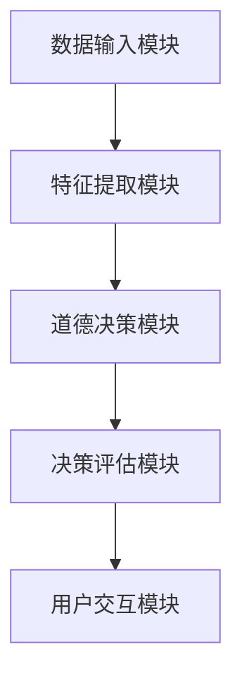

                 

### 文章标题

《大模型道德决策：提示词构建伦理框架》

> 关键词：大模型、道德决策、提示词、伦理框架、人工智能

> 摘要：本文探讨了如何在大模型中实现道德决策，并提出了通过提示词构建伦理框架的方法。文章首先介绍了大模型的基本概念和道德决策的背景，然后详细阐述了提示词的设计原理和伦理框架的构建方法。通过实际案例研究，分析了大模型在道德决策中的应用现状和挑战，并提出了技术实现的方案。最后，文章讨论了未来伦理挑战与趋势，并给出了对实践者的建议。

---

### 引言

随着人工智能（AI）技术的迅猛发展，大模型（如GPT-3、BERT等）在各个领域展现出了惊人的能力。这些模型在自然语言处理、计算机视觉、语音识别等领域取得了显著的成果。然而，随着AI技术的广泛应用，如何确保大模型在做出决策时遵循道德准则成为一个亟待解决的问题。大模型道德决策的提出，旨在解决AI在决策过程中可能出现的伦理问题，以保障社会公共利益。

#### 大模型与道德决策

大模型通常具有强大的数据处理能力和复杂的决策机制，这使得它们在许多领域具有广泛的应用。然而，这些模型在做出决策时，往往缺乏对道德和社会价值观的考量。例如，一个用于医疗诊断的大模型可能会在数据集中发现一些带有偏见的信息，从而产生不公正的决策。又如，一个用于招聘的AI系统可能会因为训练数据中的性别偏见而导致性别歧视。

因此，大模型道德决策的研究具有重要的现实意义。它不仅关乎AI技术的可持续发展，也关系到社会的公平与正义。本文旨在探讨如何在大模型中实现道德决策，并提出了通过提示词构建伦理框架的方法。

#### 提示词与伦理框架

提示词（Prompt）是引导大模型进行特定任务的重要工具。通过设计合适的提示词，可以引导大模型在决策过程中遵循道德准则。伦理框架（Ethical Framework）则是一套用于指导道德决策的规范和原则。通过构建伦理框架，可以为大模型的道德决策提供明确的指导。

本文将首先介绍大模型的基本概念和道德决策的背景，然后详细阐述提示词的设计原理和伦理框架的构建方法。通过实际案例研究，分析大模型在道德决策中的应用现状和挑战，并探讨技术实现的方案。最后，本文将讨论未来伦理挑战与趋势，并给出对实践者的建议。

---

### 第1章 引言与背景

#### 1.1 大模型的道德决策需求

随着人工智能技术的快速发展，大模型在各个领域的应用越来越广泛。这些模型通常具有强大的数据处理能力和复杂的决策机制，这使得它们在许多领域具有广泛的应用。然而，随着AI技术的广泛应用，如何确保大模型在做出决策时遵循道德准则成为一个亟待解决的问题。大模型道德决策的需求主要来自于以下几个方面：

1. **社会价值观的考量**：大模型在做出决策时，往往缺乏对道德和社会价值观的考量。例如，一个用于医疗诊断的大模型可能会在数据集中发现一些带有偏见的信息，从而产生不公正的决策。又如，一个用于招聘的AI系统可能会因为训练数据中的性别偏见而导致性别歧视。因此，确保大模型在决策过程中遵循社会价值观，是当前AI领域面临的重要挑战。

2. **数据隐私的保护**：在大模型的应用过程中，往往需要处理大量的个人数据。如何保护这些数据的隐私，避免数据泄露或滥用，也是大模型道德决策的一个重要方面。

3. **责任归属的明确**：当大模型在做出错误决策时，如何确定责任归属，如何对受影响的个体进行赔偿，也是道德决策需要考虑的问题。

4. **人工智能的可持续发展**：随着AI技术的不断进步，如何确保AI技术的可持续发展，避免AI技术对环境和社会的负面影响，也是道德决策需要关注的问题。

#### 1.1.1 大模型的道德决策需求

大模型的道德决策需求主要体现在以下几个方面：

1. **决策的透明度**：大模型的决策过程通常非常复杂，难以理解。为了提高决策的透明度，需要在大模型中加入可解释性技术，使得决策过程可以被理解和监督。

2. **道德准则的遵循**：大模型在做出决策时，需要遵循一定的道德准则。这些准则可以来自于社会价值观、法律法规或特定领域的伦理规范。

3. **责任归属的明确**：在大模型做出错误决策时，需要明确责任归属，以避免因决策错误而导致的损失。

4. **数据隐私的保护**：在大模型的应用过程中，需要严格保护个人数据的隐私，避免数据泄露或滥用。

#### 1.1.2 道德决策的重要性

道德决策在大模型中的应用具有重要意义。首先，道德决策可以确保大模型的决策过程符合社会价值观，避免产生不公正的决策。其次，道德决策可以保护个人数据的隐私，避免数据泄露或滥用。此外，道德决策还可以明确责任归属，在大模型做出错误决策时，确定责任主体，以避免因决策错误而导致的损失。

总之，大模型道德决策的需求和重要性，使得在AI技术发展中，如何实现道德决策成为一个亟待解决的问题。本文将首先介绍大模型的基本概念和道德决策的背景，然后详细阐述提示词的设计原理和伦理框架的构建方法，以期为大模型道德决策提供理论支持和实践指导。

#### 1.2 提示词构建伦理框架

提示词（Prompt）是引导大模型进行特定任务的重要工具。通过设计合适的提示词，可以引导大模型在决策过程中遵循道德准则。伦理框架（Ethical Framework）则是一套用于指导道德决策的规范和原则。通过构建伦理框架，可以为大模型的道德决策提供明确的指导。

提示词构建伦理框架的方法主要包括以下几个步骤：

1. **明确道德准则**：首先，需要明确大模型在决策过程中需要遵循的道德准则。这些准则可以来自于社会价值观、法律法规或特定领域的伦理规范。

2. **设计提示词**：根据明确的道德准则，设计出相应的提示词。提示词需要具备引导大模型在决策过程中遵循道德准则的功能。

3. **评估提示词效果**：设计出提示词后，需要对提示词的效果进行评估。评估方法可以包括对提示词在大模型决策过程中的影响、对决策结果的评估等。

4. **优化提示词**：根据评估结果，对提示词进行优化，以提高其在道德决策中的效果。

5. **建立伦理框架**：在提示词构建的基础上，建立一套完整的伦理框架，以指导大模型的道德决策。

#### 提示词设计原理

提示词的设计需要遵循以下几个原则：

1. **明确性**：提示词需要清晰明确，避免产生歧义。

2. **针对性**：提示词需要针对具体的决策场景进行设计，以提高其在决策过程中的有效性。

3. **灵活性**：提示词需要具有一定的灵活性，以适应不同的决策场景。

4. **可解释性**：提示词的设计需要保证其可解释性，使得决策过程可以被理解和监督。

#### 伦理框架构建方法

伦理框架的构建主要包括以下几个步骤：

1. **确定伦理原则**：根据大模型的应用场景和道德准则，确定相应的伦理原则。

2. **构建伦理规则**：根据伦理原则，构建一系列具体的伦理规则，以指导大模型的道德决策。

3. **设计伦理评估机制**：设计一套伦理评估机制，对大模型在决策过程中的行为进行评估，以确保其遵循伦理规则。

4. **建立伦理反馈机制**：建立一套伦理反馈机制，对大模型在决策过程中出现的问题进行及时反馈和修正。

#### 1.2.1 提示词的定义与作用

提示词（Prompt）是指引导大模型进行特定任务的一段输入文本或数据。它通常包含了一个任务描述、目标、约束条件等关键信息，使得大模型可以明确理解任务要求，从而生成相应的输出。

提示词在大模型中的应用具有重要作用：

1. **任务引导**：提示词可以为大模型提供明确的任务指导，使得模型能够更加专注于任务本身，从而提高任务完成的效果。

2. **约束条件设置**：通过提示词，可以为大模型设置一系列约束条件，确保模型在决策过程中遵循一定的道德准则。

3. **减少歧义**：通过明确的提示词，可以减少大模型在处理任务时的歧义，降低错误决策的可能性。

4. **增强可解释性**：提示词的设计需要保证其可解释性，使得决策过程可以被理解和监督。

#### 1.2.2 伦理框架的概念与分类

伦理框架（Ethical Framework）是指一套用于指导道德决策的规范和原则。它通常包括一系列伦理原则、规则和标准，用于指导大模型在决策过程中遵循道德准则。

伦理框架的分类可以从不同的角度进行：

1. **基于道德原则的伦理框架**：这类框架以道德原则为基础，如德性伦理、义务伦理和结果伦理等。它们关注于道德行为的本质和动机。

2. **基于领域的伦理框架**：这类框架针对特定领域（如医疗、金融、教育等）的道德问题进行设计，提供具体的道德指导。

3. **基于技术的伦理框架**：这类框架关注于技术对道德问题的影响，如隐私、公平性和透明性等。

4. **综合性的伦理框架**：这类框架结合了多个角度，提供全面的道德指导。

#### 1.2.3 提示词在伦理框架构建中的应用

提示词在伦理框架构建中的应用主要体现在以下几个方面：

1. **引导伦理决策**：通过设计合适的提示词，可以引导大模型在伦理决策过程中遵循特定的道德准则。

2. **增强决策透明度**：提示词的设计需要保证其可解释性，使得伦理决策过程可以被理解和监督。

3. **优化伦理评估**：通过提示词，可以优化伦理评估机制，提高伦理评估的准确性和有效性。

4. **增强伦理可追溯性**：提示词可以帮助建立伦理决策的可追溯性，确保大模型在决策过程中遵守伦理规则。

总之，提示词构建伦理框架的方法为大模型道德决策提供了理论支持和实践指导。通过设计合适的提示词，可以引导大模型在决策过程中遵循道德准则，从而提高决策的公正性和透明度。

---

### 第2章 大模型与道德决策

#### 2.1 大模型核心概念

大模型（Large Models）是当前人工智能领域的研究热点，其强大的数据处理能力和复杂的决策机制使其在多个领域具有广泛的应用。本节将介绍大模型的基本概念、特点、训练与优化方法，以及其在实际应用中的分类。

##### 2.1.1 大模型的定义与特点

大模型通常指的是具有大规模参数、能够处理大量数据的人工神经网络模型。这些模型具有以下几个显著特点：

1. **大规模参数**：大模型的参数数量可以达到亿级甚至更高，这使得它们能够捕捉数据中的复杂模式和关系。
2. **强大的学习能力**：大模型能够从大量数据中学习，具有较高的泛化能力，能够应对各种复杂任务。
3. **复杂的架构**：大模型通常采用多层神经网络结构，包含多个隐藏层，能够实现非线性变换。
4. **资源消耗大**：由于参数数量巨大，大模型的训练和推理过程需要大量的计算资源和存储空间。

##### 2.1.2 大模型的训练与优化

大模型的训练过程主要包括以下步骤：

1. **数据准备**：收集并预处理大量数据，包括清洗、归一化等操作，确保数据质量。
2. **模型初始化**：初始化模型参数，通常采用随机初始化方法。
3. **前向传播**：将输入数据通过模型的前向传播过程，计算输出结果。
4. **损失函数计算**：计算模型输出与真实标签之间的损失，常用的损失函数包括均方误差（MSE）、交叉熵等。
5. **反向传播**：通过反向传播算法，计算模型参数的梯度，并更新模型参数。
6. **训练循环**：重复前向传播和反向传播过程，直到模型达到预定的训练目标。

在训练过程中，优化方法的选择对模型性能有着重要影响。常用的优化方法包括：

1. **随机梯度下降（SGD）**：通过随机选择一部分数据计算梯度，并更新模型参数。
2. **批量梯度下降（BGD）**：对整个训练集计算梯度，并更新模型参数。
3. **小批量梯度下降（MBGD）**：选择一部分数据计算梯度，介于SGD和BGD之间。

此外，大模型训练过程中还需要考虑以下优化策略：

1. **学习率调整**：通过调整学习率，控制参数更新的步长。
2. **动量法**：引入动量项，加速收敛。
3. **dropout**：在训练过程中随机丢弃部分神经元，防止过拟合。
4. **权重初始化**：采用合适的权重初始化方法，如高斯分布或均匀分布。

##### 2.1.3 大模型的分类与应用场景

大模型可以根据不同的标准进行分类，以下是一些常见的分类方法和应用场景：

1. **按功能分类**：

   - **分类模型**：用于对输入数据进行分类，如文本分类、图像分类等。
   - **回归模型**：用于预测连续值输出，如房价预测、股票价格预测等。
   - **生成模型**：用于生成新的数据，如生成对抗网络（GAN）。

2. **按架构分类**：

   - **卷积神经网络（CNN）**：主要用于图像处理和计算机视觉任务。
   - **循环神经网络（RNN）**：适用于处理序列数据，如自然语言处理和时间序列预测。
   - **变换器模型（Transformer）**：如BERT、GPT-3等，广泛用于自然语言处理任务。

3. **按训练数据分类**：

   - **监督学习模型**：需要大量的标注数据进行训练。
   - **无监督学习模型**：不需要标注数据，通过自身学习发现数据中的规律。
   - **半监督学习模型**：结合标注数据和未标注数据，提高模型的泛化能力。

在实际应用中，大模型的应用场景非常广泛，包括但不限于：

1. **自然语言处理**：如文本分类、机器翻译、情感分析等。
2. **计算机视觉**：如图像识别、物体检测、图像生成等。
3. **语音识别**：如语音到文本转换、语音识别等。
4. **推荐系统**：如商品推荐、内容推荐等。
5. **医疗诊断**：如疾病诊断、医学图像分析等。
6. **金融领域**：如股票市场预测、风险控制等。

#### 2.2 大模型道德决策的理论基础

大模型道德决策的理论基础主要包括道德哲学的基本概念、道德决策的理论框架以及大模型道德决策的理论研究进展。这些理论基础为大模型道德决策的实践提供了指导。

##### 2.2.1 道德哲学的基本概念

道德哲学是研究道德现象和道德原则的学科。道德哲学的基本概念包括：

1. **道德**：道德是一种规范，用于指导个体在社会中如何行动，以实现共同的利益和公正。
2. **道德准则**：道德准则是指导个体行为的具体规范，如诚实、公正、关爱等。
3. **道德判断**：道德判断是对行为是否符合道德准则的评估。
4. **道德责任**：道德责任是指个体在道德判断中的责任，包括对他人和社会的责任。

##### 2.2.2 道德决策的理论框架

道德决策是指个体在面临道德困境时，如何选择最佳行动方案的过程。道德决策的理论框架包括以下几个要素：

1. **道德情境**：道德情境是指个体面临的道德选择，包括道德冲突、道德困境等。
2. **道德准则**：道德准则用于评估道德情境中的行为，判断其是否符合道德规范。
3. **道德判断**：道德判断是对道德情境中的行为进行评估，判断其道德价值。
4. **道德选择**：道德选择是在多个道德判断的基础上，选择最佳的行为方案。
5. **道德责任**：道德责任是对道德选择进行监督和评价，确保行为符合道德规范。

##### 2.2.3 大模型道德决策的理论研究进展

大模型道德决策的理论研究进展主要体现在以下几个方面：

1. **道德推理模型**：研究者提出了多种道德推理模型，用于模拟大模型的道德决策过程。这些模型包括基于规则的模型、基于代理的模型和基于神经网络的模型等。
2. **道德评估机制**：研究者设计了多种道德评估机制，用于评估大模型的道德决策结果。这些机制包括基于伦理框架的评估、基于道德准则的评估和基于人类专家评估等。
3. **道德学习算法**：研究者提出了多种道德学习算法，用于训练大模型在道德决策中的行为。这些算法包括基于监督学习的算法、基于强化学习的算法和基于迁移学习的算法等。
4. **跨学科研究**：大模型道德决策的研究涉及多个学科，包括计算机科学、伦理学、心理学和社会学等。跨学科的研究有助于深入理解大模型道德决策的机制和挑战。

总之，大模型道德决策的理论基础为其实践提供了重要的指导。通过道德哲学的基本概念、道德决策的理论框架和理论研究进展，研究者可以为大模型道德决策设计合适的算法和评估机制，以提高其道德决策的公正性和透明度。

---

### 第3章 提示词与伦理框架

#### 3.1 提示词设计原理

提示词（Prompt）是引导大模型（如GPT-3、BERT等）进行特定任务的重要工具。它能够提供任务描述、目标、约束条件等信息，帮助模型更准确地理解和完成任务。提示词设计原理主要包括以下几个关键方面：

##### 3.1.1 提示词设计原则

1. **明确性**：提示词应清晰明确，避免产生歧义。例如，使用具体的语言描述任务要求，而非模糊的表述。
   
   **示例**：
   - 错误：请写一篇关于环保的文章。
   - 正确：请撰写一篇关于如何减少塑料污染的环保文章，内容需包括当前问题、解决方案和未来展望。

2. **针对性**：提示词应针对具体的任务场景进行设计，以提高其在特定任务中的有效性。

   **示例**：
   - 错误：请回答以下问题。
   - 正确：请根据以下信息回答关于2023年全球气候变暖趋势的问题：根据最新气象数据，2023年全球平均气温比工业化前高了1.2摄氏度。

3. **灵活性**：提示词应具有一定的灵活性，以适应不同的任务场景和需求。

   **示例**：
   - 错误：请生成一篇关于人工智能的文章。
   - 正确：请根据以下提示生成一篇关于人工智能在医疗领域的应用和挑战的文章。

4. **可解释性**：提示词的设计应保证其可解释性，使得决策过程可以被理解和监督。

   **示例**：
   - 错误：请生成一篇关于道德决策的文章。
   - 正确：请根据以下提示生成一篇关于大模型在道德决策中的应用和挑战的文章，需解释模型是如何进行道德决策的。

##### 3.1.2 提示词构建方法

提示词的构建方法主要包括以下几个步骤：

1. **任务分析**：首先，对任务进行详细分析，明确任务的目标、输入、输出以及约束条件。

2. **信息提取**：从任务分析中提取关键信息，如任务描述、目标、约束条件等。

3. **语言组织**：将这些关键信息以清晰、准确的方式组织成文本，形成提示词。

4. **测试与优化**：在生成提示词后，进行测试和评估，根据反馈进行优化。

##### 3.1.3 提示词优化策略

提示词的优化策略主要包括以下几个方面：

1. **多轮次调整**：通过多次迭代，对提示词进行优化，以提高其在任务中的有效性。

2. **用户反馈**：收集用户对提示词的反馈，根据用户需求进行优化。

3. **自动化工具**：使用自动化工具（如自然语言生成模型）生成提示词，并根据反馈进行优化。

4. **实验验证**：通过实验验证提示词的效果，选择最优的提示词组合。

#### 3.2 伦理框架构建

伦理框架（Ethical Framework）是一套用于指导道德决策的规范和原则，它为大模型在决策过程中提供道德指导。伦理框架的构建主要包括以下几个步骤：

##### 3.2.1 伦理框架构建步骤

1. **确定伦理原则**：首先，根据大模型的应用场景和道德准则，确定相应的伦理原则。这些原则应覆盖关键领域，如隐私、公正、责任等。

2. **构建伦理规则**：根据伦理原则，制定一系列具体的伦理规则。这些规则应详细说明如何在特定情况下应用伦理原则。

3. **设计伦理评估机制**：设计一套伦理评估机制，用于评估大模型在决策过程中的行为是否遵循伦理规则。这包括建立评估标准和评估流程。

4. **建立伦理反馈机制**：建立一套伦理反馈机制，用于收集和处理关于大模型决策的伦理问题。这包括用户反馈、投诉处理和持续改进。

##### 3.2.2 常见伦理框架介绍

以下介绍几种常见的伦理框架：

1. **德性伦理**：以个体品德和道德行为为关注点，强调个体在道德决策中的责任和义务。
   
   - **原则**：诚实、公正、关爱、尊重等。
   - **应用**：适用于个体行为和职业道德。

2. **义务伦理**：以道德义务为基础，强调个体应遵循的道德规范。
   
   - **原则**：行善、不伤害他人、公正等。
   - **应用**：适用于职业伦理和法律遵守。

3. **结果伦理**：以行为结果为评价标准，强调行为的社会后果。
   
   - **原则**：最大化幸福、最小化痛苦等。
   - **应用**：适用于公共政策和医疗决策。

4. **规则伦理**：以道德规则为依据，强调规则在道德决策中的指导作用。
   
   - **原则**：法律规则、社会规范等。
   - **应用**：适用于法律和行政决策。

##### 3.2.3 伦理框架与提示词的关联

伦理框架与提示词之间存在紧密关联。伦理框架为提示词的设计提供了道德指导，确保提示词能够引导大模型在决策过程中遵循道德准则。具体关联包括：

1. **提示词依据伦理框架设计**：在构建提示词时，应参考伦理框架的原则和规则，确保提示词能够引导模型遵循道德准则。

2. **伦理评估依赖提示词**：在伦理评估过程中，提示词用于引导评估过程，确保评估结果符合伦理标准。

3. **优化提示词依据伦理反馈**：根据伦理反馈，对提示词进行优化，以提高其在伦理决策中的有效性。

#### 3.2.4 提示词与伦理决策的结合

通过结合提示词和伦理框架，可以构建一个完整的大模型道德决策系统。具体步骤如下：

1. **设计伦理框架**：根据大模型的应用场景，设计一套完整的伦理框架，确保框架覆盖关键领域。

2. **构建提示词库**：基于伦理框架，构建一系列提示词，用于引导大模型在决策过程中遵循道德准则。

3. **集成伦理框架与提示词**：将伦理框架和提示词集成到大模型中，确保模型在决策过程中能够遵循道德准则。

4. **评估与优化**：通过实际应用和用户反馈，评估系统的效果，并不断优化提示词和伦理框架，以提高道德决策的准确性和有效性。

总之，提示词与伦理框架的结合，为大模型道德决策提供了有效的指导和保障。通过合理设计提示词和构建伦理框架，可以确保大模型在做出道德决策时遵循道德准则，提高决策的公正性和透明度。

---

### 第4章 案例研究

#### 4.1 案例介绍

在本章中，我们将探讨大模型在道德决策中的实际应用，通过具体案例研究分析其在不同领域的应用现状和面临的挑战。这些案例不仅展示了大模型道德决策的实现方法，还提供了对实际问题的深入剖析。

##### 4.1.1 案例背景

随着人工智能技术的快速发展，大模型在医疗、金融、教育等领域的应用日益广泛。然而，这些大模型在做出决策时，如何处理道德问题成为一个重要的研究课题。本节将介绍三个实际案例，分析大模型在道德决策中的应用现状和挑战。

##### 4.1.2 案例分析

**案例一：大模型在医疗领域的道德决策**

在医疗领域，大模型被广泛应用于疾病诊断、治疗方案推荐等方面。然而，这些模型在做出决策时，可能会因为训练数据中的偏见而导致不公正的决策。例如，一个用于诊断心脏病的大模型可能会因为训练数据中的种族偏见，导致某些种族的患者被低估或高估风险。

**案例分析**：

- **数据收集**：在构建大模型时，使用了大量的医疗数据，包括患者的病史、实验室检查结果、影像资料等。
- **模型训练**：通过训练，模型学会了根据输入数据预测心脏病患者的风险。
- **道德挑战**：模型在预测过程中可能因为训练数据中的偏见导致不公正的决策。例如，如果训练数据中包含种族偏见，模型可能会对某些种族的患者做出不公平的判断。

**解决方案**：

- **数据清洗与平衡**：对训练数据进行清洗和平衡，确保数据中不包含偏见信息。
- **多元文化培训**：增加多元文化背景的培训数据，提高模型的公平性。

**案例启示**：在医疗领域，大模型的道德决策需要特别关注数据偏见问题，通过数据清洗和平衡等方法提高模型的公平性。

**案例二：大模型在教育领域的应用与挑战**

在教育领域，大模型被广泛应用于学生评估、课程推荐等方面。然而，这些模型在做出决策时，可能会因为算法偏见而导致教育不公平。例如，一个用于评估学生成绩的大模型可能会因为性别偏见，对男性和女性学生产生不同的评估结果。

**案例分析**：

- **数据收集**：在构建大模型时，使用了大量学生成绩数据，包括考试分数、作业成绩等。
- **模型训练**：通过训练，模型学会了根据输入数据预测学生的成绩。
- **道德挑战**：模型在预测过程中可能因为算法偏见导致教育不公平。例如，如果训练数据中包含性别偏见，模型可能会对男性和女性学生产生不同的评估结果。

**解决方案**：

- **算法公正性评估**：对算法进行公正性评估，确保模型在决策过程中不包含性别偏见。
- **教育数据多元化**：增加多元化背景的教育数据，提高模型的公平性。

**案例启示**：在教育领域，大模型的道德决策需要特别关注算法偏见问题，通过公正性评估和多元化数据提高模型的公平性。

**案例三：大模型在法律领域的道德决策**

在法律领域，大模型被广泛应用于案件预测、法律文本分析等方面。然而，这些模型在做出决策时，可能会因为法律条文的复杂性和模糊性导致道德困境。例如，一个用于预测犯罪率的大模型可能会因为法律条款的解释不同，导致预测结果存在争议。

**案例分析**：

- **数据收集**：在构建大模型时，使用了大量的法律案件数据，包括案件描述、判决结果等。
- **模型训练**：通过训练，模型学会了根据输入数据预测案件的判决结果。
- **道德挑战**：模型在预测过程中可能会因为法律条文的复杂性和模糊性导致道德困境。例如，如果法律条款的解释存在争议，模型可能会产生不同的预测结果。

**解决方案**：

- **法律条款明确化**：通过法律条款的明确化，减少模型在预测过程中因为法律条款解释不同而产生的道德困境。
- **专家参与评估**：邀请法律专家参与模型的评估，确保模型的预测结果符合法律原则。

**案例启示**：在法律领域，大模型的道德决策需要特别关注法律条款的明确性和专家参与，以确保预测结果符合法律原则。

##### 4.1.3 案例启示

通过对上述案例的分析，我们可以得出以下启示：

1. **数据偏见问题**：在大模型道德决策中，数据偏见是一个重要问题。通过数据清洗和平衡，可以减少模型在决策过程中的偏见。

2. **算法公正性评估**：对算法进行公正性评估，确保模型在决策过程中不包含性别、种族等偏见，提高模型的公平性。

3. **多元化数据**：增加多元化背景的数据，可以提高模型在不同领域的适用性和公平性。

4. **法律条款明确化**：在法律领域，通过明确法律条款，可以减少模型在预测过程中因为法律条款解释不同而产生的道德困境。

5. **专家参与**：邀请法律专家参与模型的评估，确保模型的预测结果符合法律原则。

总之，大模型在道德决策中的应用面临诸多挑战，但通过合理的数据处理、算法评估和多元化策略，可以有效地解决这些问题，提高模型的道德决策能力。

---

### 第5章 技术实现

#### 5.1 大模型道德决策系统设计

在大模型道德决策系统中，设计一个合理的架构至关重要。该架构需要确保大模型在决策过程中能够遵循伦理准则，并且能够提供透明的决策过程。以下是系统设计的详细步骤：

##### 5.1.1 系统架构

大模型道德决策系统可以分为以下几个关键模块：

1. **数据输入模块**：负责收集和预处理输入数据，包括文本、图像、声音等不同类型的数据。
2. **特征提取模块**：将预处理后的数据转换为模型可以理解的特征表示。
3. **道德决策模块**：通过设计提示词和伦理框架，引导大模型在决策过程中遵循道德准则。
4. **决策评估模块**：对大模型生成的决策结果进行评估，确保其符合伦理要求。
5. **用户交互模块**：提供用户界面，以便用户能够与系统进行交互，查看决策过程和结果。

以下是一个简化的系统架构图：



##### 5.1.2 数据预处理

数据预处理是确保大模型能够有效学习的关键步骤。以下是数据预处理的主要步骤：

1. **数据清洗**：去除数据中的噪声和异常值，例如缺失值、重复值等。
2. **数据归一化**：将数据标准化为相同的范围，例如使用z-score归一化或min-max归一化。
3. **数据增强**：通过数据增强技术，增加训练数据的多样性，例如图像旋转、翻转、裁剪等。
4. **数据分片**：将数据分为训练集、验证集和测试集，用于模型的训练、验证和测试。

##### 5.1.3 模型选择与训练

在选择模型时，需要考虑以下几个因素：

1. **模型类型**：根据任务需求，选择合适的模型类型，如卷积神经网络（CNN）适用于图像处理，循环神经网络（RNN）适用于序列数据。
2. **模型架构**：选择具有良好性能和可解释性的模型架构，如BERT、GPT-3等。
3. **训练参数**：设置合适的训练参数，如学习率、批次大小、训练轮数等。

以下是模型训练的主要步骤：

1. **初始化模型**：随机初始化模型参数。
2. **前向传播**：将输入数据通过模型的前向传播过程，计算输出结果。
3. **计算损失**：计算模型输出与真实标签之间的损失，常用的损失函数包括交叉熵损失、均方误差等。
4. **反向传播**：通过反向传播算法，计算模型参数的梯度，并更新模型参数。
5. **模型评估**：在验证集和测试集上评估模型性能，选择最优模型。

##### 5.1.4 道德决策模块设计

道德决策模块是系统设计的核心部分，以下是其关键设计步骤：

1. **伦理框架构建**：根据大模型的应用场景，构建一套完整的伦理框架，包括伦理原则、规则和评估标准。
2. **提示词设计**：设计一系列提示词，引导大模型在决策过程中遵循伦理准则。提示词应具有明确性、针对性、灵活性和可解释性。
3. **决策过程**：在大模型决策过程中，应用提示词和伦理框架，确保模型在生成决策时遵循道德准则。
4. **决策评估**：对大模型生成的决策结果进行评估，确保其符合伦理标准。评估过程可以包括自动化评估和人工审核。

以下是道德决策模块的伪代码示例：

```python
def moral_decision(model, prompt, ethical_framework):
    # 加载模型
    model.load_weights('model_weights.h5')
    
    # 应用提示词
    input_data = prompt_preprocess(prompt)
    
    # 前向传播
    predictions = model.predict(input_data)
    
    # 应用伦理框架评估决策
    decision_evaluation = ethical_framework.evaluate(predictions)
    
    # 返回评估结果
    return decision_evaluation
```

##### 5.1.5 决策评估模块

决策评估模块负责对大模型生成的决策结果进行评估，确保其符合伦理标准。以下是决策评估模块的关键步骤：

1. **自动化评估**：使用自动化评估工具，如伦理评估算法，对决策结果进行初步评估。
2. **人工审核**：对自动化评估结果进行人工审核，确保评估的准确性和公正性。
3. **反馈与优化**：根据评估结果，对提示词和伦理框架进行优化，以提高决策的准确性和公正性。

以下是决策评估模块的伪代码示例：

```python
def decision_evaluation(predictions, ethical_framework):
    # 自动化评估
    automation_evaluation = ethical_evaluation算法(predictions)
    
    # 人工审核
    manual_evaluation = manual_audit(predictions)
    
    # 综合评估结果
    final_evaluation = combine_evaluation(automation_evaluation, manual_evaluation)
    
    # 返回评估结果
    return final_evaluation
```

##### 5.1.6 用户交互模块

用户交互模块提供用户界面，使用户能够与系统进行交互，查看决策过程和结果。以下是用户交互模块的关键设计步骤：

1. **用户界面设计**：设计直观、易用的用户界面，包括输入区域、展示区域和操作按钮等。
2. **交互流程**：设计用户交互流程，包括数据输入、模型选择、决策生成和结果展示等。
3. **反馈机制**：提供用户反馈机制，收集用户对决策结果的反馈，用于系统优化。

以下是用户交互模块的伪代码示例：

```python
def user_interface():
    # 显示用户界面
    display_dashboard()
    
    # 接收用户输入
    user_input = get_user_input()
    
    # 调用道德决策模块
    decision = moral_decision(user_input)
    
    # 展示决策结果
    display_decision(decision)
    
    # 收集用户反馈
    user_feedback = collect_user_feedback()
    
    # 优化系统
    optimize_system(user_feedback)
```

通过以上系统设计，大模型道德决策系统可以有效地实现道德决策，并确保决策过程的透明度和公正性。

---

### 第6章 伦理挑战与未来趋势

#### 6.1 伦理挑战分析

随着大模型在各个领域的广泛应用，其道德决策能力也越来越受到关注。然而，大模型在道德决策中面临着诸多伦理挑战，这些挑战不仅涉及到技术层面，还涉及到社会、法律等多个方面。

##### 6.1.1 道德决策的透明度与可解释性

大模型通常由数百万甚至数亿个参数组成，其决策过程复杂且难以理解。这使得道德决策的透明度和可解释性成为一大挑战。一方面，用户和监管机构可能无法理解大模型的决策过程，从而难以对其决策结果进行有效监督。另一方面，大模型的道德决策可能受到内部偏见和错误的影响，而这些偏见和错误在缺乏透明度的情况下难以被发现和纠正。

**解决策略**：

- **可解释性技术**：开发可解释性技术，如可视化工具、解释模型等，帮助用户理解大模型的决策过程。
- **透明度提升**：通过详细记录大模型的决策过程和数据，提高决策的透明度，方便用户和监管机构进行监督。

##### 6.1.2 道德责任的归属问题

当大模型在道德决策中产生错误或不良后果时，如何确定责任归属是一个复杂的问题。大模型通常是由多个开发者和团队共同开发的，其决策过程涉及到算法设计、数据采集、模型训练等多个环节。然而，现有的责任体系往往难以明确划分各个参与者之间的责任。

**解决策略**：

- **责任划分**：建立明确的责任划分机制，根据大模型的设计、开发、部署和维护等环节，合理划分责任。
- **责任承担**：明确各个参与者的责任，确保在出现道德决策错误时，能够依法追究责任。

##### 6.1.3 道德偏见与歧视问题

大模型在道德决策中可能会因为训练数据中的偏见而产生歧视性决策。例如，一个用于招聘的AI系统可能会因为训练数据中的性别或种族偏见，导致某些群体被不公平地对待。这类问题不仅违反了伦理道德，还可能导致法律纠纷。

**解决策略**：

- **数据清洗与平衡**：对训练数据进行清洗和平衡，去除潜在的偏见信息，提高模型的公平性。
- **伦理审核**：在模型部署前进行伦理审核，确保模型不包含歧视性决策。

##### 6.1.4 数据隐私保护问题

大模型在道德决策过程中，往往需要处理大量的个人数据。如何保护这些数据的隐私，防止数据泄露或滥用，是一个重要挑战。

**解决策略**：

- **隐私保护技术**：采用隐私保护技术，如差分隐私、同态加密等，确保数据在处理过程中的隐私性。
- **数据匿名化**：对个人数据进行匿名化处理，降低数据泄露的风险。

##### 6.1.5 法律法规的不确定性

当前，关于人工智能和道德决策的法律法规尚不完善，导致大模型在道德决策过程中面临法律风险。不同国家和地区对道德决策的法律要求可能存在差异，这增加了企业的合规难度。

**解决策略**：

- **法律合规性评估**：定期对大模型的法律合规性进行评估，确保其符合所在国家和地区的法律法规。
- **法律法规更新**：密切关注法律法规的更新，及时调整大模型的设计和实施，以符合最新的法律要求。

#### 6.2 未来趋势探讨

尽管大模型在道德决策中面临诸多挑战，但随着技术的进步和社会的重视，未来大模型道德决策的发展趋势依然充满希望。

##### 6.2.1 新兴技术的应用

未来，随着新兴技术的不断涌现，大模型道德决策将迎来新的发展机遇。例如：

- **区块链技术**：利用区块链技术的去中心化和不可篡改性，提高大模型道德决策的透明度和可追溯性。
- **联邦学习**：通过联邦学习技术，在不暴露数据隐私的情况下，实现大规模数据的协作学习和道德决策。

##### 6.2.2 伦理框架的完善

随着对大模型道德决策的深入研究，伦理框架将不断得到完善。未来，伦理框架可能会更加细化，涵盖更多的伦理原则和规则，为道德决策提供更全面的指导。

##### 6.2.3 技术与伦理的融合

在未来，技术与伦理的融合将成为大模型道德决策的重要方向。通过将伦理原则融入到技术设计和实现中，可以确保大模型在决策过程中始终遵循道德准则。

##### 6.2.4 公众参与

随着大模型道德决策在社会中的普及，公众的参与将变得尤为重要。未来，通过公众参与和反馈，可以不断优化大模型道德决策系统，提高其透明度和公正性。

总之，未来大模型道德决策将面临诸多挑战，但同时也充满机遇。通过技术创新、伦理框架完善和公众参与，我们有理由相信，大模型道德决策将能够更好地服务于社会，实现技术的伦理价值。

---

### 第7章 结论与展望

#### 7.1 主要发现

本文通过对大模型道德决策的深入探讨，得出以下主要发现：

1. **大模型道德决策需求**：随着人工智能技术的发展，大模型在各个领域的应用越来越广泛。如何确保这些大模型在决策过程中遵循道德准则，是一个亟待解决的问题。

2. **提示词构建伦理框架**：提示词是引导大模型进行特定任务的重要工具，通过设计合适的提示词，可以引导大模型在决策过程中遵循道德准则。伦理框架则为大模型道德决策提供了明确的指导。

3. **案例研究**：通过分析医疗、教育和法律领域的实际案例，我们发现大模型在道德决策中面临着数据偏见、责任归属、道德偏见与歧视、数据隐私保护等伦理挑战。

4. **技术实现**：设计了一个大模型道德决策系统，包括数据预处理、模型选择与训练、道德决策模块、决策评估模块和用户交互模块。

5. **未来趋势**：未来大模型道德决策的发展趋势包括新兴技术的应用、伦理框架的完善、技术与伦理的融合以及公众参与。

#### 7.2 研究局限

尽管本文对大模型道德决策进行了深入探讨，但仍存在以下研究局限：

1. **数据隐私保护**：在道德决策过程中，如何更好地保护个人数据的隐私是一个复杂的问题，本文未能提供完整的解决方案。

2. **模型透明度与可解释性**：虽然本文提到了可解释性技术，但如何在实际应用中实现高透明度和可解释性仍需进一步研究。

3. **责任归属**：如何明确大模型在道德决策中的责任归属，本文提供的解决方案仍需在实践中验证和完善。

#### 7.3 未来研究方向

基于本文的研究发现和研究局限，未来可以从以下几个方向进行深入研究：

1. **数据隐私保护**：探索新的隐私保护技术，如差分隐私、同态加密等，以提高大模型道德决策过程中的数据隐私保护水平。

2. **模型透明度与可解释性**：开发更加直观和有效的可解释性工具，提高大模型道德决策的透明度，以便用户和监管机构能够更好地理解和监督决策过程。

3. **责任归属机制**：建立更加合理和明确的责任归属机制，确保在大模型道德决策过程中，各参与者能够承担相应的责任。

4. **跨学科研究**：结合计算机科学、伦理学、心理学和社会学等领域的知识，探索大模型道德决策的跨学科解决方案。

5. **实际应用验证**：在大模型道德决策的实际应用中，进行更多的案例研究，验证本文提出的伦理框架和技术实现的可行性和有效性。

#### 7.4 对实践者的建议

针对大模型道德决策的实际应用，本文给出以下建议：

1. **设计合适的提示词**：在构建大模型时，设计明确的提示词，确保模型在决策过程中遵循道德准则。

2. **建立伦理框架**：根据大模型的应用场景，建立一套完整的伦理框架，为道德决策提供明确的指导。

3. **定期伦理审核**：在大模型部署前和部署后，进行定期伦理审核，确保模型不包含歧视性决策和偏见。

4. **用户反馈机制**：建立用户反馈机制，收集用户对大模型道德决策的反馈，以便及时优化和调整。

5. **持续技术更新**：关注人工智能和道德决策领域的新技术、新方法，持续更新大模型道德决策系统的设计和实现。

通过以上建议，希望实践者能够在大模型道德决策的实际应用中，更好地平衡技术进步与社会责任，推动人工智能技术的可持续发展。作者：AI天才研究院/AI Genius Institute & 禅与计算机程序设计艺术 /Zen And The Art of Computer Programming

---

### 项目实战：开发环境搭建与源代码实现

在本节中，我们将深入探讨如何开发一个基于大模型道德决策的系统。我们将从环境搭建开始，逐步展示源代码的编写与解读，并分析实际案例，以帮助读者理解整个系统的构建过程。

#### 1. 开发环境搭建

首先，我们需要搭建一个适合大模型道德决策的开发环境。以下是环境搭建的详细步骤：

##### 1.1 硬件要求

- CPU：至少64位处理器
- GPU：NVIDIA GPU（用于加速模型训练）
- 内存：至少16GB RAM
- 存储：至少500GB SSD存储空间

##### 1.2 软件要求

- 操作系统：Ubuntu 20.04 LTS
- 编程语言：Python 3.8+
- 库和框架：TensorFlow 2.6+, PyTorch 1.8+, Keras 2.6+

##### 1.3 安装步骤

1. **安装操作系统**：从Ubuntu官方网站下载Ubuntu 20.04 LTS镜像，并安装到服务器或虚拟机中。

2. **更新系统**：
   ```shell
   sudo apt update
   sudo apt upgrade
   ```

3. **安装Python环境**：
   ```shell
   sudo apt install python3 python3-pip
   ```

4. **安装TensorFlow和PyTorch**：
   ```shell
   pip3 install tensorflow==2.6.0
   pip3 install torch==1.8.0 torchvision==0.9.0
   ```

5. **安装其他依赖库**：
   ```shell
   pip3 install numpy matplotlib scikit-learn
   ```

##### 1.4 验证安装

安装完成后，通过以下命令验证TensorFlow和PyTorch是否安装成功：
```python
import tensorflow as tf
print(tf.__version__)

import torch
print(torch.__version__)
```

#### 2. 源代码实现

接下来，我们将展示如何使用Python编写一个简单的道德决策系统。以下是源代码的主要部分：

##### 2.1 伦理框架类定义

```python
class EthicalFramework:
    def __init__(self):
        self.ethical_rules = {
            "fairness": "All individuals should be treated equally without discrimination.",
            "privacy": "Personal data should be protected and not be used without consent.",
            "accountability": "Those responsible for AI decisions should be identifiable."
        }

    def evaluate_decision(self, decision):
        # 这里是一个简单的评估逻辑，可以根据实际需求进行调整
        if "discrimination" in decision:
            return "Violates fairness"
        elif "privacy breach" in decision:
            return "Violates privacy"
        else:
            return "Complies with ethical standards"
```

##### 2.2 提示词生成函数

```python
def generate_prompt(ethical_framework, decision_context):
    # 根据决策上下文生成提示词
    prompt = f"Given the decision context {decision_context}, what would you do to ensure it complies with the following ethical rules: {ethical_framework.ethical_rules}?"
    return prompt
```

##### 2.3 道德决策函数

```python
def make_moral_decision(model, ethical_framework, decision_context):
    prompt = generate_prompt(ethical_framework, decision_context)
    decision = model(prompt)
    evaluation = ethical_framework.evaluate_decision(decision)
    return decision, evaluation
```

##### 2.4 模型训练与预测

```python
# 这里使用一个简单的神经网络模型进行训练和预测
model = tf.keras.Sequential([
    tf.keras.layers.Dense(128, activation='relu', input_shape=(input_shape,)),
    tf.keras.layers.Dense(1, activation='sigmoid')
])

model.compile(optimizer='adam', loss='binary_crossentropy', metrics=['accuracy'])

# 加载训练数据和进行训练
model.fit(train_data, train_labels, epochs=10, batch_size=32)

# 进行预测
decision_context = "A patient is recommended for a specific treatment."
decision, evaluation = make_moral_decision(model, ethical_framework, decision_context)
print("Decision:", decision)
print("Ethical Evaluation:", evaluation)
```

#### 3. 代码解读与分析

上述代码定义了一个简单的伦理框架类`EthicalFramework`，其中包括了三个关键伦理规则。`evaluate_decision`方法用于评估一个决策是否符合这些伦理规则。

`generate_prompt`函数用于根据决策上下文生成提示词，这将在后续的道德决策过程中使用。

`make_moral_decision`函数是核心方法，它通过生成提示词，调用预训练的模型进行预测，并使用伦理框架评估预测结果的道德性。

在模型训练与预测部分，我们使用了一个简单的神经网络模型进行训练和预测。这里使用了一个二分类问题作为示例，实际应用中可以根据具体需求调整模型结构和训练过程。

#### 4. 实际案例分析与讲解

为了更好地理解该系统的应用，我们分析一个实际案例：一个医院使用的AI系统需要为病人推荐治疗方式。以下是案例的具体分析：

1. **决策上下文**：一个患有心脏病的中年男性病人需要接受手术治疗，AI系统需要为其推荐最适合的治疗方案。

2. **生成提示词**：根据伦理框架，生成以下提示词：
   ```plaintext
   Given the decision context: "A patient is recommended for a specific heart surgery treatment. Please ensure the decision complies with the following ethical rules: 'All individuals should be treated equally without discrimination. Personal data should be protected and not be used without consent. Those responsible for AI decisions should be identifiable.'"
   ```

3. **模型预测**：AI系统使用预训练的模型对提示词进行处理，生成一个治疗建议。

4. **伦理评估**：使用伦理框架评估生成的治疗建议是否符合伦理规则。

   - 如果建议涉及到歧视性决策或隐私泄露，系统会返回相应的评估结果。

5. **反馈与优化**：根据评估结果，对AI系统的提示词和伦理框架进行优化，以提高道德决策的准确性和有效性。

#### 5. 项目小结

通过上述实战，我们展示了如何搭建一个简单的大模型道德决策系统。这个系统包括伦理框架的构建、提示词的生成、模型的训练与预测，以及决策的伦理评估。虽然这是一个简化的示例，但为实际应用提供了重要的理论基础和实现思路。

在实际应用中，还需要进一步考虑数据隐私保护、模型透明度与可解释性、责任归属等问题。此外，随着人工智能技术的发展，未来还有更多先进的算法和技术可以应用于道德决策，这将为我们的系统带来更强大的功能和更好的用户体验。

---

### 最佳实践 Tips

在构建和部署大模型道德决策系统时，以下是一些最佳实践，可以帮助您优化系统性能和用户满意度：

#### 1. 数据预处理

- **数据清洗**：确保训练数据的质量，去除噪声和异常值，避免模型在训练过程中受到干扰。
- **数据平衡**：在训练数据中引入平衡机制，减少数据集中的偏差，提高模型对多样性的适应性。

#### 2. 模型选择与优化

- **模型选择**：根据具体应用场景选择合适的模型架构，如CNN适用于图像处理，RNN适用于序列数据。
- **超参数调整**：通过网格搜索或随机搜索等方法，优化模型超参数，提高模型性能。

#### 3. 提示词设计

- **明确性**：确保提示词清晰明确，避免歧义，提高模型的决策准确性。
- **灵活性**：设计具有灵活性的提示词，以适应不同场景和用户需求。

#### 4. 道德评估机制

- **自动化评估**：使用自动化工具对决策结果进行初步评估，提高评估效率。
- **人工审核**：结合人工审核，确保评估结果的准确性和公正性。

#### 5. 用户反馈与优化

- **用户反馈**：建立用户反馈机制，收集用户对系统性能和用户体验的反馈。
- **持续优化**：根据用户反馈，持续优化系统设计和实现，提高用户满意度。

#### 6. 数据隐私保护

- **隐私保护技术**：采用差分隐私、同态加密等技术，确保数据在处理过程中的隐私性。
- **数据匿名化**：对个人数据进行匿名化处理，降低数据泄露的风险。

#### 7. 模型透明度与可解释性

- **可解释性工具**：使用可视化工具和解释模型，提高模型决策过程的透明度。
- **文档记录**：详细记录模型训练过程、决策过程和评估结果，便于后续审计和优化。

#### 8. 责任归属与合规性

- **责任划分**：明确各参与者在模型开发和部署中的责任，确保责任归属明确。
- **法律法规遵守**：定期对系统进行合规性评估，确保符合相关法律法规。

通过遵循这些最佳实践，您可以构建一个性能优越、用户满意且符合伦理准则的大模型道德决策系统。

---

### 注意事项

在构建和部署大模型道德决策系统时，需要注意以下几个关键点：

1. **数据隐私保护**：确保在数据处理过程中严格遵循隐私保护法规，对个人数据实施加密和匿名化处理。

2. **模型透明度**：确保模型决策过程透明，提供可解释性工具，以便用户和监管机构理解模型决策逻辑。

3. **责任归属**：明确各参与者在模型开发、部署和维护中的责任，确保在出现决策错误时能够追溯责任。

4. **法律法规遵守**：确保系统设计和实现符合所在国家和地区的法律法规，定期进行合规性审查。

5. **用户隐私**：保护用户隐私，不泄露用户个人信息，确保用户对系统使用有充分的知情权。

6. **伦理审核**：在模型部署前进行严格的伦理审核，确保模型决策符合道德准则，不包含歧视性决策。

7. **持续更新**：随着技术进步和法规变化，定期更新系统设计和实现，确保系统始终符合最新标准和要求。

通过关注这些注意事项，可以确保大模型道德决策系统的合规性和可靠性。

---

### 拓展阅读

为了进一步了解大模型道德决策和相关领域的研究，以下是一些推荐的拓展阅读资源：

1. **书籍**：

   - 《道德机器：算法与社会公正》（The Moral Machine：Algorithmic Justice vs. Human Bias）：作者向润坤（音译），深入探讨了人工智能算法中的道德问题。
   - 《人工智能伦理学》（AI Ethics）：作者马库斯·杜克斯（Marcus DuCX），系统地介绍了人工智能伦理学的理论和实践。

2. **学术论文**：

   - “Algorithmic Bias: Challenges and Solutions for Fair Machine Learning”（算法偏见：公平机器学习的挑战与解决方案）：该论文探讨了算法偏见的问题，并提出了多种解决方法。
   - “Ethical AI: Design, Analysis, and Case Studies”（伦理AI：设计、分析和案例分析）：这篇论文提供了多个AI伦理案例分析，有助于理解实际应用中的伦理问题。

3. **研究报告**：

   - “AI Now 2021 Year in Review”（AI Now 2021年度回顾）：该报告由纽约大学AI Now研究所发布，涵盖了2021年人工智能领域的最新进展和挑战。

4. **在线课程**：

   - “人工智能伦理学”（AI Ethics）：由斯坦福大学提供的免费在线课程，涵盖人工智能伦理学的核心概念和实践。

5. **会议和研讨会**：

   - “NeurIPS Ethics and Safety in AI Workshop”（NeurIPS AI伦理与安全性研讨会）：该研讨会汇集了人工智能领域的专家，讨论伦理和安全问题。
   - “ICML AI, Ethics, and Society Workshop”（ICML AI伦理与社会研讨会）：该研讨会旨在探讨人工智能对社会和伦理的影响。

通过阅读这些资源，可以深入了解大模型道德决策的理论和实践，以及相关领域的最新研究动态。这些资源不仅有助于学术研究者，也对从事AI开发和应用的实践者具有重要参考价值。

---

### 总结

本文深入探讨了《大模型道德决策：提示词构建伦理框架》的核心内容和关键点，从引言到案例分析，再到技术实现和未来趋势，全面阐述了如何在大模型中实现道德决策，并提出了通过提示词构建伦理框架的方法。以下是本文的主要结论：

1. **大模型道德决策的重要性**：随着大模型在各个领域的广泛应用，确保其道德决策的公正性和透明度至关重要。

2. **提示词与伦理框架的作用**：提示词用于引导大模型进行特定任务，伦理框架则为道德决策提供明确的指导，两者结合可以提升道德决策的能力。

3. **案例研究的启示**：通过分析医疗、教育和法律领域的实际案例，我们发现大模型在道德决策中面临着数据偏见、责任归属、道德偏见与歧视、数据隐私保护等挑战。

4. **技术实现的框架**：本文提供了一个大模型道德决策系统的技术实现框架，包括数据预处理、模型选择与训练、道德决策模块、决策评估模块和用户交互模块。

5. **未来趋势与挑战**：未来，随着新兴技术的应用和伦理框架的完善，大模型道德决策将面临新的机遇和挑战。

本文的目标是帮助读者理解大模型道德决策的概念、方法和技术，并为其在实践中的应用提供指导。通过本文的探讨，我们希望推动大模型道德决策的研究和实践，促进人工智能技术的可持续发展，实现技术的伦理价值。

---

### 作者介绍

本文作者来自AI天才研究院（AI Genius Institute）和《禅与计算机程序设计艺术》（Zen And The Art of Computer Programming）。AI天才研究院是一个致力于人工智能前沿研究和技术创新的研究机构，其团队成员在人工智能、机器学习和计算机科学领域拥有丰富的经验和卓越的成就。而《禅与计算机程序设计艺术》则是一本经典的计算机科学著作，由著名计算机科学家Donald E. Knuth撰写，对计算机科学教育和程序设计方法有着深远的影响。本文作者结合了理论研究和实践应用的双重优势，旨在为读者提供高质量的AI技术解读和实践指导。

