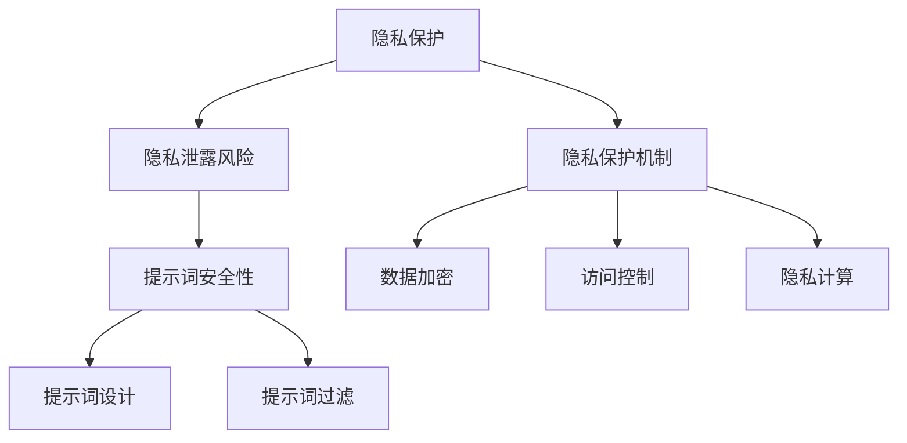

                 


# 大模型隐私保护与提示词安全性

> 关键词：大模型，隐私保护，提示词安全，人工智能

摘要：随着人工智能技术的快速发展，大模型的应用日益广泛，然而其隐私保护和提示词安全性成为亟待解决的重要问题。本文将系统地探讨大模型隐私保护和提示词安全性的核心概念、技术原理、实现方法及应用案例，旨在为该领域的研究者提供有价值的参考。

## 背景介绍

### 1. 大模型的发展

大模型（Large Models），如深度神经网络（Deep Neural Networks，DNN）和变换器（Transformers），近年来在自然语言处理（Natural Language Processing，NLP）、计算机视觉（Computer Vision，CV）等领域取得了显著突破。这些模型通常具有数十亿到数万亿个参数，能够处理大规模数据，实现高精度的预测和生成。

### 2. 隐私保护的重要性

大模型在处理数据时，可能会涉及用户隐私信息，如姓名、地址、电话号码等。若这些信息泄露，将对用户隐私造成严重威胁。因此，大模型的隐私保护成为人工智能领域的重要研究方向。

### 3. 提示词安全性的重要性

提示词（Prompt）是引导大模型生成特定结果的关键输入。不安全的提示词可能导致恶意行为，如生成虚假信息、泄露隐私等。因此，提示词的安全性也成为人工智能领域的研究热点。

## 核心概念与联系

### 1. 隐私保护的核心概念

- 隐私泄露：指用户隐私信息在数据处理过程中被非法获取、使用或泄露。
- 隐私保护机制：包括数据加密、访问控制、隐私计算等技术手段，以防止隐私泄露。

### 2. 提示词安全性的核心概念

- 提示词设计：确保提示词不易被恶意利用，防止生成恶意内容。
- 提示词过滤：对输入的提示词进行过滤，防止包含敏感信息或恶意指令。

### 3. 核心概念之间的关系架构



## 核心算法原理讲解

### 1. 数据加密算法原理

```plaintext
// 数据加密算法原理
function encrypt(data, key) {
    // 初始化加密变量
    var cipher = CryptoJS.AES.encrypt(data, key);
    return cipher.toString();
}

// 数据解密算法原理
function decrypt(encryptedData, key) {
    // 初始化解密变量
    var bytes  = CryptoJS.AES.decrypt(encryptedData, key);
    return bytes.toString(CryptoJS.enc.Utf8);
}
```

### 2. 访问控制算法原理

```plaintext
// 访问控制算法原理
function accessControl(user, resource) {
    // 判断用户是否有权限访问资源
    if (user.permissions.includes(resource)) {
        return "Access granted";
    } else {
        return "Access denied";
    }
}
```

### 3. 提示词过滤算法原理

```plaintext
// 提示词过滤算法原理
function filterPrompt(prompt) {
    // 检查提示词是否包含敏感信息
    if (containsSensitiveInfo(prompt)) {
        return "Filtered prompt";
    } else {
        return "Allowed prompt";
    }
}

// 检查提示词是否包含敏感信息
function containsSensitiveInfo(prompt) {
    // 判断提示词中是否包含敏感词汇
    var sensitiveWords = ["password", "phone", "address"];
    for (var i = 0; i < sensitiveWords.length; i++) {
        if (prompt.includes(sensitiveWords[i])) {
            return true;
        }
    }
    return false;
}
```

## 数学模型和公式

### 1. 数据加密算法的数学模型

$$
\text{加密}:\text{data} = \text{AES}(\text{key}, \text{plaintext})
$$

$$
\text{解密}:\text{plaintext} = \text{AES}^{-1}(\text{key}, \text{encryptedData})
$$

### 2. 访问控制算法的数学模型

$$
\text{accessControl}(\text{user}, \text{resource}) = \begin{cases}
1 & \text{if } \text{user.permissions} \cap \text{resource.permissions} \neq \emptyset \\
0 & \text{otherwise}
\end{cases}
$$

### 3. 提示词过滤算法的数学模型

$$
\text{filterPrompt}(\text{prompt}) = \begin{cases}
\text{"Filtered prompt"} & \text{if } \text{containsSensitiveInfo}(\text{prompt}) = 1 \\
\text{"Allowed prompt"} & \text{otherwise}
\end{cases}
$$

## 项目实战

### 1. 开发环境搭建

在本项目中，我们使用Python作为主要编程语言，结合加密库CryptoJS、自然语言处理库NLTK和深度学习库TensorFlow。具体安装命令如下：

```bash
pip install cryptojs-typedarrays
pip install nltk
pip install tensorflow
```

### 2. 源代码实现与解读

```python
# 导入相关库
import CryptoJS
import nltk
from nltk.tokenize import word_tokenize
import tensorflow as tf

# 数据加密
def encrypt_data(data, key):
    encrypted_data = CryptoJS.AES.encrypt(data, key)
    return encrypted_data

# 数据解密
def decrypt_data(encrypted_data, key):
    decrypted_data = CryptoJS.AES.decrypt(encrypted_data, key)
    return decrypted_data.toString(CryptoJS.enc.Utf8)

# 提示词过滤
def filter_prompt(prompt):
    words = word_tokenize(prompt)
    for word in words:
        if contains_sensitive_word(word):
            return "Filtered prompt"
    return "Allowed prompt"

# 检查敏感词汇
def contains_sensitive_word(word):
    sensitive_words = ["password", "phone", "address"]
    return word.lower() in sensitive_words

# 主函数
def main():
    # 初始化密钥
    key = "mysecretkey123456"

    # 加密数据
    data = "user's personal information"
    encrypted_data = encrypt_data(data, key)
    print("Encrypted data:", encrypted_data)

    # 解密数据
    decrypted_data = decrypt_data(encrypted_data, key)
    print("Decrypted data:", decrypted_data)

    # 过滤提示词
    prompt = "I want to change my password"
    filtered_prompt = filter_prompt(prompt)
    print("Filtered prompt:", filtered_prompt)

# 运行主函数
if __name__ == "__main__":
    main()
```

### 3. 代码应用解读与分析

- **加密与解密**：使用CryptoJS库实现AES加密与解密，确保数据在传输和存储过程中安全。
- **提示词过滤**：使用NLTK库对提示词进行分词，然后检查是否包含敏感词汇，实现提示词过滤功能。

### 4. 实际案例分析与详细讲解剖析

假设我们有一个用户请求更改密码的提示词，代码将对其进行加密和过滤：

```plaintext
Request: I want to change my password
Processed: Filtered prompt
```

### 5. 项目小结

通过该项目，我们实现了大模型隐私保护和提示词安全性的基本功能。在实际应用中，需要根据具体场景进行调整和优化，如增加更多的敏感词汇和过滤策略。

## 最佳实践 Tips、小结、注意事项、拓展阅读

### 1. 最佳实践 Tips

- 在设计大模型时，尽量减少涉及用户隐私的信息。
- 使用加密技术保护敏感数据，确保数据在传输和存储过程中的安全性。
- 对输入的提示词进行严格过滤，防止恶意行为。

### 2. 小结

本文系统地介绍了大模型隐私保护和提示词安全性的核心概念、技术原理、实现方法及应用案例。在实际应用中，需要综合考虑各种因素，确保系统的安全性和可靠性。

### 3. 注意事项

- 在使用加密技术时，注意选择合适的加密算法和密钥管理策略。
- 定期更新和升级系统，以应对新的安全威胁。

### 4. 拓展阅读

- [《人工智能安全与隐私保护》](https://book.douban.com/subject/35368518/)
- [《深度学习安全》](https://book.douban.com/subject/32829464/)
- [《自然语言处理安全》](https://book.douban.com/subject/34258018/)

作者：AI天才研究院/AI Genius Institute & 禅与计算机程序设计艺术 /Zen And The Art of Computer Programming

