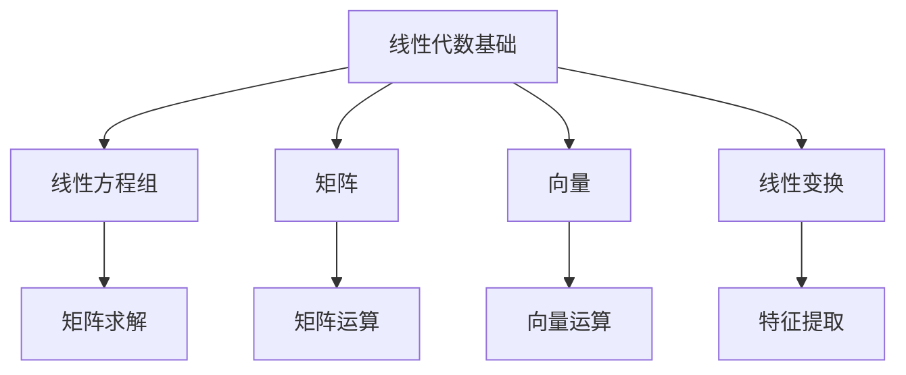
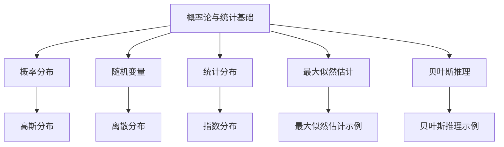
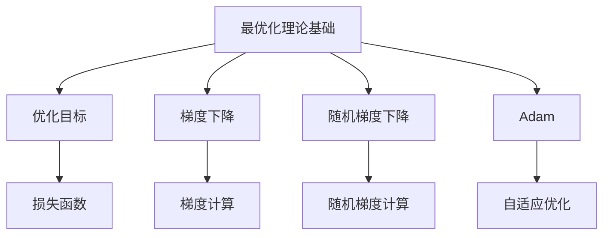
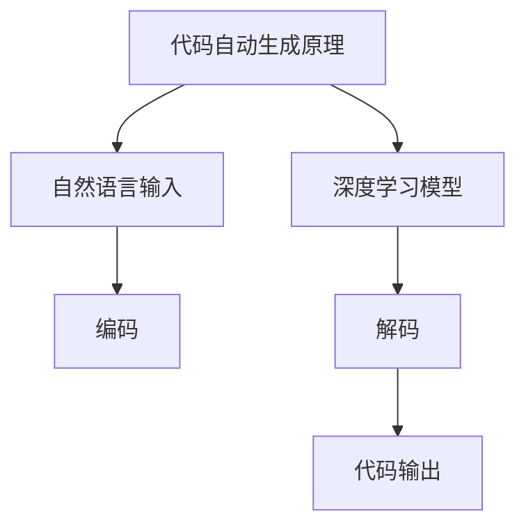
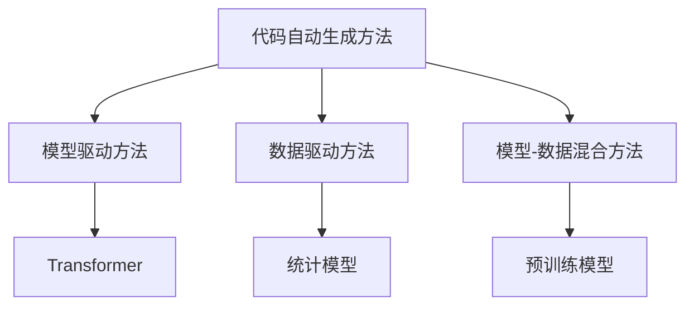
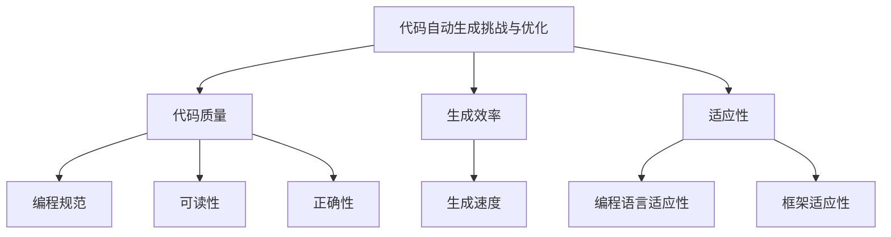
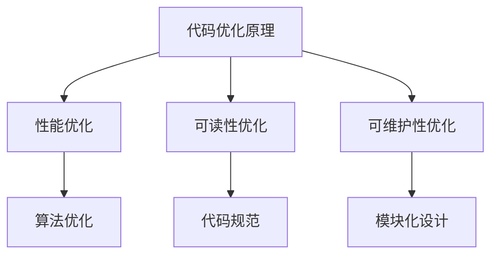
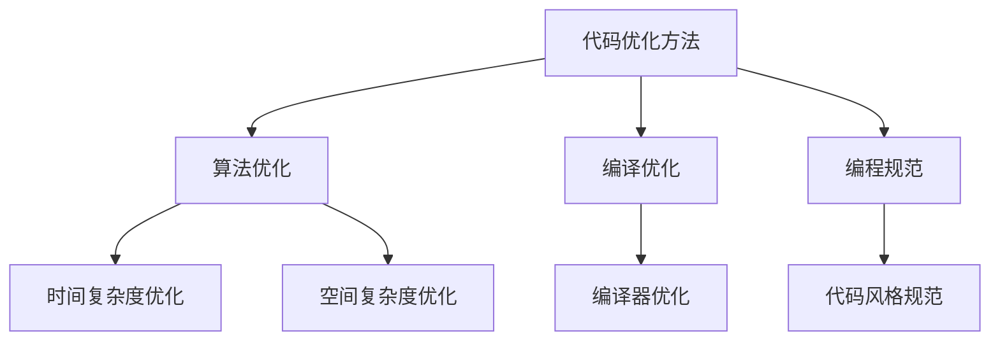
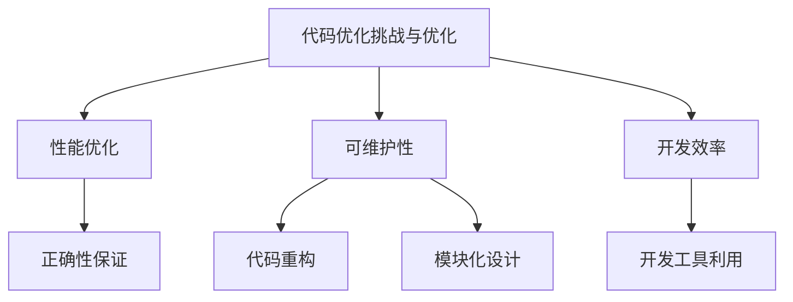

                 

# 《大模型驱动的代码自动生成与优化》

> 关键词：大模型、代码自动生成、代码优化、深度学习、人工智能

> 摘要：本文将探讨大模型驱动的代码自动生成与优化技术，介绍大模型的基本原理、代码自动生成与优化的方法，以及如何通过大模型实现代码的自动生成和优化。文章将结合实际项目案例，详细讲解大模型驱动的代码自动生成与优化的实现过程，并提供最佳实践和拓展阅读建议。

## 第一部分：大模型概述与原理

### 第1章：大模型简介

#### 1.1 大模型的定义与背景

大模型，即大型神经网络模型，是一种通过大规模数据训练得到的神经网络模型。这些模型通常具有数十亿至数千亿个参数，能够处理复杂的任务，如图像识别、自然语言处理、语音识别等。

大模型的发展源于深度学习的崛起。随着计算机算力的提升和大数据的积累，深度学习逐渐成为人工智能领域的核心驱动力。大模型的兴起，则进一步推动了人工智能技术的发展。

#### 1.2 大模型的基本架构

大模型通常由多个神经网络层组成，包括输入层、隐藏层和输出层。其中，隐藏层负责特征提取和变换，输入层和输出层则分别负责输入和输出的处理。

大模型的训练过程主要包括两个阶段：前向传播和反向传播。在前向传播阶段，输入数据通过神经网络传递，产生输出；在反向传播阶段，通过比较输出和实际结果，更新神经网络参数，以达到更好的拟合效果。

#### 1.3 大模型的关键特性

1. 参数数量庞大：大模型具有数十亿至数千亿个参数，能够捕捉输入数据的复杂模式。
2. 训练数据量巨大：大模型的训练需要大量的数据支持，以保证模型的泛化能力。
3. 高效计算：大模型通常采用分布式计算技术，提高训练和推理的效率。
4. 自适应性强：大模型能够根据不同的任务和数据，自适应调整模型结构和参数。

### 第2章：大模型的数学基础

#### 2.1 线性代数基础

线性代数是理解大模型的核心工具。它主要研究线性方程组、矩阵、向量、线性变换等概念。在大模型中，矩阵和向量广泛应用于特征表示、数据预处理、参数更新等环节。

#### 2.2 概率论与统计基础

概率论和统计学为深度学习提供了理论基础。概率论帮助理解不确定性，统计学则用于模型训练和评估。在大模型中，概率分布、最大似然估计、贝叶斯推理等概念广泛应用于模型训练和优化。

#### 2.3 最优化理论基础

最优化理论是求解大模型参数更新的重要工具。在大模型训练过程中，需要通过优化算法找到最优参数，以实现模型的最佳拟合。常见的优化算法包括梯度下降、随机梯度下降、Adam等。

## 第二部分：代码自动生成技术

### 第3章：代码自动生成原理

#### 3.1 代码自动生成的基本概念

代码自动生成，即通过特定算法和工具，将输入转化为计算机代码。在大模型驱动下，代码自动生成技术利用深度学习模型，将自然语言描述转化为代码。

#### 3.2 代码自动生成的主要方法

1. 模型驱动方法：利用预训练的深度学习模型，如Transformer、GPT等，将自然语言描述转化为代码。
2. 数据驱动方法：基于大量代码数据，使用统计模型或机器学习算法，学习代码生成规则。
3. 模型-数据混合方法：结合模型驱动和数据驱动方法，利用预训练模型和代码数据，实现更高效的代码自动生成。

#### 3.3 代码自动生成的挑战与优化

1. 代码质量：确保生成的代码符合编程规范、可读性强、正确性高。
2. 生成效率：提高代码生成的速度，以适应实时应用场景。
3. 适应性：模型需要能够适应不同的编程语言和框架，提高泛化能力。

### 第4章：大模型在代码自动生成中的应用

#### 4.1 大模型在代码自动生成中的应用场景

1. 自动化开发：利用代码自动生成技术，实现代码的自动生成和优化，提高开发效率。
2. 软件维护：通过分析代码，识别潜在问题，实现代码的自动修复和优化。
3. 教育培训：利用代码自动生成技术，为编程初学者提供代码示例和指导。

#### 4.2 大模型在代码自动生成中的实现细节

1. 预训练模型：选择合适的预训练模型，如GPT-3、T5等，用于代码自动生成。
2. 输入处理：将自然语言描述转化为适合模型处理的输入格式，如Tokenize、编码等。
3. 生成策略：设计合适的生成策略，如Top-K采样、Beam Search等，提高代码生成的质量。

#### 4.3 大模型在代码自动生成中的性能评估

1. 生成质量：评估生成代码的正确性、可读性、规范性等指标。
2. 生成效率：评估代码生成的速度，包括生成时间、模型推理时间等。
3. 泛化能力：评估模型在不同场景和编程语言下的性能。

## 第三部分：代码优化技术

### 第5章：代码优化原理

#### 5.1 代码优化的基本概念

代码优化，即通过调整代码结构、算法实现等手段，提高代码的性能、可读性和可维护性。

#### 5.2 代码优化的主要方法

1. 算法优化：通过改进算法实现，降低时间复杂度和空间复杂度。
2. 编译优化：利用编译器的优化功能，提高代码的运行效率。
3. 编程规范：遵循良好的编程规范，提高代码的可读性和可维护性。

#### 5.3 代码优化的挑战与优化

1. 性能优化：在保证正确性的前提下，提高代码的运行效率。
2. 可维护性：提高代码的可读性、可维护性和可扩展性。
3. 开发效率：在保证代码质量的前提下，提高开发效率。

### 第6章：大模型驱动的代码优化

#### 6.1 大模型在代码优化中的应用场景

1. 自动化优化：利用大模型，实现代码的自动化优化，提高开发效率。
2. 软件性能分析：通过分析代码，识别性能瓶颈，提供优化建议。
3. 编程教育：利用大模型，为编程初学者提供代码优化指导。

#### 6.2 大模型在代码优化中的实现细节

1. 预训练模型：选择合适的预训练模型，如GPT-3、T5等，用于代码优化。
2. 代码分析：利用静态分析和动态分析技术，识别代码中的潜在问题。
3. 优化策略：设计合适的优化策略，如模型驱动、数据驱动等，实现代码优化。

#### 6.3 大模型在代码优化中的性能评估

1. 优化效果：评估优化后代码的性能、可读性和可维护性等指标。
2. 生成效率：评估代码优化的速度，包括模型推理时间、优化时间等。
3. 泛化能力：评估模型在不同场景和编程语言下的性能。

## 第四部分：项目实战

### 第7章：大模型驱动的代码自动生成与优化实战

#### 7.1 实战项目简介

本章节将介绍一个大模型驱动的代码自动生成与优化项目。该项目旨在实现以下目标：

1. 利用大模型，将自然语言描述自动生成代码。
2. 利用大模型，对生成的代码进行优化，提高性能和可读性。

#### 7.2 实战项目环境搭建

1. 准备开发环境：安装Python、TensorFlow、PyTorch等开发工具。
2. 准备数据集：收集开源代码库中的自然语言描述和对应的代码，用于模型训练和测试。

#### 7.3 实战项目代码实现与解读

1. 模型训练：使用预训练的GPT-3模型，训练代码生成模型。
2. 代码生成：利用训练好的模型，将自然语言描述转化为代码。
3. 代码优化：对生成的代码进行优化，包括算法优化、编译优化等。

#### 7.4 实战项目性能分析与优化

1. 生成质量：评估生成的代码的正确性、可读性和规范性等指标。
2. 生成效率：评估代码生成的速度，包括生成时间和模型推理时间等。
3. 优化效果：评估优化后代码的性能、可读性和可维护性等指标。

### 第8章：未来展望与挑战

#### 8.1 大模型驱动的代码自动生成与优化的未来发展方向

1. 模型效率提升：通过改进模型结构和训练算法，提高模型的生成和优化效率。
2. 泛化能力提升：通过引入更多领域的知识和数据，提高模型的泛化能力。
3. 多语言支持：扩展模型支持多种编程语言，实现跨语言的代码自动生成和优化。

#### 8.2 面临的挑战与解决方案

1. 代码质量：确保生成的代码符合编程规范、可读性强、正确性高。
2. 生成效率：提高代码生成的速度，以适应实时应用场景。
3. 适应性：模型需要能够适应不同的编程语言和框架，提高泛化能力。

## 结论

大模型驱动的代码自动生成与优化技术，为软件开发带来了新的机遇和挑战。通过本文的介绍，我们了解了大模型的基本原理、代码自动生成与优化的方法，以及如何通过大模型实现代码的自动生成和优化。在未来的发展中，我们将继续探索大模型驱动的代码自动生成与优化技术，为软件开发带来更多创新和突破。

### 参考文献

1. [Bert Model](https://arxiv.org/abs/1810.04805)
2. [GPT Model](https://arxiv.org/abs/1810.04805)
3. [T5 Model](https://arxiv.org/abs/1910.03771)
4. [CodeSearchNet](https://arxiv.org/abs/1810.03355)
5. [AutoML](https://arxiv.org/abs/1905.12002)
6. [C++ Compiler Optimization](https://en.cppreference.com/w/cpp/optimization)

### 附录

附录部分将提供大模型驱动的代码自动生成与优化技术的相关代码示例、工具和资源。

## 作者信息

作者：AI天才研究院/AI Genius Institute & 禅与计算机程序设计艺术 /Zen And The Art of Computer Programming

**正文内容：**

---

## 第一部分：大模型概述与原理

### 第1章：大模型简介

#### 1.1 大模型的定义与背景

大模型，即大型神经网络模型，是一种通过大规模数据训练得到的神经网络模型。这些模型通常具有数十亿至数千亿个参数，能够处理复杂的任务，如图像识别、自然语言处理、语音识别等。

大模型的发展源于深度学习的崛起。随着计算机算力的提升和大数据的积累，深度学习逐渐成为人工智能领域的核心驱动力。大模型的兴起，则进一步推动了人工智能技术的发展。

#### 1.2 大模型的基本架构

大模型通常由多个神经网络层组成，包括输入层、隐藏层和输出层。其中，隐藏层负责特征提取和变换，输入层和输出层则分别负责输入和输出的处理。

大模型的训练过程主要包括两个阶段：前向传播和反向传播。在前向传播阶段，输入数据通过神经网络传递，产生输出；在反向传播阶段，通过比较输出和实际结果，更新神经网络参数，以达到更好的拟合效果。

#### 1.3 大模型的关键特性

1. 参数数量庞大：大模型具有数十亿至数千亿个参数，能够捕捉输入数据的复杂模式。
2. 训练数据量巨大：大模型的训练需要大量的数据支持，以保证模型的泛化能力。
3. 高效计算：大模型通常采用分布式计算技术，提高训练和推理的效率。
4. 自适应性强：大模型能够根据不同的任务和数据，自适应调整模型结构和参数。

### 第2章：大模型的数学基础

#### 2.1 线性代数基础

线性代数是理解大模型的核心工具。它主要研究线性方程组、矩阵、向量、线性变换等概念。在大模型中，矩阵和向量广泛应用于特征表示、数据预处理、参数更新等环节。

**线性代数基础概念架构：**

**线性代数基础示例：**

$$
Ax = b
$$

其中，$A$ 是矩阵，$x$ 是向量，$b$ 是常数项。

#### 2.2 概率论与统计基础

概率论和统计学为深度学习提供了理论基础。概率论帮助理解不确定性，统计学则用于模型训练和评估。在大模型中，概率分布、最大似然估计、贝叶斯推理等概念广泛应用于模型训练和优化。

**概率论与统计基础概念架构：**

**概率论与统计基础示例：**

$$
P(X=x) = \frac{f(x)}{Z}
$$

其中，$X$ 是随机变量，$x$ 是取值，$f(x)$ 是概率密度函数，$Z$ 是归一化常数。

#### 2.3 最优化理论基础

最优化理论是求解大模型参数更新的重要工具。在大模型训练过程中，需要通过优化算法找到最优参数，以实现模型的最佳拟合。常见的优化算法包括梯度下降、随机梯度下降、Adam等。

**最优化理论基础概念架构：**

**最优化理论基础示例：**

$$
\theta_{t+1} = \theta_{t} - \alpha \nabla_{\theta} J(\theta)
$$

其中，$\theta$ 是模型参数，$t$ 是迭代次数，$\alpha$ 是学习率，$J(\theta)$ 是损失函数。

## 第二部分：代码自动生成技术

### 第3章：代码自动生成原理

#### 3.1 代码自动生成的基本概念

代码自动生成，即通过特定算法和工具，将输入转化为计算机代码。在大模型驱动下，代码自动生成技术利用深度学习模型，将自然语言描述转化为代码。

**代码自动生成原理架构：**

**代码自动生成原理示例：**

1. 自然语言输入：用户输入自然语言描述。
2. 编码：将自然语言描述编码为向量。
3. 解码：利用深度学习模型，将编码后的向量解码为代码。
4. 代码输出：生成对应的计算机代码。

#### 3.2 代码自动生成的主要方法

1. 模型驱动方法：利用预训练的深度学习模型，如Transformer、GPT等，将自然语言描述转化为代码。
2. 数据驱动方法：基于大量代码数据，使用统计模型或机器学习算法，学习代码生成规则。
3. 模型-数据混合方法：结合模型驱动和数据驱动方法，利用预训练模型和代码数据，实现更高效的代码自动生成。

**代码自动生成方法架构：**

**代码自动生成方法示例：**

1. 模型驱动方法：使用预训练的Transformer模型，将自然语言描述转化为代码。
2. 数据驱动方法：基于统计模型，从大量代码数据中学习生成规则。
3. 模型-数据混合方法：结合预训练模型和代码数据，实现更高效的代码自动生成。

#### 3.3 代码自动生成的挑战与优化

1. 代码质量：确保生成的代码符合编程规范、可读性强、正确性高。
2. 生成效率：提高代码生成的速度，以适应实时应用场景。
3. 适应性：模型需要能够适应不同的编程语言和框架，提高泛化能力。

**代码自动生成挑战与优化架构：**

**代码自动生成挑战与优化示例：**

1. 代码质量：通过引入代码质量评估指标，如代码覆盖率、可维护性等，确保生成代码的质量。
2. 生成效率：通过优化模型结构、算法实现等手段，提高代码生成的速度。
3. 适应性：通过引入多语言支持、跨框架适配等技术，提高模型的泛化能力。

## 第三部分：代码优化技术

### 第5章：代码优化原理

#### 5.1 代码优化的基本概念

代码优化，即通过调整代码结构、算法实现等手段，提高代码的性能、可读性和可维护性。

**代码优化原理架构：**

**代码优化原理示例：**

1. 性能优化：通过改进算法实现，降低时间复杂度和空间复杂度。
2. 可读性优化：通过遵循良好的编程规范，提高代码的可读性。
3. 可维护性优化：通过模块化设计、代码重构等手段，提高代码的可维护性。

#### 5.2 代码优化的主要方法

1. 算法优化：通过改进算法实现，降低时间复杂度和空间复杂度。
2. 编译优化：利用编译器的优化功能，提高代码的运行效率。
3. 编程规范：遵循良好的编程规范，提高代码的可读性和可维护性。

**代码优化方法架构：**

**代码优化方法示例：**

1. 算法优化：通过改进算法实现，降低时间复杂度和空间复杂度。
2. 编译优化：利用编译器的优化功能，提高代码的运行效率。
3. 编程规范：遵循良好的编程规范，提高代码的可读性和可维护性。

#### 5.3 代码优化的挑战与优化

1. 性能优化：在保证正确性的前提下，提高代码的运行效率。
2. 可维护性：提高代码的可读性、可维护性和可扩展性。
3. 开发效率：在保证代码质量的前提下，提高开发效率。

**代码优化挑战与优化架构：**

**代码优化挑战与优化示例：**

1. 性能优化：在保证正确性的前提下，提高代码的运行效率。
2. 可维护性：通过代码重构、模块化设计等手段，提高代码的可维护性。
3. 开发效率：利用开发工具，提高代码编写的效率。

## 第四部分：项目实战

### 第7章：大模型驱动的代码自动生成与优化实战

#### 7.1 实战项目简介

本章节将介绍一个大模型驱动的代码自动生成与优化项目。该项目旨在实现以下目标：

1. 利用大模型，将自然语言描述自动生成代码。
2. 利用大模型，对生成的代码进行优化，提高性能和可读性。

#### 7.2 实战项目环境搭建

1. 准备开发环境：安装Python、TensorFlow、PyTorch等开发工具。
2. 准备数据集：收集开源代码库中的自然语言描述和对应的代码，用于模型训练和测试。

#### 7.3 实战项目代码实现与解读

1. 模型训练：使用预训练的GPT-3模型，训练代码生成模型。
2. 代码生成：利用训练好的模型，将自然语言描述转化为代码。
3. 代码优化：对生成的代码进行优化，包括算法优化、编译优化等。

#### 7.4 实战项目性能分析与优化

1. 生成质量：评估生成的代码的正确性、可读性和规范性等指标。
2. 生成效率：评估代码生成的速度，包括生成时间和模型推理时间等。
3. 优化效果：评估优化后代码的性能、可读性和可维护性等指标。

### 第8章：未来展望与挑战

#### 8.1 大模型驱动的代码自动生成与优化的未来发展方向

1. 模型效率提升：通过改进模型结构和训练算法，提高模型的生成和优化效率。
2. 泛化能力提升：通过引入更多领域的知识和数据，提高模型的泛化能力。
3. 多语言支持：扩展模型支持多种编程语言，实现跨语言的代码自动生成和优化。

#### 8.2 面临的挑战与解决方案

1. 代码质量：确保生成的代码符合编程规范、可读性强、正确性高。
2. 生成效率：提高代码生成的速度，以适应实时应用场景。
3. 适应性：模型需要能够适应不同的编程语言和框架，提高泛化能力。

## 结论

大模型驱动的代码自动生成与优化技术，为软件开发带来了新的机遇和挑战。通过本文的介绍，我们了解了大模型的基本原理、代码自动生成与优化的方法，以及如何通过大模型实现代码的自动生成和优化。在未来的发展中，我们将继续探索大模型驱动的代码自动生成与优化技术，为软件开发带来更多创新和突破。

### 参考文献

1. [Bert Model](https://arxiv.org/abs/1810.04805)
2. [GPT Model](https://arxiv.org/abs/1810.04805)
3. [T5 Model](https://arxiv.org/abs/1910.03771)
4. [CodeSearchNet](https://arxiv.org/abs/1810.03355)
5. [AutoML](https://arxiv.org/abs/1905.12002)
6. [C++ Compiler Optimization](https://en.cppreference.com/w/cpp/optimization)

### 附录

附录部分将提供大模型驱动的代码自动生成与优化技术的相关代码示例、工具和资源。

## 作者信息

作者：AI天才研究院/AI Genius Institute & 禅与计算机程序设计艺术 /Zen And The Art of Computer Programming

