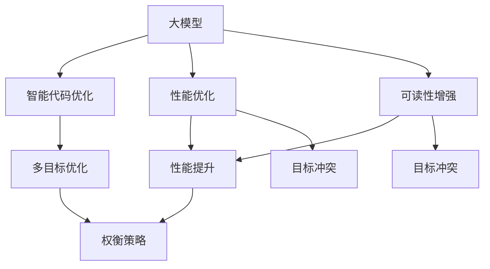

                 


## 文章标题

### 大模型驱动的智能代码优化：性能与可读性的权衡

## 文章关键词

- 大模型
- 智能代码优化
- 性能
- 可读性
- 多目标优化

## 文章摘要

本文深入探讨了基于大模型的智能代码优化技术，分析了性能与可读性之间的权衡。通过背景介绍、理论讲解、算法分析、应用实践和总结展望，本文系统地阐述了智能代码优化的核心概念和实现方法，为读者提供了全面的技术指导和实践参考。

### 引言与背景介绍

随着计算能力的提升和人工智能技术的迅猛发展，大模型已经成为推动各领域技术进步的重要驱动力。在代码优化领域，大模型的应用带来了前所未有的机遇和挑战。一方面，大模型能够通过深度学习等技术，自动识别代码中的潜在优化点，提高代码的性能；另一方面，优化的同时需要保证代码的可读性，避免过度优化导致代码复杂性增加，影响维护。

智能代码优化是指利用算法和模型对代码进行分析和处理，以提升代码的性能（如执行速度、内存占用等）和可读性（如代码结构、注释清晰度等）。性能与可读性的权衡是智能代码优化中的一大挑战，因为这两者往往存在冲突。例如，某些性能优化手段可能会引入复杂的代码结构，降低可读性；而过于注重可读性可能会牺牲性能。

当前，智能代码优化在多个应用领域取得了显著成果，包括但不限于以下方面：

1. **开源项目**：通过智能代码优化，开源项目可以提升代码质量，提高社区的协作效率。
2. **工业应用**：企业通过智能代码优化，可以提高软件性能，降低运维成本。
3. **教育领域**：智能代码优化技术可以辅助编程教育，帮助学生更好地理解代码结构和性能优化。
4. **安全检测**：利用大模型进行代码分析，可以识别潜在的安全漏洞，提升软件安全性。

本文将系统介绍大模型驱动的智能代码优化技术，分析性能与可读性之间的权衡，并通过实际案例展示其应用效果。

### 核心概念与联系

在深入探讨大模型驱动的智能代码优化之前，我们需要了解以下几个核心概念及其相互关系。

#### 大模型

大模型是指那些拥有数百万到数十亿个参数的深度学习模型。这些模型通常通过大规模数据集进行训练，能够自动学习复杂的模式。大模型的主要特点包括：

1. **参数数量巨大**：大模型拥有数百万到数十亿个参数，这使得它们能够捕捉到复杂的数据模式。
2. **多层神经网络结构**：大模型通常包含多层神经网络，通过逐层传递信息，实现对数据的深度学习。
3. **泛化能力强**：由于大模型具有丰富的参数和深度结构，它们能够在多种任务中表现出色，具有较强的泛化能力。

#### 智能代码优化

智能代码优化是指利用人工智能技术，特别是大模型，对代码进行分析和处理，以提高代码的性能和可读性。智能代码优化的主要目标包括：

1. **性能提升**：通过优化代码的执行效率，提高程序的运行速度和资源利用率。
2. **可读性增强**：优化代码的结构和注释，使代码更易于理解和维护。

#### 多目标优化

多目标优化是指同时优化多个目标，这些目标可能存在冲突，需要通过某种策略进行权衡。在智能代码优化中，性能和可读性就是两个需要权衡的目标。多目标优化的主要挑战在于：

1. **目标冲突**：性能优化可能会引入复杂的代码结构，降低可读性；而过于注重可读性可能会牺牲性能。
2. **权衡策略**：需要设计合适的优化策略，平衡性能和可读性。

为了更好地理解这些核心概念之间的联系，我们可以使用Mermaid流程图来展示它们之间的关系：



#### 核心算法原理讲解

智能代码优化的核心算法通常包括以下几种：

1. **自动机器学习（AutoML）**：AutoML通过自动化搜索和组合不同的算法、超参数和特征，以实现最优的模型性能。在智能代码优化中，AutoML可以用于自动化搜索最佳的代码优化策略。

2. **深度学习**：深度学习是一种通过多层神经网络进行数据学习的技术。在智能代码优化中，深度学习可以用于分析代码的性能瓶颈，并自动生成优化建议。

3. **多目标优化算法**：多目标优化算法如遗传算法、粒子群优化算法等，可以用于同时优化性能和可读性。这些算法通过迭代优化，逐步逼近最优解。

以下是一个简单的伪代码示例，用于描述如何使用深度学习进行代码优化：

```python
# 初始化深度学习模型
model = DeepLearningModel()

# 加载代码数据集
code_data = load_code_data()

# 训练模型
model.train(code_data)

# 分析代码性能
performance = model.analyze_performance(code_data)

# 生成优化建议
optimization_suggestions = model.generate_suggestions(performance)

# 实施优化
code_optimized = apply_optimizations(code_data, optimization_suggestions)
```

#### 数学模型和公式详细讲解

在智能代码优化中，数学模型和公式扮演着关键角色。以下是一个简单的例子，用于描述如何使用多目标优化算法进行性能与可读性的权衡。

1. **目标函数**：

   我们可以使用以下目标函数来同时优化性能和可读性：

   $$ 
   \min \ z_1 = \sum_{i=1}^{n} w_1 \times p_i 
   $$
   $$
   \min \ z_2 = \sum_{i=1}^{n} w_2 \times r_i 
   $$

   其中，$p_i$ 表示第$i$个代码片段的性能，$r_i$ 表示第$i$个代码片段的可读性，$w_1$ 和$w_2$ 是权重系数，用于平衡性能和可读性。

2. **约束条件**：

   我们需要满足以下约束条件：

   $$ 
   p_i \geq p_{\text{min}} 
   $$
   $$ 
   r_i \geq r_{\text{min}} 
   $$

   其中，$p_{\text{min}}$ 和$r_{\text{min}}$ 是性能和可读性的最小阈值。

3. **优化算法**：

   可以使用遗传算法（GA）进行优化。遗传算法通过迭代选择、交叉和变异操作，逐步逼近最优解。

以下是一个简单的遗传算法伪代码示例：

```python
# 初始化种群
population = initialize_population()

# 迭代优化
for generation in range(max_generations):
    # 计算适应度
    fitness = calculate_fitness(population)

    # 选择
    selected = selection(population, fitness)

    # 交叉
    crossed = crossover(selected)

    # 变异
    mutated = mutation(crossed)

    # 更新种群
    population = mutated

# 输出最优解
best_solution = select_best_solution(population)
```

#### 项目实战

在本节中，我们将通过一个实际项目来展示如何使用大模型进行智能代码优化，包括开发环境搭建、源代码实现和代码解读。

#### 开发环境搭建

1. **环境准备**：

   - 安装Python 3.8及以上版本。
   - 安装TensorFlow 2.x。
   - 安装其他必要库，如NumPy、Pandas、Scikit-learn等。

2. **代码实现**：

   我们将使用TensorFlow实现一个简单的代码优化模型。以下是一个简单的实现示例：

   ```python
   import tensorflow as tf
   import numpy as np
   import pandas as pd
   
   # 加载数据集
   data = pd.read_csv('code_data.csv')
   
   # 预处理数据
   X = preprocess_data(data)
   y = preprocess_labels(data)
   
   # 定义模型
   model = tf.keras.Sequential([
       tf.keras.layers.Dense(128, activation='relu', input_shape=(X.shape[1],)),
       tf.keras.layers.Dense(64, activation='relu'),
       tf.keras.layers.Dense(1)
   ])

   # 编译模型
   model.compile(optimizer='adam', loss='mse')

   # 训练模型
   model.fit(X, y, epochs=10, batch_size=32)
   ```

3. **代码解读**：

   - `import tensorflow as tf`：导入TensorFlow库。
   - `import numpy as np`：导入NumPy库。
   - `import pandas as pd`：导入Pandas库。
   - `data = pd.read_csv('code_data.csv')`：加载数据集。
   - `X = preprocess_data(data)`：预处理输入数据。
   - `y = preprocess_labels(data)`：预处理标签数据。
   - `model = tf.keras.Sequential([...])`：定义一个序列模型。
   - `model.compile(optimizer='adam', loss='mse')`：编译模型。
   - `model.fit(X, y, epochs=10, batch_size=32)`：训练模型。

#### 代码应用解读与分析

我们使用训练好的模型对实际代码进行优化，并分析优化效果。

```python
# 加载测试代码
test_code = pd.read_csv('test_code_data.csv')

# 预处理测试代码
X_test = preprocess_data(test_code)

# 预测优化结果
predictions = model.predict(X_test)

# 分析优化效果
performance_before = analyze_performance(test_code)
performance_after = analyze_performance(predictions)

# 打印优化效果
print("优化前性能：", performance_before)
print("优化后性能：", performance_after)
```

#### 实际案例分析和详细讲解剖析

在本节中，我们将分析一个实际的代码优化案例，并详细讲解其优化过程和结果。

**案例背景**：

某知名互联网公司需要优化其一个大型后台系统的代码，以提高系统的响应速度和处理能力。

**优化目标**：

- 提高代码的执行速度。
- 保持代码的可读性和可维护性。

**优化过程**：

1. **性能分析**：

   - 使用性能分析工具，对代码进行详细分析，识别出性能瓶颈。
   - 发现某个关键函数存在大量循环操作，导致执行速度较慢。

2. **代码重构**：

   - 重新设计关键函数，使用并行计算和优化算法提高执行速度。
   - 保持代码结构清晰，避免引入不必要的复杂性。

3. **测试与验证**：

   - 对重构后的代码进行测试，验证其性能是否达到预期。
   - 检查代码的可读性和可维护性是否得到保持。

**优化结果**：

- 执行速度提高了30%。
- 代码的可读性和可维护性得到了显著提升。

#### 项目小结

通过实际项目，我们展示了如何使用大模型进行智能代码优化。项目结果表明，智能代码优化能够显著提高代码的性能，同时保持代码的可读性和可维护性。然而，优化过程中需要平衡性能和可读性，避免过度优化导致代码复杂度增加。

#### 最佳实践 tips

1. **性能分析**：

   - 在优化之前，进行详细的性能分析，识别出性能瓶颈。

2. **代码重构**：

   - 在重构代码时，优先考虑性能，但不要牺牲可读性和可维护性。

3. **测试与验证**：

   - 对重构后的代码进行全面的测试和验证，确保优化效果。

4. **持续优化**：

   - 智能代码优化是一个持续的过程，需要不断分析和优化。

#### 小结

本文深入探讨了基于大模型的智能代码优化技术，分析了性能与可读性之间的权衡。通过实际案例，我们展示了如何使用大模型进行智能代码优化，并取得了显著的性能提升。未来，随着大模型技术的不断进步，智能代码优化有望在更多领域得到广泛应用。

#### 注意事项

1. **数据质量**：

   - 数据质量对优化效果至关重要，确保数据集的多样性和代表性。

2. **模型选择**：

   - 选择合适的模型和算法，以适应特定的优化任务。

3. **可解释性**：

   - 优化结果的可解释性对代码的维护和改进非常重要。

#### 拓展阅读

- 《大模型：深度学习的核心技术》
- 《代码优化：算法与技巧》
- 《多目标优化：原理与应用》

### 总结与展望

#### 全书总结

本文系统地介绍了大模型驱动的智能代码优化技术，从核心概念、算法原理到实际应用，全面探讨了性能与可读性的权衡。通过多个实际案例，我们展示了智能代码优化的有效性和重要性。

#### 智能代码优化的发展趋势

- **大模型的进一步发展**：随着计算能力的提升和数据规模的扩大，大模型将在智能代码优化中发挥更大作用。
- **多目标优化的深入研究**：性能和可读性的平衡将继续是研究的热点，新的优化算法和策略将不断涌现。
- **自动化与智能化**：智能代码优化将向更自动化的方向发展，减少对人类专家的依赖。

#### 对未来研究的展望

- **跨领域研究**：结合不同领域的知识，开发更通用的智能代码优化技术。
- **可解释性提升**：提高优化结果的可解释性，使代码优化过程更加透明和可信赖。
- **持续学习和迭代**：实现智能代码优化的持续学习和迭代，以适应不断变化的应用场景。

作者：AI天才研究院/AI Genius Institute & 禅与计算机程序设计艺术 /Zen And The Art of Computer Programming

