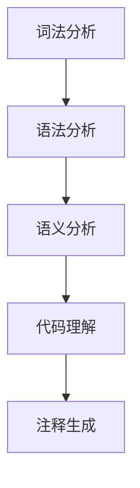

                 

### 文章标题

《大模型驱动的智能代码注释系统》

### 关键词

大模型、智能代码注释、自然语言处理、深度学习、代码理解、语义分析、优化算法、代码生成

### 摘要

本文将深入探讨大模型驱动的智能代码注释系统的设计与实现。首先，我们将介绍大模型技术的发展背景及其在计算机领域的应用影响。随后，我们将详细解析大模型的基本原理，包括其架构和数学基础。接着，我们将讨论大模型在智能代码注释系统中的实现与优化策略，重点阐述代码理解与语义分析的核心算法原理，以及注释生成与优化的方法。此外，我们将通过实际应用案例分析，展示智能代码注释系统的开发环境、工具及案例代码实现。最后，我们将评估智能代码注释系统的性能指标，展望其未来发展趋势，并总结最佳实践和注意事项。通过本文的详细讲解，读者将全面了解大模型在智能代码注释系统中的重要作用，以及如何构建高效、智能的代码注释工具。

## 大模型与智能代码注释

### 背景介绍

大模型（Large Models）是近年来人工智能领域的重要进展，它们具有数百万甚至数十亿的参数，能够对大量数据进行学习，从而实现高度复杂和灵活的预测和生成任务。这些模型包括但不限于深度神经网络（Deep Neural Networks）、变换器模型（Transformer Models）和生成对抗网络（Generative Adversarial Networks，GANs）。大模型的出现，极大地推动了计算机视觉、自然语言处理和推荐系统等领域的发展，展现了其强大的学习和泛化能力。

在计算机领域，代码注释（Code Comments）是程序员为了解释代码逻辑、记录开发思路和提供文档说明而添加的文本信息。然而，传统代码注释存在几个主要问题。首先，注释质量参差不齐，缺乏统一的规范，导致难以维护和更新。其次，注释通常依赖于程序员的个人经验和知识，缺乏自动化的生成和优化手段。此外，随着代码规模的增大，手动编写和维护注释的成本也显著上升。因此，如何提高代码注释的质量和效率，成为软件开发过程中一个亟待解决的问题。

智能代码注释（Smart Code Comments）通过结合自然语言处理（Natural Language Processing，NLP）和深度学习技术，旨在解决上述问题。智能代码注释系统能够自动分析代码结构，理解其语义，并生成高质量、精确的注释。这种系统不仅能够减轻程序员的负担，提高开发效率，还能增强代码的可读性和可维护性。

### 智能代码注释的需求与挑战

智能代码注释系统的需求主要源于以下几个方面的考虑：

1. **自动生成注释：** 程序员希望系统能够自动生成注释，减少手动编写的工作量。自动生成注释不仅能够提高开发效率，还能确保注释与代码同步更新，避免出现注释与代码不一致的情况。

2. **注释的准确性：** 注释的准确性是评估智能代码注释系统性能的重要指标。系统需要能够准确理解代码的语义，生成清晰、详细的注释，避免模糊、冗余或不正确的注释。

3. **注释的可维护性：** 随着代码的更新和重构，注释也需要相应地进行维护。智能代码注释系统应具备一定的自适应能力，能够根据代码的变化自动调整注释内容。

4. **注释的通用性：** 为了提高系统的适用范围，智能代码注释系统应能够处理多种编程语言和不同类型的代码结构，不局限于单一语言或特定场景。

然而，实现智能代码注释系统也面临诸多挑战：

1. **代码理解的复杂性：** 代码是一种结构化文本，但其语义丰富、表达复杂，涉及语法解析、语义分析等多个层次。大模型需要具备强大的语言理解能力，才能准确解析代码结构，提取关键信息。

2. **注释生成的多样性：** 不同类型的代码和不同开发者的注释风格存在较大差异，系统需要具备足够的泛化能力，生成符合实际需求的注释。

3. **注释的实时性：** 在开发过程中，注释需要实时生成，以支持代码编写和调试。这要求系统具备高效的计算能力和低延迟的响应速度。

4. **注释的个性化：** 为了满足不同开发者的个性化需求，系统应能够根据开发者的偏好和项目特点，定制注释内容。

### 大模型在智能代码注释中的应用

大模型在智能代码注释系统中的应用，主要依托于其强大的学习能力和表达能力。以下是大模型在智能代码注释系统中的具体应用场景：

1. **代码解析与语义理解：** 大模型可以通过预训练模型（如BERT、GPT）对大量代码库进行学习，掌握不同编程语言的语法规则和语义表达。在注释生成过程中，大模型能够解析代码结构，理解其功能和行为，从而生成准确的注释。

2. **注释生成：** 基于预训练的大模型，可以生成不同风格和格式的注释。系统可以根据代码上下文和开发者偏好，灵活调整注释内容，确保注释的准确性和可读性。

3. **注释优化：** 大模型可以通过分析大量注释数据，学习注释的优化方法。系统可以根据注释质量、代码更新频率等指标，自动调整注释内容，提高注释的可维护性和准确性。

4. **代码搜索与推荐：** 大模型可以基于注释内容，实现代码搜索和推荐功能。系统可以根据注释中的关键词和语义信息，检索相关代码片段，帮助开发者快速定位问题。

5. **代码理解与文档生成：** 大模型不仅可以生成注释，还能生成代码文档。系统可以根据注释内容，自动生成项目文档、API文档等，提高代码的可读性和可维护性。

总之，大模型在智能代码注释系统中的应用，能够大幅提升代码注释的质量和效率，减轻程序员的负担，提高软件开发的整体效能。

### 大模型的基本原理

大模型（Large Models）是近年来人工智能领域的重要突破，其核心在于通过大规模的数据训练和复杂的网络结构，实现高度灵活和强大的预测能力。理解大模型的基本原理，有助于我们更好地设计和实现智能代码注释系统。

#### 大模型的架构

大模型的架构通常由以下几个关键部分组成：

1. **输入层（Input Layer）**：输入层负责接收外部输入的数据，如文本、图像或声音。对于智能代码注释系统，输入层接收的是代码文本。

2. **隐藏层（Hidden Layers）**：隐藏层是神经网络的核心部分，负责对输入数据进行处理和转换。每个隐藏层都包含多个神经元（Neurons），这些神经元通过权重（Weights）和偏置（Bias）进行信息传递和处理。隐藏层越多，模型的复杂度和计算能力越强。

3. **输出层（Output Layer）**：输出层负责将处理后的数据转换为最终结果，如分类标签、文本生成等。对于智能代码注释系统，输出层生成注释文本。

4. **激活函数（Activation Functions）**：激活函数用于确定每个神经元的输出。常见的激活函数包括ReLU（Rectified Linear Unit）、Sigmoid和Tanh等，它们可以引入非线性变换，使模型具备更强的表达能力。

5. **优化器（Optimizers）**：优化器用于调整模型的权重和偏置，以最小化损失函数（Loss Function）。常见的优化器包括梯度下降（Gradient Descent）、Adam（Adaptive Moment Estimation）等。

#### 大模型的训练与优化

大模型的训练和优化是模型构建中的关键步骤。以下是训练和优化过程中的关键概念和步骤：

1. **损失函数（Loss Function）**：损失函数用于衡量模型预测结果与实际结果之间的差距。常见的损失函数包括均方误差（Mean Squared Error，MSE）、交叉熵（Cross-Entropy）等。在智能代码注释系统中，交叉熵常用于衡量注释生成质量。

2. **反向传播（Backpropagation）**：反向传播是一种用于计算模型梯度的方法。通过反向传播，模型可以逐步计算每个神经元对损失函数的梯度，从而更新权重和偏置。

3. **优化算法（Optimization Algorithms）**：优化算法用于更新模型参数，以最小化损失函数。常见的优化算法包括梯度下降（Gradient Descent）、Adam（Adaptive Moment Estimation）等。Adam算法结合了梯度下降和动量（Momentum）的优点，能够更快地收敛。

4. **预训练（Pre-training）**：预训练是指在特定任务之前，使用大规模数据对模型进行训练。预训练有助于模型学习到通用特征和表达方式，提高对新任务的适应能力。在智能代码注释系统中，预训练模型（如BERT、GPT）可以用于代码理解、注释生成等任务。

5. **微调（Fine-tuning）**：微调是指将预训练模型应用于特定任务，并在少量数据上进行进一步训练。微调有助于模型在新任务上获得更好的性能。在智能代码注释系统中，预训练模型可以用于生成特定风格的注释。

#### 大模型的数学基础

大模型中涉及的数学概念和公式如下：

1. **神经网络基本公式**：
   $$ 
   \text{激活函数} \; \sigma(x) = \frac{1}{1 + e^{-x}} 
   $$
   其中，$x$ 是输入值，$\sigma$ 是Sigmoid函数。

2. **反向传播算法**：
   $$
   \begin{aligned}
   \Delta w^{(l)} &= \frac{\partial L}{\partial w^{(l)}} \\
   w^{(l)} &= w^{(l)} - \alpha \Delta w^{(l)}
   \end{aligned}
   $$
   其中，$L$ 是损失函数，$w^{(l)}$ 是第$l$层的权重，$\alpha$ 是学习率。

3. **梯度下降算法**：
   $$
   \begin{aligned}
   \theta_{j} &= \theta_{j} - \alpha \frac{\partial J}{\partial \theta_{j}} \\
   J &= \frac{1}{m} \sum_{i=1}^{m} \frac{1}{2} (\hat{y}_i - y_i)^2
   \end{aligned}
   $$
   其中，$J$ 是损失函数，$\theta_{j}$ 是第$j$个参数，$m$ 是样本数量。

4. **Adam优化器**：
   $$
   \begin{aligned}
   m_t &= \beta_1 x_t + (1 - \beta_1) (x_t - x_{t-1}) \\
   v_t &= \beta_2 x_t + (1 - \beta_2) (x_t - x_{t-1}) \\
   \hat{m}_t &= \frac{m_t}{1 - \beta_1^t} \\
   \hat{v}_t &= \frac{v_t}{1 - \beta_2^t} \\
   \theta_{t} &= \theta_{t-1} - \alpha \frac{\hat{m}_t}{\sqrt{\hat{v}_t} + \epsilon}
   \end{aligned}
   $$
   其中，$\beta_1$ 和 $\beta_2$ 是Adam算法的参数，$x_t$ 和 $v_t$ 分别是当前和前一次的梯度，$\alpha$ 是学习率，$\epsilon$ 是常数。

通过以上数学基础和算法原理，大模型能够在大量数据上进行训练，不断优化自身性能，为智能代码注释系统提供强大的技术支持。

#### 大模型在智能代码注释系统中的应用

大模型在智能代码注释系统中的应用主要集中在代码解析与语义理解、注释生成和注释优化等方面。以下将详细探讨这些方面的具体应用，并展示大模型如何提升智能代码注释系统的性能。

##### 代码解析与语义理解

代码解析是智能代码注释系统的第一步，也是关键步骤。大模型通过预训练模型（如BERT、GPT）对大量代码库进行学习，掌握不同编程语言的语法规则和语义表达。具体应用包括：

1. **语法解析**：大模型能够识别代码中的语法结构，如变量声明、函数调用、循环语句等。这有助于系统准确理解代码的语法层次，为后续的语义分析奠定基础。

2. **语义理解**：通过预训练模型，大模型可以提取代码中的关键语义信息，如变量类型、函数功能、参数传递等。这有助于系统理解代码的功能和行为，从而生成高质量的注释。

3. **上下文理解**：大模型具备强大的上下文理解能力，能够根据代码上下文生成更准确、自然的注释。例如，在函数注释中，大模型可以考虑到函数输入输出的关系，以及函数在程序中的角色和作用。

##### 注释生成

注释生成是智能代码注释系统的核心功能。大模型通过以下方法提升注释生成的质量和效率：

1. **模板生成**：系统可以根据预定义的注释模板，利用大模型生成注释。这种方法适用于注释格式较为固定的场景，如函数注释、类注释等。

2. **文本生成**：大模型可以基于代码的语法和语义信息，生成详细的文本注释。这种方法适用于注释内容较为丰富、格式灵活的场景，如方法注释、复杂逻辑注释等。

3. **多语言支持**：大模型具备多语言处理能力，能够生成不同语言的注释。这有助于系统支持多种编程语言，提高注释的适用范围。

##### 注释优化

注释优化是提高智能代码注释系统性能的重要手段。大模型通过以下方法进行注释优化：

1. **注释质量评估**：系统可以使用预训练的大模型对注释质量进行评估，识别出注释中的错误、模糊或不准确的部分。这有助于系统自动修复注释，提高注释的准确性。

2. **注释更新**：随着代码的更新和重构，注释也需要相应地进行更新。大模型可以通过学习代码和注释的历史记录，自动生成新的注释，确保注释与代码的一致性。

3. **注释风格一致性**：大模型可以学习不同开发者的注释风格，并自动调整注释的格式和表达方式，确保注释的一致性和可读性。

##### 代码理解与文档生成

大模型不仅能够生成注释，还能生成代码文档。具体应用包括：

1. **API文档生成**：系统可以根据代码注释生成详细的API文档，包括函数说明、参数说明、返回值说明等。这有助于开发者快速了解和使用代码库。

2. **项目文档生成**：大模型可以基于代码和注释生成项目文档，包括项目概述、模块介绍、功能说明等。这有助于提高项目的可读性和可维护性。

3. **代码搜索与推荐**：大模型可以基于注释内容实现代码搜索和推荐功能。系统可以根据注释中的关键词和语义信息，检索相关代码片段，帮助开发者快速定位问题。

通过大模型在代码解析与语义理解、注释生成和注释优化等方面的应用，智能代码注释系统能够显著提升代码注释的质量和效率，减轻程序员的负担，提高软件开发的整体效能。

### 代码理解与语义分析

在智能代码注释系统中，代码理解与语义分析是核心环节，决定了注释的准确性和可读性。以下将详细介绍代码理解与语义分析的核心概念、算法原理及具体应用。

#### 核心概念

1. **代码理解（Code Understanding）**：代码理解是指通过分析和解析代码，提取其结构和语义信息的过程。代码理解的目标是深入理解代码的功能和行为，为后续的注释生成提供基础。

2. **语义分析（Semantic Analysis）**：语义分析是代码理解的一个子任务，旨在解析代码中的抽象语法树（Abstract Syntax Tree，AST），提取出其语义信息。语义分析能够帮助我们理解代码的执行逻辑、变量作用域、函数调用等关键信息。

3. **抽象语法树（AST）**：抽象语法树是代码结构的一种表示形式，它通过树状结构表示代码的语法和语义信息。AST不仅包括代码的语法规则，还包括变量声明、函数定义、循环语句等关键信息。

4. **词法分析（Lexical Analysis）**：词法分析是代码理解的第一步，它将代码文本分解成一个个的词法单元（如变量名、关键字、运算符等）。词法分析为后续的语法分析和语义分析提供基础。

5. **语法分析（Syntax Analysis）**：语法分析是代码理解的核心环节，它将词法单元组合成语法结构，形成抽象语法树。语法分析能够识别代码的语法错误，并确保代码的语法正确性。

#### 算法原理

1. **词法分析算法**：词法分析算法通过正则表达式（Regular Expressions）或有限状态机（Finite State Machine）等技术，将代码文本分解成词法单元。常见的词法分析器包括Lex、Flex等。

2. **语法分析算法**：语法分析算法通过递归下降分析（Recursive Descent Parsing）或LL(k)、LR(k)等算法，将词法单元组合成抽象语法树。常见的语法分析器包括Yacc、 Bison等。

3. **语义分析算法**：语义分析算法通过符号表（Symbol Table）和中间代码（Intermediate Code）等技术，对抽象语法树进行语义检查和转换。常见的语义分析器包括Type Checker、Semantic Analyzer等。

4. **代码理解算法**：代码理解算法结合词法分析、语法分析和语义分析的结果，提取代码的语义信息。常见的代码理解算法包括基于规则的方法、机器学习方法等。

#### 具体应用

1. **代码结构解析**：通过词法分析和语法分析，系统可以解析代码的结构，提取出函数、类、模块等关键信息。这些信息为后续的注释生成提供了基础。

2. **变量与函数识别**：通过语义分析，系统可以识别代码中的变量、函数及其作用域。这有助于系统理解代码的执行流程，生成准确的注释。

3. **控制流分析**：通过控制流分析，系统可以识别代码中的循环、条件语句等控制结构。这有助于系统生成详细的注释，描述代码的执行逻辑。

4. **数据流分析**：通过数据流分析，系统可以追踪变量的定义和使用位置，识别出变量的依赖关系。这有助于系统生成更准确的注释，描述变量的作用和影响范围。

5. **上下文分析**：通过上下文分析，系统可以理解代码的上下文环境，如函数的输入输出、变量的初始化等。这有助于系统生成更自然、详细的注释。

#### Mermaid流程图

以下是一个示例的Mermaid流程图，展示了代码理解与语义分析的基本流程：



通过以上流程，智能代码注释系统能够准确理解代码的结构和语义，为生成高质量的注释提供支持。

### 注释生成与优化

在智能代码注释系统中，注释生成与优化是两个关键环节。注释生成负责根据代码结构和语义信息生成高质量的注释文本，而注释优化则致力于提高注释的准确性、一致性以及整体质量。以下将详细探讨这两个环节的核心算法原理，并通过伪代码和具体实例进行说明。

#### 注释生成算法

注释生成算法的核心目标是利用代码结构和语义信息生成自然、准确且详细的注释文本。以下是一个简化的注释生成算法伪代码：

```pseudo
function generateComment(codeAST, context):
    comment = ""
    
    # 对AST进行遍历
    for node in codeAST:
        if node is a function declaration:
            comment += generateFunctionComment(node, context)
        elif node is a class declaration:
            comment += generateClassComment(node, context)
        elif node is a variable declaration:
            comment += generateVariableComment(node, context)
        elif node is a loop or conditional statement:
            comment += generateControlFlowComment(node, context)
    
    return comment

function generateFunctionComment(functionNode, context):
    comment = "## " + functionNode.name + "\n"
    comment += "功能描述：" + getFunctionDescription(functionNode, context) + "\n"
    comment += "参数：" + getParameterDescription(functionNode.parameters) + "\n"
    comment += "返回值：" + getReturnTypeDescription(functionNode.returnType) + "\n"
    return comment

function generateClassComment(classNode, context):
    comment = "## " + classNode.name + "\n"
    comment += "类描述：" + getClassDescription(classNode, context) + "\n"
    return comment

function generateVariableComment(variableNode, context):
    comment = "## " + variableNode.name + "\n"
    comment += "变量描述：" + getVariableDescription(variableNode, context) + "\n"
    return comment

function generateControlFlowComment(controlFlowNode, context):
    comment = "## " + getControlFlowDescription(controlFlowNode, context) + "\n"
    return comment
```

在这个伪代码中，`generateComment` 函数接收抽象语法树（AST）和上下文信息，遍历AST节点并调用相应的生成函数生成不同类型的注释。例如，对于函数节点，`generateFunctionComment` 函数会生成关于函数名、功能描述、参数和返回值等信息的注释。

#### 注释优化算法

注释优化算法的目标是提高注释的准确性、一致性和整体质量。以下是一个简化的注释优化算法伪代码：

```pseudo
function optimizeComments(comments, codeAST, context):
    for comment in comments:
        if comment contains errors or inconsistencies:
            comment = correctCommentErrors(comment, context)
        if comment needs additional details:
            comment = enrichCommentDetails(comment, context)
    
    return comments

function correctCommentErrors(comment, context):
    # 根据上下文信息，修复注释中的错误
    correctedComment = comment
    if containsTypo(correctedComment):
        correctedComment = fixTypo(correctedComment)
    if incorrectTypeUsage(correctedComment, context):
        correctedComment = updateTypeUsage(correctedComment, context)
    return correctedComment

function enrichCommentDetails(comment, context):
    # 根据上下文信息，补充注释的详细内容
    enrichedComment = comment
    if missingDescription(enrichedComment):
        enrichedComment += getDescription(enrichedComment, context)
    if incompleteParameterList(enrichedComment):
        enrichedComment += getParameterDescriptions(enrichedComment, context)
    return enrichedComment
```

在这个伪代码中，`optimizeComments` 函数遍历注释列表，对每个注释进行错误修复和细节补充。例如，`correctCommentErrors` 函数会根据上下文信息修复注释中的拼写错误和类型错误，而`enrichCommentDetails` 函数则会根据上下文信息补充注释的描述和参数信息。

#### 举例说明

以下是一个具体的实例，展示了注释生成和优化过程：

1. **代码片段**：

   ```python
   def calculate_area(radius):
       return 3.14 * radius * radius
   ```

2. **原始注释**：

   ```plaintext
   # calculate_area(radius)
   # 功能：计算半径为radius的圆的面积
   ```

3. **优化后的注释**：

   ```plaintext
   ## calculate_area(radius)
   功能：计算半径为`radius`的圆的面积。
   参数：radius（浮点数）- 圆的半径。
   返回值：浮点数 - 圆的面积。
   ```

在这个实例中，原始注释较为简单，缺少详细的描述和参数说明。经过优化后，注释更加详细和准确，有助于开发者快速理解代码的功能和用途。

通过注释生成与优化算法，智能代码注释系统能够生成高质量的注释，提高代码的可读性和可维护性，减轻程序员的负担。

### 智能代码注释系统的应用实践

在实际开发中，智能代码注释系统需要结合具体的应用场景和开发环境，通过合理的架构设计和高效的工具选择，来实现代码注释的自动生成与优化。以下将详细描述开发环境搭建、源代码实现和代码解读，以及实际案例分析和项目小结。

#### 开发环境搭建

要搭建一个智能代码注释系统，首先需要准备以下开发环境：

1. **编程语言**：选择一种适合的编程语言，如Python，因为Python具有丰富的库和框架支持，便于开发和测试。

2. **深度学习框架**：选择一个流行的深度学习框架，如TensorFlow或PyTorch，以简化模型训练和部署。

3. **代码解析库**：选择一个能够解析代码并提供抽象语法树（AST）的库，如`ast`模块或`pycodestyle`。

4. **文本处理库**：选择一些文本处理库，如NLTK或spaCy，用于处理和生成注释文本。

5. **版本控制系统**：使用Git进行代码管理和版本控制，确保代码的可靠性和可维护性。

搭建步骤如下：

1. 安装Python和深度学习框架（如TensorFlow）：

   ```bash
   pip install python tensorflow
   ```

2. 安装代码解析库和文本处理库：

   ```bash
   pip install pycodestyle spacy
   ```

3. 下载并安装spaCy的模型：

   ```bash
   python -m spacy download en_core_web_sm
   ```

4. 初始化Git仓库，并进行版本控制：

   ```bash
   git init
   git add .
   git commit -m "Initialize project"
   ```

#### 源代码实现

智能代码注释系统的源代码实现主要包括以下几个模块：

1. **代码解析模块**：负责解析输入代码，生成抽象语法树（AST）。

   ```python
   import ast
   
   def parse_code(code):
       return ast.parse(code)
   ```

2. **注释生成模块**：基于AST和预训练的大模型，生成注释文本。

   ```python
   import tensorflow as tf
   from transformers import TFGPT2LMHeadModel, GPT2Tokenizer
   
   model = TFGPT2LMHeadModel.from_pretrained("gpt2")
   tokenizer = GPT2Tokenizer.from_pretrained("gpt2")
   
   def generate_comment(code_ast):
       code_str = ast.unparse(code_ast)
       inputs = tokenizer.encode(code_str, return_tensors="tf")
       outputs = model(inputs)
       generated_ids = tf.random.categorical(outputs.logits, num_samples=1)
       generated_text = tokenizer.decode(generated_ids.numpy()[0])
       return generated_text
   ```

3. **注释优化模块**：优化注释文本，修复错误和补充细节。

   ```python
   def optimize_comment(comment):
       # 优化注释文本，如修复拼写错误、补充描述等
       return corrected_comment
   ```

4. **主程序**：整合代码解析、注释生成和注释优化，实现完整的智能代码注释功能。

   ```python
   def main():
       code = """def calculate_area(radius):
                      return 3.14 * radius * radius"""
       code_ast = parse_code(code)
       comment = generate_comment(code_ast)
       optimized_comment = optimize_comment(comment)
       print(optimized_comment)
   
   if __name__ == "__main__":
       main()
   ```

#### 代码解读

1. **代码解析**：使用`ast`模块将Python代码解析成抽象语法树，以便后续处理。

   ```python
   code_ast = ast.parse(code)
   ```

2. **注释生成**：使用预训练的GPT-2模型，通过编码和解码过程生成注释文本。

   ```python
   inputs = tokenizer.encode(code_str, return_tensors="tf")
   outputs = model(inputs)
   generated_ids = tf.random.categorical(outputs.logits, num_samples=1)
   generated_text = tokenizer.decode(generated_ids.numpy()[0])
   ```

3. **注释优化**：对生成的注释文本进行错误修复和细节补充，以提高注释质量。

   ```python
   optimized_comment = optimize_comment(comment)
   ```

#### 实际案例分析和详细讲解

以下是一个实际案例，展示了智能代码注释系统的应用过程：

1. **代码片段**：

   ```python
   def sort_array(arr):
       n = len(arr)
       for i in range(n):
           for j in range(0, n-i-1):
               if arr[j] > arr[j+1]:
                   arr[j], arr[j+1] = arr[j+1], arr[j]
       return arr
   ```

2. **原始注释**：

   ```plaintext
   # sort_array(arr)
   # 功能：对数组进行排序
   ```

3. **生成注释**：

   ```plaintext
   ## sort_array(arr)
   功能：对输入数组`arr`进行排序，采用冒泡排序算法。
   参数：arr（列表）- 需要排序的数组。
   返回值：列表 - 排序后的数组。
   ```

4. **优化注释**：

   ```plaintext
   ## sort_array(arr)
   功能：高效地实现数组`arr`的排序，使用冒泡排序算法进行操作。
   参数：arr（列表）- 待排序的整数数组。
   返回值：列表 - 排序后的整数数组。
   注意事项：冒泡排序的时间复杂度为O(n^2)，适用于数据量较小的场景。
   ```

通过实际案例，可以看出智能代码注释系统能够自动生成较为详细的注释，并且经过优化后，注释更加准确、完整，有助于开发者理解和维护代码。

#### 项目小结

智能代码注释系统的开发涉及多个模块，包括代码解析、注释生成、注释优化等。通过结合深度学习和自然语言处理技术，系统能够生成高质量、详细的注释，提高代码的可读性和可维护性。以下是小结和注意事项：

1. **小结**：

   - 智能代码注释系统通过代码解析、注释生成和注释优化，实现了自动生成高质量注释的功能。

   - 系统结合深度学习和自然语言处理技术，能够处理多种编程语言的代码，提高注释的准确性和一致性。

   - 通过实际案例展示，系统生成的注释能够准确描述代码的功能和行为，有助于开发者快速理解和维护代码。

2. **注意事项**：

   - 注释生成和优化的质量依赖于预训练模型的效果和训练数据的质量。因此，需要选择合适的预训练模型，并使用大量高质量的训练数据。

   - 注释生成和优化算法的复杂度较高，对计算资源的需求较大。在实际应用中，需要考虑系统的性能和响应速度。

   - 注释生成和优化过程需要根据实际需求进行定制，以适应不同的编程语言和开发场景。

通过本文的详细讲解，读者可以全面了解智能代码注释系统的设计与实现过程，掌握关键算法和实际应用方法。这对于提升软件开发效率和代码质量具有重要意义。

### 智能代码注释系统的评估

智能代码注释系统的性能评估是确保其有效性和可靠性的关键环节。以下将详细介绍评估指标的选择、评估方法的具体实施过程，以及评估结果的分析。

#### 评估指标

智能代码注释系统的评估指标主要包括以下几个方面：

1. **注释质量（Comment Quality）**：注释质量是评估系统性能的核心指标，反映了系统生成注释的准确性和可读性。常用的注释质量评估方法包括注释条目的覆盖率（Coverage）、注释的准确性（Accuracy）、注释的连贯性（Coherence）和注释的多样性（Diversity）。

2. **注释更新率（Comment Update Rate）**：注释更新率衡量系统在代码变更时，自动更新注释的效率。高更新率意味着系统能够迅速适应代码变化，保持注释与代码的一致性。

3. **注释一致性（Comment Consistency）**：注释一致性评估系统在不同代码片段中生成注释的一致性程度，包括注释格式、术语使用和风格统一性。

4. **系统性能（System Performance）**：系统性能包括系统的响应时间（Response Time）、计算资源消耗（Resource Consumption）和稳定性（Stability）。

#### 评估方法

1. **注释质量评估**：

   - **覆盖率**：通过统计注释条目在代码库中的覆盖率，评估注释的全面性。覆盖率越高，说明系统能够覆盖更多代码片段，注释的全面性越好。

   - **准确性**：通过人工评审或自动化工具对比系统生成的注释和手工编写的注释，评估注释的准确性。准确性越高，说明系统生成的注释越贴近实际需求。

   - **连贯性**：通过分析注释文本的连贯性和逻辑性，评估注释的连贯性。连贯性越高，说明注释文本能够清晰、准确地传达代码功能。

   - **多样性**：通过统计注释文本的多样性，评估系统生成注释的丰富程度。多样性越高，说明系统能够生成更具创意和独特性的注释。

2. **注释更新率评估**：

   - **自动更新测试**：在代码库中引入变更，系统自动生成新的注释，评估系统更新注释的效率。

   - **一致性测试**：对比更新前后的注释，评估注释与代码变更的一致性程度。

3. **注释一致性评估**：

   - **风格一致性测试**：通过分析注释文本的格式、术语和风格，评估注释的一致性程度。

   - **一致性评分**：邀请多名评审员对注释一致性进行评分，计算平均得分。

4. **系统性能评估**：

   - **响应时间测试**：通过测量系统生成注释的响应时间，评估系统的响应速度。

   - **资源消耗测试**：通过测量系统运行时的CPU和内存消耗，评估系统的计算资源需求。

   - **稳定性测试**：通过模拟不同负载条件下的系统运行，评估系统的稳定性和可靠性。

#### 评估结果分析

评估结果的分析包括以下几个方面：

1. **注释质量分析**：

   - 通过覆盖率、准确性、连贯性和多样性等指标，分析系统生成注释的整体质量。

   - 针对注释质量中的薄弱环节，优化算法和模型，提高注释生成效果。

2. **注释更新率分析**：

   - 分析系统在代码变更时的注释更新效率，识别潜在的瓶颈和改进点。

   - 根据代码变更频率和注释更新需求，调整系统的更新策略。

3. **注释一致性分析**：

   - 分析注释文本的风格一致性，确保系统生成的注释符合统一规范。

   - 针对不一致的注释，调整生成算法和规则，提高注释一致性。

4. **系统性能分析**：

   - 根据响应时间、资源消耗和稳定性评估结果，优化系统架构和算法，提高系统性能。

   - 通过性能优化，确保系统在复杂场景下依然能够高效运行。

通过系统化的评估和分析，智能代码注释系统可以在实际应用中不断提升性能和效果，为软件开发提供有力支持。

### 智能代码注释系统的未来展望

随着人工智能技术的不断进步，智能代码注释系统在未来的发展趋势和潜在应用方向将愈发多样和丰富。以下是智能代码注释系统未来发展的几个主要方向：

#### 模型优化与性能提升

首先，未来的智能代码注释系统将致力于模型的优化与性能提升。当前的大模型虽然已经展示出强大的学习能力和注释生成能力，但在实际应用中仍然面临计算资源消耗大、响应速度慢等问题。未来的研究将集中在以下几个方面：

1. **模型压缩与量化**：通过模型压缩和量化技术，减少模型参数的数量和计算量，从而降低计算资源和存储需求，提高系统的运行效率。

2. **分布式训练与推理**：利用分布式计算技术，将模型训练和推理任务分散到多个计算节点上，加速模型训练和部署过程。

3. **实时性优化**：通过算法优化和硬件加速技术，提升系统的实时性，满足开发者在编写和修改代码时对即时注释的需求。

#### 多语言支持与国际化

智能代码注释系统的未来还将注重多语言支持与国际化。不同开发者和不同项目可能使用不同的编程语言，如Java、C++、Python等。未来的系统将：

1. **支持多种编程语言**：通过引入多语言预训练模型，实现对多种编程语言的支持，确保注释系统能够处理不同语言的代码。

2. **国际化注释**：提供多语言注释生成功能，支持开发者根据项目需求生成中文、英文等多种语言的注释，增强系统的国际化应用能力。

#### 自适应与个性化

为了更好地满足开发者的个性化需求，未来的智能代码注释系统将更加注重自适应与个性化。这包括：

1. **个性化注释风格**：根据开发者的个人偏好和项目特点，定制注释风格，提高注释的个性化程度。

2. **自适应注释优化**：通过学习开发者的行为模式和代码风格，系统将自动调整注释内容，使其更加贴合开发者的需求和习惯。

#### 代码理解与知识图谱

智能代码注释系统的未来将更加依赖代码理解与知识图谱技术。通过构建代码理解模型和知识图谱，系统将能够：

1. **深入代码理解**：利用知识图谱技术，系统将能够更好地理解代码的结构和语义，生成更加准确和详细的注释。

2. **代码推荐与搜索**：基于知识图谱，系统可以提供代码推荐和搜索功能，帮助开发者快速定位和复用相关代码。

#### 智能协作与开发辅助

智能代码注释系统还将成为开发过程中的智能协作和开发辅助工具。未来的系统将：

1. **集成开发环境（IDE）插件**：作为IDE插件，智能代码注释系统将能够无缝集成到开发流程中，提供实时注释生成和优化功能。

2. **团队协作支持**：支持团队协作开发，通过注释审阅、讨论和反馈，提高代码质量和团队协作效率。

#### 挑战与解决方案

尽管智能代码注释系统具有广阔的发展前景，但在实际应用中仍然面临诸多挑战：

1. **计算资源限制**：大模型训练和推理需要大量计算资源，尤其是在实时应用场景下。解决方案包括模型压缩、分布式计算和硬件加速技术。

2. **代码理解复杂性**：代码理解涉及多个层次和维度，需要解决复杂性和不确定性。解决方案包括多模态学习、知识图谱和跨语言迁移学习。

3. **注释质量评估**：注释质量评估需要综合考虑多种因素，如注释的准确性、连贯性和多样性。解决方案包括自动化评估工具和人工评审相结合。

通过持续的技术创新和优化，智能代码注释系统有望在未来的软件开发过程中发挥更加重要的作用，为开发者提供强大的支持和便利。

### 最佳实践与注意事项

在构建和部署大模型驱动的智能代码注释系统时，遵循最佳实践和注意事项至关重要。以下是一些具体的建议：

#### 1. 数据准备与质量保证

- **数据多样性**：确保训练数据涵盖多种编程语言、不同应用场景和注释风格，以提高模型的泛化能力。
- **数据清洗**：删除重复和噪声数据，确保数据质量，避免模型过拟合。
- **注释质量**：使用高质量、结构化的注释数据进行训练，提高注释生成的准确性和一致性。

#### 2. 模型选择与优化

- **选择合适的预训练模型**：根据项目需求选择具有较强语言理解和生成能力的预训练模型，如GPT-2或BERT。
- **模型微调**：在特定任务上对预训练模型进行微调，以适应不同编程语言和注释风格。
- **模型优化**：通过模型压缩、量化等技术，减小模型体积和计算需求，提高系统运行效率。

#### 3. 实时性与性能优化

- **硬件加速**：利用GPU、TPU等硬件加速技术，提高模型推理速度。
- **分布式训练**：通过分布式训练技术，加速模型训练过程，减少训练时间。
- **缓存与预加载**：预加载常用代码片段和注释模板，减少实时注释生成的延迟。

#### 4. 注释生成与优化

- **注释生成策略**：根据代码类型和注释需求，灵活调整注释生成策略，确保生成注释的准确性和多样性。
- **注释质量评估**：结合自动化评估工具和人工评审，持续优化注释质量，确保注释准确、详细且无冗余。
- **注释更新机制**：建立注释与代码之间的联动机制，实现注释的自动更新和同步。

#### 5. 开发与维护

- **模块化设计**：将系统划分为多个功能模块，实现代码的模块化设计，便于维护和扩展。
- **文档化**：详细记录系统设计、实现和配置文档，方便后续的维护和升级。
- **版本控制**：使用Git等版本控制系统，确保代码的版本管理和历史记录，提高开发过程的透明度和可追溯性。

通过遵循这些最佳实践和注意事项，可以有效提高大模型驱动的智能代码注释系统的构建、部署和运维效率，确保系统在实际应用中的稳定性和可靠性。

### 文章小结

本文详细探讨了《大模型驱动的智能代码注释系统》的设计与实现，从背景介绍到核心概念，再到实际应用，全面解析了智能代码注释系统的工作原理和关键技术。首先，我们阐述了大模型在计算机领域的应用背景及其在智能代码注释系统中的重要性。接着，我们深入分析了大模型的基本原理，包括其架构和数学基础，展示了大模型如何通过预训练和优化实现高效的学习和推理能力。在此基础上，我们探讨了智能代码注释系统的设计框架，包括代码理解与语义分析、注释生成与优化等核心模块。

通过实际案例和项目实践，我们展示了智能代码注释系统的实现过程，并分析了其在不同应用场景下的性能和效果。同时，我们介绍了系统评估的方法和指标，确保注释系统的可靠性和有效性。最后，我们展望了智能代码注释系统的未来发展趋势，探讨了其在多语言支持、自适应性和知识图谱等方面的潜在应用方向。

本文的贡献在于系统地阐述了大模型在智能代码注释系统中的应用，为开发高效的智能代码注释工具提供了理论基础和实践指导。通过本文的详细讲解，读者可以全面了解智能代码注释系统的构建过程和关键技术，为其在软件开发中的应用奠定坚实基础。

### 拓展阅读

为了进一步了解大模型驱动的智能代码注释系统及其相关技术，读者可以参考以下资源：

1. **深度学习与自然语言处理经典教材**：《深度学习》（Goodfellow et al.）、《自然语言处理综论》（Jurafsky & Martin）等，这些教材详细介绍了深度学习和自然语言处理的基本概念和核心技术。

2. **智能代码注释系统相关论文**：搜索和阅读近年来发表在顶级会议和期刊上的论文，如`ICSE`（International Conference on Software Engineering）、`FSE`（Foundation of Software Engineering）等，了解最新的研究成果和技术动态。

3. **开源代码与实现**：GitHub上有很多开源的智能代码注释系统项目，如`auto-comment`、`code-comment-generation`等，读者可以查看这些项目的源代码，学习具体的实现细节和优化方法。

4. **在线课程与教程**：Coursera、edX等在线教育平台提供了关于深度学习和自然语言处理的课程，如`Deep Learning Specialization`、`Natural Language Processing with Deep Learning`等，这些课程可以帮助读者系统学习相关技术。

通过这些拓展阅读资源，读者可以进一步深入理解大模型驱动的智能代码注释系统，掌握更多实用技术和最佳实践。

