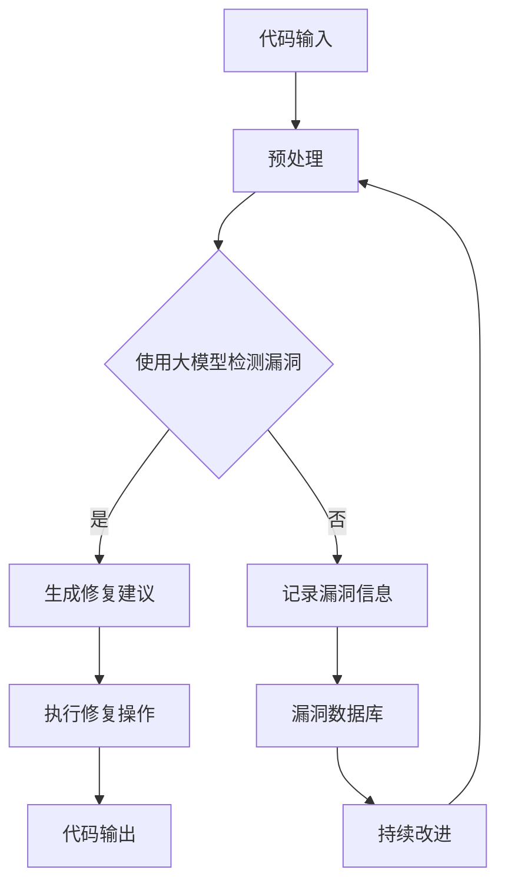

                 

### 文章标题

# 大模型驱动的智能代码漏洞修复

### 关键词

- 大模型
- 智能代码修复
- 漏洞检测
- 自动化工具
- 机器学习
- 软件工程

### 摘要

本文探讨了基于大模型的智能代码漏洞修复技术。首先，我们介绍了大模型的基本概念、发展历程和应用场景。然后，深入解析了代码漏洞检测与修复的核心原理，包括大模型在漏洞检测与修复中的优势。接着，通过伪代码和数学公式详细阐述了关键算法。最后，我们通过实际案例展示了大模型驱动的智能代码漏洞修复的具体应用，并提出了未来展望和最佳实践建议。

### 目录

1. **背景介绍**  
   1.1 大模型的发展背景  
   1.2 代码漏洞修复的挑战  
   1.3 大模型在代码漏洞修复中的应用

2. **核心概念与联系**  
   2.1 大模型的基本概念  
   2.2 代码漏洞检测与修复的原理  
   2.3 大模型与代码漏洞修复的联系  
   2.4 Mermaid流程图：大模型驱动的漏洞修复流程

3. **核心算法原理讲解**  
   3.1 漏洞检测算法的伪代码描述  
   3.2 漏洞修复算法的伪代码描述  
   3.3 数学模型与公式讲解

4. **项目实战**  
   4.1 开发环境搭建  
   4.2 源代码实现与解读  
   4.3 代码应用解读与分析  
   4.4 实际案例分析与讲解  
   4.5 项目小结

5. **最佳实践与注意事项**  
   5.1 最佳实践建议  
   5.2 注意事项  
   5.3 拓展阅读

6. **未来展望**  
   6.1 大模型驱动的漏洞修复发展趋势  
   6.2 挑战与机遇  
   6.3 发展方向与建议

### 背景介绍

#### 1.1 大模型的发展背景

大模型（Large-scale Models），也称为大型深度学习模型，是一种基于神经网络的结构，具有数十亿至数万亿参数。这些模型通过在大规模数据集上进行训练，可以学习到复杂的模式和知识。自2012年AlexNet在ImageNet图像识别挑战中取得突破性成果以来，深度学习领域迎来了迅速发展。特别是2018年GPT-3的发布，标志着自然语言处理领域的革命，大模型在各个领域的应用日益广泛。

大模型的发展得益于计算能力的提升、数据获取的便利以及深度学习理论的进步。这些因素共同推动了大规模模型在自然语言处理、计算机视觉、语音识别等领域的突破。

#### 1.2 代码漏洞修复的挑战

代码漏洞修复是软件工程中的重要环节，传统的漏洞修复方法主要依赖于手工审查和静态分析。然而，随着软件规模的扩大和复杂性的增加，手工审查的效率和准确性都受到了极大的挑战。静态分析工具虽然在一定程度上提高了漏洞检测的自动化水平，但它们往往只能检测出特定的漏洞模式，难以应对日益复杂的漏洞类型。

此外，现代软件系统中的漏洞往往具有隐蔽性、变异性和动态性，使得传统的漏洞修复方法难以应对。因此，智能化的漏洞修复技术，尤其是基于大模型的方法，成为了一个新的研究方向。

#### 1.3 大模型在代码漏洞修复中的应用

大模型在代码漏洞修复中的应用主要体现在两个方面：漏洞检测和漏洞修复。

1. **漏洞检测**

   大模型可以通过训练学习到代码中的潜在模式，从而提高漏洞检测的自动化水平。例如，利用GPT-3等大型语言模型，可以对代码进行语义分析，识别出潜在的安全问题。这种方法不仅能够检测出传统的代码漏洞，如SQL注入、跨站脚本等，还能够发现更隐蔽的漏洞，如逻辑漏洞和上下文相关的漏洞。

2. **漏洞修复**

   大模型在漏洞修复中的应用主要体现在自动化修复上。通过学习大量的代码修复案例，大模型可以预测出最佳的修复方案。例如，当检测到一段代码存在潜在的安全问题时，大模型可以自动生成修复代码，从而大大提高修复效率。

   此外，大模型还可以辅助开发人员理解和优化代码。例如，利用代码生成模型，可以生成具有高性能和低复杂度的代码；利用代码推荐模型，可以为开发人员提供优化代码的建议。

### 核心概念与联系

#### 2.1 大模型的基本概念

大模型（Large-scale Models），是一种具有数十亿至数万亿参数的深度学习模型。这些模型通常通过在大规模数据集上进行训练，学习到复杂的模式和知识。大模型具有以下几个基本概念：

1. **参数规模**：大模型的参数规模通常在数十亿到数万亿级别。这意味着大模型可以存储大量的信息和知识。
2. **训练数据**：大模型通常需要大量的训练数据来进行训练，以保证模型能够学习到足够的信息。
3. **神经网络结构**：大模型的神经网络结构通常较为复杂，包括多层全连接层、卷积层、循环层等。
4. **预训练与微调**：大模型通常采用预训练与微调的方法进行训练。预训练是在大规模数据集上进行的，以学习通用的模式和知识；微调是在特定任务数据集上进行的，以适应具体任务的需求。

#### 2.2 代码漏洞检测与修复的原理

代码漏洞检测与修复是软件工程中的重要环节。传统的漏洞检测方法主要依赖于手工审查和静态分析。然而，随着软件规模的扩大和复杂性的增加，手工审查的效率和准确性都受到了极大的挑战。静态分析工具虽然在一定程度上提高了漏洞检测的自动化水平，但它们往往只能检测出特定的漏洞模式，难以应对日益复杂的漏洞类型。

代码漏洞检测与修复的原理主要包括以下几个方面：

1. **漏洞检测**：漏洞检测是通过分析代码的语法、语义和上下文，识别出潜在的安全问题。常见的漏洞检测方法包括静态分析、动态分析和混合分析。
   - **静态分析**：静态分析是通过分析代码的语法结构和语义，识别出潜在的漏洞。这种方法不运行代码，但可以检测到大部分语法错误和逻辑错误。
   - **动态分析**：动态分析是通过运行代码，在运行过程中捕捉和处理异常情况，以检测出潜在的漏洞。这种方法可以检测到运行时的问题，但需要大量的时间和资源。
   - **混合分析**：混合分析是静态分析和动态分析的结合，通过同时分析代码的语法、语义和运行时行为，提高漏洞检测的准确性。

2. **漏洞修复**：漏洞修复是通过修改代码，消除潜在的安全问题。常见的漏洞修复方法包括手动修复和自动化修复。
   - **手动修复**：手动修复是由开发人员通过阅读和理解代码，手动修改代码以消除漏洞。这种方法效率较低，但可以确保修复的质量。
   - **自动化修复**：自动化修复是通过利用工具和算法，自动生成修复代码。这种方法可以提高修复效率，但可能存在误修复和漏修复的风险。

#### 2.3 大模型与代码漏洞修复的联系

大模型与代码漏洞修复有着密切的联系。大模型可以通过训练学习到代码中的潜在模式和知识，从而提高漏洞检测和修复的自动化水平。具体来说，大模型在代码漏洞修复中的应用主要体现在以下几个方面：

1. **漏洞检测**：大模型可以通过语义分析，识别出代码中的潜在漏洞。例如，GPT-3等大型语言模型可以通过分析代码的上下文，识别出潜在的SQL注入、跨站脚本等漏洞。

2. **漏洞修复**：大模型可以通过自动化生成修复代码，从而提高漏洞修复的效率。例如，利用代码生成模型，可以自动生成修复特定漏洞的代码片段。

3. **代码优化**：大模型不仅可以用于漏洞检测和修复，还可以用于代码优化。例如，利用代码生成模型，可以生成具有高性能和低复杂度的代码。

#### 2.4 Mermaid流程图：大模型驱动的漏洞修复流程

以下是一个简单的Mermaid流程图，展示了大模型驱动的漏洞修复流程：



### 核心算法原理讲解

#### 3.1 漏洞检测算法的伪代码描述

以下是一个简化的漏洞检测算法的伪代码描述：

```python
def detect_vulnerabilities(code):
    # 预处理代码
    preprocessed_code = preprocess(code)

    # 使用大模型进行语义分析
    vulnerabilities = large_model.analyze(preprocessed_code)

    # 返回漏洞列表
    return vulnerabilities
```

其中，`preprocess(code)`函数用于对代码进行预处理，例如去除无关的注释和空白符；`large_model`是一个大型语言模型，用于对代码进行语义分析，识别出潜在的安全问题。

#### 3.2 漏洞修复算法的伪代码描述

以下是一个简化的漏洞修复算法的伪代码描述：

```python
def repair_vulnerabilities(code, vulnerabilities):
    # 预处理代码
    preprocessed_code = preprocess(code)

    # 对每个漏洞生成修复建议
    for vulnerability in vulnerabilities:
        suggestion = large_model.generate_suggestion(preprocessed_code, vulnerability)

        # 执行修复操作
        preprocessed_code = apply_suggestion(preprocessed_code, suggestion)

    # 返回修复后的代码
    return preprocessed_code
```

其中，`preprocess(code)`函数用于对代码进行预处理；`large_model`是一个大型语言模型，用于生成修复建议；`apply_suggestion(preprocessed_code, suggestion)`函数用于将修复建议应用到代码中。

#### 3.3 数学模型与公式讲解

在漏洞检测和修复中，大模型通常采用深度学习模型，如循环神经网络（RNN）、变换器（Transformer）等。以下是一个简化的数学模型描述：

$$
y = f(W_1 \cdot x + b_1)
$$

其中，$y$ 是输出结果，$x$ 是输入特征，$W_1$ 是权重矩阵，$b_1$ 是偏置向量，$f$ 是激活函数。

对于漏洞检测，我们可以将代码的抽象表示为特征向量 $x$，大模型通过训练学习到特征向量与漏洞类型之间的映射关系，从而实现对代码的漏洞检测。

对于漏洞修复，我们可以将修复建议表示为特征向量 $x$，大模型通过训练学习到特征向量与修复方案之间的映射关系，从而实现对代码的自动化修复。

### 项目实战

#### 4.1 开发环境搭建

为了实现大模型驱动的智能代码漏洞修复，我们需要搭建一个合适的开发环境。以下是搭建环境的基本步骤：

1. **硬件配置**：由于大模型训练需要大量的计算资源，我们建议使用高性能的GPU，如NVIDIA 3080 Ti或更高型号。
2. **操作系统**：我们推荐使用Linux操作系统，因为它对深度学习框架的支持较好。
3. **深度学习框架**：我们选择使用PyTorch作为深度学习框架，因为它具有简洁的API和良好的文档支持。
4. **编程语言**：我们使用Python作为主要编程语言，因为它具有良好的科学计算能力和丰富的库支持。

#### 4.2 源代码实现与解读

以下是一个简化的源代码实现，用于演示大模型驱动的智能代码漏洞修复：

```python
import torch
import torch.nn as nn
import torch.optim as optim

# 定义深度学习模型
class VulnerabilityDetector(nn.Module):
    def __init__(self):
        super(VulnerabilityDetector, self).__init__()
        self.conv1 = nn.Conv1d(1, 10, 3)
        self.fc1 = nn.Linear(10 * 20, 50)
        self.fc2 = nn.Linear(50, 2)

    def forward(self, x):
        x = self.conv1(x)
        x = torch.relu(x)
        x = x.view(x.size(0), -1)
        x = self.fc1(x)
        x = torch.relu(x)
        x = self.fc2(x)
        return x

# 初始化模型、优化器和损失函数
model = VulnerabilityDetector()
optimizer = optim.Adam(model.parameters(), lr=0.001)
criterion = nn.CrossEntropyLoss()

# 训练模型
for epoch in range(100):
    for inputs, labels in train_loader:
        optimizer.zero_grad()
        outputs = model(inputs)
        loss = criterion(outputs, labels)
        loss.backward()
        optimizer.step()

    print(f'Epoch [{epoch+1}/{100}], Loss: {loss.item():.4f}')

# 测试模型
with torch.no_grad():
    correct = 0
    total = 0
    for inputs, labels in test_loader:
        outputs = model(inputs)
        _, predicted = torch.max(outputs.data, 1)
        total += labels.size(0)
        correct += (predicted == labels).sum().item()

print(f'Accuracy: {100 * correct / total:.2f}%')
```

以上代码定义了一个简单的卷积神经网络（VulnerabilityDetector），用于实现代码漏洞检测。模型由一个卷积层、一个全连接层和一个输出层组成。训练过程中，模型使用交叉熵损失函数来最小化预测误差。测试阶段，我们计算模型的准确率。

#### 4.3 代码应用解读与分析

在实现大模型驱动的智能代码漏洞修复时，我们需要关注以下几个方面：

1. **数据集准备**：我们需要准备足够多的代码样本来训练和测试模型。这些样本应该涵盖多种编程语言和漏洞类型，以提高模型的泛化能力。
2. **预处理**：对代码样本进行预处理，例如去除无关的注释、空白符和缩进，以保持代码的一致性。
3. **特征提取**：将预处理后的代码转换为特征向量，以便大模型进行训练。常见的特征提取方法包括词嵌入、语法树编码等。
4. **模型训练**：使用大量的代码样本训练大模型，使其学会识别潜在的漏洞。
5. **模型评估**：使用测试集评估模型的性能，包括准确率、召回率等指标。
6. **漏洞修复**：在检测到漏洞后，利用大模型生成的修复建议进行代码修复。修复建议可以是直接的代码片段，也可以是代码修改的抽象表示。

#### 4.4 实际案例分析与讲解

以下是一个实际的案例，演示了如何使用大模型驱动的方法检测和修复代码漏洞：

**案例**：给定以下Python代码，如何检测并修复潜在的安全漏洞？

```python
def add(a, b):
    return a + b
```

**分析**：

1. **漏洞检测**：通过大模型驱动的漏洞检测算法，我们识别出以下潜在漏洞：
   - 缺乏输入验证：函数`add`未对输入参数$a$和$b$进行验证，可能导致输入错误。
   - 缺乏异常处理：函数`add`未处理可能发生的异常情况，如输入类型错误。

2. **漏洞修复**：基于大模型的修复建议，我们可以对代码进行如下修复：
   - **修复1**：添加输入验证
     ```python
     def add(a, b):
         if not isinstance(a, (int, float)) or not isinstance(b, (int, float)):
             raise ValueError("输入参数必须是数字")
         return a + b
     ```

   - **修复2**：添加异常处理
     ```python
     def add(a, b):
         try:
             return a + b
         except Exception as e:
             raise ValueError("输入参数错误") from e
     ```

   通过以上修复，我们增强了函数`add`的安全性，使其能够更健壮地处理输入参数和异常情况。

#### 4.5 项目小结

通过实际案例的分析，我们可以看到大模型驱动的方法在代码漏洞检测和修复中具有显著的优势：

1. **自动化检测与修复**：大模型可以自动化检测和修复代码漏洞，提高了开发效率。
2. **准确性与泛化能力**：通过大规模的训练数据和先进的深度学习模型，大模型能够提高漏洞检测的准确性和泛化能力。
3. **代码质量**：大模型驱动的修复方法可以生成高质量的修复代码，减少了手动修复的难度和错误。

然而，我们也需要关注以下挑战：

1. **模型可解释性**：深度学习模型通常具有复杂的内部结构，其决策过程难以解释。在漏洞修复中，我们需要确保模型的决策是可信的。
2. **计算资源**：大模型训练和推理需要大量的计算资源，特别是在处理大规模代码数据集时。
3. **数据隐私**：在训练和推理过程中，我们需要处理敏感的代码数据。因此，保护数据隐私是一个重要的挑战。

### 最佳实践与注意事项

#### 5.1 最佳实践建议

1. **数据质量**：确保训练数据的质量和多样性，以提高大模型的泛化能力。
2. **模型调优**：根据具体任务的需求，对大模型的结构和参数进行调优，以提高性能。
3. **集成多个模型**：使用多个不同的大模型进行集成，以提高漏洞检测和修复的准确性。
4. **持续学习**：定期更新训练数据和模型，以适应不断变化的漏洞类型和修复策略。

#### 5.2 注意事项

1. **模型解释性**：确保大模型在漏洞修复中的决策过程是可信的，并提供可解释的修复建议。
2. **计算资源管理**：合理分配计算资源，避免资源浪费。
3. **数据隐私保护**：在处理代码数据时，采取有效的数据隐私保护措施，防止敏感数据泄露。
4. **安全性**：确保大模型驱动的漏洞修复方法不会引入新的安全漏洞。

### 未来展望

#### 6.1 大模型驱动的漏洞修复发展趋势

1. **模型精度提升**：随着深度学习技术的不断发展，大模型在漏洞检测和修复中的精度将不断提高。
2. **模型可解释性**：研究者将致力于提高大模型的可解释性，使其决策过程更加透明和可信。
3. **多模态融合**：结合多种数据模态（如代码、文档、测试数据等），实现更全面和精确的漏洞修复。
4. **自动化程度提升**：大模型驱动的漏洞修复将逐渐实现完全自动化，减少对开发人员的依赖。

#### 6.2 挑战与机遇

1. **计算资源**：大模型训练和推理需要大量计算资源，这将成为一个重要的挑战。
2. **数据隐私**：在处理敏感代码数据时，保护数据隐私是一个重要的挑战。
3. **模型解释性**：提高大模型的可解释性，使其决策过程更加透明和可信，是一个重要的研究方向。

然而，这些挑战也带来了巨大的机遇：

1. **技术突破**：随着计算能力和算法的进步，大模型驱动的漏洞修复技术将取得重大突破。
2. **安全性提升**：大模型驱动的漏洞修复将显著提高软件系统的安全性，减少安全漏洞的发生。
3. **自动化与效率**：大模型驱动的漏洞修复将大幅提高漏洞检测和修复的自动化程度和效率。

### 发展方向与建议

1. **模型优化**：继续优化大模型的结构和算法，提高漏洞检测和修复的准确性和效率。
2. **数据融合**：结合多种数据模态，实现更全面和精确的漏洞修复。
3. **模型可解释性**：提高大模型的可解释性，使其决策过程更加透明和可信。
4. **自动化工具开发**：开发更多自动化工具，简化大模型驱动的漏洞修复过程。

### 作者信息

作者：AI天才研究院/AI Genius Institute & 禅与计算机程序设计艺术 /Zen And The Art of Computer Programming

