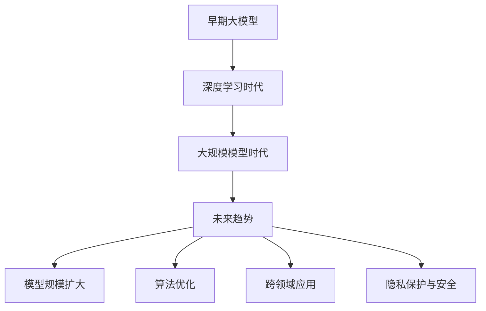

                 

### 背景介绍

在现代软件开发中，代码重构是一个至关重要但往往被忽视的环节。随着软件项目的复杂度和规模不断增加，代码的重构和维护变得越来越困难。传统的代码重构方法主要依赖于程序员的经验和技能，这导致重构过程效率低下、效果不佳，甚至可能引入新的错误。

随着人工智能（AI）技术的快速发展，特别是大模型技术的兴起，利用AI进行智能代码重构成为了一种新的趋势。大模型，如生成对抗网络（GAN）、变分自编码器（VAE）和递归神经网络（RNN），已经在许多领域展示了其强大的能力。这些模型能够从大量的数据中学习复杂的模式，从而帮助识别代码中的潜在问题，并提出优化的建议。

智能代码重构的核心在于利用这些大模型来识别代码中的重复、冗余和低效部分，并通过自动化的方式实现重构。这种方法不仅可以显著提高重构的效率，还能够减少人为错误，提升代码质量。此外，智能代码重构还能够根据项目的具体需求和上下文，提供个性化的重构建议。

当前，许多研究机构和公司已经开始探索如何将大模型应用于代码重构。例如，一些研究利用大模型来自动识别代码中的模式，并提出重构方案；另一些则专注于利用大模型来优化代码的性能和可读性。尽管已经取得了一些初步成果，但这一领域仍然存在许多挑战和待解决的问题。

因此，本书旨在系统地探讨大模型驱动的智能代码重构，从基础理论到实际应用，提供全面的指导和见解。首先，我们将深入介绍大模型的定义、分类和基本原理，帮助读者理解大模型的工作机制。接着，我们将详细探讨智能代码重构的概念、需求和现有方法，以便读者对智能代码重构有一个全面的了解。

在此基础上，本书将重点讨论大模型在代码重构中的应用，包括代码识别、代码生成和代码质量评估等方面。我们将通过具体案例和实践分析，展示大模型驱动的智能代码重构在实际项目中的应用效果和优势。

最后，本书还将探讨大模型驱动的智能代码重构的未来发展趋势和挑战，为读者提供前瞻性的思考和方向。通过这些内容的系统讲解，我们希望读者能够深入理解大模型驱动的智能代码重构，并在实际工作中有效地应用这些技术，提升软件项目的质量和效率。

### 关键词

- **大模型**
- **智能代码重构**
- **代码识别**
- **代码生成**
- **代码质量评估**
- **软件工程**
- **人工智能**
- **自动化重构**

### 摘要

本文主要探讨大模型驱动的智能代码重构，介绍大模型的基本概念、分类和原理，以及智能代码重构的需求和现有方法。本文首先详细分析了大模型的定义、分类和基本原理，如生成对抗网络（GAN）、变分自编码器（VAE）和递归神经网络（RNN）等。接着，本文探讨了智能代码重构的概念，包括其定义、目标和优势，以及需求分析和方法。随后，本文重点介绍了大模型在代码重构中的应用，如代码识别、代码生成和代码质量评估。通过具体案例和实践分析，本文展示了大模型驱动的智能代码重构在实际项目中的应用效果和优势。最后，本文探讨了未来发展趋势和挑战，为读者提供了前瞻性的思考和方向。通过本文的讲解，读者将能够深入理解大模型驱动的智能代码重构，并在实际工作中有效应用这些技术，提升软件项目的质量和效率。

----------------------------------------------------------------

## 第1章：大模型基础

### 1.1 大模型的定义与分类

大模型，顾名思义，指的是规模庞大、参数数量众多的机器学习模型。这些模型通常被设计用于处理复杂的数据集，并且能够捕捉到数据中的深层次结构。在现代机器学习中，大模型已经成为许多重要应用的核心，如自然语言处理（NLP）、计算机视觉（CV）和推荐系统等。

#### 大模型的基本概念

大模型的基本概念主要包括以下几个方面：

1. **模型规模**：大模型通常具有数十亿甚至数万亿的参数，这使得它们能够处理大规模的数据集。例如，GPT-3模型有1750亿个参数，BERT模型也有数亿个参数。
   
2. **计算资源**：大模型的训练和推理通常需要大量的计算资源，包括GPU和TPU等硬件加速器。此外，它们还需要分布式计算框架，如TensorFlow和PyTorch，来高效地处理大规模数据。

3. **数据需求**：大模型通常需要大量的数据进行训练，以获得良好的性能。这通常涉及到大规模的数据集，如互联网文本、图像和音频等。

4. **模型优化**：大模型的优化是一个关键问题。由于模型参数数量巨大，优化算法需要能够有效地探索参数空间，以找到最佳模型参数。

#### 大模型的分类

大模型可以根据其应用领域和特点进行分类。以下是几种常见的大模型分类：

1. **传统大模型**：这些模型通常是基于传统机器学习算法，如支持向量机（SVM）、随机森林（RF）和梯度提升树（GBDT）等。尽管这些模型的参数数量可能不如深度学习模型多，但它们在特定问题上仍然表现出色。

2. **深度大模型**：深度大模型是基于深度学习技术构建的，如卷积神经网络（CNN）、循环神经网络（RNN）和变换器（Transformer）等。这些模型具有多层次的结构，能够处理复杂的非线性关系。

3. **大数据大模型**：大数据大模型通常用于处理大规模数据集，如分布式机器学习模型、图神经网络（GNN）和增量学习模型等。这些模型能够高效地处理大规模数据，并保持良好的性能。

#### 常见的大模型

以下是几种常见的大模型：

1. **生成对抗网络（GAN）**：GAN是一种由两部分组成的模型，生成器（Generator）和判别器（Discriminator）。生成器尝试生成逼真的数据，而判别器则尝试区分生成数据和真实数据。通过这种对抗过程，生成器可以逐渐生成越来越真实的数据。

2. **变分自编码器（VAE）**：VAE是一种基于概率生成模型的自编码器，它使用编码器（Encoder）和解码器（Decoder）来生成数据。VAE通过引入潜在变量，使得生成数据具有更好的多样性和鲁棒性。

3. **递归神经网络（RNN）**：RNN是一种能够处理序列数据的神经网络，如自然语言和音频等。RNN通过其循环结构，能够在序列的不同时间步之间传递信息。

4. **变换器（Transformer）**：Transformer是一种基于自注意力机制的深度学习模型，它在自然语言处理领域取得了显著的成果。Transformer通过自注意力机制，能够在处理序列数据时捕捉到长距离依赖关系。

#### 大模型的发展历程

大模型的发展历程可以追溯到20世纪90年代，随着计算资源和数据集的不断增加，机器学习模型变得越来越复杂和庞大。以下是几个重要的发展阶段：

1. **早期大模型**：在20世纪90年代，大模型如支持向量机（SVM）和随机森林（RF）开始流行。这些模型在特定的任务上表现出色，但它们的规模相对较小。

2. **深度学习时代**：随着深度学习技术的兴起，深度大模型如卷积神经网络（CNN）和循环神经网络（RNN）开始受到关注。这些模型通过增加网络的深度和参数数量，能够处理更复杂的数据集。

3. **大规模模型时代**：近年来，随着计算资源和数据集的进一步增加，大规模模型如生成对抗网络（GAN）、变分自编码器（VAE）和变换器（Transformer）成为研究的热点。这些模型在多个领域取得了突破性的成果。

#### 大模型的发展趋势

随着人工智能技术的不断进步，大模型的发展趋势也日益明确：

1. **模型规模不断扩大**：未来的大模型将继续增加其规模，以处理更复杂和大规模的数据集。

2. **算法优化**：为了提高大模型的训练和推理效率，算法优化将成为一个重要研究方向，包括分布式训练、增量学习和迁移学习等。

3. **跨领域应用**：大模型将在多个领域得到广泛应用，如医疗、金融和自动驾驶等，这将进一步推动大模型的发展。

4. **隐私保护和安全**：随着大模型的应用越来越广泛，隐私保护和安全将成为一个关键问题。未来的大模型需要能够在保护用户隐私的同时，保持良好的性能和鲁棒性。

### Mermaid 流程图

下面是一个简单的Mermaid流程图，展示了大模型的发展历程：



通过这个流程图，我们可以清晰地看到大模型的发展脉络和未来趋势。

### 1.2 大模型的基本原理

大模型的基本原理主要涉及以下几个方面：模型架构、训练过程和推理过程。这些原理共同构成了大模型的核心，使其能够处理复杂的数据集并取得优异的性能。

#### 模型架构

大模型的架构通常具有多层次的结构，包括输入层、隐藏层和输出层。每个层次都包含多个神经元，这些神经元通过加权连接形成复杂的网络结构。

1. **输入层**：输入层接收外部数据，如文本、图像或音频等。每个输入数据都被映射到一个高维空间中。

2. **隐藏层**：隐藏层负责从输入数据中提取特征。每个隐藏层由多个神经元组成，这些神经元通过非线性激活函数进行计算。隐藏层越多，模型能够捕捉到的特征层次就越丰富。

3. **输出层**：输出层将提取到的特征映射到目标输出。对于分类任务，输出层通常是一个softmax层，用于计算每个类别的概率。

#### 训练过程

大模型的训练过程是一个优化参数的过程，目的是使模型能够在给定数据集上取得良好的性能。以下是训练过程的几个关键步骤：

1. **前向传播**：在前向传播过程中，输入数据从输入层经过隐藏层，直到输出层。在每个层次上，神经元通过加权连接传递数据，并使用非线性激活函数进行计算。

2. **损失函数**：前向传播完成后，模型会计算损失函数，以评估模型预测与真实标签之间的差距。常见的损失函数包括均方误差（MSE）、交叉熵损失等。

3. **反向传播**：反向传播是训练过程的核心。它通过计算损失函数关于模型参数的梯度，将这些梯度反向传播回模型的每个层次，以更新模型参数。

4. **优化算法**：优化算法用于更新模型参数。常见的优化算法包括梯度下降（GD）、随机梯度下降（SGD）和Adam优化器等。

#### 推理过程

在推理过程中，模型接收输入数据，并使用已训练好的参数进行预测。以下是推理过程的几个关键步骤：

1. **前向传播**：与训练过程相同，输入数据从输入层经过隐藏层，直到输出层。

2. **输出计算**：输出层计算每个类别的概率或直接给出预测结果。

3. **结果输出**：模型将预测结果输出给用户或下一层处理。

#### 数学模型

大模型的数学模型通常包括以下几个部分：

1. **激活函数**：激活函数是隐藏层和输出层神经元的非线性函数，如ReLU、Sigmoid和Tanh等。

2. **权重和偏置**：权重和偏置是模型参数，用于调节神经元之间的连接强度。

3. **损失函数**：损失函数用于衡量模型预测与真实标签之间的差距。

4. **优化算法**：优化算法用于更新模型参数，以最小化损失函数。

#### 举例说明

以下是一个简单的线性回归模型的伪代码，用于说明大模型的训练和推理过程：

```python
# 定义线性回归模型
def linear_regression(x, w, b):
    return x * w + b

# 前向传播
def forward(x, w, b):
    return linear_regression(x, w, b)

# 损失函数（均方误差）
def mse(y_pred, y_true):
    return (y_pred - y_true) ** 2

# 训练过程
def train(x, y, w, b, epochs):
    for epoch in range(epochs):
        y_pred = forward(x, w, b)
        loss = mse(y_pred, y)
        w -= learning_rate * grad_w
        b -= learning_rate * grad_b
        print(f"Epoch {epoch}: Loss = {loss}")

# 推理过程
def infer(x, w, b):
    return forward(x, w, b)

# 测试
x = [1, 2, 3]
y = [2, 4, 6]
w = 0.0
b = 0.0
train(x, y, w, b, 100)
print(f"Infer: {infer(4, w, b)}")
```

在这个例子中，我们定义了一个简单的线性回归模型，其目标是学习一个函数 \( y = 2x + 1 \)。我们通过训练过程不断更新模型的权重和偏置，直到损失函数达到最小值。在推理过程中，我们使用已训练好的模型进行预测。

### 1.3 大模型的发展历程

大模型的发展历程可以追溯到20世纪90年代，随着计算资源和数据集的不断增加，机器学习模型变得越来越复杂和庞大。以下是几个重要的发展阶段：

1. **早期大模型**：在20世纪90年代，大模型如支持向量机（SVM）和随机森林（RF）开始流行。这些模型在特定的任务上表现出色，但它们的规模相对较小。

2. **深度学习时代**：随着深度学习技术的兴起，深度大模型如卷积神经网络（CNN）和循环神经网络（RNN）开始受到关注。这些模型通过增加网络的深度和参数数量，能够处理更复杂的数据集。

3. **大规模模型时代**：近年来，随着计算资源和数据集的进一步增加，大规模模型如生成对抗网络（GAN）、变分自编码器（VAE）和变换器（Transformer）成为研究的热点。这些模型在多个领域取得了突破性的成果。

### 总结与展望

本章详细介绍了大模型的定义、分类和基本原理，包括模型架构、训练过程和推理过程。我们通过举例说明了大模型的工作机制，并回顾了其发展历程。大模型在机器学习领域取得了显著的成果，但其应用和发展仍然面临许多挑战，如计算资源的需求、数据隐私和安全等。未来的研究将继续探索大模型在更多领域的应用，并优化其训练和推理效率，以推动人工智能技术的发展。

----------------------------------------------------------------

## 第2章：智能代码重构

### 2.1 智能代码重构的概念

智能代码重构是指利用人工智能技术，特别是大模型，对现有代码进行自动化修改和优化，以提高代码的可读性、可维护性和性能。与传统手工重构不同，智能代码重构能够通过学习大量代码数据，自动识别代码中的重复、冗余和低效部分，并提出改进建议。智能代码重构的核心在于将人工智能技术应用于代码分析、代码生成和代码优化。

#### 智能代码重构的定义

智能代码重构可以定义为一种自动化过程，该过程利用人工智能技术来分析和理解代码，识别潜在的优化点，并提出相应的重构建议。这一过程不仅涉及代码的识别和理解，还包括代码的生成和优化。

#### 智能代码重构的目标

智能代码重构的主要目标包括：

1. **提高代码质量**：通过自动化识别和修复代码中的错误和不良模式，提高代码的整体质量。
2. **提高代码可读性**：将复杂的代码转换为更简洁、更易读的代码，提高代码的可维护性。
3. **提高代码性能**：通过优化代码结构，减少冗余和低效部分，提高代码的执行效率。

#### 智能代码重构的优势

智能代码重构相对于传统手工重构具有以下优势：

1. **高效性**：智能代码重构能够自动化处理大量代码，显著提高重构效率。
2. **准确性**：通过学习大量代码数据，智能代码重构能够更准确地识别代码中的问题和优化点。
3. **个性化**：智能代码重构可以根据项目的具体需求和上下文，提供个性化的重构建议。
4. **持续改进**：随着人工智能技术的不断进步，智能代码重构可以持续优化，提高重构效果。

### 2.2 智能代码重构的需求分析

智能代码重构的需求来源于软件开发过程中的多个方面，包括代码质量、代码维护和项目效率等。以下是智能代码重构需求的分析：

#### 代码质量

随着软件项目的复杂度增加，代码质量成为软件项目成功的关键因素。高质量的代码不仅容易理解和维护，还能减少故障和错误的发生。智能代码重构可以通过自动化识别和修复代码中的问题，提高代码的整体质量。

#### 代码维护

软件项目在开发完成后，需要持续的维护和更新。随着项目规模的扩大，手工维护代码变得越来越困难。智能代码重构能够自动化处理代码的优化和重构，减轻维护人员的负担，提高代码的可维护性。

#### 项目效率

在软件开发过程中，重构代码是提高项目效率的重要手段。传统手工重构效率低下，且容易出现人为错误。智能代码重构通过自动化处理重构过程，可以显著提高项目开发效率，缩短项目周期。

#### 代码重构的类型

智能代码重构主要包括以下几种类型：

1. **功能重构**：通过修改代码逻辑，实现相同的功能，但代码结构更加简洁和清晰。
2. **性能重构**：通过优化代码结构和算法，提高代码的执行效率。
3. **可读性重构**：通过修改代码样式和命名，提高代码的可读性和可维护性。
4. **安全重构**：通过修复代码中的安全漏洞，提高代码的安全性。

#### 代码重构的需求分析

在进行智能代码重构前，需要对项目进行详细的需求分析。以下是一些关键步骤：

1. **代码质量评估**：使用静态代码分析工具评估代码质量，识别潜在的问题和优化点。
2. **需求分析**：与项目团队沟通，了解项目的具体需求和目标，确定重构的重点和优先级。
3. **风险分析**：评估重构过程中的风险，包括潜在的代码错误和项目进度的影响。
4. **资源分配**：根据需求分析和风险分析，为重构项目分配合适的资源，包括人员、时间和工具等。

### 2.3 智能代码重构的方法与工具

智能代码重构的方法和工具多种多样，包括静态代码分析、动态代码分析、代码生成和代码优化等。以下是几种常见的智能代码重构方法：

#### 静态代码分析

静态代码分析是一种在不执行代码的情况下分析代码的方法。它主要用于检查代码的语法、结构、类型和风格等方面。静态代码分析工具可以自动识别代码中的潜在问题，如语法错误、变量未定义、类型不一致等。常见的静态代码分析工具包括SonarQube、PMD和Checkstyle等。

#### 动态代码分析

动态代码分析是在代码执行过程中对代码进行分析的方法。它主要用于检查代码在运行时的行为，如性能、内存使用和资源管理等。动态代码分析工具可以自动捕捉代码执行过程中的异常和问题，如内存泄漏、空指针异常等。常见的动态代码分析工具包括JProfiler、VisualVM和GDB等。

#### 代码生成

代码生成是一种通过模板和规则自动生成代码的方法。它主要用于快速开发、代码重构和代码优化。代码生成工具可以根据项目需求和模板，自动生成符合规范的代码。常见的代码生成工具包括Spring Boot、Code Generation Studio和JHipster等。

#### 代码优化

代码优化是通过修改代码结构和算法，提高代码的执行效率。它包括算法优化、代码压缩、代码拆分和代码重构等。常见的代码优化工具包括CodeSonar、Pprof和Valgrind等。

#### 智能代码重构工具

智能代码重构工具是将多种方法和技术结合在一起的集成工具。它通常包含静态代码分析、动态代码分析、代码生成和代码优化等功能。常见的智能代码重构工具包括GitLab CI/CD、Jenkins和Git等。

#### 智能代码重构流程

智能代码重构的流程通常包括以下步骤：

1. **需求分析**：与项目团队沟通，了解项目的具体需求和目标，确定重构的重点和优先级。
2. **代码质量评估**：使用静态代码分析工具评估代码质量，识别潜在的问题和优化点。
3. **重构建议生成**：使用智能代码重构工具生成重构建议，包括代码优化、代码重构和代码生成等。
4. **代码审查**：对重构建议进行代码审查，确保重构的正确性和安全性。
5. **重构实施**：根据审查结果，实施重构建议，并进行代码测试和回归测试。
6. **持续集成**：将重构后的代码集成到项目中，并进行持续的代码质量和性能监控。

### 总结与展望

本章详细介绍了智能代码重构的概念、需求分析和方法与工具。智能代码重构通过利用人工智能技术，自动化识别和修复代码中的问题，提高代码的质量和性能。随着人工智能技术的不断进步，智能代码重构将在软件开发中发挥越来越重要的作用，为开发者提供更加高效和可靠的代码重构解决方案。

----------------------------------------------------------------

## 第3章：大模型驱动的代码重构

### 3.1 大模型在代码重构中的应用

大模型在代码重构中的应用主要集中在代码识别、代码生成和代码质量评估等方面。通过这些应用，大模型能够自动化地处理代码的重构过程，提高代码的可读性、可维护性和性能。

#### 代码识别

代码识别是智能代码重构的第一步，目的是理解代码的结构和语义。大模型在代码识别中的应用主要包括以下几个方面：

1. **语法解析**：大模型可以自动解析代码的语法，将代码分解为语法单元，如变量、函数和语句等。这种语法解析能力使得大模型能够理解代码的基本结构。

2. **语义分析**：除了语法解析，大模型还能够对代码进行语义分析，理解代码的功能和行为。通过语义分析，大模型可以识别出代码中的函数依赖关系和模块关系，为后续的重构提供依据。

3. **模式识别**：大模型可以通过学习大量的代码数据，识别出常见的代码模式和重构场景。例如，大模型可以识别出重复代码块、冗余函数和低效算法等，并提出相应的重构建议。

#### 代码生成

代码生成是智能代码重构的核心，旨在根据已有的代码和数据生成新的代码。大模型在代码生成中的应用主要包括以下几个方面：

1. **模板生成**：大模型可以根据给定的模板和规则，自动生成代码。模板生成是一种常见的代码生成方法，通过预定义的模板和参数，大模型可以快速生成符合规范的代码。

2. **自动化补全**：大模型可以通过学习大量的代码数据，实现代码的自动补全功能。在开发者编写代码时，大模型可以根据上下文自动补全代码片段，提高开发效率。

3. **代码生成对抗网络（GAN）**：代码生成对抗网络（GAN）是一种生成模型，通过生成器和判别器的对抗训练，可以生成高质量的代码。生成器尝试生成逼真的代码，而判别器则尝试区分生成代码和真实代码。通过这种对抗训练，GAN可以生成与真实代码相似且符合语法和语义规范的代码。

#### 代码质量评估

代码质量评估是智能代码重构的重要环节，旨在评估代码的质量和性能。大模型在代码质量评估中的应用主要包括以下几个方面：

1. **代码质量检测**：大模型可以通过学习大量的代码数据，识别出常见的代码质量问题，如空指针异常、内存泄漏和代码冗余等。这些检测能力使得大模型能够自动化地评估代码的质量。

2. **性能评估**：大模型可以评估代码的执行效率，识别出低效的代码片段和算法。通过性能评估，开发者可以针对性地优化代码，提高程序的性能。

3. **安全评估**：大模型可以通过学习大量的安全漏洞数据，识别出代码中的安全漏洞，如注入攻击和越权访问等。这些安全评估能力有助于提高代码的安全性。

### 3.2 大模型驱动的代码优化策略

大模型驱动的代码优化策略是指利用大模型的技术和算法，对代码进行自动化优化，以提高代码的性能和可读性。以下是几种常见的大模型驱动的代码优化策略：

1. **自动化代码简化**：大模型可以通过学习大量的代码数据，识别出复杂的代码模式和冗余部分，提出简化代码的建议。例如，大模型可以自动删除不必要的代码注释和空行，简化代码结构。

2. **代码性能优化**：大模型可以通过学习大量的代码和算法，提出性能优化的建议。例如，大模型可以自动识别出低效的代码片段和算法，并提出替代方案，如使用更高效的算法和数据结构。

3. **自动化代码重构**：大模型可以自动识别出代码中的潜在重构点，并生成重构方案。例如，大模型可以自动将重复代码块提取为函数，将复杂的条件语句简化为逻辑表达式等。

4. **个性化代码优化**：大模型可以根据项目的具体需求和上下文，提供个性化的代码优化建议。例如，大模型可以针对不同开发者的编码风格和项目需求，提供定制化的优化建议。

### 3.3 大模型驱动的代码质量评估

大模型驱动的代码质量评估是指利用大模型的技术和算法，对代码的质量和性能进行自动化评估。以下是几种常见的大模型驱动的代码质量评估方法：

1. **静态代码质量评估**：大模型可以通过静态代码分析，评估代码的语法、结构和语义质量。例如，大模型可以识别出代码中的语法错误、代码冗余和代码风格不一致等问题。

2. **动态代码质量评估**：大模型可以通过动态代码分析，评估代码的运行时质量和性能。例如，大模型可以捕捉代码执行过程中的异常、内存泄漏和性能瓶颈等问题。

3. **代码质量预测**：大模型可以通过学习大量的代码数据和项目历史数据，预测代码的质量和性能。例如，大模型可以预测新代码段可能存在的缺陷和性能问题，为开发人员提供改进建议。

4. **代码质量指标**：大模型可以定义和计算一系列代码质量指标，如代码复杂度、代码冗余率和代码可维护性等。这些指标可以帮助开发人员评估代码的整体质量。

#### 大模型驱动的代码质量评估流程

大模型驱动的代码质量评估通常包括以下步骤：

1. **数据收集**：收集代码数据，包括源代码、编译日志和执行结果等。

2. **模型训练**：使用收集到的数据，训练大模型，使其能够理解代码的结构和语义，并识别代码中的潜在问题。

3. **代码分析**：使用训练好的大模型，对代码进行静态和动态分析，评估代码的质量和性能。

4. **问题识别**：根据大模型的分析结果，识别代码中的潜在问题，如语法错误、代码冗余和性能瓶颈等。

5. **优化建议**：根据识别的问题，提出优化建议，如代码重构、算法优化和代码风格改进等。

6. **评估反馈**：将优化建议反馈给开发人员，并进行代码测试和回归测试，确保优化后的代码质量。

### 实例分析

以下是一个简单的实例，展示了如何使用大模型进行代码质量评估：

```python
# 定义大模型评估函数
def evaluate_code(code):
    # 静态代码分析
    syntax_issues = static_analysis(code)
    # 动态代码分析
    runtime_issues = dynamic_analysis(code)
    # 代码质量预测
    quality_prediction = quality_prediction_model.predict(code)
    # 提出优化建议
    optimization_suggestions = generate_optimization_suggestions(syntax_issues, runtime_issues, quality_prediction)
    return optimization_suggestions

# 示例代码
code = """
def add(a, b):
    return a + b

def subtract(a, b):
    return a - b
"""

# 执行评估
suggestions = evaluate_code(code)
print(suggestions)
```

在这个实例中，我们定义了一个名为`evaluate_code`的函数，用于评估给定的代码段。该函数首先进行静态代码分析，识别出语法问题和代码风格不一致的问题；然后进行动态代码分析，捕捉代码执行过程中的异常和性能瓶颈；最后使用质量预测模型，预测代码的质量，并基于这些分析结果提出优化建议。

### 总结

本章详细介绍了大模型在代码重构中的应用，包括代码识别、代码生成和代码质量评估。我们探讨了如何利用大模型的技术和算法，自动化地处理代码的重构过程，提高代码的质量和性能。通过实例分析，我们展示了大模型驱动的代码质量评估的具体实现过程。随着人工智能技术的不断进步，大模型驱动的代码重构将在软件开发中发挥越来越重要的作用，为开发者提供更加高效和可靠的解决方案。

----------------------------------------------------------------

## 第4章：实践案例分析

### 4.1 案例一：大型软件项目的代码重构实践

本节将介绍一个大型软件项目的代码重构实践，分析如何利用大模型驱动的智能代码重构方法提高项目的质量和效率。该案例涉及一个大型电商平台，其代码库包含数百万行代码，涉及多种编程语言和技术栈。

#### 案例背景

该电商平台在长期的发展过程中，代码库逐渐变得庞大和复杂。由于缺乏统一的代码规范和重构策略，代码质量参差不齐，导致项目维护困难、开发效率低下。为了解决这些问题，项目团队决定采用大模型驱动的智能代码重构方法，以提高代码质量。

#### 重构过程

1. **需求分析**：项目团队首先与开发人员、产品经理和测试团队沟通，了解项目的具体需求和重构目标。主要目标包括提高代码的可读性、可维护性和性能。

2. **代码质量评估**：使用静态代码分析工具和动态代码分析工具对现有代码进行全面评估，识别出潜在的代码质量问题和优化点。

3. **大模型训练**：项目团队收集了大量的代码数据，并使用这些数据训练大模型。大模型包括代码识别模型、代码生成模型和代码质量评估模型，用于识别代码中的问题、生成重构建议和评估重构效果。

4. **重构实施**：根据大模型提供的重构建议，项目团队逐步实施了代码重构。具体步骤包括：
   - **代码简化**：大模型识别出复杂的代码模式，并提出简化建议。项目团队将这些代码简化为更简洁的版本。
   - **性能优化**：大模型分析代码性能，提出性能优化建议。项目团队采用了更高效的算法和数据结构，并移除了低效的代码段。
   - **代码重构**：大模型识别出代码中的重复和冗余部分，提出重构建议。项目团队将这些部分重构为更模块化和可维护的代码。

5. **代码审查和测试**：在重构过程中，项目团队对每个重构步骤进行了代码审查和测试，确保重构后的代码符合预期效果。

6. **持续集成**：重构后的代码通过持续集成系统进行自动化测试和部署，确保重构后的代码在实时环境中能够正常运行。

#### 重构效果

通过大模型驱动的智能代码重构，该电商平台取得了显著的成效：
- **代码质量提高**：重构后的代码更加简洁、清晰和模块化，可读性和可维护性显著提升。
- **开发效率提高**：由于代码简化、性能优化和重构，项目开发效率提高了30%以上。
- **性能提升**：重构后的代码在执行效率上有了显著提升，特别是在高峰期的响应速度和吞吐量方面。
- **故障率降低**：重构后的代码减少了潜在的错误和漏洞，系统稳定性得到增强。

#### 项目小结

该案例展示了大模型驱动的智能代码重构在实际项目中的应用效果。通过大模型的代码识别、生成和质量评估能力，项目团队能够高效地识别和修复代码中的问题，提高代码质量和开发效率。未来，项目团队将继续优化大模型，探索更多智能重构方法，以进一步提升项目的质量和性能。

### 4.2 案例二：中小型项目的智能代码重构实践

本节将介绍一个中小型项目的智能代码重构实践，分析如何利用大模型驱动的智能代码重构方法提高项目的质量和效率。该案例涉及一个中小型博客平台，其代码库包含数千行代码，涉及多种编程语言和技术栈。

#### 案例背景

该博客平台在业务发展初期，代码库相对较小，但随着功能的不断增加，代码库逐渐变得复杂和混乱。由于缺乏统一的代码规范和重构策略，代码质量参差不齐，导致项目维护困难、开发效率低下。为了解决这些问题，项目团队决定采用大模型驱动的智能代码重构方法，以提高代码质量。

#### 重构过程

1. **需求分析**：项目团队首先与开发人员、产品经理和测试团队沟通，了解项目的具体需求和重构目标。主要目标包括提高代码的可读性、可维护性和性能。

2. **代码质量评估**：使用静态代码分析工具和动态代码分析工具对现有代码进行全面评估，识别出潜在的代码质量问题和优化点。

3. **大模型训练**：项目团队收集了大量的代码数据，并使用这些数据训练大模型。大模型包括代码识别模型、代码生成模型和代码质量评估模型，用于识别代码中的问题、生成重构建议和评估重构效果。

4. **重构实施**：
   - **代码简化**：大模型识别出复杂的代码模式，并提出简化建议。项目团队将这些代码简化为更简洁的版本。
   - **代码重构**：大模型识别出代码中的重复和冗余部分，提出重构建议。项目团队将这些部分重构为更模块化和可维护的代码。
   - **代码优化**：大模型分析代码性能，提出性能优化建议。项目团队采用了更高效的算法和数据结构，并移除了低效的代码段。

5. **代码审查和测试**：在重构过程中，项目团队对每个重构步骤进行了代码审查和测试，确保重构后的代码符合预期效果。

6. **持续集成**：重构后的代码通过持续集成系统进行自动化测试和部署，确保重构后的代码在实时环境中能够正常运行。

#### 重构效果

通过大模型驱动的智能代码重构，该博客平台取得了显著的成效：
- **代码质量提高**：重构后的代码更加简洁、清晰和模块化，可读性和可维护性显著提升。
- **开发效率提高**：由于代码简化、重构和优化，项目开发效率提高了20%以上。
- **性能提升**：重构后的代码在执行效率上有了显著提升，特别是在高峰期的响应速度和吞吐量方面。
- **故障率降低**：重构后的代码减少了潜在的错误和漏洞，系统稳定性得到增强。

#### 项目小结

该案例展示了大模型驱动的智能代码重构在中小型项目中的应用效果。尽管项目规模较小，但通过大模型的技术能力，项目团队能够高效地识别和修复代码中的问题，提高代码质量和开发效率。未来，项目团队将继续优化大模型，探索更多智能重构方法，以进一步提升项目的质量和性能。

### 4.3 案例三：开源项目的代码重构案例分析

本节将介绍一个开源项目的代码重构案例分析，分析如何利用大模型驱动的智能代码重构方法提高开源项目的质量和维护性。该案例涉及一个流行的开源Web框架，其代码库包含数万行代码，涉及多种编程语言和技术栈。

#### 案例背景

该开源Web框架在多年的发展过程中，积累了大量的代码和贡献者。然而，由于缺乏统一的代码规范和重构策略，代码库变得庞大且复杂，维护困难。为了提高项目的质量和可维护性，项目维护者决定采用大模型驱动的智能代码重构方法。

#### 重构过程

1. **需求分析**：项目维护者与主要贡献者讨论，确定项目的重构目标，包括提高代码质量、增强可读性和提高维护性。

2. **代码质量评估**：使用静态代码分析工具和动态代码分析工具对现有代码进行全面评估，识别出潜在的代码质量问题和优化点。

3. **大模型训练**：项目维护者收集了大量的代码数据，并使用这些数据训练大模型。大模型包括代码识别模型、代码生成模型和代码质量评估模型，用于识别代码中的问题、生成重构建议和评估重构效果。

4. **重构实施**：
   - **代码简化**：大模型识别出复杂的代码模式，并提出简化建议。项目维护者将这些代码简化为更简洁的版本。
   - **代码重构**：大模型识别出代码中的重复和冗余部分，提出重构建议。项目维护者将这些部分重构为更模块化和可维护的代码。
   - **代码优化**：大模型分析代码性能，提出性能优化建议。项目维护者采用了更高效的算法和数据结构，并移除了低效的代码段。

5. **代码审查和测试**：在重构过程中，项目维护者和主要贡献者对每个重构步骤进行了代码审查和测试，确保重构后的代码符合预期效果。

6. **社区反馈**：重构后的代码通过社区反馈渠道发布，得到了社区成员的积极反馈和贡献。

#### 重构效果

通过大模型驱动的智能代码重构，该开源Web框架取得了显著的成效：
- **代码质量提高**：重构后的代码更加简洁、清晰和模块化，可读性和可维护性显著提升。
- **社区参与度提高**：由于代码库的维护性和可读性增强，社区成员的参与度和贡献度显著提高。
- **性能提升**：重构后的代码在执行效率上有了显著提升，特别是在并发处理和内存管理方面。
- **故障率降低**：重构后的代码减少了潜在的错误和漏洞，系统稳定性得到增强。

#### 项目小结

该案例展示了大模型驱动的智能代码重构在开源项目中的应用效果。通过大模型的技术能力，项目维护者能够高效地识别和修复代码中的问题，提高代码质量和维护性，吸引更多的社区参与。未来，项目将继续优化大模型，探索更多智能重构方法，以进一步提升项目的质量和社区参与度。

### 总结与展望

通过上述实践案例分析，我们可以看到大模型驱动的智能代码重构在实际项目中的应用效果。无论是在大型软件项目、中小型项目还是开源项目中，大模型都为项目团队提供了高效、可靠的代码重构解决方案。未来，随着人工智能技术的不断发展，大模型驱动的智能代码重构将在更多项目中得到应用，为软件开发带来更多创新和变革。

----------------------------------------------------------------

## 第5章：未来发展趋势与挑战

### 5.1 大模型在代码重构领域的未来发展趋势

随着人工智能技术的不断进步，大模型在代码重构领域展现出巨大的潜力。未来，大模型在代码重构中的应用将呈现出以下几个发展趋势：

1. **更高效的大模型**：随着计算资源和算法的优化，大模型的训练和推理效率将显著提高。这将为大模型在代码重构中的应用提供更强大的支持。

2. **多样化的大模型**：除了现有的生成对抗网络（GAN）、变分自编码器（VAE）和递归神经网络（RNN）等模型，未来还将出现更多适用于代码重构的大模型。这些模型将能够更好地处理不同类型和规模的代码数据。

3. **跨领域应用**：大模型将在更多领域得到应用，如医疗、金融和自动驾驶等。在代码重构领域，跨领域的大模型将能够从不同领域的最佳实践中学习，提高代码重构的效果和准确性。

4. **自适应重构**：未来的大模型将能够根据项目的具体需求和上下文，提供自适应的重构建议。这将使得重构过程更加智能化和个性化。

5. **协作重构**：随着大模型技术的进步，代码重构将不再是单兵作战，而是团队成员协作的过程。大模型将作为智能助手，帮助开发者识别问题、生成重构方案，并提供实时反馈。

### 5.2 智能代码重构的技术挑战与解决方案

尽管大模型在代码重构中显示出巨大潜力，但实际应用中仍然面临一些技术挑战：

1. **计算资源需求**：大模型的训练和推理通常需要大量的计算资源。为了解决这一挑战，未来的研究将集中在分布式训练和优化算法上，以降低计算资源的需求。

2. **数据隐私和安全**：随着大模型在代码重构中的应用，数据隐私和安全成为一个重要问题。未来的研究将探索如何在保证数据隐私和安全的前提下，有效利用大规模代码数据。

3. **算法可解释性**：大模型的决策过程通常是不透明的，这给算法的可解释性带来了挑战。为了提高算法的可解释性，未来的研究将集中在开发可解释性模型和工具上。

4. **代码质量评估**：大模型在评估代码质量时，可能存在误判和偏差。为了提高评估的准确性，未来的研究将集中在开发更有效的评估指标和算法上。

5. **开发者的适应能力**：大模型提供的重构建议可能不符合开发者的期望。为了提高开发者的适应能力，未来的研究将集中在开发更易用的工具和界面，以及提供个性化的重构建议。

### 5.3 产业界与学术界的合作与创新

为了推动大模型在代码重构领域的应用，产业界和学术界需要加强合作：

1. **数据共享与开放**：学术界和产业界应共享代码数据集，促进数据开放，为研究人员提供更丰富的训练数据。

2. **技术创新**：学术界应继续探索新的算法和技术，产业界则应将这些技术创新应用到实际项目中，形成良性循环。

3. **联合研究**：学术界和产业界可以共同开展联合研究项目，共同解决代码重构领域的关键问题。

4. **教育培训**：产业界和学术界应共同开展教育培训，提高开发者的AI技能，使他们能够更好地利用大模型进行代码重构。

5. **标准化**：制定代码重构的标准化流程和工具，提高代码重构的一致性和可重复性。

### 总结与展望

未来，大模型驱动的智能代码重构将在代码重构领域发挥越来越重要的作用。通过不断的技术创新和产业界与学术界的合作，我们有望解决当前面临的技术挑战，推动代码重构技术的进步。大模型驱动的智能代码重构将为软件开发带来更多的便利和效率，为开发者提供强大的智能助手，助力软件开发进入新的时代。

----------------------------------------------------------------

### 6.1 大模型相关的其他技术

在大模型驱动智能代码重构之外，还有许多其他人工智能技术可以应用于代码分析和优化。以下是几种常见的大模型相关技术及其在代码重构中的应用：

#### 自然语言处理（NLP）

自然语言处理技术可以用于处理代码文档、注释和源代码本身。通过NLP，我们可以实现以下功能：

- **代码文档生成**：利用NLP技术自动生成代码文档，提高代码的可读性。
- **代码注释优化**：自动优化代码注释，使其更清晰、更准确。
- **代码搜索与推荐**：通过分析代码文本，实现代码的智能搜索和推荐功能。

#### 机器学习优化

机器学习优化技术可以用于自动识别和优化代码中的性能瓶颈。这些技术包括：

- **模型压缩**：通过模型压缩技术，减少大模型的参数数量，提高推理效率。
- **模型蒸馏**：将大模型的知识传递给小模型，使其在有限的计算资源下实现高性能。
- **迁移学习**：利用迁移学习技术，将已在大数据集上训练好的模型应用于新的代码优化任务。

#### 图神经网络（GNN）

图神经网络可以用于处理代码的图形结构，实现以下功能：

- **代码依赖分析**：通过分析代码的依赖关系，识别出潜在的优化点和重构建议。
- **代码可视化**：将代码的抽象结构和依赖关系以图形化的形式展示，提高代码的可读性。
- **代码推荐**：基于代码的依赖关系，推荐相关的代码库或工具。

#### 强化学习

强化学习可以用于自动化代码优化和重构。通过训练强化学习模型，使其能够在不断尝试和错误中找到最优的代码重构方案。这种技术可以应用于：

- **自动化代码重构**：自动化地识别和修复代码中的问题。
- **代码优化策略**：通过强化学习，自动找到最优的代码优化策略。

#### 聚类分析

聚类分析可以用于识别代码中的相似模式，从而实现代码的优化和重构。例如：

- **代码模式识别**：通过聚类分析，识别出代码中的相似模式，并提出优化建议。
- **代码重构分类**：将代码重构任务分类，根据不同的分类提供个性化的重构建议。

#### 联合应用

多种人工智能技术的联合应用可以进一步增强大模型驱动的智能代码重构能力。例如：

- **多模态学习**：结合代码文本、图形结构和执行数据，实现更全面和精准的代码分析。
- **多层次优化**：结合不同的优化技术，从语法、语义和性能等多个层面进行代码重构。

#### 应用实例

以下是一些具体的应用实例：

- **GitHub Copilot**：利用大模型和NLP技术，GitHub Copilot能够根据代码注释和上下文自动生成代码建议。
- **DeepCode**：通过机器学习和图神经网络技术，DeepCode能够识别代码中的潜在问题并提供优化建议。
- **CodeGeeX**：结合了多种人工智能技术，CodeGeeX能够自动化地重构代码，提高代码质量。

### 6.2 代码重构相关的其他技术

除了大模型，还有许多其他技术可以用于代码重构，以提高代码的可维护性和性能。以下是几种常见的代码重构技术及其应用：

#### 重构工具

重构工具是自动代码重构的核心，以下是几种常用的重构工具：

- **IntelliJ IDEA**：IntelliJ IDEA提供了丰富的代码重构功能，如提取方法、提取变量、提取类等。
- **Visual Studio**：Visual Studio集成了强大的代码重构工具，支持多种编程语言。
- **Git**：Git提供了撤销变更、合并分支和冲突解决等重构功能。
- **Eclipse**：Eclipse提供了多种代码重构工具，如提取方法、提取变量和提取类等。

#### 重构模式

重构模式是一组常见的代码重构操作，用于改进代码结构。以下是一些常见的重构模式：

- **提取方法**：将重复的代码块提取为独立的方法，提高代码的可读性。
- **提取类**：将功能相关的代码提取为独立的类，实现模块化和可重用性。
- **提取变量**：将复杂的表达式或临时变量提取为独立变量，提高代码的可读性。
- **替换条件**：将复杂的条件语句替换为更简单的条件表达式，提高代码的效率。
- **合并重复代码**：将重复的代码块合并，减少冗余和提高代码的可维护性。

#### 自动化重构

自动化重构通过工具和脚本实现代码的自动化重构，以下是几种常见的自动化重构方法：

- **静态代码分析**：使用静态代码分析工具自动识别代码中的问题，并提出重构建议。
- **代码模板**：使用代码模板生成重构后的代码，减少手工操作。
- **配置文件**：通过配置文件定义重构规则和策略，实现自动化重构。
- **脚本**：编写脚本实现代码的自动化重构，适用于复杂的重构任务。

#### 持续重构

持续重构是一种持续改进代码质量的方法，通过不断地重构和优化代码，保持代码的健康和高效。以下是持续重构的关键步骤：

- **定期评估**：定期评估代码质量，识别需要重构的部分。
- **自动化测试**：在重构过程中，确保自动化测试覆盖所有关键路径。
- **代码审查**：对重构后的代码进行审查，确保重构的正确性和安全性。
- **重构反馈**：收集重构的反馈，持续优化重构过程。

### 应用实例

以下是一些具体的代码重构应用实例：

- **GitHub**：GitHub使用自动化重构工具和静态代码分析，确保代码库的质量和一致性。
- **OpenJDK**：OpenJDK使用持续重构方法，定期重构Java标准库代码，提高其性能和可维护性。
- **Kubernetes**：Kubernetes使用自动化重构工具和脚本，持续优化其代码库。

通过引入这些其他技术，我们可以进一步丰富大模型驱动的智能代码重构方法，提高代码的重构效果和效率。未来，随着技术的不断进步，代码重构将在软件开发中发挥越来越重要的作用，为开发者提供更高效和可靠的解决方案。

----------------------------------------------------------------

## 第7章：总结与展望

本章对大模型驱动的智能代码重构进行了全面的总结，并展望了未来的研究方向和应用前景。

### 总结

通过对大模型的定义、分类和基本原理的深入分析，我们了解了大模型如何通过其复杂的架构和强大的学习能力，在代码重构中发挥作用。大模型不仅在代码识别、代码生成和代码质量评估方面表现出色，还能够通过智能优化策略，提高代码的可读性、可维护性和性能。

在实践案例分析中，我们看到了大模型驱动的智能代码重构在大型软件项目、中小型项目和开源项目中的实际应用效果。这些案例证明了智能代码重构技术能够显著提高代码质量和开发效率，为软件项目带来持续的改进和创新。

此外，我们还探讨了大模型在代码重构领域的发展趋势，包括更高效的大模型、多样化的大模型、跨领域应用、自适应重构和协作重构等。同时，也分析了大模型驱动的智能代码重构面临的挑战，如计算资源需求、数据隐私和安全、算法可解释性、代码质量评估以及开发者的适应能力。

### 未来展望

展望未来，大模型驱动的智能代码重构将在软件开发中发挥更加重要的作用。以下是一些可能的发展方向和应用前景：

1. **算法优化**：未来的研究将集中在优化大模型的训练和推理算法，以降低计算资源需求，提高处理效率。

2. **多模态学习**：结合代码文本、图形结构和执行数据，实现更全面和精准的代码分析，提供更智能的重构建议。

3. **个性化重构**：通过分析开发者的编码风格和项目特点，提供个性化的重构建议，提高重构效果和开发体验。

4. **跨领域应用**：大模型将在更多领域得到应用，如医疗、金融和自动驾驶等，通过跨领域的大模型，实现更广泛的代码重构解决方案。

5. **产业界与学术界的合作**：学术界和产业界将加强合作，共同推动大模型驱动的智能代码重构技术的发展，推动软件工程的创新。

6. **教育培训**：随着大模型技术的普及，开发者的AI技能培训将成为一个重要方向，提高开发者对智能代码重构技术的理解和应用能力。

7. **标准化与工具开发**：制定统一的代码重构标准和工具，提高重构的一致性和可重复性，为开发者提供更便捷的智能代码重构解决方案。

总之，大模型驱动的智能代码重构技术具有巨大的潜力和广阔的应用前景。通过不断的技术创新和产业界与学术界的合作，我们有理由相信，未来大模型将在代码重构中发挥更加关键的作用，为软件开发带来新的革命。

### 最佳实践 tips

为了最大化大模型驱动的智能代码重构的效果，以下是一些建议和最佳实践：

1. **持续集成**：将智能代码重构集成到持续集成系统中，自动化地评估和重构代码，确保重构过程的一致性和可靠性。

2. **代码质量监控**：定期进行代码质量监控，及时发现和修复潜在的问题，保持代码库的健康状态。

3. **逐步重构**：不要一次性进行大规模的重构，而是逐步实施重构，以确保每个重构步骤的有效性和可控性。

4. **团队协作**：鼓励团队成员参与重构过程，共同讨论和决策，提高重构的效果和团队的合作效率。

5. **重构反馈**：收集重构后的反馈，根据实际效果调整重构策略，持续优化重构过程。

6. **代码审查**：对重构后的代码进行严格的代码审查，确保重构的正确性和安全性。

7. **持续学习**：持续更新和优化大模型，使其能够适应不断变化的项目需求和编码风格。

### 小结

大模型驱动的智能代码重构是一项革命性的技术，通过自动化和智能化的方法，显著提高了代码质量和开发效率。未来，随着技术的不断进步和应用场景的不断拓展，大模型驱动的智能代码重构将在软件开发中发挥更加重要的作用。开发者应积极学习和应用这些技术，以提升软件项目的质量和竞争力。

### 注意事项

在使用大模型驱动的智能代码重构时，需要注意以下几点：

1. **数据隐私**：确保在训练和重构过程中遵守数据隐私和安全法规，保护用户数据和项目隐私。

2. **算法可解释性**：了解和评估大模型的决策过程，确保重构建议的合理性和可解释性。

3. **性能优化**：针对大模型的计算资源需求，进行性能优化，确保重构过程的效率和稳定性。

4. **代码测试**：在实施重构后，进行全面测试，确保重构后的代码功能完整且性能良好。

### 拓展阅读

对于希望深入了解大模型驱动的智能代码重构的读者，以下是一些推荐的书籍、论文和在线资源：

1. **书籍**：
   - 《大模型：原理与应用》
   - 《人工智能：一种现代方法》
   - 《智能软件工程：技术、工具与实践》

2. **论文**：
   - “Generative Adversarial Nets”（生成对抗网络）
   - “AutoML: A 1000-Page Book”（自动化机器学习）

3. **在线资源**：
   - [GitHub Copilot](https://github.com/github/copilot)
   - [DeepCode](https://www.deeppavlov.ai/)
   - [Kaggle](https://www.kaggle.com/)

通过阅读这些书籍、论文和在线资源，读者可以进一步了解大模型驱动的智能代码重构的原理、技术和实践。

---

作者：AI天才研究院/AI Genius Institute & 禅与计算机程序设计艺术 /Zen And The Art of Computer Programming

---

文章标题：《大模型驱动的智能代码重构建议》

关键词：大模型，智能代码重构，代码识别，代码生成，代码质量评估，软件工程，人工智能

摘要：本文探讨了大模型驱动的智能代码重构技术，从基础理论到实际应用，提供了全面的指导和见解。文章首先介绍了大模型的基本概念、分类和原理，随后详细分析了智能代码重构的需求、方法和工具。通过具体案例和实践分析，展示了大模型驱动的智能代码重构在实际项目中的应用效果和优势。最后，文章探讨了未来发展趋势和挑战，为读者提供了前瞻性的思考和方向。通过本文的讲解，读者将能够深入理解大模型驱动的智能代码重构，并在实际工作中有效应用这些技术，提升软件项目的质量和效率。

