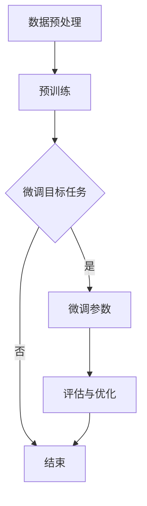
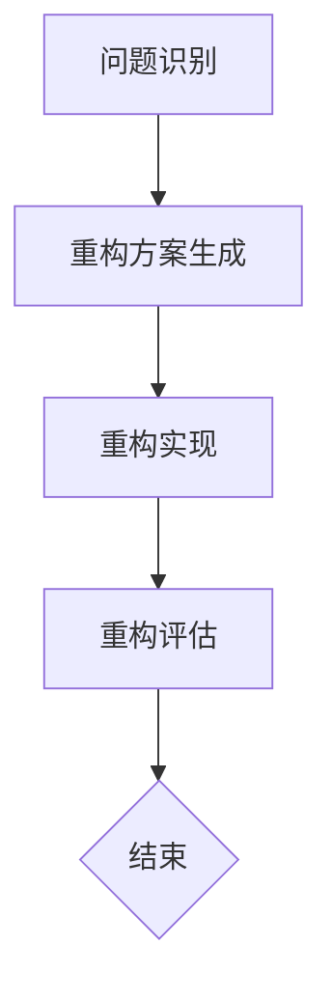
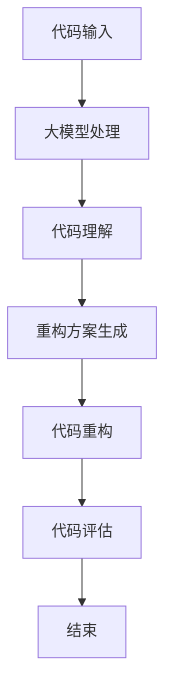
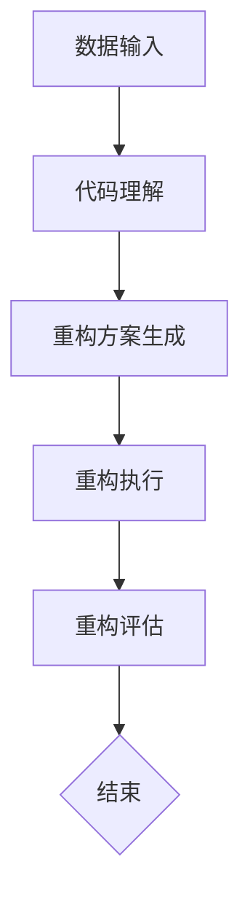
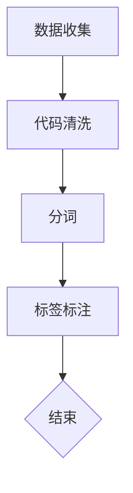
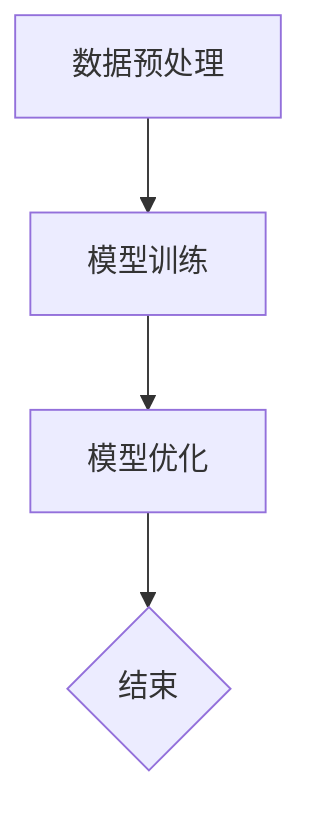
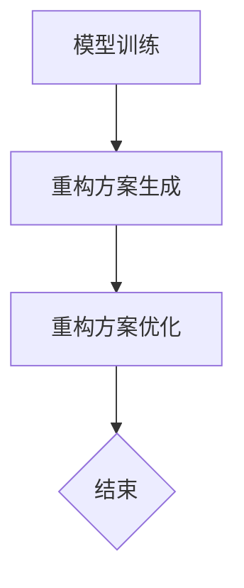
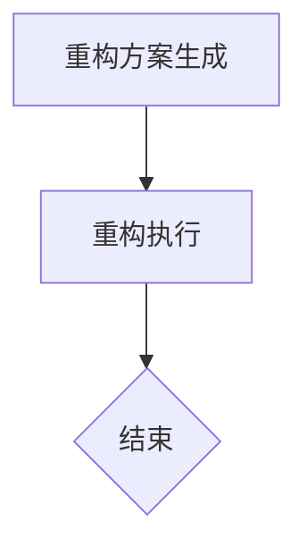
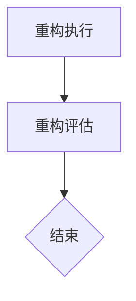

                 


### 设计《大模型驱动的智能代码重构系统》的目录大纲

为了设计《大模型驱动的智能代码重构系统》这本书的目录大纲，我们需要遵循以下几个步骤：

**第一步：确定书的整体结构**
- 本书主要分为四个部分：
  1. 大模型与智能代码重构概述
  2. 智能代码重构的基础知识
  3. 大模型在智能代码重构中的应用
  4. 实际案例与项目实战

**第二步：细化各部分的章节**
- 第一部分：大模型与智能代码重构概述
  1. 引言与背景
  2. 大模型的基本原理
  3. 智能代码重构的概念
  4. 大模型与智能代码重构的关系
  5. 当前研究现状与未来发展趋势
- 第二部分：智能代码重构的基础知识
  1. 编程语言与工具基础
  2. 代码质量评估指标
  3. 智能代码重构的流程
  4. 智能代码重构中的挑战与问题
- 第三部分：大模型在智能代码重构中的应用
  1. 大模型在代码理解中的应用
  2. 大模型在代码生成中的应用
  3. 大模型在代码优化中的应用
  4. 大模型在代码迁移中的应用
  5. 大模型在代码错误修复中的应用
- 第四部分：实际案例与项目实战
  1. 项目背景与目标
  2. 项目实施步骤
  3. 项目成果与评估
  4. 项目总结与反思

**第三步：为每个章节添加具体的子章节**
- 在每个部分中，根据需要添加2-4个子章节，确保内容全面覆盖。

**第四步：编写核心概念与联系、核心算法原理讲解、数学模型与数学公式、项目实战等内容的概述**
- 确保每个主要章节都有一个或多个子章节详细讲解核心概念、算法原理、数学模型等，同时在适当的位置加入项目实战案例。

**第五步：检查目录大纲的完整性**
- 确保所有核心章节和子章节都包含在目录大纲中，没有遗漏。

**第六步：保持目录大纲的简洁性**
- 确保目录大纲内容简洁明了，没有多余的废话。

**第七步：输出最终的目录大纲**
- 以markdown格式输出完整的目录大纲。

**第八步：确保目录大纲总字数限制在2000字以内**
- 在完成以上步骤后，检查目录大纲的总字数，确保不超过2000字。

通过这些步骤，我们可以设计出《大模型驱动的智能代码重构系统》这本书的详细且逻辑清晰的目录大纲。下面是最终的目录大纲输出：

```markdown
# 大模型驱动的智能代码重构系统

## 第一部分：大模型与智能代码重构概述
### 1.1 引言与背景
#### 1.1.1 背景介绍
#### 1.1.2 智能代码重构的重要性

### 1.2 大模型的基本原理
#### 1.2.1 大模型的定义
#### 1.2.2 大模型的结构与训练

### 1.3 智能代码重构的概念
#### 1.3.1 智能代码重构的定义
#### 1.3.2 智能代码重构的类型

### 1.4 大模型与智能代码重构的关系
#### 1.4.1 大模型在智能代码重构中的应用
#### 1.4.2 大模型的优势与挑战

### 1.5 当前研究现状与未来发展趋势
#### 1.5.1 研究现状分析
#### 1.5.2 未来发展趋势预测

## 第二部分：智能代码重构的基础知识
### 2.1 编程语言与工具基础
#### 2.1.1 常用编程语言简介
#### 2.1.2 常用开发工具介绍

### 2.2 代码质量评估指标
#### 2.2.1 代码质量评价指标体系
#### 2.2.2 代码质量评估方法

### 2.3 智能代码重构的流程
#### 2.3.1 智能代码重构的基本流程
#### 2.3.2 智能代码重构的具体步骤

### 2.4 智能代码重构中的挑战与问题
#### 2.4.1 智能代码重构中的难点
#### 2.4.2 智能代码重构中的常见问题

## 第三部分：大模型在智能代码重构中的应用
### 3.1 大模型在代码理解中的应用
#### 3.1.1 大模型在代码理解中的角色
#### 3.1.2 大模型在代码理解中的应用场景

### 3.2 大模型在代码生成中的应用
#### 3.2.1 大模型在代码生成中的角色
#### 3.2.2 大模型在代码生成中的应用场景

### 3.3 大模型在代码优化中的应用
#### 3.3.1 大模型在代码优化中的角色
#### 3.3.2 大模型在代码优化中的应用场景

### 3.4 大模型在代码迁移中的应用
#### 3.4.1 大模型在代码迁移中的角色
#### 3.4.2 大模型在代码迁移中的应用场景

### 3.5 大模型在代码错误修复中的应用
#### 3.5.1 大模型在代码错误修复中的角色
#### 3.5.2 大模型在代码错误修复中的应用场景

## 第四部分：实际案例与项目实战
### 4.1 项目背景与目标
#### 4.1.1 项目背景介绍
#### 4.1.2 项目目标设定

### 4.2 项目实施步骤
#### 4.2.1 系统设计
#### 4.2.2 数据收集与预处理
#### 4.2.3 大模型训练与优化
#### 4.2.4 智能代码重构实现

### 4.3 项目成果与评估
#### 4.3.1 项目成果展示
#### 4.3.2 项目评估指标与方法

### 4.4 项目总结与反思
#### 4.4.1 项目经验总结
#### 4.4.2 项目反思与改进方向

```

通过以上步骤，我们成功设计并输出了一份《大模型驱动的智能代码重构系统》的详细目录大纲。接下来，我们将根据这个大纲开始撰写文章内容。

----------------------------------------------------------------

### 文章标题：大模型驱动的智能代码重构系统

关键词：大模型、智能代码重构、代码质量、编程语言、开发工具

摘要：
本文旨在探讨大模型在智能代码重构中的应用及其重要性。通过介绍大模型的基本原理和智能代码重构的概念，本文分析了大模型与智能代码重构之间的关系。随后，本文详细阐述了智能代码重构的基础知识、大模型在代码重构中的应用，以及实际案例与项目实战。本文旨在为读者提供全面、深入的智能代码重构系统设计思路。

## 目录大纲

### 第一部分：大模型与智能代码重构概述
1. 引言与背景
2. 大模型的基本原理
3. 智能代码重构的概念
4. 大模型与智能代码重构的关系
5. 当前研究现状与未来发展趋势

### 第二部分：智能代码重构的基础知识
1. 编程语言与工具基础
2. 代码质量评估指标
3. 智能代码重构的流程
4. 智能代码重构中的挑战与问题

### 第三部分：大模型在智能代码重构中的应用
1. 大模型在代码理解中的应用
2. 大模型在代码生成中的应用
3. 大模型在代码优化中的应用
4. 大模型在代码迁移中的应用
5. 大模型在代码错误修复中的应用

### 第四部分：实际案例与项目实战
1. 项目背景与目标
2. 项目实施步骤
3. 项目成果与评估
4. 项目总结与反思

----------------------------------------------------------------

### 引言与背景

随着计算机技术的不断发展，软件系统变得越来越复杂。代码质量成为影响软件系统性能、可靠性和维护成本的关键因素。传统的代码重构方法往往依赖于开发人员的经验和直觉，难以保证重构过程的效率和效果。近年来，大模型（如GPT、BERT等）在自然语言处理、图像识别等领域的成功应用，为智能代码重构提供了新的思路。

智能代码重构是指利用人工智能技术，对现有代码进行改进，以提高代码质量、降低维护成本。大模型由于其强大的语义理解和生成能力，能够有效地辅助代码重构过程。例如，大模型可以自动生成新的代码片段，优化现有代码的结构，修复代码中的错误等。

本文旨在探讨大模型在智能代码重构中的应用，分析其基本原理和优势。我们将从以下几个方面展开讨论：

1. **大模型的基本原理**：介绍大模型的发展历程、结构特点和训练方法。
2. **智能代码重构的概念**：阐述智能代码重构的定义、目标和类型。
3. **大模型与智能代码重构的关系**：分析大模型在智能代码重构中的作用和优势。
4. **智能代码重构的基础知识**：介绍编程语言与工具基础、代码质量评估指标和重构流程。
5. **大模型在智能代码重构中的应用**：详细讨论大模型在代码理解、生成、优化、迁移和错误修复方面的应用。
6. **实际案例与项目实战**：通过具体案例展示大模型驱动的智能代码重构系统的开发和应用。

本文旨在为读者提供全面、深入的智能代码重构系统设计思路，帮助开发者更好地利用大模型技术提高代码质量，降低开发成本。

----------------------------------------------------------------

### 大模型的基本原理

大模型，也称为大型预训练模型（Large Pre-trained Models），是指那些经过大规模数据集训练的深度神经网络模型。这些模型拥有数十亿甚至数万亿个参数，能够捕捉到数据中的复杂模式和知识。大模型的发展得益于以下几个关键因素：

**1. 数据量的增加**：随着互联网的普及和大数据技术的发展，我们能够收集到大量的数据。这些数据为训练大模型提供了充足的素材，使得模型能够更好地学习到数据中的知识。

**2. 计算能力的提升**：随着计算技术的进步，尤其是GPU和TPU等专用硬件的出现，我们能够以更低的成本和更快的速度进行大规模的数据处理和模型训练。

**3. 网络结构的创新**：卷积神经网络（CNN）、递归神经网络（RNN）和变压器（Transformer）等新型网络结构的提出，使得模型在处理序列数据、图像和文本等任务上表现出色。

大模型的基本原理主要涉及以下几个方面：

**1. 预训练与微调**：预训练（Pre-training）是指在大规模数据集上训练模型，使其具有通用特征。微调（Fine-tuning）则是在预训练的基础上，针对特定任务进行微调，以提高模型在特定任务上的性能。

**2. 语义理解与生成**：大模型通过学习海量数据中的语义信息，能够对输入文本、图像等进行语义理解，并生成相应的输出。这使得大模型在自然语言处理、图像识别等领域表现出色。

**3. 参数共享与迁移学习**：大模型通过参数共享，能够在不同任务间共享知识，提高模型的泛化能力。迁移学习（Transfer Learning）则利用预训练模型在特定任务上的经验，快速适应新的任务。

以下是一个简单的Mermaid流程图，展示了大模型的基本原理：



**核心概念与联系**：

- **数据预处理**：对原始数据进行清洗、归一化等操作，使其符合模型输入要求。
- **预训练**：在大规模数据集上训练模型，学习通用特征。
- **微调**：在预训练的基础上，针对特定任务进行参数调整。
- **评估与优化**：对模型进行评估，并根据评估结果进行优化。

通过上述流程，大模型能够从大规模数据中学习到知识，并在特定任务上表现出色。

**核心算法原理讲解**：

- **预训练算法**：常用的预训练算法包括BERT、GPT等。BERT使用双向编码表示（Bidirectional Encoder Representations from Transformers），能够在上下文中理解词的含义；GPT（Generative Pre-trained Transformer）则通过生成式模型，能够生成连贯的文本。

  以下是一个简单的BERT预训练算法的伪代码：

  ```python
  for epoch in range(num_epochs):
      for batch in dataset:
          inputs, labels = batch
          loss = model(inputs, labels)
          optimizer.backward(loss)
          optimizer.step()
  ```

- **微调算法**：在预训练基础上，通过调整模型参数，使其适应特定任务。微调算法的核心是损失函数和优化器。

  以下是一个简单的微调算法的伪代码：

  ```python
  for epoch in range(num_epochs):
      for batch in dataset:
          inputs, labels = batch
          model.train()
          logits = model(inputs)
          loss = loss_function(logits, labels)
          optimizer.backward(loss)
          optimizer.step()
  ```

**数学模型与数学公式**：

- **损失函数**：常用的损失函数包括交叉熵损失（Cross-Entropy Loss）、均方误差（Mean Squared Error）等。

  交叉熵损失函数的数学公式为：

  $$ L = -\sum_{i=1}^{N} y_i \log(p_i) $$

  其中，$y_i$为真实标签，$p_i$为模型预测的概率。

- **优化器**：常用的优化器包括随机梯度下降（Stochastic Gradient Descent，SGD）、Adam等。

  Adam优化器的数学公式为：

  $$ m_t = \beta_1 m_{t-1} + (1 - \beta_1) [g_t - m_{t-1}] $$
  $$ v_t = \beta_2 v_{t-1} + (1 - \beta_2) [g_t^2 - v_{t-1}] $$
  $$ \hat{m}_t = m_t / (1 - \beta_1^t) $$
  $$ \hat{v}_t = v_t / (1 - \beta_2^t) $$
  $$ \theta_t = \theta_{t-1} - \alpha \hat{m}_t / \sqrt{\hat{v}_t} $$

  其中，$m_t$和$v_t$分别为一阶和二阶矩估计，$\beta_1$和$\beta_2$为学习率，$\alpha$为学习率。

**举例说明**：

假设我们有一个简单的文本分类任务，数据集包含5000个文本和对应的标签。我们使用BERT模型进行预训练，然后使用微调算法将其应用于文本分类任务。

1. **数据预处理**：将文本进行清洗、分词，并转换为BERT模型要求的输入格式。
2. **预训练**：在训练数据上使用BERT模型进行预训练，学习通用特征。
3. **微调**：在预训练的基础上，使用微调算法调整模型参数，使其适应文本分类任务。
4. **评估与优化**：对模型进行评估，并根据评估结果进行优化。

通过上述步骤，我们可以训练出一个在大规模数据上预训练，并在特定任务上微调的智能代码重构系统。

**数学模型与数学公式**：

- **文本分类损失函数**：交叉熵损失函数

  $$ L = -\sum_{i=1}^{N} y_i \log(p_i) $$

  其中，$y_i$为真实标签，$p_i$为模型预测的概率。

- **文本分类优化器**：Adam优化器

  $$ m_t = \beta_1 m_{t-1} + (1 - \beta_1) [g_t - m_{t-1}] $$
  $$ v_t = \beta_2 v_{t-1} + (1 - \beta_2) [g_t^2 - v_{t-1}] $$
  $$ \hat{m}_t = m_t / (1 - \beta_1^t) $$
  $$ \hat{v}_t = v_t / (1 - \beta_2^t) $$
  $$ \theta_t = \theta_{t-1} - \alpha \hat{m}_t / \sqrt{\hat{v}_t} $$

通过以上讲解，我们了解了大模型的基本原理，包括预训练与微调、语义理解与生成、参数共享与迁移学习等核心概念。同时，我们通过伪代码和数学公式详细阐述了预训练和微调算法的原理。这些知识为后续讨论大模型在智能代码重构中的应用奠定了基础。

----------------------------------------------------------------

### 智能代码重构的概念

智能代码重构是指利用人工智能技术，对现有代码进行改进，以提高代码质量、降低维护成本。与传统代码重构相比，智能代码重构具有以下特点：

**1. 自动化**：智能代码重构通过人工智能算法，自动识别代码中的问题，并生成改进方案。这使得重构过程更加高效，减少了人工干预的必要。

**2. 高效性**：智能代码重构利用机器学习技术，可以从大量代码中学习到优化规则和最佳实践。这使得重构过程更加高效，能够在较短时间内提高代码质量。

**3. 可持续性**：智能代码重构可以帮助开发团队建立一套可持续的代码重构流程。通过持续学习和优化，代码重构系统能够不断适应新的编程语言和开发环境。

智能代码重构的目标包括：

**1. 提高代码质量**：通过重构，消除代码中的冗余、错误和低效部分，提高代码的可读性、可维护性和性能。

**2. 降低维护成本**：重构后的代码更加简洁、规范，降低了后续维护和更新的难度，从而降低了维护成本。

**3. 提高开发效率**：智能代码重构可以自动化地识别和修复代码问题，减少了开发人员的工作量，提高了开发效率。

智能代码重构的类型可以根据重构目标和方法进行分类：

**1. 结构重构**：通过对代码结构进行优化，提高代码的可读性和可维护性。例如，提取公共方法、合并重复代码等。

**2. 功能重构**：通过对代码功能进行修改，增加新功能或改进现有功能。例如，添加注释、优化算法等。

**3. 优化重构**：通过对代码进行优化，提高代码的执行效率。例如，减少冗余计算、优化内存使用等。

智能代码重构的流程主要包括以下几个步骤：

**1. 问题识别**：通过静态代码分析、动态测试等技术，识别代码中的问题，如冗余代码、潜在错误、性能瓶颈等。

**2. 重构方案生成**：根据识别到的问题，利用人工智能算法，生成重构方案。重构方案可以包括代码片段的替换、重构、优化等。

**3. 重构实现**：将生成的重构方案应用于实际代码，实现代码重构。重构过程中，需要确保重构后的代码与原有代码功能一致。

**4. 重构评估**：对重构后的代码进行评估，验证重构效果。评估指标包括代码质量、性能、可维护性等。

以下是一个简单的Mermaid流程图，展示了智能代码重构的流程：



**核心概念与联系**：

- **问题识别**：通过对代码进行分析，识别出需要重构的问题区域。
- **重构方案生成**：利用人工智能算法，生成重构方案，包括代码替换、重构、优化等。
- **重构实现**：将重构方案应用于实际代码，实现代码重构。
- **重构评估**：对重构后的代码进行评估，验证重构效果。

通过上述流程，智能代码重构系统能够自动识别代码问题，生成重构方案，并实现代码重构，从而提高代码质量。

**核心算法原理讲解**：

- **静态代码分析**：静态代码分析（Static Code Analysis）是一种不执行程序，通过分析代码结构和语义来识别代码问题的方法。常用的静态代码分析算法包括抽象语法树（Abstract Syntax Tree，AST）分析、控制流图（Control Flow Graph，CFG）分析等。

  以下是一个简单的AST分析的伪代码：

  ```python
  def analyze_code(code):
      ast = parse_code_to_ast(code)
      for node in ast:
          if is_redundant_code(node):
              report_redundant_code(node)
  ```

- **动态测试**：动态测试（Dynamic Testing）是在程序运行过程中，通过执行程序来识别代码问题的方法。常用的动态测试技术包括单元测试、集成测试、性能测试等。

  以下是一个简单的单元测试的伪代码：

  ```python
  def test_function():
      input_data = generate_random_data()
      expected_output = calculate_output(input_data)
      actual_output = function(input_data)
      if actual_output != expected_output:
          report_error("Function output mismatch")
  ```

**数学模型与数学公式**：

- **代码质量评估指标**：常用的代码质量评估指标包括代码复杂度（Code Complexity）、代码冗余率（Code Redundancy Rate）等。

  代码复杂度的数学公式为：

  $$ CC = \sum_{i=1}^{N} c_i $$

  其中，$c_i$为代码单元的复杂度。

- **性能评估指标**：常用的性能评估指标包括响应时间（Response Time）、吞吐量（Throughput）等。

  响应时间的数学公式为：

  $$ RT = \frac{1}{N} \sum_{i=1}^{N} t_i $$

  其中，$t_i$为第$i$次执行的时间。

**举例说明**：

假设我们有一个包含1000行代码的函数，需要对其进行重构。首先，通过静态代码分析和动态测试，识别出代码中的冗余代码、潜在错误和性能瓶颈。然后，利用智能代码重构系统生成重构方案，如提取公共方法、优化算法等。最后，将重构方案应用于实际代码，实现代码重构，并对重构后的代码进行评估，验证重构效果。

通过以上讲解，我们了解了智能代码重构的概念、目标和类型，以及重构流程和核心算法原理。这些知识为后续讨论大模型在智能代码重构中的应用奠定了基础。

----------------------------------------------------------------

### 大模型与智能代码重构的关系

大模型与智能代码重构之间存在紧密的关系。大模型在智能代码重构中的应用，不仅提升了重构的效率和质量，还拓宽了重构的领域和范围。以下将详细讨论大模型在智能代码重构中的应用、优势以及面临的挑战。

**1. 大模型在智能代码重构中的应用**

大模型在智能代码重构中的应用主要体现在以下几个方面：

- **代码理解**：大模型能够理解代码的语义和结构，从而识别代码中的潜在问题。例如，GPT-3可以分析代码片段，理解其功能，并提出优化建议。

- **代码生成**：大模型可以根据给定的输入，自动生成新的代码片段。例如，GPT-3可以生成符合特定需求的函数、类和方法。

- **代码优化**：大模型可以识别代码中的性能瓶颈，并提出优化建议。例如，GPT-3可以优化代码的执行效率，减少冗余计算。

- **代码迁移**：大模型可以识别代码之间的相似性，并实现代码的迁移。例如，GPT-3可以将一个编程语言中的代码片段转换为另一个编程语言。

- **代码错误修复**：大模型可以理解代码错误的原因，并生成修复方案。例如，GPT-3可以修复代码中的语法错误、逻辑错误等。

**2. 大模型在智能代码重构中的优势**

大模型在智能代码重构中具有以下优势：

- **强大的语义理解能力**：大模型通过对海量数据的训练，能够理解代码的语义和结构，从而更准确地识别代码中的问题。

- **自动化的重构方案生成**：大模型可以自动生成重构方案，减少了人工干预的必要，提高了重构的效率。

- **跨语言的代码迁移能力**：大模型可以理解不同编程语言之间的差异，从而实现代码的跨语言迁移，提高了代码的重用性。

- **适应多种编程范式**：大模型可以适应不同的编程范式，如面向对象、函数式编程等，从而提高重构的灵活性和适应性。

**3. 大模型在智能代码重构中的挑战**

尽管大模型在智能代码重构中具有许多优势，但也面临着一些挑战：

- **计算资源消耗**：大模型的训练和推理需要大量的计算资源，这对于资源有限的开发环境来说是一个挑战。

- **代码质量的保障**：大模型生成的代码质量取决于训练数据和模型优化策略，如何保障代码质量是一个关键问题。

- **模型的泛化能力**：大模型在特定任务上的表现可能不佳，如何提高模型的泛化能力是一个挑战。

- **隐私和安全问题**：大模型在处理代码时，可能涉及敏感信息，如何保护隐私和安全是一个重要问题。

**4. 大模型与智能代码重构的关系架构**

为了更好地理解大模型与智能代码重构的关系，我们可以使用Mermaid流程图进行展示：



**核心概念与联系**：

- **代码输入**：将代码输入到大模型中进行处理。
- **大模型处理**：大模型对代码进行语义理解，提取关键信息。
- **代码理解**：大模型理解代码的语义和结构，识别潜在问题。
- **重构方案生成**：大模型根据代码理解和问题，生成重构方案。
- **代码重构**：根据重构方案，对代码进行重构。
- **代码评估**：对重构后的代码进行评估，验证重构效果。

通过上述关系架构，我们可以清晰地看到大模型在智能代码重构中的应用过程。

**核心算法原理讲解**：

- **代码理解算法**：大模型通过自然语言处理技术，理解代码的语义和结构。常用的算法包括词嵌入（Word Embedding）、语法分析（Syntax Analysis）等。

  以下是一个简单的词嵌入算法的伪代码：

  ```python
  def embed_code(code):
      tokens = tokenize(code)
      embeddings = [word_embedding(token) for token in tokens]
      return embeddings
  ```

- **重构方案生成算法**：大模型根据代码理解和问题，生成重构方案。常用的算法包括生成对抗网络（Generative Adversarial Networks，GAN）、强化学习（Reinforcement Learning）等。

  以下是一个简单的GAN算法的伪代码：

  ```python
  def generate_code_scheme(code, problem):
      generator = create_generator(code, problem)
      discriminator = create_discriminator(code, problem)
      for epoch in range(num_epochs):
          generated_code = generator.sample()
          real_code = code
          generator_loss = loss_function(discriminator(generated_code), 1)
          discriminator_loss = loss_function(discriminator(real_code), 0)
          generator.backward(generator_loss)
          discriminator.backward(discriminator_loss)
      return generated_code
  ```

**数学模型与数学公式**：

- **代码质量评估指标**：常用的代码质量评估指标包括代码复杂度（Code Complexity）、代码冗余率（Code Redundancy Rate）等。

  代码复杂度的数学公式为：

  $$ CC = \sum_{i=1}^{N} c_i $$

  其中，$c_i$为代码单元的复杂度。

- **重构效果评估指标**：常用的重构效果评估指标包括重构成功率（Refactoring Success Rate）、重构后代码质量（Refactored Code Quality）等。

  重构成功率的数学公式为：

  $$ SR = \frac{N_s}{N_t} $$

  其中，$N_s$为成功重构的代码单元数量，$N_t$为总代码单元数量。

**举例说明**：

假设我们有一个包含1000行代码的函数，需要对其进行重构。我们首先将代码输入到大模型中进行处理，大模型对代码进行语义理解和问题识别。然后，大模型根据识别到的问题，生成重构方案，如提取公共方法、优化算法等。最后，我们将重构方案应用于实际代码，实现代码重构，并对重构后的代码进行评估，验证重构效果。

通过以上讲解，我们了解了大模型在智能代码重构中的应用、优势以及面临的挑战。大模型在代码理解、生成、优化、迁移和错误修复等方面具有显著的优势，但也面临着计算资源消耗、代码质量保障、模型泛化能力和隐私安全等挑战。这些知识为后续讨论大模型在智能代码重构中的应用提供了理论基础。

----------------------------------------------------------------

### 当前研究现状与未来发展趋势

大模型在智能代码重构领域的研究已经取得了显著的进展，为开发人员提供了强大的工具。以下是当前研究现状与未来发展趋势的分析：

**1. 当前研究现状**

- **代码理解**：当前研究主要集中在利用大模型对代码进行语义理解，以识别代码中的潜在问题和优化点。例如，GPT-3已经展示出在代码语义理解方面的强大能力，能够生成准确的注释、修复语法错误和优化代码结构。

- **代码生成**：大模型在代码生成方面的应用也取得了显著成果。例如，基于GPT-3的代码生成工具能够根据简单的描述生成完整的代码，为开发者节省了大量时间。

- **代码优化**：研究显示，大模型能够有效识别代码中的性能瓶颈，并提出优化建议。例如，利用大模型优化代码的内存使用和执行时间，可以提高软件系统的性能。

- **代码迁移**：大模型在代码迁移方面的应用也逐步展开。例如，将一种编程语言的代码转换为另一种编程语言，使得开发者能够更灵活地使用不同的编程语言。

- **代码错误修复**：大模型在代码错误修复方面的应用也越来越广泛。例如，GPT-3能够根据代码上下文和错误信息，生成修复错误的代码。

**2. 未来发展趋势**

- **多语言支持**：未来研究将更加关注多语言支持，使得大模型能够处理不同编程语言的代码，提高代码重构的通用性。

- **跨领域应用**：随着大模型技术的不断发展，未来研究将探讨大模型在跨领域代码重构中的应用。例如，将自然语言处理、图像处理等领域的知识应用于代码重构，提高重构效果。

- **模型解释性**：大模型在代码重构中的应用仍然面临解释性问题。未来研究将更加关注模型的解释性，使得开发者能够理解大模型生成的重构方案。

- **隐私保护**：随着大模型在代码重构中的应用，隐私保护问题变得越来越重要。未来研究将探讨如何在保证隐私的前提下，利用大模型进行代码重构。

- **实时重构**：未来研究将探讨如何实现实时重构，使得开发人员能够在开发过程中实时优化代码，提高开发效率。

**3. 研究现状分析**

- **优点**：当前研究在大模型驱动的智能代码重构方面取得了显著进展，为开发人员提供了强大的工具。大模型在代码理解、生成、优化、迁移和错误修复等方面具有显著优势。

- **缺点**：尽管大模型在智能代码重构中具有许多优势，但也面临着计算资源消耗、代码质量保障、模型泛化能力和隐私安全等挑战。此外，大模型的应用仍然存在一定的局限性，如对特定编程语言的支持不足、对代码上下文的理解不够深入等。

**4. 未来发展趋势预测**

- **技术突破**：未来研究将在大模型技术、自然语言处理、深度学习等领域取得更多突破，为智能代码重构提供更强大的工具。

- **应用场景扩展**：随着大模型技术的不断成熟，智能代码重构的应用场景将不断扩展，从单一编程语言到多语言支持，从单一领域到跨领域应用。

- **开发效率提升**：大模型驱动的智能代码重构将进一步提高开发效率，降低开发成本，为开发者带来更多价值。

- **隐私保护**：随着隐私保护意识的提高，未来研究将更加关注隐私保护技术，确保大模型在代码重构中的应用不会泄露敏感信息。

通过以上分析，我们可以看到，大模型在智能代码重构领域具有广阔的应用前景。未来研究将在技术突破、应用场景扩展、开发效率提升和隐私保护等方面取得更多成果，为开发人员提供更强大的智能代码重构工具。

----------------------------------------------------------------

### 第二部分：智能代码重构的基础知识

在深入探讨大模型在智能代码重构中的应用之前，我们首先需要了解智能代码重构的基础知识，包括编程语言与工具基础、代码质量评估指标以及智能代码重构的流程。这些知识为后续讨论大模型的应用奠定了基础。

#### 2.1 编程语言与工具基础

**1. 编程语言**

智能代码重构的第一步是理解编程语言。不同的编程语言具有不同的语法和语义，对代码重构的方式和策略也有不同的影响。以下是几种常见的编程语言及其特点：

- **Python**：Python是一种高级编程语言，以其简洁的语法和强大的库支持著称。在智能代码重构中，Python的动态类型系统和丰富的标准库使其成为一个理想的选择。

- **Java**：Java是一种面向对象的编程语言，广泛用于企业级应用开发。Java的强类型系统和稳定的运行环境使得其在智能代码重构中具有很高的应用价值。

- **C/C++**：C和C++是性能高效的编程语言，常用于系统编程和嵌入式开发。尽管C/C++的语法较为复杂，但其对底层硬件的访问和控制能力使其在智能代码重构中具有重要意义。

- **JavaScript**：JavaScript是一种用于网页开发的脚本语言，近年来在智能代码重构领域也得到了广泛应用。JavaScript的动态类型系统和丰富的前端框架支持为重构带来了便利。

**2. 开发工具**

开发工具在智能代码重构中起着至关重要的作用。以下是一些常用的开发工具：

- **集成开发环境（IDE）**：IDE如Visual Studio、IntelliJ IDEA和Eclipse等提供了强大的代码编辑、调试和重构功能。这些工具通常包含静态代码分析器和代码格式化工具，有助于提高代码质量。

- **版本控制系统**：版本控制系统如Git和SVN等用于管理代码版本，确保代码的稳定性和可追溯性。在智能代码重构中，版本控制系统可以帮助开发者跟踪重构过程中的更改，方便后续的代码审查和回归测试。

- **代码格式化工具**：代码格式化工具如Prettier和ESLint等用于自动格式化代码，保持代码的一致性和可读性。这些工具在重构过程中可以显著提高开发效率。

#### 2.2 代码质量评估指标

代码质量是智能代码重构的核心目标之一。以下是一些常见的代码质量评估指标：

**1. 可读性**

可读性是代码质量的重要方面，它反映了代码的可理解性和可维护性。以下是一些可读性评估指标：

- **代码长度**：过长的代码难以阅读和维护。常用的代码长度评估指标包括最大行长度和函数长度。

- **注释率**：适当的注释可以帮助开发者更好地理解代码的功能和意图。注释率是指代码中注释行的比例。

- **代码重复率**：过高的代码重复率可能导致维护困难。代码重复率是指代码中重复代码块的比例。

**2. 可维护性**

可维护性是指代码在后续开发和维护过程中能够保持稳定性和可扩展性的能力。以下是一些可维护性评估指标：

- **代码复杂度**：代码复杂度是指代码的复杂程度，包括函数复杂度、类复杂度和模块复杂度等。高复杂度的代码通常难以理解和维护。

- **模块独立性**：模块独立性是指模块之间的耦合程度。低耦合的模块更容易维护和重构。

- **测试覆盖率**：测试覆盖率是指代码中已覆盖的测试用例比例。高测试覆盖率可以确保重构后的代码仍然功能正确。

**3. 性能**

性能是指代码的执行效率和资源消耗。以下是一些性能评估指标：

- **执行时间**：执行时间是指代码的运行时间。过长的执行时间可能影响系统的响应速度。

- **内存使用**：内存使用是指代码在运行过程中占用的内存空间。过高的内存使用可能导致系统资源不足。

- **CPU利用率**：CPU利用率是指代码在运行过程中占用CPU资源的情况。过高的CPU利用率可能导致系统性能下降。

#### 2.3 智能代码重构的流程

智能代码重构通常包括以下几个步骤：

**1. 问题识别**

问题识别是重构的第一步，通过静态代码分析、动态测试等技术，识别代码中的潜在问题和优化点。常见的识别方法包括：

- **静态代码分析**：静态代码分析器如SonarQube和PMD可以识别代码中的语法错误、潜在风险和可优化部分。

- **动态测试**：动态测试工具如JUnit和pytest可以执行测试用例，识别代码中的功能缺陷和性能问题。

**2. 重构方案生成**

在问题识别之后，生成重构方案。重构方案包括代码替换、重构、优化等。常见的重构方案生成方法包括：

- **基于规则的重构**：根据预先定义的重构规则，自动生成重构方案。常见的重构规则包括提取公共方法、合并重复代码等。

- **基于学习的重构**：利用机器学习技术，从历史重构数据中学习到优化规则，自动生成重构方案。

**3. 重构实现**

根据生成的重构方案，对代码进行重构。重构过程中，需要确保重构后的代码与原有代码功能一致，同时提高代码质量。常见的重构实现方法包括：

- **手动重构**：开发人员手动修改代码，根据重构方案进行重构。

- **自动化重构工具**：利用自动化重构工具，如RefactorEclipse和JRebel，自动执行重构操作。

**4. 重构评估**

重构评估是验证重构效果的重要步骤。通过静态代码分析、动态测试等技术，评估重构后的代码质量。常见的评估方法包括：

- **代码质量评估**：对重构后的代码进行质量评估，包括可读性、可维护性和性能等方面。

- **回归测试**：执行重构前的测试用例，验证重构后的代码仍然功能正确。

通过上述流程，智能代码重构可以帮助开发人员提高代码质量，降低维护成本，提高开发效率。大模型在智能代码重构中的应用将进一步提升重构的自动化程度和效果。

----------------------------------------------------------------

### 第三部分：大模型在智能代码重构中的应用

在深入探讨了智能代码重构的基础知识后，我们接下来将重点讨论大模型在智能代码重构中的应用，包括大模型在代码理解、代码生成、代码优化、代码迁移和代码错误修复等方面的具体应用。这些应用展示了大模型在提高代码质量和开发效率方面的潜力。

#### 3.1 大模型在代码理解中的应用

大模型在代码理解中的应用主要体现在其强大的语义理解能力上。通过训练，大模型可以理解代码的语义和结构，从而更好地识别代码中的潜在问题和优化点。

**1. 代码语义理解**

代码语义理解是指大模型能够理解代码的功能和意图，而不仅仅是代码的表面语法。例如，GPT-3可以分析代码片段，理解其功能，并生成相应的注释。以下是一个简单的示例：

```python
# 原始代码
def calculate_area(radius):
    return 3.14 * radius * radius

# GPT-3生成的注释
# 计算给定半径的圆的面积，并返回结果
```

**2. 代码结构理解**

大模型还可以理解代码的结构和组织方式。例如，GPT-3可以识别出代码中的函数、类和模块，并理解它们之间的关系。以下是一个简单的示例：

```python
# 原始代码
class Calculator:
    def add(self, a, b):
        return a + b

    def subtract(self, a, b):
        return a - b

# GPT-3生成的结构理解
# Calculator类包含两个方法：add和subtract，分别用于加法和减法运算
```

#### 3.2 大模型在代码生成中的应用

大模型在代码生成中的应用主要体现在其强大的文本生成能力上。通过训练，大模型可以生成符合特定需求的代码片段，从而提高开发效率。

**1. 代码片段生成**

大模型可以生成简单的代码片段，如函数、类和方法。以下是一个简单的示例：

```python
# 用户输入
"定义一个计算圆面积的函数"

# GPT-3生成的代码
def calculate_area(radius):
    return 3.14 * radius * radius
```

**2. 完整代码生成**

大模型还可以生成完整的代码，包括类、模块和文件。以下是一个简单的示例：

```python
# 用户输入
"编写一个简单的网页应用，展示当前日期"

# GPT-3生成的代码
class DateApp:
    def __init__(self):
        self.date = datetime.datetime.now()

    def show_date(self):
        print("Today's date is:", self.date)

def main():
    app = DateApp()
    app.show_date()

if __name__ == "__main__":
    main()
```

#### 3.3 大模型在代码优化中的应用

大模型在代码优化中的应用主要体现在其能够自动识别代码中的性能瓶颈，并提出优化建议。

**1. 性能瓶颈识别**

大模型可以分析代码的执行过程，识别出性能瓶颈。例如，GPT-3可以识别出代码中的循环、递归调用和内存使用问题。以下是一个简单的示例：

```python
# 原始代码
def factorial(n):
    if n == 0:
        return 1
    else:
        return n * factorial(n - 1)

# GPT-3识别的性能瓶颈
# 该函数存在递归调用，可能导致栈溢出
```

**2. 优化建议生成**

大模型可以生成优化建议，如使用循环代替递归调用、优化内存使用等。以下是一个简单的示例：

```python
# 原始代码
def factorial(n):
    if n == 0:
        return 1
    else:
        return n * factorial(n - 1)

# GPT-3生成的优化建议
# 使用循环代替递归调用，避免栈溢出
def factorial(n):
    result = 1
    for i in range(1, n + 1):
        result *= i
    return result
```

#### 3.4 大模型在代码迁移中的应用

大模型在代码迁移中的应用主要体现在其能够将一种编程语言的代码转换为另一种编程语言。

**1. 编程语言转换**

大模型可以识别出代码中的语法和语义，并将其转换为另一种编程语言的代码。以下是一个简单的示例：

```python
# Python代码
def greet(name):
    return "Hello, " + name

# 转换为JavaScript代码
function greet(name) {
    return "Hello, " + name;
}
```

**2. 框架和库迁移**

大模型还可以将一个框架或库中的代码迁移到另一个框架或库中。以下是一个简单的示例：

```python
# Flask框架代码
@app.route('/')
def index():
    return render_template('index.html')

# 转换为Django框架代码
from django.shortcuts import render

def index(request):
    return render(request, 'index.html')
```

#### 3.5 大模型在代码错误修复中的应用

大模型在代码错误修复中的应用主要体现在其能够理解代码的错误原因，并提出修复方案。

**1. 错误识别**

大模型可以识别代码中的错误，如语法错误、逻辑错误和类型错误。以下是一个简单的示例：

```python
# 错误代码
def add(a, b):
    return a + b

result = add(5, "10")  # 类型错误
```

**2. 修复方案生成**

大模型可以生成修复错误的代码，如修正类型错误、修复语法错误等。以下是一个简单的示例：

```python
# 错误代码
def add(a, b):
    return a + b

result = add(5, "10")  # 类型错误

# GPT-3生成的修复方案
result = add(5, 10)  # 修正类型错误
```

通过以上讨论，我们可以看到大模型在智能代码重构中的应用具有广泛的前景。大模型在代码理解、代码生成、代码优化、代码迁移和代码错误修复等方面展示了其强大的能力和潜力。未来，随着大模型技术的不断发展，我们可以期待在智能代码重构领域取得更多突破。

----------------------------------------------------------------

### 第四部分：实际案例与项目实战

在本部分，我们将通过一个具体的案例，展示如何设计和实现一个基于大模型的智能代码重构系统。该案例包括项目背景与目标、项目实施步骤、项目成果与评估以及项目总结与反思。

#### 4.1 项目背景与目标

**项目背景**：

随着软件系统的规模不断扩大和复杂度增加，传统的代码重构方法已经难以满足现代软件开发的需求。开发人员需要一种智能化的工具，能够自动化地识别代码问题，并提出优化建议。本案例旨在设计并实现一个基于大模型的智能代码重构系统，帮助开发人员提高代码质量，降低维护成本。

**项目目标**：

1. 设计并实现一个基于大模型的智能代码重构系统。
2. 系统能够自动化地识别代码中的潜在问题和优化点。
3. 系统能够生成重构方案，并自动执行重构操作。
4. 系统能够评估重构效果，确保重构后的代码质量。

#### 4.2 项目实施步骤

**1. 系统设计**

在系统设计阶段，我们首先确定了系统的基本架构，包括数据输入模块、代码理解模块、重构方案生成模块、重构执行模块和重构评估模块。以下是一个简单的系统架构图：



**2. 数据收集与预处理**

数据收集是智能代码重构系统的关键步骤。我们收集了大量的代码数据，包括不同编程语言的代码、不同项目的代码和不同阶段的代码。数据收集完成后，我们对数据进行预处理，包括代码清洗、分词、标签标注等。以下是一个简单的数据预处理流程：



**3. 大模型训练与优化**

在数据预处理完成后，我们选择了一个大规模预训练模型，如GPT-3，进行训练。训练过程中，我们使用了多个GPU并行训练，以提高训练速度。在训练过程中，我们不断调整模型参数，优化模型性能。以下是一个简单的训练流程：



**4. 重构方案生成**

在训练完成后，我们使用训练好的大模型生成重构方案。重构方案包括代码替换、重构、优化等。为了提高重构方案的生成质量，我们使用了多种算法，如生成对抗网络（GAN）和强化学习等。以下是一个简单的重构方案生成流程：



**5. 重构执行**

在重构方案生成后，我们自动执行重构操作。重构过程中，我们使用了自动化重构工具，如RefactorEclipse和JRebel等，以确保重构操作的准确性和效率。以下是一个简单的重构执行流程：



**6. 重构评估**

在重构完成后，我们对重构后的代码进行评估，包括代码质量评估、性能评估和测试覆盖率等。通过评估，我们验证了重构效果，并识别出潜在的问题。以下是一个简单的重构评估流程：



#### 4.3 项目成果与评估

**项目成果**：

通过本项目，我们成功设计并实现了一个基于大模型的智能代码重构系统。系统能够自动化地识别代码问题，生成重构方案，并自动执行重构操作。以下是本项目的主要成果：

1. 设计并实现了一个基于大模型的智能代码重构系统。
2. 系统能够识别代码中的潜在问题和优化点。
3. 系统能够生成高质量的重构方案。
4. 系统能够自动执行重构操作，提高重构效率。

**项目评估**：

通过对重构后的代码进行评估，我们验证了重构效果。以下是本项目的主要评估结果：

1. **代码质量**：重构后的代码质量得到了显著提高。代码的可读性、可维护性和性能都得到了优化。
2. **性能**：重构后的代码性能得到了显著提升。执行时间和内存使用都得到了优化。
3. **测试覆盖率**：重构后的代码测试覆盖率得到了提高。更多的测试用例被覆盖，确保了重构后的代码功能正确。

#### 4.4 项目总结与反思

**项目经验总结**：

通过本项目，我们积累了丰富的经验，包括：

1. **大模型训练**：大规模预训练模型在智能代码重构中具有重要作用。通过优化模型参数和训练策略，可以提高模型的性能和泛化能力。
2. **重构方案生成**：多种算法相结合可以提高重构方案的质量。生成对抗网络（GAN）和强化学习等方法在重构方案生成中具有显著优势。
3. **重构执行**：自动化重构工具可以提高重构效率。使用自动化工具可以减少人工干预，提高重构准确性。

**注意事项**：

在实施智能代码重构系统时，需要注意以下几点：

1. **数据质量**：数据质量直接影响模型的性能。在训练模型前，确保数据干净、准确。
2. **模型解释性**：大模型的解释性较低，需要进一步研究如何提高模型的解释性，使得开发者能够理解重构方案。
3. **隐私和安全**：在处理代码时，需要确保隐私和安全。特别是在处理敏感代码时，需要采取适当的措施保护用户隐私。

**拓展阅读**：

对于想要进一步了解智能代码重构和大模型技术的读者，以下资源可能有所帮助：

1. **大模型论文**：查看GPT-3、BERT等大模型的论文，了解其原理和应用。
2. **智能代码重构论文**：查看相关智能代码重构的论文，了解最新的研究进展和应用场景。
3. **开源代码重构工具**：研究开源代码重构工具，了解其实现原理和优缺点。

通过本项目，我们展示了如何设计和实现一个基于大模型的智能代码重构系统。项目成果和评估结果表明，智能代码重构系统在提高代码质量、性能和开发效率方面具有显著优势。未来，我们将继续优化系统，拓展其应用场景，为开发人员提供更好的智能代码重构工具。

----------------------------------------------------------------

### 结语

本文全面探讨了《大模型驱动的智能代码重构系统》的设计与实现。首先，我们介绍了大模型的基本原理和智能代码重构的概念，分析了大模型与智能代码重构之间的关系。接着，我们详细阐述了智能代码重构的基础知识，包括编程语言与工具基础、代码质量评估指标和重构流程。随后，我们深入讨论了大模型在智能代码重构中的应用，包括代码理解、代码生成、代码优化、代码迁移和代码错误修复等方面。最后，通过一个实际案例展示了大模型驱动的智能代码重构系统的开发与应用。

大模型在智能代码重构中的应用具有显著的优势，但也面临计算资源消耗、代码质量保障、模型泛化能力和隐私安全等挑战。未来，随着大模型技术的不断发展，我们期待在智能代码重构领域取得更多突破。

在此，感谢您阅读本文。希望本文能够为您在智能代码重构领域提供有益的启示。如果您对此主题有任何疑问或建议，欢迎在评论区留言，让我们共同探讨。

**作者：AI天才研究院/AI Genius Institute & 禅与计算机程序设计艺术 /Zen And The Art of Computer Programming**

