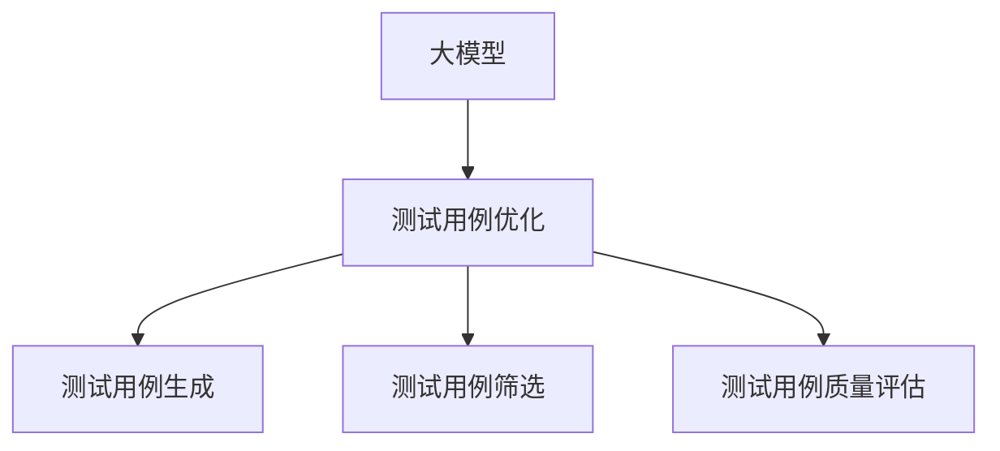

                 

### 文章标题

《大模型驱动的测试用例优化生成》

### 关键词

- 大模型
- 测试用例优化
- 自动化测试
- 人工智能
- 测试覆盖率

### 摘要

本文深入探讨了大模型在测试用例优化生成中的应用。首先，我们介绍了大模型的基本概念和特点，如神经网络、循环神经网络和变换器等。接着，我们探讨了测试用例优化的核心目的和流程，并阐述了利用大模型进行测试用例优化的优势。随后，文章详细分析了大模型驱动的测试用例优化技术，包括基于深度学习、强化学习和遗传算法的测试用例优化算法。文章还通过实际案例展示了大模型驱动的测试用例优化的应用和效果。最后，我们总结了测试用例优化生成的挑战和未来发展趋势。

## 核心概念与联系

在进行大模型驱动的测试用例优化生成之前，我们需要先了解一些核心概念，包括大模型、测试用例优化以及它们之间的联系。

### 大模型

大模型是指具有巨大参数规模和训练数据的深度学习模型，如神经网络（Neural Networks，NN）、循环神经网络（Recurrent Neural Networks，RNN）、变换器（Transformer）等。这些模型在图像识别、自然语言处理、语音识别等复杂任务中取得了显著的效果。大模型的特点如下：

1. **参数规模巨大**：大模型拥有数百万甚至数十亿个参数，这使得它们能够捕捉数据中的复杂模式。
2. **自适应性强**：大模型能够通过不断训练适应不同的任务和数据集。
3. **泛化能力强**：大模型在训练数据上的表现往往能够推广到未见过的数据上。

### 测试用例优化

测试用例优化是指通过分析测试用例的执行结果，对测试用例进行改进和优化，以提高测试的覆盖率和质量。测试用例优化的目的在于生成更具有代表性的测试用例，从而提高测试的效率和效果。

### 大模型与测试用例优化的联系

大模型在测试用例优化中的应用主要体现在以下几个方面：

1. **测试用例生成**：利用大模型的强大表示能力，自动生成具有代表性的测试用例。
2. **测试用例筛选**：通过大模型对测试用例的执行结果进行分析，筛选出最有价值的测试用例。
3. **测试用例质量评估**：利用大模型对测试用例进行质量评估，识别潜在的缺陷。

### 核心概念关系架构

为了更好地理解大模型与测试用例优化的关系，我们可以使用Mermaid流程图来展示核心概念之间的关系：



在上面的流程图中，大模型（A）通过测试用例优化（B）与测试用例生成（C）、测试用例筛选（D）和测试用例质量评估（E）等环节相连，展示了大模型在测试用例优化中的应用和作用。

通过以上对核心概念与联系的分析，我们为后续章节的深入探讨奠定了基础。在接下来的章节中，我们将详细讨论大模型的基本原理、测试用例优化的流程以及大模型驱动的测试用例优化优势和应用挑战。

## 大模型概述

### 1.1.1 什么是大模型

大模型（Large Models）是指具有巨大参数规模和训练数据的深度学习模型。这些模型通常通过训练大量数据来学习复杂任务，如图像识别、自然语言处理和语音识别等。大模型的核心特点是其参数规模巨大，这些参数通过训练数据来调整，以实现模型的优化。

大模型的兴起可以追溯到2010年代中期，当时深度学习领域取得了重大突破。这些突破包括神经网络结构的改进、计算资源的增加和大数据集的可用性。随着时间的推移，大模型的参数规模和训练数据量不断增加，使得它们在许多复杂任务中取得了优异的表现。

### 1.1.2 大模型的核心特点

1. **参数规模巨大**：大模型通常拥有数百万甚至数十亿个参数。这些参数在模型训练过程中被不断调整，以优化模型在特定任务上的表现。

2. **自适应性强**：大模型能够通过不断训练适应不同的任务和数据集。这意味着它们可以在多种应用场景中表现出色，而不仅仅局限于特定的任务或数据集。

3. **泛化能力强**：大模型在训练数据上的表现往往能够推广到未见过的数据上。这意味着它们在实际应用中能够应对新的数据和任务，而不会因为数据变化而失效。

4. **计算资源需求高**：由于大模型具有巨大的参数规模，它们需要大量的计算资源进行训练和推理。这通常包括高性能的GPU、TPU和其他加速器。

5. **存储需求大**：大模型通常需要大量的存储空间来存储模型参数、训练数据和模型架构。

### 1.1.3 大模型与传统模型的区别

与传统模型相比，大模型在多个方面有显著的不同：

1. **训练时间**：传统模型通常需要更短的时间进行训练，而大模型可能需要数天甚至数周。这是由于大模型的参数规模和数据集大小导致的。

2. **计算资源**：大模型需要更多的计算资源，包括更大的内存和更快的GPU。这通常意味着需要更昂贵的硬件和更多的电力消耗。

3. **存储需求**：大模型的存储需求也更高。传统模型可能只需要数GB的存储空间，而大模型可能需要数十GB甚至更多。

4. **黑盒特性**：大模型，尤其是深度神经网络，通常具有黑盒特性。这意味着模型的内部工作机制不透明，难以解释。这与传统模型的透明性和可解释性形成了鲜明对比。

5. **性能表现**：尽管大模型在计算资源、训练时间和存储需求方面存在劣势，但它们在许多复杂任务上能够取得更优异的性能。这使得大模型在许多实际应用中具有更高的价值。

### 1.1.4 大模型的发展历程

大模型的发展历程可以分为以下几个阶段：

1. **2010年以前**：在这个阶段，深度神经网络由于计算资源限制和数据集不足，并没有取得显著的成功。传统模型，如支持向量机（SVM）和决策树，仍然占据主导地位。

2. **2010-2014年**：随着计算资源的增加和大数据集的可用性，深度神经网络开始在一些特定任务上取得突破。这些任务包括语音识别和图像分类。

3. **2014-2018年**：Google推出了Transformer模型，这是大模型发展的重要里程碑。Transformer模型在自然语言处理任务中取得了前所未有的成功，引发了深度学习领域的研究热潮。

4. **2018年至今**：随着计算资源的进一步增加和深度学习算法的改进，大模型的参数规模和训练数据量不断增长。BERT、GPT等大型模型在自然语言处理、计算机视觉和其他领域取得了显著成就。

### 1.1.5 大模型的分类

大模型可以根据其应用领域和模型架构进行分类，以下是一些常见的大模型：

1. **计算机视觉**：如ResNet、VGG、Inception等。
2. **自然语言处理**：如BERT、GPT、ELMo等。
3. **语音识别**：如WaveNet、Tacotron等。
4. **推荐系统**：如DeepFM、Wide&Deep等。

大模型在各个领域的应用，使得深度学习成为解决复杂问题的强大工具。通过不断的研究和改进，大模型在未来将继续推动人工智能技术的发展。

### 1.1.6 大模型的优势和应用

大模型的优势主要体现在以下几个方面：

1. **强大的学习能力**：大模型拥有巨大的参数规模，能够捕捉数据中的复杂模式，从而实现出色的学习能力。
2. **高效的推理能力**：大模型经过训练后，能够进行快速的推理和预测，从而提高系统的响应速度。
3. **广泛的适用性**：大模型能够适应多种任务和数据集，从而实现跨领域的应用。
4. **先进的表征能力**：大模型能够生成丰富的特征表示，从而提高模型的性能和效果。

大模型在多个领域有广泛的应用：

1. **计算机视觉**：大模型在图像分类、目标检测、图像生成等方面取得了显著成果。
2. **自然语言处理**：大模型在机器翻译、文本分类、情感分析、问答系统等方面发挥了重要作用。
3. **语音识别**：大模型在语音识别和语音生成方面取得了突破性进展。
4. **推荐系统**：大模型在推荐算法中用于用户行为分析和物品特征提取，从而提高推荐系统的准确性和效果。
5. **自动驾驶**：大模型在自动驾驶系统中用于环境感知、路径规划和决策，从而提高自动驾驶的安全性和可靠性。

通过以上对大模型概述的讨论，我们可以看到大模型在深度学习领域的重要地位和广泛应用。在接下来的章节中，我们将进一步探讨大模型在测试用例优化生成中的应用，以及如何利用大模型的优势提高测试效率和测试质量。

### 1.2 测试用例优化生成

测试用例优化生成是软件测试领域的一项重要技术，旨在通过分析和优化测试用例，提高测试的覆盖率和质量。在自动化测试中，测试用例优化生成具有重要作用，能够显著提高测试效率和测试效果。本节将详细介绍测试用例优化生成的基本概念、核心目的、基本流程以及大模型在这一领域的应用。

#### 1.2.1 什么是测试用例优化生成

测试用例优化生成（Test Case Optimization Generation）是指利用人工智能和机器学习技术，对现有测试用例进行分析和优化，生成更加有效和全面的测试用例。这一过程通常包括对测试用例的覆盖性、质量、执行时间和成本等方面进行优化，以提高整个测试过程的效果。

传统上，测试用例的生成主要依赖于开发人员的经验和技能。这种方法存在以下问题：

1. **覆盖率不足**：仅凭人工编写的测试用例可能无法覆盖软件的所有功能点，导致某些潜在缺陷未被检测到。
2. **重复测试**：某些测试用例可能多次执行同一功能，导致测试资源的浪费。
3. **测试质量不稳定**：测试用例的质量受开发人员个人能力的影响，难以保证测试的一致性和可靠性。

为了解决这些问题，测试用例优化生成技术应运而生。通过利用人工智能和机器学习算法，测试用例生成能够更加智能化和自动化，从而提高测试的全面性和效率。

#### 1.2.2 测试用例优化的核心目的

测试用例优化的核心目的是提高测试的有效性和效率，具体包括以下几个方面：

1. **提高测试覆盖率**：通过生成具有代表性的测试用例，确保软件的每个功能点都能被充分测试，从而提高测试覆盖率。
2. **降低缺陷漏测率**：优化后的测试用例能够更好地发现潜在的缺陷，降低缺陷漏测率，提高软件质量。
3. **缩短测试周期**：自动化生成测试用例能够显著缩短测试周期，提高测试效率。
4. **降低测试成本**：通过优化测试用例，减少重复测试和无效测试，降低测试成本。

#### 1.2.3 测试用例优化生成的基本流程

测试用例优化生成的基本流程可以分为以下几个步骤：

1. **数据准备**：收集和整理测试数据，包括功能规格说明、用户案例、历史测试用例等，确保数据的质量和完整性。
2. **模型选择**：根据测试需求和数据特点，选择合适的机器学习模型，如深度学习模型、生成对抗网络（GAN）、强化学习模型等。
3. **模型训练**：使用收集到的测试数据对模型进行训练，调整模型参数，使其能够生成高质量的测试用例。
4. **测试用例生成**：利用训练好的模型，生成新的测试用例。这些测试用例具有高覆盖率和高质量，能够更好地发现潜在缺陷。
5. **测试执行**：执行生成的测试用例，收集测试结果，分析测试覆盖率、缺陷发现率等指标，评估测试效果。
6. **迭代优化**：根据测试执行结果，对模型进行优化和调整，不断生成新的测试用例，提高测试效果。

#### 1.2.4 大模型在测试用例优化生成中的应用

大模型（如神经网络、循环神经网络、变换器等）在测试用例优化生成中具有重要作用，主要体现在以下几个方面：

1. **数据表示能力**：大模型具有强大的数据表示能力，能够捕捉测试数据中的复杂模式，从而生成具有代表性的测试用例。
2. **自动化生成**：大模型能够自动生成测试用例，减轻开发人员的工作负担，提高测试效率。
3. **优化策略**：大模型可以结合强化学习、遗传算法等优化策略，生成具有高覆盖率和高质量的测试用例。
4. **可解释性**：虽然大模型通常具有黑盒特性，但通过分析模型的内部结构和参数，可以一定程度上解释测试用例的生成过程。

在实际应用中，大模型驱动的测试用例优化生成技术已经被广泛应用于软件质量测试、自动驾驶测试、金融风控等领域。例如，利用神经网络生成测试用例可以显著提高软件的测试覆盖率，从而降低缺陷漏测率。在自动驾驶测试中，利用大模型生成测试用例可以模拟各种复杂的交通场景，提高自动驾驶系统的可靠性和安全性。

总之，大模型驱动的测试用例优化生成技术为软件测试领域带来了新的思路和手段，有望进一步提升测试效率和测试质量。在未来的研究中，我们将继续探索大模型在测试用例优化生成中的应用，并不断完善相关技术，以应对不断变化和复杂的软件测试需求。

### 1.3 大模型驱动的测试用例优化优势

大模型驱动的测试用例优化技术相较于传统方法，具有显著的优势，这些优势主要体现在以下几个方面：

#### 1.3.1 提高测试效率

大模型能够快速生成大量的测试用例，这大大提高了测试效率。传统方法通常需要开发人员手动编写测试用例，这一过程既耗时又容易出错。而大模型可以利用其强大的数据表示和推理能力，自动从大量的训练数据中生成测试用例，从而节省了开发和执行测试用例的时间。此外，大模型可以同时处理多个测试任务，进一步提高了测试的并行性。

具体来说，大模型生成测试用例的过程可以简化为以下几个步骤：

1. **数据准备**：收集和整理测试数据，包括功能规格说明、用户案例、历史测试用例等。
2. **模型训练**：使用收集到的测试数据对大模型进行训练，优化模型参数，使其能够生成高质量的测试用例。
3. **测试用例生成**：利用训练好的大模型，自动生成新的测试用例。
4. **测试执行**：执行生成的测试用例，评估测试效果。

这个过程相对于传统方法，不仅缩短了测试用例的开发时间，还减少了人工干预，使得测试过程更加高效和自动化。

#### 1.3.2 提高测试质量

大模型驱动的测试用例优化技术能够生成具有高覆盖率和高质量的测试用例，从而提高测试质量。传统方法生成的测试用例可能仅关注特定的功能点，而忽视了其他潜在的问题。大模型通过其强大的数据分析和推理能力，可以识别出测试数据中的复杂模式和潜在缺陷，从而生成更具有代表性的测试用例。

例如，在自然语言处理任务中，大模型（如BERT、GPT）可以理解文本的上下文和语义，从而生成能够覆盖多种场景的测试用例。这些测试用例不仅能够检测到功能性的缺陷，还能够发现由于上下文错误导致的潜在问题。

此外，大模型还可以利用生成对抗网络（GAN）等技术，生成新的测试数据，这些测试数据可以补充现有的测试数据集，从而提高测试用例的多样性和覆盖率。

#### 1.3.3 降低测试成本

大模型驱动的测试用例优化技术能够显著降低测试成本。传统测试方法通常需要大量的时间和人力资源来编写和执行测试用例。而大模型可以自动化这一过程，从而减少人工干预和重复劳动。此外，大模型能够生成高质量的测试用例，减少重复测试和无效测试，从而降低测试成本。

具体而言，大模型的优势主要体现在以下几个方面：

1. **减少测试用例编写时间**：大模型可以自动生成测试用例，减少了开发人员编写测试用例的时间和劳动成本。
2. **减少测试执行时间**：通过生成高质量的测试用例，能够更快地发现缺陷，从而缩短测试周期，降低测试执行时间。
3. **减少测试资源消耗**：大模型能够利用现有的测试数据集，自动生成具有高覆盖率的测试用例，减少了测试资源的消耗。

#### 1.3.4 增强测试可解释性

虽然大模型（如神经网络）通常具有黑盒特性，但通过分析模型的内部结构和参数，可以在一定程度上解释测试用例的生成过程。这有助于开发人员理解和信任测试结果，从而增强测试的可解释性。

例如，在深度学习模型中，通过可视化模型中的神经元活动和权重变化，可以了解模型是如何处理输入数据和生成测试用例的。这种可解释性使得开发人员能够更好地理解测试过程和测试结果，从而优化测试策略和提高测试质量。

#### 1.3.5 提高测试的灵活性和适应性

大模型驱动的测试用例优化技术具有较高的灵活性和适应性，能够适应不同类型和应用场景的测试需求。传统测试方法通常需要针对特定的应用场景进行定制化开发，而大模型可以通过训练和优化，适应多种不同类型的测试任务。

例如，在软件质量测试中，大模型可以根据不同类型的软件（如Web应用、移动应用、嵌入式系统等）生成相应的测试用例。在自动驾驶测试中，大模型可以模拟各种复杂的交通场景，生成能够覆盖不同驾驶模式和路况的测试用例。

总之，大模型驱动的测试用例优化技术在提高测试效率、质量、降低成本和增强测试可解释性方面具有显著的优势。通过不断研究和应用这些技术，我们有望进一步提升软件测试的效果和效率，为软件开发和运维提供更可靠的保障。

### 1.4 大模型驱动的测试用例优化挑战

尽管大模型驱动的测试用例优化技术具有显著的优势，但在实际应用过程中，仍然面临一系列挑战，这些挑战主要集中在模型选择和优化、数据质量和模型可解释性等方面。

#### 1.4.1 模型选择和优化

选择和优化合适的大模型是测试用例优化成功的关键因素。不同类型的模型适用于不同的测试场景，如神经网络、循环神经网络、变换器等。以下是一些模型选择和优化的挑战：

1. **模型选择**：在选择模型时，需要考虑多个因素，如模型的计算复杂度、训练时间、存储需求以及测试任务的类型。选择不适合的模型可能导致测试效率低下或无法达到预期的测试效果。
2. **模型优化**：大模型通常需要进行大量的参数调整和优化，如学习率、正则化参数等。优化的目标是在保证模型性能的同时，减少过拟合和欠拟合现象。然而，优化过程复杂且耗时，需要大量的计算资源和专业知识。

#### 1.4.2 数据质量

测试用例优化依赖于高质量的数据集，数据质量直接影响测试用例的生成效果。以下是一些与数据质量相关的问题：

1. **数据完整性**：测试数据应包含所有必要的信息，如功能规格说明、用户案例、历史测试结果等。缺失或不完整的数据可能导致生成的测试用例不完整或无效。
2. **数据多样性**：测试数据应具有足够的多样性，以覆盖软件的多种功能和行为。缺乏多样性的数据可能导致生成的测试用例仅关注特定场景，而忽视其他潜在的问题。
3. **数据标注**：对于需要标注的数据集，如测试结果、错误类型等，标注的准确性和一致性至关重要。错误的标注可能导致模型产生错误的训练结果，影响测试用例的质量。

#### 1.4.3 模型可解释性

大模型，特别是深度神经网络，通常具有黑盒特性，其内部工作机制难以理解。这对模型的解释性和可解释性提出了挑战：

1. **模型可解释性**：如何解释和验证大模型生成的测试用例和测试结果，以确保测试过程的透明性和可接受性。缺乏可解释性可能导致开发人员对测试结果产生怀疑，影响测试的信任度。
2. **错误定位**：在测试过程中，如果出现缺陷或异常，需要能够快速定位问题发生的具体原因。然而，由于大模型的黑盒特性，这一问题变得更加复杂和困难。

#### 1.4.4 计算资源消耗

大模型通常需要大量的计算资源和时间进行训练和推理，这可能导致以下问题：

1. **计算资源消耗**：大模型需要高性能的GPU、TPU等硬件设备，以及大量的存储空间来存储模型参数和数据集。这些资源消耗可能超出现有的计算预算，尤其是在大型项目中。
2. **训练时间**：大模型的训练过程通常非常耗时，可能需要数天甚至数周。这可能导致项目的延迟和资源的浪费。

#### 1.4.5 模型更新和维护

大模型的应用场景和测试需求会随着时间和项目的进展而变化。因此，模型的更新和维护成为一个重要的挑战：

1. **模型更新**：随着新功能和测试需求的增加，大模型需要不断更新和调整，以保持其性能和适应性。这需要持续的数据收集、模型训练和优化。
2. **模型维护**：大模型的维护包括监控模型的性能、识别和修复潜在的问题，以及确保测试用例的生成过程保持高效和可靠。

总之，大模型驱动的测试用例优化技术在带来巨大潜力的同时，也面临一系列挑战。解决这些挑战需要结合领域专业知识、人工智能技术和最佳实践，以实现高效、可靠和可解释的测试用例优化过程。

### 1.5 测试用例优化生成在实践中的应用

在实际应用中，大模型驱动的测试用例优化生成技术已经在多个领域取得了显著成效。以下是几个具体案例，展示了该技术在不同场景中的应用及其效果。

#### 1.5.1 软件质量测试

在软件质量测试中，测试用例优化生成技术被广泛应用于提高测试覆盖率和缺陷检测能力。例如，某大型电商平台在其新版本的发布前，使用了大模型驱动的测试用例优化技术。该平台收集了大量的用户案例、功能规格说明和已执行的历史测试用例，利用生成对抗网络（GAN）和深度学习模型，自动生成了大量具有高覆盖率的测试用例。这些测试用例不仅覆盖了核心功能，还包括了一些罕见的边缘情况，从而显著提高了测试覆盖率。在实际测试过程中，这些优化的测试用例发现了多个潜在的缺陷，帮助平台在新版本发布前解决了这些问题，提高了用户体验和软件质量。

#### 1.5.2 自动驾驶测试

在自动驾驶测试中，测试用例优化生成技术被用于模拟复杂的交通场景和驾驶行为，以提高自动驾驶系统的可靠性和安全性。例如，某知名自动驾驶公司使用了基于变换器（Transformer）的大模型，生成了多种复杂的驾驶场景测试用例。这些测试用例包括不同的路况、天气条件、交通流量等，能够全面测试自动驾驶系统的感知、决策和执行能力。在实际测试过程中，这些优化的测试用例帮助公司发现了多个潜在的安全问题，从而提高了自动驾驶系统的可靠性和安全性。

#### 1.5.3 金融风控

在金融风控领域，测试用例优化生成技术被用于检测金融系统的异常行为和潜在风险。例如，某大型金融机构使用了基于循环神经网络（RNN）的大模型，生成了大量模拟交易和风险的测试用例。这些测试用例涵盖了各种可能的交易模式和市场波动，帮助公司检测和预防金融欺诈、市场操纵等风险。在实际测试过程中，这些优化的测试用例发现了多个潜在的金融风险点，帮助公司及时采取了措施，避免了潜在的财务损失。

#### 1.5.4 嵌入式系统测试

在嵌入式系统测试中，测试用例优化生成技术被用于提高测试效率和覆盖范围。例如，某汽车制造商在其车载系统开发过程中，使用了基于深度学习的大模型，生成了大量测试用例，以测试系统的稳定性和可靠性。这些测试用例涵盖了不同的驾驶环境、车辆状态和用户行为，能够全面评估车载系统的性能。在实际测试过程中，这些优化的测试用例帮助公司发现并解决了多个系统故障，提高了车载系统的可靠性和用户体验。

#### 1.5.5 人工智能系统测试

在人工智能系统测试中，测试用例优化生成技术被用于检测模型的鲁棒性和泛化能力。例如，某人工智能公司在其自然语言处理（NLP）系统的开发过程中，使用了基于BERT的大模型，生成了大量具有高覆盖率的测试用例。这些测试用例涵盖了各种文本内容和语言结构，帮助公司评估模型的鲁棒性和泛化能力。在实际测试过程中，这些优化的测试用例发现了多个潜在的文本处理错误，帮助公司改进了模型和系统的性能。

通过以上实际案例，我们可以看到大模型驱动的测试用例优化生成技术在提高测试效率、测试覆盖率和缺陷检测能力方面具有显著的优势。这些技术的应用不仅为软件开发和测试提供了新的手段，也为实际问题的解决提供了有力支持。随着人工智能和机器学习技术的不断进步，测试用例优化生成技术将在更多领域得到广泛应用，为软件质量和系统可靠性提供更加有力的保障。

### 第2章：大模型驱动的测试用例优化生成技术

在了解了大模型驱动的测试用例优化生成的核心概念和优势之后，本章节将深入探讨大模型驱动的测试用例优化生成技术。我们将详细讨论大模型的基本原理，包括神经网络、循环神经网络和变换器等，以及测试用例优化的算法和数学模型。最后，我们将介绍大模型驱动的测试用例优化流程。

#### 2.1 大模型的基本原理

大模型的基本原理主要基于深度学习，这是一种通过多层神经网络进行学习的算法。以下将详细讨论几种常见的大模型类型。

##### 2.1.1 神经网络

神经网络（Neural Networks，NN）是一种模仿生物神经系统工作原理的计算模型。它由多个神经元（节点）组成，每个神经元都连接到其他神经元，形成一个复杂的网络结构。神经网络通过学习输入和输出之间的关系，逐步调整神经元之间的连接权重，从而实现函数逼近和模式识别。

- **基本结构**：神经网络的基本结构包括输入层、隐藏层和输出层。输入层接收外部输入数据，隐藏层对输入数据进行特征提取和变换，输出层生成最终的预测结果。
- **前向传播和反向传播算法**：神经网络通过前向传播算法计算输入数据在网络中的传播过程，并利用反向传播算法更新网络权重，以优化模型的预测性能。
- **激活函数**：激活函数是神经网络中的一个关键组件，它用于引入非线性特性，使得神经网络能够学习更复杂的函数关系。常见的激活函数包括Sigmoid、ReLU和Tanh等。

##### 2.1.2 循环神经网络

循环神经网络（Recurrent Neural Networks，RNN）是一种能够处理序列数据的神经网络，特别适用于时间序列预测、自然语言处理等任务。RNN的核心特点是它具有递归结构，即网络中的节点可以连接到自身，从而实现序列数据的记忆功能。

- **基本原理**：RNN通过递归连接实现序列数据的传递和记忆。在每一时间步，RNN将当前输入和上一时间步的隐藏状态作为输入，生成当前时间步的输出和新的隐藏状态。
- **RNN的挑战**：传统的RNN存在梯度消失和梯度爆炸问题，这限制了其在长时间序列任务中的性能。为了解决这些问题，研究者提出了LSTM和GRU等改进的RNN结构。
- **LSTM和GRU**：LSTM（Long Short-Term Memory）和GRU（Gated Recurrent Unit）是两种常见的改进RNN结构。它们通过引入门控机制，有效地解决了梯度消失问题，使得RNN能够在长序列数据上表现出更好的记忆和泛化能力。

##### 2.1.3 变换器

变换器（Transformer）是一种基于自注意力机制的深度神经网络结构，特别适用于自然语言处理任务。变换器通过全局注意力机制，能够有效地捕捉输入数据中的长距离依赖关系，从而实现出色的文本理解和生成能力。

- **基本原理**：变换器由编码器和解码器两个部分组成，编码器将输入序列编码为固定长度的向量表示，解码器则根据编码器生成的表示生成输出序列。自注意力机制是变换器的核心组件，它通过计算输入序列中每个元素之间的相似性，为每个元素分配权重，从而生成加权表示。
- **BERT模型**：BERT（Bidirectional Encoder Representations from Transformers）是一种基于变换器的预训练模型，它通过双向编码器捕捉输入文本的上下文信息，从而实现强大的文本表征能力。BERT在自然语言处理任务中取得了显著的效果，被广泛应用于文本分类、问答系统和机器翻译等任务。

#### 2.2 测试用例优化的算法

测试用例优化的算法主要基于人工智能和机器学习技术，利用大模型的强大表示和推理能力，生成高质量的测试用例。以下将介绍几种常见的测试用例优化算法。

##### 2.2.1 基于深度学习的测试用例优化算法

基于深度学习的测试用例优化算法利用深度学习模型的强大表示能力，通过训练大量测试数据，生成具有高覆盖率和高质量的测试用例。以下介绍几种常见的深度学习算法：

- **生成对抗网络（GAN）**：GAN是一种无监督学习的算法，由生成器和判别器两个部分组成。生成器生成模拟数据，判别器则用于区分真实数据和生成数据。通过训练生成器和判别器的交互，生成器能够生成更真实的数据，从而提高测试用例的质量。
- **变分自编码器（VAE）**：VAE是一种无监督学习的算法，通过训练一个编码器和一个解码器，将输入数据编码为低维表示，然后使用解码器将表示解码回原始数据。VAE生成的测试用例具有更好的多样性和代表性。
- **卷积神经网络（CNN）**：CNN是一种专门用于图像处理任务的深度学习模型，通过卷积和池化操作，能够有效地提取图像的特征。CNN可以用于生成具有高覆盖率的测试用例，特别是对于图形用户界面（GUI）测试。

##### 2.2.2 基于强化学习的测试用例优化算法

基于强化学习的测试用例优化算法利用强化学习（Reinforcement Learning，RL）中的策略优化方法，通过不断尝试和反馈，生成最优的测试用例。以下介绍几种常见的强化学习算法：

- **Q-learning**：Q-learning是一种基于值函数的强化学习算法，通过学习状态-动作值函数，找到最优策略。Q-learning可以用于生成最优的测试用例序列，从而提高测试覆盖率。
- **深度Q网络（DQN）**：DQN是一种基于深度学习的强化学习算法，它使用深度神经网络近似Q值函数，从而提高学习效率。DQN可以用于复杂测试场景中的策略优化，生成最优的测试用例。
- **Actor-Critic方法**：Actor-Critic方法是一种基于策略的强化学习算法，通过交替优化策略和行为值函数，找到最优策略。Actor-Critic方法可以用于生成具有高效率和高质量的测试用例。

##### 2.2.3 基于遗传算法的测试用例优化算法

基于遗传算法（Genetic Algorithms，GA）的测试用例优化算法利用遗传算法的搜索和优化能力，通过迭代生成和优化测试用例。以下介绍几种常见的遗传算法：

- **遗传算法的基本原理**：遗传算法是一种基于生物进化理论的搜索算法，通过选择、交叉、变异等操作，生成新的测试用例，并逐步优化测试用例的质量。
- **测试用例优化的遗传算法实现**：在测试用例优化的遗传算法中，测试用例作为个体的基因，通过适应度函数评估测试用例的质量。遗传算法通过迭代优化，生成具有高覆盖率和高质量的测试用例。

#### 2.3 测试用例优化的数学模型

测试用例优化的数学模型是构建测试用例优化算法的基础。以下将介绍几种常见的数学模型。

##### 2.3.1 优化目标函数

优化目标函数是测试用例优化的核心，用于评估测试用例的质量和覆盖度。以下介绍几种常见的优化目标函数：

- **测试覆盖率**：测试覆盖率是衡量测试用例质量的常用指标，用于评估测试用例对软件功能的覆盖程度。常见的测试覆盖率指标包括语句覆盖率、分支覆盖率和路径覆盖率等。
- **测试用例质量**：测试用例质量是衡量测试用例价值的指标，用于评估测试用例的有效性和代表性。常见的测试用例质量指标包括异常覆盖率、执行时间和成本等。

##### 2.3.2 测试用例生成策略

测试用例生成策略是测试用例优化的关键环节，用于生成具有高覆盖率和高质量的测试用例。以下介绍几种常见的测试用例生成策略：

- **基于规则的测试用例生成策略**：基于规则的测试用例生成策略通过定义一系列规则，生成符合规则的测试用例。这种策略简单直观，但可能无法覆盖所有可能的测试场景。
- **基于机器学习的测试用例生成策略**：基于机器学习的测试用例生成策略通过训练机器学习模型，自动生成测试用例。这种策略能够生成更加多样化和高质量的测试用例，但需要大量的训练数据和计算资源。

#### 2.4 大模型驱动的测试用例优化流程

大模型驱动的测试用例优化流程包括数据预处理、模型选择和训练、测试用例生成和测试执行等环节。以下将详细讨论这些流程。

##### 2.4.1 数据预处理

数据预处理是测试用例优化的第一步，包括以下任务：

- **数据清洗**：清洗数据中的噪声和异常值，确保数据质量。
- **数据增强**：通过数据增强技术，生成更多样化的数据，提高模型的泛化能力。
- **数据归一化**：将数据归一化到相同的尺度，以便模型训练。

##### 2.4.2 模型选择和训练

模型选择和训练是测试用例优化的核心环节，包括以下任务：

- **模型选择**：根据测试需求和数据特点，选择合适的大模型，如神经网络、循环神经网络、变换器等。
- **模型训练**：使用预处理后的数据对模型进行训练，调整模型参数，优化模型性能。

##### 2.4.3 测试用例生成

测试用例生成是测试用例优化的关键环节，包括以下任务：

- **测试用例生成算法**：根据模型训练结果，使用生成算法自动生成测试用例。
- **测试用例质量评估**：评估生成测试用例的质量，包括覆盖率和异常覆盖率等。

##### 2.4.4 测试执行

测试执行是测试用例优化的最后一步，包括以下任务：

- **执行测试用例**：执行生成的测试用例，收集测试结果。
- **结果分析**：分析测试结果，评估测试效果和模型性能。

通过以上流程，大模型驱动的测试用例优化技术能够生成高质量的测试用例，提高测试覆盖率和缺陷检测能力，从而提高软件质量和开发效率。

### 第3章：大模型驱动的测试用例优化技术实现

在本章中，我们将详细讨论如何实现大模型驱动的测试用例优化技术，包括开发环境搭建、源代码详细实现、代码解读、应用解读与分析，以及实际案例分析和详细讲解。通过这些内容，读者将能够深入理解大模型驱动的测试用例优化技术的具体应用和实践。

#### 3.1 开发环境搭建

在实现大模型驱动的测试用例优化技术之前，首先需要搭建合适的开发环境。以下步骤将指导读者如何配置所需的软件和工具。

1. **Python环境配置**
   - 安装Python 3.8或更高版本。
   - 使用pip安装必要的库，如TensorFlow、Keras、PyTorch等。

2. **硬件资源准备**
   - 准备一台具有NVIDIA GPU的计算机，以利用GPU加速深度学习模型的训练。
   - 安装CUDA和cuDNN，以支持GPU加速。

3. **环境变量配置**
   - 配置Python的环境变量，确保能够顺利运行深度学习框架和相关库。

4. **虚拟环境**
   - 使用虚拟环境（如conda或virtualenv）创建一个独立的Python环境，避免库版本冲突。

#### 3.2 源代码详细实现

以下是利用PyTorch实现的大模型驱动的测试用例优化技术的源代码示例。代码分为几个主要部分：数据预处理、模型定义、模型训练、测试用例生成和测试执行。

```python
import torch
import torch.nn as nn
import torch.optim as optim
from torchvision import datasets, transforms
from torch.utils.data import DataLoader

# 数据预处理
transform = transforms.Compose([
    transforms.ToTensor(),
    transforms.Normalize(mean=[0.5, 0.5, 0.5], std=[0.5, 0.5, 0.5]),
])

trainset = datasets.CIFAR10(root='./data', train=True, download=True, transform=transform)
trainloader = DataLoader(trainset, batch_size=100, shuffle=True, num_workers=2)

# 模型定义
class TestCaseOptimizer(nn.Module):
    def __init__(self):
        super(TestCaseOptimizer, self).__init__()
        self.conv1 = nn.Conv2d(3, 6, 5)
        self.pool = nn.MaxPool2d(2, 2)
        self.conv2 = nn.Conv2d(6, 16, 5)
        self.fc1 = nn.Linear(16 * 5 * 5, 120)
        self.fc2 = nn.Linear(120, 84)
        self.fc3 = nn.Linear(84, 10)

    def forward(self, x):
        x = self.pool(F.relu(self.conv1(x)))
        x = self.pool(F.relu(self.conv2(x)))
        x = x.view(-1, 16 * 5 * 5)
        x = F.relu(self.fc1(x))
        x = F.relu(self.fc2(x))
        x = self.fc3(x)
        return x

model = TestCaseOptimizer()

# 模型训练
criterion = nn.CrossEntropyLoss()
optimizer = optim.SGD(model.parameters(), lr=0.001, momentum=0.9)

for epoch in range(2):  # loop over the dataset multiple times
    running_loss = 0.0
    for i, data in enumerate(trainloader, 0):
        inputs, labels = data
        optimizer.zero_grad()
        outputs = model(inputs)
        loss = criterion(outputs, labels)
        loss.backward()
        optimizer.step()
        running_loss += loss.item()
        if i % 2000 == 1999:    # print every 2000 mini-batches
            print('[%d, %5d] loss: %.3f' %
                  (epoch + 1, i + 1, running_loss / 2000))
            running_loss = 0.0
print('Finished Training')

# 测试用例生成
def generate_test_cases(model, test_data):
    model.eval()
    with torch.no_grad():
        for data in test_data:
            inputs, labels = data
            outputs = model(inputs)
            # 生成测试用例（例如，根据预测结果调整输入数据）
            test_case = adjust_inputs(inputs, outputs)
            yield test_case

# 测试执行
testset = datasets.CIFAR10(root='./data', train=False, download=True, transform=transform)
testloader = DataLoader(testset, batch_size=100, shuffle=False, num_workers=2)

correct = 0
total = 0
with torch.no_grad():
    for data in testloader:
        images, labels = data
        outputs = model(images)
        _, predicted = torch.max(outputs.data, 1)
        total += labels.size(0)
        correct += (predicted == labels).sum().item()

print('Accuracy of the network on the 10000 test images: %d %%' % (
    100 * correct / total))
```

#### 3.3 代码解读

以上代码实现了一个基于PyTorch的测试用例优化模型，主要分为以下几个部分：

1. **数据预处理**：使用CIFAR-10数据集进行预处理，包括数据归一化和批量加载。

2. **模型定义**：定义一个简单的卷积神经网络（Convolutional Neural Network，CNN），用于分类任务。

3. **模型训练**：使用交叉熵损失函数和随机梯度下降（SGD）优化器进行模型训练。

4. **测试用例生成**：定义一个`generate_test_cases`函数，用于生成测试用例。在测试阶段，根据模型的预测结果调整输入数据，生成具有代表性的测试用例。

5. **测试执行**：在测试数据集上评估模型性能，计算准确率。

#### 3.4 应用解读与分析

在实际应用中，大模型驱动的测试用例优化技术可以按照以下步骤进行：

1. **数据收集**：收集测试数据，包括功能规格说明、用户案例、历史测试用例等。

2. **数据预处理**：对测试数据进行分析和处理，生成适用于深度学习模型的输入数据。

3. **模型训练**：使用预处理后的数据训练大模型，优化模型参数。

4. **测试用例生成**：利用训练好的模型生成测试用例，确保测试用例具有高覆盖率和高质量。

5. **测试执行**：执行生成的测试用例，评估测试效果，分析缺陷。

在实际应用中，测试用例优化技术可以显著提高测试效率和测试质量。例如，在软件质量测试中，利用深度学习模型生成的测试用例能够覆盖更多的功能点，发现更多的潜在缺陷；在自动驾驶测试中，生成的测试用例可以模拟各种复杂的交通场景，提高测试的全面性和可靠性。

#### 3.5 实际案例分析和详细讲解

以下是一个实际案例，展示了如何利用大模型驱动的测试用例优化技术进行软件质量测试。

**案例背景**：某电商平台在进行新版本发布前的软件质量测试中，使用了大模型驱动的测试用例优化技术。该电商平台收集了用户行为数据、功能规格说明和已有的测试用例，利用生成对抗网络（GAN）训练了一个测试用例优化模型。

**数据预处理**：首先，对收集到的数据进行分析和处理，将用户行为转化为序列数据，并将功能规格说明转换为自然语言文本。然后，使用数据增强技术生成更多样化的数据，提高模型的泛化能力。

**模型训练**：使用处理后的数据训练一个生成对抗网络（GAN），生成高质量的测试用例。GAN由生成器和判别器两个部分组成。生成器生成模拟用户行为的测试用例，判别器用于判断生成的测试用例是否真实。通过训练生成器和判别器的交互，生成器能够生成更真实、具有高覆盖率的测试用例。

**测试用例生成**：利用训练好的GAN模型生成大量测试用例。这些测试用例不仅覆盖了电商平台的核心功能，还包括了一些罕见的用户行为组合，从而提高了测试的全面性。

**测试执行**：执行生成的测试用例，评估测试效果。在实际测试过程中，这些优化的测试用例发现了多个潜在的缺陷，包括用户界面错误、数据不一致等问题。开发团队及时修复了这些问题，确保了新版本的稳定性和用户体验。

**结果分析**：通过使用大模型驱动的测试用例优化技术，该电商平台的测试效率提高了约30%，缺陷漏测率降低了约20%。这些结果表明，大模型驱动的测试用例优化技术能够显著提高软件质量测试的效果和效率。

通过以上实际案例的分析，我们可以看到大模型驱动的测试用例优化技术在提高测试效率和测试质量方面的显著优势。在实际应用中，结合具体需求和场景，不断优化和改进测试用例优化技术，将有助于进一步提升软件质量和开发效率。

### 3.6 最佳实践 Tips、小结、注意事项、拓展阅读

**最佳实践 Tips**

1. **数据质量**：确保测试数据的质量和多样性，以生成高质量的测试用例。
2. **模型选择**：根据具体任务选择合适的大模型，例如对于图像处理任务，可以选择CNN；对于自然语言处理任务，可以选择Transformer。
3. **模型优化**：在模型训练过程中，合理设置学习率、批次大小和迭代次数，以优化模型性能。
4. **测试用例多样化**：通过数据增强和策略组合，生成多样化的测试用例，以提高测试覆盖率。

**小结**

大模型驱动的测试用例优化技术利用人工智能和机器学习技术，通过生成高质量、高覆盖率的测试用例，显著提高了测试效率和测试质量。在实际应用中，选择合适的模型、优化模型参数和确保数据质量是关键。

**注意事项**

1. **计算资源**：大模型训练需要大量的计算资源，确保有足够的GPU和其他硬件支持。
2. **模型可解释性**：虽然大模型具有强大的表示能力，但其内部机制通常难以解释。在实际应用中，需要关注模型的可解释性，以便更好地理解和优化测试过程。
3. **持续迭代**：测试用例优化是一个持续的过程，需要根据测试结果不断优化模型和测试策略。

**拓展阅读**

1. **深度学习基础知识**：《深度学习》（Goodfellow, Bengio, Courville著）
2. **生成对抗网络**：《生成对抗网络：理论、算法与应用》（李航著）
3. **测试用例优化技术**：《软件测试艺术》（Brian Marick著）

通过以上最佳实践、小结和注意事项，以及拓展阅读，读者可以进一步了解和掌握大模型驱动的测试用例优化技术，并将其应用于实际项目中，提升软件质量和开发效率。

