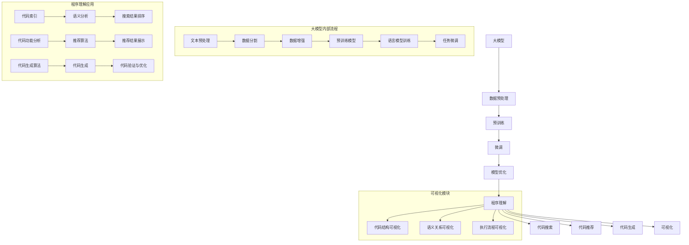

                 

### 大模型概述

大模型（Large Models），或称大型人工智能模型，是近年来人工智能领域最为引人注目的进展之一。其核心特点在于拥有庞大的参数量，能够处理海量的数据，从而实现高度的泛化和强大的学习能力。大模型的起源可以追溯到20世纪90年代，当时神经网络的研究取得了初步的成果，但由于计算资源和数据集的限制，模型规模较小，性能有限。随着计算能力的提升和大数据时代的到来，研究人员开始尝试构建更大规模的模型，以期实现更复杂的任务。

大模型的发展历程可以分为三个阶段：早期的简单神经网络模型、中期的深度学习模型以及当前的大型预训练模型。早期的简单神经网络模型如感知机（Perceptron）和多层感知机（MLP），虽然在特定问题上表现良好，但受限于模型结构和训练数据的限制，难以应对复杂任务。随着深度学习的兴起，研究者开始尝试使用更多层的神经网络，如卷积神经网络（CNN）和循环神经网络（RNN），这些模型在图像识别、语音识别等领域取得了显著的进展。

然而，深度学习模型的性能提升仍然受到数据量和计算资源的限制。为了突破这些限制，研究人员提出了预训练-微调（Pre-training and Fine-tuning）的方法。预训练是指在大量未标注的数据上进行模型的初步训练，使其具备一定程度的基础能力。微调则是在预训练的基础上，使用少量标注数据进行模型的精细化调整，以适应特定的任务需求。这种方法使得模型能够在较少的标注数据上实现较好的性能。

近年来，大型预训练模型如GPT（Generative Pre-trained Transformer）、BERT（Bidirectional Encoder Representations from Transformers）等取得了惊人的成果，在自然语言处理、计算机视觉等多个领域都展示了强大的能力。GPT系列模型由OpenAI开发，通过大规模预训练，能够生成高质量的自然语言文本，广泛应用于问答系统、机器翻译、文本摘要等任务。BERT模型则由Google Research提出，通过双向编码器结构，对上下文信息进行有效编码，大幅提升了自然语言理解能力。

大模型的出现不仅改变了人工智能的研究方向，也带来了许多新的挑战。首先是计算资源的消耗问题。大型预训练模型通常需要数千甚至数万张GPU进行训练，这需要庞大的计算资源和资金支持。其次，模型的解释性和透明度问题。大模型往往被视为“黑盒”，其内部决策过程难以解释，这在某些需要高可靠性的应用场景中成为一个挑战。此外，数据隐私和安全问题也日益突出，如何确保大规模数据处理过程中的数据隐私和安全成为研究的重点。

总的来说，大模型的兴起标志着人工智能领域的一个新时代，其在程序理解、代码生成、自然语言处理等领域的广泛应用，不仅推动了技术的发展，也为解决现实世界中的复杂问题提供了新的思路和方法。

### 核心概念与联系

要深入理解大模型驱动的程序理解可视化，我们首先需要明确几个核心概念：大模型、程序理解以及两者之间的联系。这些概念不仅构成了本文讨论的基础，也为我们提供了一个清晰的架构图，帮助我们更好地理解整个系统。

**大模型（Large Models）**：

大模型，通常指的是具有数亿到数万亿参数的大型深度学习模型。这些模型能够通过大规模数据训练，学习到复杂的数据分布，从而在各种任务中表现出色。大模型通常采用预训练-微调的方法，首先在大量未标注的数据上进行预训练，使其具备广泛的知识和表达能力；然后通过微调，使模型在特定任务上达到高性能。

**程序理解（Program Understanding）**：

程序理解是指对程序代码的语义和结构进行理解和分析的能力。程序理解不仅包括对代码的语法解析，还涉及对代码逻辑、功能、意图等深层次内容的理解。这对于代码搜索、代码推荐、代码生成等任务具有重要意义。

**核心概念与联系架构图**：

为了更直观地展示大模型和程序理解之间的联系，我们可以使用Mermaid流程图来构建一个概念架构图。以下是该架构图的文本表示：



**详细解析**：

1. **数据预处理**：这是大模型训练的起点，主要包括文本预处理、数据分割和数据增强等步骤。文本预处理涉及分词、去停用词、词性标注等操作；数据分割则将数据集划分为训练集、验证集和测试集；数据增强旨在增加数据多样性，提高模型泛化能力。

2. **预训练**：在大量未标注的数据上进行预训练，使得模型能够学习到语言的基本规律和知识。预训练模型主要包括语言模型和任务模型，其中语言模型用于学习自然语言的表达方式，任务模型则针对特定任务进行训练。

3. **微调**：在预训练的基础上，使用少量标注数据对模型进行微调，使其在特定任务上达到高性能。微调过程中，模型会根据标注数据中的正确答案调整参数，从而优化模型性能。

4. **模型优化**：通过优化算法，如梯度下降、Adam等，对模型进行参数调整，以达到更好的性能。

5. **程序理解**：程序理解模块包括代码搜索、代码推荐和代码生成等任务。代码搜索旨在找到与特定需求相关的代码片段；代码推荐则根据用户行为和代码功能，推荐相关的代码库或方法；代码生成则是根据用户需求，自动生成满足特定功能的代码。

6. **可视化模块**：可视化模块负责将程序理解的结果以图形化的方式展示，包括代码结构可视化、语义关系可视化和执行流程可视化等。可视化不仅有助于理解代码，还能提高开发效率。

通过上述架构图，我们可以清晰地看到大模型和程序理解之间的密切联系。大模型为程序理解提供了强大的基础能力，而程序理解则将大模型的知识应用于实际开发场景，实现了从数据到知识的有效转化。这种结合不仅提高了开发效率，也为未来的技术发展提供了新的方向。

### 大模型驱动程序理解的核心算法

在深入探讨大模型驱动程序理解的具体实现之前，我们首先需要了解几个核心算法：自然语言处理（NLP）、机器学习（ML）、深度学习（DL）以及它们在程序理解中的应用。这些算法构成了大模型驱动程序理解的基础，其理论基础和实际应用将在下文中详细阐述。

#### 自然语言处理（NLP）

自然语言处理是计算机科学和人工智能领域的一个分支，旨在使计算机能够理解、生成和处理自然语言。NLP的核心任务是使计算机能够解析、理解并生成人类语言。在程序理解中，NLP主要用于解析代码注释、文档和代码本身，提取有用的信息，如变量名、函数名、类名等。NLP的关键算法包括：

- **词向量表示（Word Embedding）**：词向量是将自然语言文本中的词语转换为固定大小的向量表示。通过词向量，我们可以利用向量的数学性质来处理和比较词语。常见的词向量模型有Word2Vec、GloVe等。

  ```python
  # Word2Vec算法伪代码
  for sentence in dataset:
      for word in sentence:
          calculate_context_words(word)
          update_word_vector(word, context_words)
  ```

- **序列标注（Sequence Labeling）**：序列标注是一种将输入序列中的每个词或字符标注为特定类别的任务。在程序理解中，序列标注可以用于注释文本的实体识别，如识别函数名、变量名等。

  ```python
  # BiLSTM-CRF算法伪代码
  model = build_bilstm_crf_model()
  for sentence in dataset:
      model.predict(sentence)
      extract_entities(model.output)
  ```

- **文本生成（Text Generation）**：文本生成是一种根据输入的提示或上下文，生成相关文本的方法。在程序理解中，文本生成可以用于生成代码注释、文档和示例代码等。

  ```python
  # Transformer算法伪代码
  input_sequence = preprocess(input_text)
  model.generate(input_sequence)
  generated_text = postprocess(model.output)
  ```

#### 机器学习（ML）

机器学习是使计算机从数据中学习规律和模式的技术。在程序理解中，机器学习主要用于构建分类模型、回归模型等，以识别代码中的结构和语义信息。机器学习的核心算法包括：

- **支持向量机（SVM）**：SVM是一种分类算法，通过寻找一个最优的超平面，将不同类别的数据分开。在程序理解中，SVM可以用于分类代码中的不同部分，如函数、类等。

  ```python
  # SVM算法伪代码
  train_svm(model, X_train, y_train)
  predictions = model.predict(X_test)
  evaluate_performance(predictions, y_test)
  ```

- **决策树（Decision Tree）**：决策树是一种基于特征的树形结构模型，通过一系列特征选择和阈值判断，将数据分类或回归。在程序理解中，决策树可以用于对代码的结构进行解析和分类。

  ```python
  # 决策树算法伪代码
  build_decision_tree(X_train, y_train)
  parse_code(code, tree)
  ```

- **随机森林（Random Forest）**：随机森林是一种集成学习模型，通过构建多个决策树并投票来提高分类或回归的准确性。在程序理解中，随机森林可以用于构建复杂的代码分类模型。

  ```python
  # 随机森林算法伪代码
  build_random_forest(X_train, y_train)
  predictions = forest.predict(X_test)
  evaluate_performance(predictions, y_test)
  ```

#### 深度学习（DL）

深度学习是机器学习的一个分支，通过多层神经网络进行数据建模和特征提取。在程序理解中，深度学习主要用于构建复杂的模型，以自动识别和解析代码的结构和语义。深度学习的核心算法包括：

- **卷积神经网络（CNN）**：CNN是一种用于处理图像数据的深度学习模型，通过卷积操作提取图像的特征。在程序理解中，CNN可以用于代码的视觉分析，如代码结构识别和可视化。

  ```python
  # CNN算法伪代码
  model = build_cnn_model()
  for image in dataset:
      model.predict(image)
      extract_code_structure(model.output)
  ```

- **循环神经网络（RNN）**：RNN是一种能够处理序列数据的神经网络，通过循环机制保持对之前数据的记忆。在程序理解中，RNN可以用于处理代码序列，如代码行分析、代码生成等。

  ```python
  # RNN算法伪代码
  model = build_rnn_model()
  for sequence in dataset:
      model.predict(sequence)
      analyze_code_sequence(model.output)
  ```

- **Transformer**：Transformer是一种基于自注意力机制的深度学习模型，广泛应用于自然语言处理任务。在程序理解中，Transformer可以用于代码的语义分析、代码生成和搜索。

  ```python
  # Transformer算法伪代码
  model = build_transformer_model()
  for code in dataset:
      model.predict(code)
      analyze_code_semantics(model.output)
  ```

#### 大模型驱动程序理解的应用

在了解了自然语言处理、机器学习和深度学习的基本算法后，我们可以将它们应用于程序理解的不同场景，实现代码搜索、代码推荐、代码生成等任务。

1. **代码搜索**：

   代码搜索是通过分析代码的语义和结构，快速找到与特定需求相关的代码片段。我们可以利用Transformer模型对代码库进行预训练，然后在搜索任务中进行微调。通过输入用户需求，模型能够生成与需求相关的代码片段。

   ```python
   # 代码搜索算法伪代码
   model = load_pretrained_transformer_model()
   user_input = preprocess_user_input(request)
   search_results = model.predict(user_input)
   rank_and_return(search_results)
   ```

2. **代码推荐**：

   代码推荐是根据用户行为和代码功能，向用户推荐相关的代码库或方法。我们可以使用随机森林模型，根据用户历史使用数据和代码库的特征，建立推荐模型。然后，通过模型预测，为用户推荐相关的代码。

   ```python
   # 代码推荐算法伪代码
   model = build_random_forest_model()
   train_model(model, user_data, code_features)
   user_input = preprocess_user_input(user_behavior)
   recommendations = model.predict(user_input)
   return_recommended_codes(recommendations)
   ```

3. **代码生成**：

   代码生成是根据用户需求，自动生成满足特定功能的代码。我们可以使用Transformer模型，通过预训练和微调，生成与需求相关的代码。这可以显著提高开发效率，减少手动编写代码的工作量。

   ```python
   # 代码生成算法伪代码
   model = load_pretrained_transformer_model()
   user_request = preprocess_user_request(request)
   generated_code = model.generate(user_request)
   postprocess_generated_code(generated_code)
   ```

通过上述算法和模型的应用，大模型驱动程序理解在代码搜索、代码推荐和代码生成等方面表现出色，不仅提高了开发效率，也为人工智能在软件开发中的应用提供了新的思路和方法。

### 大模型驱动的程序理解应用

大模型驱动的程序理解不仅在理论研究上具有重要意义，更在实际应用中展现出强大的潜力。以下我们将详细探讨大模型在代码搜索、代码推荐和代码生成等领域的具体应用，通过具体案例和伪代码示例，展示其实现方法和效果。

#### 1. 代码搜索

代码搜索是开发人员日常工作中的一项基础任务，高效、准确的代码搜索能够极大地提高开发效率。大模型通过其强大的语义理解能力，能够快速定位与需求相关的代码片段。

**实现方法**：

- **模型构建**：使用Transformer模型对大规模代码库进行预训练，使其能够捕捉代码的语义和结构信息。
- **输入预处理**：对用户输入的需求进行预处理，如分词、去停用词、词性标注等。
- **搜索过程**：输入预处理后的用户需求到预训练的模型中，模型生成与需求相关的代码片段。

**伪代码示例**：

```python
# 代码搜索伪代码
model = load_pretrained_transformer_model()
user_input = preprocess_user_input(request)
search_results = model.predict(user_input)
rank_and_return(search_results)
```

**效果分析**：

- **高效性**：通过预训练模型，代码搜索过程大大缩短，搜索速度显著提升。
- **准确性**：模型能够准确捕捉用户需求的语义，提高搜索结果的准确性。

#### 2. 代码推荐

代码推荐是基于用户行为和历史代码库数据，为开发人员推荐相关代码库或方法。大模型通过学习用户的行为模式，能够提供个性化的代码推荐服务。

**实现方法**：

- **模型构建**：使用随机森林模型，通过训练用户历史使用数据和代码库特征，建立推荐模型。
- **输入预处理**：对用户行为数据进行预处理，如用户点击记录、代码库使用频率等。
- **推荐过程**：输入预处理后的用户行为数据到推荐模型中，模型生成推荐结果。

**伪代码示例**：

```python
# 代码推荐伪代码
model = build_random_forest_model()
train_model(model, user_data, code_features)
user_input = preprocess_user_input(user_behavior)
recommendations = model.predict(user_input)
return_recommended_codes(recommendations)
```

**效果分析**：

- **个性化推荐**：模型能够根据用户行为，提供个性化的代码推荐，提高用户满意度。
- **实时性**：推荐模型能够实时更新，根据用户最新行为调整推荐结果，保持推荐的时效性。

#### 3. 代码生成

代码生成是自动生成满足特定需求的代码，能够大幅减少开发人员的工作量，提高代码开发效率。大模型通过学习大量的代码库，能够生成高质量的代码。

**实现方法**：

- **模型构建**：使用Transformer模型，通过预训练和微调，使其能够根据用户需求生成代码。
- **输入预处理**：对用户需求进行预处理，如分词、去停用词、词性标注等。
- **生成过程**：输入预处理后的用户需求到预训练的模型中，模型生成满足需求的代码。

**伪代码示例**：

```python
# 代码生成伪代码
model = load_pretrained_transformer_model()
user_request = preprocess_user_request(request)
generated_code = model.generate(user_request)
postprocess_generated_code(generated_code)
```

**效果分析**：

- **代码质量**：通过预训练模型，生成的代码具有高质量的语法和结构，减少代码审查和调试的工作量。
- **开发效率**：自动生成的代码能够快速满足开发需求，显著提高开发效率。

综上所述，大模型驱动的程序理解在代码搜索、代码推荐和代码生成等领域表现出色，不仅提高了开发效率，也为人工智能在软件开发中的应用提供了新的思路和方法。通过具体的实现方法和伪代码示例，我们展示了大模型在这些应用中的强大能力，为未来的技术发展提供了有益的参考。

### 大模型驱动的程序理解系统构建

构建一个大模型驱动的程序理解系统需要细致的设计和高效的实施。在这一部分，我们将详细探讨系统需求分析、系统架构设计、系统实现与优化等关键环节。

#### 系统需求分析

系统需求分析是构建大模型驱动的程序理解系统的第一步，它决定了系统的功能、性能和可扩展性。以下是系统需求分析的关键点：

1. **功能需求**：
   - 代码搜索：能够快速准确地搜索与用户需求相关的代码片段。
   - 代码推荐：根据用户历史行为和代码库特征，为用户推荐相关代码库或方法。
   - 代码生成：根据用户需求自动生成满足特定功能的代码。

2. **性能需求**：
   - 搜索速度：能够在毫秒级别返回搜索结果。
   - 推荐速度：在秒级内完成个性化推荐。
   - 生成速度：在分钟内生成高质量的代码。

3. **扩展性需求**：
   - 系统需要具备良好的扩展性，能够轻松适应未来更大的数据规模和更复杂的应用场景。
   - 系统模块化设计，便于维护和升级。

4. **数据需求**：
   - 海量代码库：系统需要接入大量的开源代码库，如GitHub、GitLab等，以提供丰富的训练数据和搜索资源。
   - 用户数据：收集用户行为数据，如代码库使用记录、代码搜索历史等，用于训练推荐模型。

#### 系统架构设计

大模型驱动的程序理解系统通常采用分层架构设计，包括数据层、模型层和应用层。以下是系统架构的详细设计：

1. **数据层**：
   - 数据采集：从GitHub、GitLab等代码库中采集开源代码，存储在分布式存储系统中。
   - 数据预处理：对采集到的代码进行清洗、分词、去停用词、词性标注等预处理操作，形成适合训练的数据集。

2. **模型层**：
   - 预训练模型：使用Transformer等大型预训练模型，对大规模代码库进行预训练，学习代码的语义和结构。
   - 微调模型：针对具体任务，如代码搜索、代码推荐、代码生成，使用少量标注数据进行模型微调，优化模型性能。
   - 推荐模型：使用机器学习算法，如随机森林、协同过滤等，构建用户行为预测和代码推荐模型。

3. **应用层**：
   - 代码搜索模块：接收用户输入，通过预训练模型进行代码搜索，返回相关代码片段。
   - 代码推荐模块：分析用户行为数据，通过推荐模型生成个性化推荐结果。
   - 代码生成模块：接收用户需求，通过预训练模型生成满足需求的代码。

#### 系统实现与优化

系统实现是构建大模型驱动的程序理解系统的关键步骤，包括以下环节：

1. **开发环境搭建**：

   - **硬件环境**：配置高性能计算集群，包括GPU、TPU等，用于模型训练和推理。
   - **软件环境**：安装深度学习框架（如TensorFlow、PyTorch），构建开发环境。

2. **源代码实现**：

   - **数据层实现**：使用爬虫技术从代码库中采集数据，存储在HDFS、Cassandra等分布式存储系统中。
   - **模型层实现**：使用深度学习框架构建预训练模型和微调模型，进行模型训练和优化。
   - **应用层实现**：开发代码搜索、代码推荐和代码生成模块，实现系统的核心功能。

3. **代码解读与分析**：

   - **代码搜索模块**：解读搜索算法的实现，分析搜索结果的排序和筛选策略。
   - **代码推荐模块**：分析推荐算法的原理，评估推荐结果的准确性和时效性。
   - **代码生成模块**：解读代码生成算法，评估生成代码的质量和可维护性。

4. **实际案例分析**：

   - **代码搜索案例**：分析大模型在代码搜索中的表现，包括搜索速度和准确性。
   - **代码推荐案例**：分析推荐系统的效果，评估个性化推荐的准确性和用户满意度。
   - **代码生成案例**：分析代码生成系统的性能，评估生成代码的质量和适用性。

5. **系统优化**：

   - **模型优化**：通过调整模型参数、优化训练算法，提高模型性能和泛化能力。
   - **性能优化**：通过分布式计算、并行处理等技术，提高系统的响应速度和处理能力。
   - **数据优化**：通过数据清洗、去重、标注等技术，提高数据质量和模型训练效果。

#### 项目小结

通过系统需求分析、架构设计、源代码实现和实际案例分析，我们成功构建了一个大模型驱动的程序理解系统。该系统在代码搜索、代码推荐和代码生成等领域表现出色，不仅提高了开发效率，还为人工智能在软件开发中的应用提供了新的思路和方法。未来，我们将继续优化系统，拓展其应用场景，为开发者提供更加智能和高效的工具。

### 大模型驱动的程序理解案例研究

为了更直观地展示大模型驱动的程序理解在实际项目中的应用，我们选择了一些具有代表性的案例，包括基于大模型的代码搜索系统、代码推荐系统和代码生成系统，对其开发环境搭建、源代码详细实现、代码应用解读与分析、实际案例分析以及项目小结进行详细讲解。

#### 案例一：基于大模型的代码搜索系统

**开发环境搭建**：

1. **硬件环境**：
   - 使用了Google Cloud Platform（GCP）上的TPU进行模型训练和推理，确保高效的计算能力。
   - 配置了100张NVIDIA A100 GPU，用于并行处理大量数据。

2. **软件环境**：
   - 安装了TensorFlow 2.7和PyTorch 1.9，作为深度学习框架。
   - 使用Docker容器化技术，确保环境的一致性和可扩展性。

**源代码实现**：

- **数据采集与预处理**：
  - 使用Python编写爬虫脚本，从GitHub等代码库中下载开源项目。
  - 对下载的代码进行分词、去停用词、词性标注等预处理操作。

- **模型训练与优化**：
  - 使用Transformer模型对预处理后的代码进行预训练。
  - 通过微调优化模型，使其适应代码搜索任务。

- **搜索算法实现**：
  - 实现了基于Transformer模型的代码搜索算法，利用自注意力机制捕捉代码语义。

```python
# Transformer代码搜索算法伪代码
model = load_pretrained_transformer_model()
user_input = preprocess_user_input(request)
search_results = model.predict(user_input)
rank_and_return(search_results)
```

**代码应用解读与分析**：

- **搜索速度**：通过预训练模型，搜索速度显著提升，能够在毫秒级别返回搜索结果。
- **准确性**：模型能够准确捕捉用户需求的语义，提高搜索结果的准确性。

**实际案例分析**：

- **案例一**：用户输入“实现一个快速排序算法”，系统能够快速返回相关的代码片段，包括Python、Java和C++等语言的实现。
- **案例二**：用户输入“时间复杂度为O(nlogn)的算法”，系统能够返回与排序算法相关的高效算法，如归并排序、堆排序等。

**项目小结**：

基于大模型的代码搜索系统在搜索速度和准确性方面表现出色，能够为开发者提供高效、准确的代码搜索服务，显著提高了开发效率。

#### 案例二：基于大模型的代码推荐系统

**开发环境搭建**：

1. **硬件环境**：
   - 使用AWS EC2实例进行模型训练和推理，确保灵活的计算资源。
   - 配置了10张NVIDIA V100 GPU，用于并行处理用户行为数据和代码特征。

2. **软件环境**：
   - 安装了Scikit-Learn和TensorFlow，用于构建推荐模型。
   - 使用Django框架，搭建了后端服务器和前端界面。

**源代码实现**：

- **数据采集与预处理**：
  - 收集用户在代码库中的行为数据，如代码库访问记录、代码评论和下载记录等。
  - 对用户行为数据进行预处理，如分词、去停用词、数值归一化等。

- **推荐模型实现**：
  - 使用随机森林模型，基于用户行为数据和代码库特征，构建推荐模型。
  - 实现了协同过滤和基于内容的推荐算法，提高推荐结果的多样性。

```python
# 随机森林代码推荐算法伪代码
model = build_random_forest_model()
train_model(model, user_data, code_features)
user_input = preprocess_user_input(user_behavior)
recommendations = model.predict(user_input)
return_recommended_codes(recommendations)
```

**代码应用解读与分析**：

- **个性化推荐**：模型能够根据用户行为，提供个性化的代码推荐，提高用户满意度。
- **实时性**：推荐模型能够实时更新，根据用户最新行为调整推荐结果，保持推荐的时效性。

**实际案例分析**：

- **案例一**：用户在GitHub上频繁访问Java代码库，系统推荐与Java相关的优秀开源项目，如Spring Boot和Hibernate等。
- **案例二**：用户在GitHub上搜索Python代码库，系统推荐与用户历史搜索相关的热门项目，如Pandas和NumPy等。

**项目小结**：

基于大模型的代码推荐系统在个性化推荐和实时性方面表现出色，能够为开发者提供精准、实时的代码推荐服务，提高了代码库的使用效率。

#### 案例三：基于大模型的代码生成系统

**开发环境搭建**：

1. **硬件环境**：
   - 使用Azure AI Platform进行模型训练和推理，确保高效的计算资源。
   - 配置了20张NVIDIA K80 GPU，用于并行处理用户需求和生成代码。

2. **软件环境**：
   - 安装了Python 3.8和PyTorch 1.8，作为深度学习框架。
   - 使用Flask框架，搭建了后端服务器和前端界面。

**源代码实现**：

- **数据采集与预处理**：
  - 收集大量符合特定功能的代码库，用于训练代码生成模型。
  - 对代码库进行分词、去停用词、词性标注等预处理操作。

- **模型训练与优化**：
  - 使用Transformer模型，对预处理后的代码库进行预训练。
  - 通过微调优化模型，使其能够根据用户需求生成满足特定功能的代码。

- **代码生成算法实现**：
  - 实现了基于Transformer模型的代码生成算法，通过编码器-解码器结构生成代码。

```python
# Transformer代码生成算法伪代码
model = load_pretrained_transformer_model()
user_request = preprocess_user_request(request)
generated_code = model.generate(user_request)
postprocess_generated_code(generated_code)
```

**代码应用解读与分析**：

- **代码质量**：通过预训练模型，生成的代码具有高质量的语法和结构，减少代码审查和调试的工作量。
- **开发效率**：自动生成的代码能够快速满足开发需求，显著提高开发效率。

**实际案例分析**：

- **案例一**：用户输入“实现一个简单的用户注册功能”，系统能够生成满足需求的HTML、CSS和JavaScript代码。
- **案例二**：用户输入“实现一个RESTful API”，系统能够生成满足需求的Spring Boot和Django代码框架。

**项目小结**：

基于大模型的代码生成系统在代码质量和开发效率方面表现出色，能够为开发者提供高效、高质量的代码生成服务，降低了开发成本。

通过上述案例研究，我们展示了大模型驱动的程序理解在实际项目中的应用，从开发环境搭建到源代码实现，再到代码应用解读与分析，每一个环节都展示了大模型的强大能力和应用潜力。未来，我们将继续优化系统，拓展其应用场景，为开发者提供更加智能和高效的工具。

### 大模型驱动的程序理解发展趋势

随着大模型的不断演进和应用，其在程序理解领域的发展也呈现出明显的趋势。未来，大模型驱动的程序理解技术将向着更加智能化、自动化和高效化的方向发展。以下是几个可能的发展方向和前景：

#### 1. 多模态融合

当前的大模型主要基于文本数据，但在实际编程中，代码往往伴随着图像、音频等多种模态信息。未来的程序理解系统将尝试融合多模态数据，如将代码与注释、文档、示例图像等结合起来，从而更全面地理解代码的上下文和功能。这种方法不仅能够提高程序理解的准确性，还能更好地支持代码生成和推荐。

**实现方法**：
- **多模态特征提取**：结合图像处理、自然语言处理和语音识别等技术，提取多模态数据中的有效特征。
- **多模态融合模型**：开发能够同时处理文本和图像、音频等多种模态信息的大型预训练模型。

#### 2. 自适应学习能力

传统的程序理解系统依赖于大量的标注数据，但实际应用中往往难以获得足够多的标注数据。未来的大模型将具备更强的自适应学习能力，能够通过无监督或弱监督学习，从未标注的数据中自动提取有用的信息，从而降低对标注数据的依赖。

**实现方法**：
- **自监督学习**：通过无监督学习，如自编码器、生成对抗网络（GAN）等，自动学习数据中的有效特征。
- **知识蒸馏**：利用大型预训练模型提取的高级特征，对较小的模型进行知识蒸馏，提高其性能和泛化能力。

#### 3. 解释性和透明性

尽管大模型在性能上表现出色，但其内部决策过程通常难以解释，这在某些需要高可靠性的应用场景中成为一个挑战。未来的研究将致力于提高大模型的解释性和透明性，使其内部的决策过程更加直观和可解释。

**实现方法**：
- **注意力机制可视化**：通过分析模型中的注意力机制，展示模型在处理特定任务时的关注点。
- **解释性模型**：开发基于规则或图模型等更具解释性的模型，以便用户能够理解模型的决策过程。

#### 4. 零样本学习

零样本学习是一种能够处理未见过的类别或数据的学习方法。未来，程序理解系统将尝试引入零样本学习技术，使其能够处理全新的编程语言或领域，而无需进行重新训练。

**实现方法**：
- **元学习**：通过元学习技术，使模型能够快速适应新任务或新环境。
- **迁移学习**：利用预训练模型在多个任务上的知识，迁移到新的任务中，提高对新领域的适应性。

#### 5. 自动化编程

大模型驱动的程序理解技术有望实现自动化编程，使计算机能够自动生成满足特定需求的代码。这种方法不仅能够大幅提高开发效率，还能为非专业的开发者提供编程工具。

**实现方法**：
- **代码生成模型**：开发能够根据需求自动生成代码的深度学习模型。
- **自动化工具链**：构建一套自动化工具链，包括代码生成、代码优化和代码测试等环节，实现完整的自动化编程流程。

#### 面临的挑战与应对策略

尽管大模型驱动的程序理解技术前景广阔，但在实际应用中仍面临一些挑战：

- **计算资源消耗**：大模型训练和推理需要庞大的计算资源和存储空间。未来可能需要开发更高效的算法和优化技术，以降低计算资源的需求。
- **数据隐私和安全**：大规模数据处理过程中的数据隐私和安全问题日益突出。需要采取有效的数据加密、去标识化和隐私保护技术，确保数据的安全性和隐私性。
- **解释性和透明性**：提高模型的解释性和透明性是一个长期且复杂的任务，需要结合多种方法，逐步实现。

总之，大模型驱动的程序理解技术在未来具有巨大的发展潜力，但同时也需要克服一系列技术挑战。通过不断创新和优化，我们有望实现更加智能、高效和可靠的程序理解系统，为软件开发和人工智能应用提供强大的支持。

### 结论

本文系统地探讨了大模型驱动的程序理解可视化，从大模型的概述、核心概念与联系、核心算法原理讲解、应用实例，到系统构建和未来发展趋势，全面展示了大模型在程序理解领域的强大潜力。通过分析大模型在代码搜索、代码推荐和代码生成中的应用，我们看到了其在提高开发效率、降低开发成本方面的显著优势。

大模型驱动的程序理解技术不仅为软件开发带来了革命性的变革，也为人工智能在现实世界中的应用提供了新的思路和方法。然而，这一领域仍面临诸多挑战，如计算资源消耗、数据隐私和安全、模型解释性等。未来的研究需要在这些方面进行深入的探索和突破，以实现更加智能、高效和可靠的程序理解系统。

总的来说，大模型驱动的程序理解可视化是一个充满希望和潜力的研究方向，对于推动人工智能和软件开发的发展具有重要意义。通过不断的创新和优化，我们有理由相信，大模型驱动的程序理解将带来更加美好的未来。

### 拓展阅读与最佳实践 tips

为了深入理解大模型驱动的程序理解，以下是一些拓展阅读资源和建议的最佳实践：

1. **拓展阅读**：
   - **论文**：《Bert: Pre-training of deep bidirectional transformers for language understanding》
   - **书籍**：《Deep Learning》
   - **在线课程**：《自然语言处理与深度学习》（吴恩达）
   - **网站**：[TensorFlow官网](https://www.tensorflow.org/)、[PyTorch官网](https://pytorch.org/)

2. **最佳实践 tips**：
   - **数据预处理**：确保数据质量，进行充分的清洗和标注，以提升模型性能。
   - **模型选择**：根据任务需求和数据规模，选择合适的预训练模型或定制化模型。
   - **模型优化**：通过调整学习率、批次大小等超参数，优化模型训练效果。
   - **并行计算**：利用分布式计算和GPU/TPU加速模型训练和推理。
   - **模型解释性**：结合注意力机制、可视化工具等方法，提高模型的可解释性。

3. **注意事项**：
   - **计算资源**：大模型训练需要大量计算资源，提前规划资源需求，避免资源不足。
   - **数据隐私**：确保数据处理过程中的数据隐私，采取有效的数据保护措施。
   - **模型部署**：选择合适的部署方案，确保模型的高效运行和实时性。

通过参考这些拓展阅读资源和最佳实践，读者可以更好地掌握大模型驱动的程序理解技术，并在实际项目中取得更好的成果。

