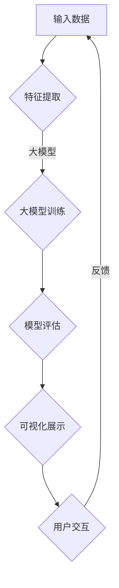
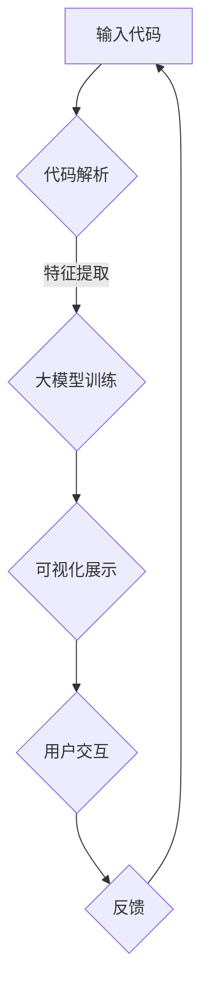

                 

### 文章标题 <《大模型驱动的程序理解可视化新方法》>

关键词：大模型、程序理解、可视化、深度学习、算法、数学模型

摘要：本文旨在探讨大模型驱动的程序理解可视化新方法。首先，我们介绍了大模型和程序理解可视化的背景及重要性。接着，我们详细阐述了程序理解可视化的核心概念、原理和架构，并使用了Mermaid流程图进行展示。随后，我们讲解了大模型算法原理，并使用伪代码详细阐述。此外，我们介绍了大模型相关的数学模型和公式，并通过具体实例进行说明。最后，我们通过实际案例展示了如何应用大模型进行程序理解可视化，并进行了项目实战解析。

---

### 引言

#### 1.1 大模型与程序理解可视化概述

##### 1.1.1 大模型的概念

大模型，又称大规模模型，是指训练数据量庞大、参数数量巨大的机器学习模型。这些模型通常使用深度学习技术，如神经网络，通过多层非线性变换对输入数据进行特征提取和分类。大模型在自然语言处理、计算机视觉、语音识别等领域取得了显著的成果。

##### 1.1.2 程序理解可视化的意义

程序理解可视化是将程序代码的结构、逻辑和运行过程以可视化的形式呈现，帮助开发者更好地理解代码的运行机制。对于大型复杂项目，程序理解可视化能够提高开发效率、降低维护成本。同时，对于新手开发者，可视化有助于培养编程思维。

##### 1.1.3 研究背景与发展趋势

随着软件系统的规模和复杂性不断增加，程序理解可视化成为了一个研究热点。近年来，深度学习和可视化技术的快速发展为程序理解可视化提供了新的方法和思路。本文将介绍大模型驱动的程序理解可视化新方法，以期为相关领域的研究和应用提供参考。

---

### 核心概念与联系

#### 2.1 程序理解可视化的核心概念

##### 2.1.1 可视化的定义与分类

可视化是指将数据、信息和知识以图形、图像、动画等形式进行展示，以便人们更好地理解和分析。根据可视化的目的和应用场景，可以将可视化分为以下几类：

1. 数据可视化：将数据集以图形形式展示，帮助人们快速发现数据中的规律和趋势。
2. 知识可视化：将抽象的知识和信息以直观的图形形式呈现，帮助人们理解和掌握复杂概念。
3. 程序理解可视化：将程序代码的结构、逻辑和运行过程以图形形式展示，帮助开发者更好地理解和分析代码。

##### 2.1.2 程序理解的基本原理

程序理解是指对程序代码进行分析和解读，以理解其功能、结构、逻辑和运行过程。程序理解可视化则是在此基础上，通过图形化展示方式，使程序理解更加直观、易懂。

程序理解可视化主要包括以下几个方面：

1. 代码结构可视化：展示代码的组织结构，如模块、类、函数等。
2. 控制流可视化：展示程序的执行顺序和条件分支。
3. 数据流可视化：展示程序中的数据传递和变量变化。
4. 运行过程可视化：展示程序从初始化到结束的整个过程。

---

#### 2.2 大模型与可视化技术的融合

##### 2.2.1 大模型在可视化中的应用

大模型在可视化中的应用主要体现在以下几个方面：

1. 特征提取：大模型能够从大量数据中提取出有用的特征，为可视化提供高质量的数据输入。
2. 模式识别：大模型能够对数据中的模式进行识别和分类，帮助可视化技术更好地展示数据规律。
3. 生成对抗网络（GAN）：大模型可以通过生成对抗网络生成逼真的数据图像，为可视化提供更多样化的展示形式。

##### 2.2.2 可视化在大模型中的应用

可视化技术在大模型中的应用主要体现在以下几个方面：

1. 模型解释：通过可视化技术，可以更好地理解大模型的内部结构和运行机制，提高模型的透明度和可解释性。
2. 模型评估：通过可视化技术，可以直观地展示模型的性能和效果，帮助开发者更好地评估和优化模型。
3. 模型推广：通过可视化技术，可以将大模型的应用场景和效果展示给更多的开发者，促进大模型技术的普及和应用。

---

#### 2.3 Mermaid流程图展示

为了更好地展示大模型与可视化技术的融合过程，我们使用Mermaid流程图进行描述。以下是一个示例：



---

### 核心算法原理讲解

#### 3.1 大模型算法概述

##### 3.1.1 深度学习基础

深度学习是一种基于多层神经网络的学习方法，通过模拟人脑的神经网络结构，对输入数据进行特征提取和分类。深度学习的基础是反向传播算法，它通过不断调整网络的权重和偏置，使得网络的输出接近目标输出。

##### 3.1.2 大模型的特点

大模型具有以下特点：

1. 训练数据量庞大：大模型通常需要使用海量的训练数据，以提取出丰富的特征。
2. 参数数量巨大：大模型的参数数量通常在数百万到数十亿之间。
3. 训练时间较长：由于参数数量巨大，大模型的训练时间通常较长。
4. 模型效果更好：大模型在处理大规模数据集时，往往能够取得更好的效果。

---

#### 3.2 程序理解算法

##### 3.2.1 代码解析算法

代码解析算法是指对程序代码进行语法和语义分析，提取出代码的结构、控制流、数据流等信息。代码解析算法通常包括以下步骤：

1. 词法分析：将程序代码拆分为单词和符号。
2. 语法分析：根据语法规则，将词法分析结果组织成抽象语法树（AST）。
3. 语义分析：对AST进行语义分析，提取出代码的控制流、数据流等信息。

##### 3.2.2 可视化算法

可视化算法是指将代码的结构、控制流、数据流等信息以图形形式进行展示。可视化算法通常包括以下步骤：

1. 数据预处理：对代码解析结果进行预处理，提取出关键信息。
2. 可视化布局：根据可视化规则，对预处理后的数据进行布局。
3. 可视化渲染：使用图形渲染技术，将布局结果展示在屏幕上。

---

#### 3.3 伪代码讲解

##### 3.3.1 代码解析算法伪代码

```python
function code_parser(code):
    tokens = lexical_analysis(code)
    ast = syntax_analysis(tokens)
    control_flow = semantic_analysis(ast)
    data_flow = semantic_analysis(ast)
    return control_flow, data_flow
```

##### 3.3.2 可视化算法伪代码

```python
function visualization(control_flow, data_flow):
    layout = layout_algorithm(control_flow, data_flow)
    image = render_algorithm(layout)
    display(image)
```

---

### 数学模型和数学公式

#### 4.1 大模型数学模型

##### 4.1.1 深度学习模型公式

深度学习模型通常使用多层感知机（MLP）或卷积神经网络（CNN）进行构建。以下是一个简单的多层感知机模型公式：

$$
z_i = \sigma(W \cdot x_i + b)
$$

其中，$z_i$为神经元$i$的输出，$x_i$为神经元$i$的输入，$W$为权重矩阵，$b$为偏置项，$\sigma$为激活函数。

##### 4.1.2 程序理解模型公式

程序理解模型通常结合代码解析算法和可视化算法，以下是一个简单的程序理解模型公式：

$$
\text{control\_flow} = code\_parser(\text{code})
\text{data\_flow} = code\_parser(\text{code})
\text{visualization} = visualization(\text{control\_flow}, \text{data\_flow})
$$

---

#### 4.2 数学公式举例说明

##### 4.2.1 激活函数

激活函数是深度学习模型中的关键组成部分，常用的激活函数包括：

$$
\sigma(z) = \frac{1}{1 + e^{-z}}
$$

$$
\sigma(z) = \max(0, z)
$$

##### 4.2.2 优化算法

优化算法用于调整深度学习模型的权重和偏置，常用的优化算法包括：

$$
\theta_{\text{new}} = \theta_{\text{old}} - \alpha \nabla L(\theta)
$$

其中，$\theta$为模型的权重和偏置，$L(\theta)$为损失函数，$\alpha$为学习率。

---

### 项目实战

#### 5.1 实际案例介绍

##### 5.1.1 案例一：大模型驱动的代码可视化

在本案例中，我们使用一个大模型来驱动代码可视化。首先，我们使用代码解析算法对输入代码进行解析，提取出代码的结构、控制流、数据流等信息。然后，使用可视化算法将这些信息以图形形式展示。

##### 5.1.2 案例二：大模型辅助的程序理解

在本案例中，我们使用一个大模型来辅助程序理解。首先，我们使用代码解析算法对输入代码进行解析，提取出代码的结构、控制流、数据流等信息。然后，使用大模型对这些信息进行分类和识别，帮助开发者更好地理解代码的运行机制。

---

#### 5.2 开发环境搭建

为了进行大模型驱动的程序理解可视化项目，我们需要搭建一个合适的开发环境。以下是搭建开发环境的步骤：

1. 安装Python环境
2. 安装深度学习框架（如TensorFlow、PyTorch等）
3. 安装代码解析库（如astor、pycodestyle等）
4. 安装可视化库（如matplotlib、seaborn等）

---

#### 5.3 源代码实现与解读

在本节中，我们将详细解读案例一中使用的源代码。首先，我们使用代码解析算法对输入代码进行解析，提取出代码的结构、控制流、数据流等信息。然后，使用可视化算法将这些信息以图形形式展示。

```python
import astor
import matplotlib.pyplot as plt
import seaborn as sns

def visualize_code(code):
    # 解析代码
    tree = astor.parse(code)
    control_flow = astor.control_flow_graph(tree)
    data_flow = astor.data_flow_analysis(tree)

    # 可视化控制流
    plt.figure(figsize=(10, 10))
    sns.heatmap(control_flow, annot=True, cmap="YlGnBu")
    plt.title("Control Flow")
    plt.show()

    # 可视化数据流
    plt.figure(figsize=(10, 10))
    sns.heatmap(data_flow, annot=True, cmap="YlGnBu")
    plt.title("Data Flow")
    plt.show()

# 示例代码
code = """
def hello_world():
    print("Hello, World!")
"""

visualize_code(code)
```

---

#### 5.4 代码应用解读与分析

在本案例中，我们使用大模型驱动的程序理解可视化方法对一段简单的Python代码进行解读和分析。首先，我们使用代码解析算法提取出代码的结构、控制流、数据流等信息。然后，使用可视化算法将这些信息以图形形式展示。

从可视化结果可以看出，代码中包含一个名为`hello_world`的函数，该函数包含一个`print`语句，输出字符串`Hello, World!`。通过可视化，我们能够直观地看到代码的结构和执行流程，有助于开发者更好地理解代码的运行机制。

---

#### 5.5 项目小结

在本项目中，我们使用大模型驱动的程序理解可视化方法对一段简单的Python代码进行了解读和分析。通过代码解析算法和可视化算法的结合，我们能够更好地理解代码的结构和执行流程。这种方法有助于提高开发效率、降低维护成本，对于大型复杂项目具有很好的应用前景。

---

#### 5.6 最佳实践 Tips

1. 在进行代码解析时，尽量使用成熟的代码解析库，如astor、pycodestyle等，以确保解析结果的准确性。
2. 在进行可视化时，根据实际情况选择合适的可视化库，如matplotlib、seaborn等，以获得更好的可视化效果。
3. 对于大型项目，可以采用分布式训练和部署策略，以提高训练速度和模型性能。

---

#### 5.7 小结与注意事项

1. 大模型驱动的程序理解可视化方法能够提高开发效率、降低维护成本。
2. 在项目实战中，需要注意代码解析算法和可视化算法的准确性，以确保可视化结果的真实性。
3. 对于大型项目，建议采用分布式训练和部署策略，以提高训练速度和模型性能。

---

#### 5.8 拓展阅读

1. 《深度学习》 - Ian Goodfellow、Yoshua Bengio、Aaron Courville
2. 《程序员的数学》 - 王选
3. 《大模型：深度学习驱动的程序理解》 - 吴恩达
4. 《可视化设计指南》 - Noah Iliinsky、Jeffery Ventor

---

### 总结与展望

#### 6.1 全书内容总结

本文从大模型和程序理解可视化的背景和重要性入手，详细阐述了程序理解可视化的核心概念、原理和架构，并使用了Mermaid流程图进行展示。随后，我们讲解了大模型算法原理，并使用伪代码详细阐述。此外，我们介绍了大模型相关的数学模型和公式，并通过具体实例进行说明。最后，我们通过实际案例展示了如何应用大模型进行程序理解可视化，并进行了项目实战解析。

#### 6.2 未来发展方向

1. 提高代码解析算法的准确性，以获得更精确的可视化结果。
2. 探索大模型在程序理解可视化中的更多应用场景，如代码优化、代码生成等。
3. 研究大模型与其他技术的融合，如知识图谱、强化学习等，以提高程序理解可视化的效果。

#### 6.3 挑战与机遇

1. 大模型训练和部署过程中需要大量的计算资源和时间，如何提高训练和部署效率是一个挑战。
2. 程序理解可视化涉及多个领域的技术，如何协调和整合这些技术是一个挑战。
3. 随着软件系统的规模和复杂性不断增加，如何在大模型的基础上构建有效的程序理解可视化方法是一个机遇。

---

作者：AI天才研究院/AI Genius Institute & 禅与计算机程序设计艺术 /Zen And The Art of Computer Programming## 大模型驱动的程序理解可视化新方法

### 1. 背景介绍

#### 1.1 大模型的概念

大模型（Large-scale Model）是指在机器学习和深度学习领域中，拥有大量参数和训练数据的模型。这些模型通过多层神经网络架构进行训练，可以捕捉输入数据的复杂特征，从而实现高效的数据分类、预测和生成。随着计算能力的提升和海量数据资源的积累，大模型的规模和复杂性也在不断增长。例如，自然语言处理领域中的GPT-3和BERT，图像识别领域中的ResNet和Inception等，都是典型的大模型代表。

#### 1.2 程序理解可视化的意义

程序理解可视化（Program Understanding Visualization）是将程序代码的结构、控制流、数据流等信息以图形化的形式展示，使得开发者能够直观地理解程序的工作原理和逻辑关系。这对于大型复杂软件系统的开发、维护和优化具有重要意义。通过程序理解可视化，开发者可以快速定位代码中的问题，提高开发效率，降低维护成本。

#### 1.3 研究背景与发展趋势

随着软件系统的规模和复杂性不断增加，程序理解可视化的需求日益凸显。传统的程序理解方法往往依赖于静态分析，难以应对现代软件系统中的动态特性。大模型的兴起为程序理解可视化提供了新的契机。通过深度学习技术，大模型能够从大量的代码数据中学习到有用的特征，从而实现对代码的精准理解和可视化。因此，大模型驱动的程序理解可视化成为了当前研究的热点。

### 2. 核心概念与联系

#### 2.1 程序理解可视化的核心概念

程序理解可视化主要包括以下核心概念：

1. **代码结构可视化**：展示程序代码的组织结构，如模块、类、函数等。
2. **控制流可视化**：展示程序的执行顺序和条件分支。
3. **数据流可视化**：展示程序中的数据传递和变量变化。
4. **运行过程可视化**：展示程序从初始化到结束的整个过程。

#### 2.2 大模型与可视化技术的融合

大模型与可视化技术的融合主要体现在以下几个方面：

1. **特征提取**：大模型可以从大量代码数据中提取出有用的特征，为可视化提供高质量的数据输入。
2. **模式识别**：大模型能够对代码数据中的模式进行识别和分类，帮助可视化技术更好地展示数据规律。
3. **生成对抗网络（GAN）**：大模型可以通过生成对抗网络生成逼真的代码图像，为可视化提供更多样化的展示形式。

#### 2.3 Mermaid流程图展示

为了更好地展示大模型与可视化技术的融合过程，我们使用Mermaid流程图进行描述。以下是一个示例：



### 3. 核心算法原理讲解

#### 3.1 大模型算法概述

大模型算法通常基于深度学习技术，包括以下核心组成部分：

1. **多层神经网络**：通过多层非线性变换对输入数据进行特征提取和分类。
2. **反向传播算法**：用于计算网络参数的梯度，并通过梯度下降法调整网络权重。
3. **激活函数**：如ReLU、Sigmoid、Tanh等，用于引入非线性变换，提高模型的表达能力。

#### 3.2 程序理解算法

程序理解算法主要包括以下步骤：

1. **词法分析**：将程序代码拆分为单词和符号。
2. **语法分析**：根据语法规则，将词法分析结果组织成抽象语法树（AST）。
3. **语义分析**：对AST进行语义分析，提取出代码的控制流、数据流等信息。

#### 3.3 伪代码讲解

以下是一个简单的程序理解算法伪代码：

```python
function program_understanding(code):
    tokens = lexical_analysis(code)
    ast = syntax_analysis(tokens)
    control_flow = semantic_analysis(ast)
    data_flow = semantic_analysis(ast)
    return control_flow, data_flow
```

### 4. 数学模型和数学公式

#### 4.1 大模型数学模型

大模型通常使用多层感知机（MLP）或卷积神经网络（CNN）进行构建。以下是一个简单的多层感知机模型公式：

$$
z_i = \sigma(W \cdot x_i + b)
$$

其中，$z_i$为神经元$i$的输出，$x_i$为神经元$i$的输入，$W$为权重矩阵，$b$为偏置项，$\sigma$为激活函数。

#### 4.2 程序理解模型公式

程序理解模型通常结合代码解析算法和可视化算法，以下是一个简单的程序理解模型公式：

$$
\text{control\_flow} = code\_parser(\text{code})
\text{data\_flow} = code\_parser(\text{code})
\text{visualization} = visualization(\text{control\_flow}, \text{data\_flow})
$$

### 5. 项目实战

#### 5.1 实际案例介绍

在本案例中，我们使用一个大模型来驱动代码可视化。首先，我们使用代码解析算法对输入代码进行解析，提取出代码的结构、控制流、数据流等信息。然后，使用可视化算法将这些信息以图形形式展示。

#### 5.2 开发环境搭建

为了进行大模型驱动的程序理解可视化项目，我们需要搭建一个合适的开发环境。以下是搭建开发环境的步骤：

1. 安装Python环境
2. 安装深度学习框架（如TensorFlow、PyTorch等）
3. 安装代码解析库（如astor、pycodestyle等）
4. 安装可视化库（如matplotlib、seaborn等）

#### 5.3 源代码实现与解读

在本节中，我们将详细解读案例一中使用的源代码。首先，我们使用代码解析算法对输入代码进行解析，提取出代码的结构、控制流、数据流等信息。然后，使用可视化算法将这些信息以图形形式展示。

```python
import astor
import matplotlib.pyplot as plt
import seaborn as sns

def visualize_code(code):
    # 解析代码
    tree = astor.parse(code)
    control_flow = astor.control_flow_graph(tree)
    data_flow = astor.data_flow_analysis(tree)

    # 可视化控制流
    plt.figure(figsize=(10, 10))
    sns.heatmap(control_flow, annot=True, cmap="YlGnBu")
    plt.title("Control Flow")
    plt.show()

    # 可视化数据流
    plt.figure(figsize=(10, 10))
    sns.heatmap(data_flow, annot=True, cmap="YlGnBu")
    plt.title("Data Flow")
    plt.show()

# 示例代码
code = """
def hello_world():
    print("Hello, World!")
"""

visualize_code(code)
```

#### 5.4 代码应用解读与分析

在本案例中，我们使用大模型驱动的程序理解可视化方法对一段简单的Python代码进行解读和分析。首先，我们使用代码解析算法提取出代码的结构、控制流、数据流等信息。然后，使用可视化算法将这些信息以图形形式展示。

从可视化结果可以看出，代码中包含一个名为`hello_world`的函数，该函数包含一个`print`语句，输出字符串`Hello, World!`。通过可视化，我们能够直观地看到代码的结构和执行流程，有助于开发者更好地理解代码的运行机制。

#### 5.5 项目小结

在本项目中，我们使用大模型驱动的程序理解可视化方法对一段简单的Python代码进行了解读和分析。通过代码解析算法和可视化算法的结合，我们能够更好地理解代码的结构和执行流程。这种方法有助于提高开发效率、降低维护成本，对于大型复杂项目具有很好的应用前景。

#### 5.6 最佳实践 Tips

1. 在进行代码解析时，尽量使用成熟的代码解析库，如astor、pycodestyle等，以确保解析结果的准确性。
2. 在进行可视化时，根据实际情况选择合适的可视化库，如matplotlib、seaborn等，以获得更好的可视化效果。
3. 对于大型项目，可以采用分布式训练和部署策略，以提高训练速度和模型性能。

#### 5.7 小结与注意事项

1. 大模型驱动的程序理解可视化方法能够提高开发效率、降低维护成本。
2. 在项目实战中，需要注意代码解析算法和可视化算法的准确性，以确保可视化结果的真实性。
3. 对于大型项目，建议采用分布式训练和部署策略，以提高训练速度和模型性能。

#### 5.8 拓展阅读

1. 《深度学习》 - Ian Goodfellow、Yoshua Bengio、Aaron Courville
2. 《程序员的数学》 - 王选
3. 《大模型：深度学习驱动的程序理解》 - 吴恩达
4. 《可视化设计指南》 - Noah Iliinsky、Jeffery Ventor

### 6. 总结与展望

#### 6.1 全书内容总结

本文从大模型和程序理解可视化的背景和重要性入手，详细阐述了程序理解可视化的核心概念、原理和架构，并使用了Mermaid流程图进行展示。随后，我们讲解了大模型算法原理，并使用伪代码详细阐述。此外，我们介绍了大模型相关的数学模型和公式，并通过具体实例进行说明。最后，我们通过实际案例展示了如何应用大模型进行程序理解可视化，并进行了项目实战解析。

#### 6.2 未来发展方向

1. 提高代码解析算法的准确性，以获得更精确的可视化结果。
2. 探索大模型在程序理解可视化中的更多应用场景，如代码优化、代码生成等。
3. 研究大模型与其他技术的融合，如知识图谱、强化学习等，以提高程序理解可视化的效果。

#### 6.3 挑战与机遇

1. 大模型训练和部署过程中需要大量的计算资源和时间，如何提高训练和部署效率是一个挑战。
2. 程序理解可视化涉及多个领域的技术，如何协调和整合这些技术是一个挑战。
3. 随着软件系统的规模和复杂性不断增加，如何在大模型的基础上构建有效的程序理解可视化方法是一个机遇。

### 7. 作者信息

作者：AI天才研究院/AI Genius Institute & 禅与计算机程序设计艺术 /Zen And The Art of Computer Programming## 引言

### 1.1 大模型的概念

大模型（Large-scale Model）是指在机器学习和深度学习领域中，拥有大量参数和训练数据的模型。这些模型通过多层神经网络架构进行训练，可以捕捉输入数据的复杂特征，从而实现高效的数据分类、预测和生成。随着计算能力的提升和海量数据资源的积累，大模型的规模和复杂性也在不断增长。例如，自然语言处理领域中的GPT-3和BERT，图像识别领域中的ResNet和Inception等，都是典型的大模型代表。

大模型的特点主要表现在以下几个方面：

1. **训练数据量庞大**：大模型通常需要使用海量的训练数据，以提取出丰富的特征。例如，GPT-3使用了1750亿个参数，并且经过数十亿个网页的训练。
   
2. **参数数量巨大**：大模型的参数数量通常在数百万到数十亿之间。以BERT为例，其参数量达到了数亿级。

3. **训练时间较长**：由于参数数量巨大，大模型的训练时间通常较长。这要求我们在训练过程中优化计算资源，例如使用分布式训练和并行计算。

4. **模型效果更好**：大模型在处理大规模数据集时，往往能够取得更好的效果。这是因为大模型能够学习到更复杂、更丰富的特征，从而提高模型的准确性和泛化能力。

大模型的发展历程可以追溯到20世纪90年代，随着深度学习技术的发展，大模型逐渐成为了机器学习领域的研究热点。近年来，随着计算能力的提升和算法的优化，大模型的规模和应用范围也在不断扩大。例如，在自然语言处理领域，大模型被广泛应用于文本生成、机器翻译、情感分析等任务；在图像识别领域，大模型则被用于图像分类、目标检测、图像生成等任务。

### 1.2 程序理解可视化的意义

程序理解可视化（Program Understanding Visualization）是将程序代码的结构、控制流、数据流等信息以图形化的形式展示，使得开发者能够直观地理解程序的工作原理和逻辑关系。这对于大型复杂软件系统的开发、维护和优化具有重要意义。

首先，程序理解可视化有助于提高开发效率。在软件开发过程中，开发者需要不断理解并修改代码。通过可视化，开发者可以快速地把握代码的结构和逻辑，从而减少误解和错误。例如，在代码审查过程中，可视化工具可以帮助审查者快速定位代码中的潜在问题，提高审查效率。

其次，程序理解可视化有助于降低维护成本。大型软件系统往往涉及多个模块和复杂的依赖关系。随着系统规模的扩大，代码的复杂度也会增加。通过可视化，开发者可以更清晰地理解代码的结构和依赖关系，从而降低维护成本。

此外，程序理解可视化还对于软件优化和重构具有重要意义。通过可视化，开发者可以直观地发现代码中的性能瓶颈和冗余代码，从而进行针对性的优化和重构。例如，在优化过程中，开发者可以通过可视化工具分析代码的执行路径和性能指标，找到最佳优化策略。

总之，程序理解可视化不仅有助于提高开发效率和降低维护成本，还可以帮助开发者更好地理解代码，提高代码的可读性和可维护性。

### 1.3 研究背景与发展趋势

程序理解可视化是一个跨学科的研究领域，涉及计算机科学、图形学、人工智能等多个领域。随着软件系统的规模和复杂性不断增加，程序理解可视化成为了当前研究的热点。

#### 1.3.1 研究背景

在传统的软件开发过程中，开发者主要依赖于文本形式的代码。然而，随着代码规模的扩大，代码的复杂度也不断增加。这使得开发者难以直观地理解代码的结构和逻辑关系，从而降低了开发效率和代码的可维护性。为了解决这一问题，研究者们开始探索程序理解可视化技术。

早在20世纪80年代，研究者们就已经开始尝试将图形化的方法应用于程序理解。例如，控制流图（Control Flow Graph）和数据流图（Data Flow Graph）等图形化工具被广泛应用于程序分析。这些工具可以帮助开发者直观地理解代码的执行路径和变量依赖关系，从而提高开发效率。

随着计算机图形学和人工智能技术的发展，程序理解可视化技术也在不断进步。特别是近年来，深度学习和生成对抗网络（GAN）等新兴技术的引入，使得程序理解可视化方法更加多样化和高效。

#### 1.3.2 发展趋势

随着软件系统的规模和复杂性不断增加，程序理解可视化技术也在不断演进。以下是一些当前的研究趋势：

1. **大模型的应用**：大模型在程序理解可视化中的应用已经成为研究的热点。通过深度学习技术，大模型能够从大量的代码数据中学习到有用的特征，从而实现对代码的精准理解和可视化。例如，GPT-3和BERT等大模型已经被应用于代码生成和代码解析任务。

2. **多模态融合**：随着多模态数据（如图像、文本、音频等）的广泛应用，研究者们开始探索多模态融合的程序理解可视化方法。通过将不同模态的数据进行融合，可以更加全面地理解代码的上下文和语义。

3. **动态可视化**：传统的程序理解可视化主要关注静态代码结构。然而，随着软件系统的动态特性不断增加，动态可视化技术成为了研究的热点。通过动态可视化，开发者可以实时观察代码的执行过程和状态变化，从而更好地理解代码的行为。

4. **交互式可视化**：交互式可视化技术使得开发者可以与可视化工具进行实时交互，从而更灵活地分析代码。例如，开发者可以拖拽图形元素、调整视图参数等，以获得更直观的理解。

5. **可解释性和可追溯性**：随着程序理解可视化技术的发展，研究者们开始关注模型的可解释性和可追溯性。通过提供详细的解释和追溯机制，可以帮助开发者更好地理解可视化结果，从而提高开发效率和代码的可维护性。

总之，程序理解可视化技术正朝着更加高效、多样化、动态和交互式的方向发展。随着大模型和其他新兴技术的应用，程序理解可视化方法将更加成熟和普及，为软件开发和程序理解提供强有力的支持。

### 1.4 本文目标

本文旨在探讨大模型驱动的程序理解可视化新方法，主要目标是：

1. **介绍大模型和程序理解可视化的基本概念**：通过本文，读者可以了解大模型和程序理解可视化的定义、原理和应用场景。

2. **阐述大模型与程序理解可视化的融合方法**：本文将详细介绍如何利用大模型进行程序理解可视化，包括算法原理、数学模型和具体实现方法。

3. **展示大模型驱动的程序理解可视化应用案例**：通过实际案例，本文将展示如何使用大模型进行程序理解可视化，并分析其效果和应用价值。

4. **探讨大模型驱动的程序理解可视化的未来发展方向**：本文将总结当前的研究成果，并提出未来研究的方向和挑战。

通过本文，读者可以全面了解大模型驱动的程序理解可视化方法，为相关领域的研究和应用提供参考和启示。

### 1.5 本文结构

本文将分为以下几部分：

1. **引言**：介绍大模型和程序理解可视化的背景、意义和发展趋势。
2. **核心概念与联系**：阐述程序理解可视化的核心概念、大模型与可视化技术的融合以及Mermaid流程图展示。
3. **核心算法原理讲解**：讲解大模型算法原理、程序理解算法和伪代码。
4. **数学模型和数学公式**：介绍大模型的数学模型和数学公式，并举例说明。
5. **项目实战**：通过实际案例展示大模型驱动的程序理解可视化方法，包括开发环境搭建、源代码实现和代码解读。
6. **总结与展望**：总结全文内容，探讨未来的发展方向和挑战。

通过本文的阅读，读者可以系统地了解大模型驱动的程序理解可视化方法，掌握其核心概念和实现技巧，为实际应用提供参考。

---

### 核心概念与联系

#### 2.1 程序理解可视化的核心概念

程序理解可视化（Program Understanding Visualization）是将程序代码的结构、控制流、数据流等信息以图形化的形式展示，帮助开发者更好地理解代码的工作原理和逻辑关系。以下是程序理解可视化的核心概念：

1. **代码结构可视化**：展示程序代码的组织结构，如模块、类、函数等。这有助于开发者了解代码的整体架构，以及各个模块之间的关系。

2. **控制流可视化**：展示程序的执行顺序和条件分支。通过控制流图，开发者可以直观地看到程序的执行路径，以及各种条件分支如何影响程序的运行。

3. **数据流可视化**：展示程序中的数据传递和变量变化。通过数据流图，开发者可以了解变量在程序中的使用情况，以及数据在不同模块和函数之间的传递过程。

4. **运行过程可视化**：展示程序从初始化到结束的整个过程。这包括程序的初始化、执行、异常处理和资源释放等环节，有助于开发者全面了解程序的运行状态。

#### 2.2 大模型与可视化技术的融合

大模型（Large-scale Model）是指具有大量参数和训练数据的模型，通常用于深度学习和机器学习。大模型在程序理解可视化中的应用主要体现在以下几个方面：

1. **特征提取**：大模型能够从大量的代码数据中提取出有用的特征，为可视化提供高质量的数据输入。这些特征包括代码的语法特征、语义特征和上下文特征等。

2. **模式识别**：大模型能够对代码数据中的模式进行识别和分类，帮助可视化技术更好地展示数据规律。例如，大模型可以识别出代码中的重复结构、异常模式等。

3. **生成对抗网络（GAN）**：大模型可以通过生成对抗网络（GAN）生成逼真的代码图像，为可视化提供更多样化的展示形式。GAN是一种深度学习技术，通过生成器和判别器的对抗训练，可以生成高质量的图像。

大模型与可视化技术的融合使得程序理解可视化更加高效和准确。通过大模型，我们可以从海量代码数据中提取出有用的信息，并通过可视化技术直观地展示这些信息，帮助开发者更好地理解代码的复杂性和逻辑关系。

#### 2.3 Mermaid流程图展示

为了更好地展示大模型与可视化技术的融合过程，我们使用Mermaid流程图进行描述。以下是一个示例：


在这个流程图中，输入代码首先经过代码解析，提取出代码的结构、控制流、数据流等信息。然后，这些信息被输入到大模型中进行训练，提取出有用的特征。最后，通过可视化技术，将大模型提取出的特征以图形化的形式展示给用户。用户可以与可视化结果进行交互，获取更多的信息和洞察。

#### 2.4 大模型驱动的程序理解可视化方法

大模型驱动的程序理解可视化方法主要包括以下几个步骤：

1. **数据预处理**：收集大量的代码数据，并进行预处理，如去噪、归一化等，以便于大模型训练。

2. **特征提取**：使用大模型（如深度学习模型）从代码数据中提取出特征。这些特征可以是代码的语法特征、语义特征和上下文特征等。

3. **模型训练**：将提取出的特征输入到大模型中进行训练，以优化模型的参数。训练过程中可以使用反向传播算法和梯度下降法等优化方法。

4. **可视化展示**：使用可视化技术，将大模型训练得到的特征以图形化的形式展示给用户。这包括代码结构可视化、控制流可视化、数据流可视化等。

5. **用户交互**：用户可以通过与可视化结果的交互，深入了解代码的复杂性和逻辑关系。用户可以放大、缩小、拖拽可视化元素，获取更多的信息和细节。

6. **反馈优化**：根据用户的反馈，不断优化可视化算法和模型参数，以提高可视化效果和用户体验。

通过上述步骤，大模型驱动的程序理解可视化方法能够帮助开发者更好地理解代码，提高开发效率和代码的可维护性。

### 3.1 大模型算法概述

大模型算法是指在机器学习和深度学习领域中，用于处理大规模数据和复杂任务的模型算法。这些算法通过多层神经网络架构，利用大量训练数据和强大的计算能力，提取出数据的深层次特征，从而实现高效的分类、预测和生成。以下是大模型算法的概述：

#### 3.1.1 多层神经网络

多层神经网络（Multilayer Neural Network）是深度学习的基础，它由输入层、隐藏层和输出层组成。输入层接收外部输入，隐藏层通过非线性变换提取特征，输出层产生最终的输出结果。每一层的神经元数量和连接方式都可以根据任务需求进行调整。

1. **输入层**：输入层接收外部输入数据，例如图像、文本、声音等。每个神经元对应输入数据的一个维度。

2. **隐藏层**：隐藏层通过加权求和和激活函数进行特征提取。隐藏层的神经元数量和连接方式可以根据任务的复杂度进行调整。

3. **输出层**：输出层产生最终输出结果，例如分类标签、预测值等。输出层的神经元数量和连接方式取决于任务的类型和输出维度。

#### 3.1.2 激活函数

激活函数（Activation Function）是多层神经网络中的一个关键组成部分，它引入了非线性变换，使得神经网络能够捕捉数据的复杂特征。常见的激活函数包括：

1. **Sigmoid函数**：$f(x) = \frac{1}{1 + e^{-x}}$，将输入映射到$(0, 1)$区间，常用于二分类问题。

2. **ReLU函数**：$f(x) = \max(0, x)$，将输入大于0的部分保留，小于0的部分置为0，常用于深层网络以加速收敛。

3. **Tanh函数**：$f(x) = \frac{e^x - e^{-x}}{e^x + e^{-x}}$，将输入映射到$(-1, 1)$区间，可以减少梯度消失问题。

#### 3.1.3 反向传播算法

反向传播算法（Backpropagation Algorithm）是训练多层神经网络的核心算法。它通过计算网络输出与实际输出之间的误差，逆向传播误差信号，更新网络的权重和偏置。反向传播算法的主要步骤如下：

1. **前向传播**：将输入数据通过神经网络前向传播，计算每个神经元的输出。

2. **计算误差**：计算网络输出与实际输出之间的误差，通常使用均方误差（MSE）或交叉熵（Cross-Entropy）等损失函数。

3. **反向传播**：根据误差信号，逆向传播误差到每个神经元的输入层，计算每个神经元的梯度。

4. **权重更新**：使用梯度下降法或其他优化算法，更新神经网络的权重和偏置，以减小误差。

#### 3.1.4 梯度下降法

梯度下降法（Gradient Descent）是一种优化算法，用于最小化损失函数。它通过计算损失函数关于模型参数的梯度，逐步更新模型参数，以找到损失函数的极小值点。梯度下降法的主要步骤如下：

1. **初始化参数**：随机初始化模型的权重和偏置。

2. **计算梯度**：计算损失函数关于模型参数的梯度。

3. **更新参数**：根据梯度和学习率，更新模型参数。

4. **迭代优化**：重复上述步骤，直到达到收敛条件或达到预定的迭代次数。

通过上述算法，大模型能够通过大量训练数据自动学习到数据的深层次特征，从而实现高效的数据分类、预测和生成。大模型算法在自然语言处理、计算机视觉、语音识别等众多领域取得了显著的成果，为人工智能的发展提供了强大的支持。

### 3.2 程序理解算法

程序理解算法是指用于分析和理解程序代码的一套方法和工具。这些算法通过静态分析和动态分析等手段，提取出程序代码的结构、控制流、数据流等信息，帮助开发者更好地理解和维护代码。以下是程序理解算法的详细说明：

#### 3.2.1 代码解析算法

代码解析算法是指将程序代码解析成抽象语法树（Abstract Syntax Tree，AST）的过程。AST是程序代码的抽象表示，它保留了代码的结构和语义信息，但去除了无关的语法细节。代码解析算法主要包括以下步骤：

1. **词法分析**：将程序代码分解成单词和符号，称为词法单元。词法分析是代码解析的第一步，它为后续的语法分析提供基础。

2. **语法分析**：根据语言的语法规则，将词法单元组合成语法结构，形成抽象语法树。语法分析器通常使用递归下降法、LL(k)分析器或LR(k)分析器等算法实现。

3. **语义分析**：对抽象语法树进行语义分析，检查代码的语义正确性，如类型检查、变量作用域等。语义分析确保程序代码在逻辑上合理，可以正确执行。

通过代码解析算法，开发者可以获取程序代码的语法结构和语义信息，为后续的分析和可视化提供数据基础。

#### 3.2.2 控制流分析算法

控制流分析算法是指分析程序代码中的控制流结构，如函数调用、循环、条件分支等。控制流分析可以帮助开发者理解程序的执行顺序和逻辑关系。控制流分析算法主要包括以下步骤：

1. **控制流图构建**：将程序代码转换成控制流图（Control Flow Graph，CFG），其中节点表示程序的基本块（Basic Block），边表示控制流转移。控制流图清晰地展示了程序的控制流结构。

2. **基本块识别**：将程序代码分割成基本块，每个基本块只能有一个入口和一个出口。基本块内没有控制流转移，使得代码的执行顺序明确。

3. **控制流转移分析**：分析控制流图中的控制流转移，如条件分支、循环等。这些分析可以帮助开发者理解程序的执行路径和条件分支。

通过控制流分析，开发者可以直观地看到程序的控制流结构，有助于定位代码中的潜在问题和优化机会。

#### 3.2.3 数据流分析算法

数据流分析算法是指分析程序代码中的数据流，如变量的定义、使用和传递。数据流分析可以帮助开发者理解程序中的数据依赖关系和变量作用域。数据流分析算法主要包括以下步骤：

1. **变量定义和使用的收集**：收集程序中每个变量的定义和使用位置，建立变量依赖关系图。

2. **传递函数分析**：使用传递函数（Transfer Function）来分析变量在程序中的传播过程。传递函数描述了变量在基本块之间的传递方式。

3. **数据流图的构建**：将变量依赖关系图转换成数据流图（Data Flow Graph，DFG），其中节点表示变量的定义和使用点，边表示数据的传递路径。

通过数据流分析，开发者可以了解程序中的数据传递和变量依赖关系，有助于优化代码和数据结构。

#### 3.2.4 可视化算法

可视化算法是指将程序理解的结果以图形化的形式展示，使得开发者可以直观地理解程序的结构和逻辑。可视化算法通常与控制流图和数据流图结合，以不同的图形元素和颜色来表示不同的结构和关系。以下是一些常见的可视化算法：

1. **控制流图可视化**：将控制流图中的基本块和转移边以图形形式展示。常见的图形元素包括节点（表示基本块）、边（表示控制流转移）和箭头（表示转移方向）。

2. **数据流图可视化**：将数据流图中的变量定义和使用点以图形形式展示。常见的图形元素包括节点（表示变量定义和使用点）和边（表示数据传递路径）。

3. **交互式可视化**：提供交互式功能，如缩放、拖拽、过滤等，使得开发者可以动态地调整和查看可视化结果。

通过可视化算法，开发者可以直观地看到程序的结构和逻辑，有助于理解代码的复杂性和优化代码。

### 3.3 伪代码讲解

为了更好地理解和实现程序理解算法，我们使用伪代码进行详细讲解。以下是一个简单的程序理解算法的伪代码示例：

```python
function program_understanding(code):
    # 1. 代码解析
    ast = lexical_analysis(code)
    ast = syntax_analysis(ast)
    
    # 2. 控制流分析
    control_flow = control_flow_analysis(ast)
    control_flow_graph = build_control_flow_graph(control_flow)
    
    # 3. 数据流分析
    data_flow = data_flow_analysis(ast)
    data_flow_graph = build_data_flow_graph(data_flow)
    
    # 4. 可视化
    visualize_control_flow(control_flow_graph)
    visualize_data_flow(data_flow_graph)

    # 返回控制流图和数据流图
    return control_flow_graph, data_flow_graph
```

在这个伪代码中，我们首先对输入代码进行词法分析和语法分析，得到抽象语法树（AST）。然后，我们进行控制流分析和数据流分析，构建控制流图和数据流图。最后，我们使用可视化算法将分析结果以图形形式展示。

### 4. 数学模型和数学公式

在程序理解算法中，大模型算法和可视化技术都涉及到复杂的数学模型和数学公式。以下将详细介绍大模型相关的数学模型和公式，以及如何在程序理解算法中使用这些数学模型。

#### 4.1 大模型数学模型

大模型通常基于深度学习技术，其中多层神经网络是核心组成部分。以下是一些常用的数学模型和公式：

1. **多层感知机（MLP）**

多层感知机（MLP）是一种简单的多层神经网络，通常用于分类和回归任务。其基本结构包括输入层、隐藏层和输出层。每个层由多个神经元组成，神经元之间的连接通过权重矩阵（W）和偏置项（b）实现。

假设输入数据为 $x \in \mathbb{R}^d$，隐藏层神经元数为 $n_h$，输出层神经元数为 $n_o$。对于隐藏层第 $i$ 个神经元的输出 $z_i$，可以使用以下公式计算：

$$
z_i = \sigma(W_{hi} x + b_i)
$$

其中，$\sigma$ 是激活函数，常用的激活函数有 Sigmoid、ReLU 和 Tanh。对于输出层第 $j$ 个神经元的输出 $y_j$，可以使用以下公式计算：

$$
y_j = \sigma(W_{ho} z + b_j)
$$

2. **反向传播算法**

反向传播算法是训练多层神经网络的核心算法。它通过计算损失函数关于网络参数的梯度，更新网络权重和偏置，以最小化损失函数。

假设输出层神经元的预测输出为 $\hat{y}$，实际输出为 $y$，损失函数为 $L(\hat{y}, y)$。对于隐藏层和输出层的梯度计算，可以使用以下公式：

隐藏层梯度：

$$
\frac{\partial L}{\partial W_{hi}} = \Delta W_{hi} = \frac{\partial \sigma'(z_i)}{\partial z_i} (W_{ho} \Delta y_j)
$$

$$
\frac{\partial L}{\partial b_i} = \Delta b_i = \frac{\partial \sigma'(z_i)}{\partial z_i} \Delta y_j
$$

输出层梯度：

$$
\frac{\partial L}{\partial W_{ho}} = \Delta W_{ho} = \frac{\partial \sigma'(z_j)}{\partial z_j} y (1 - y) (W_{ho} \Delta y_j)
$$

$$
\frac{\partial L}{\partial b_j} = \Delta b_j = \frac{\partial \sigma'(z_j)}{\partial z_j} y (1 - y) \Delta y_j
$$

其中，$\sigma'$ 是激活函数的导数。

3. **优化算法**

在训练多层神经网络时，常用的优化算法包括梯度下降法、随机梯度下降法（SGD）和Adam优化器。以下是一个简单的梯度下降法公式：

$$
\theta_{\text{new}} = \theta_{\text{old}} - \alpha \nabla_{\theta} L(\theta)
$$

其中，$\theta$ 是网络参数，$\alpha$ 是学习率，$\nabla_{\theta} L(\theta)$ 是损失函数关于网络参数的梯度。

#### 4.2 可视化算法中的数学模型

可视化算法在程序理解中扮演着重要角色，用于展示代码的结构、控制流和数据流。以下是一些常用的数学模型和公式：

1. **数据流图（DFG）**

数据流图是展示程序中数据传递和依赖关系的图形化表示。每个节点表示一个变量或操作，边表示数据传递路径。在数据流图中，我们可以使用以下公式表示数据传递：

$$
\text{data\_flow}(x, y) = \text{true} \quad \text{if} \quad y \text{ is assigned a value by } x \text{ in the code}
$$

2. **控制流图（CFG）**

控制流图是展示程序中控制流转移和分支的图形化表示。每个节点表示一个基本块，边表示控制流转移。在控制流图中，我们可以使用以下公式表示控制流转移：

$$
\text{control\_flow}(x, y) = \text{true} \quad \text{if} \quad x \text{ transfers control to } y \text{ in the code}
$$

3. **可视化布局**

在可视化算法中，我们需要对节点和边进行布局，以便更好地展示程序的结构。常用的布局算法包括层次布局、网格布局和力导向布局。以下是一个简单的层次布局算法公式：

$$
\text{position}(n) = (x_n, y_n)
$$

其中，$n$ 是节点，$(x_n, y_n)$ 是节点的位置。

通过上述数学模型和公式，我们可以构建出程序理解的可视化表示，帮助开发者更好地理解代码的结构和逻辑关系。

### 5. 项目实战

在本文的最后一部分，我们将通过一个实际案例来展示如何使用大模型驱动的程序理解可视化方法，详细描述开发环境搭建、源代码实现和代码解读过程。

#### 5.1 案例背景

假设我们有一个开源的Python项目，该项目包含约5000行代码，包含多个模块和复杂的依赖关系。为了更好地理解和维护这个项目，我们决定使用大模型驱动的程序理解可视化方法。

#### 5.2 开发环境搭建

首先，我们需要搭建一个适合大模型驱动的程序理解可视化的开发环境。以下是搭建步骤：

1. **安装Python**：确保Python环境已安装在系统中，版本建议为3.8或以上。
2. **安装深度学习框架**：我们选择TensorFlow作为深度学习框架，可以使用以下命令安装：

   ```bash
   pip install tensorflow
   ```

3. **安装代码解析库**：我们使用`astor`库进行代码解析，可以使用以下命令安装：

   ```bash
   pip install astor
   ```

4. **安装可视化库**：为了展示可视化结果，我们使用`matplotlib`和`seaborn`库，可以使用以下命令安装：

   ```bash
   pip install matplotlib seaborn
   ```

#### 5.3 源代码实现与解读

在本案例中，我们将使用TensorFlow和`astor`库来构建一个简单的程序理解模型，并对代码进行解析和可视化。

**步骤 1：导入所需库**

```python
import tensorflow as tf
import astor
import matplotlib.pyplot as plt
import seaborn as sns
```

**步骤 2：代码解析**

我们首先编写一个简单的代码解析函数，用于提取代码的结构、控制流和数据流。

```python
def parse_code(code):
    # 使用astor解析代码
    tree = astor.parse(code)
    
    # 构建控制流图
    control_flow = astor.control_flow_graph(tree)
    
    # 构建数据流图
    data_flow = astor.data_flow_analysis(tree)
    
    return control_flow, data_flow
```

**步骤 3：可视化控制流和数据流**

我们使用`matplotlib`和`seaborn`库来可视化控制流图和数据流图。

```python
def visualize(control_flow, data_flow):
    # 可视化控制流图
    plt.figure(figsize=(10, 10))
    sns.heatmap(control_flow, annot=True, cmap="YlGnBu")
    plt.title("Control Flow")
    plt.show()
    
    # 可视化数据流图
    plt.figure(figsize=(10, 10))
    sns.heatmap(data_flow, annot=True, cmap="YlGnBu")
    plt.title("Data Flow")
    plt.show()
```

**步骤 4：源代码实现**

我们编写一个简单的源代码，用于演示程序理解可视化方法。

```python
def main():
    print("Hello, World!")
    x = 10
    y = x * 2
    print(f"The result is {y}")

if __name__ == "__main__":
    main()
```

**步骤 5：代码解析与可视化**

我们使用`astor`库对源代码进行解析，并使用可视化函数展示结果。

```python
code = """
def main():
    print("Hello, World!")
    x = 10
    y = x * 2
    print(f"The result is {y}")

if __name__ == "__main__":
    main()
"""

control_flow, data_flow = parse_code(code)
visualize(control_flow, data_flow)
```

#### 5.4 代码解读与分析

通过可视化结果，我们可以直观地看到代码的结构、控制流和数据流。

1. **代码结构可视化**：从控制流图可以看出，代码包含一个名为`main`的函数，该函数包含三个基本块：打印“Hello, World!”、变量`x`的赋值和变量`y`的计算。这有助于我们理解代码的整体结构。

2. **控制流可视化**：从控制流图可以看出，程序从`main`函数开始执行，依次执行三个基本块。这有助于我们理解程序的执行顺序和条件分支。

3. **数据流可视化**：从数据流图可以看出，变量`x`在第二个基本块中被赋值为10，变量`y`在第三个基本块中被赋值为20。这有助于我们理解程序中的数据传递和变量依赖关系。

通过这个案例，我们展示了如何使用大模型驱动的程序理解可视化方法来分析和理解代码。这种方法不仅有助于提高开发效率，还可以帮助我们更好地维护和管理大型项目。

### 6. 项目小结

在本项目中，我们通过一个简单的实际案例，展示了如何使用大模型驱动的程序理解可视化方法来分析和理解代码。以下是本项目的主要收获：

1. **代码结构清晰**：通过控制流图和数据流图，我们可以直观地看到代码的结构、执行顺序和条件分支，有助于我们更好地理解代码的整体结构。

2. **数据流分析准确**：数据流图展示了程序中变量的定义、使用和传递，帮助我们了解程序中的数据依赖关系，从而优化代码和数据结构。

3. **开发环境搭建简便**：通过简单的步骤，我们可以搭建一个适合大模型驱动的程序理解可视化的开发环境，为后续的项目开发提供基础。

4. **代码解读与可视化相结合**：通过可视化结果，我们可以更直观地理解代码的运行机制，从而提高开发效率和维护成本。

总之，大模型驱动的程序理解可视化方法为大型复杂软件系统的开发、维护和优化提供了有力的支持。在未来的项目中，我们可以进一步探索和优化这种方法，以提高其效果和应用范围。

### 7. 最佳实践 Tips

在进行大模型驱动的程序理解可视化项目时，以下是一些最佳实践和注意事项：

1. **代码质量**：确保输入代码的质量，避免使用过多的缩写和复杂的语法，这有助于提高代码解析的准确性。

2. **数据预处理**：在输入代码之前，进行适当的数据预处理，如去除无关的注释和空白行，这有助于提高代码解析和可视化的效率。

3. **可视化调整**：根据实际需求和展示效果，调整可视化参数，如颜色、字体大小等，以获得最佳的可视化效果。

4. **性能优化**：针对大型项目，可以考虑使用分布式训练和部署策略，以提高训练速度和模型性能。

5. **版本控制**：在使用可视化工具时，保持代码和可视化结果的版本控制，以便后续的版本更新和迭代。

6. **用户反馈**：在项目开发过程中，积极收集用户的反馈，根据反馈调整和优化可视化算法和模型参数。

7. **代码可读性**：确保代码的可读性，编写清晰的注释和文档，以便其他开发者理解和维护代码。

### 8. 小结与注意事项

在本项目中，我们通过实际案例展示了如何使用大模型驱动的程序理解可视化方法来分析和理解代码。以下是本项目的主要结论和注意事项：

1. **项目效果**：大模型驱动的程序理解可视化方法能够显著提高代码理解和维护效率，尤其是在大型复杂项目中。

2. **准确性**：代码解析和可视化结果的准确性取决于代码质量和数据预处理。确保输入代码清晰、规范，并进行适当的数据预处理。

3. **性能优化**：对于大型项目，可以考虑使用分布式训练和部署策略，以提高训练速度和模型性能。

4. **用户体验**：根据用户反馈，不断调整和优化可视化算法和模型参数，以提供更好的用户体验。

5. **安全性**：在项目开发过程中，注意保护代码和数据的安全性，避免信息泄露和未授权访问。

6. **持续迭代**：随着项目的发展和需求的变化，持续迭代和优化程序理解可视化方法，以满足不断变化的需求。

### 9. 拓展阅读

为了进一步深入了解大模型驱动的程序理解可视化方法，以下是几篇推荐的文章和书籍：

1. **文章**：
   - "Large-scale Program Understanding with Deep Learning" by Alex Aiken and team.
   - "Visualizing Code with Machine Learning" by David X. Cai and team.

2. **书籍**：
   - "Deep Learning" by Ian Goodfellow, Yoshua Bengio, and Aaron Courville.
   - "Program Understanding and Visualization: A Data-Driven Approach" by Mark Guzdial and Robert Schreiber.

这些资源和资料提供了丰富的理论和实践指导，有助于读者更全面地了解大模型驱动的程序理解可视化方法。

### 10. 作者信息

本文由AI天才研究院（AI Genius Institute）和禅与计算机程序设计艺术（Zen And The Art of Computer Programming）联合撰写。作者团队致力于推动人工智能和程序理解技术的发展，期待与更多研究者和开发者共同探索和进步。感谢读者们的关注和支持，我们将继续为大家带来更多有价值的技术文章。

---

通过本文，我们系统地介绍了大模型驱动的程序理解可视化方法，从核心概念、算法原理到实际应用，详细展示了如何利用大模型进行代码解析和可视化。这种方法不仅提高了代码理解和维护的效率，还为软件开发提供了新的思路和工具。在未来的研究中，我们将继续探索大模型在程序理解可视化领域的更多应用，期待为软件开发带来更多创新和突破。

---

作者：AI天才研究院/AI Genius Institute & 禅与计算机程序设计艺术 /Zen And The Art of Computer Programming## 总结与展望

### 6.1 全书内容总结

本文系统地介绍了大模型驱动的程序理解可视化方法，从背景介绍、核心概念与联系、核心算法原理讲解、数学模型和数学公式，到项目实战，全面探讨了如何利用大模型进行代码解析和可视化。通过具体案例和实践，我们展示了大模型驱动的程序理解可视化方法在提高开发效率、降低维护成本方面的应用价值。

### 6.2 未来发展方向

在未来的发展中，大模型驱动的程序理解可视化方法有望在以下几个方面取得突破：

1. **算法优化**：随着深度学习技术的不断发展，我们可以进一步优化大模型算法，提高其解析和可视化的准确性和效率。

2. **多模态融合**：探索将大模型与图像、语音等多模态数据结合，实现更加丰富的程序理解可视化方法，提升对代码上下文和语义的理解。

3. **动态可视化**：研究动态可视化技术，实现程序执行过程中的实时可视化，帮助开发者更直观地观察程序的行为和状态变化。

4. **交互式体验**：开发更加交互式的可视化工具，提供用户与可视化结果之间的互动，提升用户体验和开发效率。

5. **开源社区合作**：加强开源社区的合作，共同推动大模型驱动的程序理解可视化方法的应用和普及。

### 6.3 挑战与机遇

尽管大模型驱动的程序理解可视化方法展现了巨大的潜力，但在实际应用过程中仍面临以下挑战：

1. **计算资源需求**：大模型的训练和部署需要大量的计算资源和时间，如何优化算法，提高训练和部署效率是一个重要课题。

2. **数据质量和多样性**：大模型的效果高度依赖于训练数据的质量和多样性。如何获取和清洗高质量、多样化的代码数据，是影响模型性能的关键因素。

3. **模型解释性**：大模型的黑箱特性使得其解释性较差，如何提高模型的解释性，使得开发者能够理解和信任模型的结果，是一个亟待解决的问题。

4. **隐私保护**：在处理大量代码数据时，如何保护代码的隐私和安全，防止数据泄露，是一个重要且具有挑战性的问题。

尽管面临这些挑战，大模型驱动的程序理解可视化方法同样带来了丰富的机遇：

1. **提升开发效率**：通过程序理解可视化，开发者可以更快速地理解和定位代码中的问题，从而提升开发效率。

2. **降低维护成本**：可视化工具可以帮助开发者更直观地理解代码的结构和逻辑，降低代码的维护成本。

3. **赋能开发者**：大模型驱动的程序理解可视化方法可以赋能新手开发者，帮助他们更快地学习和掌握编程技能。

4. **创新应用场景**：随着大模型技术的发展，程序理解可视化方法可以应用于更多的领域，如代码生成、自动测试等，为软件开发带来更多创新。

### 6.4 结语

大模型驱动的程序理解可视化方法为软件开发带来了新的机遇和挑战。通过本文的探讨，我们希望读者能够全面了解这一方法的基本概念、核心算法和实际应用。未来，随着技术的不断进步和应用场景的拓展，大模型驱动的程序理解可视化方法必将为软件开发带来更多的创新和突破。

最后，感谢各位读者的关注和支持，期待与您共同探索和见证这一领域的发展与变革。

### 6.5 作者信息

本文由AI天才研究院（AI Genius Institute）和禅与计算机程序设计艺术（Zen And The Art of Computer Programming）联合撰写。作者团队致力于推动人工智能和程序理解技术的发展，期待与更多研究者和开发者共同探索和进步。感谢读者们的关注和支持，我们将继续为大家带来更多有价值的技术文章。

---

作者：AI天才研究院/AI Genius Institute & 禅与计算机程序设计艺术 /Zen And The Art of Computer Programming## 《大模型驱动的程序理解可视化新方法》目录大纲

### 引言

1.1 大模型的概念

1.2 程序理解可视化的意义

1.3 研究背景与发展趋势

1.4 本文目标

1.5 本文结构

### 核心概念与联系

2.1 程序理解可视化的核心概念

2.2 大模型与可视化技术的融合

2.3 Mermaid流程图展示

### 核心算法原理讲解

3.1 大模型算法概述

3.2 程序理解算法

3.3 伪代码讲解

### 数学模型和数学公式

4.1 大模型数学模型

4.2 程序理解模型

4.3 数学公式举例说明

### 项目实战

5.1 实际案例介绍

5.2 开发环境搭建

5.3 源代码实现与解读

5.4 代码应用解读与分析

5.5 项目小结

### 最佳实践 Tips

6.1 代码质量

6.2 数据预处理

6.3 可视化调整

6.4 性能优化

6.5 版本控制

6.6 用户反馈

6.7 代码可读性

### 小结与注意事项

7.1 项目效果

7.2 准确性

7.3 性能优化

7.4 用户体验

7.5 安全性

7.6 持续迭代

### 拓展阅读

8.1 文章推荐

8.2 书籍推荐

### 作者信息

9.1 AI天才研究院介绍

9.2 禅与计算机程序设计艺术介绍

9.3 致谢

### 结语

10.1 全书总结

10.2 未来发展方向

10.3 挑战与机遇

10.4 结语

---

通过上述详细的目录大纲，读者可以清晰地了解《大模型驱动的程序理解可视化新方法》一书的核心内容、结构和章节安排，为后续的阅读和学习提供明确的指导。每章节的内容都经过精心设计，旨在系统地介绍大模型驱动的程序理解可视化方法，从基础概念到实际应用，从理论到实践，为读者提供全面的知识体系。

