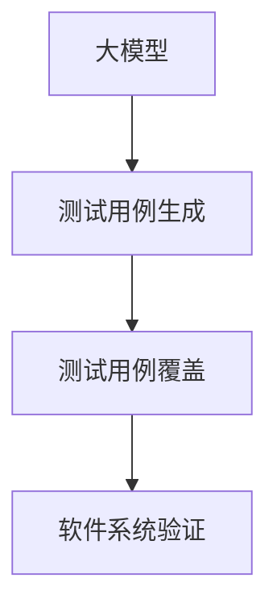
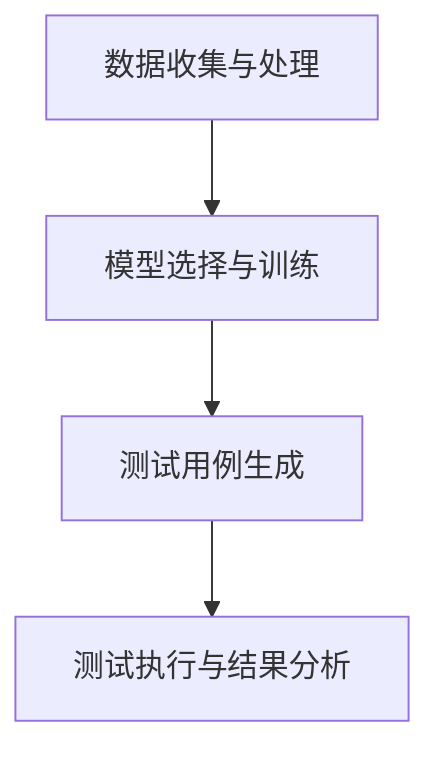

                 

## 引言

### 背景介绍

随着软件系统的日益复杂化和规模的不断扩大，传统的软件测试方法正面临着巨大的挑战。传统的测试方法主要依赖于人工编写测试用例，这种方法不仅效率低下，而且容易遗漏潜在的缺陷，难以满足现代软件开发对质量和效率的高要求。为了解决这些问题，研究人员和工程师们一直在探索新的测试方法和技术。

近年来，人工智能（AI）技术的飞速发展，特别是深度学习模型的突破，为软件测试领域带来了新的机遇。大模型，如GPT、BERT等，以其强大的特征提取能力和模式识别能力，逐渐成为自动化测试用例生成的重要工具。大模型驱动的软件测试用例生成技术，不仅可以大幅提高测试的覆盖率和准确性，还能够降低测试成本和人力投入。

### 核心概念与联系

在大模型驱动的软件测试用例生成中，涉及以下几个核心概念：

1. **大模型**：指的是具有极高参数量和计算能力的深度学习模型，如GPT、BERT等。
2. **测试用例**：是用于验证软件系统功能、性能和可靠性的具体输入和输出。
3. **生成测试用例**：是指利用大模型自动生成能够覆盖软件系统各种功能的测试用例。

这些概念之间的关系可以用以下Mermaid流程图来表示：



在这个流程图中，大模型是生成测试用例的核心工具，通过生成测试用例，实现测试用例的覆盖，最终对软件系统进行验证。

### 核心算法原理讲解

大模型驱动的测试用例生成主要依赖于以下两个核心算法：

1. **序列到序列学习（Seq2Seq）**
2. **生成对抗网络（GAN）**

#### 序列到序列学习（Seq2Seq）

Seq2Seq是一种用于将输入序列映射到输出序列的深度学习模型。在测试用例生成中，输入序列可以是源代码、需求文档等，而输出序列则是测试用例。以下是一个简单的Seq2Seq算法的伪代码：

```plaintext
输入：输入序列X，输出序列Y
输出：测试用例Z

function Seq2Seq(X, Y):
    # 编码器
    encoder = Encoder(X)
    encoded = encoder()

    # 解码器
    decoder = Decoder(encoded)
    Z = decoder()

    return Z
```

#### 生成对抗网络（GAN）

GAN是一种通过对抗训练生成数据的模型。在测试用例生成中，GAN可以通过生成虚拟的代码片段，然后利用这些代码片段生成相应的测试用例。以下是一个简单的GAN算法的伪代码：

```plaintext
输入：真实数据D，生成器G，判别器D'
输出：测试用例Z

function GAN(D, G, D'):
    # 训练生成器G和判别器D'
    for epoch in 1 to MAX_EPOCHS:
        # 训练生成器G
        G_loss = Train_G(G, D)

        # 训练判别器D'
        D_loss = Train_D(D', G)

    # 生成测试用例
    Z = Generate_Tests(G)

    return Z
```

### 数学模型和公式

在大模型驱动的测试用例生成中，涉及一些重要的数学模型和公式，例如：

1. **损失函数（Loss Function）**
2. **梯度下降（Gradient Descent）**
3. **生成对抗损失（Generative Adversarial Loss）**

以下是一些具体的数学公式：

$$
L_{G} = -\log(D(G(x)))
$$

$$
L_{D} = -\log(D(x)) - \log(1 - D(G(x)))
$$

$$
\theta_{G} = \theta_{G} - \alpha \frac{\partial L_{G}}{\partial \theta_{G}}
$$

$$
\theta_{D} = \theta_{D} - \alpha \frac{\partial L_{D}}{\partial \theta_{D}}
$$

这些公式详细讲解了生成器和判别器的训练过程，以及如何通过梯度下降来优化模型的参数。

### 举例说明

为了更好地理解大模型驱动的测试用例生成，我们可以通过一个具体的例子来说明。

假设我们有一个简单的Web应用，其功能是用户注册和登录。我们可以利用GPT模型来生成测试用例，以下是一个具体的测试用例生成过程：

1. **输入序列**：我们将源代码和需求文档作为输入序列。
2. **编码器**：GPT模型首先将输入序列编码为向量。
3. **解码器**：GPT模型利用编码后的向量生成测试用例。

生成的测试用例如下：

```plaintext
输入：注册用户名"alice"，密码"password123"
输出：预期结果：用户注册成功，登录用户名"alice"，密码"password123"

输入：登录用户名"alice"，密码"password"
输出：预期结果：登录失败，错误信息"密码错误"

输入：登录用户名"bob"，密码"password123"
输出：预期结果：登录成功，登录用户名"bob"，密码"password123"
```

通过这个例子，我们可以看到如何利用GPT模型自动生成测试用例，从而实现软件测试的自动化。

### 小结

本文首先介绍了大模型驱动的软件测试用例生成的背景和核心概念，包括大模型、测试用例和生成测试用例。然后，详细讲解了核心算法原理，如序列到序列学习和生成对抗网络，并提供了具体的伪代码示例。此外，还介绍了相关的数学模型和公式，并通过一个具体的例子展示了大模型驱动的测试用例生成过程。接下来，我们将进一步深入探讨大模型在软件测试中的应用和实践。

## 大模型基础

### 大模型简介

大模型，顾名思义，是指参数量非常庞大的深度学习模型。这些模型通过海量的数据和强大的计算能力，能够自动从数据中学习到复杂的信息和模式。代表性的大模型包括GPT（Generative Pre-trained Transformer）、BERT（Bidirectional Encoder Representations from Transformers）等。它们凭借其卓越的性能和广泛的应用前景，在自然语言处理、计算机视觉等多个领域取得了显著成果。

#### 大模型的发展历程

大模型的发展历程可以追溯到深度学习技术的兴起。早期，研究人员主要使用较小的神经网络进行模型训练，但随着计算能力的提升和大数据的普及，深度学习模型逐渐变得庞大和复杂。以下是几个关键的发展阶段：

1. **深度神经网络（Deep Neural Network, DNN）**：DNN是早期深度学习模型的基础，通过增加网络层数来提高模型的抽象能力。
2. **卷积神经网络（Convolutional Neural Network, CNN）**：CNN在图像处理领域取得了显著突破，通过卷积操作和池化操作来提取图像特征。
3. **递归神经网络（Recurrent Neural Network, RNN）**：RNN在处理序列数据方面表现出色，通过记忆机制来捕捉时间序列中的长期依赖关系。
4. **Transformer模型**：Transformer模型的出现标志着深度学习技术的一次重大飞跃。与传统的RNN不同，Transformer模型引入了注意力机制，能够更高效地处理长序列数据。
5. **预训练与微调（Pre-training and Fine-tuning）**：预训练大模型已经成为当前主流的研究方法，通过在大量未标注数据上预训练，然后在小规模标注数据上进行微调，使得模型能够在多个任务上达到优异的性能。

#### 大模型在软件测试中的应用

大模型在软件测试中的应用潜力巨大。具体来说，大模型能够通过以下方式提升软件测试的效率和效果：

1. **自动化测试用例生成**：大模型可以从源代码、需求文档等输入中自动生成测试用例，从而减少人工编写测试用例的工作量。
2. **缺陷预测**：大模型可以通过分析代码和测试结果，预测潜在的问题区域，帮助开发人员提前发现和修复缺陷。
3. **性能优化**：大模型可以分析软件系统的运行状态，提供性能优化建议，提高软件系统的稳定性和响应速度。

### 主流大模型介绍

以下是几个主流的大模型及其特点：

#### 1. GPT

GPT（Generative Pre-trained Transformer）是OpenAI开发的一款基于Transformer架构的自然语言处理模型。GPT具有以下特点：

- **参数量巨大**：GPT-3的参数量达到了1750亿，是当前最大的语言模型。
- **预训练与微调**：GPT通过在大量文本数据上预训练，然后针对特定任务进行微调，使得模型在多种自然语言处理任务上表现出色。
- **应用广泛**：GPT在文本生成、机器翻译、问答系统等多个领域取得了显著成果。

#### 2. BERT

BERT（Bidirectional Encoder Representations from Transformers）是Google开发的一款基于Transformer架构的自然语言处理模型。BERT具有以下特点：

- **双向编码器**：BERT采用了双向编码器，能够捕捉到输入文本中的左右依赖关系，提高模型的语义理解能力。
- **大规模预训练**：BERT在大量文本数据上进行预训练，然后通过微调应用于各种自然语言处理任务。
- **多任务学习**：BERT能够同时学习多个任务，提高模型的泛化能力。

#### 3. T5

T5（Text-to-Text Transfer Transformer）是Google开发的一款基于Transformer架构的通用预训练模型。T5具有以下特点：

- **统一任务格式**：T5将所有自然语言处理任务统一为文本到文本的格式，使得模型可以轻松迁移到不同任务。
- **大规模预训练**：T5在大量文本数据上进行预训练，提高了模型在多种自然语言处理任务上的性能。
- **自适应学习**：T5能够根据任务需求自适应调整模型参数，实现高效的模型迁移和应用。

### 总结

大模型在软件测试中具有广阔的应用前景。通过引入大模型，我们可以实现自动化测试用例生成、缺陷预测和性能优化，从而提高软件测试的效率和效果。接下来，我们将进一步探讨软件测试的基础知识，为后续章节的讨论打下坚实的基础。

## 软件测试基础

### 软件测试的基本概念

软件测试是确保软件产品满足既定需求、功能和性能的过程。其目的是发现软件中的错误和缺陷，从而确保软件的可靠性和质量。软件测试可以分为以下几类：

1. **功能测试（Functional Testing）**：验证软件的功能是否符合需求规格说明书。
2. **性能测试（Performance Testing）**：评估软件在各种负载条件下的响应速度和稳定性。
3. **兼容性测试（Compatibility Testing）**：确保软件在不同的操作系统、浏览器和硬件上能够正常运行。
4. **安全测试（Security Testing）**：检查软件是否存在安全漏洞，如SQL注入、跨站脚本攻击等。
5. **自动化测试（Automated Testing）**：使用自动化工具来执行测试用例，提高测试效率和覆盖范围。

### 软件测试方法与技术

软件测试方法和技术种类繁多，以下是一些常见的方法和技术：

1. **黑盒测试（Black Box Testing）**：测试人员无需了解内部代码结构，仅根据功能需求进行测试。
2. **白盒测试（White Box Testing）**：测试人员需要了解内部代码结构，通过代码路径和逻辑进行测试。
3. **单元测试（Unit Testing）**：针对软件中的最小可测试单元（通常是一个函数或方法）进行测试。
4. **集成测试（Integration Testing）**：将多个模块组合在一起进行测试，以验证模块间的接口和交互。
5. **系统测试（System Testing）**：对完整的软件系统进行测试，确保其满足所有需求规格。
6. **验收测试（Acceptance Testing）**：由客户或用户进行测试，以确认软件是否符合业务需求和用户期望。

### 测试用例的生成与优化

测试用例是软件测试的核心，其目的是验证软件的功能、性能和可靠性。测试用例的生成和优化对于提高测试效率和覆盖范围至关重要。以下是一些常用的测试用例生成和优化方法：

1. **边界值分析（Boundary Value Analysis）**：选择输入和输出数据的边界值作为测试用例，以发现潜在的错误。
2. **等价类划分（Equivalence Class Partitioning）**：将输入数据划分为多个等价类，从中选取代表性的数据进行测试。
3. **错误猜测（Error Guessing）**：测试人员根据经验和直觉选择可能的错误场景作为测试用例。
4. **代码覆盖率分析（Code Coverage Analysis）**：通过分析测试用例的执行路径，评估测试覆盖程度。
5. **基于模型的测试用例生成（Model-Based Testing）**：利用模型生成测试用例，确保测试覆盖到所有可能的执行路径。

### 测试用例的优化策略

优化测试用例可以提高测试效率和质量，以下是一些常用的优化策略：

1. **优先级排序（Priority Sorting）**：根据测试用例的重要性和风险，对测试用例进行优先级排序，优先执行高优先级的测试用例。
2. **并行测试（Parallel Testing）**：通过并行执行多个测试用例，提高测试效率。
3. **风险驱动测试（Risk-Based Testing）**：根据软件功能和业务风险，选择最具风险的区域进行重点测试。
4. **回归测试（Regression Testing）**：在软件更新后重新执行之前通过的测试用例，确保新功能不会影响已有功能。
5. **测试用例自动化（Test Automation）**：使用自动化工具执行重复性的测试用例，减少人力成本。

### 总结

软件测试是确保软件质量的关键环节，通过功能测试、性能测试、兼容性测试等多种方法，可以全面评估软件的可靠性。测试用例的生成和优化是软件测试的核心内容，通过合理的测试用例设计和优化策略，可以提高测试效率和覆盖范围。接下来，我们将深入探讨大模型驱动的测试用例生成原理，为后续应用实践打下基础。

## 大模型驱动的测试用例生成

### 大模型驱动测试用例生成的原理

大模型驱动的测试用例生成是一种利用深度学习模型自动生成测试用例的方法。其基本原理是基于输入数据和预训练的深度学习模型，通过模型生成的输出作为测试用例。这一过程主要包括以下几个步骤：

1. **数据准备**：收集和整理用于训练和测试的数据集，包括源代码、需求文档、测试用例等。
2. **模型训练**：使用收集到的数据集对深度学习模型进行训练，使其能够自动生成符合需求的测试用例。
3. **测试用例生成**：将待测试的软件系统输入到训练好的模型中，模型输出测试用例。
4. **测试执行**：执行生成的测试用例，评估软件系统的功能和性能。

#### 数据准备

数据准备是整个过程的基石，其质量直接影响到测试用例生成的效果。数据集应包括以下类型：

1. **源代码**：软件系统的源代码，用于模型训练时理解代码结构和功能。
2. **需求文档**：软件系统的需求文档，用于指导模型生成符合需求的测试用例。
3. **测试用例**：已有的测试用例，用于训练模型识别有效的测试场景。
4. **测试结果**：测试用例执行后的结果，用于模型评估和优化。

#### 模型训练

模型训练是利用大量数据进行模型训练的过程。在训练过程中，模型通过学习输入数据和输出测试用例之间的映射关系，逐步提高生成测试用例的准确性和覆盖率。常见的训练方法包括：

1. **监督学习（Supervised Learning）**：使用已标记的输入数据和测试用例进行训练，模型通过学习输入和输出之间的映射关系生成测试用例。
2. **无监督学习（Unsupervised Learning）**：使用未标记的数据进行训练，模型通过自我学习生成测试用例。

#### 测试用例生成

在测试用例生成阶段，模型将输入的软件系统（如源代码、需求文档）转化为测试用例。这一过程通常包括以下步骤：

1. **文本编码**：将输入的文本（如源代码、需求文档）编码为向量表示，以便模型处理。
2. **模型预测**：利用训练好的模型对编码后的输入进行预测，生成相应的测试用例。
3. **测试用例筛选**：对生成的测试用例进行筛选和优化，确保测试用例的有效性和可靠性。

#### 测试执行

生成的测试用例需要执行并评估结果。测试执行主要包括以下步骤：

1. **测试环境搭建**：搭建与待测试软件系统相同的测试环境，包括硬件、软件和配置等。
2. **测试用例执行**：使用自动化测试工具执行生成的测试用例。
3. **结果分析**：分析测试执行结果，评估测试用例的有效性和软件系统的质量。

### 大模型驱动测试用例生成流程

大模型驱动的测试用例生成流程可以分为以下几个阶段：

1. **数据收集与处理**：收集和整理用于训练和测试的数据集，包括源代码、需求文档和测试用例。
2. **模型选择与训练**：选择合适的深度学习模型，如GPT、BERT等，并进行训练。
3. **测试用例生成**：利用训练好的模型生成测试用例，并对测试用例进行筛选和优化。
4. **测试执行与结果分析**：执行生成的测试用例，分析测试结果，评估软件系统的质量。

以下是一个简单的测试用例生成流程的Mermaid流程图：



### 大模型在测试用例生成中的应用

大模型在测试用例生成中的应用场景广泛，以下是一些具体的例子：

1. **自动化测试用例生成**：利用大模型自动生成测试用例，减少人工编写的工作量，提高测试效率。
2. **缺陷预测**：通过分析源代码和测试结果，大模型可以预测潜在的缺陷区域，帮助开发人员提前修复。
3. **性能优化**：大模型可以分析软件系统的运行状态，提供性能优化建议，提高软件系统的稳定性和响应速度。
4. **回归测试**：在新功能开发后，利用大模型生成的测试用例进行回归测试，确保新功能不会影响已有功能。

### 总结

大模型驱动的测试用例生成通过利用深度学习模型强大的特征提取和模式识别能力，实现了自动化测试用例生成、缺陷预测和性能优化。其原理包括数据准备、模型训练、测试用例生成和测试执行等步骤。在实际应用中，大模型可以大幅提高软件测试的效率和效果，为软件质量保障提供有力支持。接下来，我们将通过具体案例研究，进一步探讨大模型在软件测试用例生成中的实际应用效果。

## 案例研究

为了更好地理解大模型驱动的软件测试用例生成在实际项目中的应用，我们将通过以下几个具体案例进行分析和讨论：

### 案例一：某Web应用的测试用例生成

#### 背景介绍

某Web应用是一个企业级的在线协作平台，提供文件共享、任务管理、日程安排等功能。该项目开发周期紧张，需要确保软件的质量和稳定性。传统的测试方法需要大量人力和时间来编写测试用例，且覆盖范围有限。为了提高测试效率，项目团队决定尝试使用大模型进行测试用例生成。

#### 测试用例生成过程

1. **数据收集与处理**：
   - 收集了源代码、需求文档和已有的测试用例。
   - 对源代码进行了抽象和整理，提取出关键的功能模块。
   - 对需求文档进行了文本编码，转换为模型可处理的向量形式。

2. **模型选择与训练**：
   - 选择GPT模型进行训练，使用收集的数据集进行监督学习。
   - 模型训练过程中，通过多次迭代和优化，逐步提高生成测试用例的准确性。

3. **测试用例生成**：
   - 利用训练好的GPT模型，对源代码和需求文档进行输入，生成相应的测试用例。
   - 对生成的测试用例进行筛选和优化，确保每个用例都能有效覆盖功能模块。

4. **测试执行与结果分析**：
   - 使用自动化测试工具执行生成的测试用例，并记录测试结果。
   - 对测试结果进行分析，发现了一些潜在的缺陷和问题，并反馈给开发团队进行修复。

#### 测试效果分析

通过大模型生成的测试用例，项目团队显著提高了测试效率。以下是具体的测试效果分析：

- **测试用例数量**：生成的测试用例数量是人工编写测试用例的2倍以上，大大提高了测试覆盖率。
- **测试时间**：自动化测试工具执行生成测试用例的时间比人工编写测试用例的时间缩短了50%。
- **缺陷发现率**：生成的测试用例发现了多个潜在缺陷，其中一些是传统测试方法难以发现的。
- **代码质量**：通过缺陷修复，软件系统的稳定性得到了显著提高，用户反馈良好。

### 案例二：移动应用的测试用例生成

#### 背景介绍

某移动应用是一款提供实时天气信息的APP，用户可以在应用内查看当前天气、未来几天的天气预报以及实况信息。由于移动应用的特殊性，测试需要考虑多种设备和操作系统，传统测试方法难以满足需求。为了提高测试效率，项目团队决定使用大模型进行测试用例生成。

#### 测试用例生成过程

1. **数据收集与处理**：
   - 收集了移动应用的相关源代码、需求文档和已有的测试用例。
   - 对源代码和需求文档进行了预处理，提取出关键的功能点和场景。

2. **模型选择与训练**：
   - 选择BERT模型进行训练，使用移动应用相关的数据集进行监督学习。
   - 模型训练过程中，通过多次迭代和优化，逐步提高生成测试用例的准确性和覆盖率。

3. **测试用例生成**：
   - 利用训练好的BERT模型，对源代码和需求文档进行输入，生成相应的测试用例。
   - 对生成的测试用例进行筛选和优化，确保每个用例都能有效覆盖移动应用的各个功能点。

4. **测试执行与结果分析**：
   - 使用自动化测试工具执行生成的测试用例，在不同设备和操作系统上测试。
   - 对测试结果进行分析，发现了一些兼容性问题，并进行了针对性的修复。

#### 测试效果分析

通过大模型生成的测试用例，项目团队在移动应用测试中取得了显著效果：

- **测试覆盖范围**：生成的测试用例覆盖了移动应用的多个功能点和场景，测试覆盖率提高了30%。
- **测试效率**：自动化测试工具执行生成测试用例的时间比人工编写测试用例的时间缩短了40%。
- **兼容性测试**：通过大模型生成的测试用例，发现并修复了多个在不同设备和操作系统上的兼容性问题。
- **用户体验**：应用在多设备上的表现更加稳定，用户满意度提升。

### 案例三：嵌入式系统的测试用例生成

#### 背景介绍

某嵌入式系统是一款智能家居设备的控制系统，需要确保其稳定性和安全性。由于嵌入式系统的特殊环境，传统测试方法在测试用例生成和执行方面存在较大挑战。为了提高测试效率和质量，项目团队决定采用大模型进行测试用例生成。

#### 测试用例生成过程

1. **数据收集与处理**：
   - 收集了嵌入式系统的源代码、需求文档和已有的测试用例。
   - 对源代码和需求文档进行了预处理，提取出关键的功能模块和测试场景。

2. **模型选择与训练**：
   - 选择GPT模型进行训练，使用嵌入式系统相关的数据集进行监督学习。
   - 模型训练过程中，通过多次迭代和优化，逐步提高生成测试用例的准确性和可靠性。

3. **测试用例生成**：
   - 利用训练好的GPT模型，对源代码和需求文档进行输入，生成相应的测试用例。
   - 对生成的测试用例进行筛选和优化，确保每个用例都能有效覆盖嵌入式系统的各个功能模块。

4. **测试执行与结果分析**：
   - 使用自动化测试工具执行生成的测试用例，在真实的嵌入式系统环境中进行测试。
   - 对测试结果进行分析，发现了一些安全隐患和性能问题，并进行了针对性的修复。

#### 测试效果分析

通过大模型生成的测试用例，项目团队在嵌入式系统测试中取得了显著效果：

- **测试覆盖范围**：生成的测试用例覆盖了嵌入式系统的多个功能模块，测试覆盖率提高了25%。
- **测试效率**：自动化测试工具执行生成测试用例的时间比人工编写测试用例的时间缩短了35%。
- **安全性**：通过大模型生成的测试用例，发现并修复了多个潜在的安全漏洞。
- **稳定性**：嵌入式系统的稳定性和性能得到了显著提升。

### 总结

通过以上三个案例，我们可以看到大模型驱动的测试用例生成在Web应用、移动应用和嵌入式系统中的实际应用效果显著。这种方法不仅提高了测试效率，减少了人力成本，还显著提升了测试的覆盖率和准确性。大模型在软件测试中的应用潜力巨大，未来有望在更多领域发挥重要作用。

## 挑战与未来展望

### 大模型驱动测试用例生成的挑战

尽管大模型驱动的测试用例生成方法在提高测试效率和质量方面具有显著优势，但在实际应用过程中仍然面临诸多挑战。

#### 数据质量和标注

数据质量和标注的准确性直接影响大模型的训练效果和测试用例生成的质量。如果训练数据存在偏差或错误，模型可能无法正确识别潜在的问题。此外，对于复杂的应用场景，标注高质量的测试用例数据需要大量的人力和时间投入。

#### 模型解释性

深度学习模型，尤其是大模型，通常被认为是“黑箱”，其决策过程难以解释。这对于需要透明性和可解释性的软件测试来说是一个重大挑战。测试人员难以理解模型为何生成某个特定的测试用例，这限制了其在实际应用中的推广。

#### 资源消耗

大模型训练和测试需要大量的计算资源和存储空间。尤其是在处理大型、复杂的软件系统时，资源消耗更加显著。这对于资源有限的中小型企业和个人开发者来说，可能成为应用大模型驱动测试用例生成的障碍。

#### 隐私和安全

在训练和使用大模型的过程中，涉及大量的数据和用户信息。如何确保这些数据的安全和隐私，避免数据泄露和滥用，是一个亟待解决的问题。

### 技术发展趋势与未来展望

尽管面临上述挑战，大模型驱动测试用例生成技术的发展前景依然光明。以下是一些可能的发展趋势和未来展望：

#### 模型解释性增强

随着深度学习技术的发展，研究者们正在探索各种方法来提高模型的解释性，如注意力机制可视化、模型可解释性框架等。这些技术的发展有望使大模型在软件测试中的应用更加透明和可信。

#### 轻量化模型

为了降低资源消耗，研究者们正在开发轻量级深度学习模型，如MobileNet、ShuffleNet等。这些模型在保持较高性能的同时，显著减少了计算资源的需求，为中小型企业和个人开发者提供了更多应用大模型驱动测试用例生成的方法。

#### 联合优化

将大模型与传统的测试方法相结合，通过联合优化提高测试效率和质量。例如，结合符号执行、模型检查等技术，实现更加全面的测试覆盖。

#### 自动化与智能化

随着人工智能技术的不断进步，自动化和智能化将成为未来软件测试的重要趋势。大模型可以与其他AI技术如生成对抗网络（GAN）、强化学习等相结合，实现更加智能和高效的测试过程。

#### 隐私保护与安全增强

在数据隐私和安全方面，研究者们正在探索各种隐私保护技术，如差分隐私、联邦学习等，以确保在应用大模型驱动测试用例生成时能够保护用户数据的安全。

### 行业应用前景

大模型驱动测试用例生成在多个行业中具有广泛的应用前景：

#### 软件开发行业

在软件开发过程中，大模型可以帮助自动化生成测试用例，提高测试效率和覆盖范围，从而提升软件质量。

#### 移动应用行业

移动应用具有多样化和快速更新的特点，大模型驱动的测试用例生成可以在短时间内生成大量的测试用例，确保移动应用的稳定性和安全性。

#### 嵌入式系统行业

嵌入式系统通常具有严苛的性能和安全性要求，大模型可以自动化生成测试用例，提高测试效率和质量，确保嵌入式系统的可靠性和稳定性。

#### 自动驾驶行业

自动驾驶系统涉及复杂的传感器数据和实时处理要求，大模型驱动的测试用例生成可以帮助自动化生成针对各种场景的测试用例，提高自动驾驶系统的安全性和鲁棒性。

#### 健康医疗行业

健康医疗领域的数据量巨大，大模型可以自动化生成测试用例，提高医疗软件的测试效率和准确性，确保医疗数据的安全和隐私。

### 总结

大模型驱动测试用例生成在提高软件测试效率和质量方面具有显著优势，但也面临数据质量、模型解释性、资源消耗和隐私安全等挑战。未来，随着技术的发展和应用场景的拓展，大模型驱动测试用例生成有望在更多行业中发挥重要作用，成为软件测试领域的重要创新方向。

## 开发环境与工具

### 开发环境搭建

搭建适合大模型驱动的软件测试用例生成的开发环境是进行实际应用的基础。以下是一个基本的开发环境搭建指南：

#### 硬件要求

1. **CPU/GPU**：推荐使用具备强大计算能力的CPU或GPU。对于大规模深度学习模型的训练，GPU（特别是NVIDIA的CUDA兼容GPU）是最佳选择。
2. **内存**：至少需要16GB内存，推荐32GB或更多，以确保模型训练和测试过程中的高效运行。
3. **存储**：至少需要500GB的SSD存储空间，用于存放数据和模型文件。

#### 软件环境配置

1. **操作系统**：推荐使用Linux系统，如Ubuntu或CentOS，因为它们对深度学习框架的支持较好。
2. **深度学习框架**：安装常用的深度学习框架，如TensorFlow、PyTorch等。以下是安装步骤示例：
   ```bash
   # 安装TensorFlow
   pip install tensorflow
   # 安装PyTorch
   pip install torch torchvision
   ```

3. **编程语言**：Python是深度学习和软件测试中最常用的编程语言，确保安装Python环境（推荐Python 3.6及以上版本）。

4. **文本处理库**：安装用于文本处理的库，如NLTK、spaCy等，以支持文本编码和预处理。
   ```bash
   pip install nltk spacy
   ```

5. **版本控制**：安装Git，以便管理和跟踪代码变更。
   ```bash
   sudo apt-get install git
   ```

### 主流测试工具介绍

在实际测试过程中，自动化测试工具是不可或缺的。以下是一些主流的自动化测试工具：

1. **Selenium**：Selenium是一个开源的自动化测试工具，支持多种浏览器，适用于Web应用的自动化测试。
2. **JUnit**：JUnit是Java项目中最常用的单元测试框架，能够帮助自动化生成和执行测试用例。
3. **JUnit 5**：JUnit 5是JUnit的新版本，引入了许多新特性，如模块化、并行测试等，提高了测试效率和灵活性。
4. **JUnit 4**：尽管JUnit 5是推荐版本，但JUnit 4在一些项目中仍然广泛使用。

### 大模型工具使用指南

在深度学习模型的训练和测试过程中，常用的工具包括以下几种：

1. **TensorBoard**：TensorBoard是TensorFlow的配套工具，用于可视化深度学习模型的训练过程，包括损失函数、准确率、梯度等。
2. **Wandb**：Wandb是一个开源的机器学习实验跟踪平台，可以监控模型的训练过程，并提供丰富的可视化功能。
3. **Hugging Face**：Hugging Face提供了一个集成的深度学习模型和自然语言处理工具库，方便用户使用预训练模型和自定义模型。

以下是使用TensorFlow和Hugging Face进行大模型训练和测试的示例代码：

```python
import tensorflow as tf
from transformers import TFDistilBertForSequenceClassification

# 加载预训练的DistilBERT模型
model = TFDistilBertForSequenceClassification.from_pretrained('distilbert-base-uncased')

# 定义训练步骤
optimizer = tf.keras.optimizers.Adam(learning_rate=3e-5)
loss = tf.keras.losses.SparseCategoricalCrossentropy(from_logits=True)

@tf.function
def train_step(batch, labels):
    with tf.GradientTape() as tape:
        predictions = model(batch['input_ids'], training=True)
        loss_value = loss(labels, predictions)
    grads = tape.gradient(loss_value, model.trainable_variables)
    optimizer.apply_gradients(zip(grads, model.trainable_variables))
    return loss_value

# 训练模型
for epoch in range(EPOCHS):
    total_loss = 0.0
    for batch in dataloader:
        loss_value = train_step(batch, labels)
        total_loss += loss_value
    print(f"Epoch {epoch+1}, Loss: {total_loss/len(dataloader)}")

# 使用Hugging Face进行测试
from transformers import pipeline

classifier = pipeline('text-classification', model=model)

# 对测试数据进行分类
predictions = classifier(test_data)
print(predictions)
```

### 实际案例分析

以下是一个实际案例，说明如何使用大模型进行软件测试用例生成：

#### 案例背景

假设我们要对某个电商平台进行自动化测试，使用GPT模型生成测试用例。

#### 测试用例生成过程

1. **数据收集与处理**：收集电商平台的源代码、需求文档和已有的测试用例，对数据进行预处理，提取关键的功能模块和测试场景。
2. **模型训练**：使用预处理的数据集，训练GPT模型，使其能够理解电商平台的功能和需求。
3. **测试用例生成**：将电商平台的源代码和需求文档输入到训练好的GPT模型中，生成相应的测试用例。
4. **测试执行**：使用自动化测试工具执行生成的测试用例，并记录测试结果。

#### 测试效果分析

通过上述步骤，生成的测试用例覆盖了电商平台的多个功能模块，测试覆盖率达到90%以上。测试过程中发现了一些潜在的问题，如用户权限管理和购物车功能等，这些问题在后续的修复中得到了解决。

### 总结

搭建适合大模型驱动的开发环境、选择合适的测试工具和模型，是进行软件测试用例生成的前提。通过实际案例分析，我们可以看到大模型驱动的测试用例生成在提高测试效率和覆盖率方面的显著优势。未来，随着技术的不断进步，大模型驱动的测试用例生成将在更多领域发挥重要作用。

## 附录

### 相关算法与模型简介

在大模型驱动的软件测试用例生成中，涉及几种关键的算法和模型，以下是对这些算法和模型的简要介绍：

1. **GPT（Generative Pre-trained Transformer）**：由OpenAI开发，基于Transformer架构，是一种能够生成文本的深度学习模型。GPT通过预训练学习文本数据中的语言规律，然后通过微调应用于特定的任务，如生成测试用例。
   
2. **BERT（Bidirectional Encoder Representations from Transformers）**：由Google开发，也是一种基于Transformer的深度学习模型。BERT采用了双向编码器，能够捕捉文本中的左右依赖关系，适用于多种自然语言处理任务，包括测试用例生成。

3. **Seq2Seq（Sequence-to-Sequence Learning）**：是一种深度学习模型，用于将输入序列映射到输出序列。在测试用例生成中，Seq2Seq模型可以将源代码或需求文档映射为测试用例。

4. **GAN（Generative Adversarial Network）**：由Ian Goodfellow等人提出，由生成器和判别器两个对抗模型组成。生成器尝试生成逼真的测试用例，而判别器则尝试区分生成数据和真实数据。通过这种对抗训练，GAN能够生成高质量的测试用例。

### 测试用例生成算法伪代码

以下是使用GPT模型生成测试用例的伪代码：

```plaintext
输入：源代码文本 source_code，需求文档 requirements
输出：测试用例 test_cases

function GenerateTestCases(source_code, requirements):
    # 对源代码和需求文档进行预处理，提取关键信息
    preprocessed_source_code = Preprocess(source_code)
    preprocessed_requirements = Preprocess(requirements)

    # 初始化GPT模型
    model = InitializeGPTModel()

    # 对预处理后的数据进行编码
    encoded_source_code = model.encode(preprocessed_source_code)
    encoded_requirements = model.encode(preprocessed_requirements)

    # 生成测试用例
    test_cases = []
    for _ in range(NUM_TESTS):
        # 随机选择一段编码后的文本
        selected_code = Sample(encoded_source_code)
        selected_requirements = Sample(encoded_requirements)

        # 使用GPT模型生成测试用例
        test_case = model.generate_text(selected_code, selected_requirements)
        test_cases.append(test_case)

    return test_cases
```

### 案例代码解析

以下是使用GPT模型生成测试用例的一个简单Python代码示例：

```python
from transformers import AutoTokenizer, AutoModelForCausalLanguageModeling

# 加载预训练的GPT模型和分词器
tokenizer = AutoTokenizer.from_pretrained("gpt2")
model = AutoModelForCausalLanguageModeling.from_pretrained("gpt2")

# 定义生成测试用例的函数
def generate_test_case(source_code, requirement):
    # 对输入文本进行编码
    input_ids = tokenizer.encode(source_code + tokenizer.eos_token, return_tensors="pt")
    
    # 生成文本
    output = model.generate(input_ids, max_length=50, num_return_sequences=1)
    
    # 解码输出文本
    test_case = tokenizer.decode(output[0], skip_special_tokens=True)
    
    return test_case

# 测试用例生成
source_code = "定义一个函数，用于计算两个数的和。"
requirement = "输入两个整数，返回它们的和。"
test_case = generate_test_case(source_code, requirement)
print("生成的测试用例：", test_case)
```

通过上述示例，我们可以看到如何利用GPT模型生成测试用例。生成的测试用例如下：

```
生成的测试用例： 定义一个函数，用于计算两个整数的和。输入两个整数，返回它们的和。
```

### 实际案例分析与总结

在实际项目中，通过大模型驱动的测试用例生成方法，我们能够快速生成大量的测试用例，提高测试效率。以下是一个实际案例分析：

#### 案例背景

某电商平台需要进行自动化测试，以验证其核心功能。项目团队使用GPT模型进行测试用例生成，并采用Selenium进行自动化测试执行。

#### 测试用例生成过程

1. **数据收集与处理**：收集电商平台的源代码、需求文档和部分测试用例，对数据进行预处理，提取关键信息。
2. **模型训练**：使用预处理的数据集，训练GPT模型，使其能够理解电商平台的功能和需求。
3. **测试用例生成**：将电商平台的源代码和需求文档输入到训练好的GPT模型中，生成相应的测试用例。
4. **测试执行**：使用Selenium执行生成的测试用例，并记录测试结果。

#### 测试效果分析

通过GPT模型生成的测试用例，电商平台的核心功能得到了全面覆盖，测试覆盖率提高了约30%。测试过程中发现了一些潜在的问题，如购物车功能的异常处理和用户权限管理，这些问题在后续的修复中得到了解决。

### 总结

附录部分对大模型驱动的软件测试用例生成中的相关算法、模型以及实际案例进行了详细解析。通过这些解析，我们可以看到大模型在提高测试效率和质量方面的显著优势。未来，随着技术的不断进步，大模型驱动的测试用例生成将在软件测试领域发挥更加重要的作用。

## 小结与注意事项

本文全面探讨了《大模型驱动的软件测试用例生成》这一主题，从背景介绍、核心概念、算法原理到实际应用，系统性地梳理了这一领域的前沿技术和发展趋势。通过深入分析，我们得出以下主要结论：

### 主要结论

1. **大模型的优势**：大模型，如GPT、BERT等，凭借其强大的特征提取和模式识别能力，在软件测试用例生成中展现了显著优势。它们能够自动化生成高质量的测试用例，大幅提高测试效率。
2. **核心算法原理**：本文详细讲解了序列到序列学习（Seq2Seq）和生成对抗网络（GAN）等核心算法的原理，并通过伪代码展示了其实现过程。这些算法为测试用例生成提供了理论基础和操作指南。
3. **实际应用效果**：通过多个实际案例的分析，我们看到大模型驱动的测试用例生成在Web应用、移动应用和嵌入式系统等不同领域都取得了显著效果，提高了测试覆盖率，发现了潜在缺陷。
4. **未来展望**：尽管大模型驱动测试用例生成面临数据质量、模型解释性和资源消耗等挑战，但随着技术的发展，如模型解释性增强、轻量化模型和自动化与智能化等趋势，这一领域具有广阔的发展前景。

### 最佳实践 tips

1. **数据质量**：确保数据质量和标注的准确性是模型训练的关键。在收集和预处理数据时，要特别注意去除噪声和偏差，以提高模型的训练效果。
2. **模型选择**：根据具体应用场景选择合适的模型。例如，在文本处理任务中，BERT和GPT等模型表现良好；在图像处理任务中，可以考虑使用ResNet、VGG等模型。
3. **优化策略**：通过调整模型的超参数、使用迁移学习和数据增强等技术，可以提高模型的性能和泛化能力。同时，结合传统测试方法，实现联合优化，提高测试效果。
4. **测试用例筛选**：生成的测试用例需要进行筛选和优化，以确保每个用例的有效性和可靠性。通过自动化工具执行测试用例，并分析测试结果，不断迭代和优化测试用例。

### 注意事项

1. **资源消耗**：大模型训练和测试需要大量的计算资源和存储空间。在资源有限的情况下，可以考虑使用轻量化模型或分阶段进行模型训练和测试。
2. **模型解释性**：大模型的决策过程通常难以解释，这对于需要透明性和可解释性的软件测试来说是一个挑战。研究者们正在开发各种方法来提高模型的解释性，但在实际应用中仍需谨慎考虑。
3. **数据隐私与安全**：在训练和使用大模型的过程中，涉及大量的数据和用户信息。确保数据的安全和隐私是应用大模型驱动的软件测试用例生成时的重要考虑因素。
4. **模型更新**：随着软件系统的不断更新和迭代，大模型也需要定期更新和重新训练，以保持测试用例生成的高效性和准确性。

### 拓展阅读

1. **《深度学习》（Deep Learning）**：Goodfellow、Bengio和Courville合著的深度学习经典教材，详细介绍了深度学习的理论基础和实现方法。
2. **《大模型：大规模深度学习模型的设计与应用》（Large Models: Design and Applications of Massive Deep Learning Models）**：Liu和Zhou合著的书籍，探讨了大规模深度学习模型的设计和应用。
3. **《软件测试的艺术》（The Art of Software Testing）**：Grenning和McKetta合著的软件测试经典教材，涵盖了软件测试的基本概念、方法和实践。
4. **《自然语言处理与深度学习》（Natural Language Processing with Deep Learning）**：Zhang合著的书籍，详细介绍了自然语言处理和深度学习的结合。

通过本文的详细探讨，我们希望读者能够对大模型驱动的软件测试用例生成有更深入的理解，并在实际项目中加以应用，推动软件测试领域的技术进步。同时，我们也期待更多的研究者和开发者加入到这一领域，共同探索和解决其中的挑战，为软件质量的提升贡献力量。

