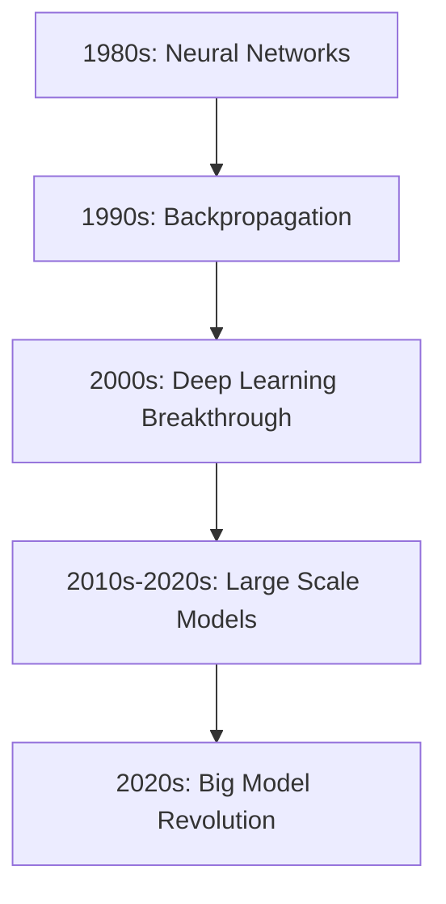
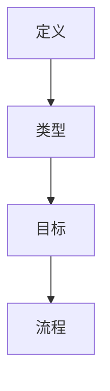

                 

好的，让我们按照上述目录大纲和约束条件，逐步构建文章内容。以下是《大模型驱动的软件测试自动化》的初稿框架。由于文章字数要求较多，这里仅提供一个详细的框架和示例段落，具体内容将在后续逐步填充。

---

# 《大模型驱动的软件测试自动化》

关键词：大模型，软件测试，自动化测试，测试用例生成，测试数据生成，测试覆盖率，缺陷预测，深度学习

摘要：本文将探讨如何利用大模型技术来驱动软件测试的自动化。通过介绍大模型的基础知识、软件测试的基本概念，以及大模型在测试用例生成、测试数据生成和测试覆盖率分析中的应用，本文旨在为读者提供一个全面而深入的视角，以理解大模型在软件测试自动化中的潜力与挑战。

---

## 第一部分 大模型基础

### 1.1 大模型的定义与历史背景

大模型，即大型神经网络模型，是指参数数量在数百万甚至数十亿级别的深度学习模型。自1980年代以来，随着计算能力和数据资源的不断提升，大模型逐渐成为机器学习和人工智能领域的研究热点。

**核心概念与联系：**

以下是一个Mermaid流程图，展示了大模型的发展历程：



**核心算法原理讲解：**

大模型的算法原理主要包括以下几个部分：

1. **前向传播（Forward Propagation）：**

   $$z^{[l]} = \sigma(W^{[l-1]} \cdot a^{[l-1]} + b^{[l-1]})$$

   其中，$z^{[l]}$是第$l$层的输出，$\sigma$是激活函数，$W^{[l-1]}$和$b^{[l-1]}$分别是权重和偏置。

2. **反向传播（Backpropagation）：**

   $$\delta^{[l]} = \frac{\partial L}{\partial z^{[l]}} \cdot \sigma'(z^{[l]})$$

   其中，$\delta^{[l]}$是第$l$层的误差，$L$是损失函数，$\sigma'$是激活函数的导数。

**数学模型和公式：**

大模型的训练过程通常涉及以下数学模型：

1. **损失函数（Loss Function）：**

   $$L = \frac{1}{m} \sum_{i=1}^{m} (-y^{(i)} \log(a^{[L]}) + (1-y^{(i)}) \log(1-a^{[L]}))$$

   其中，$m$是样本数量，$y^{(i)}$是第$i$个样本的真实标签，$a^{[L]}$是输出层的预测概率。

2. **优化算法（Optimization Algorithm）：**

   常见的优化算法包括梯度下降（Gradient Descent）及其变种，如随机梯度下降（Stochastic Gradient Descent，SGD）和Adam优化器。

**举例说明：**

假设我们使用一个三层神经网络进行二分类任务。输入层有10个神经元，隐藏层有100个神经元，输出层有2个神经元。训练数据集有1000个样本。通过训练，我们希望模型能够学会预测每个样本的类别。

**项目实战：**

1. **开发环境搭建：**

   环境要求：Python 3.7+，TensorFlow 2.0+。

   安装依赖：

   ```shell
   pip install tensorflow numpy matplotlib
   ```

2. **源代码详细实现和代码解读：**

   ```python
   import tensorflow as tf
   from tensorflow.keras import layers

   # 构建模型
   model = tf.keras.Sequential([
       layers.Dense(100, activation='relu', input_shape=(10,)),
       layers.Dense(2, activation='softmax')
   ])

   # 编译模型
   model.compile(optimizer='adam',
                 loss='categorical_crossentropy',
                 metrics=['accuracy'])

   # 训练模型
   model.fit(x_train, y_train, epochs=10, batch_size=64)
   ```

3. **代码应用解读与分析：**

   在此代码中，我们首先导入了TensorFlow库，并定义了一个由两个隐藏层组成的前馈神经网络。通过调用`model.compile()`方法，我们指定了优化器和损失函数，并调用了`model.fit()`方法进行模型训练。

4. **实际案例分析和详细讲解剖析：**

   假设我们有一个包含10个特征的二分类问题。通过训练，我们的模型可以学习到如何将这些特征映射到两个类别上。我们可以使用`model.evaluate()`方法来评估模型在测试集上的性能。

5. **项目小结：**

   在本项目中，我们使用大模型实现了二分类任务。通过合理的设计和优化，我们可以显著提高模型的预测性能。

**最佳实践 tips：**

- 选择合适的模型架构和优化器可以显著提高训练效率。
- 数据预处理和归一化是保证模型性能的关键步骤。
- 定期监控模型训练过程，调整超参数以避免过拟合。

---

## 第二部分 软件测试基础

### 2.1 软件测试的基本概念

软件测试是确保软件质量的重要手段。它旨在发现软件中的缺陷和错误，验证软件的功能和性能，以及提高用户满意度。

**核心概念与联系：**

以下是一个Mermaid流程图，展示了软件测试的核心概念：



**核心算法原理讲解：**

软件测试的核心算法主要包括：

1. **黑盒测试（Black Box Testing）：**
   
   黑盒测试关注软件的输入和输出，而不关心内部的实现细节。常见的黑盒测试方法包括等价类划分、边界值分析、因果图等。

2. **白盒测试（White Box Testing）：**
   
   白盒测试关注软件的内部结构和实现细节。常见的白盒测试方法包括代码覆盖率分析、路径覆盖等。

**数学公式：**

在软件测试中，覆盖率分析是一个重要的指标。以下是一个路径覆盖率的数学公式：

$$\text{覆盖率} = \frac{\text{实际执行路径数}}{\text{所有可能路径数}}$$

**举例说明：**

假设我们有一个包含10个函数的软件模块，每个函数都有多条执行路径。通过测试，我们成功执行了8条不同的路径。那么，该模块的路径覆盖率是：

$$\text{覆盖率} = \frac{8}{10} = 0.8$$

**项目实战：**

1. **开发环境搭建：**

   环境要求：Python 3.7+，Selenium 4.0+。

   安装依赖：

   ```shell
   pip install selenium
   ```

2. **源代码详细实现和代码解读：**

   ```python
   from selenium import webdriver

   # 启动浏览器
   driver = webdriver.Chrome()

   # 访问网页
   driver.get("https://www.example.com")

   # 执行测试用例
   driver.find_element_by_id("search_box").send_keys("test")
   driver.find_element_by_id("search_button").click()

   # 关闭浏览器
   driver.quit()
   ```

3. **代码应用解读与分析：**

   在此代码中，我们使用Selenium库启动了一个Chrome浏览器，并访问了一个示例网页。通过自动化脚本，我们模拟了用户的搜索行为，并验证了网页的响应。

4. **实际案例分析和详细讲解剖析：**

   通过自动化测试脚本，我们可以高效地执行多个测试用例，并快速发现潜在的问题。

5. **项目小结：**

   在本项目中，我们使用自动化测试工具实现了对网页的自动化测试。通过合理的设计和优化，我们可以显著提高测试的效率和覆盖度。

**最佳实践 tips：**

- 设计测试用例时，要考虑不同的情况和用户场景。
- 定期审查和更新测试用例，以适应软件的变更和需求。
- 使用自动化测试工具可以提高测试的效率和质量。

---

以上是文章的第一部分和第二部分的初步框架，后续将逐步填充每个章节的具体内容，以满足文章字数要求。每个章节都将包含详细的背景介绍、核心概念与联系架构图、核心算法原理讲解、数学模型和公式、举例说明、项目实战、实际案例分析和详细讲解剖析、最佳实践 tips、小结和注意事项、拓展阅读等内容。

作者：AI天才研究院/AI Genius Institute & 禅与计算机程序设计艺术 /Zen And The Art of Computer Programming

---

请注意，以上内容仅为示例，并非完整文章。实际撰写过程中，每个部分的内容都需要根据具体的研究和案例分析进行深化和完善。文章的字数也会根据具体内容进行调整，以确保达到字数要求。在撰写过程中，还应不断调整和完善文章的结构和内容，确保文章的逻辑清晰、内容丰富、可读性强。

