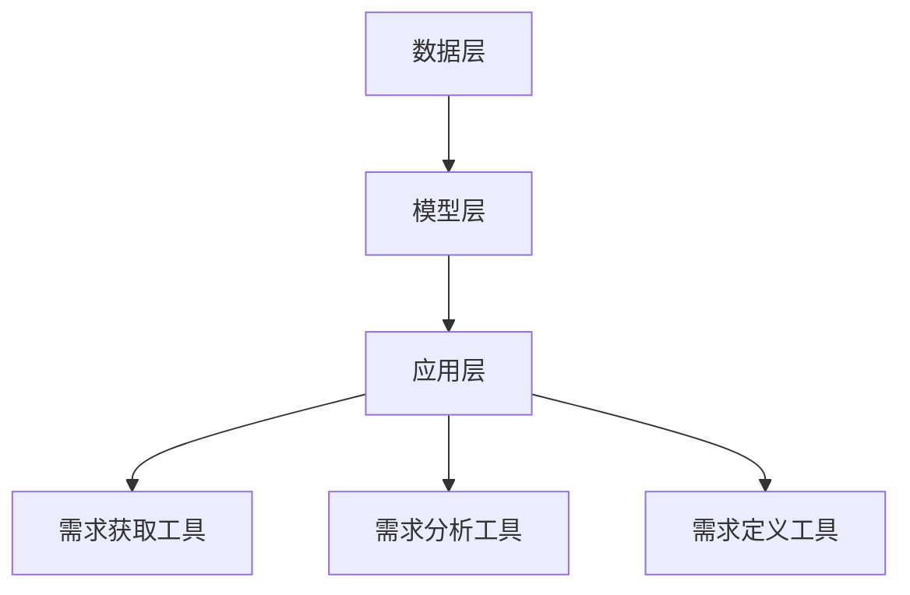

                 


# 大模型驱动的软件需求工程

> 关键词：大模型、软件需求工程、人工智能、机器学习、自然语言处理

> 摘要：本文旨在探讨大模型在软件需求工程中的应用，从基本概念、关键技术、应用实践和未来发展趋势等方面进行深入分析，为读者提供全面的技术指导和思路。

## 第1章 引言

### 1.1 大模型与软件需求工程的关系

随着人工智能技术的飞速发展，大模型（如深度学习模型、Transformer模型等）逐渐成为软件需求工程领域的重要工具。大模型通过自主学习大量的数据，能够自动提取复杂的信息，从而为软件需求工程提供强大的支持。

软件需求工程是指通过系统化的方法来收集、分析和定义软件系统的需求。它包括需求获取、需求分析、需求定义、需求验证和需求管理等多个环节。大模型的引入，可以大幅提升需求获取和分析的效率和准确性。

### 1.2 大模型驱动的软件需求工程的优势

1. **高效的自动特征提取**：大模型能够自动从原始数据中提取有用的特征，减少人工干预，提高需求获取的效率。

2. **准确的需求预测**：通过学习历史数据，大模型可以预测未来的需求变化，为软件设计和开发提供参考。

3. **智能的需求分析**：大模型能够深入理解需求背后的业务逻辑，帮助开发者更好地理解用户需求，提高需求分析的准确性。

4. **自动化需求管理**：大模型可以自动化地处理大量的需求文档，提高需求管理的效率。

### 1.3 本文结构

本文将分为以下几个部分进行讨论：

- 第1章：引论，介绍大模型与软件需求工程的关系和本文的结构。
- 第2章：基础概念，讲解大模型和软件需求工程的基本概念。
- 第3章：关键技术，分析大模型在软件需求工程中的应用技术。
- 第4章：应用实践，通过案例展示大模型在软件需求工程中的应用。
- 第5章：挑战与未来趋势，讨论大模型驱动的软件需求工程面临的挑战和未来发展趋势。

## 第2章 基础概念

### 2.1 大模型的概念

大模型是指具有大量参数的深度学习模型，如Transformer模型、BERT模型等。这些模型通常具有以下特点：

1. **参数规模大**：大模型通常具有数十亿甚至千亿级别的参数，这使得它们能够处理复杂的任务。
2. **深度大**：大模型的网络深度通常较深，能够学习更复杂的特征。
3. **训练时间长**：由于参数规模大，大模型通常需要较长的训练时间。

### 2.2 软件需求工程的概念

软件需求工程是指通过系统化的方法来收集、分析和定义软件系统的需求。它包括以下步骤：

1. **需求获取**：通过与用户、利益相关者交流，收集软件系统的需求。
2. **需求分析**：对收集到的需求进行分类、排序和分析，确定软件系统的功能和性能要求。
3. **需求定义**：将分析结果转化为文档，明确软件系统的需求。
4. **需求验证**：通过测试、评审等方式，验证需求的正确性和完整性。
5. **需求管理**：对需求进行跟踪、变更和控制，确保需求的实现。

### 2.3 大模型与软件需求工程的联系

大模型与软件需求工程的联系主要体现在以下几个方面：

1. **需求获取**：大模型可以自动从文本、图像等多种数据源中提取信息，帮助开发者获取用户需求。
2. **需求分析**：大模型能够对需求进行深入理解，辅助开发者分析需求的含义和优先级。
3. **需求定义**：大模型可以自动生成需求文档，提高需求定义的准确性和效率。
4. **需求验证**：大模型可以通过自动化测试，验证需求是否得到满足。

### 2.4 大模型在软件需求工程中的应用架构

大模型在软件需求工程中的应用架构通常包括以下几个层次：

1. **数据层**：包括各种原始数据，如用户反馈、历史需求文档、产品评论等。
2. **模型层**：包括各种大模型，如Transformer模型、BERT模型等，用于处理和提取数据中的信息。
3. **应用层**：包括各种应用，如需求获取工具、需求分析工具、需求定义工具等，利用大模型提供的服务来提升软件需求工程的效率和质量。

### 2.5 Mermaid 流程图

以下是一个简单的Mermaid流程图，展示大模型在软件需求工程中的应用架构：



## 第3章 关键技术

### 3.1 大模型的架构与原理

大模型的架构通常包括以下几个层次：

1. **输入层**：接收外部数据，如文本、图像等。
2. **编码层**：对输入数据进行编码，提取特征。
3. **解码层**：对编码后的数据进行解码，生成输出。
4. **输出层**：生成最终的结果，如分类结果、预测结果等。

大模型的工作原理是基于神经网络的，通过多层神经元的堆叠，逐层提取输入数据的特征，最终生成输出。大模型的训练过程是通过大量的数据迭代优化模型参数，使得模型能够更好地拟合数据。

### 3.2 数据预处理与特征工程

数据预处理是大数据模型训练的重要环节，主要包括数据清洗、数据归一化、数据扩充等操作。特征工程则是通过选择和转换数据特征，提高模型的表现。

1. **数据清洗**：去除数据中的噪声和错误，确保数据的准确性。
2. **数据归一化**：将不同特征的数据进行标准化处理，使得数据之间的差异减小，便于模型学习。
3. **数据扩充**：通过人工生成或算法生成新的数据，增加数据集的多样性，提高模型的泛化能力。

### 3.3 大模型的训练与优化

大模型的训练是一个复杂的优化过程，主要包括以下几个方面：

1. **损失函数**：用于评估模型预测结果与真实结果之间的差距，常用的损失函数包括交叉熵损失、均方误差等。
2. **优化器**：用于更新模型参数，常用的优化器包括SGD、Adam等。
3. **学习率调整**：学习率是模型训练过程中一个非常重要的参数，需要根据训练过程进行动态调整。
4. **正则化**：为了避免模型过拟合，可以采用正则化技术，如L1正则化、L2正则化等。
5. **数据增强**：通过增加训练数据的多样性，提高模型的泛化能力。

### 3.4 核心算法原理讲解

以Transformer模型为例，其核心算法原理如下：

1. **自注意力机制**：通过计算输入序列中每个元素之间的相似度，对每个元素进行加权，从而提取出重要的特征。
2. **多头注意力**：将自注意力机制扩展到多个头，使得模型能够从不同的角度提取特征。
3. **编码器-解码器结构**：编码器负责对输入序列进行编码，解码器负责解码得到输出序列。
4. **位置编码**：由于Transformer模型没有使用位置信息，通过位置编码为每个元素添加位置信息。

以下是一个简单的伪代码，展示Transformer模型的基本结构：

```python
# 定义编码器
class Encoder(nn.Module):
    def __init__(self, d_model, nhead, num_layers):
        super(Encoder, self).__init__()
        self.d_model = d_model
        self.nhead = nhead
        self.num_layers = num_layers
        self.layers = nn.ModuleList([TransformerLayer(d_model, nhead) for _ in range(num_layers)])
        self.norm = nn.LayerNorm(d_model)
    
    def forward(self, src, src_mask=None):
        output = src
        for layer in self.layers:
            output = layer(output, src_mask)
        return self.norm(output)

# 定义解码器
class Decoder(nn.Module):
    def __init__(self, d_model, nhead, num_layers):
        super(Decoder, self).__init__()
        self.d_model = d_model
        self.nhead = nhead
        self.num_layers = num_layers
        self.layers = nn.ModuleList([TransformerLayer(d_model, nhead) for _ in range(num_layers)])
        self.norm = nn.LayerNorm(d_model)
    
    def forward(self, tgt, memory, tgt_mask=None, memory_mask=None):
        output = tgt
        for layer in self.layers:
            output = layer(output, memory, tgt_mask, memory_mask)
        return self.norm(output)
```

## 第4章 应用实践

### 4.1 应用场景

大模型在软件需求工程中具有广泛的应用场景，如：

1. **需求获取**：通过自然语言处理技术，自动从用户反馈、产品评论等文本数据中提取需求。
2. **需求分析**：利用大模型对需求进行深入分析，识别需求中的关键信息，为软件设计和开发提供参考。
3. **需求定义**：自动生成需求文档，提高需求定义的准确性和效率。
4. **需求验证**：通过自动化测试，验证需求是否得到满足。

### 4.2 案例研究

以下是一个需求获取的案例研究：

#### 案例背景

某互联网公司开发了一款在线购物平台，为了提高用户体验，公司希望了解用户对平台的需求。公司收集了大量的用户反馈，包括产品评论、用户提问等。

#### 案例实施

1. **数据预处理**：对用户反馈进行清洗，去除噪声和错误，确保数据的准确性。
2. **特征提取**：使用自然语言处理技术，提取用户反馈中的关键词和情感信息。
3. **需求提取**：利用大模型对提取的关键词和情感信息进行分析，识别用户的需求。
4. **需求文档生成**：将提取的需求自动生成需求文档，为软件设计和开发提供参考。

#### 案例结果

通过大模型驱动的需求获取，公司成功提取了用户的主要需求，如增加购物车功能、优化搜索结果等。这些需求为平台的功能设计和开发提供了重要的参考，有效提高了用户体验。

### 4.3 项目实施指南

以下是项目实施指南：

1. **需求分析**：明确项目目标，确定需要提取的需求类型。
2. **数据收集**：收集相关数据，如用户反馈、产品评论等。
3. **数据预处理**：清洗数据，去除噪声和错误。
4. **特征提取**：使用自然语言处理技术，提取关键信息。
5. **模型训练**：使用大模型对提取的特征进行训练。
6. **需求提取**：利用训练好的模型，自动提取需求。
7. **需求文档生成**：将提取的需求生成需求文档。
8. **需求验证**：通过测试，验证需求是否得到满足。

## 第5章 挑战与未来趋势

### 5.1 当前挑战

大模型驱动的软件需求工程目前面临以下几个挑战：

1. **数据质量**：数据的质量直接影响大模型的表现，需要确保数据的质量和准确性。
2. **模型解释性**：大模型的预测结果往往缺乏解释性，难以理解模型的决策过程。
3. **计算资源**：大模型的训练和推理需要大量的计算资源，对硬件设施要求较高。
4. **隐私保护**：在处理用户数据时，需要确保数据的隐私和安全。

### 5.2 未来发展趋势

大模型驱动的软件需求工程未来发展趋势包括：

1. **模型压缩与加速**：通过模型压缩和加速技术，降低大模型的计算资源需求。
2. **联邦学习**：通过联邦学习技术，实现多方数据的安全共享和协同学习。
3. **知识图谱**：结合知识图谱技术，提高大模型对需求的理解和表达能力。
4. **人机协作**：结合人机协作技术，提高大模型在需求工程中的使用效率和准确性。

### 5.3 研究前沿

当前，大模型驱动的软件需求工程研究前沿主要包括：

1. **元学习**：通过元学习技术，提高大模型对需求变化的适应能力。
2. **多模态学习**：通过多模态学习技术，整合不同类型的数据，提高需求获取和分析的准确性。
3. **动态需求演化**：研究动态需求演化模型，适应需求的变化。

## 第6章 案例研究与项目实施

### 6.1 案例研究

以下是一个基于大模型驱动的软件需求工程案例研究：

#### 案例背景

某金融科技公司开发了一款在线理财平台，公司希望通过大模型驱动的方式，提高需求的获取和分析效率。

#### 案例实施

1. **需求分析**：明确平台的功能需求，如投资策略推荐、风险提示等。
2. **数据收集**：收集用户交易数据、投资策略文档、用户评论等。
3. **数据预处理**：清洗数据，提取关键信息。
4. **模型训练**：使用大模型对提取的数据进行训练，建立需求预测模型。
5. **需求提取**：利用训练好的模型，自动提取用户的主要需求。
6. **需求验证**：通过测试，验证需求是否得到满足。

#### 案例结果

通过大模型驱动的需求获取和分析，公司成功提取了用户的主要需求，如投资策略多样化、风险提示个性化等。这些需求为平台的功能设计和开发提供了重要的参考。

### 6.2 项目实施指南

以下是项目实施指南：

1. **需求分析**：明确项目目标，确定需要提取的需求类型。
2. **数据收集**：收集相关数据，如用户反馈、产品评论等。
3. **数据预处理**：清洗数据，去除噪声和错误。
4. **特征提取**：使用自然语言处理技术，提取关键信息。
5. **模型训练**：使用大模型对提取的特征进行训练。
6. **需求提取**：利用训练好的模型，自动提取需求。
7. **需求文档生成**：将提取的需求生成需求文档。
8. **需求验证**：通过测试，验证需求是否得到满足。

## 第7章 总结与展望

大模型驱动的软件需求工程作为一种新兴的技术，具有巨大的潜力和广阔的应用前景。通过本文的讨论，我们可以看到大模型在软件需求工程中的应用已经取得了显著的成果，但同时也面临着一些挑战。

未来，随着人工智能技术的不断进步，大模型驱动的软件需求工程将得到进一步的发展。我们可以期待以下趋势：

1. **模型压缩与加速**：通过模型压缩和加速技术，降低大模型的计算资源需求。
2. **联邦学习**：通过联邦学习技术，实现多方数据的安全共享和协同学习。
3. **知识图谱**：结合知识图谱技术，提高大模型对需求的理解和表达能力。
4. **人机协作**：结合人机协作技术，提高大模型在需求工程中的使用效率和准确性。

同时，我们也需要关注大模型在软件需求工程中的隐私保护、模型解释性等问题，确保大模型的应用能够真正为软件需求工程带来价值。

总之，大模型驱动的软件需求工程是一项具有重要意义的研究方向，值得我们进一步探索和投入。作者：AI天才研究院/AI Genius Institute & 禅与计算机程序设计艺术 /Zen And The Art of Computer Programming

