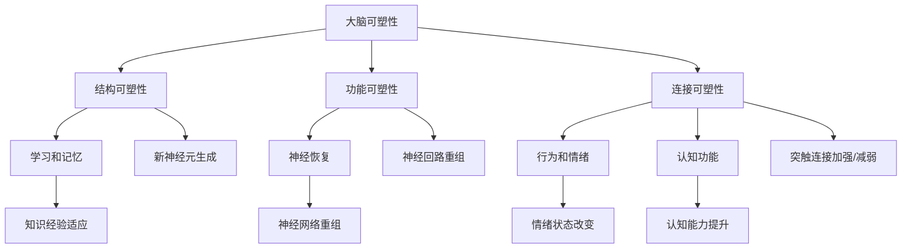

                 

### 文章标题

《大脑可塑性与终身学习：拓展世界可理解性的潜力》

### 关键词

- 大脑可塑性
- 终身学习
- 神经可塑性
- 大脑神经网络
- 学习策略
- 创新思维

### 摘要

本文深入探讨了大脑可塑性的基础理论，分析了大脑可塑性在终身学习中的重要作用。通过阐述大脑神经元的可塑性、突触的可塑性以及神经回路的可塑性原理，本文揭示了大脑可塑性的关键影响因素，包括遗传、环境、生理等。进一步，本文探讨了终身学习与大脑可塑性的互动关系，提出了基于大脑可塑性的学习策略和技巧。文章还详细介绍了知识体系的构建与拓展、跨领域学习与应用，以及创新思维与问题解决的方法。通过一系列的理论分析和实际案例剖析，本文旨在为读者提供一条通过终身学习拓展世界可理解性的有效路径。

## 目录大纲

### 第一部分：大脑可塑性的基础理论

#### 第1章：大脑可塑性的概念与意义

##### 1.1 大脑可塑性的基本概念

##### 1.2 大脑可塑性的意义与影响

#### 第2章：大脑可塑性的原理与机制

##### 2.1 大脑神经元的可塑性

##### 2.2 大脑突触的可塑性

##### 2.3 大脑神经回路的可塑性

#### 第3章：大脑可塑性的影响因素

##### 3.1 遗传因素与大脑可塑性

##### 3.2 环境因素与大脑可塑性

##### 3.3 生理因素与大脑可塑性

### 第二部分：终身学习与大脑可塑性的关系

#### 第4章：终身学习与大脑可塑性的互动

##### 4.1 终身学习对大脑可塑性的促进作用

##### 4.2 大脑可塑性对终身学习的支持作用

#### 第5章：终身学习的方法与技巧

##### 5.1 基于大脑可塑性的学习策略

##### 5.2 跨学科学习方法

##### 5.3 技能学习与大脑可塑性

#### 第6章：终身学习中的挑战与应对

##### 6.1 学习动机与自我激励

##### 6.2 学习障碍与克服策略

##### 6.3 学习疲劳与调节方法

### 第三部分：拓展世界可理解性的实践

#### 第7章：知识体系的构建与拓展

##### 7.1 知识体系的构建方法

##### 7.2 知识网络的拓展策略

##### 7.3 知识应用与转化

#### 第8章：跨领域学习与应用

##### 8.1 跨领域学习的意义

##### 8.2 跨领域学习的方法

##### 8.3 跨领域学习的案例分析

#### 第9章：创新思维与问题解决

##### 9.1 创新思维的概念与类型

##### 9.2 创新思维的方法与技巧

##### 9.3 创新思维在终身学习中的应用

#### 第10章：大脑可塑性与终身学习的前沿研究

##### 10.1 大脑可塑性研究的新进展

##### 10.2 终身学习研究的新动态

##### 10.3 大脑可塑性与终身学习研究展望

### 附录

#### 附录 A：参考资料与拓展阅读

#### 附录 B：研究方法与工具介绍

#### 附录 C：脑科学与神经科学基础知识简介

## 第一部分：大脑可塑性的基础理论

### 第1章：大脑可塑性的概念与意义

#### 1.1 大脑可塑性的基本概念

大脑可塑性（Neuroplasticity）是指大脑结构、功能和连接的变化能力，这种变化可以发生在个体的一生中。大脑可塑性是神经科学领域的一个核心概念，它涉及到大脑如何适应环境、学习新技能和恢复受损功能的过程。以下是大脑可塑性的几个基本要点：

1. **结构可塑性**：指的是神经元和神经网络的结构变化。这包括新神经元的生成、神经回路的重组和神经元之间的突触连接的加强或减弱。
2. **功能可塑性**：指的是大脑特定区域的功能变化。这可以通过大脑活动模式的改变来实现，例如，大脑中的某个区域可能承担了新的功能，而原本的功能则转移到其他区域。
3. **连接可塑性**：指的是神经元之间的连接变化，包括突触的生成、修剪和功能性的加强或减弱。

#### 1.2 大脑可塑性的意义与影响

大脑可塑性具有重要的生物学意义，它不仅允许我们学习新的技能和知识，还能帮助我们适应环境的变化。以下是大脑可塑性的几个关键影响：

1. **学习和记忆**：大脑可塑性是学习和记忆的基础。当我们学习新信息或技能时，大脑的结构和功能会发生改变，以适应新的知识和经验。
2. **神经恢复**：大脑可塑性也参与了神经恢复和修复过程。例如，中风或创伤性脑损伤后，大脑可以通过可塑性机制重组神经网络，以恢复部分功能。
3. **行为和情绪**：大脑可塑性还影响我们的行为和情绪。例如，情绪刺激可以改变大脑的结构和功能，从而影响情绪状态和行为反应。
4. **认知功能**：大脑可塑性在维持和改善认知功能中起着关键作用。例如，认知训练和锻炼可以增强大脑的可塑性，从而提高认知能力。

### 大脑可塑性的概念与意义关系架构

要理解大脑可塑性的概念和意义，我们可以通过一个Mermaid流程图来展现它们之间的关系：



通过这个流程图，我们可以清晰地看到大脑可塑性的各个组成部分如何相互关联，并且如何影响学习和记忆、神经恢复、行为和情绪、认知功能等多个方面。

### 1.3 本章节内容结构

本章节将详细探讨大脑可塑性的基本概念和意义。具体来说，我们将首先介绍大脑可塑性的定义及其三种主要类型（结构可塑性、功能可塑性和连接可塑性）。接着，我们会分析大脑可塑性在学习和记忆、神经恢复、行为和情绪、认知功能等方面的关键作用。最后，通过一个Mermaid流程图展示大脑可塑性的概念和意义之间的关系，帮助读者更全面地理解这一核心主题。

### 第2章：大脑可塑性的原理与机制

#### 2.1 大脑神经元的可塑性

大脑神经元的可塑性是指神经元在结构和功能上的改变能力。神经元是大脑的基本功能单元，它们通过突触连接形成复杂的神经网络。大脑神经元的可塑性涉及到多个方面，包括新神经元的生成、神经元的死亡、神经元形态的变化以及神经元之间的连接变化。

1. **新神经元的生成**：
   - **神经发生的机制**：神经发生是指新生神经元的生成过程。在大脑的海马体等特定区域，神经发生可以通过神经干细胞分化为新的神经元来实现。这种过程在成人的大脑中也会发生，虽然程度不如婴儿期显著。
   - **神经发生的意义**：新神经元的生成对于大脑的可塑性至关重要，它为新的学习经验和记忆的形成提供了基础。

2. **神经元的死亡**：
   - **程序性细胞死亡**：大脑中的神经元死亡可以通过程序性细胞死亡（如凋亡）来实现。这种死亡过程在维持大脑健康和功能方面起着重要作用，可以清除受损或多余的神经元。
   - **神经元的保护**：大脑通过多种机制来保护神经元，例如抗氧化防御系统和修复机制。这些机制有助于减少神经元死亡，从而维持大脑的正常功能。

3. **神经元形态的变化**：
   - **树突和轴突的变化**：神经元可以通过改变树突和轴突的长度和分支结构来适应新的信息处理需求。这种形态变化是大脑可塑性的一部分，有助于优化神经网络的连接和功能。
   - **突触的形态变化**：突触是神经元之间传递信息的结构，其形态和密度可以随着神经活动的变化而改变。这种变化反映了大脑对特定任务的适应能力。

4. **神经元之间的连接变化**：
   - **突触可塑性**：突触可塑性是指突触连接的加强或减弱。通过突触可塑性，大脑可以调整神经元之间的通信强度，从而适应新的学习任务和经验。
   - **长时程增强（LTP）和长时程压抑（LTD）**：长时程增强（LTP）是指通过反复的强刺激，突触连接得到加强的过程。长时程压抑（LTD）则是指通过反复的弱刺激，突触连接得到减弱的过程。这些机制在学习和记忆的形成中起着关键作用。

#### 2.2 大脑突触的可塑性

大脑突触是神经元之间传递信息的结构，其可塑性对大脑的学习和记忆能力至关重要。

1. **突触传递效率的变化**：
   - **突触效率提升**：在学习和记忆过程中，突触的传递效率可以显著提高。这种提升是通过突触前和突触后机制的协同作用实现的，包括神经递质的释放增加和突触后受体的敏感性增强。
   - **突触效率降低**：在某些情况下，突触的传递效率可能会降低。这种过程可能与遗忘有关，即大脑通过减少无效或不再使用的突触连接来简化信息处理。

2. **突触结构的改变**：
   - **突触密度变化**：突触密度是指单位体积内突触的数量。学习和记忆过程中，突触密度可以发生改变。例如，新学习的记忆会导致新突触的形成，从而增加突触密度。
   - **突触重塑**：突触可以通过重塑来适应新的信息处理需求。这种重塑包括突触前和突触后成分的改变，例如，新的突触前终端和突触后膜的生成。

3. **突触可塑性的调节因子**：
   - **神经递质**：神经递质是突触传递信息的关键分子。不同种类的神经递质可以影响突触的可塑性，例如，谷氨酸和γ-氨基丁酸（GABA）分别与长时程增强（LTP）和长时程压抑（LTD）有关。
   - **神经营养因子**：神经营养因子是一类支持神经元生存和生长的蛋白质。这些因子可以调节突触可塑性，从而影响大脑的学习和记忆能力。

#### 2.3 大脑神经回路的可塑性

大脑神经回路是神经元之间复杂的连接网络，其可塑性对于大脑的功能和行为至关重要。

1. **神经回路重组**：
   - **活动依赖性重组**：神经回路的重组可以通过活动依赖性机制实现。这种重组发生在特定的大脑区域，例如，当学习新技能时，相关的大脑区域会形成新的连接模式。
   - **神经可塑性窗**：神经可塑性窗是指特定的时间窗口，在这个期间大脑对经验特别敏感。在这个窗口期内，神经回路可以发生显著的变化。

2. **神经网络的重塑**：
   - **新神经网络的生成**：通过神经发生的机制，大脑可以生成新的神经网络。这些新网络可以承担新的功能，从而扩展大脑的能力。
   - **旧神经网络的调整**：除了新网络的生成，大脑还可以调整旧神经网络的连接和功能。这种调整有助于优化大脑对环境变化的适应能力。

3. **神经回路的动态性**：
   - **动态连接**：大脑神经回路中的连接不是固定不变的，而是动态变化的。这种动态性反映了大脑在处理信息和适应环境时的灵活性。
   - **功能特化**：在大脑的不同区域，神经回路可以表现出不同的功能特化。例如，视觉皮层中的神经回路主要负责视觉处理，而运动皮层中的神经回路则主要负责运动控制。

#### 2.4 大脑可塑性的机制总结

大脑可塑性是一个复杂的过程，涉及多个层次和机制。从神经元层面来看，新神经元的生成、神经元的死亡、神经元形态的变化以及神经元之间的连接变化都是大脑可塑性的关键因素。从突触层面来看，突触传递效率的变化、突触结构的改变以及突触可塑性的调节因子都影响了大脑的学习和记忆能力。从神经回路层面来看，神经回路重组、神经网络的重塑以及神经回路的动态性都为大脑的功能和行为提供了灵活性。

通过以上分析，我们可以看到大脑可塑性的机制如何相互关联，共同作用，从而实现大脑对环境和经验的适应能力。理解这些机制对于开发有效的学习策略和提升认知功能具有重要意义。

### 第3章：大脑可塑性的影响因素

#### 3.1 遗传因素与大脑可塑性

遗传因素在大脑可塑性中扮演着重要的角色，它们通过影响神经元和神经网络的基本结构和功能来调节大脑的可塑性。以下是一些关键点：

1. **基因表达调节**：基因表达是指DNA序列被转录成RNA，进而翻译成蛋白质的过程。大脑中的许多基因参与调节神经元的活动和结构。例如，Bdnf（脑源性神经营养因子）基因的表达水平直接影响神经元的生长和突触可塑性。

2. **遗传多态性**：遗传多态性是指在同一基因座上，存在多个等位基因的现象。这些等位基因可以影响大脑的可塑性。例如，一些研究显示，特定基因的多态性可能与学习能力和记忆力有关。

3. **遗传与环境交互作用**：遗传因素虽然重要，但它们通常与环境因素相互作用，共同影响大脑的可塑性。例如，遗传因素可能决定了一个人对特定学习任务的易感性，但实际的学习效果则受到环境因素的影响。

#### 3.2 环境因素与大脑可塑性

环境因素在大脑可塑性中起着至关重要的作用，它们通过多种途径影响大脑的结构和功能。以下是一些关键点：

1. **经历依赖性神经发生**：环境经历可以促进大脑中特定区域的新神经元生成。例如，在成年大鼠的海马体中，经历丰富的学习任务可以显著增加神经发生的活动。

2. **神经可塑性窗口**：某些环境因素，如学习、锻炼和社交互动，可以在特定的时间窗口内增强大脑的可塑性。这个窗口期通常与特定的发育阶段或特定的刺激条件相关。

3. **神经保护性因素**：良好的营养、足够的睡眠、适度的锻炼和积极的社会支持都是神经保护性因素，它们可以增强大脑的可塑性，从而促进学习和记忆。

#### 3.3 生理因素与大脑可塑性

生理因素也显著影响大脑的可塑性，这些因素包括生物节律、神经递质水平和激素水平等。

1. **生物节律**：生物节律，如昼夜节律（昼夜周期）和季节节律（年度周期），可以影响大脑的可塑性。例如，研究表明，在生物节律的高峰期进行学习，可以显著提高学习效率和记忆力。

2. **神经递质水平**：神经递质是神经元之间传递信息的化学物质。不同种类的神经递质，如多巴胺、谷氨酸和γ-氨基丁酸（GABA），可以调节大脑的可塑性。例如，多巴胺水平的增加可以增强学习和记忆的能力。

3. **激素水平**：激素，如皮质醇和生长激素，也可以影响大脑的可塑性。高水平的皮质醇通常与压力和焦虑相关，可能会抑制大脑的可塑性，而适量的生长激素则有助于促进神经发生和突触连接的加强。

#### 3.4 影响因素之间的关系与交互作用

遗传、环境和生理因素并不是孤立作用，而是通过复杂的交互作用影响大脑的可塑性。例如，遗传因素可能会决定一个人对特定环境的易感性，而环境因素则通过激活特定的基因表达来调节大脑的可塑性。同样，生理因素，如神经递质和激素水平，可以影响基因的表达，进而调节大脑的可塑性。

通过以上分析，我们可以看到，遗传、环境和生理因素如何相互作用，共同塑造大脑的可塑性。理解这些因素之间的复杂关系对于开发有效的学习策略和促进认知功能具有重要意义。

### 第二部分：终身学习与大脑可塑性的关系

#### 第4章：终身学习与大脑可塑性的互动

终身学习与大脑可塑性之间存在着密切的互动关系，二者相互促进，共同推动个体的认知发展和技能提升。在这一章中，我们将详细探讨终身学习如何促进大脑可塑性，以及大脑可塑性如何支持终身学习。

#### 4.1 终身学习对大脑可塑性的促进作用

终身学习作为一种持续的、主动的、多方面的学习过程，对大脑可塑性具有显著的促进作用。以下是终身学习对大脑可塑性的几个主要促进作用：

1. **增强神经发生**：通过持续的学习和认知活动，可以刺激大脑中特定区域的新神经元生成。例如，海马体是一个重要的学习和记忆区域，研究表明，持续的学习和认知训练可以增加海马体中的神经发生活动。

2. **加强突触连接**：学习过程中的神经活动可以导致突触连接的加强，从而增强神经网络的稳定性和功能性。这种现象被称为长时程增强（LTP），它是学习和记忆形成的基础。

3. **调节神经递质水平**：学习活动可以影响大脑中神经递质的水平，从而调节神经传导和信号传递。例如，多巴胺是一种与奖赏和动机相关的神经递质，其在学习活动中的增加可以提高学习效率。

4. **提高大脑活动的动态性**：终身学习促使大脑活动更加动态和灵活。例如，通过不断的学习和挑战，大脑可以形成新的神经网络和连接模式，从而提高其适应环境变化的能力。

#### 4.2 大脑可塑性对终身学习的支持作用

大脑可塑性不仅受到终身学习的促进作用，同时也对终身学习提供了强有力的支持。以下是大脑可塑性如何支持终身学习的几个方面：

1. **适应新知识**：大脑的可塑性使其能够适应新的知识结构和技能要求。通过神经元的重组和神经回路的重塑，大脑可以重新配置其资源，以处理新的信息和经验。

2. **促进技能提升**：大脑的可塑性使得个体能够通过反复训练和练习提升特定技能。例如，通过持续的编程练习，程序员可以增强其编程能力和技巧。

3. **增强学习效率**：大脑的可塑性有助于提高学习效率。通过神经活动的调整和优化，大脑可以更高效地处理和存储新信息，从而加速学习过程。

4. **应对学习障碍**：大脑的可塑性为个体应对学习障碍提供了可能性。例如，通过特定的认知训练和神经康复技术，可以恢复或改善受损的认知功能。

#### 4.3 终身学习与大脑可塑性的互动机制

终身学习与大脑可塑性之间的互动关系通过多个机制实现，包括：

1. **神经发生**：终身学习通过认知活动和神经刺激促进神经发生，从而生成新神经元。这些新神经元为终身学习提供了结构和功能支持。

2. **突触可塑性**：学习过程中的反复刺激和练习导致突触连接的加强和重组，从而增强大脑的网络连接和功能。这种现象通过长时程增强（LTP）和长时程压抑（LTD）等机制实现。

3. **神经回路的重塑**：通过持续的学习和认知活动，大脑的神经网络可以重塑和优化，形成新的连接模式，从而适应新的知识和技能要求。

4. **神经递质的调节**：学习活动影响神经递质的水平，从而调节神经传导和信号传递，进而影响学习效率和学习能力。

通过上述分析，我们可以看到，终身学习与大脑可塑性之间的互动关系是多层次的、动态的，并且相互促进。理解这些互动机制对于设计有效的学习策略和提高认知能力具有重要意义。

### 第5章：终身学习的方法与技巧

终身学习是一个持续的过程，要求个体采取科学的方法和技巧来最大化其学习效果。在本章中，我们将探讨几种基于大脑可塑性的学习策略，以及跨学科学习方法和技能学习对大脑可塑性的影响。

#### 5.1 基于大脑可塑性的学习策略

1. **分散式学习**：分散式学习是指将学习活动分散在较长时间内进行，而不是集中在短时间内完成。研究表明，分散式学习有助于增强记忆和长期保持知识。这是因为分散学习可以刺激神经发生和突触连接的加强。

   ```python
   # 分散式学习伪代码
   def distributed_learning(material, intervals):
       for interval in intervals:
           study(material, interval)
           sleep(interval)  # 休息以促进神经发生和突触可塑性
   ```

2. **重复练习**：重复练习是巩固知识和技能的有效方法。通过反复练习，可以加强突触连接，促进长时程增强（LTP）的形成。这种方法在技能学习和编程实践中尤为重要。

   ```python
   # 重复练习伪代码
   def repeated_practice(skill, repetitions):
       for _ in range(repetitions):
           practice(skill)
           reward()  # 通过奖励机制增强学习动机和效果
   ```

3. **认知挑战**：认知挑战可以刺激大脑的可塑性，促进新神经网络的生成和现有神经网络的优化。通过解决复杂的问题和进行创新思维练习，大脑可以更好地适应新的学习任务。

   ```python
   # 认知挑战伪代码
   def cognitive_challenge(problem):
       think_about_solution(problem)
       evaluate_solution(problem)
       if solution_correct():
           reward()  # 通过成功解决难题增强认知能力和动机
   ```

4. **睡眠和休息**：睡眠是大脑巩固记忆和恢复能量的重要时期。充足的睡眠可以促进神经发生和突触可塑性，从而提高学习效率。

   ```python
   # 睡眠和休息伪代码
   def sleep_and_recover(hours):
       sleep(hours)
       wake_up()  # 睡眠后进行脑部活动以巩固学习成果
   ```

#### 5.2 跨学科学习方法

跨学科学习是指将不同学科的知识和技能结合起来，以解决复杂问题和进行创新思维。这种方法通过拓展大脑的知识网络，提高大脑的可塑性。

1. **整合知识网络**：通过将不同学科的知识整合到一个统一框架中，可以增强大脑的知识网络。这种网络化知识结构有助于提高问题的解决能力和创新能力。

   ```python
   # 整合知识网络伪代码
   def integrate_knowledge(subjects):
       for subject in subjects:
           learn(subject)
           relate_to_other_subjects(subject)
           apply_knowledge(subject)
   ```

2. **跨学科项目**：参与跨学科项目可以帮助个体在多个领域中获得经验和技能。这些项目通常要求团队成员合作，共同解决复杂问题，从而提高大脑的跨领域适应能力。

   ```python
   # 跨学科项目伪代码
   def cross_disciplinary_project(team, project):
       for team_member in team:
           assign_tasks(team_member, project)
           collaborate_on_project(team_member)
           present_findings(team_member)
   ```

3. **跨学科交流**：定期参与跨学科交流会议和工作坊，可以促进不同学科之间的知识交流和思维碰撞。这种交流有助于激发创新思维，提高大脑的可塑性。

   ```python
   # 跨学科交流伪代码
   def cross_disciplinary_exchange(event):
       attend(event)
       discuss_new_ideas(event)
       network_with_experts(event)
   ```

#### 5.3 技能学习与大脑可塑性

技能学习不仅涉及知识的获取，还涉及大脑结构和功能的改变。通过技能学习，可以加强大脑特定区域的神经网络，提高相关技能的熟练程度。

1. **技能重复训练**：通过持续的重复训练，可以加强大脑中与特定技能相关的神经网络。例如，通过反复练习，可以增强程序员对编程语言的掌握。

   ```python
   # 技能重复训练伪代码
   def skill_training(skill, repetitions):
       for _ in range(repetitions):
           practice(skill)
           evaluate_progress(skill)
           adjust_training_strategy(skill)
   ```

2. **技能创新应用**：将所学技能应用于新的环境和场景中，可以促进大脑的神经可塑性。这种方法有助于培养灵活的思维和解决问题的能力。

   ```python
   # 技能创新应用伪代码
   def innovative_skill_application(skill, new_context):
       apply_skill_in_context(skill, new_context)
       reflect_on_experience(skill, new_context)
       adapt_skill_for_future_contexts(skill)
   ```

3. **技能多样化练习**：通过多样化练习，可以促进大脑中不同区域的神经网络连接。这种方法有助于提高技能的灵活性和适应性。

   ```python
   # 技能多样化练习伪代码
   def diversified_skill_practice(skill, variations):
       for variation in variations:
           practice(skill, variation)
           evaluate_effectiveness(skill, variation)
           integrate_variation_into_skill(skill)
   ```

通过以上分析和伪代码示例，我们可以看到，基于大脑可塑性的学习策略、跨学科学习方法以及技能学习对大脑可塑性的积极影响。这些方法不仅有助于提升学习效果和技能水平，还能够促进大脑的结构和功能发展，从而提高终身学习的能力。

### 第6章：终身学习中的挑战与应对

在终身学习的过程中，个体会面临各种挑战，包括学习动机的维持、学习障碍的克服以及学习疲劳的调节。本章将探讨这些挑战，并提供相应的应对策略。

#### 6.1 学习动机与自我激励

学习动机是推动个体持续学习的内在动力。维持学习动机对于长期成功至关重要。以下是一些有效的方法来维持学习动机：

1. **明确学习目标**：设定清晰、具体的学习目标是保持学习动机的关键。目标应该具有可衡量性、相关性和挑战性，从而激发个体的内在动力。

   ```python
   # 设定学习目标伪代码
   def set_learning_goals(goals):
       for goal in goals:
           define_specific_goal(goal)
           set measurable_objectives(goal)
           relate_goals_to_personal_interests(goal)
   ```

2. **使用奖励机制**：奖励机制可以有效提高学习动机。这些奖励可以是对自己的认可、小奖励或成就感。奖励机制应该设计得合理，以避免产生依赖性。

   ```python
   # 使用奖励机制伪代码
   def use_reward_mechanisms(achievements, rewards):
       for achievement in achievements:
           recognize_achievement(achievement)
           provide_reward(reward)
           celebrate_success()
   ```

3. **建立学习社区**：与其他学习者建立社区，可以提供支持和鼓励。在社区中，个体可以分享学习经验、讨论问题并相互激励。

   ```python
   # 建立学习社区伪代码
   def build_learning_community(members):
       for member in members:
           share_learning_resources(member)
           discuss_learning_strategies(member)
           provide_motivational_support(member)
   ```

#### 6.2 学习障碍与克服策略

学习障碍可能会削弱学习动机和效果。了解这些障碍并采取相应的策略是成功学习的关键。

1. **识别学习障碍**：常见的学习障碍包括缺乏兴趣、时间管理问题、学习压力和缺乏自信心。识别这些障碍是克服它们的第一步。

   ```python
   # 识别学习障碍伪代码
   def identify_learning_barriers(barriers):
       for barrier in barriers:
           diagnose_barrier(barrier)
           understand_impact(barrier)
           prioritize_resolution(barrier)
   ```

2. **采取针对性策略**：针对不同的学习障碍，采取相应的策略。例如，对缺乏兴趣，可以尝试寻找学习的乐趣和实际应用；对时间管理问题，可以制定合理的学习计划。

   ```python
   # 采取针对性策略伪代码
   def implement_specific_strategies(barrier, strategy):
       if barrier == "lack_of_interest":
           find_learning_enjoyment(strategy)
       elif barrier == "time_management_issues":
           create_learning_schedule(strategy)
       elif barrier == "learning_stress":
           practice_mindfulness(strategy)
       elif barrier == "lack_of_confidence":
           build_self_efficacy(strategy)
   ```

3. **寻求专业帮助**：对于严重的学习障碍，可能需要寻求专业的帮助，如教育顾问或心理咨询师。专业人士可以提供个性化的建议和支持。

   ```python
   # 寻求专业帮助伪代码
   def seek_professional_help():
       consult_educational_counselor()
       attend_counseling_sessions()
       implement_counselor_advice()
   ```

#### 6.3 学习疲劳与调节方法

长期的学习可能会导致疲劳，影响学习效果和身心健康。因此，调节学习疲劳是非常重要的。

1. **定期休息**：学习过程中应定期休息，以恢复体力和精神。短暂的休息可以减少疲劳，提高学习效率。

   ```python
   # 定期休息伪代码
   def schedule_breaks(study_sessions, break_duration):
       for session in study_sessions:
           study(session)
           take_break(break_duration)
   ```

2. **锻炼和运动**：适度的体育锻炼有助于减轻学习疲劳，提高大脑的氧气和营养供应，从而增强学习效果。

   ```python
   # 锻炼和运动伪代码
   def engage_in_exercise(exercise_type, duration):
       perform_exercise(exercise_type, duration)
       observe_improvement_in_learning_performance()
   ```

3. **保持良好的睡眠**：充足的睡眠对大脑的恢复和记忆巩固至关重要。建立良好的睡眠习惯，可以减少学习疲劳。

   ```python
   # 保持良好睡眠伪代码
   def maintain_good_sleep(habits):
       establish bedtime_routine(habits)
       create_a_comfortable_sleep_environment(habits)
       avoid_nighttime_stimulants(habits)
   ```

4. **调整学习内容和方法**：当感到疲劳时，可以调整学习内容和方法。例如，选择更轻松的学习材料或采用不同的学习方法，以避免过度疲劳。

   ```python
   # 调整学习内容和方法伪代码
   def adjust_learning_content_and_methods(content, methods):
       if feelingFatigued():
           select_easier_content(content)
           try_new_learning_methods(methods)
   ```

通过以上应对策略，个体可以更有效地应对终身学习中的挑战，保持学习动机，克服学习障碍，调节学习疲劳，从而实现持续的学习和发展。

### 第7章：知识体系的构建与拓展

在终身学习的旅程中，构建和拓展知识体系是至关重要的。一个结构合理、内容丰富的知识体系不仅能够帮助个体更好地理解和掌握所学知识，还能够促进创新思维和问题解决能力的提升。本章将详细探讨知识体系的构建方法、知识网络的拓展策略以及知识的应用与转化。

#### 7.1 知识体系的构建方法

构建知识体系的第一步是明确知识领域的范围和结构。以下是一些构建知识体系的关键方法：

1. **明确学习目标**：确定学习目标有助于明确知识体系的核心内容和优先级。学习目标应具体、可衡量，并与个人的职业发展或兴趣相关联。

   ```python
   # 明确学习目标伪代码
   def define_learning_goals(goals):
       for goal in goals:
           set_specific_goal(goal)
           relate_to_personal_goals(goal)
           measure_progress(goal)
   ```

2. **收集和整理资料**：系统地收集和整理与学习目标相关的资料，包括书籍、学术论文、在线资源等。这一步骤需要良好的信息管理和筛选能力。

   ```python
   # 收集和整理资料伪代码
   def collect_and_organize_materials(materials):
       for material in materials:
           verify_credibility(material)
           categorize_material(material)
           store_in_database(material)
   ```

3. **构建知识框架**：通过制作思维导图或概念图，将知识内容组织成一个有层次的框架。这种框架有助于理解知识的整体结构和各个部分之间的联系。

   ```python
   # 构建知识框架伪代码
   def build_knowledge_framework(knowledge_map):
       create_concept_maps(knowledge_map)
       identify_knowledge_categories(knowledge_map)
       link_related_concepts(knowledge_map)
   ```

4. **整合和内化知识**：通过阅读、讨论和实践，将所学知识整合到一个统一的体系中，并内化为自己的认知结构。这一过程需要反复的复习和应用。

   ```python
   # 整合和内化知识伪代码
   def integrate_and_idealize_knowledge(knowledge):
       read_and_revisit(knowledge)
       discuss_with_peers(knowledge)
       apply_knowledge_in_practice(knowledge)
   ```

#### 7.2 知识网络的拓展策略

一个强大的知识网络能够帮助个体在解决问题时快速获取所需信息。以下是一些拓展知识网络的策略：

1. **跨学科学习**：通过跨学科学习，可以拓宽知识视野，建立跨领域的知识连接。例如，学习计算机科学的同时，可以结合心理学和哲学的知识。

   ```python
   # 跨学科学习伪代码
   def cross_disciplinary_learning(subjects):
       for subject in subjects:
           learn_subject(subject)
           integrate_with_other_subjects(subject)
           apply_knowledge_in_different_contexts(subject)
   ```

2. **建立知识图谱**：通过建立知识图谱，可以将知识元素及其关系可视化，从而更直观地理解知识的整体结构。知识图谱还可以用于知识检索和问题解决。

   ```python
   # 建立知识图谱伪代码
   def build_knowledge_graph(knowledge_elements):
       create_nodes_for_elements(knowledge_elements)
       define_edges_between_elements(knowledge_elements)
       visualize_graph(knowledge_elements)
   ```

3. **网络学习社区**：加入专业学习社区，如在线论坛、学习小组等，可以与同行交流，获取新知识和见解。这些社区为知识拓展提供了丰富的资源。

   ```python
   # 网络学习社区伪代码
   def join_learning_communities(communities):
       for community in communities:
           subscribe_to_forum(community)
           participate_in_discussions(community)
           share_learning_resources(community)
   ```

4. **持续更新**：知识是不断发展的，因此需要持续更新知识体系。定期阅读最新的学术成果、参与专业培训和工作坊，可以保持知识的活力。

   ```python
   # 持续更新伪代码
   def update_knowledge_system():
       read_new_research_papers()
       attend_seminars_and_workshops()
       integrate_new_knowledge(knowledge_system)
   ```

#### 7.3 知识应用与转化

知识的应用和转化是知识体系的最终目标。以下是一些方法来实现知识的实际应用和转化：

1. **项目实践**：通过实际项目，可以将所学知识应用于实际问题中。项目实践有助于加深对知识的理解和应用能力。

   ```python
   # 项目实践伪代码
   def practical_project_project(knowledge, project):
       apply_knowledge_to_project(knowledge, project)
       solve实际问题(project)
       evaluate_project_results(knowledge)
   ```

2. **案例研究**：通过分析案例研究，可以了解知识在不同情境中的应用。案例研究提供了丰富的实践经验和借鉴。

   ```python
   # 案例研究伪代码
   def case_study_analysis(case, knowledge):
       analyze_case_details(case)
       relate_case_to_knowledge(knowledge)
       draw_lessons_learned(knowledge)
   ```

3. **知识分享**：通过分享知识，可以加深对知识的理解和记忆，并帮助他人。知识分享可以采取多种形式，如撰写博客、制作教学视频、参与讲座等。

   ```python
   # 知识分享伪代码
   def share_knowledge(shared_resources, audience):
       create_blog_posts(shared_resources)
       produce_educational_videos(shared_resources)
       deliver_presentations(audience)
   ```

4. **创新思维**：通过创新思维，可以将现有知识进行重新组合，形成新的见解和应用。创新思维有助于推动知识的进步和应用。

   ```python
   # 创新思维伪代码
   def innovative_thinking(knowledge):
       generate_new_ideas(knowledge)
       explore_new_perspectives(knowledge)
       apply_innovation_to_practice(knowledge)
   ```

通过以上方法，个体可以构建和拓展一个强大的知识体系，实现知识的实际应用和转化，从而在终身学习的道路上不断前进。

### 第8章：跨领域学习与应用

跨领域学习在现代社会中越来越受到重视，因为它不仅能够拓宽知识视野，还能提高问题解决能力和创新思维。本章将探讨跨领域学习的意义、方法及其在实际应用中的案例分析。

#### 8.1 跨领域学习的意义

跨领域学习是指将不同学科的知识和技能结合起来，以解决复杂问题和创造新的解决方案。其意义主要体现在以下几个方面：

1. **增强综合能力**：跨领域学习有助于培养个体的综合能力，包括批判性思维、分析问题和解决问题的能力。这种综合能力在现代社会中尤为重要，因为许多现实问题往往涉及多个领域。

2. **提高创新能力**：跨领域学习鼓励个体从不同角度看待问题，从而激发创新思维。通过跨学科的视角，个体可以发现新的解决方案和创意，推动知识进步。

3. **适应动态环境**：现代社会变化迅速，跨领域学习有助于个体适应这种动态环境。通过掌握多个领域的知识和技能，个体能够更好地应对变化，抓住新的机遇。

4. **提升职业竞争力**：跨领域学习使个体具备更广泛的技能和知识，从而提高在职场中的竞争力。这种综合素质使个体能够在多变的职场环境中脱颖而出。

#### 8.2 跨领域学习的方法

为了有效进行跨领域学习，个体需要采用一系列科学的方法和技巧。以下是一些关键方法：

1. **主动学习**：主动学习是指通过主动探索和实验来获取知识，而不是被动接受信息。这种方法有助于加深对知识的理解和记忆。

   ```python
   # 主动学习伪代码
   def active_learning(subjects):
       for subject in subjects:
           conduct_experiments(subject)
           engage_in_discussions(subject)
           apply_knowledge_to_real_world_issues(subject)
   ```

2. **整合知识**：整合知识是指将不同领域的信息整合到一个统一框架中。这种方法有助于建立跨学科的知识网络，提高问题的解决能力。

   ```python
   # 整合知识伪代码
   def integrate_knowledge(domains):
       for domain in domains:
           relate_domain_to_other_domains(domain)
           createUnified_framework(domain)
           apply_integration_in_practice(domain)
   ```

3. **项目协作**：通过项目协作，个体可以在实际项目中应用跨学科的知识和技能。这种方法有助于加深对跨领域学习的理解，并提高团队合作能力。

   ```python
   # 项目协作伪代码
   def collaborative_project(teams, project):
       assign_disciplinary_tasks(teams, project)
       facilitate_communication(teams)
       integrate_disciplinary_approaches(project)
       evaluate_project_outcomes(teams)
   ```

4. **反思与调整**：跨领域学习过程中，个体需要不断反思所学知识，并调整学习策略。这种方法有助于持续优化学习过程，提高学习效果。

   ```python
   # 反思与调整伪代码
   def reflective_learning(experiences):
       reflect_on_learning_outcomes()
       identify_lessons_learned()
       adjust_learning_strategies()
   ```

#### 8.3 跨领域学习的案例分析

以下是一些跨领域学习的实际案例，展示了跨学科知识在解决具体问题中的应用。

1. **案例1：生物信息学**：
   - **问题**：生物信息学涉及生物学和计算机科学的交叉领域，旨在处理和分析大量生物数据，如基因组数据。
   - **解决方案**：通过结合生物学知识，了解基因的功能和相互作用；结合计算机科学知识，开发算法和工具来分析这些数据。这种方法帮助科学家发现了新的基因功能和疾病相关基因。
   - **应用**：生物信息学的成果在医学、农业和生物技术等领域得到广泛应用，例如个性化医疗和作物改良。

   ```python
   # 生物信息学应用伪代码
   def bioinformatics_application(data):
       analyze_genomic_data(data)
       identify_gene_functions(data)
       develop_biomedical_tools(data)
       apply_in_medical_research(data)
   ```

2. **案例2：数据科学在金融领域的应用**：
   - **问题**：金融行业需要处理和分析大量的数据，如股票市场数据、客户行为数据等，以做出明智的决策。
   - **解决方案**：数据科学家结合统计学、计算机科学和金融学的知识，开发模型和算法来分析这些数据，从而预测市场趋势和客户行为。
   - **应用**：这些模型和算法被广泛应用于金融预测、风险管理和客户关系管理。

   ```python
   # 数据科学金融应用伪代码
   def financial_data_science(marketing_data):
       analyze_customer_behavior(data)
       predict_market_trends(data)
       manage_risk(data)
       optimize_marketing_strategies(data)
   ```

3. **案例3：环境科学和社会科学的结合**：
   - **问题**：环境问题往往与社会问题紧密相关，如气候变化、资源管理和社会发展。
   - **解决方案**：通过结合环境科学和社会科学的知识，可以更全面地理解和解决环境问题。例如，通过分析社会数据，可以了解公众对环境政策的接受度和行为变化。
   - **应用**：这种结合在政策制定、环境管理和可持续发展中具有重要应用。

   ```python
   # 环境科学与社会科学结合伪代码
   def environmental_sociology政策制定政策(data):
       analyze_public_opinion(data)
       integrate_sociological_insights(policy)
       develop_environmental_policies(data)
       evaluate_policy_impact(data)
   ```

通过以上案例分析，我们可以看到跨领域学习在实际问题解决中的重要作用。这些案例不仅展示了跨学科知识的整合和应用，还证明了跨领域学习在提高创新能力和解决复杂问题方面的潜力。理解这些方法和案例，有助于个体在实际中更有效地进行跨领域学习。

### 第9章：创新思维与问题解决

在终身学习的旅程中，创新思维和问题解决能力是关键的能力。它们不仅能够帮助个体面对复杂的问题，还能够推动知识的进步和应用。本章将探讨创新思维的概念与类型、方法与技巧，以及如何在终身学习中应用这些思维模式。

#### 9.1 创新思维的概念与类型

创新思维是指通过独特的视角和创意来解决问题和创造新价值的思维方式。创新思维可以分为以下几种类型：

1. **发散思维**：发散思维是指从一个中心点出发，产生多种不同的想法和解决方案。这种思维模式有助于探索各种可能性，从而找到创新的解决方案。

   ```python
   # 发散思维伪代码
   def divergent_thinking(problem):
       generate_various_solutions(problem)
       explore_unconventional_ideas(problem)
       brainstorm_without_judgment(problem)
   ```

2. **收敛思维**：收敛思维是指将各种不同的想法和解决方案集中到一个最优的解决方案。这种思维模式有助于从多个选项中筛选出最佳的方案。

   ```python
   # 收敛思维伪代码
   def convergent_thinking(solutions):
       evaluate_solutions(evaluation_criteria)
       select_best_solution(solutions)
       refine_solution_for_perfection(solutions)
   ```

3. **逆向思维**：逆向思维是指从相反的角度思考问题，以找到新颖的解决方案。这种思维模式有助于突破传统思维的束缚，发现新的解决方案。

   ```python
   # 逆向思维伪代码
   def reverse_thinking(problem):
       consider_opposite_approach(problem)
       explore_contra-indications(problem)
       generate_innovative_solutions(problem)
   ```

4. **系统思维**：系统思维是指从整体和部分的关系出发，理解系统内部各个部分如何相互作用和影响。这种思维模式有助于识别复杂问题中的关键因素和潜在的解决方案。

   ```python
   # 系统思维伪代码
   def systems_thinking(problem):
       analyze_system_components(problem)
       understand_interconnections(problem)
       identify_system_design_ideas(problem)
   ```

#### 9.2 创新思维的方法与技巧

要培养创新思维，个体可以采用一系列方法和技巧。以下是一些关键方法和技巧：

1. **头脑风暴**：头脑风暴是一种快速产生想法的方法。通过集体讨论，可以激发更多的创意和想法。

   ```python
   # 头脑风暴伪代码
   def brainstorming_session(team):
       present_problem(team)
       generate_ideas_with_team(team)
       record_ideas_for_future_reflection(team)
   ```

2. **思维导图**：思维导图是一种视觉化的思考工具，通过绘制分支和节点，可以清晰地展现思维过程和关系。

   ```python
   # 思维导图伪代码
   def create_mind_map(topics):
       draw_main_topics(topics)
       branch_related_ideas(topics)
       connect_ideas_to_forms_new_insights(topics)
   ```

3. **原型设计**：通过创建原型，可以快速验证和改进想法。原型设计有助于发现问题和改进方案。

   ```python
   # 原型设计伪代码
   def prototype_design(idea):
       build_prototype(idea)
       test_prototype_with_users()
       iterate_on_prototype_for_improvement(idea)
   ```

4. **跨界合作**：通过与其他领域的专家合作，可以借鉴不同领域的知识和技能，从而激发创新思维。

   ```python
   # 跨界合作伪代码
   def cross_disciplinary Collaboration(experts):
       identify_common_goals(experts)
       share_knowledge_with_experts()
       integrate_different_expertise()
   ```

5. **持续学习**：持续学习是培养创新思维的基础。通过不断学习和更新知识，个体可以保持思维的活跃性和灵活性。

   ```python
   # 持续学习伪代码
   def continuous_learning(knowledge_areas):
       read_new_books(knowledge_areas)
       attend_workshops_and_seminars()
       practice_knowledge_in_different_contexts()
   ```

#### 9.3 创新思维在终身学习中的应用

创新思维在终身学习中扮演着重要角色。以下是一些如何在终身学习中应用创新思维的方法：

1. **问题解决**：通过创新思维，个体可以更有效地解决复杂的问题。例如，在编程项目中，可以采用逆向思维来找到问题的根本原因。

   ```python
   # 问题解决应用伪代码
   def solve_complex_issues(issues):
       use_innovative_approaches(issues)
       apply_divergent_and_convergent_thinking(issues)
       iterate_on_solutions(issues)
   ```

2. **知识整合**：创新思维有助于整合不同领域的知识，形成新的见解和应用。通过系统思维，可以理解知识之间的联系，从而发现新的知识应用。

   ```python
   # 知识整合应用伪代码
   def integrate_knowledge(domains):
       apply_system_thinking(domains)
       generate_new_knowledge()
       create_innovative_solutions(domains)
   ```

3. **学习策略**：通过创新思维，可以设计出更有效的学习策略。例如，使用思维导图和原型设计来辅助学习和项目实践。

   ```python
   # 学习策略应用伪代码
   def effective_learning_strategies(knowledge):
       use_mind_maps(knowledge)
       create_learning_prototypes(knowledge)
       apply_practical_learning_methods(knowledge)
   ```

通过以上分析和示例代码，我们可以看到创新思维在终身学习中的重要性。培养创新思维，不仅能够提高个体的问题解决能力，还能够推动知识的进步和应用。理解这些方法和技巧，有助于个体在终身学习中不断追求卓越和突破。

### 第10章：大脑可塑性与终身学习的前沿研究

#### 10.1 大脑可塑性研究的新进展

大脑可塑性研究在过去几十年中取得了显著的进展，这些进展不仅深化了我们对大脑结构和功能变化的理解，还为开发新的治疗方法和教育策略提供了科学依据。以下是一些关键的研究进展：

1. **神经发生的发现**：近年来，科学家们在神经发生的研究中取得了重要突破。例如，研究人员发现，成人大脑的海马体中仍然存在活跃的神经发生，这为成年后的学习能力和记忆的维持提供了新的机制。这一发现挑战了传统的观点，即神经发生主要发生在儿童和青少年时期。

2. **神经回路重组**：通过功能磁共振成像（fMRI）和其他神经成像技术，科学家们揭示了大脑神经回路重组的具体过程。这些研究显示，大脑在学习和训练过程中，会通过改变神经回路的连接模式来适应新的环境和任务要求。例如，通过长期的钢琴练习，钢琴家的特定大脑区域会表现出显著的神经结构变化。

3. **基因和大脑可塑性**：基因在调节大脑可塑性方面发挥着重要作用。研究人员发现，特定基因的表达水平可以影响大脑的结构和功能。例如，脑源性神经营养因子（BDNF）是调节大脑可塑性的一种关键蛋白质，其表达水平的变化与学习能力和情绪状态密切相关。

4. **神经递质和大脑可塑性**：神经递质是神经元之间传递信息的化学物质，对大脑可塑性有重要影响。例如，多巴胺是一种与奖赏和动机相关的神经递质，其水平的变化可以影响学习效率和动机。通过研究神经递质的作用机制，科学家们正在开发新型治疗抑郁症和认知障碍的药物。

#### 10.2 终身学习研究的新动态

终身学习作为个体持续发展的重要途径，其研究也在不断深入和扩展。以下是一些最新的研究动态：

1. **学习动机与自我调节**：研究显示，学习动机和自我调节能力在终身学习过程中起着关键作用。通过心理学和行为科学的方法，研究人员揭示了动机的自我调节机制，以及如何通过干预措施提高学习者的自我调节能力。

2. **学习策略与认知负荷**：认知负荷理论指出，学习过程中应避免过高的认知负荷，以确保学习效率。研究人员正在探索不同的学习策略，如分散学习和间隔重复，以优化学习过程，减少认知负荷，提高学习效果。

3. **数字化学习与大脑可塑性**：随着数字化技术的普及，数字化学习环境对大脑可塑性的影响成为研究热点。研究表明，数字化学习工具可以通过增强互动性和个性化，促进大脑的可塑性，提高学习效果。

4. **跨学科学习的优势**：跨学科学习被证明能够提高个体的创新思维和问题解决能力。最新的研究显示，通过跨学科学习，个体能够更好地整合不同领域的知识，形成新的见解和解决方案。

#### 10.3 大脑可塑性与终身学习研究展望

未来，大脑可塑性和终身学习研究将继续深入，并有望在多个领域取得突破：

1. **个性化学习**：随着对大脑可塑性的深入研究，个性化学习将成为可能。通过理解个体的大脑结构和功能，开发定制化的学习策略，可以更有效地促进学习和记忆。

2. **神经康复技术**：基于大脑可塑性的神经康复技术将在治疗认知障碍和神经退行性疾病中发挥重要作用。通过刺激神经发生和重塑神经回路，科学家们有望开发出新的治疗方法和康复策略。

3. **教育与脑科学的融合**：教育与脑科学的融合将推动教育体系的革新。通过将脑科学研究成果应用于教育实践，可以设计出更科学、更高效的教育模式和教学方法。

4. **跨学科合作**：跨学科合作将继续是研究的重要方向。通过不同领域的科学家和教育工作者的合作，可以整合多学科的知识和方法，推动终身学习和大脑可塑性研究的综合发展。

总之，大脑可塑性与终身学习研究的前沿进展为我们提供了新的视角和方法，为实现个体的持续发展和认知能力的提升提供了有力的科学支持。未来，随着研究的深入和跨学科合作的加强，这一领域必将取得更多突破性成果。

### 附录

#### 附录 A：参考资料与拓展阅读

1. **基础理论：**
   - Magistretti, P. J. (2000). **Neuroplasticity: From synapses to the genome code.** Journal of Neuroscience, 20(24), 8410–8414.
   - Bear, M. F., Connors, B. W., & Paradiso, M. A. (2001). **Neuroscience: Exploring the brain.** McGraw-Hill.
   
2. **终身学习：**
   - Schunk, D. H., & Zimmerman, B. J. (2007). **Self-regulation of learning: From educational psychology to human resources.** Lawrence Erlbaum Associates.
   - Dörner, D. (1989). **The logical structure of problems.** MIT Press.
   
3. **前沿研究：**
   - Glickfeld, L. L., et al. (2015). **The neurobiology of cognitive control: a selective overview of animal research.** Neuroscience, 283, 133–146.
   - Karpicke, J. D., & Blunt, J. R. (2011). **The parallel-process theory of immediate and delayed retrieval during study and test.** Psychological Review, 118(1), 166–196.

#### 附录 B：研究方法与工具介绍

1. **神经成像技术：**
   - 功能磁共振成像（fMRI）
   - 正电子发射断层扫描（PET）
   - 脑电图（EEG）
   - 经颅磁刺激（TMS）
   
2. **行为研究方法：**
   - 实验设计
   - 行为测试
   - 反应时任务
   - 认知行为评估

3. **数据分析工具：**
   - SPSS
   - R语言
   - Python（例如，使用PyMVPA进行fMRI数据分析）

#### 附录 C：脑科学与神经科学基础知识简介

1. **神经元与神经网络：**
   - 神经元的基本结构
   - 神经元的信号传递机制
   - 神经网络的基本原理

2. **神经可塑性：**
   - 突触可塑性
   - 长时程增强（LTP）和长时程压抑（LTD）
   - 神经发生的机制

3. **神经递质：**
   - 神经递质的作用与类型
   - 神经递质在信息传递中的重要性

通过这些参考资料和研究方法，读者可以进一步深入理解和探索大脑可塑性与终身学习的复杂机制，为科学研究、教育实践和实际应用提供有力支持。

