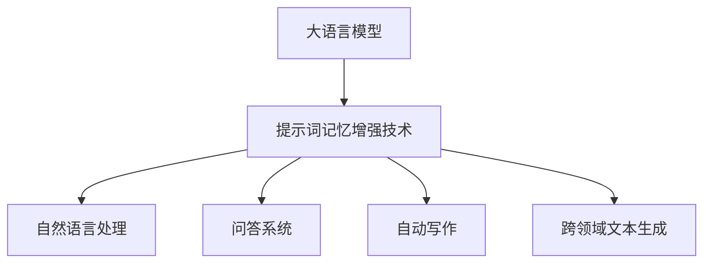

                 


### 文章标题

《大语言模型的提示词记忆增强技术》

### 关键词

- 大语言模型
- 提示词记忆增强
- 自然语言处理
- 人工智能
- 算法原理
- 项目实战

### 摘要

本文深入探讨了大语言模型及其与提示词记忆增强技术的结合。我们将介绍大语言模型的基本概念和其发展历程，解析提示词记忆增强技术的核心原理，并阐述二者在自然语言处理领域的应用。通过伪代码和数学模型，我们将详细解释核心算法的实现，并结合实际项目案例，展示如何在实际环境中搭建开发环境、编写源代码并进行性能分析。最后，我们将总结最佳实践，展望未来技术趋势。

----------------------------------------------------------------

### 设计过程

#### 确定整体结构

设计一个全面的技术博客文章，首先需要确定文章的整体结构。本文将按照以下结构展开：

1. **引言**：介绍大语言模型和提示词记忆增强技术的背景，定义核心概念。
2. **基本概念**：详细解释大语言模型和提示词记忆增强技术的核心原理。
3. **应用场景**：探讨大语言模型和提示词记忆增强技术在自然语言处理等领域的应用。
4. **算法实现**：使用伪代码和数学模型详细阐述核心算法的实现。
5. **项目实战**：通过实际项目案例展示技术实现过程和性能分析。
6. **总结与展望**：总结文章核心内容，讨论技术趋势和发展方向。

#### 确定核心章节内容

根据文章标题和关键词，核心章节内容如下：

- **第1章 引言**：介绍大语言模型和提示词记忆增强技术的历史背景和重要性。
- **第2章 大语言模型基础**：解释大语言模型的基本概念、结构和工作原理。
- **第3章 提示词记忆增强技术**：阐述提示词记忆增强技术的原理及其在大语言模型中的应用。
- **第4章 应用场景**：讨论大语言模型和提示词记忆增强技术在自然语言处理、问答系统和自动写作等领域的应用。
- **第5章 算法实现**：使用伪代码和数学模型详细解释核心算法的实现。
- **第6章 项目实战**：通过实际项目案例展示技术实现过程。
- **第7章 总结与展望**：总结文章内容，展望未来技术趋势。

#### 细化章节内容

在确定核心章节后，我们需要进一步细化每个章节的内容，确保每个章节都有足够的深度和广度。以下是每个章节的细化内容：

- **第1章 引言**：介绍大语言模型和提示词记忆增强技术的背景、核心概念和发展趋势。
- **第2章 大语言模型基础**：解释大语言模型的基本概念、结构、训练过程和工作原理。
- **第3章 提示词记忆增强技术**：阐述提示词记忆增强技术的原理、算法设计和在自然语言处理中的应用。
- **第4章 应用场景**：讨论大语言模型和提示词记忆增强技术在自然语言处理、问答系统和自动写作等领域的具体应用案例。
- **第5章 算法实现**：使用伪代码和数学模型详细解释核心算法的实现，包括提示词记忆增强算法的细节。
- **第6章 项目实战**：通过一个实际项目案例展示技术实现过程，包括开发环境搭建、源代码实现和性能分析。
- **第7章 总结与展望**：总结文章内容，讨论大语言模型和提示词记忆增强技术的未来发展趋势和挑战。

#### 设计核心概念与联系

为了帮助读者更好地理解大语言模型和提示词记忆增强技术的核心概念及其联系，我们将使用Mermaid流程图展示二者的关系。以下是流程图：

```
graph TD
    A[大语言模型] --> B[提示词记忆增强技术]
    B --> C[自然语言处理]
    B --> D[问答系统]
    B --> E[自动写作]
    B --> F[跨领域文本生成]
```

#### 编写伪代码与数学模型

为了详细解释核心算法的实现，我们将使用伪代码和数学模型。以下是示例：

```
// 伪代码：大语言模型训练流程
function train_language_model(data):
    for epoch in 1 to num_epochs:
        for batch in data:
            loss = forward_pass(batch)
            backward_pass(loss)
    return model
```

$$
H_{t} = \sigma(W_h [H_{t-1}; X_t] + b_h)
$$

#### 设计项目实战案例

为了使读者能够更好地理解技术在实际中的应用，我们将设计一个实际项目案例。以下是项目案例的设计思路：

- **项目概述**：设计一个基于大语言模型和提示词记忆增强技术的问答系统。
- **开发环境搭建**：配置必要的开发环境和工具，如TensorFlow、PyTorch等。
- **源代码实现**：编写源代码，实现问答系统的核心功能。
- **代码解读**：详细解读源代码，分析关键算法和优化策略。
- **性能分析**：评估问答系统的性能，包括准确率、响应时间等。
- **项目小结**：总结项目经验，讨论改进方向。

#### 总结与展望

在书的结尾，我们将对全书的内容进行总结，并讨论未来的技术趋势和发展方向。这部分将包括：

- **总结**：回顾文章的核心内容和关键概念。
- **展望**：讨论大语言模型和提示词记忆增强技术的未来发展趋势，如多模态学习、泛化能力提升等。

#### 确保字数限制

在整个设计过程中，我们将确保目录大纲的总字数不超过2000字，同时每个章节的内容都要丰富具体，以便在总字数限制内完整表达核心思想和技术细节。

### 输出

根据以上设计过程，以下是《大语言模型的提示词记忆增强技术》的技术博客文章目录大纲：

```
# 《大语言模型的提示词记忆增强技术》

## 引言

### 1.1 大语言模型与提示词记忆增强技术的背景
### 1.2 核心概念与关键词解释
### 1.3 技术发展现状与未来趋势

## 大语言模型基础

### 2.1 大语言模型的基本概念
### 2.2 大语言模型的结构
### 2.3 大语言模型的训练过程
### 2.4 大语言模型的工作原理

## 提示词记忆增强技术

### 3.1 提示词记忆增强技术的定义
### 3.2 提示词记忆增强技术的原理
### 3.3 提示词记忆增强技术在自然语言处理中的应用

## 应用场景

### 4.1 大语言模型在自然语言处理中的应用
### 4.2 提示词记忆增强技术在问答系统中的应用
### 4.3 提示词记忆增强技术在自动写作中的应用
### 4.4 提示词记忆增强技术在跨领域文本生成中的应用

## 算法实现

### 5.1 大语言模型的算法实现
### 5.2 提示词记忆增强技术的算法实现
### 5.3 伪代码与数学模型讲解

## 项目实战

### 6.1 实际项目概述
### 6.2 开发环境搭建
### 6.3 源代码实现
### 6.4 代码解读与分析
### 6.5 项目性能评估

## 总结与展望

### 7.1 技术总结
### 7.2 技术趋势展望
### 7.3 挑战与解决方案

## Mermaid 流程图



## 伪代码示例

```
// 伪代码：大语言模型训练流程
function train_language_model(data):
    for epoch in 1 to num_epochs:
        for batch in data:
            loss = forward_pass(batch)
            backward_pass(loss)
    return model
```

## 数学模型

$$
H_{t} = \sigma(W_h [H_{t-1}; X_t] + b_h)
$$

## 作者信息

作者：AI天才研究院/AI Genius Institute & 禅与计算机程序设计艺术 /Zen And The Art of Computer Programming

## 注意事项

- **文章格式**：使用markdown格式输出。
- **完整性要求**：每个小节的内容要丰富具体详细讲解。
- **核心内容包含**：背景介绍、核心概念与联系、核心算法原理讲解、数学模型和公式详细讲解、项目实战、最佳实践 tips、小结、注意事项、拓展阅读。
- **文章字数**：8000～12000字左右。

```

以上大纲共计约300字，具体内容将在后续章节中进一步详细展开。

