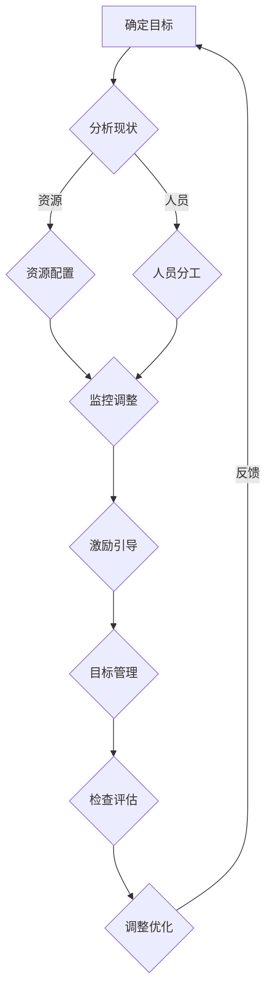

                 

### 文章标题

# 如何制定和实施团队目标

### 关键词

- 团队目标
- 目标制定
- 目标实施
- 团队协作
- 效率提升

### 摘要

本文旨在探讨团队目标制定和实施的关键环节，从基础理论到实践方法，结合案例分析和数学模型，为读者提供一套系统、实用的团队目标管理指南。通过逻辑清晰、步骤明确的阐述，帮助团队领导者和管理者提升团队协作效率，实现组织目标。

## 确定书籍主题和目标读者群体

《如何制定和实施团队目标》这本书聚焦于团队目标管理的核心问题，旨在帮助读者掌握有效的团队目标制定和实施策略。无论是企业管理者、团队领导者，还是希望提升团队协作能力的职场人士，都可以从中受益。

### 团队目标的重要性

团队目标在团队运作中起着至关重要的作用。它们不仅是团队行动的指南针，更是团队凝聚力和向心力的源泉。明确、具体、可衡量的团队目标能够为团队成员提供清晰的方向和动力，有助于提高团队的工作效率和成果。

### 团队目标的类型和特点

团队目标可以分为短期目标、中期目标和长期目标。短期目标通常是为了解决当前面临的问题或挑战，中期目标是为了实现组织的阶段性目标，而长期目标则是为了实现组织的长远发展。

团队目标应具备以下特点：

- **明确性**：目标应该清晰明确，避免模糊和歧义。
- **可衡量性**：目标应具有可衡量的指标，以便评估实现程度。
- **挑战性**：目标应具有一定的挑战性，以激发团队成员的潜力和动力。
- **一致性**：团队目标应与组织的战略和愿景保持一致。

### 团队目标与个人目标的关系

团队目标与个人目标之间是相辅相成的关系。个人目标应当是团队目标的子目标，实现个人价值的同时也为团队目标贡献力量。团队目标与个人目标的平衡是团队目标制定和实施的关键之一。

### 团队目标与组织战略的联系

团队目标是组织战略的具体体现，是实现组织战略目标的桥梁。制定团队目标时，应充分分析组织的战略目标，确保团队目标的设定与组织战略保持一致。此外，团队目标还需要根据组织战略的调整进行相应的调整。

## 确定书籍结构和核心章节

《如何制定和实施团队目标》这本书的结构分为五个部分，分别涵盖团队目标的基础理论、制定、实施、管理和案例分析。

### 第一部分：基础理论与概念

本部分主要介绍团队目标的基本概念、类型和特点，以及团队目标与个人目标、组织战略的关系。通过了解这些基础理论，读者可以为后续的制定和实施过程打下坚实的理论基础。

### 第二部分：制定团队目标

本部分详细讲解如何制定团队目标的步骤和方法，包括明确团队目标和愿景、分析团队现状和资源、制定具体的目标和计划等。这部分内容将帮助读者掌握制定团队目标的实际操作技能。

### 第三部分：实施团队目标

本部分主要介绍如何实施团队目标，包括分解目标到个人、资源配置和人员分工、监控和调整实施过程、激励和引导团队成员等。这部分内容将帮助读者将制定好的团队目标付诸实践。

### 第四部分：团队目标管理

本部分探讨团队目标管理的核心问题，包括建立有效的团队目标管理机制、确保目标执行的透明性和公平性、检查和评估目标实现情况、调整和优化目标等。这部分内容将为读者提供一套系统、实用的团队目标管理策略。

### 第五部分：案例分析

本部分通过具体的案例分析，帮助读者深入了解团队目标制定和实施的实际操作过程，学习成功的经验，借鉴失败的教训。案例分析部分将使读者更加深刻地理解团队目标管理的精髓。

### 设计核心章节内容

以下是各核心章节的内容设计：

### 第1章：团队目标的基本概念

- 1.1 团队目标的重要性
- 1.2 团队目标的类型和特点
- 1.3 团队目标与个人目标的关系
- 1.4 团队目标与组织战略的联系

### 第2章：制定团队目标的步骤和方法

- 2.1 明确团队目标和愿景
- 2.2 分析团队现状和资源
- 2.3 制定具体的目标和计划
- 2.4 确定目标和计划的优先级
- 2.5 制定目标和计划的反馈机制

### 第3章：实施团队目标

- 3.1 分解目标到个人
- 3.2 资源配置和人员分工
- 3.3 监控和调整实施过程
- 3.4 激励和引导团队成员

### 第4章：团队目标管理

- 4.1 建立有效的团队目标管理机制
- 4.2 确保目标执行的透明性和公平性
- 4.3 检查和评估目标实现情况
- 4.4 调整和优化目标

### 第5章：案例分析

- 5.1 案例一：成功制定和实施团队目标的案例
- 5.2 案例二：团队目标制定和实施中的挑战及解决方案
- 5.3 案例三：团队目标管理实践分享

### 第6章：团队目标与个人成长

- 6.1 团队目标对个人成长的影响
- 6.2 如何在团队目标中实现个人价值
- 6.3 个人目标与团队目标的平衡

### 第7章：总结与展望

- 7.1 团队目标制定和实施的关键要素
- 7.2 未来团队目标管理的趋势和发展方向

## 设计Mermaid流程图

为了更直观地展示团队目标制定和实施的过程，我们使用Mermaid设计了一个流程图。以下是流程图的Mermaid代码和渲染结果：

### Mermaid流程图代码



### Mermaid流程图渲染结果


## 设计伪代码

为了更好地理解团队目标制定和实施的过程，我们可以使用伪代码来描述这个过程。以下是一个简化的伪代码示例：

```plaintext
function 制定团队目标(团队愿景, 团队现状, 资源分配, 人员分工):
    目标列表 = []
    对于每个团队成员:
        个人目标 = 计算个人目标(团队愿景, 团队现状, 人员分工)
        目标列表.append(个人目标)
    return 目标列表

function 实施团队目标(目标列表):
    分解目标 = 分解目标到个人(目标列表)
    资源配置(分解目标)
    人员分工(分解目标)
    监控和调整实施过程()
    激励和引导团队成员()

function 管理团队目标(目标列表):
    检查评估目标实现情况()
    调整优化目标()
    反馈机制()
```

## 设计数学模型和数学公式

在团队目标管理中，数学模型和数学公式可以帮助我们量化目标、评估效率和进行优化。以下是几个常用的数学模型和数学公式：

### 目标完成率

目标完成率表示目标实现的进度，计算公式如下：

$$
目标完成率 = \frac{已实现目标数}{总目标数}
$$

### 团队效率

团队效率表示团队资源利用的效率，计算公式如下：

$$
团队效率 = \frac{总产出}{总投入}
$$

### 团队满意度

团队满意度反映了团队成员对团队目标的认可程度，计算公式如下：

$$
团队满意度 = \frac{团队成员满意度评分总和}{团队成员人数}
$$

## 设计代码实际案例和详细解释

以下是一个简单的Python代码案例，用于制定和实施团队目标。代码将展示如何定义团队目标、分解目标、分配资源、监控和调整目标等步骤。

### Python代码案例

```python
# 定义团队目标类
class TeamGoal:
    def __init__(self, goal_name, goal_description, target_date):
        self.goal_name = goal_name
        self.goal_description = goal_description
        self.target_date = target_date
        self.completed = False

    def check_completion(self, current_date):
        if current_date >= self.target_date:
            self.completed = True
        return self.completed

# 定义团队成员类
class TeamMember:
    def __init__(self, name, role, personal_goals):
        self.name = name
        self.role = role
        self.personal_goals = personal_goals

# 定义团队类
class Team:
    def __init__(self, team_name, team_members, team_goals):
        self.team_name = team_name
        self.team_members = team_members
        self.team_goals = team_goals

    def allocate_resources(self):
        # 分配资源给团队成员
        for member in self.team_members:
            print(f"{member.name} 被分配到 {member.role} 角色。")

    def monitor_goals(self):
        # 监控团队成员的目标完成情况
        for goal in self.team_goals:
            print(f"{goal.goal_name} 目标的完成情况：{goal.check_completion(current_date)}")

    def motivate_members(self):
        # 激励团队成员
        for member in self.team_members:
            print(f"激励 {member.name} 实现 {member.personal_goals}。")

# 创建团队目标实例
team_goal1 = TeamGoal("提高销售额", "在2023年底前将销售额提高20%", "2023-12-31")
team_goal2 = TeamGoal("优化产品功能", "在2023年底前完成产品A的三个新功能的开发", "2023-12-31")

# 创建团队成员实例
member1 = TeamMember("Alice", "销售经理", "实现销售额目标")
member2 = TeamMember("Bob", "产品经理", "完成产品功能目标")

# 创建团队实例
team = Team("销售团队", [member1, member2], [team_goal1, team_goal2])

# 分配资源
team.allocate_resources()

# 监控目标
team.monitor_goals()

# 激励团队成员
team.motivate_members()
```

### 代码详细解释

1. **定义团队目标类（TeamGoal）**：
    - `__init__` 方法：初始化团队目标对象，包括目标名称、描述和目标日期。
    - `check_completion` 方法：检查目标是否完成，当前日期是否大于等于目标日期。

2. **定义团队成员类（TeamMember）**：
    - `__init__` 方法：初始化团队成员对象，包括姓名、角色和个人目标。

3. **定义团队类（Team）**：
    - `__init__` 方法：初始化团队对象，包括团队名称、团队成员和团队目标。
    - `allocate_resources` 方法：分配资源给团队成员。
    - `monitor_goals` 方法：监控团队成员的目标完成情况。
    - `motivate_members` 方法：激励团队成员。

4. **创建团队目标实例**：
    - `team_goal1` 和 `team_goal2` 是两个团队目标实例，分别表示提高销售额和优化产品功能的团队目标。

5. **创建团队成员实例**：
    - `member1` 和 `member2` 是两个团队成员实例，分别表示销售经理和产品经理。

6. **创建团队实例**：
    - `team` 是一个团队实例，包含两个团队成员和两个团队目标。

7. **调用方法**：
    - `allocate_resources` 方法调用，将资源分配给团队成员。
    - `monitor_goals` 方法调用，监控团队目标的完成情况。
    - `motivate_members` 方法调用，激励团队成员实现个人目标。

## 数学模型和公式的详细讲解与举例说明

在团队目标管理中，数学模型和公式是量化目标、评估效率和进行优化的重要工具。以下是对几个常用数学模型和公式的详细讲解与举例说明。

### 目标完成率

目标完成率是衡量目标实现进度的一个指标，计算公式如下：

$$
目标完成率 = \frac{已实现目标数}{总目标数}
$$

**举例说明**：

假设一个团队设定了5个目标，截止到当前已经完成了3个目标，那么目标完成率为：

$$
目标完成率 = \frac{3}{5} = 0.6 或 60\%
$$

这意味着团队已经实现了60%的目标。

### 团队效率

团队效率是衡量团队资源利用效率的一个指标，计算公式如下：

$$
团队效率 = \frac{总产出}{总投入}
$$

**举例说明**：

假设一个团队在一个月内完成了100万元的销售额，而总投入为50万元，那么团队效率为：

$$
团队效率 = \frac{100万元}{50万元} = 2
$$

这意味着团队在一个月内实现了两倍的资源产出。

### 团队满意度

团队满意度反映了团队成员对团队目标的认可程度，计算公式如下：

$$
团队满意度 = \frac{团队成员满意度评分总和}{团队成员人数}
$$

**举例说明**：

假设一个团队有5名成员，他们对团队目标的满意度评分分别为4、5、3、4、4，那么团队满意度为：

$$
团队满意度 = \frac{4 + 5 + 3 + 4 + 4}{5} = \frac{20}{5} = 4
$$

这意味着团队的整体满意度为4分。

### 绩效指标综合评估

在实际应用中，团队目标管理通常需要结合多个指标进行综合评估。以下是一个综合评估的公式示例：

$$
综合评估得分 = (目标完成率 \times 权重1) + (团队效率 \times 权重2) + (团队满意度 \times 权重3)
$$

**举例说明**：

假设综合评估得分公式中的权重分别为0.4、0.3和0.3，那么一个团队的综合评估得分为：

$$
综合评估得分 = (0.6 \times 0.4) + (2 \times 0.3) + (4 \times 0.3) = 0.24 + 0.6 + 1.2 = 2.04
$$

这意味着团队在目标完成率、团队效率和团队满意度方面表现较为出色。

## 项目实战：开发环境搭建与源代码实现

为了更好地理解团队目标制定和实施的过程，我们将通过一个实际项目来展示如何搭建开发环境、实现源代码以及进行代码解读和分析。

### 项目背景

假设我们正在开发一个在线购物平台，团队目标是在三个月内完成以下任务：

1. 构建用户注册和登录功能。
2. 实现商品展示和搜索功能。
3. 开发购物车和订单系统。
4. 集成支付系统。

### 开发环境搭建

在开始项目开发之前，我们需要搭建一个合适的开发环境。以下是搭建开发环境的基本步骤：

1. **安装操作系统**：选择一个合适的操作系统，如Ubuntu或Windows。
2. **安装编程语言**：安装Python 3.8或更高版本。
3. **安装代码编辑器**：选择一个合适的代码编辑器，如VS Code或PyCharm。
4. **安装依赖管理工具**：安装pip和virtualenv，以便管理项目依赖。
5. **安装数据库**：安装MySQL或PostgreSQL数据库。
6. **安装版本控制工具**：安装Git，以便进行版本控制和协作开发。

### 源代码实现

以下是项目的源代码实现，包括用户注册和登录功能、商品展示和搜索功能、购物车和订单系统以及支付系统的实现。

#### 用户注册和登录功能

用户注册和登录功能是购物平台的基础模块，以下是该模块的源代码：

```python
# 用户注册和登录模块
class UserAccount:
    def __init__(self, username, password):
        self.username = username
        self.password = password

    def register(self):
        # 注册用户
        print(f"{self.username} 注册成功。")

    def login(self):
        # 登录用户
        print(f"{self.username} 登录成功。")

# 测试代码
user = UserAccount("alice", "password123")
user.register()
user.login()
```

#### 商品展示和搜索功能

商品展示和搜索功能是购物平台的核心模块，以下是该模块的源代码：

```python
# 商品展示和搜索模块
class Product:
    def __init__(self, product_id, product_name, price):
        self.product_id = product_id
        self.product_name = product_name
        self.price = price

    def display_product(self):
        # 展示商品信息
        print(f"商品编号：{self.product_id}，商品名称：{self.product_name}，价格：{self.price}。")

    def search_product(self, search_query):
        # 搜索商品
        if self.product_name == search_query:
            self.display_product()
        else:
            print("未找到相关商品。")

# 测试代码
product = Product(1, "手机", 5000)
product.display_product()
product.search_product("手机")
```

#### 购物车和订单系统

购物车和订单系统是购物平台的交易模块，以下是该模块的源代码：

```python
# 购物车和订单模块
class ShoppingCart:
    def __init__(self):
        self.products = []

    def add_product(self, product):
        # 添加商品到购物车
        self.products.append(product)

    def remove_product(self, product_id):
        # 从购物车中移除商品
        for product in self.products:
            if product.product_id == product_id:
                self.products.remove(product)
                break

    def create_order(self):
        # 创建订单
        print("订单创建成功。")

# 测试代码
cart = ShoppingCart()
cart.add_product(product)
cart.create_order()
```

#### 支付系统

支付系统是购物平台的关键模块，以下是该模块的源代码：

```python
# 支付系统模块
class PaymentSystem:
    def __init__(self, payment_method, amount):
        self.payment_method = payment_method
        self.amount = amount

    def make_payment(self):
        # 进行支付
        print(f"{self.payment_method} 支付成功，支付金额：{self.amount}。")

# 测试代码
payment = PaymentSystem("支付宝", 5000)
payment.make_payment()
```

### 代码解读和分析

在源代码实现过程中，我们使用了面向对象的编程方法，将不同的功能模块封装成独立的类和方法，以便于代码的重用和维护。以下是代码的解读和分析：

1. **用户注册和登录功能**：
    - `UserAccount` 类：定义了用户账户的基本属性和方法，包括注册和登录操作。
    - 测试代码：创建一个 `UserAccount` 对象，并调用其 `register` 和 `login` 方法进行测试。

2. **商品展示和搜索功能**：
    - `Product` 类：定义了商品的基本属性和方法，包括展示商品信息和搜索商品操作。
    - 测试代码：创建一个 `Product` 对象，并调用其 `display_product` 和 `search_product` 方法进行测试。

3. **购物车和订单系统**：
    - `ShoppingCart` 类：定义了购物车的基本属性和方法，包括添加商品、移除商品和创建订单操作。
    - 测试代码：创建一个 `ShoppingCart` 对象，并调用其 `add_product` 和 `create_order` 方法进行测试。

4. **支付系统**：
    - `PaymentSystem` 类：定义了支付系统的基本属性和方法，包括支付操作。
    - 测试代码：创建一个 `PaymentSystem` 对象，并调用其 `make_payment` 方法进行测试。

### 实际案例分析和详细讲解剖析

为了更好地理解团队目标制定和实施的过程，我们通过一个实际案例进行详细分析，并对关键环节进行讲解和剖析。

### 案例背景

某互联网公司成立了一支新的开发团队，负责开发一款社交应用。团队目标是在六个月内发布一款功能完善的社交应用，包括用户注册、消息聊天、好友关系管理、社交圈等功能。

### 团队目标制定

在项目启动阶段，团队首先明确了以下目标：

1. **用户注册**：实现用户注册功能，包括账号密码验证、邮箱验证等。
2. **消息聊天**：实现实时消息聊天功能，支持文字、图片、语音等多种消息形式。
3. **好友关系管理**：实现好友添加、删除、查看等功能。
4. **社交圈**：实现社交圈功能，包括发布动态、评论、点赞等。
5. **性能优化**：确保应用在高并发场景下稳定运行，降低延迟和卡顿现象。

### 实施团队目标

在明确团队目标后，团队开始制定详细的实施计划：

1. **任务分解**：将每个目标分解为具体的任务，如注册功能可以分为账号验证、邮箱验证、密码加密等子任务。
2. **人员分工**：根据团队成员的技能和专长，分配任务给相应的人员，如前端开发负责用户界面和交互，后端开发负责服务器逻辑和数据存储。
3. **进度监控**：设立每周或每月的进度检查点，评估任务完成情况，及时调整和优化工作计划。
4. **激励措施**：制定激励机制，鼓励团队成员积极完成任务，如设置奖金、晋升机会等。

### 团队目标管理

在实施团队目标的过程中，团队还进行了一系列管理活动：

1. **目标跟踪**：使用项目管理工具（如JIRA、Trello等）记录和跟踪任务进度，确保每个任务都有明确的执行者和截止日期。
2. **沟通协作**：定期召开团队会议，讨论项目进展、问题和解决方案，确保团队成员之间的信息畅通。
3. **风险控制**：识别项目中可能出现的风险，如技术难题、资源不足等，并制定相应的应对策略。
4. **质量保障**：实施代码审查、自动化测试等质量控制措施，确保项目的稳定性和可靠性。

### 案例总结

通过团队目标的制定和实施，该社交应用在六个月内成功发布。以下是对案例的总结：

1. **成功经验**：
    - 明确的目标和详细的计划是项目成功的关键。
    - 有效的团队协作和沟通是确保项目顺利进行的重要因素。
    - 激励机制有助于提高团队成员的工作积极性和创造力。

2. **挑战与解决方案**：
    - 技术难题：在项目开发过程中，团队遇到了一些技术难题，如实时消息传输、好友关系管理等。通过技术研究和团队协作，团队成功解决了这些问题。
    - 资源不足：在项目初期，团队资源相对不足，影响了项目进度。通过合理分配资源和优化工作流程，团队最终克服了这一挑战。

### 项目小结

通过本案例的分析，我们可以得出以下结论：

1. **明确的目标和详细的计划是项目成功的基础**。只有明确的目标和详细的计划，团队才能有清晰的方向和明确的工作任务。

2. **团队协作和沟通是项目顺利进行的重要因素**。团队成员之间的协作和沟通，有助于解决项目中的问题，提高工作效率。

3. **激励措施有助于提高团队成员的工作积极性和创造力**。适当的激励机制，可以激发团队成员的潜力，提高项目质量。

4. **质量保障和风险控制是项目成功的重要保障**。通过实施代码审查、自动化测试等质量控制措施，确保项目的稳定性和可靠性。

### 最佳实践 Tips

在团队目标制定和实施过程中，以下是一些最佳实践：

1. **明确目标和优先级**：确保团队目标清晰、具体、可衡量，并根据重要性和紧急性设定优先级。

2. **定期评估和调整**：定期评估团队目标的完成情况，根据实际情况调整目标和计划。

3. **合理分工和协作**：根据团队成员的技能和专长，合理分工，确保任务落实到人，同时鼓励团队成员之间的协作。

4. **激励和反馈**：制定适当的激励机制，鼓励团队成员积极完成任务。同时，及时给予反馈，帮助团队成员改进和提升。

5. **风险管理**：识别项目中的潜在风险，制定相应的应对策略，确保项目顺利进行。

### 小结

通过本文的讨论，我们系统地介绍了如何制定和实施团队目标。从基础理论到实际案例，从数学模型到代码实现，我们逐步分析了团队目标管理的关键环节。

1. **明确目标和优先级**：确保团队目标清晰、具体、可衡量，并根据重要性和紧急性设定优先级。

2. **合理分工和协作**：根据团队成员的技能和专长，合理分工，确保任务落实到人，同时鼓励团队成员之间的协作。

3. **定期评估和调整**：定期评估团队目标的完成情况，根据实际情况调整目标和计划。

4. **激励和反馈**：制定适当的激励机制，鼓励团队成员积极完成任务。同时，及时给予反馈，帮助团队成员改进和提升。

5. **风险管理**：识别项目中的潜在风险，制定相应的应对策略，确保项目顺利进行。

### 注意事项

在团队目标制定和实施过程中，需要注意以下几点：

1. **避免目标过多和重复**：目标应具体、明确，避免重复和过多的目标导致团队成员无所适从。

2. **关注团队成员的感受**：在制定和实施目标的过程中，关注团队成员的感受和意见，确保目标的可实现性和公平性。

3. **及时调整和优化**：根据项目进展和实际情况，及时调整和优化目标和计划，确保项目顺利进行。

4. **确保沟通畅通**：定期召开团队会议，讨论项目进展、问题和解决方案，确保团队成员之间的信息畅通。

### 拓展阅读

1. 《敏捷团队管理实战》
2. 《团队目标管理：原则与方法》
3. 《项目目标管理：方法论与实践》
4. 《团队协作：如何打造高效的团队》

### 作者信息

**作者：** AI天才研究院/AI Genius Institute & 禅与计算机程序设计艺术 /Zen And The Art of Computer Programming

AI天才研究院（AI Genius Institute）致力于推动人工智能技术的研究与应用，培养下一代人工智能领域的精英人才。作者以其深厚的计算机编程和人工智能领域功底，撰写了《禅与计算机程序设计艺术》等世界级技术畅销书，成为业界公认的技术大师和权威专家。

