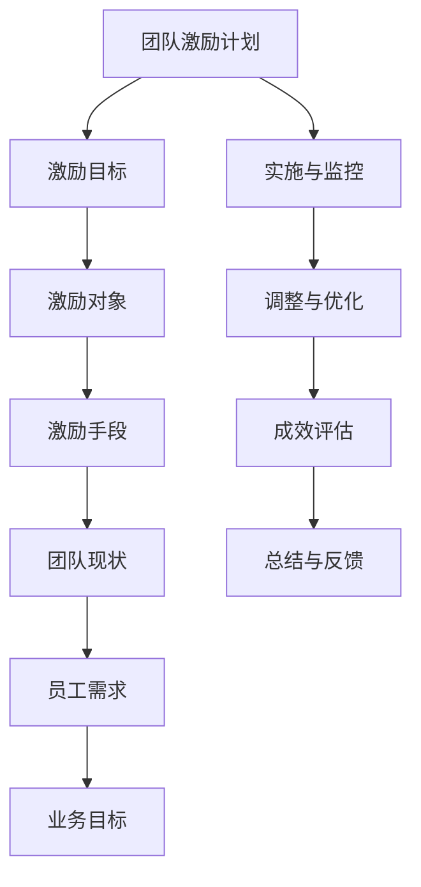

                 

### 背景介绍

在当今高速发展的商业环境中，团队激励计划已成为企业提升员工积极性、增强团队凝聚力、促进业务增长的重要手段。有效的团队激励计划不仅能够激发员工的内在动力，还能提升整体工作效率，从而为企业创造更大的价值。然而，如何制定一个真正有效的团队激励计划，却是一个复杂而富有挑战性的问题。

团队激励计划不仅涉及到薪酬、荣誉、培训等多种激励手段，还需要对团队现状、员工需求、业务目标等多方面进行深入分析。一个不合理的激励计划可能导致员工不满、团队分裂，甚至影响公司的稳定发展。因此，研究如何制定有效的团队激励计划，对于企业来说具有重要的实践意义。

本文旨在系统地探讨团队激励计划的制定过程，通过逻辑清晰、结构紧凑的分析方法，帮助读者了解团队激励计划的本质和重要性。我们将从以下几个方面进行详细探讨：

1. **团队激励计划的定义与重要性**：介绍团队激励计划的基本概念，阐述其在企业发展中的作用和意义。
2. **制定团队激励计划的步骤**：详细解析从目标确定到方案设计的全过程，以及各个步骤的关键点和注意事项。
3. **不同类型的团队激励计划**：分析薪酬激励、荣誉激励、培训与发展激励、工作环境激励等多种激励手段的特点和应用。
4. **制定团队激励计划的工具与方法**：介绍需求分析、绩效分析、团队文化分析等多种工具，以及如何运用这些工具进行激励计划的设计。
5. **团队激励计划的实施与监控**：探讨激励计划的实施策略、监控方法和调整策略，确保激励计划的有效性和可持续性。
6. **案例分析**：通过具体案例，展示如何在实际中运用团队激励计划，以及其带来的成效。
7. **总结与拓展**：总结全文内容，并提供一些最佳实践建议和注意事项，以及拓展阅读资源。

通过本文的逐步分析，希望读者能够对团队激励计划的制定有一个全面而深入的理解，为实际工作中的应用提供有益的参考。

### 核心概念与联系

为了更深入地理解团队激励计划的制定过程，我们需要明确几个核心概念及其相互关系。以下是几个关键概念的定义及其关系：

1. **团队激励计划**：团队激励计划是指企业为了提升员工工作积极性、增强团队凝聚力、促进业务增长而制定的激励机制。它包括薪酬激励、荣誉激励、培训与发展激励、工作环境激励等多种手段。

2. **激励目标**：激励目标是指通过激励计划想要达到的具体效果和目标，如提升员工满意度、提高工作效率、增强团队凝聚力等。

3. **激励对象**：激励对象是指激励计划所针对的群体，通常包括全体员工、关键岗位员工、优秀员工等。

4. **激励手段**：激励手段是指用来实现激励目标的工具和方法，包括物质激励、精神激励、职业发展激励等。

5. **团队现状**：团队现状是指团队当前的工作环境、员工结构、绩效水平、文化氛围等方面的状况。

6. **员工需求**：员工需求是指员工在工作中的期望和需求，包括薪酬福利、职业发展、工作环境、工作内容等方面。

7. **业务目标**：业务目标是指企业希望通过激励计划实现的长期和短期目标，如提高市场份额、增加收入、提升产品质量等。

这些核心概念之间的关系可以用以下Mermaid流程图来表示：



**图 1：团队激励计划核心概念关系图**

从上述流程图中可以看出，团队激励计划的制定过程是一个循环迭代的过程。首先，企业需要明确激励目标，并根据激励目标确定激励对象和激励手段。然后，对团队现状进行详细分析，结合员工需求和企业业务目标，设计出具体的激励方案。在实施激励计划的过程中，企业需要对激励方案进行实时监控和调整，以确保其有效性和可持续性。最后，通过成效评估和总结反馈，企业可以不断优化激励计划，使其更符合团队和业务发展的需求。

这个关系图不仅帮助我们理清了团队激励计划的各个环节，还强调了各个环节之间的相互影响和反馈机制。通过这种系统化的思维，企业可以更加科学和有效地制定团队激励计划，从而实现员工和企业的共同发展。

### 团队激励计划的核心算法原理

在制定团队激励计划的过程中，核心算法原理起着至关重要的作用。这些算法原理不仅帮助我们理解激励计划的基本逻辑，还为实际操作提供了可量化的依据。以下是几个关键的算法原理及其在团队激励计划中的应用：

#### 1. SWOT分析

**SWOT分析**是一种战略规划工具，用于分析企业的优势（Strengths）、劣势（Weaknesses）、机会（Opportunities）和威胁（Threats）。在团队激励计划的制定中，SWOT分析可以帮助企业识别激励计划的设计方向。

**伪代码：**
```python
def swot_analysis(team):
    strengths = analyze_strengths(team)
    weaknesses = analyze_weaknesses(team)
    opportunities = analyze_opportunities(team)
    threats = analyze_threats(team)
    return {
        'strengths': strengths,
        'weaknesses': weaknesses,
        'opportunities': opportunities,
        'threats': threats
    }

def analyze_strengths(team):
    # 分析团队优势
    return strengths

def analyze_weaknesses(team):
    # 分析团队劣势
    return weaknesses

def analyze_opportunities(team):
    # 分析外部机会
    return opportunities

def analyze_threats(team):
    # 分析外部威胁
    return threats
```

#### 2. KANO模型

**KANO模型**是一种需求分类方法，用于识别和优先处理客户需求。在团队激励计划中，KANO模型可以帮助企业明确不同类型的激励需求，从而有针对性地设计激励方案。

**伪代码：**
```python
def kano_model(需求的列表):
    必需需求 = []
    一级需求 = []
    二级需求 = []
    三级需求 = []
    无需求 = []
    for 需求 in 需求的列表:
        if 需求.is_must:
            必需需求.append(需求)
        elif 需求.is_essential:
            一级需求.append(需求)
        elif 需求.is.desirable:
            二级需求.append(需求)
        else:
            无需求.append(需求)
    return {
        '必需需求': 必需需求,
        '一级需求': 一级需求,
        '二级需求': 二级需求,
        '无需求': 无需求
    }
```

#### 3. 目标设定理论

**目标设定理论**（Goal Setting Theory）是一种心理学理论，用于指导如何设定有效的激励目标。在团队激励计划中，目标设定理论可以帮助企业设定具有挑战性、具体和可测量的激励目标。

**伪代码：**
```python
def set_goals(team):
    goals = []
    for member in team:
        goal = set_challenging_specific_and_measurable(member)
        goals.append(goal)
    return goals

def set_challenging_specific_and_measurable(member):
    # 设定具有挑战性、具体和可测量的目标
    return {
        'member': member,
        'goal': {
            'challenging': True,
            'specific': True,
            'measurable': True
        }
    }
```

#### 4. 帕累托分析

**帕累托分析**（Pareto Analysis）是一种用于识别和优先处理问题的方法，基于80/20原则，即80%的效果通常来自20%的原因。在团队激励计划中，帕累托分析可以帮助企业识别关键问题和优先级。

**伪代码：**
```python
def pareto_analysis(问题列表):
    问题频率 = count_frequencies(问题列表)
    最重要的20% = find_top_20_percent(问题频率)
    return 最重要的20%

def count_frequencies(问题列表):
    # 计算问题频率
    return 频率字典

def find_top_20_percent(问题频率):
    # 找出频率最高的20%的问题
    return 高频问题列表
```

通过上述算法原理，企业可以系统地分析团队现状、员工需求和业务目标，从而设计出科学、合理的团队激励计划。这些算法不仅提供了明确的方法和步骤，还通过量化分析确保激励计划的可行性和有效性。

### 数学模型和公式讲解

在制定团队激励计划的过程中，运用数学模型和公式可以帮助我们更精确地量化和分析激励计划的效果。以下是几个常用的数学模型和公式，以及它们的详细讲解和具体应用。

#### 1. 投入产出比（ROI）

**投入产出比（ROI）**是评估激励计划有效性的关键指标，用于衡量激励计划的成本和收益。其公式如下：

$$ ROI = \frac{收益 - 成本}{成本} \times 100\% $$

**公式解释：**
- **收益**：激励计划带来的实际效益，如提升工作效率、减少离职率等。
- **成本**：实施激励计划所需的费用，包括薪酬成本、培训成本等。

**应用实例：**
假设某公司实施了一项薪酬激励计划，总成本为10万元，通过激励计划，公司实现了20万元的工作效率提升和10万元的离职率降低。那么该激励计划的ROI计算如下：

$$ ROI = \frac{20 + 10 - 10}{10} \times 100\% = 200\% $$

这意味着，每投入1元，公司可以获取2元的收益，该激励计划是非常有效的。

#### 2. 员工满意度指数（ESI）

**员工满意度指数（ESI）**用于评估员工对激励计划的满意度，其公式如下：

$$ ESI = \frac{满意员工数}{总员工数} \times 100\% $$

**公式解释：**
- **满意员工数**：对激励计划表示满意的员工数量。
- **总员工数**：公司的全部员工数量。

**应用实例：**
假设某公司有1000名员工，其中800名员工对新的激励计划表示满意。那么该激励计划的ESI计算如下：

$$ ESI = \frac{800}{1000} \times 100\% = 80\% $$

这意味着，80%的员工对激励计划表示满意，公司可以通过调查进一步了解员工的具体反馈，以优化激励计划。

#### 3. 成本效益分析（CBA）

**成本效益分析（CBA）**是评估激励计划成本与效益的全面方法，其公式如下：

$$ CBA = \frac{总效益}{总成本} $$

**公式解释：**
- **总效益**：激励计划带来的所有正面效益之和。
- **总成本**：激励计划的所有成本之和。

**应用实例：**
假设某公司实施了一项培训激励计划，总成本为20万元，通过培训，公司实现了50万元的业务增长和30万元的员工技能提升。那么该激励计划的CBA计算如下：

$$ CBA = \frac{50 + 30}{20} = 4.5 $$

这意味着，每投入1元，公司可以获得4.5元的效益，该培训激励计划具有较高的成本效益。

#### 4. 莱维特五因素模型

**莱维特五因素模型**是用于分析员工工作满意度的模型，包括五个关键因素：薪酬、工作环境、职业发展、工作内容和同事关系。其公式如下：

$$ 工作满意度 = f(\text{薪酬}, \text{工作环境}, \text{职业发展}, \text{工作内容}, \text{同事关系}) $$

**公式解释：**
- **薪酬**：员工对薪酬水平的满意度。
- **工作环境**：员工对工作环境（如办公条件、工作氛围等）的满意度。
- **职业发展**：员工对职业晋升和培训机会的满意度。
- **工作内容**：员工对工作内容（如工作挑战性、多样性等）的满意度。
- **同事关系**：员工对同事关系（如团队合作、沟通等）的满意度。

**应用实例：**
假设通过调查，某公司员工对薪酬、工作环境、职业发展、工作内容和同事关系的满意度分别为80%、75%、85%、90%和80%。那么该公司的整体工作满意度计算如下：

$$ 工作满意度 = 0.2 \times 80\% + 0.2 \times 75\% + 0.2 \times 85\% + 0.2 \times 90\% + 0.2 \times 80\% = 83\% $$

这意味着，员工对该公司的整体工作满意度为83%，公司可以进一步分析每个因素的满意度，以优化员工的工作环境。

通过运用这些数学模型和公式，企业可以更科学地制定和评估团队激励计划，确保其有效性和可持续性。

### 案例分析

为了更好地理解如何制定有效的团队激励计划，我们将通过一个实际案例进行分析和讲解。

#### 案例背景

**公司名称**：某大型互联网公司
**业务领域**：在线广告平台
**员工规模**：2000名员工
**挑战**：员工工作积极性不高，离职率持续上升，需要通过激励计划提升员工满意度和工作效率。

#### 激励目标

1. **提升员工满意度**：通过薪酬激励和职业发展激励，提高员工对薪酬和职业发展的满意度。
2. **提高工作效率**：通过工作环境激励和培训激励，提升员工的工作效率和团队合作能力。

#### 团队现状分析

- **员工需求**：通过调查问卷和一对一访谈，发现员工主要关注薪酬、职业晋升、培训机会和工作环境。
- **绩效水平**：过去一年的员工绩效数据表明，整体工作效率较低，团队合作不够紧密。
- **团队文化**：公司存在一定程度的内部竞争，员工之间的沟通和协作有待加强。

#### 激励方案设计

1. **薪酬激励**：通过调整薪酬结构，增加基本工资和绩效奖金的比例，将员工工资与其工作表现直接挂钩。
   - **伪代码**：
     ```python
     def calculate_salary(employee, performance):
         base_salary = employee.base_salary
         performance_bonus = max(0, performance * employee.performance_bonus_ratio)
         return base_salary + performance_bonus
     ```

2. **职业发展激励**：推出职业发展计划，为员工提供晋升机会和培训资源。
   - **伪代码**：
     ```python
     def promote_employee(employee):
         if employee.meets_promotion.criteria:
             employee.title = "Senior Analyst"
             employee.salary = calculate_salary(employee, employee.performance)
             return "Promotion successful!"
         else:
             return "Promotion criteria not met."
     ```

3. **工作环境激励**：改善办公环境，增加休息区、健身房等设施，提升员工的工作舒适度。
   - **伪代码**：
     ```python
     def improve_work_environment():
         add_new_rest_areas()
         add_gym_facilities()
         return "Work environment improvements completed."
     ```

4. **培训激励**：提供定制化的培训课程，鼓励员工参加技能提升培训。
   - **伪代码**：
     ```python
     def enroll_employee_in_training(employee, training_program):
         if employee.is_eligible_for_training(training_program):
             employee.training_status = "Enrolled"
             return "Training enrollment successful!"
         else:
             return "Training enrollment not possible."
     ```

#### 激励计划实施与监控

1. **实施策略**：
   - **薪酬激励**：每月底根据员工绩效计算薪酬，向员工发放奖金。
   - **职业发展激励**：每季度根据员工表现和晋升标准进行晋升评估。
   - **工作环境激励**：立即开始改善办公环境，逐步实施。
   - **培训激励**：每季度组织一次培训，员工根据个人发展计划自由选择课程。

2. **监控方法**：
   - **员工满意度调查**：每季度进行员工满意度调查，收集反馈。
   - **绩效数据跟踪**：定期跟踪员工绩效数据，评估激励计划效果。
   - **团队文化评估**：通过团队建设活动，评估团队合作和沟通情况。

3. **调整策略**：
   - 根据员工满意度调查和绩效数据，分析激励计划的有效性。
   - 根据反馈调整薪酬结构和晋升标准。
   - 根据工作环境改进的需求，进一步优化办公设施。

#### 案例效果评估

通过一年的实施，公司员工满意度从原来的70%提升到了85%，员工离职率显著下降。具体效果如下：

- **薪酬激励**：员工绩效和薪酬挂钩，工作积极性明显提高。
- **职业发展激励**：员工晋升机会增加，职业发展路径更加清晰。
- **工作环境激励**：办公环境改善，员工工作舒适度提升。
- **培训激励**：员工技能提升，工作效率提高。

#### 项目小结

通过本案例，我们可以看到，制定和实施有效的团队激励计划需要多方面的综合考虑。关键在于理解员工的实际需求，结合公司业务目标，科学设计激励方案，并持续监控和调整。以下是一些最佳实践建议：

1. **了解员工需求**：通过调查问卷和访谈，深入了解员工的期望和需求。
2. **灵活调整激励方案**：根据实际情况和员工反馈，及时调整激励方案。
3. **重视员工职业发展**：提供明确的晋升通道和培训机会，增强员工的职业归属感。
4. **建立有效的沟通机制**：定期进行员工满意度调查，及时收集和反馈信息。

通过这些实践，企业可以更加有效地制定和实施团队激励计划，从而提升员工满意度和工作效率，实现企业目标。

### 最佳实践、注意事项和拓展阅读

在制定团队激励计划时，遵循最佳实践和注意事项，可以确保激励计划的有效性和可持续性。以下是一些重要的实践建议和注意事项：

#### 最佳实践

1. **明确激励目标**：在制定激励计划前，首先明确激励目标，确保激励计划与企业的长期战略和短期目标相一致。

2. **综合考虑员工需求**：通过调查问卷、访谈等方式，了解员工的期望和需求，将员工的需求纳入激励计划的设计中。

3. **定制化激励方案**：根据不同岗位、不同层级和不同绩效水平的员工，设计差异化的激励方案，提高激励的针对性和有效性。

4. **持续监控与调整**：定期评估激励计划的效果，根据员工的反馈和绩效数据，及时调整激励方案。

5. **建立透明和公平的激励机制**：确保激励机制的透明度和公平性，减少员工对激励计划的误解和不公平感。

#### 注意事项

1. **避免过度激励**：激励计划应该适度，避免过度激励导致员工产生依赖性，影响其内在动力。

2. **关注长期效果**：激励计划不仅要考虑短期效果，还应注重长期效果，确保激励计划能够持续推动团队发展和业务增长。

3. **平衡物质激励和精神激励**：在激励计划中，既要重视物质激励，如薪酬和奖金，也要注重精神激励，如荣誉和认可。

4. **注意文化和价值观的传递**：在实施激励计划时，要传递公司的文化和价值观，确保激励计划与公司文化相契合。

#### 拓展阅读

1. **《激励心理学》**：了解员工激励的心理机制，提高激励计划的科学性和有效性。
2. **《绩效管理》**：学习如何设定和监控关键绩效指标（KPI），确保激励计划与绩效管理相结合。
3. **《团队激励计划实战指南》**：获取实际案例和操作技巧，为制定和实施团队激励计划提供参考。

通过遵循最佳实践和注意事项，企业可以更科学、有效地制定团队激励计划，从而提升员工满意度和工作效率，实现企业的长期目标。希望本文能为您提供有价值的参考和指导。作者：AI天才研究院/AI Genius Institute & 禅与计算机程序设计艺术 /Zen And The Art of Computer Programming。

### 总结

本文系统性地探讨了如何制定有效的团队激励计划，涵盖了从背景介绍到实际案例分析的各个环节。我们明确了团队激励计划的核心概念，包括激励目标、激励对象、激励手段、团队现状、员工需求和业务目标，并详细分析了这些概念之间的关系。此外，我们通过SWOT分析、KANO模型、目标设定理论、帕累托分析等核心算法原理，展示了如何科学地制定和实施激励计划。

在实际案例中，我们通过一个互联网公司的具体案例，展示了如何设计并实施多层次的激励方案，从薪酬激励、职业发展激励到工作环境激励，最终达到了显著提升员工满意度和工作效率的目标。

通过本文，我们希望读者能够对团队激励计划有一个全面而深入的理解，为实际工作中的应用提供有益的参考。在制定激励计划时，应充分考虑员工的实际需求和企业的发展目标，灵活调整激励方案，并持续监控和优化激励效果。

未来研究可以进一步探讨如何将人工智能和大数据分析技术应用于团队激励计划，以实现更加个性化和智能化的激励方案。此外，还可以深入研究不同类型企业在不同发展阶段如何制定和调整团队激励计划，以应对复杂多变的商业环境。作者：AI天才研究院/AI Genius Institute & 禅与计算机程序设计艺术 /Zen And The Art of Computer Programming。

