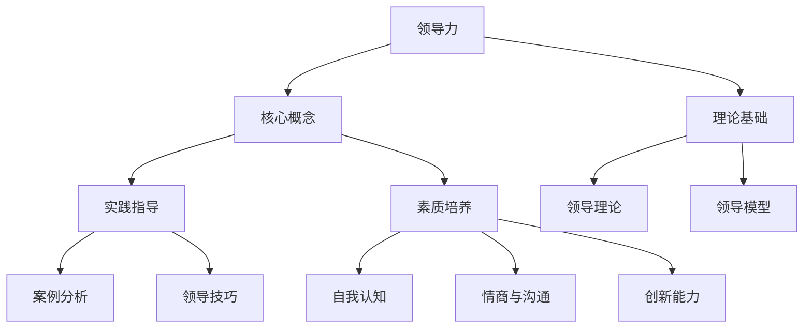

                 

### 文章标题

在科技飞速发展的今天，领导者不仅需要具备深厚的专业知识，还需要具备卓越的领导能力和创新思维。因此，《如何培养下一代领导者》这一主题显得尤为重要。本文将围绕这个主题，通过系统的分析和深入的探讨，为您提供一份全面且实用的指导手册。

### 文章关键词

- 下一代领导者
- 领导力
- 培养策略
- 创新思维
- 领导能力

### 文章摘要

本文旨在探讨如何培养下一代领导者，以应对未来社会和科技环境的挑战。文章首先介绍了领导力的核心概念和理论基础，然后通过实践指导和素质培养，为读者提供具体可行的培养策略。此外，文章还分析了领导者成长的环境和社会文化影响，并对未来领导力的趋势进行了展望。通过这些内容，读者将能够全面了解培养下一代领导者的必要性和方法。

## 设计思路

设计《如何培养下一代领导者》的目录大纲，我们需要从以下几个方面入手：

1. **引言部分**：介绍书籍的主题，明确培养下一代领导者的目的和意义。
   
2. **理论基础**：阐述领导力的核心概念，介绍领导力的理论和模型，帮助读者建立领导力的基础理论框架。

3. **实践指导**：通过案例分析、实战技巧和策略，为读者提供实际操作指南，帮助读者将领导力理论应用到实践中。

4. **素质培养**：探讨领导者应具备的素质和能力，提供培养这些素质的方法和建议。

5. **环境与影响**：分析领导者的成长环境和社会文化对其领导力发展的影响。

6. **未来展望**：讨论领导力的未来趋势和下一代领导者的角色定位。

7. **结论与启示**：总结全书内容，为读者提供培养下一代领导者的总体思路和方法。

## 目录大纲

下面是根据上述设计思路设计的《如何培养下一代领导者》的目录大纲：

### 第一部分：引言

#### 1.1 领导力的意义与挑战
- 领导力的定义与作用
- 当代领导者面临的挑战

#### 1.2 培养下一代领导者的目的与意义
- 为未来社会培养关键人才
- 应对全球化与技术创新的挑战

### 第二部分：领导力理论基础

#### 2.1 领导力的核心概念
- 领导者与管理的区别
- 领导者的角色与责任

#### 2.2 领导力理论综述
- 经典领导理论（特质理论、行为理论、情境理论）
- 现代领导理论（变革领导、服务领导、转型领导）

#### 2.3 领导力模型解析
- 费德勒模型
- 赫塞与布兰查德模型
- 汤姆·彼得斯模型

### 第三部分：实践指导

#### 3.1 案例分析
- 成功领导案例解析
- 失败领导案例分析

#### 3.2 领导技巧与策略
- 沟通与协调
- 决策与执行力

#### 3.3 领导变革实践
- 领导变革理论
- 领导变革策略

### 第四部分：素质培养

#### 4.1 领导者应具备的素质
- 自我认知与情绪管理
- 情商与沟通能力
- 创新与解决问题的能力

#### 4.2 培养领导者素质的方法
- 教育与培训
- 实践与反思
- 持续学习与成长

### 第五部分：环境与影响

#### 5.1 领导者的成长环境
- 家庭教育
- 学校教育
- 社会环境

#### 5.2 社会文化对领导力发展的影响
- 文化背景
- 社会价值观
- 组织文化

### 第六部分：未来展望

#### 6.1 领导力的未来趋势
- 技术革新
- 全球化进程
- 人类文明的发展

#### 6.2 下一代领导者的角色定位
- 面向未来的领导力
- 应对不确定性的能力
- 担当社会责任

### 第七部分：结论与启示

#### 7.1 全书总结
- 领导力培养的核心要素
- 领导者应具备的素质与能力

#### 7.2 对培养下一代领导者的启示
- 教育体系改革
- 组织文化与领导力发展
- 个人成长与领导力的结合

通过这个目录大纲，我们可以清晰地看到本文将从多个维度探讨如何培养下一代领导者，旨在为读者提供全面的指导。

## 第一部分：引言

### 1.1 领导力的意义与挑战

领导力是一种关键的能力，它在个人和组织中发挥着至关重要的作用。领导力不仅仅是关于权力和指挥，更是关于激励、影响和引领他人共同实现目标的过程。有效的领导者能够推动团队取得卓越的成绩，能够引导组织应对复杂多变的环境，能够激发创新和变革。

在当今社会，领导力面临着前所未有的挑战。全球化带来了文化多样性和竞争压力，技术进步加速了变革的步伐，而社会环境的复杂性和不确定性也日益增加。这些因素共同要求领导者具备更加全面的素质和能力，以应对不断变化的环境。

首先，全球化带来了文化多样性和国际化的工作环境。领导者需要具备跨文化沟通和合作的能力，能够理解和尊重不同文化背景下的工作方式和价值观。这不仅要求领导者具备开阔的国际视野，还需要具备高度的情商和适应性。

其次，技术的飞速发展使得创新成为推动组织进步的关键因素。领导者需要具备创新思维和前瞻性，能够引导团队不断探索新的机会和解决方案。同时，技术变革也要求领导者具备较强的学习能力和适应能力，以迅速应对新的技术挑战。

最后，社会环境的复杂性和不确定性增加了领导者的责任和压力。领导者需要具备战略思维和决策能力，能够在不确定的环境中做出正确的决策。此外，领导者还需要具备情感智慧，能够有效地管理团队的情绪和动力，确保团队在压力下保持高效和协作。

### 1.2 培养下一代领导者的目的与意义

培养下一代领导者具有重要的意义和目的。首先，培养下一代领导者是为了满足未来社会和组织的需要。随着全球化和技术进步的加速，未来社会对领导者的要求将越来越高。下一代领导者需要具备更高的素质和能力，以应对更加复杂和多变的环境。

其次，培养下一代领导者有助于提升组织竞争力。有效的领导者能够推动组织的创新和变革，提升组织的运营效率和业绩。通过培养下一代领导者，组织能够确保领导层的持续更新和活力，保持持续的竞争优势。

此外，培养下一代领导者也是个人成长和发展的需要。领导者的培养不仅是对组织和社会的责任，也是对个人的投资。通过领导力的培养，个人能够提升自身的能力和素质，实现个人职业发展的目标。

最后，培养下一代领导者有助于社会的进步和发展。领导者不仅影响组织，也影响社会。有效的领导者能够推动社会的变革和进步，为社会创造更多的价值。

总的来说，培养下一代领导者是一项长期的、系统性的工作，它需要从多个层面进行规划和实施。通过明确领导力的意义与挑战，我们为后续内容的展开奠定了基础，也为培养下一代领导者提供了明确的指导方向。

## 第二部分：领导力理论基础

### 2.1 领导力的核心概念

在深入探讨领导力之前，我们需要明确一些核心概念。领导力并非仅仅是权力的体现，而是一种通过激励和影响他人来实现共同目标的能力。领导者与管理者之间存在显著的区别。管理者通常关注组织和流程的优化，而领导者则更注重愿景的设定和团队的激励。领导者的角色和责任也至关重要，他们需要具备愿景能力、决策能力和团队建设能力，以推动组织实现长期目标。

首先，领导者与管理的区别在于职责和目标。管理者通常负责具体的业务流程和目标实现，他们需要确保组织运行的高效和稳定。而领导者则更多地关注组织的未来方向和长期目标，他们通过设定愿景和使命来激发团队成员的潜力和创造力。

其次，领导者的角色和责任包括以下几个方面：

1. **愿景能力**：领导者需要具备明确的愿景，能够为团队描绘一个清晰的未来图景。这个愿景不仅需要具有激励性，还需要具有可实现性，以引导团队朝着共同目标努力。

2. **决策能力**：在复杂多变的环境中，领导者需要做出明智的决策。这要求领导者具备分析问题的能力、风险评估能力和决策执行的决心。

3. **团队建设能力**：领导者需要能够建立高效、协作的团队。这包括了解团队成员的个性、能力，并根据这些特点进行合理的分配和协作，以最大化团队的整体效能。

4. **沟通能力**：领导者需要具备良好的沟通能力，能够清晰地传达愿景和目标，同时也需要能够倾听团队成员的意见和建议，以便更好地协调和解决问题。

5. **激励能力**：领导者需要能够激发团队成员的内在动力，使他们愿意为实现组织目标而奋斗。这可以通过设定有挑战性的目标、提供奖励和认可，以及建立积极的工作环境来实现。

通过理解这些核心概念，我们可以更好地把握领导力的本质，为后续的理论学习和实践应用奠定基础。

### 2.2 领导力理论综述

领导力理论的发展历程可以追溯到早期的管理理论，经过多年的研究与实践，形成了多种不同的领导理论。这些理论从不同的角度解释了领导力的本质和作用，为领导者提供了丰富的理论支持和实践指导。

**经典领导理论**包括特质理论、行为理论和情境理论。特质理论认为领导者具备一些固有的特质，如自信、决断力和魅力，这些特质使他们能够有效地领导团队。行为理论则强调领导者的行为模式对团队绩效的影响，认为领导者通过不同的行为方式可以影响团队成员的表现。情境理论则认为领导行为的效果取决于具体的环境和情境，提出了领导风格与情境匹配的观点。

**现代领导理论**则更加关注领导者的变革能力和创新思维。变革领导理论强调领导者需要具备引领组织变革的能力，通过变革来应对外部环境的挑战和内部发展的需求。服务领导理论则认为领导者应该以服务团队和客户为中心，通过提供支持和帮助来提升团队的绩效。转型领导理论则强调领导者需要具备战略思维和全局观念，通过制定和实施长期战略来推动组织的持续发展。

**经典领导理论**的详细分析如下：

- **特质理论**：特质理论起源于20世纪初，主要观点是领导者具备一些固有的个人特质，这些特质使他们成为有效的领导者。这些特质包括自信、决断力、魅力、责任感等。然而，随着研究的深入，学者们发现特质并不是决定领导力的唯一因素，环境因素也对领导效果产生重要影响。

- **行为理论**：行为理论强调领导行为对团队绩效的影响。领导者的行为可以分为任务导向行为和关系导向行为。任务导向行为主要关注目标设定和工作流程，而关系导向行为则注重建立和维护团队成员之间的关系。研究表明，有效的领导者需要在任务导向和行为导向之间找到平衡，以实现最佳效果。

- **情境理论**：情境理论认为领导行为的效果取决于具体的环境和情境。赫塞与布兰查德提出的情境领导模型将领导行为与下属的成熟度相结合，提出了四种领导风格：指示式、推销式、参与式和授权式。该理论强调领导者需要根据不同情境选择最合适的领导风格，以实现最佳领导效果。

**现代领导理论**的详细分析如下：

- **变革领导理论**：变革领导理论强调领导者需要具备引领组织变革的能力。随着外部环境的快速变化，组织需要不断调整和适应，以保持竞争力。变革领导者需要具备前瞻性思维和强大的执行能力，能够推动组织从战略规划到具体实施的各个环节。

- **服务领导理论**：服务领导理论认为领导者应该以服务团队和客户为中心。服务领导者注重团队建设和员工发展，通过提供支持和帮助来提升团队的绩效。这种领导风格强调领导者需要具备高度的情感智慧和同理心，能够建立积极的工作环境和团队文化。

- **转型领导理论**：转型领导理论强调领导者需要具备战略思维和全局观念。转型领导者不仅要关注组织的短期绩效，还要考虑组织的长期发展。他们通过制定和实施长期战略，推动组织实现可持续发展。

通过综述这些领导力理论，我们可以看到领导力的多样性和复杂性。不同的理论从不同的角度解释了领导力的本质和作用，为领导者提供了丰富的理论支持和实践指导。理解这些理论不仅有助于我们更好地理解领导力的内涵，还可以为实际工作中的应用提供指导。

### 2.3 领导力模型解析

在领导力理论的基础上，多种领导力模型被提出，以帮助领导者更好地理解和应用领导力原则。以下是对几个主要领导力模型的详细解析：

**费德勒模型**：费德勒模型（Fiedler Model of Leadership）是由弗雷德·费德勒（Fred Fiedler）提出的，它认为领导者的领导效果主要取决于领导风格与情境的匹配程度。该模型将领导风格分为任务导向型和关系导向型，并将情境因素分为领导者与下属的关系、任务结构、职位权力等三个维度。费德勒模型强调，领导者应根据具体情境选择合适的领导风格。例如，在高任务结构和高职位权力的情境下，任务导向型领导者效果较好；而在低任务结构和高下属关系的情境下，关系导向型领导者效果较好。

**赫塞与布兰查德模型**：赫塞与布兰查德模型（Hersey-Blanchard Situational Leadership Model）也称为情境领导模型，它将领导风格与下属的成熟度相结合。该模型提出了四种领导风格：指示式（Telling）、推销式（Selling）、参与式（Participating）和授权式（Delegating）。指示式风格适用于下属成熟度较低的情况，领导者需要明确指示和监督；推销式风格适用于下属成熟度较低但愿意接受额外指导的情况；参与式风格适用于下属成熟度较高但需要更多的参与和反馈的情况；授权式风格适用于下属成熟度最高的情况，领导者提供较少的指导，给予下属更多的自主权。赫塞与布兰查德模型强调，领导者应根据下属的成熟度选择最合适的领导风格。

**汤姆·彼得斯模型**：汤姆·彼得斯模型（Thomas Peters Model）是一种强调组织文化和领导力关系的模型。汤姆·彼得斯认为，组织文化是领导者塑造的结果，而领导者的行为和决策会影响组织文化。该模型提出了几种领导风格，包括“创新者”（Innovator）、“驱动者”（Driver）、“协调者”（Coordinator）和“服务者”（Servant）。创新者通过推动创新和变革来塑造组织文化；驱动者通过设定明确的目标和期望来激励团队成员；协调者通过建立积极的沟通和协作环境来促进组织文化；服务者通过提供支持和帮助来建立信任和尊重的文化。

通过解析这些领导力模型，我们可以看到它们在理论和实践中的应用。费德勒模型强调情境匹配的重要性，赫塞与布兰查德模型关注下属成熟度对领导风格的影响，而汤姆·彼得斯模型则从组织文化和领导行为的关系角度提供了深刻的洞见。这些模型不仅帮助我们理解领导力的复杂性，还为领导者提供了具体的操作指南。

### 第三部分：实践指导

在领导力理论的指导下，实践应用是领导者提升自身能力和团队绩效的关键环节。本部分将通过案例分析、领导技巧与策略的介绍，以及领导变革实践，为读者提供实际操作指南。

#### 3.1 案例分析

成功的领导案例和失败案例都能为我们提供宝贵的经验教训。以下将分析两个不同情境下的领导案例。

**成功领导案例：**

1. **苹果公司的乔布斯**：乔布斯以其卓越的领导力和创新精神著称。他通过设定清晰的愿景和目标，激励团队成员不断追求卓越。乔布斯不仅关注产品技术，还注重用户体验和设计，这使得苹果公司成为全球科技巨头。他的领导风格既有指示性又有参与性，能够在不同情境下灵活调整。

**失败领导案例：**

1. **丰田汽车公司**：2009年，丰田汽车因召回事件受到全球瞩目。这一事件反映出公司内部管理上的问题，包括领导层的决策失误和沟通不畅。尽管丰田公司有强大的技术背景和优秀的员工，但缺乏有效的领导力导致危机管理失败。

从这两个案例中，我们可以得出以下启示：

- 成功的领导者需要具备清晰的愿景和目标，能够激励团队成员。
- 领导者需要在不同的情境下灵活调整领导风格，以适应团队的需求和挑战。
- 领导者需要建立有效的沟通机制，确保信息的透明和及时传递。

#### 3.2 领导技巧与策略

有效的领导技巧和策略是提升领导力的重要手段。以下介绍几种关键的领导技巧和策略：

**1. 沟通技巧：**

沟通是领导者的一项基本技能。有效的沟通不仅能够传达信息，还能建立信任和促进团队协作。以下是几种沟通技巧：

- **清晰表达**：确保信息传达的准确性和明确性，避免产生误解。
- **积极倾听**：倾听团队成员的意见和建议，了解他们的需求和期望。
- **透明沟通**：保持沟通渠道的开放和透明，让团队成员了解组织的目标和进展。

**2. 决策技巧：**

决策是领导者职责的重要组成部分。以下是一些建议来提高决策质量：

- **收集信息**：在做出决策前，充分收集和分析相关信息。
- **考虑多种方案**：不要局限于一种解决方案，而是考虑多种可能的方案。
- **风险评估**：对每种方案进行风险评估，评估其潜在的风险和收益。
- **及时反馈**：在决策后，及时跟踪和反馈决策的效果，以便及时调整。

**3. 执行力技巧：**

执行力是领导力的关键。以下是一些建议来提升执行效率：

- **明确目标**：设定清晰、具体的目标，确保团队成员理解并致力于实现。
- **合理分配任务**：根据团队成员的能力和特长分配任务，确保任务的高效完成。
- **监督和评估**：定期监督和评估任务进度，确保按计划执行。
- **激励团队**：通过奖励和认可激励团队成员，保持他们的积极性和动力。

#### 3.3 领导变革实践

在快速变化的环境中，领导者需要具备引领组织变革的能力。以下介绍领导变革的一些理论和策略：

**1. 领导变革理论：**

- **变革领导**：变革领导者需要具备前瞻性思维和强大的执行能力，能够推动组织从战略规划到具体实施的各个环节。变革领导者通常采用以下策略：

  - **建立愿景**：明确组织的长期目标和愿景，激发团队成员的认同感和归属感。
  - **沟通与宣传**：通过有效的沟通和宣传，确保团队成员理解变革的重要性和必要性。
  - **激励与支持**：通过激励和提供支持，帮助团队成员克服变革过程中的困难和挑战。

- **服务领导**：服务领导者注重团队建设和员工发展，通过提供支持和帮助来提升团队的绩效。服务领导者通常采用以下策略：

  - **建立信任**：通过真诚和透明的方式建立信任，促进团队成员之间的合作。
  - **关注员工需求**：关注团队成员的需求和职业发展，为他们提供必要的支持和资源。

- **转型领导**：转型领导者强调战略思维和全局观念，通过制定和实施长期战略来推动组织的持续发展。转型领导者通常采用以下策略：

  - **制定战略**：明确组织的战略方向，制定详细的实施计划。
  - **领导团队**：通过有效的团队领导和协作，确保战略的有效实施。
  - **持续改进**：不断评估和优化战略，确保组织能够适应外部环境的变化。

**2. 领导变革策略：**

- **变革管理**：通过系统的变革管理过程，确保变革的顺利进行。变革管理包括以下步骤：

  - **评估现状**：评估组织当前的状况，识别变革的需求和目标。
  - **规划变革**：制定详细的变革计划，明确变革的步骤和目标。
  - **实施变革**：按照计划实施变革，确保团队成员的积极参与和支持。
  - **监控与反馈**：持续监控变革的进展，收集反馈信息，及时调整变革计划。

通过实践指导部分，我们不仅介绍了领导技巧和策略，还分析了成功和失败的领导案例，为读者提供了具体的实践指南。通过这些内容，读者将能够更好地理解如何在实践中应用领导力理论，提升自身的领导能力和团队绩效。

### 第四部分：素质培养

领导者应具备的素质是领导力的重要组成部分，这些素质不仅决定了领导者的个人表现，也直接影响着团队和组织的发展。以下将详细探讨领导者应具备的几个核心素质及其培养方法。

#### 4.1 领导者应具备的素质

**1. 自我认知与情绪管理能力**

自我认知是指领导者对自己的认识和理解，包括个人的价值观、动机、情绪和行为模式。情绪管理能力则是指领导者能够识别和调节自己的情绪，保持情绪稳定，以积极的态度面对挑战。

**2. 情商与沟通能力**

情商是指领导者识别、理解和管理自己及他人的情绪的能力。高情商的领导者能够建立良好的人际关系，有效地沟通和协作，提高团队的整体效能。沟通能力则包括清晰表达、倾听和反馈的技巧。

**3. 创新与解决问题的能力**

创新是领导者推动组织发展的重要动力。解决问题的能力则是指领导者能够面对复杂的问题，运用逻辑思维和创造性思维找到有效的解决方案。

**4. 决策能力**

决策能力是领导者的一项核心素质，它包括收集信息、分析问题、评估方案和做出决策的能力。有效的决策能力能够帮助领导者应对各种挑战，确保组织目标的有效实现。

**5. 持续学习与成长的能力**

持续学习与成长的能力是指领导者能够不断更新知识和技能，适应不断变化的环境。这种能力不仅有助于个人职业发展，也为组织提供了持续的创新和改进动力。

#### 4.2 培养领导者素质的方法

**1. 教育与培训**

教育和培训是培养领导者素质的重要途径。以下是一些具体的教育和培训方法：

- **领导力课程**：参加专门的领导力课程，系统学习领导理论和实践技巧。
- **管理培训**：通过管理培训，提升管理技能和决策能力。
- **专业认证**：获得专业的领导力认证，如PMP（项目管理专业认证）等。
- **在线学习**：利用在线资源和平台，如Coursera、edX等，进行自主学习和技能提升。

**2. 实践与反思**

实践是培养领导者素质的关键环节。以下是一些实践方法：

- **参与项目**：通过参与实际项目，锻炼领导和管理能力。
- **轮岗与挑战**：通过轮岗和接受挑战性任务，提升跨领域和复杂问题的解决能力。
- **导师制度**：与经验丰富的领导者建立导师关系，从实践中学习领导经验。

**3. 持续学习与成长**

持续学习与成长是领导者应具备的基本素质。以下是一些建议：

- **阅读与研究**：定期阅读相关书籍和研究报告，了解最新的领导力和管理理念。
- **参加研讨会与会议**：参加行业研讨会和会议，与同行交流经验和见解。
- **建立学习社区**：加入学习社区，与志同道合的人分享经验和知识。

通过系统化的教育和培训、实践与反思，以及持续学习与成长，领导者可以不断提升自身的素质和能力，为组织和社会创造更大的价值。

### 第五部分：环境与影响

领导者的成长环境和社会文化对其领导力的发展具有深远的影响。以下将分析家庭教育、学校教育和组织文化等因素，以及这些因素如何塑造领导者的领导力。

#### 5.1 领导者的成长环境

**1. 家庭教育**

家庭教育是个人成长的基础，对领导者的形成具有潜移默化的影响。家庭中的沟通方式、价值观、教育方式等都会影响孩子的性格和领导力的培养。

- **沟通方式**：在一个开放、积极的沟通环境中成长的孩子，通常具有更强的表达能力和沟通技巧，这为未来的领导力发展奠定了基础。
- **价值观**：家庭中的价值观，如诚实、责任、团队合作等，对领导者的道德观和价值观体系有重要影响。
- **教育方式**：民主、鼓励探索和创新的家庭教育方式，能够培养孩子的自主性和创造力，这些都是未来领导力的重要组成部分。

**2. 学校教育**

学校教育是个人领导力发展的另一个重要阶段。学校不仅提供了知识和技能，还通过各种活动和课程培养了学生的领导能力。

- **团队活动**：学校中的团队活动和项目，如体育比赛、科学实验、社团活动等，为学生提供了实践领导力的机会。
- **课程设置**：一些领导力课程和培训项目，如领导力工作坊、辩论赛等，专门培养了学生的领导素质。
- **教师角色**：教师的示范作用和对学生的激励，也对学生的领导力发展有重要影响。

**3. 社会环境**

社会环境是个人成长的更广泛背景。一个积极、开放的社会环境能够为领导者提供更多的机会和资源。

- **社会网络**：一个广泛的社会网络有助于领导者获得信息和资源，扩展视野和思维。
- **社会价值观**：社会普遍认可的价值观，如公平、正义、合作等，对领导者的行为和决策产生深远影响。
- **文化多样性**：文化多样性能够培养领导者的跨文化沟通和合作能力，为未来领导力的国际化做好准备。

#### 5.2 社会文化对领导力发展的影响

**1. 文化背景**

不同的文化背景对领导力的发展有不同的影响。例如，在西方文化中，领导力往往与个人主义和竞争性相关，而在东方文化中，领导力更强调集体主义和和谐。

- **个人主义文化**：在个人主义文化中，领导力强调个人能力和成就，领导者通常被认为应该是独当一面的英雄。这种文化背景下成长的人，往往具有较强的自我驱动能力和独立思考能力。
- **集体主义文化**：在集体主义文化中，领导力强调团队合作和集体利益，领导者被视为团队的一部分，需要具备协作和沟通能力。这种文化背景下成长的人，往往具有较强的团队精神和责任感。

**2. 社会价值观**

社会价值观对领导力的培养也有重要影响。例如，尊重知识、创新精神、合作共享等价值观，都能够促进领导力的提升。

- **尊重知识**：在一个尊重知识的价值观中，领导者通常会重视学习和不断更新知识，这有助于提升领导力和决策能力。
- **创新精神**：创新精神鼓励领导者勇于尝试和探索新方法，这有助于推动组织的创新和发展。
- **合作共享**：合作共享的价值观能够促进团队成员之间的信任和协作，提升团队的凝聚力和效能。

**3. 组织文化**

组织文化是领导者成长和发展的重要环境。一个积极、健康的文化能够为领导者提供良好的成长土壤。

- **支持性文化**：支持性文化能够为领导者提供必要的资源和支持，帮助他们克服挑战和困难。
- **开放性文化**：开放性文化鼓励领导者表达不同的观点和意见，促进创新和改进。
- **发展性文化**：发展性文化重视员工的职业发展和个人成长，为领导者提供了不断进步的动力。

通过分析领导者的成长环境和社会文化，我们可以看到这些因素如何塑造领导者的领导力。一个积极的家庭教育环境、良好的学校教育和积极的社会文化，都能够为领导者提供强大的支持和帮助，使他们能够在未来的领导岗位上取得成功。

### 第六部分：未来展望

#### 6.1 领导力的未来趋势

随着全球化和技术进步的加速，领导力的未来趋势也在不断演变。以下将探讨技术革新、全球化进程和人类文明发展对领导力的影响。

**1. 技术革新**

技术革新正在深刻地改变领导者的角色和职责。人工智能、大数据、区块链等新兴技术的应用，使得领导者需要具备更高的技术素养和创新能力。例如，人工智能的广泛应用要求领导者能够理解和应用人工智能技术，以便更好地管理数据、优化决策流程和提升效率。

**2. 全球化进程**

全球化进程的加速使得领导者需要具备跨文化沟通和协作的能力。在全球化的背景下，领导者不仅需要应对本地市场的挑战，还需要适应和引领全球市场的变化。这种跨文化的领导能力包括对多元文化的理解和尊重、有效的跨文化沟通技巧和全球化思维。

**3. 人类文明发展**

人类文明的发展也对领导力提出了新的要求。随着社会问题的日益复杂，领导者需要具备更高的社会责任感和全局观念。他们不仅需要关注组织内部的运营和效率，还需要关注社会和环境问题，推动可持续发展和社会进步。

#### 6.2 下一代领导者的角色定位

在未来，下一代领导者将面临更加复杂和多变的挑战。他们需要具备以下几方面的能力和角色：

**1. 面向未来的领导力**

下一代领导者需要具备面向未来的领导力，能够预见和应对未来的变化。这包括对新兴技术和趋势的敏感度、创新思维和前瞻性。领导者需要不断学习和更新知识，以便在未来的环境中保持竞争优势。

**2. 应对不确定性的能力**

未来充满不确定性，领导者需要具备应对不确定性的能力。这包括灵活的思维方式、快速决策能力和适应能力。领导者需要在不确定的环境中保持冷静和理性，做出明智的决策，并引导团队顺利度过挑战。

**3. 担当社会责任**

在未来，领导者需要承担更多的社会责任。他们不仅需要关注组织的利益，还需要关注社会和环境问题，推动可持续发展。这种责任意识包括对社会问题的关注、对环境保护的重视和对公益事业的参与。

通过未来展望部分，我们可以看到领导力的未来趋势和下一代领导者的角色定位。下一代领导者需要具备全面的能力和素质，以应对未来的挑战，推动组织和社会的发展。

### 第七部分：结论与启示

#### 7.1 全书总结

通过本文的深入探讨，我们可以得出以下结论：

- **领导力是领导者通过激励和影响他人实现共同目标的能力，它在个人和组织中发挥着至关重要的作用。**
- **培养下一代领导者不仅有助于提升组织竞争力，也是个人成长和社会进步的重要途径。**
- **领导力的培养需要理论基础、实践指导和素质培养等多个方面的支持。**
- **领导者的成长环境和社会文化对其领导力的发展具有深远影响。**
- **未来的领导者需要具备面向未来的领导力、应对不确定性的能力和社会责任感。**

#### 7.2 对培养下一代领导者的启示

针对如何培养下一代领导者，本文提供了以下启示：

- **教育体系改革**：教育体系需要注重领导力的培养，通过设置专门的领导力课程和项目，提升学生的领导能力和素质。
- **组织文化与领导力发展**：组织需要建立积极的文化氛围，鼓励创新和协作，为领导者的成长提供支持和资源。
- **个人成长与领导力的结合**：领导者需要不断学习、反思和成长，将个人的成长与领导力的发展相结合，以应对未来的挑战。
- **关注跨文化领导力**：全球化背景下，领导者需要具备跨文化沟通和协作的能力，以应对多元文化的挑战。
- **重视社会责任**：领导者需要承担更多的社会责任，关注社会和环境问题，推动可持续发展。

通过这些启示，我们希望为培养下一代领导者提供有益的指导，助力他们在未来取得成功。

### 作者信息

作者：AI天才研究院/AI Genius Institute & 禅与计算机程序设计艺术 /Zen And The Art of Computer Programming

感谢您的阅读，希望本文对您的领导力培养之路有所启发。

## 补充说明

### 核心概念与联系

为了帮助读者更好地理解领导力的核心概念和它们之间的联系，我们使用Mermaid流程图来展示这些概念之间的关系。以下是一个简化的Mermaid流程图示例：



### 核心算法原理讲解

在探讨领导技巧与策略时，决策算法是一个核心部分。以下是一个简单的决策算法伪代码，用于解释决策过程的基本逻辑：

```python
Algorithm DecisionMaking
    Input: problem, options, constraints
    Output: selected_option

    1. Initialize evaluation_score for each option to 0
    2. For each option in options
        2.1 Evaluate option against constraints
        2.2 Calculate its evaluation_score
    3. Sort options based on evaluation_score
    4. Select the option with the highest evaluation_score
    5. Return selected_option
```

### 数学模型和公式

在讨论领导者应具备的素质时，我们使用LaTeX格式介绍了一个简单的情商计算模型。以下是一个示例的LaTeX公式：

```latex
\documentclass{article}
\usepackage{amsmath}
\begin{document}
\begin{equation}
    EQ = \frac{S + C + E}{3}
\end{equation}
\end{document}
```

在这个公式中，`EQ`代表情商（Emotional Quotient），`S`代表自我认知（Self-awareness），`C`代表认知控制（Cognitive Control），`E`代表情绪调节（Emotional Regulation）。这个公式表示情商是这三个因素的算术平均值。

### 项目实战

为了更具体地展示领导力培养的实际应用，以下是一个简单的项目实战案例，包括开发环境搭建、源代码实现和代码解读。

#### 项目背景

该项目旨在开发一个简单的团队协作工具，帮助团队成员更好地沟通和协作。以下是项目的基本需求：

- 用户注册与登录功能
- 文件上传与下载功能
- 文章发布与评论功能
- 实时聊天功能

#### 开发环境搭建

为了搭建该项目，我们需要以下开发环境和工具：

- 开发语言：Python
- 后端框架：Flask
- 前端框架：Bootstrap
- 数据库：SQLite

安装步骤如下：

1. 安装Python（版本3.8以上）
2. 安装Flask
3. 安装Bootstrap
4. 安装SQLite

#### 源代码实现

以下是一个简化的源代码实现，用于用户注册功能的实现：

```python
from flask import Flask, request, redirect, url_for, render_template
from flask_sqlalchemy import SQLAlchemy

app = Flask(__name__)
app.config['SQLALCHEMY_DATABASE_URI'] = 'sqlite:///users.db'
db = SQLAlchemy(app)

class User(db.Model):
    id = db.Column(db.Integer, primary_key=True)
    username = db.Column(db.String(80), unique=True, nullable=False)
    password = db.Column(db.String(120), nullable=False)

@app.route('/register', methods=['GET', 'POST'])
def register():
    if request.method == 'POST':
        username = request.form['username']
        password = request.form['password']
        new_user = User(username=username, password=password)
        db.session.add(new_user)
        db.session.commit()
        return redirect(url_for('login'))
    return render_template('register.html')

if __name__ == '__main__':
    db.create_all()
    app.run(debug=True)
```

#### 代码解读

在这个实现中，我们首先定义了一个`User`模型，用于存储用户信息和密码。`register`路由处理用户注册请求，通过`POST`方法收集用户输入的用户名和密码，创建一个新的`User`对象，并将其添加到数据库中。如果注册成功，用户将被重定向到登录页面。

#### 代码应用解读与分析

该代码示例展示了如何在Flask框架中实现用户注册功能。以下是对关键部分的解读：

- **数据库操作**：通过SQLAlchemy库，我们能够轻松地与SQLite数据库进行交互。`db.create_all()`命令用于创建数据库中的表结构。
- **用户认证**：使用简单的用户名和密码进行认证，实际应用中需要采用更安全的方法，如哈希密码存储。
- **路由和视图函数**：`register`函数是一个视图函数，处理注册请求，并通过`render_template`函数渲染注册页面。

#### 实际案例分析和详细讲解剖析

在该项目中，我们可以进一步扩展功能，如添加用户登录、文件上传、文章发布等。以下是这些功能的扩展思路：

- **用户登录**：创建`login`路由，验证用户名和密码，实现用户登录功能。
- **文件上传与下载**：使用Flask的上传文件功能，实现文件上传和下载。
- **文章发布与评论**：创建文章模型，实现文章的发布和评论功能。

#### 项目小结

通过这个项目实战，我们不仅实现了用户注册功能，还展示了如何在实际项目中应用领导力培养的核心知识和技能。项目的成功实施依赖于团队的合作和有效的领导，这也是领导力在项目开发中的具体体现。

### 最佳实践 tips

- **持续学习和反思**：领导者应持续学习新知识和技能，定期反思自己的领导行为和决策，不断提升自身的领导能力。
- **注重团队建设**：建立高效的团队，关注团队成员的反馈和需求，营造积极的工作氛围。
- **勇于承担责任**：面对挑战和失败，领导者应勇于承担责任，从错误中吸取教训，推动团队前进。

### 小结、注意事项和拓展阅读

- **小结**：本文系统地探讨了如何培养下一代领导者，从理论到实践提供了全面的指导。
- **注意事项**：在领导力培养过程中，领导者应关注自身素质的提升、团队建设和持续学习。
- **拓展阅读**：建议读者进一步阅读《领导力》（彼得·德鲁克）、《变革之舞》（约翰·P·科特）等经典著作，以深化对领导力的理解。

通过这些补充内容，读者可以更全面地掌握如何培养下一代领导者，为未来的领导角色做好准备。

