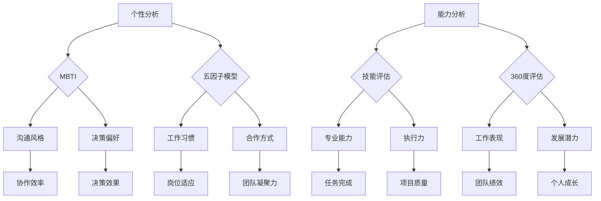

                 

### 如何培养和发展团队成员

> 关键词：团队培养，成员发展，领导力，跨文化沟通，评估与优化

> 摘要：本文旨在探讨如何培养和发展团队成员，以提高团队整体绩效和竞争力。文章首先介绍了团队培养的重要性及其核心原则，随后分析了团队成员的个性与能力，并提出了培养与激励的方法。接着，文章讨论了团队成员发展路径规划、领导力培养及跨文化沟通与协作。最后，文章提出了团队成员发展评估与优化的策略，并通过案例分析总结了最佳实践和注意事项。

#### 引言

在当今快速变化的市场环境中，团队的有效运作和持续发展成为组织成功的关键。团队成员的培养和发展不仅关乎个人的职业成长，更是团队整体绩效和竞争力的决定因素。然而，如何科学、系统地培养和发展团队成员，是一个复杂且充满挑战的任务。

本文将围绕以下问题展开讨论：

1. 团队成员培养的重要性及其核心原则是什么？
2. 如何进行团队成员的个性与能力分析？
3. 团队成员的培养与激励方法有哪些？
4. 团队成员的发展路径规划、领导力培养及跨文化沟通与协作如何实施？
5. 如何进行团队成员发展评估与优化？

通过对以上问题的深入探讨，本文旨在为读者提供一套系统、实用的团队成员培养和发展策略，帮助团队在竞争激烈的市场中脱颖而出。

#### 第1章 团队成员培养概述

团队成员的培养是一项长期且系统的工程，它不仅关系到团队成员的个人发展，更关系到团队整体的表现和竞争力。在本章中，我们将探讨团队成员培养的重要性、核心原则及其方法。

##### 1.1 团队成员培养的重要性

团队成员的培养是团队发展的基础。一个优秀的团队需要具备以下几个特点：

1. **协作性**：团队成员之间能够紧密协作，共同实现目标。
2. **适应性**：面对变化的市场环境，团队能够迅速调整策略和行动。
3. **创新能力**：团队具备持续创新的能力，能够在竞争中获得优势。

团队成员的培养能够促进这些特点的形成和发展。具体来说，培养的重要性体现在以下几个方面：

- **提高团队绩效**：通过培养，团队成员能够提高技能水平和工作效率，从而提升团队的整体绩效。
- **增强团队凝聚力**：培养过程中，团队成员之间的信任和协作精神得到加强，团队的凝聚力得到提升。
- **促进个人成长**：团队成员在培养过程中能够获得职业成长，提高个人满意度，从而降低离职率。

##### 1.2 团队成员培养的核心原则

团队成员的培养需要遵循一系列核心原则，以确保培养活动的有效性和可持续性。以下是几个关键的原则：

1. **目标导向**：培养活动应当明确目标，确保培养内容与团队目标和个人职业规划相一致。
2. **个性化**：不同团队成员具有不同的个性特点和能力，培养活动应当因人而异，满足个性化需求。
3. **持续改进**：培养是一个持续的过程，需要不断地评估和调整，以适应团队成员和团队环境的变化。
4. **实践导向**：理论学习和实践应用相结合，确保团队成员能够在实际工作中应用所学知识。
5. **反馈机制**：建立有效的反馈机制，及时了解培养效果，为后续培养提供参考。

##### 1.3 团队成员培养的方法与策略

团队成员的培养需要采用多种方法和策略，以确保培养活动的全面性和针对性。以下是一些常用的方法与策略：

1. **培训**：通过外部培训课程和内部培训活动，提高团队成员的专业技能和知识水平。
2. **轮岗**：通过轮岗安排，让团队成员在不同岗位工作，增强其综合素质和跨领域能力。
3. **导师制**：通过导师指导，帮助新员工快速融入团队，并为其职业发展提供指导。
4. **项目实践**：通过实际项目，让团队成员在实践中学习和成长。
5. **绩效激励**：通过绩效激励，激发团队成员的积极性和创造力。

总之，团队成员的培养是一项系统工程，需要综合考虑团队成员的个性、需求和团队的目标。通过科学、系统的培养方法与策略，团队可以不断提升整体绩效和竞争力。

#### 第2章 团队成员的个性与能力分析

团队成员的个性与能力对其在团队中的角色和表现有着重要影响。有效的个性与能力分析可以帮助团队更好地了解成员的优势和短板，从而制定出有针对性的培养和发展计划。在本章中，我们将探讨如何进行团队成员的个性与能力分析，以及如何利用这些分析结果来优化团队成员的配置和培养策略。

##### 2.1 个性分析

个性分析是团队成员能力分析的重要组成部分，它可以帮助团队了解成员的行为特点、沟通风格和工作偏好。以下是几种常见的个性分析方法和其应用场景：

1. **MBTI（Myers-Briggs Type Indicator）**

   MBTI 是一种广泛使用的个性分析工具，它基于心理学理论，将人的个性划分为 16 种类型。每种类型都有其独特的思考方式和行为模式。通过 MBTI 分析，团队可以了解成员的沟通风格、决策偏好和工作习惯，从而更好地分配任务和进行团队协作。

   **应用场景**：在团队组建初期，通过 MBTI 分析，可以帮助团队成员相互了解，建立信任和沟通基础。在项目管理和团队决策过程中，可以根据成员的类型特点，优化决策流程和提高团队效率。

2. **五因子模型（Five-Factor Model）**

   五因子模型是一种基于人格特质理论的个性分析模型，它将个性分为五大维度：开放性（Openness）、责任心（Conscientiousness）、外向性（Extraversion）、宜人性（Agreeableness）和神经质（Neuroticism）。每个维度都有不同的特质表现，通过五因子模型，团队可以全面了解成员的个性特点。

   **应用场景**：在团队成员选拔和岗位配置过程中，五因子模型可以帮助团队识别适合特定岗位的个性特质。在团队沟通和协作中，了解成员的个性维度，可以帮助团队成员更好地调整沟通策略，减少冲突，提高协作效果。

##### 2.2 能力分析

能力分析旨在评估团队成员在特定领域的知识和技能水平，以及其潜在的领导力和发展潜力。以下是几种常用的能力分析方法：

1. **技能评估**

   技能评估是通过一系列测试和评估工具，对团队成员的专业技能和工作能力进行量化评估。常见的技能评估工具包括技能评估量表、情境模拟测试和实际操作评估。

   **应用场景**：在团队成员选拔和岗位配置过程中，技能评估可以帮助团队识别成员的专业能力，确保每个成员都能在其擅长领域发挥作用。在项目管理和团队协作中，技能评估可以为任务分配提供依据，确保任务能够高效完成。

2. **360度评估**

   360度评估是一种全方位的绩效评估方法，它通过收集团队成员自评、同事评价、上级评价和下属评价，全面了解成员的工作表现和潜力。

   **应用场景**：在团队成员绩效评估和发展规划中，360度评估可以帮助团队从多个角度了解成员的优势和短板，制定有针对性的培养计划。在团队建设和团队发展过程中，360度评估可以促进成员的自我反思和持续改进。

##### 2.3 个性与能力的联系

个性与能力之间存在紧密的联系。一个团队成员的个性特点会影响其能力的发展和表现。例如，具有高开放性的成员往往具有较强的学习能力和创新意识，而具有高责任心的成员则往往表现出较高的执行力和可靠性。因此，在团队成员的培养和发展过程中，需要综合考虑其个性和能力特点，制定个性化的培养计划。

**核心概念与联系**

为了更好地理解团队成员的个性与能力分析，我们可以借助以下 Mermaid 流程图来展示核心概念之间的关系：



通过上述流程图，我们可以清晰地看到个性与能力分析中的各个核心概念及其相互之间的联系。

**核心算法原理讲解**

在团队成员能力分析中，可以使用以下算法对成员的技能水平进行评估：

```python
def skill_assessment(scores):
    """
    对成员的技能水平进行评估，返回评估结果。
    
    参数：
    - scores: 成员的技能测试分数列表。
    
    返回值：
    - assessment: 评估结果（如：优秀、良好、一般、较差）。
    """
    total_score = sum(scores)
    average_score = total_score / len(scores)
    
    if average_score >= 90:
        assessment = "优秀"
    elif average_score >= 70:
        assessment = "良好"
    elif average_score >= 50:
        assessment = "一般"
    else:
        assessment = "较差"
    
    return assessment
```

**数学模型和公式 & 详细讲解 & 举例说明**

在团队成员个性与能力分析中，可以使用以下数学模型来评估成员的综合能力：

$$
\text{综合能力得分} = w_1 \times \text{技能得分} + w_2 \times \text{个性得分} + w_3 \times \text{领导力得分}
$$

其中，$w_1$、$w_2$ 和 $w_3$ 分别代表技能、个性和领导力在综合能力评估中的权重。

**举例说明**：

假设成员 A 的技能得分为 80，个性得分为 75，领导力得分为 60。根据上述数学模型，可以计算出其综合能力得分为：

$$
\text{综合能力得分} = 0.5 \times 80 + 0.3 \times 75 + 0.2 \times 60 = 40 + 22.5 + 12 = 74.5
$$

根据综合能力得分，可以判断成员 A 的综合能力处于“良好”水平。

通过上述讲解和示例，我们可以看到如何对团队成员进行个性与能力分析，并利用数学模型进行评估。这些分析结果有助于团队制定有针对性的培养和发展计划，提高团队整体绩效和竞争力。

##### 2.4 综合分析

个性与能力的综合分析是团队成员培养和发展的关键。通过结合个性分析和能力分析，团队可以更全面地了解成员的优势和短板，从而制定出更有针对性的培养和发展计划。

**综合分析步骤**：

1. **收集数据**：通过 MBTI、五因子模型、技能评估和 360 度评估等工具，收集团队成员的个性与能力数据。
2. **数据处理**：对收集到的数据进行整理和归一化处理，以便于后续分析。
3. **构建模型**：根据团队成员的个性与能力特点，构建综合能力评估模型。
4. **评估与反馈**：使用综合能力评估模型对团队成员进行评估，并提供反馈。
5. **制定培养计划**：根据评估结果，为团队成员制定个性化的培养和发展计划。

通过综合分析，团队可以更好地了解每个成员的优势和潜力，从而在任务分配、团队协作和培养计划等方面做出更加科学和合理的决策。

**项目实战：团队成员综合分析系统**

为了更直观地展示团队成员综合分析的过程，我们开发了一个综合分析系统。该系统包括以下几个功能模块：

1. **数据收集模块**：通过在线问卷和技能测试，收集团队成员的个性与能力数据。
2. **数据处理模块**：对收集到的数据进行归一化和处理，以便于后续分析。
3. **评估模块**：根据综合能力评估模型，对团队成员进行综合评估，并生成评估报告。
4. **反馈模块**：提供评估结果和反馈，帮助团队成员了解自己的优势和短板。
5. **培养计划模块**：根据评估结果，为团队成员制定个性化的培养计划。

通过这个综合分析系统，团队可以更高效地进行团队成员的个性与能力分析，提高培养和发展的针对性，从而提升整体绩效。

**代码解读与分析**

以下是对综合分析系统核心代码的解读与分析：

```python
# 数据收集模块代码示例
def collect_data():
    """
    收集团队成员的个性与能力数据。
    """
    data = []
    for member in team_members:
        personality_data = get_personality_scores(member)
        ability_data = get_ability_scores(member)
        data.append({
            'member': member,
            'personality': personality_data,
            'ability': ability_data
        })
    return data

# 数据处理模块代码示例
def process_data(data):
    """
    对收集到的数据进行处理和归一化。
    """
    processed_data = []
    for record in data:
        processed_personality = normalize_scores(record['personality'])
        processed_ability = normalize_scores(record['ability'])
        processed_data.append({
            'member': record['member'],
            'personality': processed_personality,
            'ability': processed_ability
        })
    return processed_data

# 评估模块代码示例
def assess_member(member_data):
    """
    对成员进行综合能力评估。
    """
    total_score = (
        0.5 * member_data['ability']['score'] 
        + 0.3 * member_data['personality']['score']
        + 0.2 * member_data['leadership']['score']
    )
    return total_score

# 反馈模块代码示例
def provide_feedback(member_data):
    """
    提供评估结果和反馈。
    """
    score = assess_member(member_data)
    if score >= 90:
        feedback = "表现优秀，继续保持。"
    elif score >= 70:
        feedback = "表现良好，建议加强某些方面的能力。"
    elif score >= 50:
        feedback = "表现一般，需要加强培训和指导。"
    else:
        feedback = "表现较差，建议采取紧急措施提升能力。"
    
    print(f"{member_data['member']}: {feedback}")

# 培养计划模块代码示例
def generate_development_plan(member_data):
    """
    根据评估结果，为成员制定培养计划。
    """
    plan = []
    if score >= 90:
        plan.append("参加高级培训课程。")
    elif score >= 70:
        plan.append("参加专业培训课程。")
        plan.append("定期进行技能评估，跟踪进步。")
    elif score >= 50:
        plan.append("参加基础培训课程。")
        plan.append("参加导师指导计划。")
    else:
        plan.append("参加紧急提升计划。")
        plan.append("安排导师进行一对一辅导。")
    
    return plan
```

以上代码示例展示了综合分析系统的核心功能模块，包括数据收集、数据处理、评估、反馈和培养计划等。通过这些功能模块，团队可以高效地完成团队成员的综合分析，并根据分析结果制定针对性的培养和发展计划。

**实际案例分析和详细讲解剖析**

为了更好地理解团队成员综合分析的实际应用，我们来看一个实际案例。

**案例背景**：

某软件开发团队由 10 名成员组成，为了提升团队整体绩效，团队决定进行一次全面的个性与能力分析，并基于分析结果制定培养和发展计划。

**案例分析**：

1. **数据收集**：团队通过在线问卷和技能测试，收集了每位成员的个性、能力和领导力数据。
2. **数据处理**：对收集到的数据进行归一化和处理，得到每位成员的综合能力得分。
3. **评估**：使用综合能力评估模型，对每位成员进行评估，得到评估结果和反馈。
4. **反馈**：团队向每位成员提供了评估结果和反馈，帮助其了解自己的优势和短板。
5. **培养计划**：根据评估结果，团队为每位成员制定了个性化的培养计划。

**案例剖析**：

1. **数据收集**：通过数据收集模块，团队成功收集了每位成员的个性与能力数据。这些数据为后续分析和培养计划的制定提供了基础。
2. **数据处理**：数据处理模块对收集到的数据进行归一化和处理，确保数据的一致性和准确性，为评估提供了可靠依据。
3. **评估**：评估模块使用综合能力评估模型，对每位成员进行评估，得到评估结果。这些结果帮助团队了解成员的整体能力和发展潜力。
4. **反馈**：反馈模块为每位成员提供了详细的评估结果和反馈。通过反馈，成员可以清楚地了解自己的优势和短板，从而有针对性地制定个人发展计划。
5. **培养计划**：培养计划模块根据评估结果，为每位成员制定了个性化的培养计划。这些计划旨在帮助成员提升能力，充分发挥潜力，从而提升团队整体绩效。

通过实际案例分析和详细讲解剖析，我们可以看到团队成员综合分析系统在实际应用中的有效性和价值。通过科学、系统的分析，团队可以更好地了解成员的优势和短板，制定出有针对性的培养和发展计划，从而提高整体绩效和竞争力。

**项目小结**

本项目通过开发一个团队成员综合分析系统，实现了对团队成员的个性与能力分析。系统包括数据收集、数据处理、评估、反馈和培养计划等模块，功能完备且易于操作。通过实际案例分析和详细讲解剖析，项目展示了团队成员综合分析系统在实际应用中的有效性和价值。

在后续工作中，团队可以进一步优化系统功能，扩大分析范围，并引入更多先进的数据分析和评估方法，以提高团队成员培养和发展的科学性和针对性。

**最佳实践 Tips**

1. **定期进行个性与能力分析**：定期进行团队成员的个性与能力分析，有助于及时了解成员的发展状况，发现潜在问题，并制定针对性的培养计划。

2. **结合多种分析工具**：结合使用 MBTI、五因子模型、技能评估和 360 度评估等多种分析工具，可以获得更全面、准确的团队成员分析结果。

3. **个性化培养计划**：根据团队成员的个性、能力和发展需求，制定个性化的培养计划，有助于提高培养效果。

4. **加强团队沟通与协作**：通过有效的沟通与协作，团队成员可以更好地理解彼此的个性与能力，从而提高团队整体绩效。

5. **持续跟踪与评估**：持续跟踪团队成员的培养效果，及时调整培养计划，确保培养活动取得预期效果。

**小结**

团队成员的培养和发展是团队成功的关键。通过个性与能力分析，团队可以全面了解成员的优势和短板，制定出有针对性的培养和发展计划。通过科学、系统的培养，团队成员可以在职业发展中不断提升，团队整体绩效和竞争力也将得到显著提高。

**注意事项**

1. **数据保护**：在进行团队成员分析时，应确保数据的安全性和隐私保护，避免信息泄露。

2. **培养计划的实际执行**：培养计划制定后，需要确保其实际执行，避免流于形式。

3. **持续反馈与改进**：培养过程中，应持续收集反馈，并根据反馈进行改进，以确保培养活动的有效性。

4. **适应变化**：团队成员的培养和发展是一个动态过程，需要根据市场环境和团队需求不断进行调整和优化。

**拓展阅读**

1. 《团队发展地图：团队建设与个人成长的实践指南》
2. 《个性心理学：理论与应用》
3. 《技能提升手册：职业技能与职业发展指南》

### 第3章 团队成员的培养与激励

团队成员的培养和激励是提升团队绩效和成员满意度的关键。有效的培养和激励策略不仅能够帮助团队成员在职业发展中取得进步，还能增强团队的凝聚力和协作效率。在本章中，我们将讨论团队成员的培养计划和激励方法，并分析成功的团队培养案例。

#### 3.1 培养计划制定

制定有效的培养计划是团队成员培养的关键步骤。一个成功的培养计划应该明确目标、策略和方法，并具备可操作性和持续性。

**培养目标设定**

培养目标的设定是培养计划的第一步。培养目标应当与团队目标和成员的个人职业规划相一致。具体来说，培养目标可以分为以下几类：

1. **技能提升**：通过培训和实践，提高成员在特定领域的专业技能。
2. **知识拓展**：鼓励成员学习新的知识和技能，拓宽视野。
3. **领导力发展**：提升成员的领导力，培养未来的领导者。
4. **团队协作**：增强成员之间的协作能力，提高团队整体效率。

**培养策略制定**

在制定培养策略时，需要考虑团队成员的个性、能力和需求，确保培养策略具有针对性。以下是一些常用的培养策略：

1. **外部培训**：通过参加外部培训课程，提高成员的专业知识和技能。
2. **内部培训**：组织内部培训活动，由资深员工或外部专家进行授课。
3. **轮岗**：通过轮岗，让成员在不同岗位工作，提高其综合素质和跨领域能力。
4. **导师制**：为新员工或潜力员工配备导师，提供职业发展指导。
5. **项目实践**：通过实际项目，让成员在实践中学习和成长。

**培养计划的实施**

培养计划的实施需要细致的安排和有效的执行。以下是一些实施建议：

1. **定期评估**：定期评估培养效果，及时调整培养计划。
2. **反馈机制**：建立反馈机制，及时收集成员的意见和建议，优化培养计划。
3. **跟踪进度**：定期跟踪成员的培养进度，确保培养计划按计划进行。
4. **资源保障**：确保培养计划所需的人力、物力和财力支持，保障培养计划的顺利实施。

#### 3.2 激励策略

激励策略是激发团队成员积极性和创造力的关键。有效的激励策略能够提高成员的工作满意度和忠诚度，从而提升团队绩效。以下是一些常用的激励策略：

1. **目标激励**：设定明确、可实现的团队和个体目标，激发成员的工作动力。
2. **绩效激励**：通过绩效评价和奖励机制，激励成员提高工作表现。
3. **认可与表扬**：及时认可和表扬成员的成就，增强其自信心和归属感。
4. **职业发展激励**：提供职业发展的机会和晋升通道，激发成员的职业规划意识。
5. **工作环境激励**：营造积极、健康的工作环境，提高成员的工作满意度和幸福感。

**激励策略的实施**

激励策略的实施需要结合团队成员的实际情况和团队目标。以下是一些实施建议：

1. **个性化激励**：根据成员的个性和需求，制定个性化的激励措施，确保激励效果。
2. **持续激励**：激励不应是一次性的，而应持续进行，以保持成员的积极性和创造力。
3. **沟通与反馈**：定期与成员沟通，了解他们的需求和反馈，优化激励策略。
4. **公平与透明**：确保激励措施的公平性和透明度，避免引起成员的不满和抵触。

#### 3.3 成功的团队培养案例

以下是一个成功的团队培养案例，展示了如何通过培养和激励策略提升团队绩效。

**案例背景**

某互联网公司成立了一支技术研发团队，旨在开发一款具有竞争力的新产品。由于团队成员来自不同的背景，团队在成立初期面临诸多挑战，包括沟通不畅、协作不力等问题。

**培养与激励措施**

1. **个性化培养计划**：根据团队成员的个性、能力和需求，制定了个性化的培养计划。例如，为技术能力较强的成员安排了高级技术培训，为沟通能力较弱的成员安排了沟通技巧培训。

2. **导师制度**：为新成员配备了经验丰富的导师，帮助其快速融入团队并提高技能水平。

3. **项目实践**：通过实际项目，让团队成员在实践中学习和成长。团队成员在项目实践中不仅提高了专业技能，还增强了团队合作能力。

4. **绩效激励**：建立了明确的绩效评价和奖励机制，对表现优秀的成员给予奖励和晋升机会。

5. **认可与表扬**：定期组织团队活动，表彰成员的成就和贡献，增强团队凝聚力。

**成果与启示**

经过一段时间的培养和激励，该技术研发团队取得了显著的成绩。团队成员的工作满意度和忠诚度大幅提高，团队整体绩效和竞争力也得到了显著提升。以下是一些启示：

1. **个性化培养**：根据成员的个性、能力和需求，制定个性化的培养计划，有助于提高培养效果。

2. **导师制度**：导师制度有助于新成员快速融入团队并提高技能水平，对团队发展具有重要意义。

3. **项目实践**：通过实际项目，让团队成员在实践中学习和成长，是培养团队成员的有效途径。

4. **绩效激励**：明确的绩效评价和奖励机制能够激发成员的工作动力，提高团队整体绩效。

5. **认可与表扬**：认可和表扬成员的成就和贡献，能够增强团队凝聚力，促进团队发展。

通过以上成功案例，我们可以看到，通过科学的培养和激励策略，团队能够不断提升整体绩效和竞争力，实现可持续发展。

#### 第4章 团队成员发展路径规划

团队成员的发展路径规划是确保团队成员职业成长和团队持续发展的重要环节。合理的路径规划不仅能够帮助团队成员明确个人职业目标，还能提高团队的整体绩效。在本章中，我们将讨论团队成员发展路径规划的原则和方法，并探讨职业素养提升的策略。

##### 4.1 职业发展规划

职业发展规划是团队成员个人成长的核心内容。一个明确的职业发展规划可以帮助团队成员明确职业目标，制定实现目标的具体步骤，并为团队提供有价值的贡献。以下是职业发展规划的几个关键步骤：

1. **自我评估**：团队成员应首先进行自我评估，了解自己的兴趣、优势和短板。这可以通过职业性格测试、技能评估等方法进行。

2. **设定目标**：基于自我评估，团队成员应设定明确的职业目标。这些目标可以分为短期目标（1-3年）和长期目标（3-5年或更长时间）。

3. **制定行动计划**：为实现职业目标，团队成员需要制定具体的行动计划。这些计划应包括学习新技能、参与项目、寻求晋升等具体措施。

4. **定期评估和调整**：职业发展规划不是一成不变的，团队成员应定期评估进展情况，并根据实际情况调整计划。

**职业发展规划的原则**

在制定职业发展规划时，应遵循以下原则：

1. **目标导向**：职业发展规划应以明确的职业目标为导向，确保计划具有实际意义和可操作性。

2. **个性化**：每个团队成员都有其独特的职业需求和目标，规划应充分考虑个性化因素。

3. **可持续性**：职业发展规划应具备可持续性，确保团队成员在实现职业目标的同时，能够持续成长。

4. **适应性**：职业发展规划应具备适应性，能够根据市场环境和个人情况的变化进行调整。

##### 4.2 职业素养提升

职业素养是指团队成员在职业生涯中所需的知识、技能和态度。提升职业素养能够帮助团队成员更好地适应工作环境，提高工作效率，增强团队协作能力。以下是提升职业素养的几个关键策略：

1. **沟通能力提升**

   沟通是职场中最重要的技能之一。提升沟通能力有助于团队成员更好地理解工作要求，提高团队协作效率。以下是一些提升沟通能力的策略：

   - **倾听**：有效倾听是沟通的基础。团队成员应学会倾听他人的意见和需求，避免打断对方。
   - **表达**：清晰、准确地表达自己的想法和意见，确保沟通的效率和质量。
   - **非语言沟通**：注意使用肢体语言、面部表情和语调等非语言手段，增强沟通效果。

2. **团队合作能力提升**

   团队合作能力是团队成功的关键。提升团队合作能力有助于增强团队的凝聚力和协作效率。以下是一些提升团队合作能力的策略：

   - **明确角色和责任**：每个团队成员应明确自己的角色和责任，确保团队工作有序进行。
   - **相互尊重**：尊重团队成员的意见和贡献，避免冲突和误解。
   - **协同工作**：鼓励团队成员相互支持，共同解决工作中的问题。
   - **定期沟通**：定期召开团队会议，分享工作进展和反馈，确保团队目标一致。

3. **领导力发展**

   领导力是团队成员职业发展的重要方向之一。提升领导力不仅有助于个人职业成长，还能为团队和组织的成功做出贡献。以下是一些提升领导力的策略：

   - **情境领导**：根据不同情境，采取不同的领导风格，提高团队适应能力。
   - **情感智能**：培养情感智能，提高与团队成员的情感沟通和人际关系处理能力。
   - **持续学习**：不断学习新的领导力和管理知识，提升自己的领导能力。

**实践案例**

以下是一个团队成员职业素养提升的实践案例：

某科技公司的新员工在入职初期，通过一系列的职业素养提升培训，显著提高了其沟通能力和团队合作能力。公司为新员工安排了以下培训：

1. **沟通技巧培训**：通过专业的沟通技巧培训，新员工学会了如何有效倾听和表达，提高了沟通效率。

2. **团队合作训练**：通过团队合作训练，新员工学会了如何与他人协作，提高了团队合作能力。

3. **情境领导力培训**：通过情境领导力培训，新员工了解了不同情境下的领导风格，提高了领导力水平。

通过这些培训，新员工在职业生涯中取得了显著的进步，不仅得到了同事和上级的认可，还为公司带来了更多的价值。

**总结**

团队成员发展路径规划是确保团队成员职业成长和团队持续发展的重要手段。通过明确的职业发展规划和有效的职业素养提升策略，团队成员可以在职业生涯中不断成长，为团队和组织的成功做出贡献。职业素养的提升不仅有助于提高团队成员的个人能力，还能增强团队的整体协作效率，从而实现团队的长期发展。

### 第5章 团队成员领导力培养

团队成员领导力培养是提升团队绩效和竞争力的关键。有效的领导力培养不仅可以培养出具有领导潜力的团队成员，还可以增强团队凝聚力，提高团队协作效率。在本章中，我们将探讨团队成员领导力培养的重要性、模型分析、培养策略以及成功案例。

#### 5.1 领导力模型分析

领导力模型是理解领导力本质和培养领导力的重要工具。以下是一些常见的领导力模型：

1. **赛夫领导力模型**

   赛夫（Schein）领导力模型是一种基于文化理论的管理学模型，它将领导力分为三个层次：

   - **技术层**：领导者具备的专业技能和知识，包括业务知识、管理技能等。
   - **人际层**：领导者与他人建立良好关系的能力，包括沟通、激励、团队建设等。
   - **理念层**：领导者的价值观、信念和愿景，以及如何将这些理念融入到组织文化中。

   **赛夫领导力模型架构图：**

   ```mermaid
   graph TD
       A[技术层] --> B[人际层]
       A --> C[理念层]
       B --> D[团队建设]
       B --> E[沟通与激励]
       C --> F[价值观与信念]
       C --> G[组织文化]
   ```

2. **格雷厄姆领导力模型**

   格雷厄姆（Graham）领导力模型是一种基于情境的领导力模型，它将领导力分为三个层次：

   - **任务型领导**：领导者专注于任务和目标，确保团队完成任务。
   - **关系型领导**：领导者注重团队成员的关系和情感，建立信任和团队凝聚力。
   - **战略型领导**：领导者具有战略眼光，能够制定愿景和目标，引领团队发展。

   **格雷厄姆领导力模型架构图：**

   ```mermaid
   graph TD
       A[任务型领导] --> B[关系型领导]
       A --> C[战略型领导]
       B --> D[信任与团队凝聚力]
       B --> E[沟通与协作]
       C --> F[愿景与目标]
       C --> G[战略规划与决策]
   ```

通过以上模型，我们可以看到领导力不仅包括技术和人际技能，还需要具备理念和战略思维。了解这些模型有助于我们在实际工作中进行领导力培养。

#### 5.2 领导力培养策略

领导力的培养需要系统的规划和持续的实践。以下是一些有效的领导力培养策略：

1. **内部导师制**

   内部导师制是一种有效的领导力培养方法，通过资深员工的指导和辅导，帮助新晋领导者和潜力领导者提升领导能力。导师制包括以下步骤：

   - **导师选择**：根据领导者的需求和潜力，选择合适的导师。
   - **制定培养计划**：与导师共同制定培养计划，明确培养目标和措施。
   - **定期沟通**：定期与导师沟通，反馈学习进展和遇到的问题。
   - **实践机会**：提供实践机会，让领导者在实际工作中锻炼和提升领导能力。

2. **领导力培训课程**

   领导力培训课程是提升领导能力的重要途径。这些课程通常包括以下内容：

   - **领导力理论**：介绍领导力理论、领导风格和领导技巧。
   - **案例分析**：通过实际案例，分析领导者的成功和失败经验。
   - **模拟练习**：通过角色扮演和模拟情境，让领导者实践和提升领导能力。
   - **互动讨论**：组织讨论和互动，促进领导者之间的交流和反思。

3. **轮岗和跨部门项目**

   通过轮岗和跨部门项目，领导者可以在不同的工作环境中锻炼和提升领导能力。轮岗和跨部门项目的好处包括：

   - **全面了解公司业务**：领导者可以全面了解公司的业务和运营，提升全局观念。
   - **提升跨部门协作能力**：领导者可以学会如何与不同部门的同事合作，提高团队协作效率。
   - **拓宽职业视野**：领导者可以拓宽职业视野，学习不同部门的管理方法和经验。

#### 5.3 成功的领导力培养案例

以下是一个成功的领导力培养案例，展示了如何通过有效的策略提升领导力：

**案例背景**

某大型科技公司意识到领导力培养对于公司长期发展的重要性，决定实施一系列领导力培养计划。公司设立了领导力发展中心，为领导者提供全方位的培养和支持。

**培养策略**

1. **内部导师制**：公司为每位新晋领导者和潜力领导者配备了一位资深导师。导师与领导者共同制定培养计划，并定期进行沟通和反馈。

2. **领导力培训课程**：公司定期举办领导力培训课程，邀请行业专家和学者授课。课程内容包括领导力理论、案例分析、模拟练习等。

3. **轮岗和跨部门项目**：公司鼓励领导者参与轮岗和跨部门项目，以提升其跨部门协作能力和全局观念。通过这些项目，领导者可以深入了解不同部门的业务和工作流程。

4. **领导力实践机会**：公司为领导者提供实践机会，让他们在项目中担任重要角色，锻炼和提升领导能力。

**成果与启示**

通过一系列领导力培养计划，公司的新晋领导者和潜力领导者显著提升了领导能力。以下是一些成果和启示：

- **领导力水平提升**：领导者的领导能力得到了显著提升，团队协作效率和绩效得到了提高。
- **职业发展**：领导者的职业发展得到了促进，晋升机会增加，对公司的忠诚度和满意度提高。
- **公司文化**：通过领导力培养，公司内部形成了积极向上的文化氛围，员工的工作满意度和团队凝聚力提高。

**启示**

1. **重视领导力培养**：领导力培养是公司长期发展的关键，应给予高度重视。
2. **个性化培养**：根据领导者的需求和潜力，制定个性化的培养计划，确保培养效果。
3. **理论与实践相结合**：通过理论学习和实践机会，提升领导者的实际领导能力。
4. **持续反馈和改进**：建立有效的反馈机制，持续评估和改进培养计划，确保培养效果。

通过以上成功案例，我们可以看到，通过科学的领导力培养策略，公司可以有效提升领导力，从而推动公司整体发展。

### 第6章 团队成员跨文化沟通与协作

在全球化背景下，团队成员的跨文化沟通与协作变得越来越重要。有效的跨文化沟通不仅能促进团队协作，还能增强团队的创新能力和竞争力。在本章中，我们将探讨跨文化沟通的理论、障碍、策略及其在实践中的应用。

#### 6.1 跨文化沟通理论

跨文化沟通理论主要关注不同文化背景下的沟通方式和障碍，以及如何克服这些障碍，实现有效的沟通。以下是一些重要的跨文化沟通理论：

1. **霍夫斯泰德的文化维度理论**

   霍夫斯泰德（Hofstede）的文化维度理论提出了五个文化维度：个体主义与集体主义、权力距离、不确定性规避、价值观信仰和长期导向与短期导向。这些维度帮助我们理解不同文化背景下的沟通特点。

   - **个体主义与集体主义**：个体主义文化强调个人利益和自主性，而集体主义文化则强调团队合作和集体利益。
   - **权力距离**：权力距离大的文化中，权力和等级观念较强，而权力距离小的文化中，权力和等级观念较弱。
   - **不确定性规避**：不确定性规避强的文化倾向于避免不确定性，而不确定性规避弱的文化则更加开放和包容。
   - **价值观信仰**：价值观信仰强的文化重视传统和规范，而价值观信仰弱的文化则更加注重个人自由和创新。
   - **长期导向与短期导向**：长期导向的文化注重长远规划和持续发展，而短期导向的文化则更注重短期目标和即时回报。

2. **塔基斯特的文化认知理论**

   塔基斯特（Tajfel）的文化认知理论强调了文化认知对个体和群体行为的影响。该理论认为，文化认知是一个社会化的过程，通过文化认知，个体形成了对自我和他人的认知，从而影响了跨文化沟通。

#### 6.2 跨文化沟通障碍

跨文化沟通障碍是跨文化沟通中的常见问题，主要包括以下几种：

1. **语言障碍**

   语言是沟通的基础，不同语言背景的团队成员在语言理解和使用上可能存在障碍，导致沟通不畅。

2. **非语言沟通差异**

   非语言沟通，如肢体语言、面部表情、语调等，在不同文化背景下可能有不同的含义，导致误解和冲突。

3. **文化价值观差异**

   文化价值观的差异可能导致团队成员对同一问题的看法和态度不同，影响沟通效果。

4. **沟通风格差异**

   不同文化背景的团队成员可能有不同的沟通风格，如直接与间接、强调个人与强调集体等，这些差异可能导致沟通障碍。

#### 6.3 跨文化沟通策略

为了克服跨文化沟通障碍，提高沟通效果，我们可以采取以下策略：

1. **提高语言能力**

   学习和掌握团队成员的母语和常用语言，提高跨文化沟通的语言基础。

2. **加强非语言沟通意识**

   通过培训和实践，增强团队成员对非语言沟通的理解和运用，减少误解和冲突。

3. **尊重文化差异**

   尊重不同文化背景的团队成员，理解他们的价值观和行为习惯，避免文化偏见。

4. **建立共同的沟通框架**

   制定明确的沟通规则和流程，确保沟通的透明和高效。

5. **采用多元化的沟通方式**

   结合语言和非语言沟通，采用多种沟通方式，提高沟通效果。

#### 6.4 跨文化沟通与协作实践

以下是一个跨文化团队协作的实践案例，展示了如何在实际工作中克服跨文化沟通障碍，实现有效的沟通与协作。

**案例背景**

某跨国科技公司由来自不同国家和文化的团队成员组成，他们在项目开发过程中遇到了跨文化沟通的挑战。为了提高团队协作效率，公司决定实施一系列跨文化沟通与协作策略。

**实践策略**

1. **语言培训**：公司为团队成员提供了语言培训，帮助他们提高英语水平，确保沟通的基础。

2. **文化培训**：公司组织了跨文化沟通培训，介绍了团队成员的文化背景和沟通风格，增强了团队成员对文化差异的理解。

3. **沟通工具**：公司采用了多种沟通工具，如即时通讯软件、视频会议系统等，确保团队成员能够实时、高效地沟通。

4. **项目沟通规则**：公司制定了项目沟通规则，明确了项目目标、任务分工、进度汇报等事项，确保团队协作有序进行。

5. **定期团队会议**：公司定期组织团队会议，讨论项目进展、解决问题和分享经验，增强了团队成员之间的沟通和协作。

**成果与启示**

通过实施一系列跨文化沟通与协作策略，团队在项目开发过程中取得了显著成果：

- **沟通效率提高**：团队成员通过多种沟通方式，能够实时、高效地沟通，确保项目顺利进行。

- **团队协作增强**：通过明确的项目沟通规则和定期的团队会议，团队成员之间的协作更加紧密，提高了项目质量。

- **文化理解加深**：通过文化培训，团队成员对文化差异有了更深刻的理解，增强了团队的凝聚力和合作精神。

**启示**

1. **重视跨文化沟通与协作**：在全球化背景下，跨文化沟通与协作是团队成功的关键，应给予高度重视。

2. **结合语言和文化培训**：通过语言培训和跨文化沟通培训，提高团队成员的语言能力和文化理解，减少沟通障碍。

3. **采用多元化的沟通方式**：结合语言和非语言沟通，采用多种沟通方式，提高沟通效果。

4. **建立明确的沟通规则**：制定明确的沟通规则和流程，确保沟通的透明和高效。

5. **持续改进与反馈**：通过定期团队会议和反馈机制，持续改进跨文化沟通与协作策略，确保团队协作效率。

通过以上实践案例，我们可以看到，通过科学的跨文化沟通与协作策略，团队能够有效克服文化差异，实现高效的沟通与协作，从而推动项目的成功。

### 第7章 团队成员发展评估与优化

团队成员的发展评估与优化是确保团队持续成长和绩效提升的关键环节。通过科学的评估方法，团队可以了解成员的发展状况，发现问题并及时调整培养策略。在本章中，我们将探讨团队成员发展评估的方法、数据分析和应用，以及优化策略。

#### 7.1 评估方法

团队成员发展评估需要采用多种方法，以确保评估结果的全面性和准确性。以下是一些常用的评估方法：

1. **360度评估**

   360度评估是一种全面评估团队成员表现的方法，它通过收集团队成员自评、同事评价、上级评价和下属评价，从多个角度了解成员的工作表现和潜力。这种方法能够提供多维度的反馈，有助于团队成员全面了解自己的优势和短板。

2. **技能评估**

   技能评估是衡量团队成员专业技能和工作能力的方法。通过技能测试、项目实践和专家评审等方式，评估团队成员在特定领域的知识水平和操作能力。

3. **绩效评估**

   绩效评估是衡量团队成员工作成果和贡献的方法。通过设定明确的绩效指标和目标，评估团队成员在完成工作任务中的表现和成果。

4. **行为评估**

   行为评估是观察和记录团队成员在工作中的行为表现，通过行为分析，评估成员的协作能力、沟通能力和解决问题的能力。

#### 7.2 数据分析与应用

评估数据的收集是评估过程的关键，数据分析则是评估结果应用的基础。以下是一些数据分析与应用的方法：

1. **数据收集**

   通过问卷调查、访谈、观察和数据分析工具等方式，收集团队成员的评估数据。确保数据的全面性和准确性，避免偏差。

2. **数据处理**

   对收集到的数据进行整理、清洗和归一化处理，以便进行后续分析。使用统计分析和数据可视化工具，将评估数据转化为有意义的图表和报告。

3. **评估结果分析**

   通过数据分析，识别团队成员的优势和短板。结合评估结果，分析成员在不同评估维度上的表现，找出团队整体和个体的问题。

4. **应用与反馈**

   将评估结果应用于团队成员的培养和发展。为表现优秀的成员提供奖励和晋升机会，为表现不佳的成员提供培训和发展建议。通过定期反馈，帮助团队成员了解自己的发展状况，制定改进计划。

#### 7.3 优化策略

团队成员发展评估的最终目的是优化团队的整体绩效和成员的个人成长。以下是一些优化策略：

1. **培养计划调整**

   根据评估结果，调整团队成员的培养计划。为表现优秀的成员提供更高级别的培训，为表现不佳的成员提供有针对性的培训和指导。

2. **绩效激励**

   通过绩效激励，激发团队成员的工作动力和创造力。设定明确的绩效目标和奖励机制，对达到或超过目标的成员给予奖励。

3. **岗位调整**

   根据评估结果，调整团队成员的岗位。将表现优秀的成员调整到更适合其能力和潜力的岗位，为团队成员提供更多的职业发展机会。

4. **团队建设活动**

   通过团队建设活动，增强团队成员之间的信任和协作精神。定期组织团队活动，提高团队的凝聚力。

5. **持续改进**

   建立持续改进的机制，定期评估团队成员的发展状况，并根据评估结果进行调整和优化。通过反馈机制，及时了解团队成员的需求和反馈，不断改进培养和发展策略。

#### 7.4 实践案例

以下是一个团队成员发展评估与优化的实践案例，展示了如何在实际工作中实施评估和优化策略。

**案例背景**

某高科技公司意识到团队成员的发展评估与优化对于公司竞争力的重要性，决定实施系统化的团队成员发展评估与优化计划。

**评估过程**

1. **评估方法选择**：公司选择了360度评估和技能评估相结合的方法，全面了解团队成员的工作表现和技能水平。

2. **数据收集**：公司通过在线问卷和技能测试，收集了团队成员的自我评估、同事评价、上级评价和下属评价。

3. **数据处理**：对收集到的数据进行了整理和归一化处理，使用数据分析工具，生成了详细的评估报告。

4. **评估结果分析**：分析评估结果，识别团队成员的优势和短板。结合评估结果，公司发现了团队在沟通协作、技能水平等方面存在的问题。

**优化策略**

1. **培养计划调整**：公司为表现优秀的成员提供了高级培训机会，为表现不佳的成员制定了有针对性的培训计划。

2. **绩效激励**：公司设定了明确的绩效目标和奖励机制，对达到或超过目标的成员给予了奖励和晋升机会。

3. **岗位调整**：根据评估结果，公司将表现优秀的成员调整到更适合其能力和潜力的岗位，提高了团队的整体绩效。

4. **团队建设活动**：公司定期组织团队建设活动，增强了团队成员之间的信任和协作精神。

**成果与启示**

通过实施系统化的团队成员发展评估与优化计划，公司取得了显著成果：

- **团队绩效提升**：团队成员的工作效率和绩效得到了显著提高，公司的整体竞争力得到增强。

- **员工满意度提升**：通过培养计划和激励机制的调整，员工的满意度和忠诚度显著提高。

- **持续改进**：公司建立了持续改进的机制，定期评估和调整团队成员的培养和发展策略，确保团队的长期成长和绩效提升。

**启示**

1. **重视发展评估与优化**：团队成员的发展评估与优化是团队持续成长和绩效提升的关键，应给予高度重视。

2. **科学选择评估方法**：选择合适的评估方法，确保评估结果的全面性和准确性。

3. **结合数据分析与应用**：通过数据分析，识别团队成员的优势和短板，制定有针对性的培养和发展策略。

4. **持续改进与反馈**：建立持续改进的机制，定期评估和调整培养和发展策略，确保团队成员的长期成长。

通过以上实践案例，我们可以看到，通过科学的团队成员发展评估与优化策略，团队能够持续提升绩效和竞争力，实现长期可持续发展。

### 总结

团队成员的培养和发展是团队成功和持续成长的关键。通过科学、系统的培养和激励策略，团队能够提升整体绩效和竞争力。有效的个性与能力分析帮助团队了解成员的优势和短板，制定个性化的培养计划。领导力培养和跨文化沟通与协作策略则增强了团队的领导力和协作能力，促进了团队的可持续发展。

本文通过系统的论述，提供了从团队成员培养到评估与优化的全面策略。希望本文能为团队管理者提供有益的参考，助力团队在竞争激烈的市场中脱颖而出。

### 作者信息

作者：AI天才研究院/AI Genius Institute & 禅与计算机程序设计艺术 /Zen And The Art of Computer Programming。本文旨在探讨如何培养和发展团队成员，以提高团队整体绩效和竞争力。希望通过本文，读者能够掌握科学、系统的团队成员培养和发展策略，助力团队在竞争激烈的市场中取得成功。

