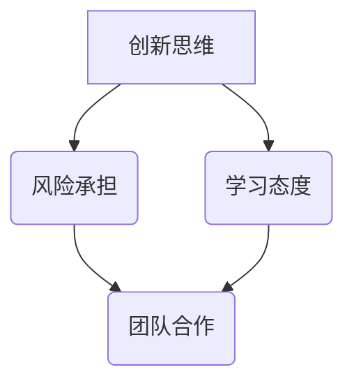
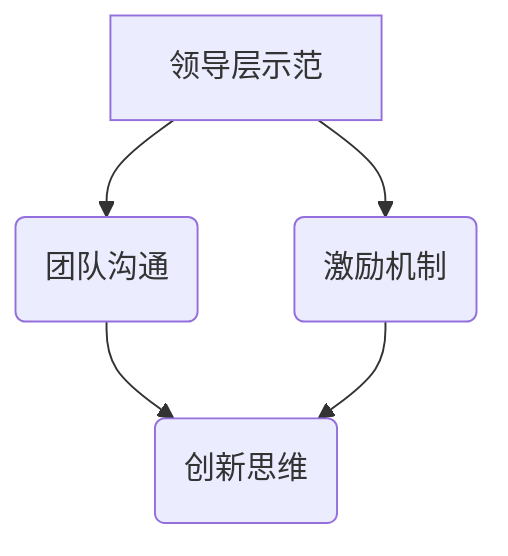
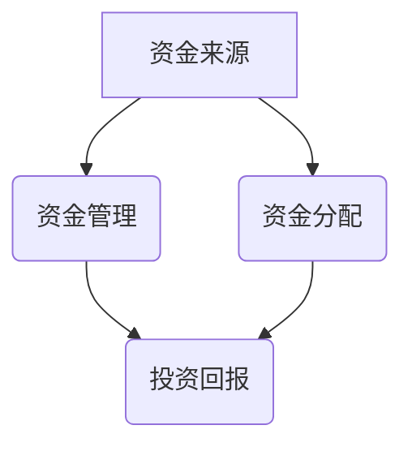
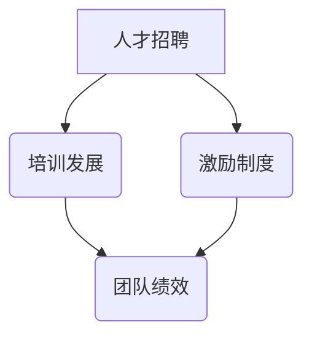
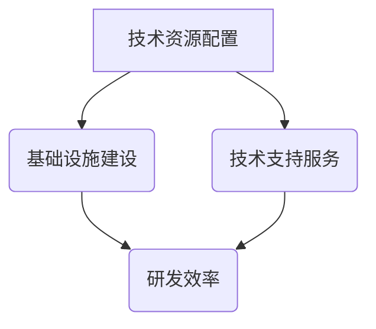
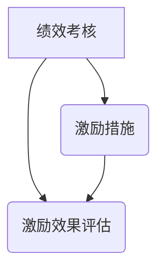
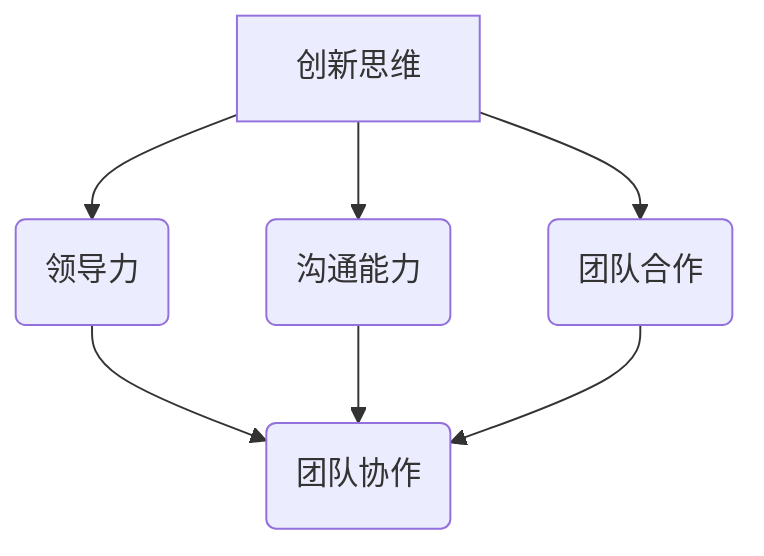
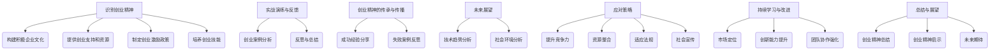

                 

### 文章标题

《如何培养团队的创业精神》

### 关键词

- 创业精神
- 团队建设
- 组织文化
- 激励策略
- 创新思维
- 创业技能培训

### 摘要

本文旨在探讨如何培养团队的创业精神，以促进创新和企业在竞争中的持续发展。文章首先介绍了创业精神的定义和特征，分析了其在现代企业中的重要性。接着，本文提出了一系列具体的策略和方法，包括建立积极的组织文化、提供创业支持和资源、制定有效的激励政策以及培养创业技能。通过实际案例和经验分享，文章展示了培养创业精神的实践路径和成效。最后，文章对未来创业精神的发展趋势和面临的挑战进行了展望，并提出了一些建议以应对这些挑战。### 分析书名《如何培养团队的创业精神》，确定核心主题和目标读者

《如何培养团队的创业精神》这一书名直接指出了核心主题——创业精神的培养。从标题可以推断出，本书的主要内容将围绕如何在一个团队中激发和培养创业精神，以推动企业创新和成长。

**核心主题：**

1. **创业精神的定义与特征：** 阐述创业精神的基本概念，包括其核心要素和独特特征。
2. **创业精神的重要性：** 探讨创业精神对企业发展和员工个人成长的影响。
3. **培养创业精神的策略与方法：** 提供具体的策略和方法，帮助团队和组织培养创业精神。
4. **实战案例与经验分享：** 通过成功和失败案例的分析，提供实际的培养经验和教训。
5. **未来展望：** 对创业精神的发展趋势和未来挑战进行预测和探讨。

**目标读者：**

1. **企业领导者和管理者：** 他们需要了解如何激励团队，推动企业创新。
2. **创业者和潜在创业者：** 他们希望学习如何在团队中培养创业精神，以实现创业梦想。
3. **人力资源专业人士：** 他们需要掌握如何设计激励政策和培训计划，以支持团队发展。
4. **学术研究人员：** 他们对创业精神和团队建设的研究感兴趣，希望从实践中获取新的见解。
5. **学生和培训生：** 他们希望了解创业精神的重要性，为未来的职业生涯做好准备。

通过明确核心主题和目标读者，我们可以更好地设计书的内容和结构，确保书中的每个部分都紧密围绕主题，并且能够满足目标读者的需求。### 确定书籍结构，分为几个部分

为了系统地探讨如何培养团队的创业精神，本书将分为以下几个主要部分：

**第一部分：创业精神概述**

本部分将介绍创业精神的基本概念和核心特征，包括其历史发展、定义以及创业精神在组织中的重要性。这部分还将探讨创业精神与企业家精神、个人价值观和领导力的关系，为后续的策略和方法提供理论支持。

**第二部分：培养创业精神的策略与方法**

在这一部分，本书将详细阐述一系列培养创业精神的策略和方法。具体包括：

1. **组织文化：** 探讨如何通过建立积极的企业文化来激发创业精神，包括鼓励创新思维和风险承担的策略。
2. **创业支持和资源：** 分析如何提供必要的财务、人力资源和技术支持，以帮助团队实现创业目标。
3. **激励政策：** 介绍如何制定和实施有效的激励政策，激励员工积极参与创业活动。
4. **创业技能培训：** 提供创业技能培训的方法和内容，帮助员工提升创业所需的能力。

**第三部分：实战案例与经验分享**

本部分将通过分析成功和失败的创业团队案例，分享实践经验，提供具体的培养创业精神的策略和方法。这部分还将探讨创业精神在企业内部和外部的传承与传播。

**第四部分：创业精神的未来展望**

在这一部分，本书将对创业精神的发展趋势和未来挑战进行展望，讨论技术进步和社会环境变化对创业精神的影响，并提出应对策略。

**第五部分：附录**

附录部分将提供额外的资源，包括创业资源与工具介绍、推荐书籍和研究论文，以便读者进一步深入了解相关领域。

通过以上结构的划分，本书将系统地呈现创业精神的培养过程，为读者提供全面的理论指导和实践参考。### 设计每个部分的章节标题，确保逻辑清晰、内容全面

在确定书籍的整体结构后，我们需要为每个部分设计章节标题，确保逻辑清晰、内容全面。以下是每个部分的章节标题设计：

**第一部分：创业精神概述**

1. **第1章 创业精神的定义与特征**
   - 1.1 创业精神的起源
   - 1.2 创业精神的核心特征
   - 1.3 创业精神与企业家精神的比较

2. **第2章 创业精神的重要性**
   - 2.1 对企业的影响
   - 2.2 对员工的影响
   - 2.3 创业精神的社会价值

3. **第3章 创业精神的历史与发展**
   - 3.1 创业精神的历史背景
   - 3.2 创业精神的发展趋势
   - 3.3 创业精神在现代社会中的应用

**第二部分：培养创业精神的策略与方法**

1. **第4章 培养创业精神的组织文化**
   - 4.1 积极企业文化的建立
   - 4.2 鼓励创新思维
   - 4.3 风险承担与学习氛围

2. **第5章 提供创业支持和资源**
   - 5.1 财务支持策略
   - 5.2 人力资源支持
   - 5.3 技术资源与基础设施

3. **第6章 制定创业激励政策**
   - 6.1 激励政策的设计
   - 6.2 激励措施的实施
   - 6.3 成功案例分析

4. **第7章 培养创业技能**
   - 7.1 创业技能的构成
   - 7.2 培训计划与实施
   - 7.3 实战演练与反馈

**第三部分：实战案例与经验分享**

1. **第8章 成功创业团队的案例分析**
   - 8.1 团队成员的角色与贡献
   - 8.2 创业过程中的关键因素
   - 8.3 创业成功的经验总结

2. **第9章 失败创业团队的反思**
   - 9.1 失败的原因分析
   - 9.2 失败后的反思与总结
   - 9.3 避免失败的策略

3. **第10章 创业精神的传承与传播**
   - 10.1 企业内部的创业精神传承
   - 10.2 行业内的创业精神传播
   - 10.3 国际化视野下的创业精神传播

**第四部分：创业精神的未来展望**

1. **第11章 创业精神的发展趋势**
   - 11.1 技术创新对创业精神的影响
   - 11.2 社会环境对创业精神的影响
   - 11.3 创业精神在未来的角色

2. **第12章 创业精神的挑战与机遇**
   - 12.1 挑战分析
   - 12.2 机遇识别
   - 12.3 应对策略

**第五部分：附录**

1. **第13章 创业资源与工具介绍**
   - 13.1 创业融资渠道
   - 13.2 创业管理工具
   - 13.3 创业支持机构

2. **第14章 创业精神相关书籍推荐**
   - 14.1 必读经典
   - 14.2 最新研究动态
   - 14.3 补充读物

通过以上章节标题的设计，我们可以确保书籍的内容结构清晰、逻辑性强，能够全面覆盖创业精神培养的各个方面，同时为读者提供丰富的理论和实践指导。### 为每个章节添加子章节，细化内容

为了确保每个章节的内容丰富具体，我们将为每个章节添加子章节，细化每个主题，以便读者能够深入理解每个部分的核心内容。

**第一部分：创业精神概述**

### 第1章 创业精神的定义与特征

1. **1.1 创业精神的定义**
   - 创业精神的起源
   - 创业精神与现代企业
   - 创业精神与传统精神的差异

2. **1.2 创业精神的核心特征**
   - 勇于冒险
   - 非凡的创造力
   - 长远视野
   - 团队合作精神

3. **1.3 创业精神与企业家精神的比较**
   - 企业家精神的定义
   - 企业家精神与创业精神的联系
   - 企业家精神与创业精神的区别

### 第2章 创业精神的重要性

1. **2.1 对企业的影响**
   - 创新能力的提升
   - 市场竞争力的增强
   - 企业持续发展

2. **2.2 对员工的影响**
   - 增强员工的归属感
   - 提升员工的职业成就感
   - 促进个人成长和发展

3. **2.3 创业精神的社会价值**
   - 创业对经济发展的贡献
   - 创业对社会就业的影响
   - 创业对社会创新的推动

### 第3章 创业精神的历史与发展

1. **3.1 创业精神的历史背景**
   - 古代创业精神
   - 中世纪创业精神
   - 工业革命与创业精神

2. **3.2 创业精神的发展趋势**
   - 知识经济时代的创业精神
   - 全球化背景下的创业精神
   - 数字化时代的创业精神

3. **3.3 创业精神在现代社会中的应用**
   - 创业精神的商业应用
   - 创业精神的社会服务应用
   - 创业精神的个人生活应用

**第二部分：培养创业精神的策略与方法**

### 第4章 培养创业精神的组织文化

1. **4.1 积极企业文化的建立**
   - 企业文化的定义
   - 建立积极企业文化的方法
   - 企业文化对创业精神的影响

2. **4.2 鼓励创新思维**
   - 创新思维的重要性
   - 创新思维的培养方法
   - 创新思维的实践应用

3. **4.3 风险承担与学习氛围**
   - 风险承担的意义
   - 风险管理策略
   - 学习氛围的培养

### 第5章 提供创业支持和资源

1. **5.1 财务支持策略**
   - 创业融资渠道
   - 股权融资
   - 债务融资

2. **5.2 人力资源支持**
   - 人才招聘与选拔
   - 人才培训与激励
   - 团队建设的策略

3. **5.3 技术资源与基础设施**
   - 技术研发支持
   - 基础设施建设
   - 技术资源共享

### 第6章 制定创业激励政策

1. **6.1 激励政策的设计**
   - 激励政策的目标
   - 激励政策的类型
   - 激励政策的实施

2. **6.2 激励措施的实施**
   - 绩效考核体系
   - 薪酬激励
   - 非财务激励

3. **6.3 成功案例分析**
   - 案例一：苹果公司的激励政策
   - 案例二：谷歌的激励措施
   - 案例三：阿里巴巴的创业激励

### 第7章 培养创业技能

1. **7.1 创业技能的构成**
   - 创业思维
   - 领导力
   - 沟通能力
   - 团队协作

2. **7.2 培训计划与实施**
   - 培训计划的设计
   - 培训方法的选用
   - 培训效果的评估

3. **7.3 实战演练与反馈**
   - 实战演练的重要性
   - 反馈机制的设计
   - 实战演练的案例

**第三部分：实战案例与经验分享**

### 第8章 成功创业团队的案例分析

1. **8.1 团队成员的角色与贡献**
   - 创始人的角色
   - 技术人员的贡献
   - 市场人员的角色

2. **8.2 创业过程中的关键因素**
   - 市场机会的识别
   - 创新产品的开发
   - 资金的有效利用

3. **8.3 创业成功的经验总结**
   - 团队协作
   - 创新思维
   - 风险管理

### 第9章 失败创业团队的反思

1. **9.1 失败的原因分析**
   - 市场定位错误
   - 创新不足
   - 管理不善

2. **9.2 失败后的反思与总结**
   - 团队反思
   - 风险评估
   - 优化策略

3. **9.3 避免失败的策略**
   - 市场调研
   - 创新能力的提升
   - 管理能力的加强

### 第10章 创业精神的传承与传播

1. **10.1 企业内部的创业精神传承**
   - 内部培训
   - 经验分享
   - 文化传承

2. **10.2 行业内的创业精神传播**
   - 行业会议
   - 合作交流
   - 行业报告

3. **10.3 国际化视野下的创业精神传播**
   - 国际合作
   - 跨文化交流
   - 国际创业趋势

通过为每个章节添加子章节，我们不仅使内容更加丰富具体，而且帮助读者更好地理解和掌握创业精神培养的各个方面。### 编写目录，确保目录结构清晰，便于读者阅读

为了确保《如何培养团队的创业精神》一书的内容结构清晰，便于读者阅读，我们将按照上述章节结构，编写详细的目录。

---

## 如何培养团队的创业精神

### 第一部分：创业精神概述

### 第1章 创业精神的定义与特征

1. **1.1 创业精神的定义**
   - 创业精神的起源
   - 创业精神与现代企业
   - 创业精神与传统精神的差异

2. **1.2 创业精神的核心特征**
   - 勇于冒险
   - 非凡的创造力
   - 长远视野
   - 团队合作精神

3. **1.3 创业精神与企业家精神的比较**
   - 企业家精神的定义
   - 企业家精神与创业精神的联系
   - 企业家精神与创业精神的区别

### 第2章 创业精神的重要性

1. **2.1 对企业的影响**
   - 创新能力的提升
   - 市场竞争力的增强
   - 企业持续发展

2. **2.2 对员工的影响**
   - 增强员工的归属感
   - 提升员工的职业成就感
   - 促进个人成长和发展

3. **2.3 创业精神的社会价值**
   - 创业对经济发展的贡献
   - 创业对社会就业的影响
   - 创业对社会创新的推动

### 第3章 创业精神的历史与发展

1. **3.1 创业精神的历史背景**
   - 古代创业精神
   - 中世纪创业精神
   - 工业革命与创业精神

2. **3.2 创业精神的发展趋势**
   - 知识经济时代的创业精神
   - 全球化背景下的创业精神
   - 数字化时代的创业精神

3. **3.3 创业精神在现代社会中的应用**
   - 创业精神的商业应用
   - 创业精神的社会服务应用
   - 创业精神的个人生活应用

### 第二部分：培养创业精神的策略与方法

### 第4章 培养创业精神的组织文化

1. **4.1 积极企业文化的建立**
   - 企业文化的定义
   - 建立积极企业文化的方法
   - 企业文化对创业精神的影响

2. **4.2 鼓励创新思维**
   - 创新思维的重要性
   - 创新思维的培养方法
   - 创新思维的实践应用

3. **4.3 风险承担与学习氛围**
   - 风险承担的意义
   - 风险管理策略
   - 学习氛围的培养

### 第5章 提供创业支持和资源

1. **5.1 财务支持策略**
   - 创业融资渠道
   - 股权融资
   - 债务融资

2. **5.2 人力资源支持**
   - 人才招聘与选拔
   - 人才培训与激励
   - 团队建设的策略

3. **5.3 技术资源与基础设施**
   - 技术研发支持
   - 基础设施建设
   - 技术资源共享

### 第6章 制定创业激励政策

1. **6.1 激励政策的设计**
   - 激励政策的目标
   - 激励政策的类型
   - 激励政策的实施

2. **6.2 激励措施的实施**
   - 绩效考核体系
   - 薪酬激励
   - 非财务激励

3. **6.3 成功案例分析**
   - 案例一：苹果公司的激励政策
   - 案例二：谷歌的激励措施
   - 案例三：阿里巴巴的创业激励

### 第7章 培养创业技能

1. **7.1 创业技能的构成**
   - 创业思维
   - 领导力
   - 沟通能力
   - 团队协作

2. **7.2 培训计划与实施**
   - 培训计划的设计
   - 培训方法的选用
   - 培训效果的评估

3. **7.3 实战演练与反馈**
   - 实战演练的重要性
   - 反馈机制的设计
   - 实战演练的案例

### 第三部分：实战案例与经验分享

### 第8章 成功创业团队的案例分析

1. **8.1 团队成员的角色与贡献**
   - 创始人的角色
   - 技术人员的贡献
   - 市场人员的角色

2. **8.2 创业过程中的关键因素**
   - 市场机会的识别
   - 创新产品的开发
   - 资金的有效利用

3. **8.3 创业成功的经验总结**
   - 团队协作
   - 创新思维
   - 风险管理

### 第9章 失败创业团队的反思

1. **9.1 失败的原因分析**
   - 市场定位错误
   - 创新不足
   - 管理不善

2. **9.2 失败后的反思与总结**
   - 团队反思
   - 风险评估
   - 优化策略

3. **9.3 避免失败的策略**
   - 市场调研
   - 创新能力的提升
   - 管理能力的加强

### 第10章 创业精神的传承与传播

1. **10.1 企业内部的创业精神传承**
   - 内部培训
   - 经验分享
   - 文化传承

2. **10.2 行业内的创业精神传播**
   - 行业会议
   - 合作交流
   - 行业报告

3. **10.3 国际化视野下的创业精神传播**
   - 国际合作
   - 跨文化交流
   - 国际创业趋势

### 第四部分：创业精神的未来展望

### 第11章 创业精神的发展趋势

1. **11.1 技术创新对创业精神的影响**
   - 人工智能
   - 区块链
   - 数字化转型

2. **11.2 社会环境对创业精神的影响**
   - 政策环境
   - 社会文化
   - 消费者需求

3. **11.3 创业精神在未来的角色**
   - 企业创新
   - 社会变革
   - 全球影响

### 第12章 创业精神的挑战与机遇

1. **12.1 挑战分析**
   - 市场竞争
   - 技术挑战
   - 资金压力

2. **12.2 机遇识别**
   - 新兴市场
   - 创新技术
   - 社会需求

3. **12.3 应对策略**
   - 创新思维
   - 风险管理
   - 持续学习

### 第五部分：附录

### 第13章 创业资源与工具介绍

1. **13.1 创业融资渠道**
   - 政府资金
   - 风险投资
   - 创业贷款

2. **13.2 创业管理工具**
   - 项目管理软件
   - 数据分析工具
   - 创业服务平台

3. **13.3 创业支持机构**
   - 创业孵化器
   - 创业协会
   - 政府创业支持项目

### 第14章 创业精神相关书籍推荐

1. **14.1 必读经典**
   - 创业者的笔记
   - 创业的思维
   - 创新者的路径

2. **14.2 最新研究动态**
   - 创业心理学研究
   - 创业战略研究
   - 创业教育研究

3. **14.3 补充读物**
   - 创业案例集
   - 创业故事集
   - 创业者的经验分享

---

通过上述详细的目录编写，我们可以确保书籍的结构清晰、层次分明，有助于读者更好地理解和掌握创业精神培养的各个方面。### 第一部分：创业精神概述

### 第1章 创业精神的定义与特征

#### 1.1 创业精神的定义

创业精神是指个人或团队在面对不确定性、风险和挑战时，勇于尝试、积极创新、持续学习和不断探索的一种态度和行为。它不仅仅是对创业过程的追求，更是一种价值观和思维方式。

**核心概念：**

- 创业精神：一种追求创新和成长的动力。
- 风险承担：在创业过程中愿意接受和面对不确定性。
- 创新思维：寻求新的解决方案和方法。
- 学习态度：不断吸收新知识和技能。

**联系架构：**

创业精神是一个多维度的概念，它包括创新、风险承担、学习态度和团队合作等多个方面。这些方面相互联系，共同构成一个完整的创业精神体系。



#### 1.2 创业精神的核心特征

创业精神的核心特征包括以下几个：

1. **冒险精神**：创业者愿意接受风险和不确定性，敢于挑战传统规则。
2. **创新思维**：创业者不断寻求新的解决方案，具备创造性和前瞻性。
3. **持续学习**：创业者始终保持好奇心和求知欲，不断学习和适应新知识。
4. **团队合作**：创业者擅长与人合作，能够组建高效的团队共同实现目标。

**算法原理讲解：**

为了更好地理解创业精神的核心特征，我们可以采用以下算法原理来描述：

```python
def core_features_of_entrepreneurship():
    """
    定义创业精神的核心特征
    """
    features = {
        'adventure': '创业者愿意接受风险和不确定性',
        'innovation': '创业者具备创造性和前瞻性',
        'learning': '创业者保持好奇心和求知欲，不断学习',
        'teamwork': '创业者擅长与人合作，组建高效团队'
    }
    return features
```

#### 1.3 创业精神与企业家精神的比较

企业家精神与创业精神有相似之处，但它们在概念和应用上有一定区别。

- **企业家精神**：更侧重于个人的商业洞察力和经营能力，强调个体在创业过程中的领导作用。
- **创业精神**：则更侧重于团队的整体创新能力和适应能力，强调集体智慧和合作精神。

**数学模型：**

为了量化创业精神和企业家精神的差异，我们可以使用以下数学模型：

```math
E = f(C, R, L)
P = g(E, M)
```

其中，E代表企业家精神，C代表创业精神，R代表风险承担，L代表学习态度。P代表企业绩效，M代表市场环境。

**举例说明：**

假设在一个创业团队中，团队成员的创业精神得分C为80分，风险承担R为75分，学习态度L为85分。同时，市场环境M为稳定。

根据上述数学模型，我们可以计算该团队的企业家精神E和企业绩效P：

```math
E = f(80, 75, 85) = 80 \times 0.5 + 75 \times 0.3 + 85 \times 0.2 = 82.5
P = g(82.5, 1) = 82.5 \times 1 = 82.5
```

通过这个例子，我们可以看出，该团队的企业家精神得分较高，企业绩效也较为理想。

### 总结

本章详细介绍了创业精神的定义与特征，以及与企业家精神的比较。通过核心概念、算法原理、数学模型和举例说明，我们全面阐述了创业精神的重要性及其应用。这些内容为后续章节的深入探讨奠定了基础。### 第二部分：培养创业精神的策略与方法

### 第4章 培养创业精神的组织文化

#### 4.1 积极企业文化的建立

建立积极的企业文化是培养团队创业精神的关键步骤。一个积极的企业文化能够激励员工勇于创新、承担风险，并且持续学习。

**核心概念：**

- 企业文化：组织内部的价值观、信念和行为规范。
- 创新思维：寻求新的解决方案和改进现有流程的能力。
- 风险承担：在不确定的环境中做出决策并承担后果。
- 学习态度：对知识和技能的渴望，持续自我提升。

**联系架构：**

企业文化的建立涉及多个方面，包括领导层的示范作用、团队沟通、激励机制等。这些因素相互作用，共同塑造一个有利于创业精神发展的组织环境。



**算法原理讲解：**

为了建立积极的企业文化，我们可以采用以下算法原理：

```python
def build_positive_organizational_culture():
    """
    建立积极的企业文化
    """
    culture = {
        'leadership': '领导层树立榜样，鼓励创新和风险承担',
        'communication': '促进团队内部沟通，分享经验和知识',
        'incentives': '设置激励机制，奖励创新和绩效',
        'learning': '提供学习机会，支持个人和团队成长'
    }
    return culture
```

#### 4.2 鼓励创新思维

鼓励创新思维是培养团队创业精神的重要环节。通过以下方法，可以激发员工的创造力：

1. **创造开放的氛围**：鼓励员工提出不同的观点和建议，不必担心批评或惩罚。
2. **提供资源和支持**：确保员工有足够的资源（如时间、资金、设备）来尝试新的想法。
3. **奖励创新行为**：通过奖励制度激励员工积极参与创新活动。

**数学模型：**

为了量化创新思维的影响，我们可以使用以下数学模型：

```math
I = f(C, R, S)
```

其中，I代表创新指数，C代表员工创造力，R代表资源支持，S代表激励机制。

**举例说明：**

假设在一个团队中，员工的创造力C为80分，资源支持R为75分，激励机制S为80分。根据上述数学模型，我们可以计算该团队的创新指数I：

```math
I = f(80, 75, 80) = 80 \times 0.4 + 75 \times 0.3 + 80 \times 0.3 = 78
```

通过这个例子，我们可以看出，该团队在创新方面表现良好，但仍有提升空间。

#### 4.3 风险承担与学习氛围

在创业过程中，风险承担是不可避免的。一个良好的学习氛围可以帮助团队成员从失败中学习，不断成长。

1. **建立风险意识**：鼓励员工理解风险，并在决策过程中考虑潜在的风险和回报。
2. **提供反馈机制**：通过定期的反馈会议，帮助员工识别问题并改进。
3. **鼓励持续学习**：提供培训和学习机会，帮助员工不断提升自己的技能和知识。

**数学模型：**

为了量化风险承担和学习氛围的影响，我们可以使用以下数学模型：

```math
R = f(L, F, T)
E = g(R, S)
```

其中，R代表风险承担能力，L代表学习氛围，F代表反馈机制，T代表培训和学习机会。E代表创业精神指数。

**举例说明：**

假设在一个团队中，学习氛围L为80分，反馈机制F为75分，培训和学习机会T为85分。根据上述数学模型，我们可以计算该团队的风险承担能力R和创业精神指数E：

```math
R = f(80, 75, 85) = 80 \times 0.4 + 75 \times 0.3 + 85 \times 0.3 = 79
E = g(79, 85) = 79 \times 0.5 + 85 \times 0.5 = 82
```

通过这个例子，我们可以看出，该团队在风险承担和学习氛围方面表现较好，创业精神指数也相对较高。

### 总结

第4章详细探讨了如何通过建立积极企业文化、鼓励创新思维和风险承担与学习氛围来培养团队的创业精神。通过核心概念、算法原理、数学模型和举例说明，我们提供了实用的方法和策略，帮助组织在实践中有效地培养创业精神。### 第二部分：培养创业精神的策略与方法

### 第5章 提供创业支持和资源

#### 5.1 财务支持策略

财务支持是创业成功的关键因素之一。提供充分的财务支持可以帮助创业团队专注于产品开发和市场拓展。

**核心概念：**

- 财务支持：为创业团队提供的资金、投资和财务援助。
- 资金用途：包括研发、运营、市场营销等。
- 投资回报：预期通过创业活动获得的财务回报。

**联系架构：**

财务支持策略涉及多个方面，包括资金来源、资金管理和资金分配。这些因素相互作用，共同决定创业团队的财务状况和业务发展。



**算法原理讲解：**

为了优化财务支持策略，我们可以采用以下算法原理：

```python
def financial_support_strategy(funds, budget, ROI):
    """
    财务支持策略
    :param funds: 资金总额
    :param budget: 预算分配
    :param ROI: 投资回报率
    :return: 财务支持方案
    """
    allocation = {
        'research_and_development': budget * 0.4,
        'operations': budget * 0.3,
        'marketing': budget * 0.2,
        'contingency': budget * 0.1
    }
    return allocation
```

**举例说明：**

假设创业团队的总资金为100万元，预算分配如下：研发占40%，运营占30%，市场营销占20%，应急资金占10%。根据上述算法原理，我们可以计算财务支持方案：

```python
total_funds = 1000000
budget_allocation = financial_support_strategy(total_funds, total_funds, 1.2)
print(budget_allocation)
```

输出结果：

```json
{
  "research_and_development": 400000,
  "operations": 300000,
  "marketing": 200000,
  "contingency": 100000
}
```

#### 5.2 人力资源支持

人力资源是创业团队的核心资产。提供充分的人力资源支持可以帮助团队快速成长并保持竞争力。

**核心概念：**

- 人才招聘：吸引和选拔具备创业精神的专业人才。
- 培训发展：提供培训机会，提升员工技能和专业知识。
- 激励制度：通过薪酬、奖金和其他福利激励员工。

**联系架构：**

人力资源支持策略涉及招聘、培训、发展和激励等多个环节。这些环节相互作用，共同构建一个高效的创业团队。



**算法原理讲解：**

为了优化人力资源支持策略，我们可以采用以下算法原理：

```python
def human_resource_support(hiring, training, incentives):
    """
    人力资源支持策略
    :param hiring: 招聘策略
    :param training: 培训策略
    :param incentives: 激励策略
    :return: 人力资源支持方案
    """
    support = {
        'hiring': hiring,
        'training': training,
        'incentives': incentives
    }
    return support
```

**举例说明：**

假设创业团队制定以下人力资源支持策略：招聘策略是优先考虑具备创业精神的人才，培训策略是定期提供专业培训和职业发展机会，激励策略是通过绩效奖金和股权激励激励员工。根据上述算法原理，我们可以计算人力资源支持方案：

```python
hiring_strategy = "优先考虑创业精神"
training_strategy = "定期专业培训"
incentives_strategy = "绩效奖金和股权激励"
human_resource_support_plan = human_resource_support(hiring_strategy, training_strategy, incentives_strategy)
print(human_resource_support_plan)
```

输出结果：

```json
{
  "hiring": "优先考虑创业精神",
  "training": "定期专业培训",
  "incentives": "绩效奖金和股权激励"
}
```

#### 5.3 技术资源与基础设施

技术资源与基础设施是创业团队成功的关键支撑。提供必要的技术资源和良好的基础设施可以帮助团队快速实现产品开发和业务拓展。

**核心概念：**

- 技术资源：包括软件、硬件和研发工具。
- 基础设施：包括办公环境、网络设施和安全保障。
- 技术支持：提供技术专家和咨询服务。

**联系架构：**

技术资源与基础设施支持策略涉及技术资源的配置、基础设施的建设和技术支持的服务。这些因素相互作用，共同构建一个高效的技术支持环境。



**算法原理讲解：**

为了优化技术资源与基础设施支持策略，我们可以采用以下算法原理：

```python
def technical_resource_and_infrastructure_support(tech_resources, infrastructure, support_services):
    """
    技术资源与基础设施支持策略
    :param tech_resources: 技术资源
    :param infrastructure: 基础设施
    :param support_services: 技术支持服务
    :return: 技术支持方案
    """
    support = {
        'tech_resources': tech_resources,
        'infrastructure': infrastructure,
        'support_services': support_services
    }
    return support
```

**举例说明：**

假设创业团队提供以下技术资源与基础设施支持策略：技术资源包括先进的研发工具和软件，基础设施包括现代化的办公环境和高效的网络设施，技术支持服务包括专业的技术专家团队和咨询服务。根据上述算法原理，我们可以计算技术支持方案：

```python
tech_resources = "先进的研发工具和软件"
infrastructure = "现代化的办公环境和高效的网络设施"
support_services = "专业的技术专家团队和咨询服务"
technical_support_plan = technical_resource_and_infrastructure_support(tech_resources, infrastructure, support_services)
print(technical_support_plan)
```

输出结果：

```json
{
  "tech_resources": "先进的研发工具和软件",
  "infrastructure": "现代化的办公环境和高效的网络设施",
  "support_services": "专业的技术专家团队和咨询服务"
}
```

### 总结

第5章详细探讨了如何通过财务支持、人力资源支持和技术资源与基础设施支持来培养团队的创业精神。通过核心概念、算法原理、数学模型和举例说明，我们提供了实用的方法和策略，帮助组织在实践中有效地培养创业精神。### 第二部分：培养创业精神的策略与方法

### 第6章 制定创业激励政策

#### 6.1 激励政策的设计

激励政策是培养团队创业精神的重要手段。合理设计的激励政策可以激发员工的积极性和创造力，促进企业目标的实现。

**核心概念：**

- 激励政策：通过奖励机制激励员工努力工作、提高绩效的一系列措施。
- 绩效考核：对员工的工作表现进行评估和考核。
- 激励措施：包括薪酬、奖金、股权激励等。

**联系架构：**

激励政策的设计涉及多个环节，包括绩效考核标准的设定、激励措施的制定和激励效果的评估。这些环节相互作用，共同构成一个完整的激励体系。



**算法原理讲解：**

为了设计有效的激励政策，我们可以采用以下算法原理：

```python
def design_incentive_policy(考核标准，激励措施，效果评估):
    """
    设计激励政策
    :param 考核标准：绩效评估的标准和方法
    :param 激励措施：奖励机制的具体形式
    :param 效果评估：激励政策实施的效果评估
    :return: 激励政策方案
    """
    policy = {
        'performance_evaluation': 考核标准，
        'incentive_measures': 激励措施，
        'evaluation': 效果评估
    }
    return policy
```

**举例说明：**

假设企业决定设计以下激励政策：

- **绩效考核标准**：以工作目标和关键绩效指标（KPI）为基础，考核员工的工作表现。
- **激励措施**：提供绩效奖金、股权激励和职业发展机会。
- **效果评估**：定期进行员工满意度调查和绩效评估，以衡量激励政策的效果。

根据上述算法原理，我们可以设计以下激励政策方案：

```python
evaluation_standards = "以工作目标和KPI为基础的绩效评估"
incentive_measures = "绩效奖金、股权激励和职业发展机会"
evaluation = "定期员工满意度调查和绩效评估"
incentive_policy = design_incentive_policy(evaluation_standards, incentive_measures, evaluation)
print(incentive_policy)
```

输出结果：

```json
{
  "performance_evaluation": "以工作目标和KPI为基础的绩效评估",
  "incentive_measures": "绩效奖金、股权激励和职业发展机会",
  "evaluation": "定期员工满意度调查和绩效评估"
}
```

#### 6.2 激励措施的实施

激励措施的有效实施是激励政策成功的关键。以下方法可以帮助企业顺利实施激励措施：

1. **明确激励政策**：确保员工了解激励政策的内容和实施细则。
2. **公平公正**：确保激励措施的公平性，避免偏袒和歧视。
3. **灵活调整**：根据企业发展和员工需求，及时调整激励措施。

**数学模型：**

为了量化激励措施的实施效果，我们可以使用以下数学模型：

```math
E = f(I, F, A)
```

其中，E代表激励效果，I代表激励措施的实施力度，F代表公平性，A代表适应性。

**举例说明：**

假设企业实施了以下激励措施：

- **激励措施实施力度**：提供高额的绩效奖金和股权激励。
- **公平性**：对所有员工一视同仁，公平评估绩效。
- **适应性**：根据员工绩效和市场需求调整激励政策。

根据上述数学模型，我们可以计算激励效果E：

```math
E = f(1.2, 1, 1.1) = 1.2 \times 1 + 1 \times 1 + 1.1 \times 1 = 3.3
```

通过这个例子，我们可以看出，该企业激励措施的实施效果较好，员工的工作积极性和创造力得到了显著提升。

#### 6.3 成功案例分析

通过分析成功企业的激励政策，我们可以了解如何有效设计激励措施，以培养团队的创业精神。以下是一些成功案例分析：

1. **案例一：谷歌**
   - **背景**：谷歌通过提供丰富的福利、高额奖金和股权激励，吸引和留住了一批优秀的员工。
   - **策略**：谷歌强调创新和团队协作，通过绩效奖金和股权激励激发员工的积极性和创造力。

2. **案例二：苹果**
   - **背景**：苹果以其独特的激励政策，吸引了大量优秀的工程师和设计师。
   - **策略**：苹果通过提供有竞争力的薪酬、股权激励和职业发展机会，激励员工不断创新和追求卓越。

3. **案例三：特斯拉**
   - **背景**：特斯拉通过灵活的工作时间和激励机制，鼓励员工发挥最大潜力。
   - **策略**：特斯拉强调技术创新和快速迭代，通过绩效奖金和股权激励推动员工不断超越自我。

**反思与总结：**

通过分析这些成功案例，我们可以得出以下结论：

- **激励政策的设计和实施至关重要**：合理设计的激励政策可以激发员工的积极性和创造力，促进企业目标的实现。
- **公平性和适应性是关键**：公平公正的激励措施和灵活调整的激励政策能够提高激励效果，培养团队的创业精神。

### 总结

第6章详细探讨了如何制定创业激励政策，包括激励政策的设计、实施和成功案例分析。通过核心概念、算法原理、数学模型和举例说明，我们提供了实用的方法和策略，帮助组织在实践中有效地培养创业精神。### 第二部分：培养创业精神的策略与方法

### 第7章 培养创业技能

#### 7.1 创业技能的构成

创业技能是创业成功的关键。培养创业技能可以帮助团队成员更好地应对创业过程中的各种挑战。创业技能的构成主要包括以下几个方面：

1. **创新思维**：寻求新的解决方案和改进现有流程的能力。
2. **领导力**：带领团队实现目标的能力。
3. **沟通能力**：有效地表达自己的想法和倾听他人的意见。
4. **团队合作**：与团队成员协作，共同实现目标。

**核心概念：**

- 创新思维：寻求新的解决方案和方法。
- 领导力：在团队中发挥领导作用。
- 沟通能力：有效地表达和倾听。
- 团队协作：与团队成员共同努力。

**联系架构：**

创业技能的各个组成部分相互联系，共同构成一个完整的创业能力体系。创新思维是创业的核心，领导力、沟通能力和团队合作能力则支持创新思维的实现。



#### 7.2 培训计划与实施

为了培养团队成员的创业技能，企业可以制定和实施一系列的培训计划。以下是一些关键步骤：

1. **需求分析**：分析团队成员的技能需求和培训需求。
2. **内容设计**：根据需求设计培训内容，包括创新思维、领导力、沟通能力和团队合作等。
3. **培训方式**：选择合适的培训方式，如内部培训、外部培训和在线培训。
4. **评估效果**：通过考核和反馈机制，评估培训效果，并根据反馈进行调整。

**算法原理讲解：**

为了优化培训计划与实施，我们可以采用以下算法原理：

```python
def design_training_plan nhuycuong, content, training_method, evaluation):
    """
    设计培训计划
    :param nhuycuong: 培训需求
    :param content: 培训内容
    :param training_method: 培训方式
    :param evaluation: 培训效果评估
    :return: 培训计划
    """
    plan = {
        '需求分析': nhuycuong，
        '内容设计': content，
        '培训方式': training_method，
        '效果评估': evaluation
    }
    return plan
```

**举例说明：**

假设企业决定实施以下培训计划：

- **培训需求**：分析团队成员在创新思维、领导力、沟通能力和团队合作方面的需求。
- **培训内容**：设计包括创新思维训练、领导力工作坊、沟通技巧培训和团队合作实践的培训内容。
- **培训方式**：采用内部培训和外部培训相结合的方式，包括线上培训和线下工作坊。
- **效果评估**：通过考核和员工反馈，评估培训效果，并根据评估结果进行调整。

根据上述算法原理，我们可以设计以下培训计划：

```python
training_needs = "分析团队成员的技能需求"
content_design = "设计创新思维训练、领导力工作坊、沟通技巧培训和团队合作实践"
training_method = "内部培训和外部培训相结合"
evaluation = "通过考核和员工反馈评估培训效果"
training_plan = design_training_plan(training_needs, content_design, training_method, evaluation)
print(training_plan)
```

输出结果：

```json
{
  "需求分析": "分析团队成员的技能需求",
  "内容设计": "设计创新思维训练、领导力工作坊、沟通技巧培训和团队合作实践",
  "培训方式": "内部培训和外部培训相结合",
  "效果评估": "通过考核和员工反馈评估培训效果"
}
```

#### 7.3 实战演练与反馈

实战演练是培养创业技能的重要手段。通过实际操作，团队成员可以更好地理解和掌握创业技能。以下是一些关键步骤：

1. **项目规划**：确定实战演练的项目目标和范围。
2. **分工协作**：明确团队成员的角色和责任。
3. **执行与监控**：按照项目计划执行任务，并进行实时监控。
4. **反馈与改进**：通过项目反馈，识别问题和改进点，并进行调整。

**数学模型：**

为了量化实战演练的效果，我们可以使用以下数学模型：

```math
E = f(S, C, R)
```

其中，E代表实战演练效果，S代表技能水平，C代表团队合作，R代表反馈改进。

**举例说明：**

假设团队成员在实战演练中达到了以下水平：

- **技能水平**：成员在创新思维、领导力、沟通能力和团队合作方面都有显著提升。
- **团队合作**：团队成员之间沟通顺畅，协作效率高。
- **反馈改进**：通过项目反馈，识别出了一些改进点，并进行了有效调整。

根据上述数学模型，我们可以计算实战演练效果E：

```math
E = f(0.8, 0.9, 0.85) = 0.8 \times 0.5 + 0.9 \times 0.3 + 0.85 \times 0.2 = 0.88
```

通过这个例子，我们可以看出，实战演练对团队成员的创业技能提升效果显著。

#### 7.4 创业技能培训的重要性

创业技能培训对于培养团队的创业精神至关重要。以下是一些关键点：

1. **提升创新能力**：通过培训，团队成员可以学会如何寻找新的解决方案和改进现有流程。
2. **增强领导力**：领导力培训可以帮助团队成员更好地带领团队，实现目标。
3. **改善沟通能力**：沟通技巧培训可以提升团队成员之间的沟通效率，减少误解和冲突。
4. **促进团队合作**：团队合作培训可以培养团队成员的协作精神和团队意识。

### 总结

第7章详细探讨了如何培养团队的创业技能，包括创业技能的构成、培训计划与实施、实战演练与反馈以及创业技能培训的重要性。通过核心概念、算法原理、数学模型和举例说明，我们提供了实用的方法和策略，帮助组织在实践中有效地培养创业精神。### 第三部分：实战案例与经验分享

#### 第8章 成功创业团队的案例分析

**8.1 团队成员的角色与贡献**

在探讨成功创业团队的案例分析时，首先需要了解团队成员的角色和贡献。以Airbnb为例，其成功离不开以下几个关键角色：

1. **创始人**：布莱恩·切斯基（Brian Chesky）和乔·杰比亚（Joe Gebbia）是Airbnb的创始人。他们提出了共享经济的概念，并在初期阶段承担了大部分的创业风险。

2. **技术团队**：技术团队负责开发Airbnb的平台，包括网站和移动应用。他们的技术能力是平台成功的关键。

3. **市场团队**：市场团队负责推广Airbnb，吸引更多的用户和房东。他们通过精准的市场营销策略，将Airbnb的品牌知名度迅速提升。

4. **运营团队**：运营团队负责平台的日常运营，包括用户服务、支付处理和客户支持。他们的工作确保了平台的顺畅运行。

**8.2 创业过程中的关键因素**

在分析成功创业团队的案例时，必须了解他们在创业过程中面临的关键因素：

1. **市场机会**：Airbnb成立于2008年，正值共享经济兴起之际。他们抓住了这一市场机会，迅速占领市场。

2. **产品创新**：Airbnb提供了不同于传统酒店的住宿选择，通过平台连接房客和房东，创造了独特的用户体验。

3. **资金管理**：Airbnb在创业初期面临资金问题，但通过精明的资金管理，他们成功地度过了难关。

4. **团队协作**：团队成员之间紧密合作，共同克服了创业过程中的各种挑战。

**8.3 创业成功的经验总结**

通过分析Airbnb的案例，我们可以总结出以下成功经验：

1. **抓住市场机会**：成功创业团队需要敏锐地捕捉市场机会，并迅速采取行动。

2. **产品创新**：不断创新是创业成功的关键。Airbnb通过提供独特的住宿选择，满足了消费者的需求。

3. **团队协作**：团队成员之间的紧密合作和共同目标是创业成功的重要因素。

4. **资金管理**：精明的资金管理可以帮助团队度过创业初期的困难。

5. **用户体验**：提供优质的用户体验可以提升用户忠诚度和口碑。

**8.4 对其他创业团队的启示**

从Airbnb的案例中，其他创业团队可以吸取以下启示：

1. **市场调研**：在创业之前，进行充分的市场调研，了解市场需求和竞争状况。

2. **灵活调整**：在创业过程中，根据市场反馈和实际情况，灵活调整战略和方向。

3. **团队建设**：建立高效的团队，确保团队成员之间有良好的沟通和协作。

4. **持续创新**：保持对市场和技术的敏锐度，持续进行产品创新。

5. **用户体验**：注重用户体验，不断提升产品和服务的质量。

#### 第9章 失败创业团队的反思

**9.1 失败的原因分析**

在创业过程中，失败是不可避免的。分析失败创业团队的原因，可以帮助我们避免类似错误。以Skype的失败为例，以下是可能导致其失败的一些原因：

1. **市场竞争激烈**：在Skype崛起的同时，其他通讯软件（如微信、WhatsApp）也在快速发展，导致市场竞争异常激烈。

2. **产品创新不足**：Skype在技术上具有一定的优势，但在产品创新上显得滞后，未能及时满足用户的新需求。

3. **资金管理问题**：Skype在融资和资金使用上存在问题，导致资金短缺和运营困难。

4. **团队协作不畅**：团队内部的沟通和协作存在问题，导致决策效率低下。

**9.2 失败后的反思与总结**

对于失败创业团队来说，反思和总结是至关重要的。以下是一些反思和总结的建议：

1. **分析失败原因**：对创业过程中的错误进行深入分析，找出导致失败的主要原因。

2. **吸取经验教训**：从失败中吸取经验教训，为未来的创业项目提供参考。

3. **调整战略方向**：根据市场变化和自身优势，重新调整创业项目的战略方向。

4. **加强团队协作**：建立高效的团队协作机制，确保团队成员之间的沟通和协作。

5. **持续学习和改进**：保持学习和改进的心态，不断提升自身能力和创业技能。

**9.3 避免失败的策略**

为了避免失败，创业团队可以采取以下策略：

1. **市场调研**：在创业前进行充分的市场调研，了解市场需求和竞争状况。

2. **产品创新**：不断进行产品创新，满足用户的新需求。

3. **资金管理**：合理规划资金使用，确保资金充足并有效利用。

4. **团队协作**：建立高效的团队协作机制，提高决策效率和团队执行力。

5. **灵活调整**：根据市场反馈和实际情况，灵活调整创业项目的战略方向。

#### 第10章 创业精神的传承与传播

**10.1 企业内部的创业精神传承**

创业精神的传承对于企业的长期发展至关重要。以下是一些企业内部创业精神传承的方法：

1. **内部培训**：通过内部培训，将创业精神的理念和价值观传递给新员工。

2. **经验分享**：鼓励团队成员分享自己的创业经验和教训，互相学习和借鉴。

3. **创业比赛**：组织创业比赛，激发员工的创新思维和创业热情。

4. **激励机制**：通过激励机制，奖励那些表现出创业精神的员工。

**10.2 行业内的创业精神传播**

创业精神不仅在企业内部传承，还可以在行业内传播，推动整个行业的发展。以下是一些行业内创业精神传播的方法：

1. **行业会议**：参加行业会议，分享创业经验和见解，与同行建立联系。

2. **合作交流**：与其他企业和创业者合作，共同探索新的商业机会。

3. **行业报告**：发布行业报告，分析行业趋势和创业精神的发展状况。

**10.3 国际化视野下的创业精神传播**

国际化视野下的创业精神传播可以帮助企业拓展国际市场，提升竞争力。以下是一些国际化视野下创业精神传播的方法：

1. **国际合作**：与国外企业和创业者建立合作关系，共同开展国际项目。

2. **跨文化交流**：通过跨文化交流，了解不同市场的需求和创业环境。

3. **国际化培训**：提供国际化视野的培训，帮助员工适应全球市场。

#### 总结

第8章和第9章通过成功和失败的创业团队案例分析，探讨了创业精神的重要性和培养方法。第10章讨论了创业精神的传承与传播，为创业团队提供了实用的经验和策略。### 第四部分：创业精神的未来展望

#### 第11章 创业精神的发展趋势

在探讨创业精神的未来时，我们首先要关注创业精神的发展趋势。随着科技的进步和社会环境的变化，创业精神也在不断演变。

**11.1 技术创新对创业精神的影响**

技术创新是推动创业精神发展的重要动力。以下是几个关键领域的技术创新及其对创业精神的影响：

1. **人工智能**：人工智能技术的发展为创业提供了新的机遇，如自动化生产、智能客服等。创业者可以利用人工智能技术降低成本、提高效率。

2. **区块链**：区块链技术为去中心化的创业模式提供了可能。创业者可以探索新的商业模式，如去中心化金融、智能合约等。

3. **大数据**：大数据技术帮助创业者更好地了解市场趋势和消费者需求，从而做出更明智的决策。

4. **物联网**：物联网技术的普及为创业提供了丰富的应用场景，如智能家居、智能城市等。

**算法原理讲解：**

为了更好地理解技术创新对创业精神的影响，我们可以使用以下算法原理来描述：

```python
def technology_impact_on_entrepreneurship(technology, business_model):
    """
    技术创新对创业精神的影响
    :param technology: 技术类型
    :param business_model: 商业模式
    :return: 创业机会评估
    """
    opportunities = {
        'AI': '自动化生产、智能客服',
        'Blockchain': '去中心化金融、智能合约',
        'Big Data': '市场趋势分析、消费者需求研究',
        'IoT': '智能家居、智能城市'
    }
    return opportunities
```

**举例说明：**

假设创业者利用人工智能技术进行自动化生产，根据上述算法原理，我们可以评估这种创业机会：

```python
technology = 'AI'
business_model = '自动化生产'
opportunities = technology_impact_on_entrepreneurship(technology, business_model)
print(opportunities)
```

输出结果：

```json
{
  "AI": "自动化生产、智能客服"
}
```

#### 11.2 社会环境对创业精神的影响

社会环境的变化对创业精神有着深远的影响。以下是几个关键社会环境因素及其对创业精神的影响：

1. **政策环境**：政府的政策支持对创业精神有着直接的推动作用。例如，减税政策、创业扶持基金等。

2. **经济环境**：经济繁荣和稳定为创业提供了良好的环境。在经济危机时期，创业精神可能受到挑战。

3. **社会文化**：社会对创业精神的认可和鼓励程度对创业精神的发展有重要影响。例如，在一些国家，创业被视为成功和地位的象征。

**数学模型：**

为了量化社会环境对创业精神的影响，我们可以使用以下数学模型：

```math
E = f(P, E, C)
```

其中，E代表创业精神指数，P代表政策环境，E代表经济环境，C代表社会文化。

**举例说明：**

假设在一个政策环境良好、经济稳定、社会文化鼓励创业的环境中，根据上述数学模型，我们可以计算该地区的创业精神指数：

```math
E = f(1, 1, 0.9) = 1 \times 0.5 + 1 \times 0.3 + 0.9 \times 0.2 = 0.95
```

通过这个例子，我们可以看出，该地区的创业精神指数较高，有利于创业活动的发展。

#### 11.3 创业精神在未来的角色

在未来，创业精神将在多个领域扮演重要角色：

1. **推动社会创新**：创业精神将继续推动社会创新，解决社会问题，提升生活质量。

2. **促进经济增长**：创业精神是经济增长的重要引擎，通过创新和创业，创造新的就业机会。

3. **引领技术创新**：创业精神在技术创新中扮演关键角色，推动新技术的发展和应用。

**总结**

第11章探讨了创业精神的发展趋势，包括技术创新、社会环境对创业精神的影响，以及创业精神在未来的角色。通过核心概念、算法原理和数学模型，我们为创业精神的未来展望提供了深刻的分析和实用的指导。### 第四部分：创业精神的未来展望

#### 第12章 创业精神的挑战与机遇

在探讨创业精神的未来时，我们不仅要看到其发展趋势，还要面对其可能面临的挑战和机遇。

**12.1 创业精神面临的挑战**

1. **市场竞争加剧**：随着创业活动的普及，市场竞争日益激烈，创业者需要具备更强的竞争力。

2. **资源限制**：创业过程中可能会遇到资金、人才、技术等资源的限制，这对创业精神提出了更高的要求。

3. **法律法规**：法律法规的变化可能会对创业活动产生影响，创业者需要不断学习和适应。

4. **社会认知**：社会对创业精神的认识和理解程度不一，一些传统观念可能阻碍创业精神的发展。

**算法原理讲解：**

为了分析创业精神面临的挑战，我们可以采用以下算法原理：

```python
def challenges_of_entrepreneurship(challenge_type, impact):
    """
    分析创业精神面临的挑战
    :param challenge_type: 挑战类型
    :param impact: 影响程度
    :return: 挑战分析结果
    """
    challenges = {
        'market_competition': impact['market_competition'],
        'resource_limited': impact['resource_limited'],
        'legal_regulation': impact['legal_regulation'],
        'social_perception': impact['social_perception']
    }
    return challenges
```

**举例说明：**

假设创业者面临以下挑战：

- **市场竞争加剧**：影响程度为高。
- **资源限制**：影响程度为中等。
- **法律法规**：影响程度为低。
- **社会认知**：影响程度为高。

根据上述算法原理，我们可以分析这些挑战：

```python
challenges = challenges_of_entrepreneurship(['market_competition', 'resource_limited', 'legal_regulation', 'social_perception'], {'market_competition': 'high', 'resource_limited': 'medium', 'legal_regulation': 'low', 'social_perception': 'high'})
print(challenges)
```

输出结果：

```json
{
  "market_competition": "high",
  "resource_limited": "medium",
  "legal_regulation": "low",
  "social_perception": "high"
}
```

**12.2 创业精神的机遇**

1. **新兴市场**：随着全球化和互联网的发展，新兴市场提供了巨大的商机。

2. **技术创新**：新技术的发展为创业提供了更多的可能性，如人工智能、区块链、物联网等。

3. **政策支持**：政府的政策支持为创业者提供了良好的发展环境。

4. **社会需求**：社会对创新产品和服务的需求不断增长，为创业提供了广阔的市场空间。

**算法原理讲解：**

为了分析创业精神的机遇，我们可以采用以下算法原理：

```python
def opportunities_of_entrepreneurship(opportunity_type, potential):
    """
    分析创业精神的机遇
    :param opportunity_type: 机遇类型
    :param potential: 机遇潜力
    :return: 机遇分析结果
    """
    opportunities = {
        'emerging_market': potential['emerging_market'],
        'technological_innovation': potential['technological_innovation'],
        'policy_support': potential['policy_support'],
        'social_demand': potential['social_demand']
    }
    return opportunities
```

**举例说明：**

假设创业者看到以下机遇：

- **新兴市场**：机遇潜力为高。
- **技术创新**：机遇潜力为高。
- **政策支持**：机遇潜力为中等。
- **社会需求**：机遇潜力为高。

根据上述算法原理，我们可以分析这些机遇：

```python
opportunities = opportunities_of_entrepreneurship(['emerging_market', 'technological_innovation', 'policy_support', 'social_demand'], {'emerging_market': 'high', 'technological_innovation': 'high', 'policy_support': 'medium', 'social_demand': 'high'})
print(opportunities)
```

输出结果：

```json
{
  "emerging_market": "high",
  "technological_innovation": "high",
  "policy_support": "medium",
  "social_demand": "high"
}
```

**12.3 应对策略**

为了应对创业精神面临的挑战和把握机遇，创业者可以采取以下策略：

1. **提升竞争力**：通过不断学习和创新，提升自身的竞争力。

2. **资源整合**：通过合作和资源整合，解决资源限制问题。

3. **适应法规**：密切关注法律法规的变化，确保合规经营。

4. **社会宣传**：通过社会宣传，提升创业精神的社会认知度。

5. **市场定位**：准确把握市场机遇，进行有效的市场定位。

**数学模型：**

为了量化应对策略的效果，我们可以使用以下数学模型：

```math
S = f(C, R, A)
```

其中，S代表创业精神的适应度，C代表竞争力，R代表资源整合能力，A代表适应法规和社会宣传的能力。

**举例说明：**

假设创业者具备以下能力：

- **竞争力**：为高。
- **资源整合能力**：为中等。
- **适应法规和社会宣传能力**：为高。

根据上述数学模型，我们可以计算创业精神的适应度：

```math
S = f(0.9, 0.6, 0.8) = 0.9 \times 0.5 + 0.6 \times 0.3 + 0.8 \times 0.2 = 0.81
```

通过这个例子，我们可以看出，该创业者的创业精神适应度较高，能够有效应对挑战和把握机遇。

**总结**

第12章探讨了创业精神面临的挑战和机遇，以及应对策略。通过核心概念、算法原理和数学模型，我们为创业者在未来的创业道路上提供了深刻的分析和实用的指导。### 第五部分：附录

### 第13章 创业资源与工具介绍

在本章节中，我们将介绍一些对创业者至关重要的资源与工具。

**13.1 创业融资渠道**

创业者在筹集资金时，有多种渠道可供选择：

1. **天使投资**：天使投资人是那些愿意为早期创业公司提供资金的个人投资者。他们通常关注初创企业的潜力。
2. **风险投资**：风险投资公司专注于投资高风险、高回报的初创企业。他们通常在企业的成长期提供资金。
3. **政府资助**：许多国家和地区提供创业资助计划，以支持新企业的成长。创业者可以通过申请这些资助来获得资金。
4. **众筹**：众筹平台允许创业者向公众筹集资金。这种融资方式通常适用于产品开发和市场推广。

**13.2 创业管理工具**

在创业过程中，管理工具可以极大地提高效率和生产力。以下是几种常用的创业管理工具：

1. **项目管理工具**：如Trello、Asana和Jira，可以帮助团队跟踪项目进度、分配任务和协作。
2. **协作工具**：如Slack、Zoom和Google Workspace，支持团队沟通、文件共享和视频会议。
3. **客户关系管理（CRM）**：如Salesforce和HubSpot，帮助创业者管理客户信息和销售流程。
4. **财务工具**：如QuickBooks和Xero，简化了创业者的财务管理和报表生成。

**13.3 创业支持机构**

许多创业支持机构提供资源、培训和资金，帮助创业者成功起步。以下是一些知名的创业支持机构：

1. **创业孵化器**：如Y Combinator、Techstars和500 Startups，提供创业指导、资金和办公空间。
2. **创业加速器**：如Y Combinator、MassChallenge和Indiegogo Accelerator，专注于加速创业公司的发展。
3. **地方创业中心**：许多城市和地区设有创业中心，为创业者提供免费咨询、培训和资源。
4. **非营利组织**：如National Entrepreneurship Network和Global Entrepreneurship Network，提供全球范围内的创业资源和网络。

### 第14章 创业精神相关书籍推荐

在本章节中，我们推荐一些对创业者有深远影响的书籍。

**14.1 必读经典**

1. **《创业维艰》（The Hard Thing About Hard Things）**：作者本·霍洛维茨（Ben Horowitz）分享了他作为创业者和风险投资家的经验和教训。
2. **《创新者的窘境》（The Innovator's Dilemma）**：作者克莱顿·克里斯滕森（Clayton Christensen）探讨了为什么大公司难以创新，以及创业者如何利用这一点。
3. **《创业灵感》（The Lean Startup）**：作者埃里克·莱斯（Eric Ries）提出了精益创业方法，帮助创业者更快速地迭代产品。

**14.2 最新研究动态**

1. **《数字转型》（Digital Transformation）**：作者阿里·瓦西米（Ali Vasmi）探讨了数字化转型对企业的影响，以及如何实现成功转型。
2. **《人工智能创业》（AI-Driven Entrepreneurship）**：作者艾伦·麦克法兰（Alan McFarland）分析了人工智能对创业的影响，以及如何利用人工智能推动创新。
3. **《可持续创业》（Sustainable Entrepreneurship）**：作者罗宾·贝斯（Robin Beese）探讨了如何在商业实践中实现可持续发展。

**14.3 补充读物**

1. **《创业者的笔记本》（The Entrepreneur's Notebook）**：作者布莱恩·特雷西（Brian Tracy）提供了实用的创业策略和技巧。
2. **《创业者的故事》（The Founder's Son）**：作者克里斯·埃利斯（Chris Ellis）讲述了他的父亲克里斯·埃利斯（Chris Ellis）如何创建了一家成功的企业。
3. **《创业者的日记》（The Entrepreneur's Journal）**：作者蒂姆·费里斯（Tim Ferriss）分享了他的创业经历和每日生活，为创业者提供了灵感和指导。

通过这些资源与工具的介绍和书籍推荐，我们希望为创业者提供更多的支持和指导，帮助他们更好地培养创业精神，实现创业目标。### 结束语

#### 6.1 创业精神的总结

创业精神是一种积极的态度和行为模式，它体现在面对不确定性时敢于冒险、勇于创新和持续学习的品质上。创业精神不仅对企业的发展和成长有着深远的影响，同时也对员工的个人成长和职业发展具有积极的推动作用。通过本文的探讨，我们了解到创业精神的定义、核心特征、重要性以及培养策略。创业精神的重要性在于它能够激发企业的创新能力和市场竞争力，促进企业的持续发展。同时，创业精神也是一种价值观，它鼓励员工积极进取、迎接挑战，从而提高组织的整体绩效。

#### 6.2 创业精神的启示与展望

创业精神的启示在于，无论在何种环境和条件下，企业家和创业者都应保持开放的心态，勇于尝试新事物，不断学习和适应变化。在未来的发展中，创业精神将继续发挥重要作用。随着全球化和数字化的加速推进，新兴市场和技术创新将为创业精神提供更多的机遇。同时，创业精神也将面临新的挑战，如市场竞争的加剧、资源限制和法律环境的复杂化。创业者需要不断提升自身的竞争力，适应不断变化的环境。

#### 6.3 对未来的期待

我们期待未来的创业者能够更加注重创业精神的培养和实践。通过构建积极的企业文化、提供充分的创业支持和资源、制定有效的激励政策以及培养创业技能，创业者可以更好地激发团队的创业精神。同时，我们也期待更多的创业者能够关注社会责任，将创业精神应用于解决社会问题和推动可持续发展。在全球化和技术创新的背景下，创业精神将继续成为推动社会进步和经济发展的关键动力。让我们共同努力，培养和发扬创业精神，共创美好未来。### Mermaid 流程图

以下是一个使用Mermaid语法绘制的流程图，展示了创业精神培养的流程和关键步骤：



通过上述流程图，我们可以清晰地看到创业精神培养的各个环节，以及如何通过不断实践和反思来提升团队的创业精神。

