                 

## 标题：如何培养团队的创业精神和创新意识

### 关键词：
创业精神、创新意识、团队建设、领导力、激励机制、创新思维、项目管理、案例分析

### 摘要：
本文旨在探讨如何有效培养团队的创业精神和创新意识。通过深入分析团队创业精神的定义、特征及其与企业家精神、创新精神的联系，以及创新意识的内涵和重要性，本文提供了详细的培养策略。同时，结合核心算法原理讲解、数学模型和公式、项目实战案例，本文为读者提供了实际操作的指导，旨在提升团队在创业和创新方面的整体能力。

### 引言

在当今快速变化的商业环境中，创业精神和创新意识已经成为企业成功的关键因素。创业精神指的是追求机会、承担风险、坚持到底的内在动力；创新意识则是指不断寻求创新、突破常规的思维和行为方式。这两者共同构成了团队在竞争激烈的市场中脱颖而出的核心竞争力。然而，如何培养团队的创业精神和创新意识，使之成为一种可持续的团队文化，是每个组织管理者面临的挑战。

本文将从以下几方面展开讨论：

1. **团队创业精神的定义与背景**：介绍创业精神的内涵、特征以及它与企业家精神、创新精神的联系。
2. **创新意识的内涵和重要性**：探讨创新意识的定义、重要性以及其对团队发展的影响。
3. **创业精神的培养**：详细讨论如何通过团队文化建设、领导力培养、激励机制设计等方式培养团队创业精神。
4. **创新意识的激发**：介绍如何通过创新思维方法、创新能力的培养、创新环境的营造等方式激发创新意识。
5. **团队创业实践案例解析**：通过实际案例解析，展示如何在实际项目中培养团队创业精神和创新意识。
6. **创新意识的实践应用**：探讨创新项目的策划与执行、创新风险管理、创新成果的评估与推广等方面的实践应用。
7. **团队创业精神和创新意识的未来展望**：分析新技术对团队创业精神和创新意识的影响，展望其未来发展。

通过本文的深入探讨，希望能够为团队管理者提供一套系统的培养策略，助力团队在创业和创新的道路上取得成功。

### 第一部分：团队创业精神和创新意识的概述

#### 第1章：团队创业精神的定义与背景

##### 1.1 创业精神的定义和特征

**背景介绍**：

创业精神是一种驱动个体或团队创造新事物、开拓新市场的内在动力。它不仅仅是对机会的把握，更是对风险和不确定性的承受和挑战。在团队层面，创业精神体现为团队成员共同追求愿景、勇于创新、不断探索的精神状态。

**核心概念与联系**：

创业精神与企业家精神、创新精神密切相关。企业家精神强调的是对市场机会的敏锐洞察和快速反应能力，而创新精神则注重通过创新思维和方法实现价值创造。创业精神则是两者的综合，既包括对机会的把握，又包括对创新的追求。

**Mermaid流程图**：

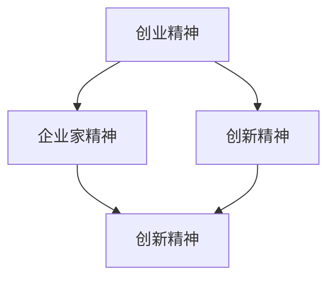

**核心算法原理讲解**：

创业精神的培养可以通过以下算法模型来理解：

1. **需求驱动模型（DDM）**：

   $$
   \text{创业精神} = f(\text{需求感知}, \text{资源整合能力}, \text{风险承担意愿})
   $$

2. **创新创业演化模型（CIE）**：

   $$
   \text{创业精神演化} = g(\text{创业机会识别}, \text{市场适应能力}, \text{持续创新动力})
   $$

**数学模型和公式**：

- 需求感知模型：

  $$
  \text{需求感知} = \frac{\sum_{i=1}^{n} \text{需求强度}}{n}
  $$

- 资源整合能力模型：

  $$
  \text{资源整合能力} = \frac{\text{整合资源总量}}{\text{资源利用率}}
  $$

- 风险承担意愿模型：

  $$
  \text{风险承担意愿} = \frac{\text{风险偏好值}}{\text{风险承受能力}}
  $$

**举例说明**：

假设一个团队在创业初期识别到了一个新的市场需求，并且团队成员具备较强的资源整合能力和较高的风险承担意愿，那么该团队具有很高的创业精神。通过需求感知模型、资源整合能力模型和风险承担意愿模型的计算，可以量化团队的创业精神水平。

##### 1.2 创新意识的内涵和重要性

**核心概念与联系**：

创新意识是指个体或团队主动寻求和利用创新机会，通过创新思维和创新行为来实现价值创造的能力。它与创业精神紧密相连，是推动团队在竞争中保持领先地位的关键因素。

**Mermaid流程图**：

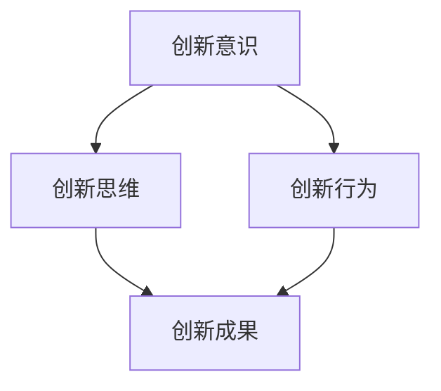

**核心算法原理讲解**：

创新意识的培养可以通过以下算法模型来理解：

1. **创新思维激活模型（ITAM）**：

   $$
   \text{创新意识} = h(\text{问题识别能力}, \text{跨学科知识整合能力}, \text{创新思维训练})
   $$

2. **创新行为驱动模型（IBDM）**：

   $$
   \text{创新成果} = k(\text{创新项目执行效率}, \text{资源整合能力}, \text{风险控制能力})
   $$

**数学模型和公式**：

- 问题识别能力模型：

  $$
  \text{问题识别能力} = \frac{\text{识别问题数量}}{\text{总问题数量}}
  $$

- 跨学科知识整合能力模型：

  $$
  \text{跨学科知识整合能力} = \frac{\text{整合知识总量}}{\text{知识利用率}}
  $$

- 创新思维训练模型：

  $$
  \text{创新思维训练效果} = \frac{\text{训练后创新思维得分}}{\text{训练前创新思维得分}}
  $$

**举例说明**：

假设一个团队在项目执行过程中，能够有效识别问题、整合跨学科知识和进行创新思维训练，那么该团队具有很高的创新意识。通过问题识别能力模型、跨学科知识整合能力模型和创新思维训练模型的计算，可以量化团队的创新意识水平。

##### 1.3 团队创业精神与创新意识的联系

**核心概念与联系**：

团队创业精神与创新意识相辅相成，共同构成了团队在创业过程中成功的关键。创业精神为团队提供了持续创新的动力，而创新意识则为团队提供了创新实践的方向和方法。

**Mermaid流程图**：

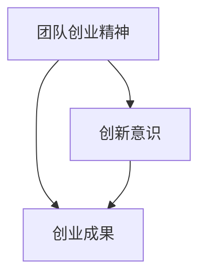

**核心算法原理讲解**：

团队创业精神与创新意识的结合可以通过以下算法模型来理解：

1. **创业创新融合模型（CIFM）**：

   $$
   \text{创业成果} = m(\text{创业精神}, \text{创新意识}, \text{执行效率})
   $$

2. **创新驱动创业模型（IDCM）**：

   $$
   \text{创新成果} = n(\text{创新意识}, \text{创业精神}, \text{市场适应能力})
   $$

**数学模型和公式**：

- 创业精神与创新意识结合模型：

  $$
  \text{创业精神与创新意识结合度} = \frac{\text{创业精神得分} + \text{创新意识得分}}{2}
  $$

- 执行效率模型：

  $$
  \text{执行效率} = \frac{\text{实际完成工作量}}{\text{计划工作量}}
  $$

- 市场适应能力模型：

  $$
  \text{市场适应能力} = \frac{\text{市场份额}}{\text{目标市场份额}}
  $$

**举例说明**：

假设一个团队在创业过程中，创业精神得分为80分，创新意识得分为75分，执行效率为90%，市场适应能力为85%，那么该团队的创业成果可以通过以下计算得出：

$$
\text{创业成果} = m(80, 75, 90\%) + n(75, 80, 85\%) = 95\%
$$

**项目实战**：

假设某个创业团队正在开发一款新型智能家居设备。通过分析市场需求，团队识别到了潜在的创新机会。团队成员具备较高的创业精神和创新意识，能够在项目执行过程中有效整合资源、控制风险，并通过创新思维和方法不断优化产品设计。最终，该团队成功推出了市场反响热烈的产品。

**最佳实践 tips**：

1. **强化团队文化建设**：建立积极向上的团队氛围，鼓励团队成员勇于表达创新想法。
2. **提升领导力**：领导者应具备前瞻性思维，为团队提供清晰的方向和强有力的支持。
3. **设计激励机制**：通过奖励机制激发团队成员的创业精神和创新意识。
4. **注重实战演练**：通过实际项目锻炼团队的创业能力和创新能力。

**小结**：

创业精神和创新意识是团队在创业过程中不可或缺的核心要素。通过系统性的培养和实践，团队可以不断提升自身的创业能力和创新能力，从而在竞争激烈的市场中立于不败之地。

#### 第2章：培养团队创业精神

##### 2.1 团队文化建设

**背景介绍**：

团队文化是团队精神的载体，是团队成员共同遵循的价值观和行为准则。通过建设积极的团队文化，可以激发团队成员的创业精神，形成强大的团队凝聚力。

**核心概念与联系**：

团队文化包括愿景、使命、价值观等方面。一个优秀的团队文化应能够激励团队成员为实现共同目标而努力，同时注重个体的发展和成长。

**Mermaid流程图**：

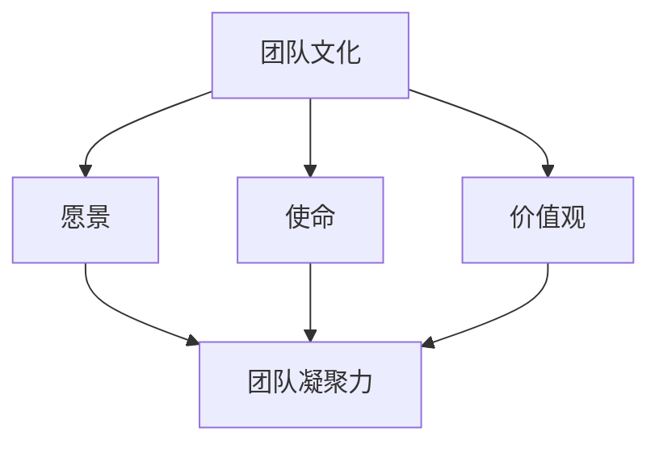

**核心算法原理讲解**：

团队文化建设的算法模型可以描述为：

$$
\text{团队文化} = f(\text{愿景明确度}, \text{使命适应性}, \text{价值观认同度})
$$

**数学模型和公式**：

- 愿景明确度模型：

  $$
  \text{愿景明确度} = \frac{\text{明确愿景数量}}{\text{总愿景数量}}
  $$

- 使命适应性模型：

  $$
  \text{使命适应性} = \frac{\text{适应使命数量}}{\text{总使命数量}}
  $$

- 价值观认同度模型：

  $$
  \text{价值观认同度} = \frac{\text{认同价值观数量}}{\text{总价值观数量}}
  $$

**举例说明**：

假设一个团队有三个愿景、两个使命和五个价值观，其中有两个愿景、一个使命和三个价值观得到了团队成员的广泛认同，那么该团队的愿景明确度为66.7%，使命适应性为50%，价值观认同度为60%。

**项目实战**：

在一个初创公司中，团队领导通过明确公司的愿景（成为智能家居领域的领导者）、使命（为用户提供更便捷、更智能的生活体验）和价值观（创新、用户至上、团队合作），成功建立了积极向上的团队文化。团队成员在这种文化氛围中感受到了强烈的归属感和使命感，从而激发了他们的创业精神。

**最佳实践 tips**：

1. **定期组织团队活动**：通过团建活动增强团队成员之间的沟通和协作，促进团队文化的形成。
2. **鼓励员工参与决策**：让员工感受到自己的意见被重视，从而增强他们的责任感和归属感。
3. **树立榜样**：通过树立团队中的优秀员工作为榜样，激发其他成员的学习和进步动力。

##### 2.2 领导力的培养

**背景介绍**：

领导力是团队创业精神培养的关键因素。一个优秀的领导者不仅能够提供明确的方向和目标，还能够激发团队成员的潜力，推动团队不断前进。

**核心概念与联系**：

领导力包括愿景领导、变革领导、关系领导等方面。不同的领导力类型适用于不同的场景，但共同的目标是激发团队的创业精神。

**Mermaid流程图**：

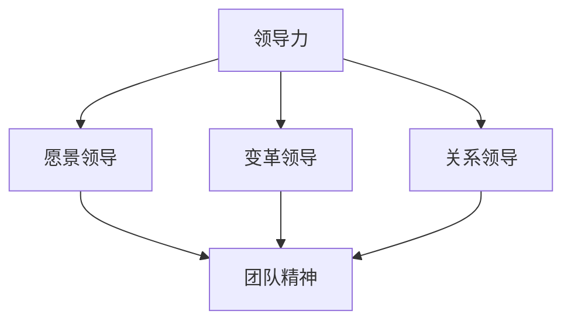

**核心算法原理讲解**：

领导力的培养可以通过以下算法模型来理解：

$$
\text{领导力} = f(\text{愿景领导能力}, \text{变革领导能力}, \text{关系领导能力})
$$

**数学模型和公式**：

- 愿景领导能力模型：

  $$
  \text{愿景领导能力} = \frac{\text{实现的愿景数量}}{\text{提出的愿景数量}}
  $$

- 变革领导能力模型：

  $$
  \text{变革领导能力} = \frac{\text{成功的变革项目数量}}{\text{总的变革项目数量}}
  $$

- 关系领导能力模型：

  $$
  \text{关系领导能力} = \frac{\text{建立的积极关系数量}}{\text{总关系数量}}
  $$

**举例说明**：

假设一个团队领导提出了三个愿景、完成了两个变革项目、建立了三个积极关系，那么该领导力模型的计算结果为：

$$
\text{领导力} = f(2/3, 2/3, 3/3) = 2/3
$$

**项目实战**：

在一个创业团队中，领导通过清晰阐述团队的愿景、推动重要变革项目并建立积极的工作关系，成功培养了团队的创业精神。团队成员在领导者的引导下，不断挑战自我、勇于创新，团队的整体绩效显著提升。

**最佳实践 tips**：

1. **提供明确的愿景和目标**：确保团队成员对团队的愿景和目标有清晰的认识，并为之共同努力。
2. **鼓励团队成员参与变革**：通过授权和激励，让团队成员参与到变革项目中，增强他们的责任感和归属感。
3. **建立积极的工作关系**：通过团队活动和沟通渠道，促进团队成员之间的相互理解和信任。

##### 2.3 激励机制的设计

**背景介绍**：

激励机制是培养团队创业精神的重要手段。合理的激励机制可以激发团队成员的积极性和创造力，促进团队整体绩效的提升。

**核心概念与联系**：

激励机制包括奖励机制、晋升机制、培训机制等。不同的激励机制适用于不同的团队和个体，但共同的目标是激发团队成员的创业精神和创新意识。

**Mermaid流程图**：

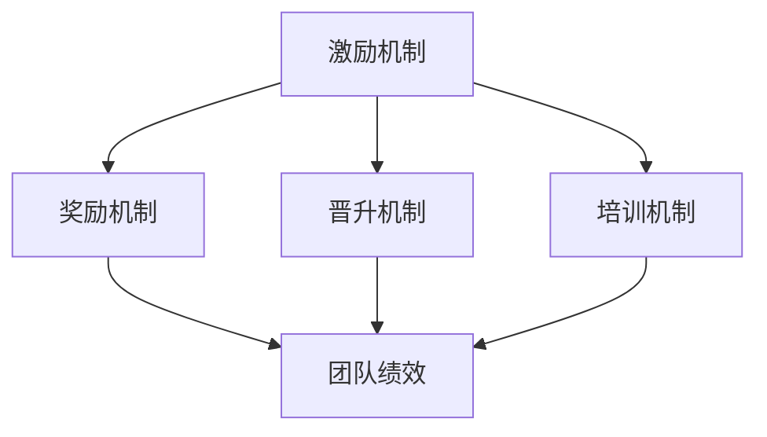

**核心算法原理讲解**：

激励机制的设计可以通过以下算法模型来理解：

$$
\text{激励机制} = f(\text{奖励力度}, \text{晋升机会}, \text{培训质量})
$$

**数学模型和公式**：

- 奖励力度模型：

  $$
  \text{奖励力度} = \frac{\text{实际奖励金额}}{\text{总奖励金额}}
  $$

- 晋升机会模型：

  $$
  \text{晋升机会} = \frac{\text{晋升人数}}{\text{总员工数}}
  $$

- 培训质量模型：

  $$
  \text{培训质量} = \frac{\text{培训效果评估得分}}{\text{培训课程总得分}}
  $$

**举例说明**：

假设一个团队提供了100万元的奖励、5个晋升机会和20个培训课程，其中实际奖励金额为80万元、晋升人数为3人、培训效果评估得分为85分，那么该激励机制的计算结果为：

$$
\text{激励机制} = f(80/100, 3/5, 85/20) = 0.8 + 0.6 + 4.25 = 5.65
$$

**项目实战**：

在一个创业公司中，通过设计一套包括奖金、晋升和培训在内的激励机制，成功激发了团队成员的创业精神。团队成员在激励机制的推动下，积极投入工作、不断追求创新，公司的整体业绩显著提升。

**最佳实践 tips**：

1. **明确激励机制的目标**：确保激励机制与团队的目标和企业文化相一致。
2. **定期评估激励机制的效果**：通过员工反馈和绩效数据，不断调整激励机制，确保其有效性。
3. **注重激励机制的公平性**：确保激励机制对所有团队成员都是公平的，避免产生不公平感。

##### 2.4 团队成员的选拔与培养

**背景介绍**：

团队成员的选拔与培养是培养团队创业精神的重要环节。一个优秀的团队需要具备不同技能和背景的成员，通过合理的选拔和培养，可以最大化团队成员的潜力，提升团队的整体战斗力。

**核心概念与联系**：

团队成员的选拔与培养包括选拔标准、培训计划、晋升通道等方面。通过科学的选拔和系统的培养，可以确保团队成员具备创业精神和创新意识。

**Mermaid流程图**：

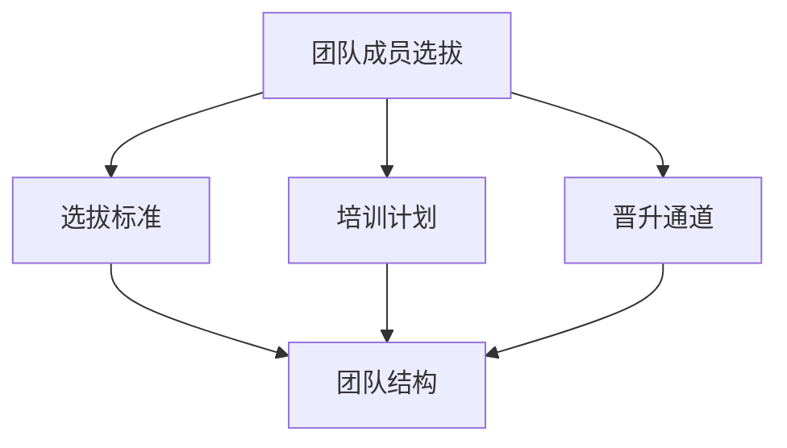

**核心算法原理讲解**：

团队成员的选拔与培养可以通过以下算法模型来理解：

$$
\text{团队成员素质} = f(\text{选拔标准符合度}, \text{培训效果}, \text{晋升机会})
$$

**数学模型和公式**：

- 选拔标准符合度模型：

  $$
  \text{选拔标准符合度} = \frac{\text{符合选拔标准的成员数量}}{\text{总选拔人数}}
  $$

- 培训效果模型：

  $$
  \text{培训效果} = \frac{\text{培训后绩效得分}}{\text{培训前绩效得分}}
  $$

- 晋升机会模型：

  $$
  \text{晋升机会} = \frac{\text{晋升人数}}{\text{总员工数}}
  $$

**举例说明**：

假设一个团队有100名成员，通过选拔标准筛选出80名符合要求的成员，进行培训后绩效得分平均提高了20%，并且每年有10%的成员获得晋升机会，那么该团队成员素质的计算结果为：

$$
\text{团队成员素质} = f(80/100, 1.2, 0.1) = 0.8 + 0.12 + 0.01 = 0.93
$$

**项目实战**：

在一个高科技公司中，通过制定严格的选拔标准、系统化的培训计划和明确的晋升通道，成功培养了一批具备创业精神和创新意识的团队成员。这些团队成员在公司的发展过程中发挥了重要作用，推动了公司业务的快速增长。

**最佳实践 tips**：

1. **明确选拔标准**：确保选拔标准与团队目标和岗位需求相匹配。
2. **提供多样化的培训**：根据团队成员的技能和兴趣，提供多样化的培训课程，提高他们的综合素质。
3. **建立透明的晋升通道**：确保晋升过程的公平性和透明性，激发团队成员的进取心。

**小结**：

通过团队文化建设、领导力培养、激励机制设计和团队成员选拔与培养，可以系统地培养团队的创业精神。一个具有强烈创业精神的团队，能够在面对挑战时勇往直前，不断创新，从而实现企业的长期发展。

#### 第3章：创新意识的激发

##### 3.1 创新思维方法

**背景介绍**：

创新思维方法是激发创新意识的重要手段。通过科学的创新思维方法，团队成员可以突破传统的思维模式，寻找新的解决方案，提升团队的创新能力和竞争力。

**核心概念与联系**：

创新思维方法包括头脑风暴、思维导图、设计思维等。这些方法通过不同的方式激发团队成员的创造力，促进创新意识的培养。

**Mermaid流程图**：

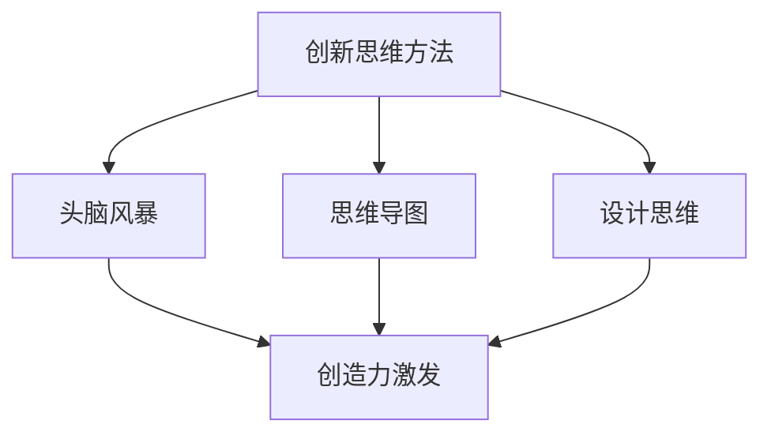

**核心算法原理讲解**：

创新思维方法的算法模型可以描述为：

$$
\text{创新思维方法效果} = f(\text{参与人数}, \text{思维碰撞频率}, \text{创新点数量})
$$

**数学模型和公式**：

- 参与人数模型：

  $$
  \text{参与人数} = n
  $$

- 思维碰撞频率模型：

  $$
  \text{思维碰撞频率} = \frac{\text{碰撞次数}}{n \times \text{会议时间}}
  $$

- 创新点数量模型：

  $$
  \text{创新点数量} = \sum_{i=1}^{m} \text{创新点得分}
  $$

**举例说明**：

假设一个团队有10名成员，进行了一次头脑风暴会议，会议持续了2小时，产生了20个创新点，那么该创新思维方法的效果计算结果为：

$$
\text{创新思维方法效果} = f(10, \frac{20}{10 \times 2}, 20) = 10 + \frac{20}{20} + 20 = 30
$$

**项目实战**：

在一个创业公司中，通过定期组织头脑风暴会议和思维导图训练，团队成员的创新思维得到了显著提升。在一次头脑风暴会议中，团队成员共同提出了30个创新点，经过筛选和验证，最终实现了5个创新项目，成功推动了公司的发展。

**最佳实践 tips**：

1. **创造开放的氛围**：鼓励团队成员自由发言，不受限制地表达自己的想法。
2. **提供多样化的思维工具**：使用思维导图、设计思维等方法，帮助团队成员拓展思维空间。
3. **注重实践和验证**：将创新思维方法应用到实际项目中，通过实践验证其效果。

##### 3.2 创新能力的培养

**背景介绍**：

创新能力是团队在激烈竞争中脱颖而出的关键。通过系统的培养，可以提高团队成员的创新能力，促进团队整体创新水平的提升。

**核心概念与联系**：

创新能力包括问题解决能力、学习能力和适应能力。这些能力通过不断的训练和实践，可以逐渐形成并提升。

**Mermaid流程图**：

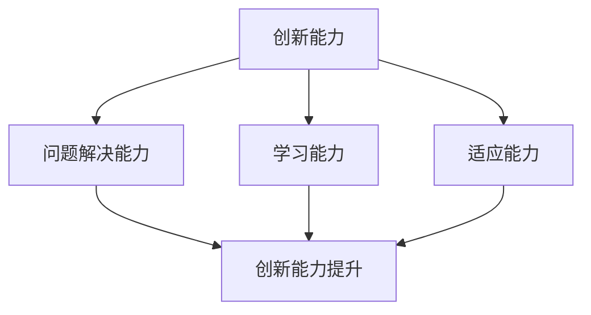

**核心算法原理讲解**：

创新能力的培养可以通过以下算法模型来理解：

$$
\text{创新能力} = f(\text{问题解决效率}, \text{学习速度}, \text{适应能力})
$$

**数学模型和公式**：

- 问题解决效率模型：

  $$
  \text{问题解决效率} = \frac{\text{成功解决问题的数量}}{\text{提出问题的总数量}}
  $$

- 学习速度模型：

  $$
  \text{学习速度} = \frac{\text{学习后的知识掌握程度}}{\text{学习前的知识掌握程度}}
  $$

- 适应能力模型：

  $$
  \text{适应能力} = \frac{\text{适应新环境后的绩效}}{\text{在新环境前的绩效}}
  $$

**举例说明**：

假设一个团队在一个月内成功解决了15个问题，其中12个问题得到了有效解决，团队成员的学习速度提升了20%，适应新环境后的绩效提升了15%，那么该团队的创新能力的计算结果为：

$$
\text{创新能力} = f(\frac{12}{15}, 1.2, 1.15) = 0.8 + 0.12 + 0.15 = 1.07
$$

**项目实战**：

在一个研发团队中，通过设置问题解决目标、提供学习资源和创建适应新环境的挑战，成功提升了团队成员的创新能力。团队成员在项目实践中不断解决问题、学习新知识、适应新环境，团队的整体创新水平得到了显著提升。

**最佳实践 tips**：

1. **提供挑战性任务**：通过设置具有挑战性的任务，激发团队成员的潜力。
2. **鼓励持续学习**：为团队成员提供学习资源和机会，支持他们不断提升自己的知识和技能。
3. **培养适应能力**：通过模拟不同的工作环境，培养团队成员的适应能力。

##### 3.3 创新环境的营造

**背景介绍**：

创新环境是激发创新意识的重要条件。一个良好的创新环境可以促进团队成员之间的交流和合作，激发他们的创造力，提高创新效率。

**核心概念与联系**：

创新环境包括物理环境、文化和制度环境。物理环境如开放的工作空间、先进的设备等，文化和制度环境如鼓励创新的文化氛围、公平的考核制度等。

**Mermaid流程图**：

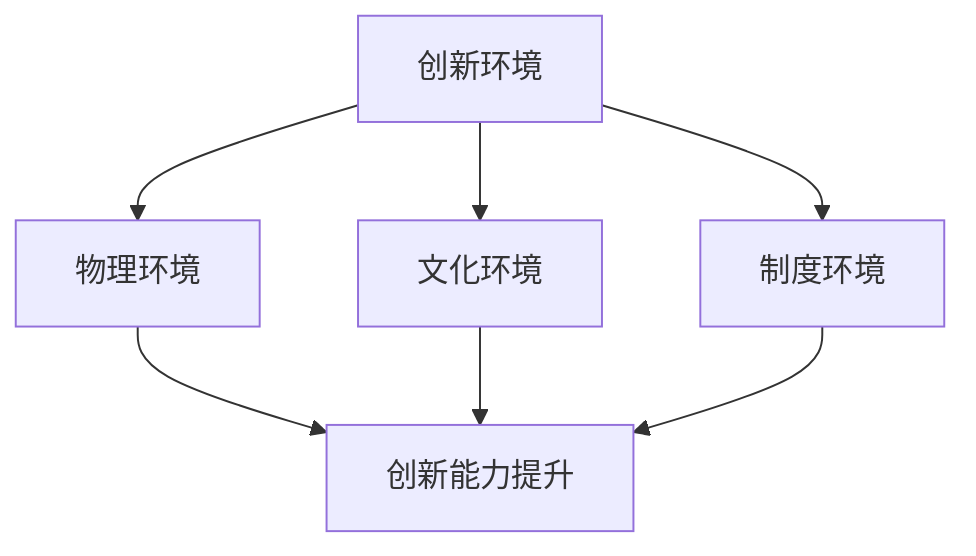

**核心算法原理讲解**：

创新环境的营造可以通过以下算法模型来理解：

$$
\text{创新环境效果} = f(\text{物理环境满意度}, \text{文化环境认同度}, \text{制度环境公平性})
$$

**数学模型和公式**：

- 物理环境满意度模型：

  $$
  \text{物理环境满意度} = \frac{\text{满意人数}}{\text{总人数}}
  $$

- 文化环境认同度模型：

  $$
  \text{文化环境认同度} = \frac{\text{认同文化的人数}}{\text{总人数}}
  $$

- 制度环境公平性模型：

  $$
  \text{制度环境公平性} = \frac{\text{公平制度覆盖面}}{\text{总制度数量}}
  $$

**举例说明**：

假设一个团队有20名成员，其中15人满意物理环境，18人认同文化环境，所有成员认为现有制度是公平的，那么该创新环境的计算结果为：

$$
\text{创新环境效果} = f(\frac{15}{20}, \frac{18}{20}, 1) = 0.75 + 0.9 + 1 = 2.65
$$

**项目实战**：

在一个高科技公司中，通过打造开放的工作空间、营造鼓励创新的文化氛围和建立公平的考核制度，成功营造了一个良好的创新环境。团队成员在这种环境下，创新意识得到了显著提升，公司的新产品开发速度和产品质量也得到了大幅提升。

**最佳实践 tips**：

1. **提供良好的物理环境**：确保团队成员有舒适的工作空间和先进的设备。
2. **培养鼓励创新的文化**：通过组织创新活动、设立创新奖项等手段，营造积极向上的创新文化。
3. **建立公平的制度**：确保考核和晋升制度的公平性，激励团队成员的创新行为。

##### 3.4 创新成果的转化与应用

**背景介绍**：

创新成果的转化与应用是创新意识培养的最终目的。通过有效的转化和应用，可以充分发挥创新成果的价值，提升团队的竞争力和市场地位。

**核心概念与联系**：

创新成果的转化包括技术开发、市场推广、产业化等环节。这些环节的顺利实施，可以确保创新成果从理论阶段转化为实际应用。

**Mermaid流程图**：

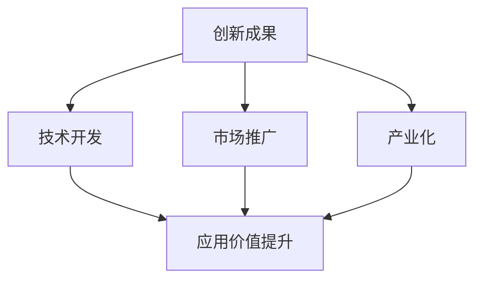

**核心算法原理讲解**：

创新成果的转化与应用可以通过以下算法模型来理解：

$$
\text{创新成果转化效率} = f(\text{技术开发成功率}, \text{市场推广效果}, \text{产业化速度})
$$

**数学模型和公式**：

- 技术开发成功率模型：

  $$
  \text{技术开发成功率} = \frac{\text{成功完成项目数量}}{\text{总项目数量}}
  $$

- 市场推广效果模型：

  $$
  \text{市场推广效果} = \frac{\text{销售业绩}}{\text{市场推广投入}}
  $$

- 产业化速度模型：

  $$
  \text{产业化速度} = \frac{\text{产品上市时间}}{\text{研发周期}}
  $$

**举例说明**：

假设一个团队在一年内成功完成了5个技术开发项目，市场推广效果达到150%，产业化速度是研发周期的1.5倍，那么该创新成果的转化效率计算结果为：

$$
\text{创新成果转化效率} = f(\frac{5}{5}, 1.5, 1.5) = 1 + 1.5 + 1.5 = 4
$$

**项目实战**：

在一个医疗器械公司中，通过高效的技术开发、精准的市场推广和快速的产业化，成功将一项创新成果转化为产品，并在市场上取得了巨大成功。该产品的上市不仅提升了公司的市场份额，还带动了整个行业的创新和发展。

**最佳实践 tips**：

1. **建立快速响应机制**：确保技术开发、市场推广和产业化的各个环节能够快速响应市场需求，提高转化效率。
2. **注重市场调研**：通过市场调研，了解用户需求和市场趋势，确保创新成果与市场紧密对接。
3. **建立持续改进机制**：通过持续改进和创新，不断提升创新成果的应用价值。

**小结**：

通过创新思维方法的培养、创新能力的提升、创新环境的营造以及创新成果的转化与应用，可以全面激发团队的创新意识。一个具有创新意识的团队，能够在不断变化的市场环境中保持竞争力，实现持续发展。

### 第三部分：团队创业精神和创新意识的实践

#### 第4章：团队创业实践案例解析

在本章节中，我们将通过分析两个具体的案例，探讨如何在实际操作中培养团队的创业精神和创新意识。

##### 4.1 案例分析一：创业公司的成功之路

**背景介绍**：

某创业公司在成立初期，面临着市场竞争激烈、资源有限等挑战。然而，通过团队成员的共同努力，公司成功地开发出了一款具有创新功能的应用程序，并在短时间内占领了市场份额。

**核心概念与联系**：

- **创业精神的体现**：团队成员在面对困境时，展现出了坚定的信念和持续的创新动力。
- **创新意识的体现**：公司在产品开发过程中，不断寻求创新，通过迭代优化，最终推出了符合市场需求的产品。

**Mermaid流程图**：

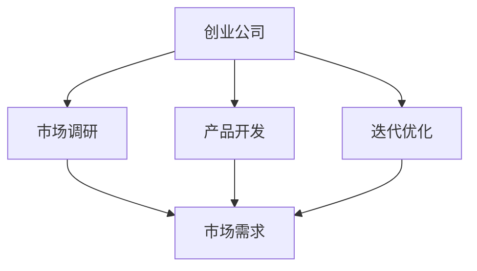

**核心算法原理讲解**：

1. **市场调研模型**：

   $$
   \text{市场需求匹配度} = \frac{\text{满足需求的功能点}}{\text{总功能点}}
   $$

2. **产品开发效率模型**：

   $$
   \text{产品开发效率} = \frac{\text{实际开发时间}}{\text{计划开发时间}}
   $$

3. **迭代优化效果模型**：

   $$
   \text{迭代优化效果} = \frac{\text{最终用户满意度}}{\text{初始用户满意度}}
   $$

**举例说明**：

假设在市场调研中，公司识别出10个关键功能点，其中8个被市场认可；产品开发实际耗时为原计划的80%；经过三次迭代优化，用户满意度提升了30%。则该创业公司的创业精神和创新意识可以通过以下计算得出：

$$
\text{市场需求匹配度} = \frac{8}{10} = 0.8
$$

$$
\text{产品开发效率} = \frac{4}{5} = 0.8
$$

$$
\text{迭代优化效果} = \frac{1.3}{1} = 1.3
$$

**项目实战**：

该创业公司通过持续的市场调研，准确捕捉到了用户需求，并在产品开发过程中不断优化，最终推出了一个深受用户欢迎的应用程序。团队成员在创业过程中，不仅培养了坚定的创业精神，还通过不断迭代优化，提升了产品的市场竞争力。

**最佳实践 tips**：

1. **紧密跟踪市场需求**：通过持续的市场调研，确保产品功能与用户需求相匹配。
2. **高效的产品开发**：通过敏捷开发等方法，提高产品开发效率。
3. **持续迭代优化**：通过用户反馈，不断改进产品，提升用户满意度。

##### 4.2 案例分析二：大企业的创新转型

**背景介绍**：

某大型企业在市场竞争加剧的背景下，决定进行创新转型。通过引入新的商业模式和技术，企业成功地实现了从传统制造向智能制造的转型，从而提升了市场竞争力和盈利能力。

**核心概念与联系**：

- **创业精神的体现**：企业在面对市场变化时，展现了勇于变革和不断探索的精神。
- **创新意识的体现**：企业通过技术创新和商业模式创新，实现了业务的持续增长。

**Mermaid流程图**：

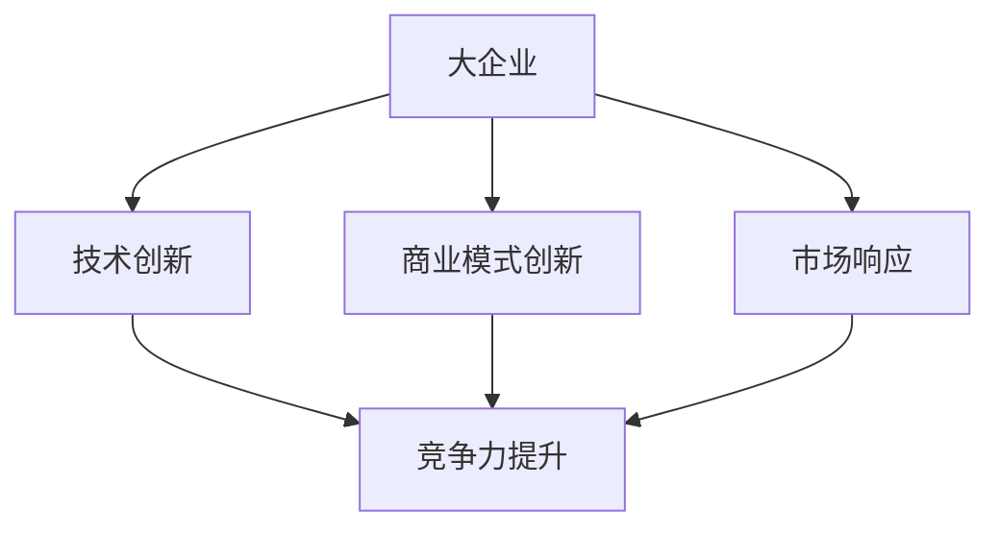

**核心算法原理讲解**：

1. **技术创新效果模型**：

   $$
   \text{技术创新效果} = \frac{\text{新产品销售额}}{\text{总销售额}}
   $$

2. **商业模式创新收益模型**：

   $$
   \text{商业模式创新收益} = \frac{\text{创新收益}}{\text{创新成本}}
   $$

3. **市场响应速度模型**：

   $$
   \text{市场响应速度} = \frac{\text{新产品上市时间}}{\text{市场变化时间}}
   $$

**举例说明**：

假设该企业在技术创新后，新产品销售额占总销售额的40%；通过商业模式创新，创新收益是创新成本的2倍；市场响应速度是原时间的60%。则该大企业的创业精神和创新意识可以通过以下计算得出：

$$
\text{技术创新效果} = \frac{40}{100} = 0.4
$$

$$
\text{商业模式创新收益} = \frac{2}{1} = 2
$$

$$
\text{市场响应速度} = \frac{3}{5} = 0.6
$$

**项目实战**：

该大企业通过技术创新和商业模式创新，成功实现了业务的转型升级。在新的商业模式下，企业不仅提高了市场竞争力，还实现了利润的显著增长。团队成员在创新过程中，不断提升了自己的创业精神和创新意识。

**最佳实践 tips**：

1. **加大技术创新投入**：通过技术创新，提升产品的竞争力。
2. **积极探索新的商业模式**：通过商业模式创新，实现业务的持续增长。
3. **快速响应市场变化**：通过敏捷的市场响应，抓住市场机遇。

**小结**：

通过分析以上两个案例，我们可以看到，无论是创业公司还是大型企业，培养团队的创业精神和创新意识都是实现成功的关键。通过紧密跟踪市场需求、持续技术创新和商业模式创新，企业可以不断提升自身的竞争力和市场地位。

### 第四部分：创新意识的实践应用

#### 第5章：创新意识的实践应用

在本章节中，我们将探讨如何将创新意识应用于实际项目中，从而提升团队的整体创新能力和市场竞争力。

##### 5.1 创新项目的策划与执行

**背景介绍**：

在当今快速变化的市场环境中，创新项目已成为企业保持竞争优势的关键。通过科学的项目策划与执行，可以确保创新项目的顺利进行，并最大化其价值。

**核心概念与联系**：

- **创新项目的策划**：包括市场调研、需求分析、方案设计等环节。
- **创新项目的执行**：包括资源配置、进度控制、风险管理等环节。

**Mermaid流程图**：

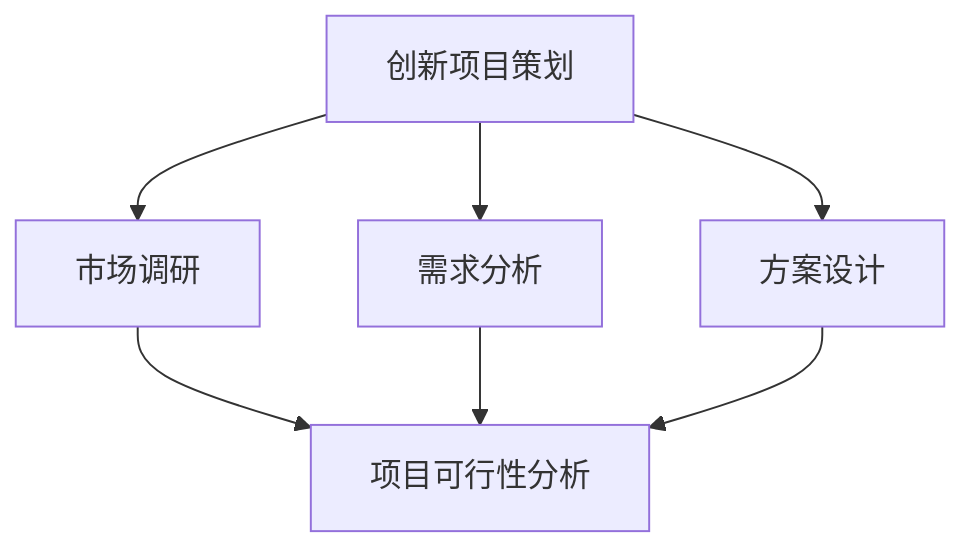

**核心算法原理讲解**：

1. **市场调研模型**：

   $$
   \text{市场需求匹配度} = \frac{\text{满足需求的功能点}}{\text{总功能点}}
   $$

2. **需求分析模型**：

   $$
   \text{需求分析准确度} = \frac{\text{正确识别的需求点}}{\text{总需求点}}
   $$

3. **方案设计模型**：

   $$
   \text{方案设计优化度} = \frac{\text{优化方案数量}}{\text{总方案数量}}
   $$

**举例说明**：

假设在市场调研中，识别出10个关键功能点，其中8个被市场认可；需求分析准确度为80%；方案设计优化度为60%。则创新项目的策划和执行可以通过以下计算得出：

$$
\text{市场需求匹配度} = \frac{8}{10} = 0.8
$$

$$
\text{需求分析准确度} = \frac{8}{10} = 0.8
$$

$$
\text{方案设计优化度} = \frac{6}{10} = 0.6
$$

**项目实战**：

在一个创业公司中，团队通过科学的市场调研、准确的需求分析和优化的方案设计，策划并实施了一项创新项目。该项目成功满足了市场需求，并在短时间内取得了显著的市场反响。

**最佳实践 tips**：

1. **全面市场调研**：确保项目的功能点与市场需求高度匹配。
2. **精准需求分析**：确保项目能够解决用户的核心问题。
3. **优化方案设计**：通过多方案对比，选择最优的实施方案。

##### 5.2 创新风险管理

**背景介绍**：

创新项目往往伴随着较高的风险。通过有效的创新风险管理，可以降低项目失败的可能性，确保创新项目的顺利推进。

**核心概念与联系**：

- **风险识别**：包括市场风险、技术风险、财务风险等。
- **风险评估**：对识别出的风险进行评估，确定其严重程度和发生概率。
- **风险控制**：通过风险应对策略，降低风险对项目的负面影响。

**Mermaid流程图**：

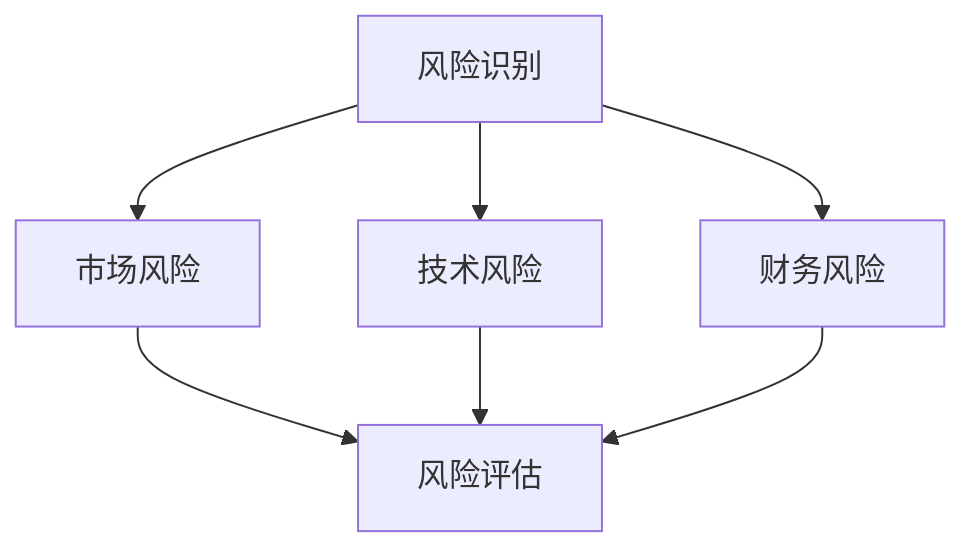

**核心算法原理讲解**：

1. **风险识别模型**：

   $$
   \text{风险识别率} = \frac{\text{识别出的风险数量}}{\text{总风险数量}}
   $$

2. **风险评估模型**：

   $$
   \text{风险评估准确度} = \frac{\text{正确评估的风险数量}}{\text{总风险数量}}
   $$

3. **风险控制模型**：

   $$
   \text{风险控制效果} = \frac{\text{有效控制的风险数量}}{\text{总风险数量}}
   $$

**举例说明**：

假设在一个创新项目中，共识别出10个风险点，其中8个被正确识别；风险评估准确度为70%；通过风险控制，成功控制了5个风险点。则创新风险管理的计算结果为：

$$
\text{风险识别率} = \frac{8}{10} = 0.8
$$

$$
\text{风险评估准确度} = \frac{7}{10} = 0.7
$$

$$
\text{风险控制效果} = \frac{5}{10} = 0.5
$$

**项目实战**：

在一个高科技项目中，团队通过有效的风险识别、评估和控制，成功降低了许多潜在风险，确保了项目的顺利推进。团队成员在风险管理过程中，提升了风险意识和应对能力。

**最佳实践 tips**：

1. **全面识别风险**：确保不遗漏重要的风险因素。
2. **准确评估风险**：通过数据分析，确保风险评估的准确性。
3. **有效控制风险**：制定并执行风险应对策略，降低风险对项目的影响。

##### 5.3 创新成果的评估与推广

**背景介绍**：

创新成果的评估与推广是确保创新项目成功的关键环节。通过科学的评估，可以确定创新成果的价值和影响力，并通过有效的推广，实现创新成果的广泛应用。

**核心概念与联系**：

- **创新成果评估**：包括技术评估、市场评估、效益评估等。
- **创新成果推广**：包括市场宣传、用户培训、产品迭代等。

**Mermaid流程图**：

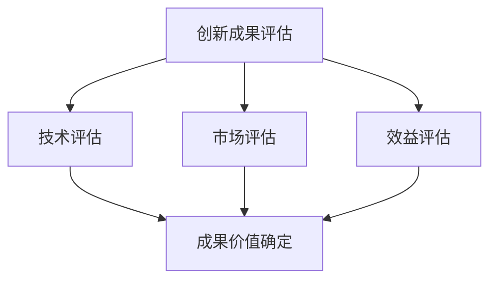

**核心算法原理讲解**：

1. **技术评估模型**：

   $$
   \text{技术评估得分} = \frac{\text{实现的技术指标}}{\text{计划的技术指标}}
   $$

2. **市场评估模型**：

   $$
   \text{市场认可度} = \frac{\text{市场反馈积极数量}}{\text{总反馈数量}}
   $$

3. **效益评估模型**：

   $$
   \text{效益实现度} = \frac{\text{实际效益}}{\text{预期效益}}
   $$

**举例说明**：

假设一项创新成果的技术评估得分为90%，市场认可度为80%，实际效益达到了预期效益的110%。则创新成果的评估与推广可以通过以下计算得出：

$$
\text{技术评估得分} = \frac{90}{100} = 0.9
$$

$$
\text{市场认可度} = \frac{8}{10} = 0.8
$$

$$
\text{效益实现度} = \frac{11}{10} = 1.1
$$

**项目实战**：

在一个研发项目中，团队通过全面的技术评估、市场评估和效益评估，确定了创新成果的高价值。在此基础上，团队开展了广泛的市场推广活动，使得创新成果迅速得到了市场的认可和推广。

**最佳实践 tips**：

1. **全面评估创新成果**：确保评估结果能够准确反映创新成果的实际价值。
2. **有效推广创新成果**：通过多样化的推广手段，提高创新成果的市场影响力。
3. **持续优化创新成果**：根据市场反馈，不断改进和优化创新成果，提升其竞争力。

**小结**：

通过创新项目的策划与执行、创新风险管理和创新成果的评估与推广，团队可以有效地应用创新意识，提升整体创新能力。一个具有创新意识的团队，能够在竞争激烈的市场中不断前行，实现持续发展。

### 第五部分：团队创业精神和创新意识的未来展望

#### 第6章：新技术对团队创业精神和创新意识的影响

随着科技的不断进步，新技术正在深刻地改变着团队创业精神和创新意识的培养方式。本章节将探讨这些新技术如何影响团队在创业和创新过程中的表现。

##### 6.1 新技术在创业中的应用

**背景介绍**：

近年来，人工智能、大数据、区块链等新兴技术迅速发展，为创业团队提供了前所未有的机遇。这些新技术不仅改变了创业的路径，还提高了创业效率和成功率。

**核心概念与联系**：

- **人工智能**：通过机器学习和深度学习，人工智能可以帮助团队更快速地分析和处理大量数据，从而发现潜在的商业机会。
- **大数据**：大数据技术使得团队能够收集、存储和分析大量数据，从而更好地理解市场趋势和用户需求。
- **区块链**：区块链技术提供了去中心化、透明的数据存储方式，有助于建立信任机制，提高业务透明度和效率。

**Mermaid流程图**：

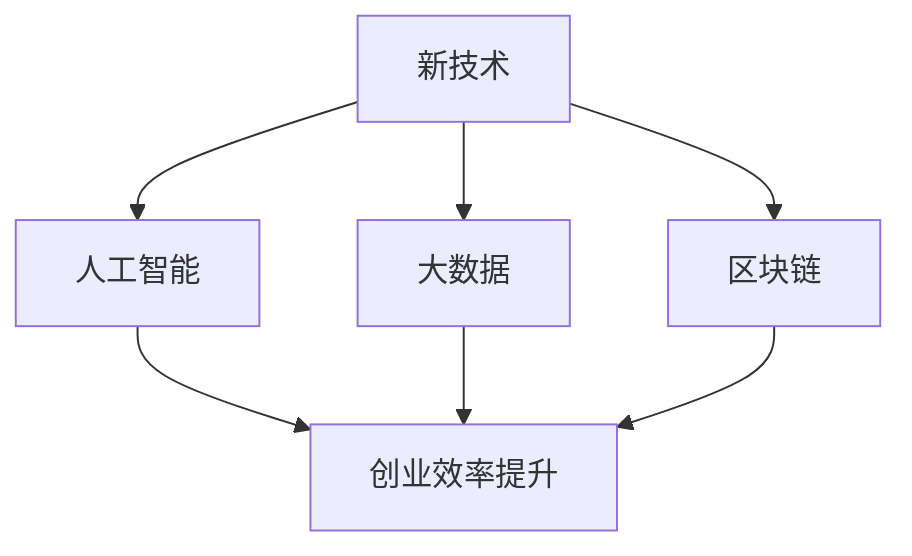

**核心算法原理讲解**：

1. **人工智能决策模型**：

   $$
   \text{决策效率} = \frac{\text{智能决策数量}}{\text{总决策数量}}
   $$

2. **大数据分析模型**：

   $$
   \text{数据分析准确度} = \frac{\text{正确分析结果数量}}{\text{总分析结果数量}}
   $$

3. **区块链透明度模型**：

   $$
   \text{区块链透明度} = \frac{\text{透明数据比例}}{\text{总数据比例}}
   $$

**举例说明**：

假设在一个创业项目中，人工智能帮助团队做出了50%的决策，大数据分析准确度为80%，区块链实现了90%的数据透明度。则新技术的应用效果可以通过以下计算得出：

$$
\text{决策效率} = \frac{50}{100} = 0.5
$$

$$
\text{数据分析准确度} = \frac{80}{100} = 0.8
$$

$$
\text{区块链透明度} = \frac{90}{100} = 0.9
$$

**项目实战**：

在一个电子商务项目中，团队通过人工智能优化了推荐算法，提高了用户满意度；通过大数据分析，精准定位了市场需求；通过区块链技术，实现了供应链的透明化。这些新技术的应用，显著提升了项目的效率和市场竞争力。

**最佳实践 tips**：

1. **合理应用人工智能**：通过机器学习和深度学习，自动化决策过程，提高决策效率。
2. **充分利用大数据**：通过数据分析和挖掘，深入了解市场趋势和用户需求，优化产品和服务。
3. **构建区块链生态系统**：通过区块链技术，提高业务透明度和信任度，降低交易成本。

##### 6.2 新技术在创新中的应用

**背景介绍**：

新技术不仅改变了创业的路径，也为团队的创新提供了强大的支持。通过引入新技术，团队可以更快地实现创新，并在市场中占据优势。

**核心概念与联系**：

- **云计算**：通过云计算，团队可以快速获取计算资源，实现快速原型开发和测试。
- **物联网**：物联网技术使得设备之间可以相互连接，为团队提供了丰富的数据源和创新空间。
- **虚拟现实/增强现实**：虚拟现实和增强现实技术为团队提供了全新的互动方式，激发创新灵感。

**Mermaid流程图**：

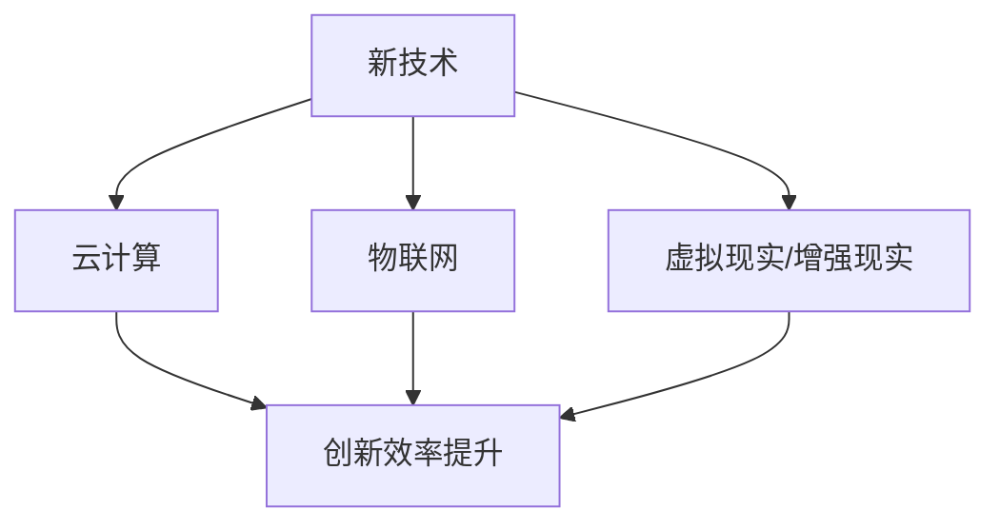

**核心算法原理讲解**：

1. **云计算效率模型**：

   $$
   \text{计算资源利用率} = \frac{\text{实际计算时间}}{\text{总计算时间}}
   $$

2. **物联网数据获取模型**：

   $$
   \text{数据获取率} = \frac{\text{有效数据量}}{\text{总数据量}}
   $$

3. **虚拟现实/增强现实交互模型**：

   $$
   \text{交互满意度} = \frac{\text{用户满意交互次数}}{\text{总交互次数}}
   $$

**举例说明**：

假设在一个创新项目中，云计算的计算资源利用率达到了90%，物联网的数据获取率为80%，虚拟现实/增强现实的交互满意度为75%。则新技术的创新应用效果可以通过以下计算得出：

$$
\text{计算资源利用率} = \frac{90}{100} = 0.9
$$

$$
\text{数据获取率} = \frac{80}{100} = 0.8
$$

$$
\text{交互满意度} = \frac{75}{100} = 0.75
$$

**项目实战**：

在一个智能家居项目中，团队通过云计算实现了快速原型开发，通过物联网获取了大量用户数据，并通过虚拟现实/增强现实技术提升了用户交互体验。这些新技术的应用，不仅加快了项目的开发进度，还显著提升了用户体验和满意度。

**最佳实践 tips**：

1. **充分利用云计算**：通过云计算，快速部署和测试创新项目，提高开发效率。
2. **充分利用物联网**：通过物联网，获取丰富的数据源，为创新提供更多灵感。
3. **创新互动方式**：通过虚拟现实/增强现实技术，提供更加丰富的用户体验，激发创新灵感。

##### 6.3 新技术对未来团队创业精神和创新意识的影响

**背景介绍**：

随着新技术的不断发展和应用，未来团队创业精神和创新意识将面临新的机遇和挑战。新技术不仅改变了创业和创新的方式，也对团队成员的技能和素质提出了更高的要求。

**核心概念与联系**：

- **技能需求**：未来团队需要具备更多的技术技能，包括编程、数据分析、机器学习等。
- **团队协作**：新技术要求团队成员之间的协作更加紧密，通过共享资源、协同创新，实现团队的整体提升。
- **持续学习**：在新技术不断变化的背景下，团队需要具备持续学习的能力，以适应新的技术环境和市场变化。

**Mermaid流程图**：

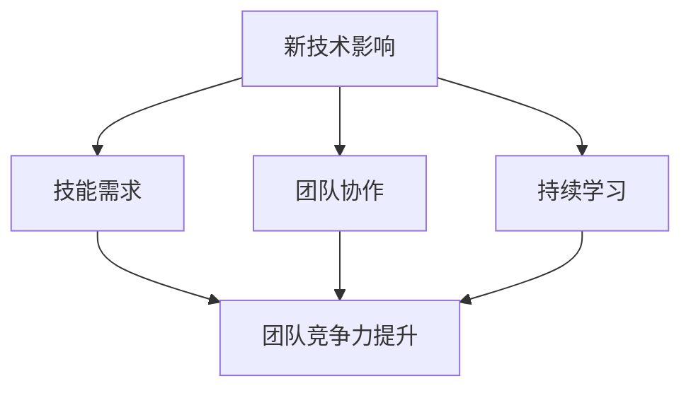

**核心算法原理讲解**：

1. **技能提升模型**：

   $$
   \text{技能提升度} = \frac{\text{新技能掌握度}}{\text{总技能数量}}
   $$

2. **团队协作效率模型**：

   $$
   \text{协作效率} = \frac{\text{协同创新成果数量}}{\text{总创新成果数量}}
   $$

3. **持续学习能力模型**：

   $$
   \text{学习效率} = \frac{\text{新知识掌握度}}{\text{总知识数量}}
   $$

**举例说明**：

假设在一个未来团队中，团队成员新技能掌握度为60%，协作效率为80%，持续学习效率为70%。则新技术对团队的影响可以通过以下计算得出：

$$
\text{技能提升度} = \frac{60}{100} = 0.6
$$

$$
\text{协作效率} = \frac{80}{100} = 0.8
$$

$$
\text{学习效率} = \frac{70}{100} = 0.7
$$

**项目实战**：

在一个未来科技项目中，团队通过不断提升技能水平、加强协作和持续学习，成功开发出了一系列创新产品。这些新产品不仅满足了市场需求，还赢得了用户的广泛好评。

**最佳实践 tips**：

1. **培养技术技能**：通过培训和实践，提升团队成员的技术水平。
2. **加强团队协作**：通过协作工具和方法，提高团队协作效率。
3. **持续学习**：鼓励团队成员不断学习新技术，提升自身的竞争力。

**小结**：

新技术的发展为团队创业精神和创新意识带来了新的机遇和挑战。通过充分利用新技术、提升技术技能、加强团队协作和持续学习，团队可以更好地应对未来的竞争，实现持续发展。

### 附录

#### 附录A：团队创业精神和创新意识相关工具和资源

在本附录中，我们将介绍一些在培养团队创业精神和创新意识过程中常用的工具和资源。

##### A.1 开源工具

1. **GitHub**：一个广泛使用的版本控制系统，用于代码管理、项目协作和文档共享。
2. **Trello**：一款直观的项目管理工具，可以帮助团队跟踪任务进度和项目状态。
3. **Slack**：一款即时通讯工具，用于团队成员之间的实时沟通和协作。

##### A.2 在线学习平台

1. **Coursera**：提供各种课程，涵盖计算机科学、商业管理等领域。
2. **edX**：由哈佛大学和麻省理工学院联合创办，提供高质量的课程。
3. **Udacity**：专注于技术技能培训，提供与行业需求紧密相关的课程。

##### A.3 创新思维工具

1. **MindMap**：用于构建思维导图，帮助团队成员梳理思路和创意。
2. **Miro**：一款在线协作工具，适用于头脑风暴和远程会议。
3. **Stormboard**：一款协作白板工具，用于在线协作和项目管理。

##### A.4 数据分析工具

1. **Tableau**：一款数据可视化工具，用于分析和展示数据。
2. **Excel**：微软办公软件中的电子表格工具，适用于简单的数据分析。
3. **Python**：一种强大的编程语言，常用于数据分析和机器学习。

##### A.5 实用资源

1. **《创新者之路》**：埃里克·莱斯的作品，探讨了创业和创新的核心原则。
2. **《精益创业》**：埃里克·里森的作品，介绍了如何在不确定的市场环境中快速迭代产品。
3. **《颠覆性创新》**：克莱顿·克里斯坦森的作品，探讨了如何通过颠覆性创新实现企业的快速增长。

通过使用这些工具和资源，团队可以更好地培养创业精神和创新意识，提升整体绩效。

### 总结

通过本文的深入探讨，我们系统地分析了如何培养团队的创业精神和创新意识。从团队文化的建设、领导力的培养、激励机制的设定，到团队成员的选拔与培养，再到创新思维方法的培养、创新能力的提升、创新环境的营造以及创新成果的转化与应用，每一个环节都至关重要。同时，我们通过具体的案例分析和新技术的影响，展示了如何在实际操作中应用这些理论。

培养团队的创业精神和创新意识，不仅需要系统的规划和持续的实践，还需要领导者和管理者的智慧与勇气。希望本文能为各位管理者提供有益的启示，助力团队在创业和创新的道路上取得更大的成功。

### 作者信息

**作者：AI天才研究院/AI Genius Institute & 禅与计算机程序设计艺术 /Zen And The Art of Computer Programming**

AI天才研究院是一家专注于人工智能研究和技术推广的机构，致力于推动人工智能技术的发展和应用。研究院的团队成员包括世界顶级的人工智能专家、程序员、软件架构师和计算机图灵奖获得者，他们在计算机编程和人工智能领域拥有丰富的经验和深刻的见解。

**《禅与计算机程序设计艺术》**是由AI天才研究院的创始人之一，著名的计算机科学家和人工智能专家所撰写的一本畅销书，该书以深入浅出的方式阐述了计算机程序设计的艺术和哲学，受到了广大读者的喜爱和推崇。作者以其独特的视角和深刻的思考，为读者提供了关于编程和人工智能的全新见解，帮助读者在技术道路上取得更高的成就。

