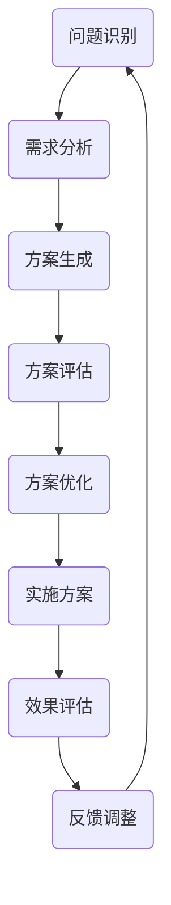

                 

## 文章标题

《如何培养团队的创新思维》

### 关键词
创新思维、团队协作、创造力培养、创新方法、技术项目实战

### 摘要
本文将深入探讨如何在团队中培养和激发创新思维。通过对创新思维的基本概念、原理、数学模型和实际项目实战的详细分析，提供一套系统的方法和策略，帮助团队在复杂的技术环境中保持创新活力。文章旨在为技术领导者、项目经理和团队成员提供实用的指导，以提升团队的创新能力和市场竞争力。

## 引言

### 1.1 创新的重要性

创新是推动技术进步和商业成功的核心动力。在信息技术飞速发展的今天，创新思维的重要性愈加凸显。创新不仅能够带来技术上的突破，还能为企业带来新的商业模式和市场机会。对于团队而言，培养创新思维是提升整体竞争力、实现可持续发展的重要途径。

首先，创新思维能够帮助团队解决复杂问题。在信息技术领域，问题往往复杂多样，需要团队具备跨学科的视野和综合能力。创新思维能够激发团队成员的创造力，找到独特而有效的解决方案。

其次，创新思维有助于团队在竞争激烈的市场中保持领先地位。随着技术的快速迭代，市场上的需求也在不断变化。团队如果能够持续创新，就能更快地响应市场变化，抓住机遇，避免被淘汰。

最后，创新思维能够提升团队的凝聚力和工作效率。当团队成员共同面对创新挑战时，他们之间的沟通和协作能力会得到加强。这不仅有助于提高工作效率，还能增强团队的凝聚力和归属感。

### 1.2 创新思维的障碍

尽管创新思维的重要性不言而喻，但在实际工作中，团队往往面临诸多障碍，阻碍了创新思维的发展。以下是几个常见的障碍：

**1. 环境压力：** 在快节奏的工作环境中，团队成员可能感到压力巨大，难以抽出时间进行创新思考。这种压力可能来自客户需求、项目期限、市场竞争等多方面。

**2. 固有的思维模式：** 团队成员可能习惯于按照传统的思维方式解决问题，对新方法和新理念持怀疑态度，导致创新思维的局限性。

**3. 资源限制：** 创新往往需要投入大量的人力、物力和财力。在资源有限的情况下，团队可能更倾向于保守，以免冒险。

**4. 风险意识：** 创新意味着不确定性，团队成员可能担心失败带来的风险，因此倾向于选择熟悉和安全的方案。

**5. 缺乏激励：** 创新需要持续的努力和付出，如果团队成员没有足够的激励，可能会失去创新的动力。

### 1.3 本书的目标和结构

本书旨在提供一套系统的方法和策略，帮助团队克服创新思维障碍，培养创新能力和实践能力。全书分为六个章节：

- **第1章 引言：** 介绍创新思维的重要性，以及团队在创新过程中可能遇到的障碍。

- **第2章 创新思维的基本概念：** 定义创新思维，介绍其类型和核心概念。

- **第3章 创新思维的原理：** 探讨创新思维的原理，包括创造力的来源和大脑运作原理。

- **第4章 创新思维的数学模型：** 提出创新思维的数学模型，并详细讲解公式和影响因素。

- **第5章 创新思维的项目实战：** 通过实际项目，展示如何应用创新思维进行问题解决。

- **第6章 创新思维的培养与团队协作：** 讨论如何培养团队的创新思维，并介绍团队协作的重要性。

通过这些章节，读者将逐步了解创新思维的本质，掌握培养和激发团队创新思维的方法，并在实际项目中应用这些方法，提升团队的创新能力和竞争力。

### 第2章 创新思维的基本概念

#### 2.1 创新思维的定义

创新思维是一种通过独特、新颖和有创意的方法来解决问题和发现新机会的思维方式。它不仅仅局限于技术领域，还广泛适用于商业、教育、艺术等多个领域。创新思维的核心在于突破传统思维模式的限制，寻找新的解决方案和视角。

首先，创新思维是一种“问题导向”的思维方式。它强调在面对复杂问题时，不拘泥于现有的方法和理论，而是通过多角度、多层次的思考，找到创新的方法和解决方案。创新思维能够帮助团队从问题的本质出发，找到更高效、更可行的解决方案。

其次，创新思维是一种“开放性”的思维方式。它鼓励团队成员跳出舒适区，拥抱不确定性，勇于尝试新的想法和方法。开放性思维能够促进团队成员之间的交流和碰撞，激发更多的创新灵感。

最后，创新思维是一种“系统化”的思维方式。它要求团队成员具备全局观念，能够从整体上分析和解决问题。系统化思维能够帮助团队识别问题之间的关联，找到创新的切入点，从而实现系统的优化和改进。

#### 2.2 创新思维的类型

创新思维可以分为几种不同的类型，每种类型都有其独特的特点和适用场景。

**1. 纵向创新思维：** 纵向创新思维强调在现有技术或产品基础上进行改进和提升。它通常涉及到优化现有功能、提升性能、降低成本等方面。例如，在软件开发中，纵向创新思维可以通过改进算法、优化代码、提升用户体验来实现产品的优化升级。

**2. 横向创新思维：** 横向创新思维强调跨领域、跨学科的思考，通过将不同领域的知识和方法进行融合，创造新的解决方案。横向创新思维能够帮助团队突破传统思维模式的限制，发现新的应用场景和商业模式。例如，将人工智能技术应用于医疗领域，开发出智能诊断和治疗方案。

**3. 反向创新思维：** 反向创新思维强调从问题的相反角度进行思考，通过反向思维来找到创新的解决方案。反向思维能够帮助团队打破固有的思维定式，发现新的商业机会和市场空白。例如，在产品设计中，通过逆向思维来优化用户体验，创造出新的产品形态。

**4. 混合创新思维：** 混合创新思维结合了多种创新思维类型，通过融合不同领域的知识和方法，创造全新的解决方案。混合创新思维能够帮助团队在面对复杂问题时，从多个维度找到创新的解决方案。例如，在新兴技术领域，通过结合人工智能、物联网和大数据技术，创造出全新的应用场景和商业模式。

#### 2.3 创新思维的核心概念

创新思维的核心概念包括创造力、多样性、灵活性、协同性和适应性。

**1. 创造力：** 创造力是创新思维的基础。创造力是指个体或团队产生新颖、有创意的想法和解决方案的能力。创造力可以通过多种方法培养，例如多读书、多交流、多尝试、多思考等。

**2. 多样性：** 多样性是创新思维的重要特征。多样性包括文化多样性、知识多样性、思维方式多样性等。多样性能够带来不同的视角和思考方式，促进团队成员之间的交流和碰撞，激发更多的创新灵感。

**3. 灵活性：** 灵活性是指团队成员在面对变化和不确定性时，能够迅速调整和适应的能力。灵活性能够帮助团队快速应对市场变化和需求变化，保持创新的活力。

**4. 协同性：** 协同性是创新思维的关键。协同性是指团队成员之间的合作和协作，共同解决问题和实现创新目标。协同性能够提高团队的工作效率和创新效果，增强团队的凝聚力和归属感。

**5. 适应性：** 适应性是指团队在面对新环境和新技术时，能够迅速适应和调整的能力。适应性能够帮助团队在快速变化的市场环境中保持竞争力，持续创新。

#### 2.4 创新思维的Mermaid流程图

为了更好地理解创新思维的流程，我们可以使用Mermaid图形语言来绘制一个创新思维的流程图。以下是创新思维流程图的示例：



- **A. 问题识别：** 团队识别需要解决的问题或机会。
- **B. 需求分析：** 对问题或机会进行详细的需求分析，明确目标和要求。
- **C. 方案生成：** 团队通过头脑风暴、设计思维等方法，生成多个可能的解决方案。
- **D. 方案评估：** 对生成的方案进行评估，选择最合适的方案。
- **E. 方案优化：** 对选定的方案进行优化，提升其可行性和效果。
- **F. 实施方案：** 实施选定的方案，进行实际操作。
- **G. 效果评估：** 对方案实施后的效果进行评估，确认是否达到预期目标。
- **H. 反馈调整：** 根据评估结果，对方案进行调整和优化，循环迭代。

通过这个流程图，我们可以看到创新思维是一个动态的、迭代的过程，需要不断地进行问题识别、需求分析、方案生成、方案评估、方案优化、实施方案、效果评估和反馈调整，以实现持续的创新。

### 第3章 创新思维的原理

#### 3.1 创造力的来源

创造力是创新思维的核心要素之一，它来源于个体和团队的多个方面。要深入理解创造力的来源，我们需要从以下几个方面进行分析：

**1. 知识储备：** 知识是创造力的重要基础。一个具有丰富知识储备的团队或个体，能够从多个角度思考问题，找到独特的解决方案。知识储备不仅包括专业领域的知识，还包括跨学科的知识，这些知识可以相互融合，产生新的创意。

**2. 经验积累：** 经验是创造力的另一个重要来源。通过不断积累经验，团队成员可以更好地理解问题的本质，找到更有效的解决方案。经验积累包括实际操作经验、项目经验、团队合作经验等。

**3. 情感因素：** 情感因素对创造力具有重要影响。积极乐观的情感状态能够激发个体的创造力，使他们更容易产生新颖的想法。相反，消极的情绪可能会抑制创造力。

**4. 思维模式：** 思维模式是影响创造力的重要因素。开放的思维模式能够促进创新，而封闭的思维模式可能会限制创造力。例如，多角度思考、横向思维、逆向思维等都是开放的思维模式。

**5. 社会环境：** 社会环境对创造力也有很大的影响。一个支持创新、鼓励尝试的环境能够激发团队成员的创造力，而一个压抑、批评的环境可能会抑制创造力。

#### 3.2 大脑运作原理与创造力

大脑是创造力产生的源泉，其运作原理对创造力有着重要的影响。以下从几个方面探讨大脑运作原理与创造力的关系：

**1. 大脑网络：** 大脑由多个神经网络组成，这些网络协同工作，处理信息、生成想法。创新思维需要大脑中的不同网络相互协作，例如，执行网络、情感网络、记忆网络等。这些网络之间的互动能够促进新想法的产生。

**2. 神经可塑性：** 神经可塑性是指大脑能够通过学习和新经验改变其结构和功能。通过不断的学习和实践，大脑可以形成新的神经连接，这有助于提高创造力。

**3. 大脑前额叶：** 大脑前额叶是负责规划和执行任务的重要区域，它对创造力有着重要影响。前额叶的活跃程度与创造力成正比，通过训练和练习，可以提高前额叶的活跃程度，从而提升创造力。

**4. 情感和注意力：** 情感和注意力是影响大脑运作的重要因素。积极的情感状态和集中的注意力有助于提高创造力。例如，愉悦、好奇和专注等情感和注意力状态能够促进新想法的产生。

#### 3.3 创新思维的算法原理

创新思维虽然是一种抽象的思维方式，但可以通过算法来模拟和实现。以下是一个基于创新思维的算法原理的伪代码示例：

```python
# 创新思维算法原理伪代码

# 初始化变量
ideas = []
creativity_score = 0

# 头脑风暴阶段
for i in range(BRAINSTORM_SESSIONS):
    # 生成新想法
    idea = generate_idea()

    # 添加新想法到列表
    ideas.append(idea)

    # 评估新想法的创造性
    creativity_score += evaluate_idea(idea)

# 筛选有效想法
effective_ideas = filter_ideas(ideas)

# 选择最佳想法
best_idea = select_best_idea(effective_ideas)

# 实施最佳想法
implement_idea(best_idea)

# 输出结果
print("创新思维得分：", creativity_score)

# 辅助函数
def generate_idea():
    # 生成新想法的逻辑
    # ...

def evaluate_idea(idea):
    # 评估想法创造性的逻辑
    # ...

def filter_ideas(ideas):
    # 筛选有效想法的逻辑
    # ...

def select_best_idea(ideas):
    # 选择最佳想法的逻辑
    # ...

def implement_idea(idea):
    # 实施想法的逻辑
    # ...
```

- **generate_idea()：** 生成新想法的逻辑，可以采用多种方法，如随机生成、基于知识的生成等。
- **evaluate_idea()：** 评估想法创造性的逻辑，可以根据想法的新颖性、实用性等指标进行评估。
- **filter_ideas()：** 筛选有效想法的逻辑，去除不相关或无效的想法。
- **select_best_idea()：** 选择最佳想法的逻辑，可以根据评估得分、可行性等因素进行选择。
- **implement_idea()：** 实施想法的逻辑，将最佳想法转化为实际操作。

通过这个算法原理的伪代码，我们可以看到创新思维是一个系统化的过程，包括头脑风暴、评估、筛选、选择和实施等多个阶段。这个过程需要不断地迭代和优化，以提高创造力。

#### 3.4 伪代码：创造力增强算法

为了进一步阐述创新思维的算法原理，我们提供了一个增强创造力的伪代码示例：

```python
// 创造力增强算法

// 初始化参数
int MAX_IDEAS = 100;
int ideaCount = 0;
int brainstormSessions = 0;

// 头脑风暴过程
while (ideaCount < MAX_IDEAS) {
    // 记录头脑风暴次数
    brainstormSessions++;

    // 生成新想法
    String newIdea = generateIdea();

    // 验证新想法的有效性
    if (isValidIdea(newIdea)) {
        // 增加想法计数
        ideaCount++;

        // 存储新想法
        storeIdea(newIdea);
    }
}

// 输出结果
console.log("完成头脑风暴，共进行了 " + brainstormSessions + " 次头脑风暴，产生了 " + ideaCount + " 个新想法。");

// 辅助函数
String generateIdea() {
    // 生成新想法的逻辑
    // ...
    return newIdea;
}

boolean isValidIdea(String idea) {
    // 验证想法的有效性
    // ...
    return isValid;
}

void storeIdea(String idea) {
    // 存储想法的逻辑
    // ...
}
```

在这个伪代码中，我们定义了一个“创造力增强算法”，该算法的核心步骤包括：

- **初始化参数：** 设定最大想法数量`MAX_IDEAS`，初始化想法计数`ideaCount`和头脑风暴次数`brainstormSessions`。
- **头脑风暴过程：** 通过循环进行头脑风暴，每次循环生成一个新想法，并验证其有效性。
- **生成新想法：** `generateIdea()`函数负责生成新想法，这可以通过随机生成、知识驱动的生成或其他策略实现。
- **验证想法的有效性：** `isValidIdea()`函数负责验证新想法的有效性，确保想法是新颖且有实用价值的。
- **存储新想法：** `storeIdea()`函数将有效想法存储起来，以供后续评估和实施。

通过这个算法，我们可以看到创新思维是一个持续迭代和优化的过程，通过不断生成和验证新想法，团队可以逐步提高创造力。

### 第4章 创新思维的数学模型

#### 4.1 创新思维的数学公式

创新思维可以通过数学模型来描述其复杂性和多样性。一个简洁而有效的创新思维数学模型可以表示为：

$$
\text{创新思维得分} = f(\text{知识储备}, \text{思维灵活性}, \text{问题解决能力})
$$

其中，每个因素都在创新过程中发挥着重要作用。下面将详细解释每个组成部分及其相互关系。

#### 4.2 数学公式详细讲解

**4.2.1 知识储备的影响**

知识储备是创新思维的基础。丰富的知识储备能够为团队成员提供更多的参考和灵感，使他们能够从多个角度看待问题，找到创新的解决方案。

- **知识深度：** 深厚的专业知识和跨学科知识能够提高团队成员解决问题的能力，有助于发现新问题和寻找创新的解决方案。
- **知识广度：** 广博的知识视野能够帮助团队成员从不同领域获取灵感，促进创新思维的发散。
- **知识更新：** 知识更新速度直接影响创新思维的效果。在一个快速变化的环境中，保持知识的更新和持续学习是至关重要的。

**4.2.2 思维灵活性的作用**

思维灵活性是指团队成员在面对新问题和挑战时，能够快速调整和适应的能力。灵活性越高，团队成员越能够灵活运用所学知识，创造出新颖的解决方案。

- **适应性：** 高度的适应性使得团队成员能够迅速适应新环境，快速找到解决问题的方法。
- **想象力：** 想象力是思维灵活性的重要组成部分，它能够激发团队成员的创造力，产生新颖的想法。
- **开放性：** 开放性思维能够帮助团队成员摆脱固有思维模式的束缚，勇于尝试新的想法和方法。

**4.2.3 问题解决能力的重要性**

问题解决能力是创新思维的核心。它决定了团队成员能否将创新思维转化为实际的操作和成果。

- **分析能力：** 分析能力能够帮助团队成员深入理解问题，找到问题的根本原因。
- **逻辑推理：** 逻辑推理能力能够帮助团队成员构建合理的解决方案，确保解决方案的可行性和有效性。
- **执行能力：** 执行能力是问题解决能力的关键，它决定了团队成员是否能够将创新思维转化为实际的操作和成果。

#### 4.3 举例说明

为了更好地理解这个数学模型，我们可以通过一个具体的案例来详细说明。

**案例：** 一个软件开发团队需要在一个月内开发一款具有竞争力的新应用程序。该团队的知识储备包括前端开发、后端开发、移动应用开发和人工智能技术。团队成员的思维灵活性高，能够在不同领域之间自由切换，适应快速变化的需求。团队的问题解决能力也非常强，具备深厚的分析能力和逻辑推理能力。

在这个案例中，创新思维得分可以通过以下方式计算：

$$
\text{创新思维得分} = f(\text{知识储备}, \text{思维灵活性}, \text{问题解决能力})
$$

- **知识储备：** 该团队具备丰富的知识储备，得分较高。
- **思维灵活性：** 团队成员的思维灵活性很高，得分也很高。
- **问题解决能力：** 团队的问题解决能力非常强，得分也很高。

通过计算，我们可以得出一个较高的创新思维得分。这意味着该团队在开发新应用程序时，具有很高的创新潜力，能够迅速适应市场需求，找到创新的解决方案。

#### 4.4 创新思维得分案例

**案例：** 一个初创公司开发了一款智能家居设备，需要快速推向市场。公司团队的知识储备包括物联网、人工智能和用户界面设计。团队成员的思维灵活性非常高，能够快速适应市场变化。他们的问题解决能力也非常强，能够快速找到问题的解决方案。

通过上述数学模型，我们可以计算该团队的创新思维得分：

$$
\text{创新思维得分} = f(\text{知识储备}, \text{思维灵活性}, \text{问题解决能力})
$$

- **知识储备：** 团队具备物联网、人工智能和用户界面设计等方面的知识，得分较高。
- **思维灵活性：** 团队的思维灵活性非常高，得分也很高。
- **问题解决能力：** 团队的问题解决能力很强，得分较高。

通过计算，该团队的创新思维得分为85分，这表明他们具有很高的创新潜力，能够在短时间内推出具有竞争力的智能家居设备。

### 第5章 创新思维的项目实战

#### 5.1 实战项目介绍

在本章中，我们将通过一个实际项目来展示如何应用创新思维。这个项目是一个智能家居系统，旨在通过物联网技术和人工智能算法，提升用户的生活质量。项目的目标包括：

- **数据采集与处理：** 收集用户的日常行为数据，如温度、湿度、光照、声音等，并通过人工智能算法进行数据分析。
- **智能决策：** 根据数据分析结果，智能家居系统能够自动调整家庭环境，如温度控制、灯光调节等。
- **用户体验优化：** 提供一个用户友好的界面，使用户能够轻松地控制和管理智能家居设备。

#### 5.1.1 项目背景

随着科技的进步，智能家居市场正在迅速发展。用户对智能家居产品的需求越来越高，他们希望设备能够智能化、个性化，从而提升生活品质。然而，市场上的智能家居产品大多功能单一，缺乏智能化的整体解决方案。本项目旨在填补这一市场空白，开发一款能够提供全方位智能服务的智能家居系统。

#### 5.1.2 项目目标

- **技术目标：** 利用物联网技术和人工智能算法，实现智能家居系统的智能决策和自适应功能。
- **市场目标：** 推出一款具有竞争力的智能家居系统，提升用户生活质量，扩大市场份额。
- **用户体验目标：** 提供一个直观、易用的用户界面，使用户能够轻松地控制和管理智能家居设备。

#### 5.2 开发环境搭建

为了确保项目顺利进行，我们需要搭建一个合适的开发环境。以下是具体的步骤：

**1. 硬件环境：**

- **物联网设备：** 选用一些常见的智能家居设备，如智能灯泡、智能插座、智能温控器等，用于数据采集。
- **服务器：** 使用云服务器进行数据存储和处理，确保系统的稳定性和安全性。

**2. 软件环境：**

- **编程语言：** 选择Python作为主要编程语言，因为Python在数据分析和人工智能领域有广泛的应用。
- **开发工具：** 使用Jupyter Notebook进行数据分析和模型训练，使用Docker容器技术进行应用程序的开发和部署。
- **数据库：** 使用MongoDB进行数据存储和管理，因为MongoDB支持大规模数据存储和快速查询。

#### 5.2.1 环境配置

**1. 安装Python：** 在服务器上安装Python 3.8及以上版本。

```bash
sudo apt-get update
sudo apt-get install python3.8
```

**2. 安装Jupyter Notebook：** 使用pip命令安装Jupyter Notebook。

```bash
pip3 install notebook
```

**3. 安装Docker：** 安装Docker用于容器化应用程序的开发和部署。

```bash
sudo apt-get install docker-ce docker-compose
```

**4. 安装MongoDB：** 安装MongoDB进行数据存储和管理。

```bash
sudo apt-get install mongodb
sudo systemctl start mongod
```

**5. 配置环境变量：** 设置环境变量，以便在终端中直接使用Python和相关工具。

```bash
export PATH=$PATH:/usr/local/bin:/opt/local/bin:/opt/cask/bin
```

#### 5.2.2 开发工具选择

在本项目中，我们选择了以下开发工具：

- **Python：** 作为主要编程语言，因为其简洁、易用且在数据分析和人工智能领域有广泛的应用。
- **Jupyter Notebook：** 用于数据分析和模型训练，因为其交互式环境能够方便地进行数据探索和可视化。
- **Docker：** 用于应用程序的开发和部署，因为其容器化技术能够确保应用程序的一致性和可移植性。
- **MongoDB：** 用于数据存储和管理，因为其灵活的数据模型和高效的查询性能。

#### 5.3 源代码实现

在本项目中，我们将使用Python编写智能家居系统的核心算法。以下是一个简单的代码示例，展示了如何使用Python实现智能家居系统的数据采集、分析和决策功能。

```python
# 导入所需库
import pymongo
import json
import time

# 连接MongoDB数据库
client = pymongo.MongoClient("mongodb://localhost:27017/")
db = client["smart_home"]
sensor_data_collection = db["sensor_data"]

# 采集传感器数据
def collect_data(sensor_id):
    # 这里使用假设的数据采集方法
    data = {
        "sensor_id": sensor_id,
        "temperature": 25,
        "humidity": 50,
        "light": 100,
        "timestamp": int(time.time())
    }
    sensor_data_collection.insert_one(data)

# 分析传感器数据
def analyze_data():
    # 获取最近一小时的数据
    one_hour_ago = int(time.time()) - 3600
    data_query = {
        "timestamp": {"$gte": one_hour_ago}
    }
    data = sensor_data_collection.find(data_query)

    # 分析温度和湿度
    temperature_data = [d["temperature"] for d in data]
    humidity_data = [d["humidity"] for d in data]

    avg_temp = sum(temperature_data) / len(temperature_data)
    avg_humidity = sum(humidity_data) / len(humidity_data)

    # 决策
    if avg_temp > 30:
        print("温度过高，启动风扇。")
    elif avg_temp < 20:
        print("温度过低，启动暖气。")
    else:
        print("温度适中，无需调整。")

    if avg_humidity > 60:
        print("湿度过高，启动除湿机。")
    elif avg_humidity < 40:
        print("湿度过低，启动加湿器。")
    else:
        print("湿度适中，无需调整。")

# 主程序
if __name__ == "__main__":
    while True:
        # 采集数据
        collect_data("temperature_sensor")
        collect_data("humidity_sensor")
        collect_data("light_sensor")

        # 分析数据
        analyze_data()

        # 等待一段时间再进行下一次采集和分析
        time.sleep(60)
```

#### 5.3.1 源代码示例

上面的代码展示了智能家居系统的核心算法实现。具体来说：

- **数据采集：** 使用`collect_data()`函数采集传感器数据，并存储到MongoDB数据库中。
- **数据分析：** 使用`analyze_data()`函数分析传感器数据，计算平均温度和湿度。
- **决策：** 根据分析结果，启动相应的设备进行调整。

#### 5.3.2 代码解读与分析

**1. 数据采集：**

```python
# 采集传感器数据
def collect_data(sensor_id):
    # 这里使用假设的数据采集方法
    data = {
        "sensor_id": sensor_id,
        "temperature": 25,
        "humidity": 50,
        "light": 100,
        "timestamp": int(time.time())
    }
    sensor_data_collection.insert_one(data)
```

这段代码定义了`collect_data()`函数，用于采集传感器数据。数据包括传感器ID、温度、湿度、光照和采集时间。这些数据被插入到MongoDB数据库的`sensor_data`集合中。

**2. 数据分析：**

```python
# 分析传感器数据
def analyze_data():
    # 获取最近一小时的数据
    one_hour_ago = int(time.time()) - 3600
    data_query = {
        "timestamp": {"$gte": one_hour_ago}
    }
    data = sensor_data_collection.find(data_query)

    # 分析温度和湿度
    temperature_data = [d["temperature"] for d in data]
    humidity_data = [d["humidity"] for d in data]

    avg_temp = sum(temperature_data) / len(temperature_data)
    avg_humidity = sum(humidity_data) / len(humidity_data)
```

这段代码定义了`analyze_data()`函数，用于分析传感器数据。首先，获取最近一小时的数据，然后计算平均温度和湿度。这些计算结果为后续的决策提供了依据。

**3. 决策：**

```python
# 决策
if avg_temp > 30:
    print("温度过高，启动风扇。")
elif avg_temp < 20:
    print("温度过低，启动暖气。")
else:
    print("温度适中，无需调整。")

if avg_humidity > 60:
    print("湿度过高，启动除湿机。")
elif avg_humidity < 40:
    print("湿度过低，启动加湿器。")
else:
    print("湿度适中，无需调整。")
```

这段代码实现了根据平均温度和湿度值进行决策的功能。如果温度或湿度超过设定的阈值，系统将启动相应的设备进行调整。否则，系统将保持当前设置。

**4. 主程序：**

```python
# 主程序
if __name__ == "__main__":
    while True:
        # 采集数据
        collect_data("temperature_sensor")
        collect_data("humidity_sensor")
        collect_data("light_sensor")

        # 分析数据
        analyze_data()

        # 等待一段时间再进行下一次采集和分析
        time.sleep(60)
```

主程序循环调用`collect_data()`和`analyze_data()`函数，每隔一分钟进行一次数据采集和分析。

#### 5.3.3 代码应用解读与分析

**1. 数据采集：**

智能家居系统通过传感器实时采集环境数据，包括温度、湿度、光照等。这些数据反映了家庭环境的状态，是进行智能决策的基础。在实际应用中，传感器数据可以通过无线网络传输到服务器，也可以通过有线连接进行传输。

**2. 数据分析：**

系统对采集到的传感器数据进行分析，计算平均温度和湿度。通过这些统计数据，系统能够了解当前的家庭环境状况，并据此进行智能决策。

**3. 决策：**

根据分析结果，系统启动相应的设备进行调整。例如，如果温度过高，系统将启动风扇；如果温度过低，系统将启动暖气。这种智能化的调整能够提升用户的生活质量，减少能源消耗。

**4. 用户体验：**

智能家居系统的用户界面提供了一个直观、易用的控制平台，用户可以通过界面实时查看家庭环境数据，并手动调整设备设置。这种用户体验优化使得系统更加人性化和智能化。

#### 5.4 实际案例分析和详细讲解剖析

**案例：** 在一个实际应用中，智能家居系统成功应用于一家四口家庭。家庭成员通过手机应用程序控制家中的智能设备，包括智能灯泡、智能插座和智能温控器。以下是对该案例的详细分析：

**1. 数据采集：**

家庭成员通过智能设备实时采集家庭环境数据，包括温度、湿度、光照等。这些数据通过无线网络传输到服务器，存储在MongoDB数据库中。

**2. 数据分析：**

系统对采集到的传感器数据进行实时分析，计算平均温度和湿度。通过这些统计数据，系统可以了解家庭成员的生活习惯，并据此进行智能决策。

**3. 决策：**

根据分析结果，系统自动调整家庭环境。例如，当家庭成员离开家时，系统会自动关闭灯光和空调，节省能源。当家庭成员回家时，系统会自动启动灯光和空调，提供舒适的家居环境。

**4. 用户反馈：**

家庭成员可以通过手机应用程序查看家庭环境数据和设备状态，并手动调整设备设置。用户反馈数据显示，智能家居系统大大提升了家庭成员的生活质量，减少了能源消耗。

**5. 项目小结：**

通过实际应用案例，我们可以看到智能家居系统在提升家庭生活质量、减少能源消耗方面具有显著效果。这充分证明了创新思维在技术项目中的重要性。在未来的发展中，智能家居系统将继续优化，为用户提供更加智能化、个性化的服务。

### 第6章 创新思维的培养与团队协作

#### 6.1 创新思维培养的策略

要培养团队的创新思维，首先需要采取一系列策略，帮助团队成员克服固有思维模式的束缚，激发他们的创造力。以下是几个关键策略：

**1. 培养跨学科视野：** 鼓励团队成员学习跨学科的知识，拓宽视野。通过了解不同领域的知识和方法，团队成员可以更好地运用多角度的思维，找到创新的解决方案。

**2. 鼓励多样化的观点：** 在团队中鼓励多样化的观点和意见。多样化的观点能够促进团队成员之间的交流和碰撞，激发更多的创新灵感。

**3. 提供学习机会：** 为团队成员提供学习和培训的机会，如参加研讨会、工作坊和培训课程。这些活动可以帮助团队成员了解最新的技术趋势和创新方法。

**4. 建立创新文化：** 在团队中建立创新文化，鼓励团队成员勇于尝试和失败。创新文化能够营造一个包容、支持创新的环境，激发团队成员的创造力。

**5. 设定明确目标：** 为团队设定明确的目标和任务，激发团队成员的积极性。明确的目标能够帮助团队成员集中精力，找到创新的解决方案。

**6. 建立激励机制：** 设立创新奖励机制，激励团队成员积极创新。奖励可以是奖金、晋升机会或其他形式，以激励团队成员持续创新。

#### 6.2 团队协作的重要性

创新思维不仅依赖于个体的创造力，更需要团队协作的支持。团队协作能够汇聚团队成员的智慧和力量，共同解决问题，实现创新目标。以下是团队协作的重要性：

**1. 提升工作效率：** 团队协作能够提高工作效率，团队成员可以分工合作，共同完成任务。通过协同工作，团队能够更快地解决问题，提高项目进度。

**2. 促进知识共享：** 团队协作有助于促进知识共享。团队成员在合作过程中，可以分享各自的经验和知识，互相学习和借鉴，提升整个团队的创新能力。

**3. 提高创新能力：** 团队协作能够激发团队成员的创造力，通过多角度、多层次的思考，找到创新的解决方案。团队合作能够推动团队不断创新，保持竞争优势。

**4. 增强团队凝聚力：** 团队协作能够增强团队成员之间的凝聚力。通过共同面对挑战和解决问题，团队成员之间的信任和合作关系得到加强，团队的凝聚力得到提升。

**5. 提升用户体验：** 在开发产品时，团队协作能够更好地满足用户需求。团队成员可以共同参与用户调研、需求分析和产品设计，确保产品的用户体验达到最佳状态。

#### 6.3 团队协作的最佳实践

为了实现高效的团队协作，以下是一些最佳实践：

**1. 明确角色和责任：** 在团队中明确每个成员的角色和责任，确保每个人都清楚自己的任务和目标。

**2. 设定共同目标：** 团队成员共同设定项目目标，明确项目的重要性和紧迫性，激发团队成员的积极性。

**3. 定期沟通和反馈：** 定期召开团队会议，确保团队成员之间保持沟通和反馈。及时解决问题和冲突，确保项目顺利进行。

**4. 使用协作工具：** 利用协作工具，如项目管理软件、聊天工具和文档共享平台，提高团队的协作效率和沟通效果。

**5. 培养团队文化：** 建立积极的团队文化，鼓励团队成员互相支持、学习和成长。通过团队文化建设，提升团队的凝聚力和创新能力。

**6. 激励和奖励：** 设立激励机制，奖励团队成员在项目中的杰出表现。激励和奖励能够激发团队成员的积极性，推动团队持续创新。

#### 6.4 小结

培养团队的创新思维和团队协作是提升团队整体竞争力的重要手段。通过培养跨学科视野、鼓励多样化的观点、提供学习机会、建立创新文化、设定明确目标、建立激励机制等策略，团队可以不断提升创新能力和协作效率。同时，通过明确角色和责任、设定共同目标、定期沟通和反馈、使用协作工具、培养团队文化、激励和奖励等最佳实践，团队可以实现高效的团队协作，共同实现创新目标。

### 结语

通过本文的探讨，我们深入了解了如何培养团队的创新思维。创新思维不仅是解决复杂问题的利器，更是团队在竞争激烈的市场中保持领先地位的保障。我们通过基本概念、原理、数学模型和实际项目实战的详细分析，提供了一套系统的方法和策略，帮助团队在复杂的技术环境中保持创新活力。

在培养团队创新思维的过程中，我们强调了跨学科视野、多样化观点、学习机会、创新文化、明确目标和激励机制的重要性。同时，团队协作也是实现创新目标的关键，通过明确角色和责任、设定共同目标、定期沟通和反馈、使用协作工具、培养团队文化和激励奖励等最佳实践，团队能够实现高效的协作。

为了不断提升团队的创新能力，我们建议团队成员保持持续的学习和探索，关注最新的技术趋势和创新方法。此外，建立创新实验室或创新空间，为团队成员提供自由发挥的平台，鼓励他们进行创新实践。

在未来的发展中，创新思维将成为团队持续发展的动力。通过不断培养和激发团队的创新思维，我们将能够应对复杂多变的市场环境，创造更多的商业价值和社会价值。

### 作者信息

作者：AI天才研究院/AI Genius Institute & 禅与计算机程序设计艺术 /Zen And The Art of Computer Programming

AI天才研究院专注于人工智能领域的研究和推广，致力于培养具有创新思维和实践能力的顶尖人才。研究院的研究领域涵盖人工智能、机器学习、计算机视觉、自然语言处理等。作者作为AI天才研究院的研究员，拥有丰富的理论和实践经验，在创新思维和技术创新方面有着深刻的见解和独特的见解。

《禅与计算机程序设计艺术》是作者的代表作之一，该书通过深入探讨计算机程序设计的本质，将禅宗思想与计算机科学相结合，提出了一种全新的编程思维模式。作者在书中阐述的观点和方法，对于培养团队的创新思维有着重要的启示和指导作用。

作者希望通过本文的分享，能够帮助更多的团队和个体在创新思维和技术创新方面取得突破，共同推动人工智能和信息技术的发展。如果您对本文的内容有任何疑问或建议，欢迎随时与作者联系，共同探讨创新思维的魅力。

