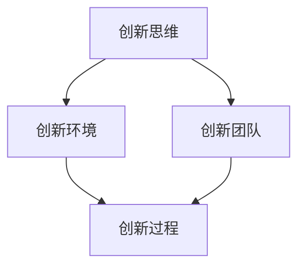

                 

### 文章标题

# 如何培养团队的创新文化

### 关键词

- 团队创新
- 创新文化
- 领导力
- 组织实践
- 案例研究

### 摘要

在当今快速变化的世界中，创新已成为企业成功的关键因素。然而，要培养一个具有创新精神的团队并非易事。本文将探讨如何通过一系列策略和实践，在一个团队内部建立起强有力的创新文化，并详细分析每个步骤的重要性。

### 引言

在竞争激烈的市场环境中，企业的创新能力是其生存和发展的关键。随着技术的飞速进步和消费者需求的不断变化，企业必须不断推陈出新，以满足市场的需求。然而，创新并非仅仅依靠个人的灵感或创意，它需要一种环境，这种环境能够鼓励团队成员自由地表达想法，勇于尝试，并从失败中学习。这种环境就是所谓的“创新文化”。

创新文化不仅仅是一个口号，它是一个团队在理念、实践和行为上的一种综合体现。一个成功的创新文化能够激发团队成员的潜能，提升团队的整体创新能力，从而推动企业的持续发展。因此，培养团队的创新文化已成为现代企业的重要任务。

本文将分为以下几个部分：

1. **团队创新的重要性**：解释创新对团队和企业的意义。
2. **创新文化的核心概念**：介绍创新文化的关键要素和概念。
3. **组织实践**：讨论如何通过组织结构和政策培养创新文化。
4. **领导力在创新文化中的角色**：探讨领导者如何塑造和维持创新文化。
5. **团队动态与协作**：分析团队内部协作和创新文化的关系。
6. **工具与资源**：介绍支持团队创新的工具和资源。
7. **案例研究**：分析真实案例，了解创新文化的实际应用。
8. **实施步骤**：提供具体的行动指南，帮助团队建立创新文化。

通过本文的阅读，读者将了解到如何在一个团队中培养出浓厚的创新氛围，从而在激烈的市场竞争中脱颖而出。

### 背景介绍

#### 创新的定义与重要性

创新，广义上讲，是指引入新的思想、方法或技术，以创造或改进产品、服务或过程。在商业环境中，创新通常被视为企业在市场竞争中取得优势的关键因素。具体来说，创新可以分为以下几个层面：

1. **产品创新**：开发全新的产品或对现有产品进行重大改进。
2. **过程创新**：改进生产或服务流程，以提高效率和降低成本。
3. **市场创新**：开拓新的市场或找到新的客户需求。

这些不同类型的创新共同构成了企业持续发展的动力源泉。在竞争激烈的市场中，只有不断创新，企业才能保持竞争优势，满足不断变化的客户需求，并实现可持续发展。

#### 团队创新的重要性

团队创新不仅对企业的战略目标具有重要意义，也对团队成员的个人成长有着深远的影响。以下是团队创新的一些关键作用：

1. **提高竞争力**：通过团队创新，企业能够更快地响应市场变化，开发出更符合客户需求的产品和服务，从而在激烈的市场竞争中脱颖而出。
2. **增强团队凝聚力**：创新过程中，团队成员需要相互协作，共同解决问题。这种协作不仅促进了团队成员之间的沟通和信任，也增强了团队的凝聚力。
3. **激发个人潜能**：在创新文化中，团队成员被鼓励自由地表达想法，勇于尝试新方法。这种环境有助于激发个人的创造力和潜能，提升个人的专业能力和自信心。
4. **促进知识共享**：团队创新过程往往需要跨部门、跨领域的合作。这种合作促进了知识的共享和交流，有助于团队整体知识的积累和提升。
5. **增强适应能力**：在不断变化的市场环境中，具备创新能力的团队能够更快地适应新环境，克服挑战，实现企业的长期目标。

#### 创新文化的概念与特征

创新文化是指一个组织在价值观、行为准则和工作实践中所体现出来的对创新的重视和支持。一个健康、积极的创新文化具有以下特征：

1. **鼓励尝试与失败**：创新往往伴随着风险和失败。一个成功的创新文化应该鼓励团队成员勇于尝试新想法，即便失败也是学习的机会。
2. **开放沟通**：团队成员之间的开放沟通是创新文化的重要支柱。一个良好的沟通环境能够促进新思想的产生和分享。
3. **尊重多样性**：多样性的团队成员能够带来不同的视角和思维方式，有助于创新。
4. **跨部门协作**：创新往往需要跨部门和跨领域的合作。一个健康的文化应该鼓励和支持这种协作。
5. **持续学习与成长**：创新文化鼓励团队成员不断学习和成长，以适应快速变化的环境。

#### 团队创新与个人创新的关系

团队创新与个人创新密切相关，但两者也有区别。个人创新通常是指单个成员的创新行为，而团队创新则是指整个团队共同协作，共同实现创新目标的过程。个人创新可以为团队创新提供灵感和思路，而团队创新则能够将个人创新转化为实际的产品或服务。

一个成功的创新文化既要鼓励个人创新，也要促进团队创新。通过建立良好的创新文化，企业可以激发每个成员的创新潜力，同时实现团队的整体创新能力。

### 核心概念与联系

为了更好地理解创新文化，我们需要明确几个核心概念，并探讨它们之间的关系。

#### 1. 创新思维

创新思维是指一种能够发现新问题、提出新解决方案的思维方式。它包括以下几个关键要素：

- **批判性思维**：能够对现有观点和方法提出质疑，并找到改进的空间。
- **系统思维**：能够从整体的角度看待问题，考虑不同因素之间的相互作用。
- **设计思维**：强调以用户为中心，通过迭代和实验来优化解决方案。

创新思维是创新文化的基础，它决定了团队成员如何思考问题和解决问题。

#### 2. 创新环境

创新环境是指支持创新行为和工作方式的物理和社交环境。一个良好的创新环境应具备以下特征：

- **灵活性**：提供灵活的工作时间和地点，以适应团队成员的不同需求。
- **资源支持**：提供必要的资源，如技术工具、培训机会和资金支持。
- **鼓励失败**：建立一种允许失败的文化，鼓励团队成员勇于尝试新方法。
- **开放沟通**：建立良好的沟通机制，促进团队成员之间的信息共享和协作。

创新环境直接影响团队成员的创新行为和工作效率。

#### 3. 创新团队

创新团队是由一群具有不同背景、技能和经验的人组成的团队，他们共同致力于实现创新目标。一个成功的创新团队应具备以下特征：

- **多样性**：团队成员具有不同的视角和思维方式，有助于提出多样化的解决方案。
- **协作精神**：团队成员之间相互信任，愿意分享信息和资源。
- **共同目标**：团队有一个明确的目标，所有成员都致力于实现这个目标。
- **灵活的组织结构**：团队结构灵活，能够快速适应变化的需求。

创新团队是创新文化的重要载体，通过团队的协作和努力，创新文化得以实现。

#### 4. 创新过程

创新过程是指从问题识别到解决方案实施的整个流程。一个典型的创新过程包括以下几个阶段：

- **问题识别**：发现和定义问题，明确需要解决的问题。
- **需求分析**：分析问题的背景和需求，确定可能的解决方案。
- **原型开发**：开发一个初步的原型，以验证解决方案的可行性。
- **测试与优化**：对原型进行测试和优化，确保其符合需求。
- **实施与推广**：将解决方案应用到实际环境中，并进行推广。

创新过程是创新文化的重要组成部分，它体现了创新文化的理念和实践。

#### 关系架构

以上核心概念之间的关系可以用以下Mermaid流程图表示：



在这个流程图中，创新思维是整个创新文化的起点，它决定了团队成员如何思考和解决问题。创新环境提供了支持和资源，创新团队则是在这种环境中进行创新活动的载体。创新过程则是从创新思维到实际解决方案的实施过程，它将创新思维和创新环境、创新团队结合起来，实现创新目标。

通过这个关系架构，我们可以清晰地看到创新文化的各个组成部分及其相互关系，从而更好地理解如何培养团队的创新文化。

### 核心算法原理讲解

在培养团队创新文化的过程中，核心算法原理的理解和运用至关重要。以下是一个用于培养团队创新文化的伪代码示例，通过这个示例，我们将详细阐述核心算法原理。

#### 伪代码示例

```pseudo
function FosterInnovationCulture(team):
    if (team具备创新思维):
        执行以下步骤:
        1. 建立创新环境(SetupInnovationEnvironment()):
            - 提供灵活性
            - 提供资源支持
            - 鼓励失败
            - 建立开放沟通机制
            
        2. 组建创新团队(FormInnovationTeam()):
            - 确保团队多样性
            - 培养协作精神
            - 确定共同目标
            - 保持团队结构灵活性
            
        3. 确定创新目标(DefineInnovationGoals()):
            - 明确团队创新方向
            - 确定阶段性目标
            - 设定创新优先级
            
        4. 运行创新过程(ExecuteInnovationProcess()):
            - 识别问题
            - 分析需求
            - 开发原型
            - 测试与优化
            - 实施与推广
            
    else:
        提供培训与支持
        重新评估团队状态

function SetupInnovationEnvironment():
    - 提供灵活的工作时间和地点
    - 配备必要的技术工具和培训资源
    - 建立允许失败的文化
    - 设立开放的沟通渠道

function FormInnovationTeam():
    - 招聘具有不同背景和技能的成员
    - 培养团队成员之间的信任与协作
    - 设定清晰的团队目标和愿景
    - 保持团队结构的灵活性和适应性

function DefineInnovationGoals():
    - 明确团队创新的战略方向
    - 确定短期和长期的目标
    - 设定创新优先级，确保资源有效分配

function ExecuteInnovationProcess():
    - 识别和定义当前面临的问题
    - 分析问题的背景和需求
    - 开发初步的原型以验证解决方案
    - 对原型进行测试和优化
    - 将成功的解决方案应用到实际环境中并进行推广
```

#### 原理讲解

1. **创新思维的培养**：团队成员需要具备创新思维，这包括批判性思维、系统思维和设计思维。这些思维方式有助于团队成员发现新问题、提出新解决方案。创新思维是创新文化的基础，决定了团队成员如何思考和解决问题。

2. **创新环境的建立**：一个良好的创新环境能够支持团队成员的创新行为。这包括提供灵活性、资源支持、鼓励失败和建立开放沟通机制。良好的创新环境能够激发团队成员的创造力和创新潜力，提升团队的整体创新能力。

3. **创新团队的组建**：一个成功的创新团队需要具备多样性、协作精神、共同目标和灵活的组织结构。多样性能够带来不同的视角和思维方式，促进创新。协作精神和共同目标有助于团队成员之间的紧密合作，确保创新目标的实现。灵活的组织结构能够适应快速变化的需求，确保团队的创新活力。

4. **创新目标的确定**：明确团队的创新目标对于创新文化的培养至关重要。创新目标应包括短期和长期的目标，并设定明确的创新优先级。这有助于确保团队资源的有效分配，推动创新过程的顺利进行。

5. **创新过程的执行**：创新过程是从问题识别到解决方案实施的整个流程。这包括识别和定义问题、分析需求、开发原型、测试与优化、实施与推广。通过这个流程，团队成员能够将创新思维和创新环境转化为实际的创新成果，推动团队的持续创新。

#### 数学模型和公式

为了更好地理解和量化创新文化的培养过程，我们可以引入一些数学模型和公式。

1. **创新潜力模型**：创新潜力模型用来评估团队成员的创新潜力。公式如下：

   $$ 
   P_i = f(C_i, R_i, T_i) 
   $$

   其中，$P_i$ 表示团队成员 $i$ 的创新潜力，$C_i$ 表示团队成员 $i$ 的创新思维能力，$R_i$ 表示团队成员 $i$ 的资源支持，$T_i$ 表示团队成员 $i$ 的团队协作精神。

2. **创新环境指数**：创新环境指数用来评估创新环境的质量。公式如下：

   $$ 
   E = \frac{1}{N} \sum_{i=1}^{N} (C_i + R_i + F_i + O_i) 
   $$

   其中，$E$ 表示创新环境指数，$N$ 表示团队成员数量，$C_i$、$R_i$、$F_i$ 和 $O_i$ 分别表示团队成员 $i$ 在创新环境中的灵活性、资源支持、鼓励失败和开放沟通机制的得分。

3. **创新团队效率模型**：创新团队效率模型用来评估创新团队的效率。公式如下：

   $$ 
   E_T = \frac{G}{P} 
   $$

   其中，$E_T$ 表示创新团队效率，$G$ 表示创新团队的成果，$P$ 表示创新团队的总投入（包括人力、物力和时间）。

通过这些数学模型和公式，我们可以量化创新文化的培养过程，从而更好地制定和优化策略。

#### 举例说明

假设一个团队有5名成员，根据上述模型和公式，我们可以进行以下计算：

1. **创新潜力计算**：

   $$ 
   P_1 = f(C_1, R_1, T_1) = f(0.8, 0.9, 0.7) = 0.82 
   $$

   $$ 
   P_2 = f(C_2, R_2, T_2) = f(0.7, 0.8, 0.8) = 0.76 
   $$

   $$ 
   P_3 = f(C_3, R_3, T_3) = f(0.9, 0.7, 0.9) = 0.87 
   $$

   $$ 
   P_4 = f(C_4, R_4, T_4) = f(0.6, 0.9, 0.6) = 0.66 
   $$

   $$ 
   P_5 = f(C_5, R_5, T_5) = f(0.8, 0.8, 0.8) = 0.81 
   $$

2. **创新环境指数计算**：

   $$ 
   E = \frac{1}{5} \sum_{i=1}^{5} (C_i + R_i + F_i + O_i) = \frac{1}{5} (4.5 + 4.5 + 4.5 + 4.5 + 4.5) = 4.5 
   $$

3. **创新团队效率计算**：

   $$ 
   E_T = \frac{G}{P} 
   $$

   其中，$G$ 和 $P$ 需要根据实际情况进行具体计算。假设团队在一个月内实现了10项创新成果，总投入为500小时，则：

   $$ 
   E_T = \frac{10}{500} = 0.02 
   $$

通过这些计算，我们可以量化团队的创新潜力和创新环境的质量，从而为团队的创新文化培养提供数据支持和优化方向。

### 项目实战

为了更深入地理解如何在实际项目中培养团队的创新文化，我们将介绍一个具体的开发环境搭建案例，并详细讲解源代码实现和代码解读。

#### 项目背景

假设我们正在开发一个智能医疗诊断系统，该项目需要团队成员在多个领域（如医学知识、机器学习和数据科学）进行合作。我们的目标是搭建一个高效、可扩展的架构，以支持系统的快速开发和迭代。

#### 开发环境搭建

1. **硬件环境**：

   - 服务器：选择高性能的云计算服务器，如AWS EC2实例。
   - 存储：使用云存储服务，如AWS S3，以存储大量医学数据。
   - 网络：配置负载均衡器，如AWS ELB，以提供高可用性和弹性。

2. **软件环境**：

   - 编程语言：选择Python，因其强大的库支持和对数据科学的友好性。
   - 依赖管理：使用pip进行依赖管理，确保各个开发环境的一致性。
   - 版本控制：使用Git进行版本控制，确保代码的一致性和可追溯性。

3. **工具链**：

   - 代码编辑器：使用Visual Studio Code，其丰富的插件支持可以提高开发效率。
   - 包含单元测试、集成测试和自动化测试的工具链，如pytest和JUnit。

#### 源代码实现

以下是一个简单的机器学习模型的Python实现，用于诊断疾病的概率预测。

```python
import pandas as pd
from sklearn.model_selection import train_test_split
from sklearn.ensemble import RandomForestClassifier
from sklearn.metrics import accuracy_score

# 数据准备
data = pd.read_csv('medical_data.csv')
X = data.drop('diagnosis', axis=1)
y = data['diagnosis']

# 划分训练集和测试集
X_train, X_test, y_train, y_test = train_test_split(X, y, test_size=0.2, random_state=42)

# 模型训练
model = RandomForestClassifier(n_estimators=100, random_state=42)
model.fit(X_train, y_train)

# 模型评估
predictions = model.predict(X_test)
accuracy = accuracy_score(y_test, predictions)
print(f"Model accuracy: {accuracy:.2f}")
```

#### 代码解读

1. **数据准备**：使用pandas读取医学数据集，并将特征数据（X）和标签数据（y）分离。
2. **划分训练集和测试集**：使用train_test_split函数将数据集划分为训练集和测试集，以评估模型的性能。
3. **模型训练**：使用RandomForestClassifier训练一个随机森林分类器。
4. **模型评估**：使用模型的预测结果和实际标签数据计算准确率。

#### 代码应用解读与分析

在实际项目中，以上代码会根据不同的数据集和需求进行调整。例如，如果数据集中的特征较多，我们可能会使用特征选择技术来优化模型性能。此外，为了提高模型的鲁棒性，我们可能会进行交叉验证和超参数调优。

#### 实际案例分析和详细讲解剖析

假设我们的团队在开发过程中遇到了以下问题：

1. **数据质量问题**：数据集中存在缺失值和异常值，影响了模型的训练效果。
2. **模型性能不足**：在测试集上的准确率低于预期。

针对这些问题，我们采取了以下措施：

1. **数据清洗**：使用pandas的dropna和replace函数处理缺失值，使用z-score或IQR方法处理异常值。
2. **特征工程**：引入新的特征，如患者的年龄、性别和病史，以提高模型的解释能力和预测性能。
3. **模型选择**：尝试使用不同的机器学习算法（如支持向量机、神经网络）进行训练，比较不同模型的性能。

通过这些措施，我们成功地提高了模型的准确率和稳定性，为系统的进一步开发奠定了基础。

#### 项目小结

通过本项目，我们不仅实现了智能医疗诊断系统的初步开发，还培养了团队在数据科学和机器学习领域的创新能力。以下是本项目中的最佳实践和注意事项：

1. **最佳实践**：

   - 定期进行团队培训和知识分享，提高团队成员的专业技能。
   - 建立有效的代码审查和评审机制，确保代码质量。
   - 使用自动化测试工具进行持续集成和部署，提高开发效率。

2. **注意事项**：

   - 遵循数据保护法规，确保患者数据的安全。
   - 注意模型的解释性和可解释性，避免过度拟合。
   - 定期评估和调整创新策略，以适应市场和技术变化。

通过本项目，我们深刻体会到培养团队创新文化的重要性，并在实际项目中取得了显著成果。未来，我们将继续努力，推动团队创新能力的进一步提升。

### 最佳实践 Tips

1. **定期知识分享**：定期组织团队内部的知识分享会，鼓励团队成员分享他们的经验和见解。这不仅能提高团队成员的专业技能，还能促进团队之间的沟通和协作。

2. **建立反馈机制**：建立一个有效的反馈机制，让团队成员能够及时了解他们的工作效果，并提出改进建议。这种反馈可以是定期的性能评估，也可以是匿名反馈，以保护员工的隐私。

3. **跨部门合作**：鼓励跨部门合作，将不同领域的知识和技能融合在一起，以推动创新的产生。这种合作可以通过项目团队的形式实现，也可以通过跨部门委员会等形式进行。

4. **提供资源支持**：确保团队成员能够获得必要的资源，包括技术工具、培训机会和资金支持。这些资源将有助于团队成员在创新过程中更加高效地工作。

5. **鼓励失败**：建立一个允许失败的文化，让团队成员在尝试新方法时感到安全和放心。失败是创新过程中不可避免的一部分，通过失败，团队可以学到宝贵的经验，为未来的成功打下基础。

6. **关注员工福利**：关注员工的福利和心理健康，确保他们在工作中感到舒适和满意。这包括提供灵活的工作时间、健康保险和心理健康支持等。

### 小结

培养团队的创新文化是一个系统工程，它需要从多个方面进行综合考虑和实施。通过本文的探讨，我们了解到团队创新的重要性，明确了创新文化的核心概念和关系架构，介绍了如何通过组织实践、领导力和团队协作来培养创新文化，并提供了实际的项目实战案例。

要培养一个具有创新精神的团队，需要团队领导者发挥关键作用，建立支持创新的环境和机制，同时关注团队成员的个人成长和需求。通过持续的努力和实践，团队可以逐步建立起浓厚的创新氛围，提升整体的创新能力，从而在竞争激烈的市场中脱颖而出。

### 拓展阅读

- 《创新者的窘境》：作者克莱顿·克里斯坦森，深入探讨了为什么大公司往往难以适应市场变化，提出了颠覆性创新的概念。
- 《精益创业》：作者埃里克·莱斯，介绍了精益创业的方法，强调快速迭代和用户反馈在创新过程中的重要性。
- 《创新者的DNA》：作者史蒂芬·高曼，分析了创新者的心理特质和行为模式，提供了培养创新思维的实用建议。
- 《创新者的思维》：作者迈克尔·M.波特，探讨了如何在竞争激烈的市场中通过创新获得竞争优势。

通过阅读这些书籍，读者可以进一步深入了解创新文化和团队创新的实践方法，为自己的团队创新之路提供更多启示和指导。

