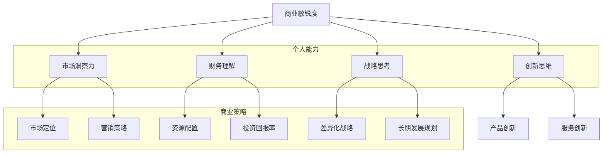

                 

### 第1章：核心概念与联系

#### 1.1 商业敏锐度概述

##### 1.1.1 商业敏锐度的定义

商业敏锐度（Business Acumen）是一种综合能力，它结合了市场洞察力、财务理解、战略思考和创新思维。具体来说，商业敏锐度指的是个人或团队在识别商业机会、理解市场动态、把握财务指标和做出高效决策方面所展现出的能力和素质。这一概念不仅涉及对市场趋势的敏锐感知，还包括对内部运营和外部环境的深刻理解。

##### 1.1.2 商业敏锐度的重要性

商业敏锐度对企业的成功至关重要。首先，它帮助企业迅速捕捉市场变化，从而抢占先机。其次，商业敏锐度使企业能够准确评估风险，规避潜在危机。此外，具备商业敏锐度的团队能够更高效地协作，制定和实施具有前瞻性的商业策略。以下是商业敏锐度的重要性总结：

1. **市场洞察力**：有助于企业及时了解市场趋势和消费者需求，制定更具针对性的营销策略。
2. **财务理解**：使团队能够准确评估财务状况，优化资源配置，提高投资回报率。
3. **战略思考**：帮助企业在复杂多变的市场环境中保持竞争优势，制定并执行长期发展战略。
4. **创新思维**：激发团队的创造力，推动产品和服务创新，提升企业竞争力。

#### 1.2 团队商业敏锐度培养

##### 1.2.1 团队商业敏锐度培养的重要性

团队商业敏锐度培养是提升企业整体竞争力的重要环节。通过系统性的培养，企业可以打造一支具备高商业敏锐度的团队，从而在激烈的市场竞争中脱颖而出。以下是团队商业敏锐度培养的重要性：

1. **提升市场感知能力**：通过培训和实践，提高团队成员对市场动态的敏感度，确保企业能够及时应对市场变化。
2. **提高决策效率**：培养团队成员的战略思考能力和决策能力，减少决策失误，提高决策质量。
3. **促进跨部门协作**：增强不同部门之间的沟通与协作，实现资源的优化配置和协同效应。
4. **增强企业凝聚力**：通过共同的学习和成长，增强团队成员的归属感和团队凝聚力。

##### 1.2.2 团队商业敏锐度培养的方法

为了培养团队的商业敏锐度，企业可以采取以下几种方法：

1. **强化市场研究**：定期进行市场调研，了解行业趋势和竞争对手动态，为团队提供及时、准确的市场信息。
2. **鼓励创新思维**：通过组织创新工作坊、头脑风暴等方式，激发团队成员的创新意识，培养创新思维。
3. **跨部门协作**：促进不同部门之间的信息共享和协同工作，提升团队的整体协作效率。
4. **领导力培养**：领导者需要具备商业敏锐度，并能够有效传递给团队成员。通过领导力培训，提升领导者的商业洞察力和领导力。
5. **持续学习和实践**：鼓励团队成员参加相关课程和实践活动，不断学习和积累经验，提升自身能力。

#### 1.3 商业敏锐度与商业策略

##### 1.3.1 商业敏锐度与商业策略的关系

商业敏锐度是制定有效商业策略的重要基础。只有对市场有深刻的理解和把握，企业才能制定出符合市场需求的策略。商业敏锐度不仅体现在战略规划阶段，也贯穿于企业的运营、营销和风险管理等各个方面。以下是商业敏锐度与商业策略的关系：

1. **市场定位**：通过商业敏锐度分析，明确目标市场和客户需求，制定精准的市场定位策略。
2. **产品开发**：基于市场反馈和商业敏锐度分析，持续优化和调整产品功能，满足客户需求。
3. **市场营销**：制定更具针对性的营销策略，提高市场占有率和品牌影响力。
4. **风险管理**：预见潜在风险，提前制定应对措施，降低运营风险。

##### 1.3.2 商业敏锐度在战略规划中的应用

商业敏锐度在战略规划中具有重要作用。以下是商业敏锐度在战略规划中的应用：

1. **市场分析**：通过商业敏锐度分析，了解市场趋势、竞争态势和潜在机会，为战略规划提供数据支持。
2. **竞争分析**：评估竞争对手的优劣势，制定差异化战略，提升企业竞争力。
3. **财务分析**：基于商业敏锐度分析，准确评估企业的财务状况，为战略规划提供财务依据。
4. **风险管理**：通过商业敏锐度分析，预见潜在风险，制定风险管理策略，确保企业稳定发展。

#### 1.4 商业敏锐度评估与提升

##### 1.4.1 商业敏锐度评估指标

为了评估团队的商业敏锐度，企业可以设定以下指标：

1. **市场响应时间**：衡量团队对市场变化的反应速度，确保能够及时调整策略。
2. **决策质量**：评估团队在决策过程中的准确性，提高决策的科学性和有效性。
3. **创新频率**：记录团队在产品或服务上的创新次数，激励创新精神。
4. **员工满意度**：员工对团队商业敏锐度的满意度，反映团队凝聚力和工作氛围。

##### 1.4.2 提升商业敏锐度的策略

为了提升团队的商业敏锐度，企业可以采取以下策略：

1. **数据驱动**：利用大数据和人工智能技术，提高市场分析和预测的准确性，为决策提供数据支持。
2. **敏捷管理**：采用敏捷开发方法，快速响应市场变化，提高业务灵活性和适应性。
3. **培养人才**：通过培训和发展计划，提升团队整体商业敏锐度，培养具备商业洞察力和战略思维的专业人才。
4. **建立反馈机制**：及时收集和分析客户反馈，持续改进产品和服务，提升客户满意度。

### 核心概念原理之间的关系架构 Mermaid 流程图

### 第2章：架构设计与方法论

#### 2.1 商业敏锐度架构设计

商业敏锐度架构设计是确保团队商业敏锐度有效实施的关键。该架构包括数据采集、数据处理、数据分析和数据应用四个关键环节。

##### 2.1.1 商业敏锐度架构概述

商业敏锐度架构的核心目标是帮助企业快速捕捉市场变化，准确评估商业机会和风险，并做出高效决策。具体架构设计如下：

1. **数据采集**：从内部和外部数据源收集与业务相关的数据，如销售数据、客户反馈、市场动态、竞争对手信息等。
2. **数据处理**：对收集到的数据进行分析和清洗，去除噪声和冗余数据，确保数据质量。
3. **数据分析**：利用统计学和机器学习等方法，对处理后的数据进行分析，提取有价值的信息。
4. **数据应用**：将分析结果应用于战略规划、运营优化、市场营销和风险管理等各个环节，为决策提供数据支持。

##### 2.1.2 数据采集

数据采集是商业敏锐度架构的基础。以下是数据采集的主要步骤：

1. **内部数据采集**：收集企业内部的销售数据、客户数据、财务数据等。这些数据可以通过企业内部的ERP系统、CRM系统等获取。
2. **外部数据采集**：通过公开数据源、第三方数据提供商和合作伙伴等获取市场信息、竞争对手数据等。这些数据可以通过互联网、行业报告、问卷调查等方式获取。

##### 2.1.3 数据处理

数据处理是确保数据质量的关键步骤。以下是数据处理的几个关键环节：

1. **数据清洗**：去除重复、错误和无关的数据，保证数据质量。数据清洗的方法包括数据去重、错误值修正和缺失值填充等。
2. **数据整合**：将不同来源的数据进行整合，形成统一的视图。数据整合的方法包括数据合并、数据映射和数据标准化等。
3. **数据存储**：选择合适的存储方案，确保数据的安全和高效访问。常用的数据存储方案包括关系型数据库、NoSQL数据库、数据仓库等。

##### 2.1.4 数据分析

数据分析是商业敏锐度架构的核心环节。以下是数据分析的主要方法：

1. **统计分析**：使用统计方法，对数据进行描述性分析和相关性分析。描述性分析用于了解数据的分布和特征，相关性分析用于探索数据之间的关系。
2. **机器学习**：利用机器学习算法，进行预测分析和分类分析。预测分析用于预测未来的市场趋势和销售情况，分类分析用于识别客户群体和产品类别等。
3. **数据可视化**：通过图表和报表，直观展示分析结果。数据可视化有助于团队成员更好地理解和应用分析结果。

##### 2.1.5 数据应用

数据应用是将分析结果转化为实际业务价值的关键环节。以下是数据应用的主要场景：

1. **战略规划**：基于数据分析结果，制定和调整企业战略。例如，通过市场趋势分析，调整产品定位和营销策略。
2. **运营优化**：利用分析结果，优化业务流程和运营效率。例如，通过销售数据分析，调整库存策略和销售渠道。
3. **决策支持**：为决策者提供数据支持的决策建议。例如，通过风险评估分析，制定风险应对措施。

#### 2.2 商业敏锐度方法论

商业敏锐度方法论是一套系统化的方法，用于培养团队的商业敏锐度，提升企业的市场竞争力。以下是商业敏锐度方法论的主要步骤：

##### 2.2.1 客户需求分析

客户需求分析是商业敏锐度方法论的基础。以下是客户需求分析的主要步骤：

1. **需求收集**：通过调查、访谈、用户行为分析等方式，收集客户需求。调查和访谈可以获取客户的直接反馈，用户行为分析可以获取客户的间接需求。
2. **需求分类**：对收集到的需求进行分类，识别关键需求和次要需求。关键需求是影响产品功能和用户体验的核心需求，次要需求是辅助性需求。
3. **需求优先级排序**：根据需求的紧急程度和重要性，对需求进行优先级排序。紧急且重要的需求应优先处理，次要需求可以后续逐步实施。

##### 2.2.2 SWOT分析

SWOT分析是一种常用的战略规划工具，用于评估企业的优势、劣势、机会和威胁。以下是SWOT分析的主要步骤：

1. **优势分析**：识别企业的优势，包括资源、技术、品牌等。优势是企业区别于竞争对手的竞争优势。
2. **劣势分析**：识别企业的劣势，包括运营成本、市场份额等。劣势是企业需要改进和提升的方面。
3. **机会分析**：识别市场机会，包括新兴市场、技术趋势等。机会是企业可以利用的外部条件。
4. **威胁分析**：识别市场威胁，包括竞争对手、政策法规等。威胁是企业需要应对的外部挑战。

##### 2.2.3 五力模型

五力模型是一种分析市场竞争结构的方法，用于评估企业的市场地位和竞争力。以下是五力模型的主要步骤：

1. **买方力量**：分析买方的议价能力和购买行为。买方力量强的市场，企业需要提供更有竞争力的产品和服务。
2. **供方力量**：分析供应商的议价能力和供应情况。供方力量强的市场，企业需要建立稳定的供应链和供应渠道。
3. **同行业竞争**：分析竞争对手的数量、市场份额和竞争策略。同行业竞争激烈的市场，企业需要提高自身竞争力。
4. **潜在进入者**：分析潜在竞争者的进入障碍和威胁。潜在进入者多的市场，企业需要加强品牌保护和市场份额。
5. **替代品威胁**：分析替代品的存在和替代潜力。替代品威胁强的市场，企业需要不断创新和优化产品，提高产品竞争力。

### 第3章：实际应用与案例分析

#### 3.1 案例背景

以某互联网公司为例，该公司在成立初期，凭借独特的市场定位和创新的产品功能，迅速赢得了大量用户。然而，随着市场竞争的加剧，该公司逐渐感受到了来自各方的压力。为了提升团队商业敏锐度，公司决定采取一系列措施，以应对市场变化和竞争挑战。

#### 3.2 商业敏锐度培养措施

##### 3.2.1 强化市场研究

公司设立了专门的市场研究部门，定期开展市场调研，收集行业趋势、竞争对手动态和消费者需求等信息。通过数据分析，公司发现了一些潜在的市场机会和风险。例如，他们发现某些细分市场的用户需求未被充分满足，于是决定开发针对性的新产品。

##### 3.2.2 鼓励创新思维

公司组织了一系列创新工作坊和头脑风暴活动，鼓励员工提出创新想法。通过这些活动，公司成功推出了一系列创新产品，如定制化服务和智能家居解决方案。这些产品不仅满足了用户需求，还增强了公司的市场竞争力。

##### 3.2.3 跨部门协作

公司通过组织跨部门项目，促进不同部门之间的信息共享和协作。例如，市场部门和技术部门共同开发了一款智能推荐系统，该系统可以根据用户行为和偏好，为用户推荐个性化的产品和服务。这一举措显著提升了用户的满意度和忠诚度。

##### 3.2.4 领导力培养

公司对高层管理人员进行了领导力培训，提升他们的商业敏锐度和决策能力。通过培训，管理者们学会了如何更加有效地传递商业敏锐度，并激励团队成员积极参与到商业敏锐度培养中来。

##### 3.2.5 持续学习和实践

公司鼓励员工参加各类培训和实践活动，提升自身的商业敏锐度。例如，组织员工参加行业会议、培训课程和实习项目等。通过这些活动，员工不仅学到了新的知识和技能，还积累了宝贵的实践经验。

#### 3.3 案例结果

通过一系列商业敏锐度培养措施，该公司的市场响应速度显著提升，决策质量也得到提高。以下是案例结果的具体表现：

1. **市场响应速度**：公司从原来的数月响应时间缩短到数周，能够更快地捕捉市场变化和用户需求。
2. **决策质量**：管理者在决策过程中的准确率提高，决策失误率降低，企业运营更加高效。
3. **产品创新**：公司推出了一系列创新产品，如定制化服务和智能家居解决方案，市场反响热烈，销售额显著增长。
4. **员工满意度**：员工对团队商业敏锐度的满意度提高，员工凝聚力和工作效率也得到提升。
5. **企业竞争力**：公司在市场中的竞争力得到显著提升，市场份额不断扩大，品牌影响力日益增强。

#### 3.4 案例启示

通过该案例，我们可以得出以下启示：

1. **强化市场研究**：市场研究是商业敏锐度培养的基础，企业应定期开展市场调研，了解行业趋势和竞争对手动态。
2. **鼓励创新思维**：创新思维是提升企业竞争力的关键，企业应鼓励员工提出创新想法，并为其提供支持和资源。
3. **跨部门协作**：跨部门协作有助于信息共享和协同工作，企业应积极组织跨部门项目，促进不同部门之间的沟通和协作。
4. **领导力培养**：领导者的商业敏锐度对团队商业敏锐度培养至关重要，企业应加强对管理者的领导力培训。
5. **持续学习和实践**：商业敏锐度培养是一个持续的过程，企业应鼓励员工参加培训和实践，不断提升自身能力。

### 第4章：最佳实践与未来展望

#### 4.1 最佳实践

为了有效培养团队的商业敏锐度，企业可以借鉴以下最佳实践：

1. **建立商业敏锐度中心**：设立专门的商业敏锐度中心，负责收集、分析和应用市场数据，为战略决策提供支持。
2. **定期培训和学习**：组织定期的商业敏锐度培训和学习活动，提高员工的商业知识和技能。
3. **建立反馈机制**：建立有效的反馈机制，及时收集员工和客户的意见和建议，不断改进产品和服务。
4. **推行敏捷管理**：采用敏捷开发方法，快速响应市场变化，提高业务灵活性和适应性。
5. **鼓励创新文化**：营造积极向上的创新文化，鼓励员工勇于尝试和失败，从失败中吸取教训，持续改进。

#### 4.2 未来展望

随着大数据、人工智能和云计算等技术的不断发展，商业敏锐度培养将迎来新的机遇和挑战。以下是未来商业敏锐度培养的几个趋势：

1. **数据驱动的决策**：企业将更加依赖数据分析和人工智能技术，实现数据驱动的决策，提高决策的科学性和准确性。
2. **个性化和定制化**：随着消费者需求的多样化，企业将更加注重个性化和定制化服务，满足不同客户群体的需求。
3. **全球化和本地化**：企业将更加注重全球化战略，同时关注本地化需求，实现全球化和本地化的平衡。
4. **可持续性和社会责任**：企业将更加关注可持续性和社会责任，将其纳入商业策略和运营管理中。
5. **数字化和智能化**：企业将全面推进数字化和智能化转型，提高业务效率和竞争力。

通过以上最佳实践和未来展望，企业可以不断提升团队的商业敏锐度，应对日益激烈的市场竞争，实现可持续发展。

### 第5章：总结与展望

#### 5.1 总结

本文从核心概念、架构设计、方法论、实际应用和最佳实践等方面，全面探讨了如何培养团队的商业敏锐度。通过强化市场研究、鼓励创新思维、跨部门协作、领导力培养和持续学习实践，企业可以提升团队的商业敏锐度，从而在市场竞争中立于不败之地。

#### 5.2 展望

未来，随着大数据、人工智能和云计算等技术的不断发展，商业敏锐度培养将迎来新的机遇和挑战。企业需要紧跟技术发展趋势，不断优化商业敏锐度培养策略，以应对复杂多变的市场环境。同时，企业还应关注可持续性和社会责任，实现全球化和本地化的平衡，推动企业可持续发展。

### 作者信息

作者：AI天才研究院/AI Genius Institute & 禅与计算机程序设计艺术 /Zen And The Art of Computer Programming

