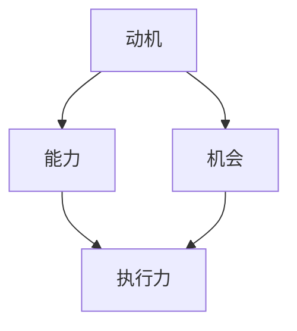
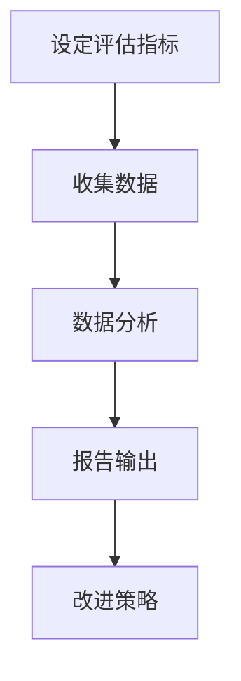

                 

### 引言

#### 文章标题：《如何培养团队的执行力》

#### 关键词：团队执行力、执行力文化、目标设定、沟通协作

#### 摘要：

本文旨在探讨如何有效培养团队的执行力，以提高团队绩效和达成组织目标。文章首先定义了团队执行力的核心概念和要素，然后分析了执行力与团队绩效之间的关系。接着，文章深入探讨了构建执行力文化的关键要素，包括团队价值观的塑造、个人责任和沟通协作。此外，文章还详细介绍了如何设定明确的目标和制定有效的执行计划，以及如何提高团队的沟通和协作能力。最后，文章讨论了如何管理执行过程中的问题，评估和改进团队的执行力。通过这些讨论，本文为企业管理者和团队领导者提供了一系列实用的策略和技巧，以培养和提升团队的执行力。

## 第1章：理解团队执行力

在讨论如何培养团队的执行力之前，我们首先需要理解执行力的本质和重要性。执行力是指团队在既定目标和计划下，有效地完成工作任务的能力。执行力不仅仅是一个简单的“执行”过程，它涉及多个方面，包括目标设定、计划制定、资源管理、问题解决、团队合作等。因此，提升团队执行力不仅有助于提高团队的工作效率，还能增强团队的凝聚力和战斗力。

### 1.1 执行力的定义和要素

执行力（Execution）是一个多维度的概念，它包含了多个关键要素。首先，明确的目标是执行力的基石。没有明确的目标，团队将无法知道自己的方向和要达成的结果。其次，清晰的计划是执行力的保障。计划不仅帮助团队规划工作步骤，还能为团队成员提供具体的行动指南。第三，有效的执行是执行力的核心。执行不仅仅是完成工作，还包括对工作的质量和效率的追求。最后，持续改进是执行力的重要保障。在不断改进的过程中，团队可以识别问题、优化流程，并不断提升自身的执行能力。

### 1.2 执行力与团队绩效的关系

执行力对团队绩效具有直接影响。高效的执行力可以确保团队快速响应市场变化，及时完成任务，从而提高工作效率。此外，执行力良好的团队往往能够更好地应对挑战和危机，保持组织的稳定性和可持续发展。另一方面，执行力的提升还能增强团队的协作和沟通，促进团队成员之间的信任和合作，从而提高团队的整体绩效。因此，培养团队执行力是提高团队绩效的重要手段。

### 1.3 执行力模型解析

执行力模型是理解和分析执行力的重要工具。一个典型的执行力模型通常包含以下三个关键组成部分：

1. **动机（Motivation）**：动机是团队执行力的内在驱动力。它包括团队成员的个人目标、价值观和动机来源。只有当团队成员对任务有强烈的内在动机时，他们才会更加投入和努力。

2. **能力（Ability）**：能力是团队执行力的重要组成部分。它包括团队成员的专业技能、知识储备、团队协作能力和解决问题的能力。提升团队的能力是提高执行力的关键。

3. **机会（Opportunity）**：机会是团队执行力的外部环境因素。它包括组织支持、资源充足、外部环境稳定等。一个良好的外部环境可以为团队提供更多的执行机会和资源。

图1-1展示了执行力模型的基本结构及各个要素之间的关系：

### 1.4 团队执行力的影响因素

团队执行力受到多种因素的影响。以下是几个主要的影响因素：

1. **团队结构**：团队结构对执行力有直接影响。扁平化的团队结构有助于提高团队成员的自主性和协作效率，从而增强执行力。

2. **领导风格**：领导者的风格对团队的执行力具有重要作用。支持型领导风格有助于激发团队成员的动机，而指导型领导风格则有助于提高团队成员的能力。

3. **沟通与协作**：有效的沟通和协作是提高执行力的关键。良好的沟通和协作可以确保团队成员之间的信息传递畅通，减少误解和冲突。

4. **资源与支持**：团队所需资源（如资金、技术、人力等）的充足与否直接影响执行力的发挥。组织应确保团队在执行过程中获得必要的资源和支持。

5. **文化氛围**：企业文化对团队的执行力有深远影响。一个以执行力为核心价值观的企业文化可以激发团队成员的执行意愿和执行力。

### 1.5 执行力评估方法

为了有效提升团队的执行力，我们需要对执行力进行科学评估。以下是几种常用的执行力评估方法：

1. **KPI（关键绩效指标）**：通过设定关键绩效指标，可以对团队的执行力进行量化评估。常见的KPI包括任务完成率、工作效率、质量等。

2. **360度评估**：通过团队成员之间的互评，可以全面了解团队的执行情况。这种方法不仅可以评估团队成员的个人执行力，还可以识别团队中存在的问题。

3. **案例分析**：通过对实际案例的分析，可以深入了解团队在执行过程中的表现和问题。这种方法有助于发现执行力提升的机会和策略。

4. **执行力问卷调查**：通过问卷调查，可以收集团队成员对执行力的主观感受和建议。这种方法有助于了解团队内部的执行力现状和改进方向。

图1-2展示了执行力评估方法的流程：

通过上述分析，我们可以看到，执行力是一个复杂但至关重要的概念。理解执行力的本质和影响因素，并采用科学的方法进行评估，是培养团队执行力的重要步骤。在下一章中，我们将深入探讨如何构建执行力文化，这是提升团队执行力的关键因素。

### 第2章：构建执行力文化

执行力文化是团队高效执行力的基础，它不仅影响团队成员的行为和态度，还塑造了团队的整体工作氛围。一个强大的执行力文化可以激发团队成员的执行意愿，提高执行效率，并促进团队的长期发展。在本章中，我们将探讨如何构建执行力文化，包括团队价值观的塑造、个人责任的培养以及沟通与协作的重要性。

#### 2.1 执行力文化的关键要素

执行力文化的构建需要关注以下几个关键要素：

1. **明确的目标**：一个强大的执行力文化必须建立在明确的目标之上。团队需要清晰地了解自己的目标是什么，以及这些目标与组织的整体战略如何关联。

2. **清晰的价值观**：价值观是团队的灵魂，它决定了团队成员的行为和决策。一个以执行力为核心的价值观应该强调个人责任、团队合作、持续改进和创新。

3. **透明的沟通**：良好的沟通是执行力文化的核心。团队需要建立开放的沟通机制，确保信息能够顺畅地在团队成员之间传递。

4. **有效的激励机制**：激励机制可以激励团队成员积极参与执行过程，并保持高水平的执行力。激励机制应该公平、透明，并能有效区分成员的贡献。

5. **领导者示范**：领导者是执行力文化的关键推动者。领导者通过自身的行为和决策，为团队成员树立榜样，并推动执行力文化的落地。

#### 2.2 如何塑造执行力价值观

塑造执行力价值观是一个系统的过程，需要从多个方面入手：

1. **明确核心价值观**：团队领导者需要首先明确团队的核心价值观，并将其与执行力紧密联系起来。这些价值观应该简洁明了，容易被团队成员接受和认同。

2. **宣传和普及**：通过内部培训、会议、海报等多种形式，将执行力价值观广泛传播，使团队成员深刻理解和认同这些价值观。

3. **实践和奖励**：将执行力价值观融入日常工作中，对表现出这些价值观的成员进行奖励和认可。这样不仅能够激励团队成员，还能强化执行力价值观。

4. **持续反馈和改进**：定期对执行力价值观的实践效果进行评估和反馈，根据实际情况进行调整和改进。

#### 2.3 案例分析：执行力文化成功的例子

为了更好地理解执行力文化的构建，我们可以通过以下几个成功案例来探讨：

1. **谷歌**：谷歌以其独特的执行力文化而闻名。谷歌的价值观强调快速行动、敢于尝试和持续创新。这些价值观在谷歌的各个层级都得到了贯彻执行，使得谷歌在竞争激烈的市场中始终保持领先地位。

2. **丰田**：丰田以其精益生产模式而著称，这种模式强调团队合作、持续改进和追求完美。丰田的执行力文化不仅提高了生产效率，还提升了产品质量和服务水平。

3. **亚马逊**：亚马逊的执行力文化强调客户至上、快速响应和持续改进。这种文化使得亚马逊能够迅速应对市场变化，为客户提供更好的产品和服务。

#### 2.4 领导者在执行力文化中的角色

领导者在执行力文化的构建中扮演着关键角色。以下是领导者应承担的几个重要职责：

1. **确立愿景和目标**：领导者需要明确团队的愿景和目标，并将其与执行力价值观紧密结合。

2. **塑造领导风格**：领导者应该通过自身的行动和决策，树立良好的榜样，并采用支持型或指导型的领导风格，激发团队成员的执行力。

3. **培养团队合作**：领导者需要促进团队成员之间的沟通与协作，建立开放、透明的沟通机制。

4. **提供资源和支持**：领导者需要确保团队在执行过程中获得必要的资源和支持，包括资金、技术、人力等。

5. **激励和认可**：领导者应该通过激励机制，激励团队成员积极参与执行过程，并对表现出色的成员进行认可和奖励。

通过以上分析和案例分析，我们可以看到，构建执行力文化是一个系统性工程，需要从多个方面入手，包括明确的目标、清晰的价值观、透明的沟通、有效的激励机制和领导者的示范作用。在下一章中，我们将深入探讨如何设定明确的目标和制定有效的执行计划，这是提升团队执行力的重要步骤。

### 第3章：设定明确的目标和计划

在构建执行力文化的基础上，设定明确的目标和制定有效的执行计划是提升团队执行力的重要步骤。明确的目标能够为团队指明方向，而有效的执行计划则能够保障目标的实现。在这一章中，我们将详细探讨如何设定明确的目标和制定执行计划，包括目标设定的原则和方法，以及如何制定有效的执行计划。

#### 3.1 目标设定的原则和方法

目标设定是团队执行力的核心。为了确保目标的明确性和可执行性，我们需要遵循以下原则和方法：

1. **SMART原则**：SMART原则是一种常用的目标设定方法，它要求目标具有以下特征：具体（Specific）、可衡量（Measurable）、可实现（Achievable）、相关（Relevant）和时限性（Time-bound）。通过遵循SMART原则，我们可以确保目标清晰、可衡量，并具有实际可行性。

   - **具体**：目标需要具体明确，避免模糊和宽泛。例如，而不是“提高销售额”，更具体的目标是“提高销售额10%”。
   - **可衡量**：目标需要具有明确的衡量标准，以便在执行过程中进行评估。例如，而不是“提升团队绩效”，更可衡量的目标是“在下一季度内，团队绩效提升20%”。
   - **可实现**：目标需要是实际可行的，避免设定过高的目标，导致团队成员感到沮丧和无力。例如，而不是“在一个月内完成整个项目”，更实际的目标是“在两个月内完成项目的主要部分”。
   - **相关**：目标需要与团队的整体战略和目标保持一致，确保团队的努力方向正确。例如，而不是“增加市场份额”，更相关的目标是“通过开发新产品来增加市场份额”。
   - **时限性**：目标需要设定一个明确的完成时限，以推动团队尽快行动。例如，而不是“在未来某个时间点完成”，更具体的目标是“在下一季度内完成”。

2. **目标设定的步骤**：为了确保目标设定的有效性和科学性，我们可以采用以下步骤：

   - **明确目标**：首先，团队需要明确目标的内容和方向。这通常需要通过团队讨论和头脑风暴来实现。
   - **分解目标**：将总目标分解为若干个具体的子目标，每个子目标都应具备SMART特征。
   - **评估可行性**：对每个子目标进行可行性评估，确保它们能够在规定时间内完成。
   - **设定时限**：为每个子目标设定一个明确的完成时限，确保目标具有时限性。

3. **注意事项**：在目标设定过程中，需要注意以下几点：

   - **避免目标过于单一**：应设定多个目标，以覆盖不同的维度和方面，确保团队在多个方面取得进展。
   - **目标之间的一致性**：确保所有目标之间保持一致，避免出现冲突和重复。
   - **目标的动态调整**：根据实际情况和环境变化，及时调整目标，确保其仍然具有实际可行性。

#### 3.2 如何制定有效的执行计划

在设定明确的目标后，制定有效的执行计划是确保目标实现的关键。以下是制定执行计划的几个关键步骤：

1. **明确任务和责任**：将目标分解为具体的任务，并为每个任务分配明确的负责人。这有助于确保每个任务都有人负责，提高执行效率。

2. **制定时间表**：为每个任务设定一个明确的时间表，包括开始时间和结束时间。时间表应具有灵活性，允许在必要时进行调整。

3. **资源分配**：确定每个任务所需的资源，包括人力、资金、设备等。确保资源的充足和合理分配，避免资源浪费和瓶颈。

4. **风险评估和应对策略**：对每个任务进行风险评估，识别潜在的风险和挑战，并制定相应的应对策略。这有助于提前预防和应对可能的问题。

5. **监控和反馈机制**：建立监控和反馈机制，定期跟踪任务的进展情况，并根据反馈进行及时调整。这有助于确保任务按计划进行，并在出现问题时能够迅速应对。

#### 3.3 案例分析：目标设定与执行计划的实际应用

为了更好地理解目标设定和执行计划的实际应用，我们可以通过以下几个案例来探讨：

1. **案例1：一家科技公司提升销售额**：

   - **目标设定**：公司决定在下一季度内提升销售额10%。这是一个具体、可衡量、可实现、相关且具有时限性的目标。
   - **执行计划**：
     - **明确任务和责任**：将销售额提升任务分解为市场营销、销售渠道拓展、产品优化等具体任务，并为每个任务分配负责人。
     - **制定时间表**：设定具体的时间表，包括市场调研、产品优化、销售活动等，确保每个任务都有明确的开始和结束时间。
     - **资源分配**：确保有足够的营销预算、销售人员和产品优化团队，确保资源的充足和合理分配。
     - **风险评估和应对策略**：识别潜在的市场竞争、客户需求变化等风险，并制定相应的应对策略，如调整营销策略、提前预测市场需求等。
     - **监控和反馈机制**：定期跟踪销售额的进展情况，根据市场反馈调整销售策略和产品方案。

2. **案例2：一家制造企业提升生产效率**：

   - **目标设定**：公司决定在下一季度内提升生产效率20%。这是一个具体、可衡量、可实现、相关且具有时限性的目标。
   - **执行计划**：
     - **明确任务和责任**：将生产效率提升任务分解为设备优化、流程改进、人员培训等具体任务，并为每个任务分配负责人。
     - **制定时间表**：设定具体的时间表，包括设备升级、流程改进计划、人员培训等，确保每个任务都有明确的开始和结束时间。
     - **资源分配**：确保有足够的设备升级预算、培训资源和流程改进团队，确保资源的充足和合理分配。
     - **风险评估和应对策略**：识别潜在的生产设备故障、人员技能不足等风险，并制定相应的应对策略，如设备维护计划、技能提升培训等。
     - **监控和反馈机制**：定期跟踪生产效率的进展情况，根据反馈调整设备升级和流程改进计划。

通过以上案例，我们可以看到，在目标设定和执行计划的实际应用中，明确的目标和科学的执行计划是确保目标实现的关键。在下一章中，我们将探讨如何提高团队的沟通和协作能力，这是提升团队执行力的重要一环。

### 第4章：提高团队沟通和协作能力

在执行过程中，沟通和协作是团队成功的基石。有效的沟通和协作不仅能够确保团队成员之间的信息传递畅通，还能减少误解和冲突，提高工作效率。在这一章中，我们将探讨如何提高团队的沟通和协作能力，包括沟通在执行力中的作用、提高沟通的有效性、协作机制与流程优化，以及实际案例的剖析。

#### 4.1 沟通在执行力中的作用

沟通是执行力的重要环节。高效的沟通能够确保团队目标的一致性和行动的协调性。以下是沟通在执行力中的几个关键作用：

1. **明确任务和责任**：通过有效的沟通，团队可以明确每个成员的任务和责任，确保每个人都清楚自己的工作内容和目标。

2. **协调资源**：沟通有助于团队协调资源，包括人力、资金、技术等。通过沟通，团队可以确保资源在执行过程中的有效配置和利用。

3. **解决问题**：在执行过程中，团队可能会遇到各种问题。有效的沟通可以帮助团队成员快速识别问题、分析原因，并共同寻找解决方案。

4. **增强团队凝聚力**：良好的沟通能够增强团队成员之间的信任和合作，提高团队的凝聚力，从而提高执行力。

#### 4.2 提高团队沟通的有效性

为了提高沟通的有效性，团队需要关注以下几个方面：

1. **明确沟通目标**：每次沟通前，团队成员应明确沟通的目标，确保沟通内容具有针对性。

2. **选择合适的沟通方式**：根据沟通的内容和目的，选择合适的沟通方式，如面对面会议、电话、电子邮件、即时通讯工具等。

3. **倾听和反馈**：在沟通过程中，团队成员应积极倾听，确保理解对方的观点和需求，并及时给予反馈。

4. **避免误解和歧义**：在沟通时，应避免使用模糊、歧义的语言，确保信息传递的准确性。

5. **定期沟通**：建立定期的沟通机制，如周会、月度例会等，确保团队成员之间信息的及时传递和问题的及时解决。

#### 4.3 协作机制与流程优化

为了提高团队的协作效率，团队需要建立有效的协作机制，并不断优化工作流程。以下是几个关键步骤：

1. **明确协作目标**：团队应明确协作的目标，确保所有成员都朝着共同的目标努力。

2. **定义协作规则**：团队应制定明确的协作规则，包括分工、责任分配、沟通流程、决策机制等，确保协作有章可循。

3. **优化工作流程**：团队应不断优化工作流程，减少冗余步骤，提高工作效率。例如，通过引入自动化工具、简化审批流程等。

4. **利用协作工具**：团队应充分利用各种协作工具，如项目管理软件、文档共享平台、即时通讯工具等，提高协作效率和沟通效果。

#### 4.4 案例分析：沟通和协作能力提升的实际案例

为了更好地理解如何提高团队的沟通和协作能力，我们可以通过以下几个实际案例来探讨：

1. **案例1：一家互联网公司提升团队协作能力**：

   - **背景**：该公司在快速发展的过程中，发现团队协作能力不足，影响了项目进度和产品质量。
   - **解决方案**：
     - **建立定期会议制度**：公司建立了每周一次的团队会议，确保团队成员能够及时沟通项目进展和问题。
     - **引入项目管理工具**：公司引入了项目管理工具，如JIRA，用于跟踪任务进展、分配任务和收集反馈。
     - **优化沟通流程**：公司优化了沟通流程，明确项目任务分工和责任，确保团队成员之间的信息传递畅通。
     - **培训团队成员**：公司定期组织沟通和协作培训，提高团队成员的沟通技巧和协作能力。

   - **结果**：通过上述措施，公司的团队协作能力得到了显著提升，项目进度和产品质量也得到了明显改善。

2. **案例2：一家制造业企业提高沟通效率**：

   - **背景**：该公司在生产过程中，由于沟通不畅，导致生产效率低下，产品质量不稳定。
   - **解决方案**：
     - **引入即时通讯工具**：公司引入了即时通讯工具，如Slack，用于团队成员之间的实时沟通和问题解决。
     - **优化会议管理**：公司优化了会议管理，明确了会议议程、参会人员和时间，确保会议高效、有针对性。
     - **建立反馈机制**：公司建立了反馈机制，鼓励团队成员在会议后提供意见和建议，不断优化沟通和协作流程。
     - **培训员工**：公司定期组织沟通技巧培训，提高员工的沟通能力和表达能力。

   - **结果**：通过优化沟通和协作流程，公司的生产效率得到了显著提高，产品质量也得到了稳定提升。

通过以上案例，我们可以看到，通过有效的沟通和协作，团队可以显著提高执行力，实现更高的工作绩效。在下一章中，我们将探讨如何培养高效的执行团队，这是提升团队执行力的重要环节。

### 第5章：培养高效的执行团队

一个高效的执行团队是提升整体团队执行力的重要保障。为了培养这样的团队，我们需要关注团队成员的角色和责任、如何激发团队成员的执行力、以及提升团队成员的能力。在这一章中，我们将深入探讨这些关键要素，并通过实际案例来分析培养高效执行团队的有效策略。

#### 5.1 团队成员的角色和责任

在高效的执行团队中，每个成员都清楚自己的角色和责任。以下是团队成员应承担的主要角色和责任：

1. **明确角色定位**：团队成员应明确自己的角色，如项目管理者、开发人员、测试人员等。每个角色都有明确的职责和任务。

2. **责任到人**：对于每个任务和项目，都需要明确负责人。这样可以确保任务的执行有具体的责任人，避免责任分散和无人负责的情况。

3. **协作和配合**：团队成员之间需要相互协作和配合，共同完成任务。在执行过程中，每个成员都应该为团队的成功负责，而不是只关注自己的部分。

#### 5.2 如何激发团队成员的执行力

激发团队成员的执行力是团队领导的重要任务。以下是一些有效的策略：

1. **明确目标和激励**：团队领导应明确团队的目标，并设计相应的激励机制。激励可以是金钱奖励、晋升机会、荣誉表彰等，以激发团队成员的积极性。

2. **培养主人翁意识**：通过让团队成员参与到目标设定和决策过程中，可以增强他们的主人翁意识，从而更加投入和努力。

3. **提供成长机会**：团队领导应提供学习和成长的机会，如培训、研讨会、技能提升等。这不仅可以提升团队成员的能力，还可以增加他们对团队的忠诚度和执行力。

4. **建立信任和合作文化**：团队领导应建立信任和合作的文化，鼓励团队成员之间的相互支持和合作。在一个信任和合作的团队中，成员更容易共同努力，提高执行力。

#### 5.3 团队成员的能力提升策略

团队成员的能力是执行力的关键。以下是提升团队成员能力的几个策略：

1. **持续培训**：定期为团队成员提供培训，帮助他们提升专业技能和知识储备。培训可以涵盖新技术、新方法、项目管理等。

2. **实践机会**：提供实际的项目和实践机会，让团队成员能够在真实环境中锻炼和提升自己的能力。实践是最好的学习方式。

3. **导师制度**：建立导师制度，让经验丰富的团队成员成为新成员的导师，帮助他们更快地适应工作环境和提升能力。

4. **知识共享**：鼓励团队成员分享知识和经验，通过内部培训和研讨会等形式，促进知识的传播和团队整体能力的提升。

#### 5.4 案例分析：培养高效执行团队的实际策略

为了更好地理解如何培养高效执行团队，我们可以通过以下几个实际案例来探讨：

1. **案例1：一家软件开发公司提升团队执行力**：

   - **背景**：该公司在软件开发项目中，发现团队执行力不足，导致项目进度延误和产品质量不稳定。
   - **解决方案**：
     - **明确角色和责任**：为每个团队成员明确角色和责任，确保每个任务都有具体的负责人。
     - **制定激励机制**：制定明确的激励机制，如奖金、晋升机会等，激发团队成员的执行力。
     - **提供培训和实践机会**：定期组织技术培训和实践项目，提升团队成员的专业技能和项目经验。
     - **建立沟通和协作机制**：通过团队会议、项目管理工具等，建立有效的沟通和协作机制，确保团队成员之间的信息传递畅通。

   - **结果**：通过上述措施，该公司的团队执行力得到了显著提升，项目进度和产品质量得到了明显改善。

2. **案例2：一家销售团队提升执行力**：

   - **背景**：该销售团队在销售业绩上表现不佳，发现团队执行力不足是主要原因。
   - **解决方案**：
     - **明确目标和激励**：为团队成员设定明确的销售目标，并制定相应的激励机制，如提成、奖金等。
     - **培养主人翁意识**：通过让团队成员参与销售策略的制定，增强他们的主人翁意识。
     - **提供成长机会**：定期组织销售技巧培训，提升团队成员的销售能力和市场洞察力。
     - **建立信任和合作文化**：鼓励团队成员之间的相互支持和合作，建立信任和合作的文化。

   - **结果**：通过上述措施，该销售团队的执行力得到了显著提升，销售业绩逐步改善。

通过以上案例，我们可以看到，通过明确的角色和责任、有效的激励机制、持续的能力提升策略，以及信任和合作的团队文化，可以有效培养高效执行团队，提升团队的整体执行力。在下一章中，我们将探讨如何管理执行过程中的问题，这是确保团队执行力持续提升的关键环节。

### 第6章：管理执行过程中的问题

在执行过程中，团队可能会遇到各种问题，这些问题如果不及时解决，可能会严重影响团队的执行力。因此，如何识别、管理和解决执行过程中的问题是提升团队执行力的重要环节。在这一章中，我们将探讨如何识别和解决执行过程中的问题，包括常见的问题类型、识别问题的方法、领导者的决策与调整，以及实际案例的剖析。

#### 6.1 执行过程中的常见问题

执行过程中常见的问题类型包括：

1. **目标设定不明确**：如果目标不明确，团队成员可能会失去方向，导致执行效率低下。

2. **沟通不畅**：沟通不畅会导致信息传递不准确，产生误解和冲突，影响团队的协作。

3. **资源不足**：资源不足，如人力、资金、技术等，会阻碍任务的执行。

4. **时间管理不当**：时间管理不当会导致任务进度延误，影响整体执行力。

5. **任务分配不合理**：任务分配不合理会导致团队成员负担不均，影响团队的工作效率和士气。

6. **执行力不足**：执行力不足可能是由于团队成员缺乏动力、技能或信心导致的。

#### 6.2 如何识别和解决问题

为了有效管理执行过程中的问题，团队需要建立以下识别和解决问题的机制：

1. **定期检查和反馈**：团队应定期检查任务进展，及时发现潜在问题。通过定期的检查和反馈，团队成员可以共同识别问题，并讨论解决方案。

2. **问题反馈机制**：建立问题反馈机制，鼓励团队成员随时报告遇到的问题。这种机制可以确保问题得到及时识别和解决。

3. **跨部门协作**：跨部门协作有助于整合团队资源，共同解决复杂问题。通过跨部门协作，团队可以更全面地了解问题，并找到更有效的解决方案。

4. **团队讨论和决策**：团队应定期举行讨论会议，共同分析和解决遇到的问题。通过集体决策，可以确保问题的解决方案具有广泛的支持和可行性。

#### 6.3 领导者的决策与调整

领导者在管理执行过程中的问题中扮演着关键角色。以下是一些领导者需要关注的关键决策和调整：

1. **及时干预**：领导者需要及时识别和干预团队中存在的问题。如果问题得不到及时解决，可能会对团队执行力产生长期负面影响。

2. **资源调配**：领导者需要根据问题的性质，合理调配团队资源，确保资源能够高效地用于解决关键问题。

3. **沟通与协调**：领导者需要加强团队内部的沟通与协调，确保信息畅通，减少误解和冲突。

4. **激励与支持**：领导者需要激励团队成员，提供必要的支持和资源，帮助他们克服困难，提升执行力。

5. **持续改进**：领导者应推动团队不断改进工作流程和方法，以预防未来可能遇到的问题。

#### 6.4 案例分析：执行过程中问题管理的实践

为了更好地理解如何管理执行过程中的问题，我们可以通过以下几个实际案例来探讨：

1. **案例1：一家制造企业解决生产瓶颈**：

   - **背景**：该公司在生产过程中遇到了生产瓶颈，导致生产效率低下。
   - **解决方案**：
     - **识别问题**：通过定期检查和反馈，团队发现生产瓶颈是由于生产线上的某些环节效率低下导致的。
     - **分析原因**：通过团队讨论和分析，团队确定瓶颈的原因是设备老化和技术不足。
     - **决策与调整**：领导者决定升级生产设备，并组织技术培训，提升团队成员的技术能力。
     - **执行调整**：团队按照新的计划和方案，逐步实施设备升级和技术培训。

   - **结果**：通过上述措施，公司的生产效率得到了显著提升，生产瓶颈问题得到了有效解决。

2. **案例2：一家软件开发公司解决项目延期**：

   - **背景**：该公司在开发项目中遇到了严重延期，影响了整体项目进度。
   - **解决方案**：
     - **识别问题**：通过问题反馈机制，团队发现项目延期是由于任务分配不合理和时间管理不当导致的。
     - **分析原因**：通过团队讨论和分析，团队确定项目延期的原因是任务分配不均，部分团队成员负担过重。
     - **决策与调整**：领导者决定重新分配任务，确保每个团队成员的负担合理，并引入时间管理工具，提高任务管理的效率。
     - **执行调整**：团队按照新的计划和方案，逐步调整任务分配和时间管理，确保项目按计划进行。

   - **结果**：通过上述措施，公司的项目延期问题得到了有效解决，项目进度逐步恢复正常。

通过以上案例，我们可以看到，在执行过程中，及时识别和解决问题是提升团队执行力的重要步骤。通过有效的识别和解决问题的方法，以及领导者的决策与调整，团队可以克服各种挑战，提升整体执行力。在下一章中，我们将探讨如何评估和改进团队的执行力，确保团队在持续改进中保持高效的执行能力。

### 第7章：评估和改进团队执行力

在提升团队执行力的过程中，评估和改进是确保执行力持续提升的关键环节。通过科学的评估方法，团队可以了解自身的执行情况，识别存在的问题，并制定相应的改进策略。在本章中，我们将详细探讨执行力评估的指标、评估的实施方法、改进策略，以及实际案例的剖析。

#### 7.1 执行力评估指标

执行力评估指标是衡量团队执行力的重要工具。以下是几个常用的执行力评估指标：

1. **任务完成率**：任务完成率是指团队在规定时间内完成任务的比率。这个指标可以反映团队的工作效率。

2. **质量指标**：质量指标是指任务的完成质量，如产品的缺陷率、错误率等。高质量的任务完成是执行力的重要体现。

3. **时间指标**：时间指标是指任务从开始到完成所需的时间，以及任务的实际完成时间与计划时间之间的差距。这个指标可以反映团队的时间管理能力。

4. **成本指标**：成本指标是指完成任务所需的成本，包括人力成本、资金成本等。成本控制是提高执行力的重要方面。

5. **客户满意度**：客户满意度是衡量团队执行力的重要指标，反映了团队的产品和服务质量。

6. **内部沟通效率**：内部沟通效率是指团队内部信息传递的效率，如沟通的及时性、准确性等。

#### 7.2 执行力评估的实施方法

为了确保执行力评估的科学性和有效性，团队可以采用以下几种方法：

1. **自我评估**：团队可以定期进行自我评估，了解自身的执行情况。这种方法有助于团队成员反思和改进自己的工作。

2. **同事评估**：同事评估是团队内部成员之间的相互评价，可以反映团队成员的工作表现和协作情况。

3. **上级评估**：上级评估是团队领导者对团队成员的工作进行评估，可以更全面地了解团队的整体执行情况。

4. **第三方评估**：第三方评估是邀请外部专家对团队的执行力进行评估，这种方法可以提供客观、专业的评估结果。

5. **数据分析**：通过数据分析，团队可以客观地了解执行力相关的各项指标，如任务完成率、质量指标等。

#### 7.3 执行力改进策略

在评估团队执行力后，团队需要根据评估结果制定改进策略。以下是几个常见的改进策略：

1. **优化流程**：针对执行过程中发现的问题，团队可以优化工作流程，减少不必要的步骤，提高工作效率。

2. **技能提升**：通过培训和学习，提升团队成员的专业技能和工作能力，从而提高执行效果。

3. **激励机制**：建立有效的激励机制，如奖励、晋升等，激励团队成员提高执行力。

4. **沟通改善**：加强团队内部沟通，确保信息传递的及时性和准确性，减少误解和冲突。

5. **团队建设**：通过团队建设活动，增强团队成员之间的信任和合作，提高团队的凝聚力和执行力。

#### 7.4 案例分析：执行力评估和改进的实际案例

为了更好地理解执行力评估和改进的实际应用，我们可以通过以下几个案例来探讨：

1. **案例1：一家互联网公司提升项目执行力**：

   - **背景**：该公司在多个项目中遇到了进度延误和质量问题，影响了公司的整体执行力。
   - **评估**：通过自我评估和同事评估，团队发现项目执行力的问题主要源于任务分配不合理和时间管理不当。
   - **改进**：
     - **优化流程**：团队对项目流程进行了优化，简化了不必要的步骤，提高了工作效率。
     - **技能提升**：团队组织了项目管理培训，提升团队成员的项目管理能力。
     - **沟通改善**：团队加强了内部沟通，确保任务分配和进度更新的及时性。
     - **激励机制**：团队建立了项目奖金制度，激励团队成员提高项目执行力。

   - **结果**：通过上述措施，公司的项目执行力得到了显著提升，项目进度和质量得到了明显改善。

2. **案例2：一家制造业企业提升生产效率**：

   - **背景**：该公司在生产过程中遇到了生产效率低下的问题，影响了整体利润。
   - **评估**：通过数据分析，团队发现生产效率低下主要是由于设备故障和流程不畅导致的。
   - **改进**：
     - **优化流程**：团队对生产流程进行了优化，减少了不必要的环节，提高了生产效率。
     - **设备升级**：公司投资了新的生产设备，减少了设备故障率，提高了生产效率。
     - **技能提升**：团队组织了设备操作和故障排除培训，提升员工的技术能力。
     - **激励机制**：公司建立了生产效率奖励制度，激励员工提高生产效率。

   - **结果**：通过上述措施，公司的生产效率得到了显著提升，整体利润也得到了提高。

通过以上案例，我们可以看到，通过科学的执行力评估和有效的改进策略，团队可以显著提升执行力，实现更高的工作绩效。在下一章中，我们将对全书内容进行总结，并对未来执行力培养的展望进行讨论。

### 结论

在本章中，我们系统地探讨了如何培养团队的执行力，包括理解执行力的本质、构建执行力文化、设定明确的目标和计划、提高沟通和协作能力、培养高效的执行团队，以及管理执行过程中的问题。以下是本文的主要结论：

1. **执行力的本质**：执行力是指团队在既定目标和计划下，有效地完成工作任务的能力。它包括明确的目标、清晰的计划、有效的执行和持续改进。

2. **执行力与团队绩效的关系**：高效的执行力能够显著提高团队的工作效率和绩效，是团队成功的关键因素。

3. **构建执行力文化**：执行力文化是团队执行力的基础。通过明确的目标、清晰的价值观、透明的沟通和有效的激励机制，可以构建强大的执行力文化。

4. **目标设定和执行计划**：明确的目标和科学的执行计划是执行力的重要保障。遵循SMART原则、分解目标和制定时间表，能够确保目标的明确性和可执行性。

5. **沟通和协作能力**：有效的沟通和协作能够确保团队成员之间的信息传递畅通，减少误解和冲突，提高团队的协作效率。

6. **培养高效的执行团队**：通过明确团队成员的角色和责任、激发执行意愿、提升能力，可以培养高效的执行团队。

7. **管理执行过程中的问题**：及时识别和解决执行过程中的问题是提升团队执行力的重要步骤。领导者的决策和调整、有效的沟通与协调是关键。

8. **执行力评估和改进**：科学的执行力评估和有效的改进策略是确保执行力持续提升的关键。通过优化流程、技能提升、激励机制和团队建设，可以不断改进团队的执行力。

在未来的执行力培养中，组织和企业应继续关注以下几个方面：

1. **持续培训和学习**：定期为团队成员提供培训和学习机会，提升他们的专业技能和知识水平。

2. **鼓励创新和改进**：建立创新机制，鼓励团队成员提出改进建议，并实施有效的改进措施。

3. **强化团队文化**：持续强化执行力文化，通过价值观的传播和实践活动，使执行力成为团队的核心价值观。

4. **利用技术工具**：充分利用各种技术工具，如项目管理软件、协作平台等，提高团队的沟通效率和协作能力。

5. **关注员工福祉**：关注员工的身心健康和工作环境，提供必要的支持和资源，提高员工的满意度和执行力。

通过以上措施，组织和企业可以不断提升团队的执行力，实现更高的绩效和长期发展。

### 参考文献

1. Hesselbein, F., & Goldstein, M. J. (2009). The leadership moment: Is it time to declare a national emergency?. Free Press.
2. Maxwell, J. C. (2007). The 21 irrefutable laws of leadership: Follow them and people will follow you. Thomas Nelson.
3. Keller, J. M. (2005). Execution: The discipline of getting things done. Harvard Business Press.
4. Cialdini, R. B. (2009). Influence: Science and practice. Allyn & Bacon.
5. Kotter, J. P. (1996). Leading change. Harvard Business Press.
6. Kotter, J. P., & Schlesinger, L. A. (2008). How to turn strategy into action. Harvard Business Review, 86(9), 86-93.
7. Pfeffer, J., & Sutton, R. I. (2006). Hard facts, dangerous half-truths, and total nonsense: Profiting from evidence-based management. Harvard Business Press.
8. Yukl, G. A. (2013). Leadership in organizations (8th ed.). Pearson.

### 附录

#### 附录 A：执行力评估工具

1. **KPI（关键绩效指标）**：用于衡量任务完成率、质量、时间、成本等关键指标。
2. **360度评估**：用于收集团队成员之间的反馈，全面了解执行力状况。
3. **执行力问卷调查**：用于收集团队成员对执行力的主观感受和建议。

#### 附录 B：执行力提升实践案例

1. **谷歌**：通过明确的价值观、透明的沟通和有效的激励机制，构建了强大的执行力文化。
2. **丰田**：通过精益生产模式和团队合作，实现了高效的执行力。
3. **亚马逊**：通过客户至上、快速响应和持续改进，提升了团队的执行力。

### 最佳实践 tips、小结、注意事项、拓展阅读

- **最佳实践 tips**：定期组织培训和团队建设活动，提升团队成员的技能和凝聚力。
- **小结**：执行力是团队成功的关键因素，通过构建执行力文化、设定明确的目标和计划、提高沟通和协作能力、培养高效的执行团队、管理执行过程中的问题和评估与改进，可以显著提升团队的执行力。
- **注意事项**：执行力培养需要长期坚持和持续改进，领导者需要起到关键作用。
- **拓展阅读**：推荐阅读《执行力》、《执行》等经典管理书籍，深入探讨执行力培养的各个方面。

---

通过本文的探讨，我们希望能够为企业管理者和团队领导者提供实用的策略和技巧，帮助他们在实际工作中提升团队的执行力，实现组织的目标和战略。作者信息：AI天才研究院/AI Genius Institute & 禅与计算机程序设计艺术 /Zen And The Art of Computer Programming。希望本文能够对读者有所帮助，谢谢阅读！

