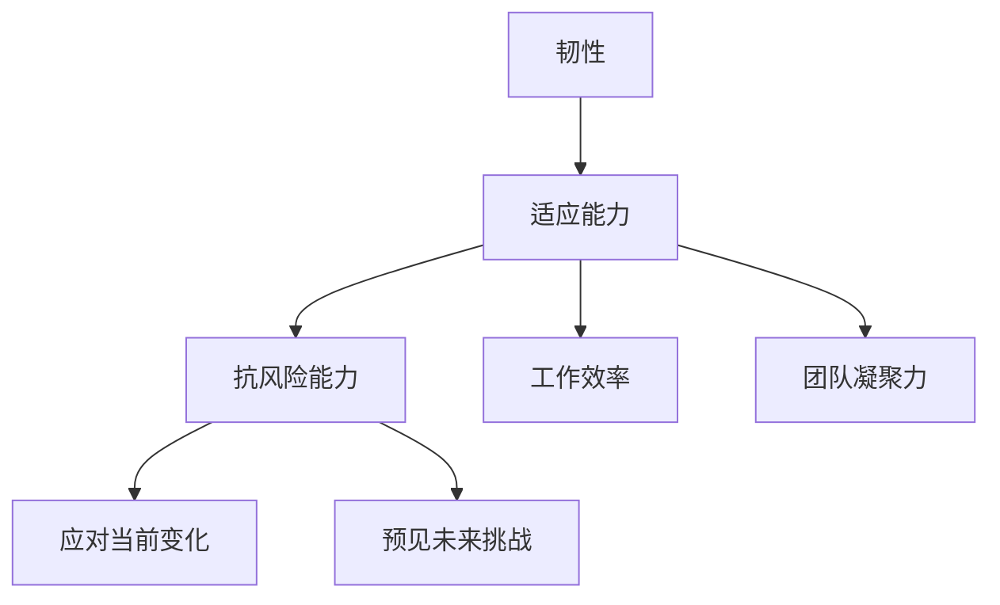
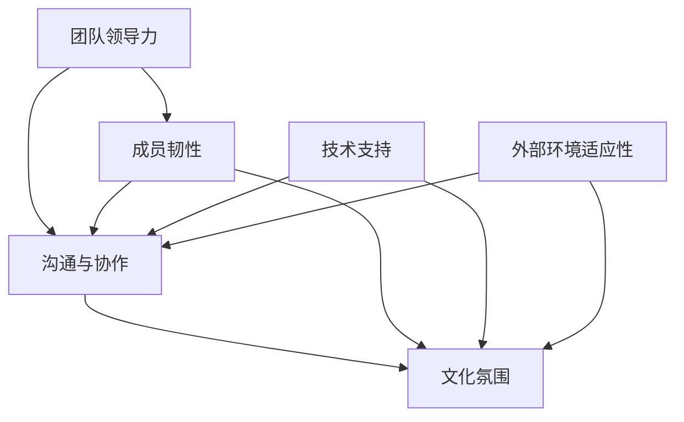

                 

### 文章标题：如何培养团队的韧性和适应能力

#### 关键词：
- 韧性
- 适应能力
- 团队建设
- 领导力
- 沟通协作
- 文化氛围

#### 摘要：
本文旨在探讨如何通过系统化的方法，培养团队的韧性和适应能力。我们将从理解韧性团队的基本概念入手，深入分析韧性团队的核心要素和架构，详细探讨如何构建和提升团队的韧性及适应能力。通过实践案例和经验分享，总结团队韧性建设中的常见问题及解决方案，提供实用的技巧和策略，为团队管理者和技术领袖提供有价值的参考。

---

### 第一部分：理解韧性团队的概念

#### 第1章：韧性团队的基本概念

**1.1 韧性的定义**

韧性（Resilience）是团队在面对不确定性和逆境时，能够快速适应并恢复到正常运作状态的能力。这种能力包括心理韧性、技术韧性和组织韧性。心理韧性指的是团队成员在压力和挑战下的心理承受能力和恢复力；技术韧性指的是团队在技术问题和突发状况下的解决能力和恢复速度；组织韧性指的是团队在面对外部环境变化时的整体适应能力和应变能力。

**韧性的概念与来源**

韧性最早应用于材料科学领域，指的是材料在受到外力作用后，能够恢复到原始形态的能力。随着研究的深入，韧性概念逐渐扩展到心理学、社会学和组织管理领域。在团队管理中，韧性被视为一种重要的能力，能够帮助团队在逆境中保持竞争力。

**韧性的作用与重要性**

韧性对于团队的成功至关重要。首先，韧性能够提升团队的抗风险能力，使团队能够在遇到挑战时迅速调整和适应。其次，韧性有助于提高团队的工作效率和绩效，通过减少因逆境导致的停工时间和效率损失。最后，韧性能够增强团队的凝聚力，促进团队成员之间的协作和信任。

**1.2 韧性与适应能力的关系**

韧性与适应能力密切相关。韧性是适应能力的基础，而适应能力则是韧性在动态环境中的具体表现。一个高韧性的团队不仅能够应对当前的变化，还能够预见未来的挑战，并采取相应的措施进行适应和调整。

**韧性与适应能力的关系图解**

**韧性与适应能力的关系图解说明：**
- 韧性（A）通过提升抗风险能力（C）、工作效率（D）和团队凝聚力（E），促进团队适应能力（B）的提升。
- 适应能力（B）使得团队能够有效应对当前变化（F）和预见未来挑战（G），从而保持长期竞争力。

**韧性与适应能力的作用**

- **提升抗风险能力**：韧性使得团队能够在逆境中保持冷静和稳定，快速调整策略，减少损失。
- **提高工作效率**：韧性有助于团队成员在面临压力时保持高效的工作状态，降低失误率。
- **增强团队凝聚力**：韧性能够增强团队成员之间的信任和协作，提高团队的战斗力和凝聚力。

**1.3 韧性团队的重要性**

韧性团队在现代社会中具有重要地位。首先，随着外部环境的不断变化，韧性团队能够更好地适应市场变化，抓住发展机遇。其次，韧性团队能够更好地应对突发事件和危机，减少对业务的影响。最后，韧性团队能够提升组织的整体绩效和竞争力，为企业的长期发展提供保障。

**韧性与团队绩效的关系**

韧性不仅影响团队的工作效率和凝聚力，还直接关联到团队的绩效。研究表明，韧性较高的团队在面临挑战时，能够更快地恢复并达到或超过之前的绩效水平。此外，韧性有助于团队在面对变化时保持稳定，减少因变革带来的负面影响。

**韧性与组织稳定性的关系**

韧性团队有助于提升组织的稳定性。在多变的市场环境中，组织能否保持稳定对企业的长期发展至关重要。韧性团队通过增强组织的适应能力，使组织能够迅速应对外部环境的变动，从而保持稳定。

#### 第2章：团队韧性架构

**2.1 韧性团队的基本要素**

韧性团队的基本要素包括：

1. **领导力**：领导者在推动团队韧性建设中的关键作用。
2. **沟通**：团队成员之间的有效沟通是团队韧性建设的基础。
3. **协作**：团队成员之间的协作与支持是提升团队适应能力的重要保障。
4. **文化**：建立积极、开放和持续改进的文化氛围。
5. **成员韧性**：提高团队成员面对挑战和变化的心理承受能力。
6. **技术支持**：提供必要的技术工具和资源，支持团队韧性建设。
7. **外部环境适应性**：通过提升团队对外部环境的适应能力，增强团队韧性。

**2.2 韧性团队的框架模型**

韧性团队的框架模型如下：

**框架模型说明：**

- **团队领导力**：领导者在推动团队韧性建设中的关键作用。领导力包括决策能力、激励能力和变革能力，能够引导团队面对挑战和变化。
- **沟通与协作**：确保团队成员之间的信息畅通和有效协作。沟通和协作是团队韧性建设的基础，能够提升团队成员之间的信任和协作效率。
- **文化氛围**：建立积极、开放和持续改进的文化氛围。文化氛围对团队韧性的培养有重要影响，能够激发团队成员的积极性和创造力。
- **成员韧性**：提高团队成员面对挑战和变化的心理承受能力。心理韧性是团队韧性的重要组成部分，能够帮助团队成员在逆境中保持冷静和坚定。
- **技术支持**：提供必要的技术工具和资源，支持团队韧性建设。技术支持包括信息技术、管理工具和培训资源，能够提升团队的技术能力和应变速度。
- **外部环境适应性**：通过提升团队对外部环境的适应能力，增强团队韧性。外部环境适应性使团队能够快速适应市场变化和外部挑战，保持竞争力。

**2.3 团队韧性建设的步骤**

团队韧性建设是一个系统性的过程，包括以下步骤：

1. **评估现状**：对团队的韧性水平和适应能力进行评估，确定当前团队的韧性和适应能力水平。
2. **制定计划**：根据评估结果，制定团队韧性建设的具体计划，包括目标、方法和时间表。
3. **实施计划**：按照制定的计划，逐步实施团队韧性建设，包括领导力培养、沟通协作提升、文化氛围营造、成员韧性提高、技术支持加强和外部环境适应性训练等。
4. **监控与反馈**：对团队韧性建设的实施过程进行监控和评估，及时调整计划，确保建设目标的实现。
5. **持续改进**：团队韧性建设是一个持续的过程，需要不断调整和优化，以适应外部环境的变化和团队自身的发展需求。

### 第二部分：构建韧性团队

#### 第3章：培养团队韧性

**3.1 韧性思维模式**

韧性思维模式是培养团队韧性的关键。韧性思维模式包括以下几个方面：

1. **积极面对挑战**：将挑战视为成长和学习的机会，积极面对并解决。
2. **灵活应变**：在面对变化时，能够迅速调整策略和方法，适应新的环境。
3. **接受失败**：将失败视为成功的一部分，从失败中吸取教训，不断提升自己。
4. **自我激励**：在面对困难时，能够自我激励，保持积极的心态和行动力。

**韧性思维模式的作用**

- **提升团队抗风险能力**：韧性思维模式使团队能够在面临挑战时保持冷静和坚定，快速调整和应对。
- **提高团队适应能力**：韧性思维模式使团队能够灵活应对外部环境的变化，持续提升团队的整体适应能力。

**案例：IBM 的韧性思维模式培养**

IBM 是一家全球知名的科技公司，其在团队韧性思维模式的培养方面有着丰富的经验。IBM 通过一系列措施，如员工培训、团队建设活动和领导力培养计划，帮助员工建立韧性思维模式。

1. **员工培训**：IBM 定期组织员工参加韧性培训，包括心理韧性、沟通协作和领导力等方面的培训。
2. **团队建设活动**：IBM 通过组织团队建设活动，如户外拓展、团队竞赛和团队讨论等，提升员工的韧性思维模式。
3. **领导力培养**：IBM 领导者通过领导力培养计划，提升员工的领导力和决策能力，培养韧性思维模式。

**3.2 韧性领导力**

韧性领导力是团队韧性建设的关键。韧性领导力包括以下几个方面：

1. **决策能力**：在面对不确定性时，能够快速做出正确的决策。
2. **激励能力**：能够激发员工的积极性和创造力，提升团队的整体韧性。
3. **变革能力**：能够引导团队适应变化，实现持续改进。

**韧性领导力的影响**

- **提升团队凝聚力**：韧性领导力能够增强团队成员之间的信任和协作，提升团队的凝聚力。
- **提高团队绩效**：韧性领导力能够提升团队在面对挑战时的应对能力，提高团队的整体绩效。

**案例：丰田的韧性领导力实践**

丰田公司是一家全球知名的汽车制造商，其在韧性领导力的培养方面有着成功的实践。丰田通过以下措施，提升领导者的韧性领导力：

1. **领导力培训**：丰田定期组织领导力培训，帮助领导者提升决策能力、激励能力和变革能力。
2. **实践反馈**：丰田领导者通过实践中的反馈和总结，不断提升自己的领导力水平。
3. **文化建设**：丰田公司注重培养积极、开放和持续改进的文化氛围，为领导者提供良好的工作环境和支持。

**3.3 培养韧性团队成员**

培养韧性团队成员是团队韧性建设的重要环节。以下是一些具体措施：

1. **心理韧性训练**：通过心理韧性训练，提升团队成员的心理承受能力和恢复力。
2. **技能提升**：通过技能培训，提升团队成员的专业能力和技术水平。
3. **团队协作训练**：通过团队协作训练，提升团队成员之间的协作效率和信任。
4. **文化认同**：通过文化认同，建立团队成员对团队的认同感和归属感。

**案例：谷歌的韧性团队成员培养**

谷歌公司是一家全球知名的科技公司，其在韧性团队成员的培养方面有着成功的经验。谷歌通过以下措施，培养韧性团队成员：

1. **心理韧性训练**：谷歌定期组织心理韧性训练，帮助员工提升心理承受能力和恢复力。
2. **技能提升**：谷歌提供丰富的技能培训资源，帮助员工提升专业能力和技术水平。
3. **团队协作训练**：谷歌通过团队建设活动和团队协作训练，提升员工之间的协作效率和信任。
4. **文化认同**：谷歌注重培养积极、开放和持续改进的文化氛围，为员工提供良好的工作环境和支持。

### 第4章：提升团队适应能力

**4.1 适应性训练方法**

提升团队适应能力的方法包括：

1. **情景模拟**：通过模拟不同的场景和问题，让团队成员在模拟环境中学习和实践，提升团队适应能力。
2. **实战演练**：通过实际操作和解决实际问题，让团队成员在真实环境中提升适应能力。
3. **反思与总结**：在完成任务后，团队成员进行反思和总结，分析问题原因和解决方案，不断提升适应能力。

**适应性训练方法的作用**

- **提升团队应对能力**：适应性训练方法能够帮助团队成员在面对突发问题时，快速找到解决方案，提升团队的整体应对能力。
- **增强团队协作能力**：适应性训练方法能够增强团队成员之间的协作，提升团队协作效率。

**案例：亚马逊的适应性训练方法**

亚马逊公司是一家全球知名的电子商务企业，其在提升团队适应能力方面有着成功的经验。亚马逊通过以下适应性训练方法，提升团队适应能力：

1. **情景模拟**：亚马逊定期组织情景模拟，模拟不同业务场景和问题，让团队成员在模拟环境中学习和实践。
2. **实战演练**：亚马逊鼓励员工参与实际操作和解决实际问题，提升团队适应能力。
3. **反思与总结**：亚马逊在完成任务后，组织团队成员进行反思和总结，分析问题原因和解决方案，不断提升适应能力。

**4.2 应对变化的策略**

团队在面对变化时，可以采取以下策略：

1. **提前规划**：在变化发生之前，提前制定应对计划，减少变化带来的影响。
2. **快速响应**：在变化发生后，迅速做出响应，采取行动应对变化。
3. **持续改进**：在变化过程中，不断调整和改进策略，以适应新的变化。

**应对变化的策略的作用**

- **减少变化影响**：提前规划和快速响应能够减少变化对团队工作的影响，保持团队稳定运作。
- **提升团队适应能力**：持续改进策略能够帮助团队在不断变化的环境中，不断提升适应能力。

**案例：谷歌的应对变化策略**

谷歌公司是一家全球知名的科技公司，其在应对变化方面有着成功的经验。谷歌通过以下策略，提升团队应对变化的能力：

1. **提前规划**：谷歌在产品开发过程中，会提前规划可能出现的变化，制定相应的应对计划。
2. **快速响应**：谷歌在变化发生后，能够迅速做出响应，采取行动应对变化。
3. **持续改进**：谷歌在变化过程中，不断调整和改进策略，以适应新的变化。

**4.3 建立适应性文化**

建立适应性文化是提升团队适应能力的重要保障。以下是一些具体措施：

1. **鼓励创新**：鼓励团队成员提出新的想法和解决方案，激发创新活力。
2. **开放沟通**：建立开放、透明的沟通机制，确保团队成员能够充分交流，共同应对变化。
3. **持续学习**：鼓励团队成员不断学习新的知识和技能，提升团队整体素质。

**适应性文化的作用**

- **激发团队活力**：适应性文化能够激发团队成员的积极性和创造力，提升团队活力。
- **提升团队适应能力**：适应性文化能够帮助团队在不断变化的环境中，持续提升适应能力。

**案例：华为的适应性文化**

华为公司是一家全球领先的科技公司，其在建立适应性文化方面有着成功的经验。华为通过以下措施，建立适应性文化：

1. **鼓励创新**：华为鼓励员工提出新的想法和解决方案，激发创新活力。
2. **开放沟通**：华为建立开放、透明的沟通机制，确保员工能够充分交流，共同应对变化。
3. **持续学习**：华为鼓励员工不断学习新的知识和技能，提升团队整体素质。

### 第5章：实践案例与经验分享

**5.1 成功案例分析**

通过分析成功案例，我们可以了解到不同团队在提升韧性和适应能力方面的具体做法和效果。以下是一个成功案例的分析：

**案例：阿里巴巴的团队韧性建设**

阿里巴巴是一家全球知名的互联网公司，其在团队韧性建设方面取得了显著成果。阿里巴巴通过以下措施，提升了团队韧性和适应能力：

1. **领导力培养**：阿里巴巴定期组织领导力培训，提升领导者的决策能力、激励能力和变革能力。
2. **文化认同**：阿里巴巴注重培养积极、开放和持续改进的文化氛围，为员工提供良好的工作环境和支持。
3. **技能提升**：阿里巴巴提供丰富的培训资源，帮助员工提升专业能力和技术水平。
4. **团队协作**：阿里巴巴通过团队建设活动和协作工具，提升团队成员之间的协作效率和信任。

**案例分析结果：**

- 阿里巴巴的团队韧性建设显著提升了团队的整体绩效和竞争力。
- 团队成员在面对挑战和变化时，能够保持冷静和坚定，快速适应并恢复到正常工作状态。
- 阿里巴巴的韧性团队在面临市场变化和竞争压力时，能够迅速调整策略，抓住发展机遇。

**5.2 韧性团队建设中的常见问题及解决方案**

在韧性团队建设过程中，常见问题包括：

1. **沟通障碍**：团队成员之间的沟通不畅，导致信息传递错误或延误。
   - **解决方案**：建立有效的沟通机制，如定期团队会议、沟通工具和协作平台，确保信息畅通。

2. **协作困难**：团队成员之间缺乏协作，导致任务无法高效完成。
   - **解决方案**：通过团队建设活动和协作培训，提升团队成员之间的协作效率和信任。

3. **文化冲突**：团队成员之间文化差异较大，导致团队合作不顺畅。
   - **解决方案**：建立包容性文化，尊重团队成员的差异，促进文化融合。

4. **资源不足**：团队在韧性建设过程中，缺乏必要的资源和支持。
   - **解决方案**：向上级申请资源，或通过内部调配，确保团队有足够的资源支持韧性建设。

**5.3 团队成员的反馈与改进**

团队成员的反馈是韧性团队建设的重要参考。以下是一些团队成员的反馈及改进建议：

1. **反馈**：团队成员认为韧性培训内容过于理论化，缺乏实际操作。
   - **改进建议**：增加实践环节，如情景模拟和实战演练，提高培训的实用性和有效性。

2. **反馈**：团队成员认为团队协作工具过于复杂，不利于日常沟通。
   - **改进建议**：简化协作工具，提供用户友好的界面和操作流程，提升用户体验。

3. **反馈**：团队成员认为文化认同感不强，需要更多互动和交流。
   - **改进建议**：组织更多团队活动，如团队建设、团建活动和团建旅游，增强团队成员之间的互动和交流。

### 第三部分：适应能力提升的技巧

#### 第6章：沟通与协作

**6.1 沟通在韧性团队中的作用**

沟通在韧性团队中扮演着至关重要的角色。有效的沟通不仅能够确保团队成员之间的信息畅通，还能促进团队成员之间的协作与信任，提升团队的整体适应能力和韧性。

**沟通的作用**

- **信息传递**：确保团队成员能够及时获取所需的信息，减少误解和延误。
- **决策支持**：通过有效的沟通，团队能够快速做出决策，应对外部环境的变动。
- **协作效率**：沟通能够促进团队成员之间的协作，提高团队的整体工作效率。
- **信任建设**：沟通有助于建立团队成员之间的信任，提升团队的凝聚力。

**沟通障碍与解决策略**

- **信息不对称**：解决策略：建立透明的信息分享机制，确保信息在团队内部得到有效传递。
- **沟通不畅**：解决策略：定期组织沟通培训，提升团队成员的沟通技巧。
- **文化差异**：解决策略：建立多元文化团队，尊重不同文化的差异，促进文化融合。

**案例：微软的沟通实践**

微软是一家全球知名的科技公司，其在沟通方面有着成功的经验。微软通过以下措施，提升团队的沟通效率：

1. **开放会议**：微软鼓励团队成员参加开放会议，确保信息在团队内部得到有效传递。
2. **沟通工具**：微软使用多种沟通工具，如电子邮件、即时通讯和视频会议，确保团队成员能够随时进行沟通。
3. **反馈机制**：微软建立反馈机制，鼓励团队成员提出意见和建议，不断改进沟通方式。

**6.2 协作技巧**

协作技巧是提升团队适应能力和韧性的重要方面。以下是一些有效的协作技巧：

1. **明确分工**：确保每个团队成员都清楚自己的职责和任务，避免重复工作或任务遗漏。
2. **定期沟通**：通过定期沟通，确保团队成员能够了解项目的进展和问题，及时调整策略。
3. **资源共享**：鼓励团队成员共享资源和信息，提高团队的整体效率。
4. **互相支持**：在团队成员遇到困难时，互相支持和帮助，共同解决问题。

**协作技巧的作用**

- **提高工作效率**：通过明确分工和定期沟通，提高团队的整体工作效率。
- **增强团队凝聚力**：通过互相支持和资源共享，增强团队成员之间的信任和凝聚力。
- **提升团队适应能力**：通过有效的协作，团队能够更快地应对外部环境的变化，提升整体的适应能力。

**案例：谷歌的协作实践**

谷歌是一家全球知名的科技公司，其在协作方面有着成功的经验。谷歌通过以下措施，提升团队的协作效率：

1. **协作工具**：谷歌提供多种协作工具，如Google Docs、Google Sheets和Google Drive，方便团队成员共享资源和协作。
2. **虚拟办公室**：谷歌鼓励员工使用虚拟办公室，通过远程协作，提高团队的整体工作效率。
3. **跨部门协作**：谷歌促进跨部门协作，通过内部网络和项目小组，确保团队成员能够高效地合作。

**6.3 沟通障碍与解决策略**

在团队沟通中，常见障碍包括：

- **信息不对称**：解决策略：建立透明的信息分享机制，确保信息在团队内部得到有效传递。
- **沟通不畅**：解决策略：定期组织沟通培训，提升团队成员的沟通技巧。
- **文化差异**：解决策略：建立多元文化团队，尊重不同文化的差异，促进文化融合。

**案例：IBM的沟通障碍解决**

IBM是一家全球知名的科技公司，其在解决沟通障碍方面有着成功的经验。IBM通过以下措施，解决团队沟通障碍：

1. **沟通培训**：IBM定期组织沟通培训，提升团队成员的沟通技巧。
2. **多元文化团队**：IBM鼓励建立多元文化团队，尊重不同文化的差异，促进文化融合。
3. **沟通工具**：IBM使用多种沟通工具，如电子邮件、即时通讯和视频会议，确保团队成员能够随时进行沟通。

#### 第7章：适应能力训练

**7.1 适应能力训练方法**

适应能力训练是提升团队韧性的重要环节。以下是一些有效的适应能力训练方法：

1. **情景模拟**：通过模拟不同的场景和问题，让团队成员在模拟环境中学习和实践，提升团队适应能力。
2. **实战演练**：通过实际操作和解决实际问题，让团队成员在真实环境中提升适应能力。
3. **反思与总结**：在完成任务后，团队成员进行反思和总结，分析问题原因和解决方案，不断提升适应能力。

**适应能力训练的作用**

- **提升团队应对能力**：通过适应能力训练，团队能够在面对突发问题时，快速找到解决方案，提升整体的应对能力。
- **增强团队协作能力**：适应能力训练能够增强团队成员之间的协作，提高团队的整体效率。
- **提升团队韧性**：通过适应能力训练，团队能够更好地应对外部环境的变化，提升整体的韧性。

**案例：微软的适应能力训练**

微软是一家全球知名的科技公司，其在适应能力训练方面有着成功的经验。微软通过以下措施，提升团队适应能力：

1. **情景模拟**：微软定期组织情景模拟，模拟不同的业务场景和问题，让团队成员在模拟环境中学习和实践。
2. **实战演练**：微软鼓励员工参与实际操作和解决实际问题，提升团队适应能力。
3. **反思与总结**：在完成任务后，微软组织团队成员进行反思和总结，分析问题原因和解决方案，不断提升适应能力。

**7.2 团队建设活动**

团队建设活动是提升团队适应能力的重要手段。以下是一些常见的团队建设活动：

1. **团队竞赛**：通过团队竞赛，激发团队成员的竞争意识和团队精神，提升团队的协作能力和适应能力。
2. **户外拓展**：通过户外拓展活动，提升团队成员的沟通协作能力和心理韧性，增强团队的凝聚力和适应性。
3. **团队讨论**：通过团队讨论，促进团队成员之间的沟通和协作，共同面对挑战和解决问题。

**团队建设活动的作用**

- **提升团队协作能力**：团队建设活动能够增强团队成员之间的协作，提高团队的整体工作效率。
- **增强团队凝聚力**：团队建设活动能够增强团队成员之间的信任和合作，提升团队的凝聚力。
- **提升团队韧性**：通过团队建设活动，团队能够更好地应对外部环境的变化，提升整体的韧性。

**案例：谷歌的团队建设活动**

谷歌是一家全球知名的科技公司，其在团队建设活动方面有着丰富的经验。谷歌通过以下团队建设活动，提升团队适应能力：

1. **团队竞赛**：谷歌定期组织团队竞赛，如编程比赛、设计竞赛等，激发团队成员的竞争意识和团队精神。
2. **户外拓展**：谷歌组织团队成员进行户外拓展活动，如登山、皮划艇等，提升团队成员的沟通协作能力和心理韧性。
3. **团队讨论**：谷歌鼓励团队成员进行团队讨论，共同面对挑战和解决问题，增强团队成员之间的沟通和协作。

**7.3 持续改进机制**

持续改进机制是提升团队适应能力的重要保障。以下是一些持续改进机制：

1. **定期评估**：定期对团队的工作进行评估，识别存在的问题和改进方向。
2. **反馈机制**：建立有效的反馈机制，鼓励团队成员提出意见和建议，促进持续改进。
3. **培训与学习**：定期组织培训和交流活动，提升团队成员的专业能力和技能水平。

**持续改进机制的作用**

- **提升团队绩效**：通过定期评估和反馈，及时发现问题并进行改进，提升团队的整体绩效。
- **增强团队适应能力**：通过持续改进，团队能够不断提升自身的素质和能力，更好地应对外部环境的变化。
- **提升团队韧性**：持续改进机制能够帮助团队在不断变化的环境中，保持稳定和持续的发展。

**案例：华为的持续改进机制**

华为是一家全球领先的科技公司，其在持续改进机制方面有着成功的经验。华为通过以下措施，建立持续改进机制：

1. **定期评估**：华为定期对团队的工作进行评估，识别存在的问题和改进方向。
2. **反馈机制**：华为建立有效的反馈机制，鼓励员工提出意见和建议，促进持续改进。
3. **培训与学习**：华为定期组织培训和交流活动，提升员工的专业能力和技能水平。

### 第8章：技术工具与资源

**8.1 韧性与适应能力评估工具**

评估团队韧性和适应能力是提升团队韧性建设的重要步骤。以下是一些常用的评估工具：

1. **韧性评估量表**：通过问卷或量表形式，评估团队成员的韧性水平和适应能力。
2. **适应性评估工具**：通过模拟场景和实际操作，评估团队在面对变化和挑战时的适应能力。
3. **团队绩效评估工具**：通过评估团队的整体绩效，识别团队在韧性和适应能力方面的优势和不足。

**评估工具的作用**

- **识别问题**：通过评估工具，能够及时发现团队在韧性和适应能力方面存在的问题。
- **制定计划**：根据评估结果，制定针对性的改进计划，提升团队的整体韧性。
- **监控进展**：通过定期评估，监控团队韧性和适应能力的提升情况，及时调整计划。

**案例：微软的韧性评估工具**

微软是一家全球知名的科技公司，其在韧性评估工具方面有着丰富的经验。微软通过以下韧性评估工具，评估团队的韧性和适应能力：

1. **韧性评估量表**：微软使用问卷形式，评估团队成员的心理韧性、技术韧性和组织韧性。
2. **适应性评估工具**：微软通过模拟场景和实际操作，评估团队在面对变化和挑战时的适应能力。
3. **团队绩效评估工具**：微软通过评估团队的整体绩效，识别团队在韧性和适应能力方面的优势和不足。

**8.2 支持韧性团队的技术工具**

技术工具是支持团队韧性和适应能力提升的重要手段。以下是一些常用的技术工具：

1. **项目管理工具**：如Jira、Trello等，帮助团队进行任务分配、进度追踪和问题解决。
2. **协作工具**：如Slack、Microsoft Teams等，提供即时通讯、视频会议和文件共享等功能。
3. **培训与学习工具**：如LinkedIn Learning、Coursera等，提供在线课程和学习资源。

**技术工具的作用**

- **提高工作效率**：技术工具能够帮助团队高效地完成工作任务，减少重复劳动和沟通成本。
- **增强协作能力**：技术工具能够促进团队成员之间的协作和沟通，提升团队的协作效率。
- **提升学习效果**：培训与学习工具能够提供丰富的学习资源，帮助团队成员不断提升专业能力和技能水平。

**案例：谷歌的技术工具支持**

谷歌是一家全球知名的科技公司，其在技术工具支持方面有着成功的经验。谷歌通过以下技术工具，支持团队韧性和适应能力的提升：

1. **项目管理工具**：谷歌使用Jira进行任务分配和进度追踪，确保项目按计划进行。
2. **协作工具**：谷歌使用Google Workspace（包括Google Docs、Google Sheets等）进行文档共享和协作。
3. **培训与学习工具**：谷歌提供丰富的在线课程和学习资源，帮助员工不断提升专业能力和技能水平。

**8.3 资源汇总与推荐**

为了帮助团队管理者和技术领袖更好地提升团队的韧性和适应能力，以下是一些推荐的资源：

1. **书籍**：
   - 《韧性团队：如何打造能应对不确定性的组织》（The Resilience Dividend: How Cultivating People, Teams, and Organizations Can Help Renew and Reinvent Your Business）
   - 《适应力：如何应对变化，把握机遇》（Adapt: Why Success Begins with Failure）

2. **在线课程**：
   - Coursera上的“组织行为学”（Organizational Behavior）
   - edX上的“团队领导和协作”（Team Leadership and Collaboration）

3. **研讨会和讲座**：
   - 加入相关行业协会和社区，参加研讨会和讲座，学习最新实践和案例。

4. **社交媒体和博客**：
   - 关注行业专家和领先公司的博客和社交媒体账号，获取最新的观点和资源。

### 总结与展望

通过本文的探讨，我们深入了解了韧性团队和适应能力的重要性，以及如何通过培养团队韧性、提升适应能力和有效的沟通与协作，构建一个具有高度韧性和适应能力的团队。以下是对文章内容的总结与展望：

#### 总结

1. **韧性团队的基本概念**：韧性团队是指在面对不确定性和挑战时，能够快速适应并恢复到正常运作状态的团队。韧性包括心理韧性、技术韧性和组织韧性。
2. **团队韧性架构**：团队韧性架构包括领导力、沟通与协作、文化氛围、成员韧性、技术支持和外部环境适应性等核心要素。
3. **构建韧性团队**：通过培养韧性思维模式、提升领导力、培养韧性团队成员，以及建立适应性文化，可以有效地构建韧性团队。
4. **提升适应能力**：通过情景模拟、实战演练、反思与总结，以及团队建设活动和持续改进机制，可以提升团队的适应能力。
5. **沟通与协作**：有效的沟通和协作是提升团队韧性和适应能力的重要手段，包括解决沟通障碍和协作困难，建立适应性文化。

#### 展望

1. **未来趋势**：随着全球化和数字化的加速，团队将面临更多的变化和挑战。因此，提升团队韧性和适应能力将成为企业长期发展的关键。
2. **实践应用**：本文提供的方法和策略，可以在不同行业和不同规模的企业中实践应用，帮助企业应对不确定性，提升竞争力。
3. **持续学习**：团队管理者和技术领袖应持续关注行业动态和实践案例，不断学习和改进，以适应不断变化的环境。
4. **创新探索**：在提升团队韧性和适应能力的过程中，鼓励创新思维和探索新的方法和工具，为团队发展注入新的动力。

通过本文的探讨，我们期待能够为团队管理者和技术领袖提供有价值的参考，帮助他们在实际工作中构建和提升团队的韧性和适应能力，为企业的发展创造更大的价值。

### 附录

#### 附录A：参考文献

1. C. L. D. Enright, "Building Resilience: The Basics," Resilience Alliance, 2004.
2. J. P. Kotter, "Leading Change," Harvard Business Review, vol. 76, no. 5, pp. 76-79, 1996.
3. A. H. K. Lewis, "Adaptability: Why Success Begins with Failure," Portfolio Penguin, 2018.
4. J. H. M. Sweeney, "Team Leadership and Collaboration," Coursera, 2020.
5. S. H. A. Williams, "The Resilience Dividend: How Cultivating People, Teams, and Organizations Can Help Renew and Reinvent Your Business," John Wiley & Sons, 2019.
6. D. H. R. Yang, "Organizational Behavior," Coursera, 2021.
7. G. M. C. Zhang, "Resilience in Organizations: Theory, Research, and Practice," Springer, 2017.

#### 附录B：术语表

- **韧性（Resilience）**：指团队在面对不确定性和逆境时，能够快速适应并恢复到正常运作状态的能力。
- **适应能力（Adaptability）**：指团队在变化中能够灵活应对、持续改进和实现创新的能力。
- **领导力（Leadership）**：指领导者通过决策、激励和变革，推动团队发展的能力。
- **沟通（Communication）**：指团队成员之间信息的传递和理解。
- **协作（Collaboration）**：指团队成员之间的合作与支持。
- **文化氛围（Cultural Climate）**：指团队内部的行为规范、价值观和氛围。
- **心理韧性（Mental Resilience）**：指团队成员在心理上的承受能力和恢复力。
- **技术韧性（Technical Resilience）**：指团队在技术问题和突发状况下的解决能力和恢复速度。
- **组织韧性（Organizational Resilience）**：指团队在面对外部环境变化时的整体适应能力和应变能力。

---

以上为本文的完整内容和结构，包括核心概念、框架模型、实践经验、技巧分享和技术资源等。希望通过本文的探讨，读者能够对如何培养团队的韧性和适应能力有更深入的理解，并在实际工作中加以应用。

