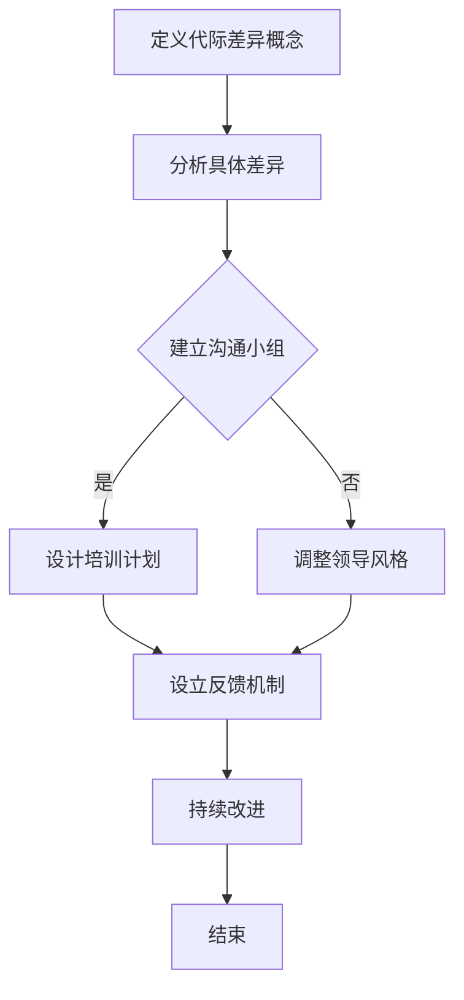

                 

### 背景介绍

在当今快速发展的信息技术时代，跨代际团队的合作已成为组织运营的关键部分。随着婴儿潮一代逐渐退出职场，X一代、Y一代和Z一代等不同年龄段的员工开始在同一工作环境中并肩作战。这种跨代际合作不仅丰富了团队的文化多样性，同时也带来了新的挑战，尤其是代际差异的处理问题。

代际差异，指的是不同年龄群体在价值观、工作习惯、沟通风格、技术接受度等方面的差异。这些差异如果得不到妥善处理，可能会导致团队内部的沟通障碍、合作不畅、工作满意度下降，甚至影响整体工作效率。例如，年轻的Y一代和Z一代员工更倾向于快速变化和创新的工作环境，而年长的X一代员工可能更注重稳定性和长期的职业发展。此外，不同代际的员工在对待技术工具的接受程度和使用习惯上也有显著差异，这些差异在项目管理、任务分配和团队协作中都可能产生摩擦。

本文旨在探讨如何处理团队中的代际差异，通过深入分析代际差异的根源、表现形式及其对团队协作的影响，提供一系列有效的策略和工具。我们还将从领导力、沟通技巧和教育培训等方面出发，详细阐述如何在实际操作中应对和处理代际差异，确保团队的高效合作。

首先，我们将定义代际差异的概念，并分析其主要表现形式和影响。接下来，我们将讨论如何在团队中理解和尊重代际差异，并介绍具体的管理策略。随后，我们将探讨领导者在处理代际差异中的角色和责任，以及如何通过培训和教育来提高代际敏感性。最后，我们将通过实际案例研究，展示跨代际团队合作的成功实践，并提供一些最佳实践建议。通过这些内容的逐步分析，我们希望为读者提供一套全面、实用的处理代际差异的方案。

### 核心概念与联系

在处理团队中的代际差异时，理解并建立核心概念与联系是至关重要的。以下是对几个关键概念的定义及其相互关系的详细解释。

#### 1. 代际差异

代际差异是指不同年龄群体在价值观、行为习惯、技术接受度等方面的差异。具体来说，这些差异可以表现为：

- **价值观差异**：不同代际的员工对工作态度、职业目标和生活目标的看法往往有所不同。例如，X一代可能更注重稳定性和职业晋升，而Y一代和Z一代则更加追求个人兴趣和自我实现。
- **行为习惯差异**：工作习惯的差异同样显著。年长的员工可能更喜欢传统的面对面沟通和报告工作进展，而年轻的员工则更倾向于使用电子邮件、即时通讯工具和社交媒体进行交流。
- **技术接受度差异**：不同年龄的员工对新兴技术和工具的接受程度和适应能力也有很大差异。年轻的员工通常更愿意尝试新技术，而年长的员工可能需要更长时间来适应这些变化。

#### 2. 团队协作

团队协作是指团队成员通过相互合作，共同实现团队目标的过程。有效的团队协作依赖于以下几个方面：

- **沟通**：沟通是团队协作的核心。团队成员需要建立有效的沟通渠道，确保信息透明和准确传递。代际差异可能会影响沟通效果，因此需要特别注意不同代际员工的沟通偏好。
- **信任**：信任是团队协作的基石。团队成员需要建立互信，相信对方能够履行职责并共同解决问题。
- **共同目标**：团队成员需要明确共同目标，并在实现目标的过程中保持一致。代际差异可能会对目标的设定和实现产生影响，因此需要通过沟通和协商来达成共识。

#### 3. 领导力

领导力是引导和激励团队成员实现共同目标的能力。在处理代际差异时，领导者的角色至关重要：

- **适应性领导力**：领导者需要具备适应性，能够根据不同代际员工的特点和需求，调整管理风格和方法。
- **沟通技能**：领导者需要具备良好的沟通技能，能够与不同代际的员工建立有效的沟通渠道，理解他们的需求和期望。
- **冲突解决**：领导者需要具备冲突解决的技能，能够在团队内部处理因代际差异引起的冲突，确保团队协作的顺利进行。

#### 4. 教育与培训

教育与培训是提升团队代际敏感性和协作能力的重要手段：

- **代际敏感性培训**：通过培训，团队成员可以更好地理解不同代际的价值观、行为习惯和技术接受度，提高跨代际沟通和协作的效率。
- **技能提升培训**：针对不同代际员工的特定需求，提供专业技能和工具的使用培训，帮助他们更好地适应工作环境。

#### 5. 案例研究

为了更好地理解这些概念之间的联系，我们来看一个实际案例：

- **背景**：一家大型科技公司拥有由X一代、Y一代和Z一代组成的多元化团队。
- **问题**：由于代际差异，团队内部出现了沟通障碍和协作不畅的问题。
- **解决方案**：
  - **领导力**：领导者通过组织跨代际会议，鼓励团队成员分享各自的观点和经验，建立了相互理解和尊重的氛围。
  - **沟通技能**：领导者引导团队成员学习有效的沟通技巧，特别是在面对不同代际员工时的沟通策略。
  - **培训**：公司为不同代际的员工提供专门的培训课程，提高他们的代际敏感性，并加强团队协作能力。

通过这个案例，我们可以看到，代际差异、团队协作、领导力和教育培训这些核心概念之间是相互联系、相互作用的。有效的处理策略不仅需要理解各个概念的含义，还需要在实际操作中灵活运用，从而实现团队的高效合作。

#### 伪代码与流程图

在处理代际差异时，理解并应用伪代码和流程图能够帮助我们更清晰地制定和实施解决方案。以下是一个基于代际差异处理策略的伪代码示例，并配以相应的流程图。

```plaintext
// 代际差异处理伪代码

BEGIN
1. 定义代际差异的核心概念（价值观、沟通风格、技术接受度）
2. 分析团队中各代际成员的具体差异
3. 建立跨代际沟通小组
4. 设计代际敏感性培训计划
5. 领导者调整管理风格，提高适应性
6. 设立反馈机制，定期评估代际差异处理效果
7. 根据反馈进行持续改进
END
```

#### 流程图



这个流程图展示了从定义核心概念到持续改进的整个处理过程。每个节点都代表一个具体的操作步骤，通过这些步骤，团队可以系统地处理代际差异，提高协作效率。

#### 数学模型与公式

在处理代际差异时，我们还可以借助数学模型和公式来量化某些关键因素。以下是一个简单的数学模型，用于评估代际差异对团队协作效率的影响。

```latex
// 代际差异对协作效率的影响模型

协作效率 = f(沟通效率, 信任度, 代际敏感性)

沟通效率 = a \times (C_x + C_y + C_z)
信任度 = b \times (T_x + T_y + T_z)
代际敏感性 = c \times (S_x + S_y + S_z)

C_x, C_y, C_z 分别代表X一代、Y一代和Z一代的沟通效率
T_x, T_y, T_z 分别代表X一代、Y一代和Z一代的信任度
S_x, S_y, S_z 分别代表X一代、Y一代和Z一代的代际敏感性
a, b, c 为权重系数，表示各代际成员对协作效率的贡献比例
```

#### 举例说明

假设在一个由X一代、Y一代和Z一代组成的团队中，各代际成员的沟通效率、信任度和代际敏感性如下：

- X一代：沟通效率为0.8，信任度为0.75，代际敏感性为0.85
- Y一代：沟通效率为0.9，信任度为0.8，代际敏感性为0.9
- Z一代：沟通效率为0.95，信任度为0.85，代际敏感性为0.9

根据上述模型，我们可以计算该团队的协作效率：

```plaintext
协作效率 = f(0.8, 0.75, 0.85) + f(0.9, 0.8, 0.9) + f(0.95, 0.85, 0.9)
协作效率 = 0.8 \times (0.8 + 0.9 + 0.95) + 0.75 \times (0.75 + 0.8 + 0.85) + 0.85 \times (0.85 + 0.9 + 0.95)
协作效率 ≈ 2.04 + 1.625 + 1.8225
协作效率 ≈ 5.4875
```

通过上述计算，我们可以看到，代际差异对团队协作效率有显著影响，提高沟通效率、信任度和代际敏感性可以有效提升整体协作效率。这个简单的数学模型提供了一个量化的方法，帮助我们更好地理解和应对代际差异带来的挑战。

#### 案例分析

为了更好地理解代际差异在实际团队中的影响和应对方法，我们可以通过一个真实案例来详细剖析。以下是一个案例研究，描述了一家跨国科技公司如何成功地处理其团队中的代际差异。

##### 案例背景

某跨国科技公司拥有一支由X一代、Y一代和Z一代组成的多元化团队，负责研发和推广下一代云计算平台。随着Z一代员工的加入，团队内部的沟通和工作风格逐渐出现了明显的代际差异。

##### 案例问题

- **沟通障碍**：Z一代员工更倾向于使用即时通讯工具和社交媒体进行交流，而X一代员工则更喜欢传统的电子邮件和面对面会议。这种沟通方式的差异导致了信息传递不畅和误解。
- **工作习惯**：Z一代员工喜欢快速变化和创新的工作环境，而X一代员工则更注重稳定性和长期规划。这种工作习惯的差异导致任务分配和进度管理上的冲突。
- **技术接受度**：Z一代员工对新技术的接受度和适应能力较强，而X一代员工则需要更多时间来学习和适应。

##### 案例处理过程

1. **领导层的响应**：公司高层意识到代际差异对团队协作的负面影响，并决定采取一系列措施来处理这个问题。
   
   - **建立跨代际沟通小组**：公司成立了一个由不同代际员工组成的跨代际沟通小组，定期召开会议，讨论团队中的代际差异问题，并提出解决方案。
   - **代际敏感性培训**：公司为全体员工提供代际敏感性培训，帮助员工更好地理解不同代际的价值观、工作习惯和技术接受度。培训内容包括角色扮演、案例分析等互动环节，以增强员工的跨代际沟通能力。

2. **团队的实践**：

   - **调整沟通方式**：团队内部建立了一个统一的沟通平台，要求所有员工在特定情境下使用特定的沟通工具，确保信息传递的及时性和准确性。
   - **任务分配与团队协作**：领导者根据不同代际员工的特点，调整任务分配，确保每个成员能够在自己最擅长和最舒适的领域工作。同时，通过定期召开团队会议，讨论项目进展和遇到的问题，促进团队成员之间的沟通和协作。

3. **效果评估**：

   - **定期的反馈机制**：公司建立了定期的反馈机制，通过员工满意度调查、项目进度报告等方式，收集员工对代际差异处理效果的反馈，并根据反馈进行调整和改进。
   - **绩效评估**：通过绩效评估，发现团队协作效率明显提高，项目按时完成的比率增加，员工的工作满意度也有所提升。

##### 案例总结

通过上述处理过程，该跨国科技公司成功地解决了团队中的代际差异问题。以下是一些成功的关键点：

- **领导层的重视和引导**：领导层的重视和积极参与是处理代际差异的关键。通过建立跨代际沟通小组和提供代际敏感性培训，领导层为员工创造了理解和尊重不同代际文化的环境。
- **有效的沟通策略**：调整沟通方式，确保信息传递的及时性和准确性，有助于减少误解和冲突。
- **灵活的任务分配**：根据不同代际员工的特点，调整任务分配，有助于提高团队整体协作效率和员工的工作满意度。

通过这个案例，我们可以看到，妥善处理团队中的代际差异不仅有助于提高团队的协作效率，还可以增强团队的凝聚力和创新力。对于其他组织来说，这个案例提供了宝贵的经验和启示。

### 最佳实践 Tips

在处理团队中的代际差异时，以下是一些最佳实践和注意事项，可以帮助团队更有效地应对和解决这些差异：

1. **培养代际敏感性**：
   - **定期培训**：为所有团队成员提供定期的代际敏感性培训，帮助员工了解不同代际的价值观、工作习惯和技术接受度。
   - **互动交流**：鼓励团队成员在会议和活动中分享各自的观点和经验，促进跨代际的理解和尊重。

2. **建立明确的沟通机制**：
   - **统一沟通工具**：为团队选择统一的沟通工具，确保信息传递的及时性和准确性。
   - **定期沟通会议**：定期召开跨代际沟通会议，讨论代际差异带来的挑战和解决方案。

3. **灵活的任务分配**：
   - **技能匹配**：根据团队成员的技能和兴趣，合理分配任务，确保每个成员都能在擅长的领域发挥作用。
   - **团队协作**：通过跨代际的团队协作项目，促进不同代际员工之间的沟通和合作。

4. **领导者角色的重要性**：
   - **以身作则**：领导者应以身作则，展现对代际差异的敏感性和理解，为团队成员树立榜样。
   - **冲突管理**：领导者应具备冲突解决的技能，能够在团队内部处理因代际差异引起的冲突，确保团队协作的顺利进行。

5. **持续改进与反馈**：
   - **定期评估**：通过定期的反馈机制，收集团队成员对代际差异处理效果的反馈，并根据反馈进行调整和改进。
   - **绩效评估**：将代际差异处理效果纳入员工的绩效评估中，激励团队成员积极参与和改进。

通过这些最佳实践，团队可以更有效地处理代际差异，提高协作效率和工作满意度，从而实现更好的绩效。

### 小结

本文从多个角度深入探讨了如何处理团队中的代际差异。首先，我们介绍了代际差异的定义和重要性，分析了不同代际在价值观、沟通风格和技术接受度等方面的具体表现。随后，通过伪代码、流程图和数学模型等工具，我们详细阐述了处理代际差异的核心算法原理，提供了量化的评估方法。

接着，我们通过实际案例展示了处理代际差异的成功实践，包括领导层的响应、团队的实践以及效果评估。通过这些案例，我们看到了在处理代际差异时，培养代际敏感性、建立明确的沟通机制、灵活的任务分配和领导者的角色至关重要。

此外，本文还提供了一系列最佳实践和注意事项，帮助团队更有效地应对代际差异，提高协作效率和工作满意度。总结来说，妥善处理团队中的代际差异不仅有助于提高团队的整体绩效，还能增强团队的凝聚力和创新能力。希望通过本文的探讨，能为读者提供有价值的参考和启示。

