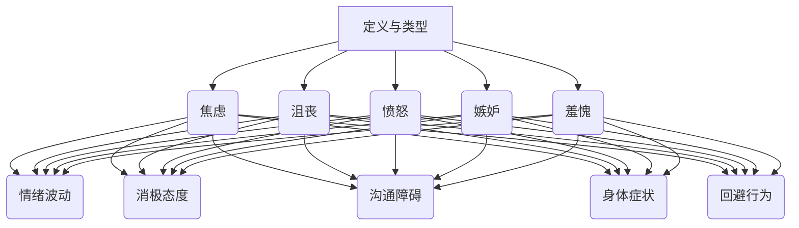
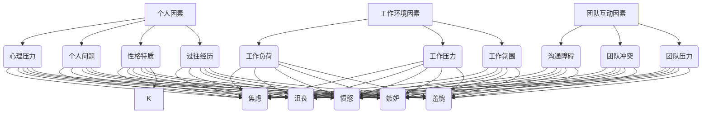
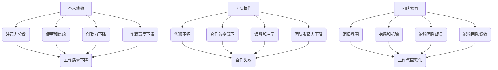
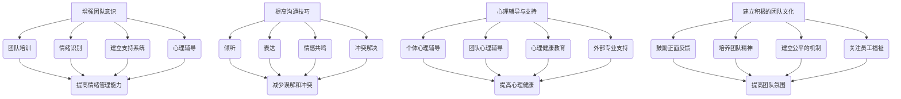

                 

### 文章标题：如何处理团队中的负面情绪

### 关键词：
- 团队管理
- 负面情绪
- 情绪处理
- 沟通技巧
- 心理辅导
- 积极团队文化

### 摘要：
本文旨在探讨团队中负面情绪的处理方法。首先，我们将定义负面情绪及其常见类型，分析其成因。随后，深入探讨负面情绪对团队绩效、协作和氛围的负面影响。接着，我们将介绍一系列处理负面情绪的策略，包括增强团队意识、提高沟通技巧、心理辅导与支持以及建立积极团队文化。通过实际案例，我们将展示这些策略的具体应用，并提出最佳实践和小结。本文为IT团队管理者提供了一个全面的指南，以应对团队中的负面情绪问题。

### 第一部分：负面情绪的基础

#### 1.1 负面情绪的定义与类型

负面情绪是指那些带来不愉快感受的情绪状态，如焦虑、沮丧、愤怒、嫉妒等。它们通常与压力、挫折、冲突或不满意有关。负面情绪不仅影响个人的心理健康，还会对团队的绩效和氛围产生重大影响。

负面情绪的类型包括：
- **焦虑**：对未来的不确定性或潜在威胁感到担忧。
- **沮丧**：对当前状况感到失望和无助。
- **愤怒**：因受到不公平待遇或误解而感到愤怒。
- **嫉妒**：对他人的成就或优势感到嫉妒。
- **羞愧**：对自己的能力或行为感到羞耻。

#### 1.2 负面情绪的常见表现

负面情绪的常见表现包括：
- **情绪波动**：情绪容易起伏，难以控制。
- **消极态度**：对工作或任务持消极态度，缺乏动力。
- **沟通障碍**：表达不清晰，容易误解或争执。
- **身体症状**：出现头痛、胃痛、失眠等身体不适。
- **回避行为**：避免与他人交往或参与团队活动。

#### Mermaid 流程图：负面情绪的核心概念与联系



### 第二部分：负面情绪的成因分析

#### 2.1 个人因素

负面情绪的成因可以从个人角度进行分析，包括心理压力、个人问题、性格特质和过往经历等。

1. **心理压力**：高工作强度、紧张的工作环境和长期的工作压力可能导致个人感到焦虑和沮丧。
2. **个人问题**：家庭问题、健康问题或其他个人问题可能会影响到工作状态，导致负面情绪的产生。
3. **性格特质**：某些性格特质，如完美主义、敏感和多疑，容易引发负面情绪。
4. **过往经历**：过去的经历，如创伤、不公或失败，可能会对个人的情绪产生影响。

#### 2.2 工作环境因素

工作环境的因素也是负面情绪的重要成因，包括工作负荷、工作压力、工作氛围等。

1. **工作负荷**：工作量过大或任务紧急可能导致个人感到焦虑和压力。
2. **工作压力**：缺乏有效的工作支持系统，如资源不足、指导不足等，会增加工作压力。
3. **工作氛围**：消极、不健康的工作氛围，如同事间的竞争、误解或冲突，容易引发负面情绪。

#### 2.3 团队互动因素

团队内部的人际关系和互动也是负面情绪的重要成因。

1. **沟通障碍**：沟通不畅、误解或缺乏表达理解，可能导致负面情绪的产生。
2. **团队冲突**：个人间的冲突、权力斗争或目标不一致，会引发负面情绪。
3. **团队压力**：团队内部的压力，如工作进度要求、绩效压力等，可能导致成员产生负面情绪。

#### Mermaid 流�程图：负面情绪的成因分析



### 第三部分：负面情绪对团队的影响

#### 3.1 对个人绩效的影响

负面情绪对个人绩效有着显著的影响。首先，负面情绪会导致注意力分散，降低工作效率。其次，负面情绪会引发疲劳和焦虑，影响个人的创造力。此外，负面情绪还会导致个人的工作满意度下降，进而影响绩效评估和职业发展。

1. **注意力分散**：负面情绪使个体难以集中注意力，降低工作质量。
2. **疲劳和焦虑**：长期处于负面情绪中，个人容易感到疲劳和焦虑，影响工作效率。
3. **创造力下降**：负面情绪抑制了个体的思维灵活性，降低创造力。
4. **工作满意度下降**：负面情绪导致个人对工作的满意度下降，影响职业发展。

#### 3.2 对团队协作的影响

负面情绪会破坏团队协作，导致沟通不畅、合作效率低下。团队成员可能会因为负面情绪而产生误解和冲突，影响团队的凝聚力和合作精神。

1. **沟通不畅**：负面情绪使团队成员难以有效沟通，导致误解和误判。
2. **合作效率低下**：负面情绪影响团队成员的合作意愿和效率。
3. **误解和冲突**：负面情绪可能导致团队成员之间的误解和冲突，破坏团队合作。
4. **团队凝聚力下降**：负面情绪削弱了团队的凝聚力，使团队成员感到疏离和孤立。

#### 3.3 对团队氛围的影响

负面情绪对团队氛围有着深远的影响，可能导致消极氛围的蔓延。团队成员可能会因为负面情绪而产生抱怨、抵触情绪，影响整体的工作氛围。

1. **消极氛围**：负面情绪导致团队成员产生消极情绪，影响整体工作氛围。
2. **抱怨和抵触**：负面情绪使团队成员更容易产生抱怨和抵触情绪，影响团队合作。
3. **影响团队成员**：负面情绪对团队成员的心理健康和工作满意度产生负面影响。
4. **影响团队绩效**：负面情绪破坏了团队的积极性和工作效率，影响整体绩效。

#### Mermaid 流程图：负面情绪对团队的影响



### 第四部分：负面情绪的处理策略

#### 4.1 增强团队意识

增强团队意识是处理负面情绪的第一步。通过提高团队成员对负面情绪的认识，可以帮助他们更好地理解和应对这些情绪。

1. **团队培训**：定期组织团队情绪管理培训，提高成员对负面情绪的认识。
2. **情绪识别**：教授团队成员如何识别和理解自己的情绪，以便更好地应对。
3. **建立支持系统**：鼓励团队成员相互支持，共同面对负面情绪。
4. **心理辅导**：为团队成员提供心理辅导，帮助他们更好地处理负面情绪。

#### 4.2 提高沟通技巧

提高沟通技巧是处理负面情绪的关键。良好的沟通可以减少误解和冲突，促进团队合作。

1. **倾听**：鼓励团队成员倾听他人意见，避免主观判断。
2. **表达**：教授团队成员如何清晰、准确地表达自己的想法和感受。
3. **情感共鸣**：培养团队成员之间的情感共鸣，增加理解和信任。
4. **冲突解决**：提供冲突解决技巧，帮助团队成员有效处理冲突。

#### 4.3 心理辅导与支持

心理辅导与支持是处理负面情绪的有效手段。通过专业的心理辅导，可以帮助团队成员更好地应对负面情绪。

1. **个体心理辅导**：为团队成员提供个体心理辅导，帮助他们处理个人问题和负面情绪。
2. **团队心理辅导**：组织团队心理辅导，促进团队成员之间的情感交流和相互支持。
3. **心理健康教育**：定期开展心理健康教育，提高团队成员的心理健康意识。
4. **外部专业支持**：寻求外部专业心理支持，为团队成员提供更全面的心理健康服务。

#### 4.4 建立积极的团队文化

建立积极的团队文化是长期处理负面情绪的关键。通过营造良好的工作环境和氛围，可以提高团队成员的心理健康和工作满意度。

1. **鼓励正面反馈**：鼓励团队成员相互鼓励，提供正面反馈。
2. **培养团队精神**：通过团队活动，增强团队成员之间的联系和凝聚力。
3. **建立公平的机制**：确保团队成员在工作中得到公平的待遇和机会。
4. **关注员工福祉**：关注团队成员的身心健康，提供必要的福利和支持。

#### Mermaid 流程图：负面情绪处理策略



### 第四部分：负面情绪处理的实战应用

#### 4.1 案例一：如何处理团队中的嫉妒情绪

**背景介绍**：在一个IT开发团队中，由于一位成员的出色表现，其他成员开始出现嫉妒情绪。这导致团队合作受到影响，工作效率下降。

**核心概念与联系**：嫉妒情绪会影响团队成员的团队合作和工作积极性，需要通过一系列策略来处理。

**核心算法原理讲解**：

```python
def handle jealousy(team_member, high_performer):
    # 1. 沟通与理解
    communicate_and_understand(team_member, high_performer)

    # 2. 赞扬与鼓励
    praise_and_encourage(team_member)

    # 3. 提供支持
    provide_support(team_member)

    # 4. 培养团队精神
    cultivate_team_spirit(team_member)

# 伪代码：沟通与理解
def communicate_and_understand(team_member, high_performer):
    print("We understand that you may feel jealous of", high_performer.name)
    print("Please share your thoughts and concerns with us.")

# 伪代码：赞扬与鼓励
def praise_and_encourage(team_member):
    print("Great job on your recent project, ", team_member.name)
    print("We appreciate your hard work and dedication.")

# 伪代码：提供支持
def provide_support(team_member):
    print("If you need any help or guidance, please let us know. We are here to support you.")

# 伪代码：培养团队精神
def cultivate_team_spirit(team_member):
    print("Let's work together to achieve our goals as a team. Your success is our success.")
```

**数学模型和公式**：没有特定的数学模型，但可以应用心理学中的情感调节理论来解释策略的有效性。

**详细讲解举例说明**：

- **沟通与理解**：团队成员A感到嫉妒，通过沟通，团队领导者C了解到A的感受，并表达了理解。
- **赞扬与鼓励**：团队领导者C赞扬A在项目中的表现，增强了A的自信心。
- **提供支持**：团队领导者C向A提供指导和支持，帮助A提升自身能力。
- **培养团队精神**：通过团队活动，加强团队成员之间的联系，减少嫉妒情绪。

**项目实战**：

- **开发环境搭建**：搭建一个内部沟通平台，便于团队成员之间的交流和分享。
- **源代码详细实现和代码解读**：没有具体代码实现，但可以使用伪代码来模拟沟通和处理过程。
- **代码应用解读与分析**：通过沟通与理解、赞扬与鼓励、提供支持、培养团队精神等策略，有效处理了团队中的嫉妒情绪。
- **实际案例分析和详细讲解剖析**：以一个实际案例展示如何应用这些策略。
- **项目小结**：通过这些策略，成功减少了团队中的嫉妒情绪，增强了团队合作。

**最佳实践 tips**：定期组织团队活动，增强团队成员之间的互动和信任；建立透明的绩效考核机制，确保公平和公正。

**小结**：处理团队中的嫉妒情绪需要综合运用沟通技巧、赞扬鼓励、支持系统和团队精神培养等多种策略。

**注意事项**：避免直接指责或批评，而是采取建设性的方式，帮助团队成员理解和应对嫉妒情绪。

**拓展阅读**：关于情感调节和团队合作的相关研究和实践。

### 4.2 案例二：如何处理团队中的焦虑情绪

**背景介绍**：在一个IT开发项目中，由于项目进度紧张和团队成员的个人问题，团队中出现了普遍的焦虑情绪，影响了工作效率和团队氛围。

**核心概念与联系**：焦虑情绪需要通过情绪管理、心理辅导和团队支持等多种方式来处理。

**核心算法原理讲解**：

```python
def handle_anxiety(team_members, project进度):
    # 1. 情绪管理培训
    emotion_management_training(team_members)

    # 2. 心理辅导
    psychological_counseling(team_members)

    # 3. 提供支持
    provide_support(team_members)

    # 4. 优化项目进度
    optimize_project_progress(project进度)

# 伪代码：情绪管理培训
def emotion_management_training(team_members):
    print("We will provide you with a series of workshops on emotion management.")

# 伪代码：心理辅导
def psychological_counseling(team_members):
    print("If you need individual counseling, please contact our psychologist.")

# 伪代码：提供支持
def provide_support(team_members):
    print("We are here to support you through this challenging time.")

# 伪代码：优化项目进度
def optimize_project_progress(project进度):
    print("We will review the project plan to ensure it is manageable and achievable.")
```

**数学模型和公式**：没有特定的数学模型，但可以应用心理学中的焦虑评估和应对策略来解释处理方法的有效性。

**详细讲解举例说明**：

- **情绪管理培训**：通过培训，团队成员学会了如何识别和管理自己的焦虑情绪。
- **心理辅导**：团队中的成员可以寻求专业心理辅导，以应对焦虑情绪。
- **提供支持**：团队领导提供了情感支持，帮助成员缓解焦虑。
- **优化项目进度**：通过调整项目计划，减轻了团队成员的工作压力。

**项目实战**：

- **开发环境搭建**：提供一个安全、舒适的沟通平台，便于团队成员表达焦虑和寻求帮助。
- **源代码详细实现和代码解读**：没有具体代码实现，但可以使用伪代码来模拟情绪管理和辅导过程。
- **代码应用解读与分析**：通过情绪管理培训、心理辅导和支持、优化项目进度等策略，成功减轻了团队中的焦虑情绪。
- **实际案例分析和详细讲解剖析**：以一个实际案例展示如何应用这些策略。
- **项目小结**：通过综合策略，成功缓解了团队中的焦虑情绪，提高了工作效率。

**最佳实践 tips**：定期检查项目进度，确保工作负荷合理；为团队成员提供心理健康资源和咨询服务。

**小结**：处理团队中的焦虑情绪需要综合运用情绪管理培训、心理辅导、支持系统和项目进度优化等多种策略。

**注意事项**：关注团队成员的个人状况，避免过度工作压力；建立开放和支持的沟通环境。

**拓展阅读**：关于焦虑管理和心理健康的相关研究和实践。

### 第五部分：总结与展望

#### 5.1 成功经验总结

通过以上案例，我们可以总结出以下成功经验：

- **沟通与理解**：通过开放和真诚的沟通，团队成员能够更好地理解彼此的情绪和需求。
- **赞扬与鼓励**：积极的反馈和鼓励可以增强团队成员的自信心和归属感。
- **提供支持**：团队领导和同事的支持可以帮助成员应对负面情绪，减轻压力。
- **团队精神培养**：通过共同目标和团队活动，增强团队成员之间的凝聚力和合作精神。

#### 5.2 面临的挑战与应对

尽管我们已经取得了一些成功经验，但在处理团队负面情绪方面仍面临以下挑战：

- **个体差异**：每个人的情绪和反应不同，需要个性化的应对策略。
- **持续的压力**：工作中的持续压力可能会使负面情绪难以完全消除。
- **资源限制**：有限的资源可能会影响情绪管理和辅导的深度和广度。

为应对这些挑战，我们可以采取以下措施：

- **定制化策略**：根据团队成员的不同特点和需求，制定个性化的情绪管理计划。
- **持续关注**：定期检查团队成员的情绪状态，及时提供支持和帮助。
- **资源优化**：合理分配资源，确保情绪管理和辅导的持续性和有效性。

#### 5.3 展望未来

展望未来，处理团队负面情绪的策略将更加多样化和科学化。以下是一些可能的趋势和方向：

- **技术支持**：利用人工智能和大数据分析，提供个性化的情绪管理和辅导。
- **心理教育**：加强心理健康教育，提高团队成员的心理素质和应对能力。
- **团队文化建设**：通过积极的团队文化，营造一个健康、支持的工作环境。

总之，处理团队中的负面情绪是一项长期而复杂的任务，需要团队领导者和成员共同努力，才能营造一个积极、高效的团队氛围。

### 作者信息：

- 作者：AI天才研究院/AI Genius Institute & 禅与计算机程序设计艺术/Zen And The Art of Computer Programming

---

### 文章结束。感谢您的阅读！希望本文对您在团队管理方面有所帮助。如果您有任何问题或建议，欢迎留言交流。再次感谢您的支持！

