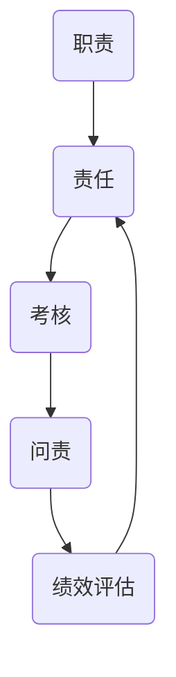

                 

### 文章标题：如何建立有效的团队问责机制

#### 关键词：团队问责机制、组织效率、责任分配、沟通协作、绩效评估

#### 摘要：

在快速发展的信息技术时代，团队的效能直接影响到组织的竞争力。建立有效的团队问责机制是提升组织效率和团队协作的关键。本文将详细介绍如何构建一个合理的团队问责机制，从明确团队目标和职责、建立有效的沟通机制、制定公正透明的考核标准，到设定合理的问责流程，并通过具体的数学模型和公式以及项目实战来解析这一机制的构建和实施。最后，我们将总结最佳实践，并提供一些注意事项和拓展阅读建议，帮助读者更好地理解和应用团队问责机制。

## 第一部分：团队问责机制的概述

### 1.1 团队问责机制的重要性

在现代企业中，团队问责机制已经成为组织管理的重要组成部分。其重要性主要体现在以下几个方面：

- **提高工作效率**：通过明确的职责分配和绩效考核，团队成员能够更好地专注于自己的工作，提高工作效率。
- **促进团队协作**：团队问责机制鼓励成员之间的沟通与协作，减少冲突，增强团队凝聚力。
- **确保目标实现**：团队问责机制确保每个成员都清楚自己的职责和目标，有助于团队目标的顺利实现。
- **增强责任感**：明确的问责机制有助于增强团队成员的责任感，提高工作质量。

### 1.2 团队问责机制的核心概念与联系

团队问责机制的核心概念包括职责、责任、考核、问责和绩效评估。它们之间的关系可以用以下Mermaid流程图来表示：

- **职责**：团队成员在团队中承担的具体工作内容。
- **责任**：团队成员对职责履行情况的承诺和结果。
- **考核**：对团队成员工作绩效的评估过程。
- **问责**：对团队成员未能履行职责的追责过程。
- **绩效评估**：对团队成员工作绩效的最终评价。

### 1.3 团队问责机制的目的和作用

团队问责机制的目的是确保团队成员在其职责范围内履行责任，提升团队整体绩效。其作用包括：

- **明确职责**：帮助团队成员明确自己的工作内容和职责，避免工作重叠和遗漏。
- **提升绩效**：通过考核和问责，激励团队成员提高工作效率和质量。
- **促进协作**：鼓励团队成员之间进行有效的沟通与协作，共同实现团队目标。
- **保障组织稳定**：确保团队目标的实现，提升组织的整体竞争力。

## 第二部分：团队问责机制的设计原则

### 2.1 明确团队目标和职责

设计团队问责机制的首要步骤是明确团队的目标和职责。这需要从以下几个方面进行：

- **设定明确的目标**：确保团队目标具体、可衡量、可实现、相关性强和时间限定。
- **分配明确的责任**：根据团队成员的能力和特长，合理分配职责，确保每个成员都清楚自己的工作范围和责任。

### 2.2 建立有效的沟通机制

有效的沟通是团队问责机制成功的关键。以下是一些建立有效沟通机制的策略：

- **建立多种沟通渠道**：包括面对面会议、电子邮件、即时通讯工具等，确保信息传递的及时性和准确性。
- **制定沟通计划**：明确沟通的频率、方式和内容，确保团队成员之间的沟通不中断。
- **鼓励开放沟通**：营造一个开放、坦诚的沟通氛围，鼓励团队成员提出意见和建议。

### 2.3 制定公正透明的考核标准

公正透明的考核标准是团队问责机制的核心。以下是一些建立公正透明考核标准的原则：

- **设定明确的考核指标**：根据团队目标和职责，设定具体的、可量化的考核指标。
- **确保考核标准的公平性**：考核标准应适用于所有团队成员，避免偏袒或歧视。
- **建立透明的考核流程**：考核过程应公开透明，确保团队成员了解考核的每一个环节。

### 2.4 设定合理的问责流程

合理的问责流程有助于确保团队成员履行职责。以下是一些建立合理问责流程的建议：

- **设定明确的问责标准**：根据考核结果，设定具体的问责标准，明确哪些行为需要被问责。
- **设定合理的问责步骤**：明确问责的具体步骤，确保问责过程的规范性和严谨性。
- **提供反馈和改进机会**：在问责过程中，提供反馈和改进机会，帮助团队成员提升工作表现。

## 第三部分：团队问责机制的实际应用

### 3.1 建立团队问责机制的实际步骤

建立团队问责机制需要以下实际步骤：

- **确定团队目标和职责**：明确团队的目标和职责，确保团队成员对目标有清晰的认识。
- **制定具体的考核标准**：根据团队目标和职责，制定具体的考核标准，确保考核的客观性和公正性。
- **设定问责流程**：明确问责的具体步骤和流程，确保问责过程的规范性和严谨性。
- **沟通与培训**：与团队成员进行沟通，确保他们了解考核标准和问责流程，并进行必要的培训。

### 3.2 团队问责机制的项目实战

以下是一个团队问责机制的项目实战案例：

#### 项目背景：

某互联网公司的一个开发团队负责一个在线购物平台的项目。团队由5名成员组成，分别负责前端开发、后端开发、测试、UI设计和项目管理。

#### 实际步骤：

1. **确定团队目标和职责**：

   - 团队目标：在规定的时间内完成在线购物平台的功能开发，并确保系统的稳定性和用户体验。
   - 职责分配：前端开发人员负责UI设计和页面交互，后端开发人员负责服务器端逻辑和数据存储，测试人员负责测试和修复缺陷，UI设计师负责设计界面，项目经理负责协调和监督项目进度。

2. **制定具体的考核标准**：

   - 前端开发人员：页面加载速度、交互效果、代码质量。
   - 后端开发人员：服务器响应时间、代码复用率、功能完整性。
   - 测试人员：测试覆盖率、缺陷发现率、缺陷修复率。
   - UI设计师：设计美观度、用户体验、设计文档完整性。
   - 项目经理：项目进度、资源利用率、团队协作。

3. **设定问责流程**：

   - 考核周期：每周进行一次绩效评估。
   - 问责标准：若某成员在考核周期内未能达到设定的考核标准，将进行问责。
   - 问责步骤：首先进行内部沟通，了解问题原因，然后提供改进建议，最后根据改进情况决定是否进行更严厉的问责措施。

4. **沟通与培训**：

   - 项目启动时，项目经理组织了一次团队会议，详细介绍了考核标准和问责流程。
   - 定期组织培训，提升团队成员的技能和意识。

#### 结果与分析：

通过实施团队问责机制，团队成员的工作积极性和责任感得到了显著提升。项目的进度和质量也得到了保证。具体分析如下：

- **工作积极性**：团队成员意识到自己的工作对于项目成功的重要性，工作态度更加认真。
- **责任感**：团队成员对自己的职责有了更清晰的认识，工作更加主动和负责。
- **项目进度**：通过定期的考核和问责，项目进度得到了有效控制，提前完成了任务。
- **质量保证**：团队成员在考核标准下，更加注重工作质量和效率，系统的稳定性和用户体验得到了提升。

### 3.3 团队问责机制的优化与调整

根据项目实战的反馈，团队问责机制需要不断优化和调整。以下是一些优化建议：

- **根据反馈调整考核标准**：定期收集团队成员的反馈，根据项目进展和团队状况调整考核标准，确保其适应性和有效性。
- **优化问责流程**：简化问责流程，减少不必要的环节，提高问责效率。
- **提升团队文化**：通过团队建设活动和培训，提升团队的文化氛围，增强团队成员之间的信任和协作。
- **长期维护与改进**：团队问责机制需要长期维护和改进，以适应不断变化的项目需求和环境。

## 第四部分：团队问责机制的最佳实践

### 4.1 团队问责机制的最佳实践案例

以下是一些国内外优秀团队问责机制的最佳实践案例：

- **谷歌的OKR（目标与关键结果）**：谷歌采用OKR机制，通过设定具体的、可量化的目标（O）和实现这些目标所需的关键结果（KR），确保团队成员明确自己的工作重点和方向。
- **微软的透明绩效评估**：微软建立了透明的绩效评估体系，定期对团队成员的工作进行评估，并根据评估结果提供反馈和改进建议。
- **特斯拉的实时反馈机制**：特斯拉通过实时反馈机制，确保团队成员能够及时了解自己的工作表现，并根据反馈进行改进。

### 4.2 案例的共性与差异

这些最佳实践案例的共性包括：

- **明确的目标和责任**：所有案例都强调明确的目标和责任分配，确保团队成员清楚自己的工作内容和目标。
- **公正透明的考核标准**：所有案例都采用公正透明的考核标准，确保考核过程的公平性和公正性。
- **有效的沟通机制**：所有案例都建立有效的沟通机制，确保团队成员之间的信息传递和协作。

差异主要体现在具体的实施方法和流程上，如OKR、透明绩效评估和实时反馈机制等。

### 4.3 对企业实践的启示

从这些最佳实践案例中，企业可以得到以下启示：

- **建立合适的团队问责机制**：根据企业的具体情况和需求，选择合适的团队问责机制，确保其适应性和有效性。
- **持续改进与优化**：团队问责机制需要不断改进和优化，以适应企业发展和项目变化的需求。
- **关注团队文化**：建立积极、健康、协作的团队文化，有助于团队问责机制的有效实施。

## 结论

团队问责机制是提升组织效率和团队协作的关键。通过明确团队目标和职责、建立有效的沟通机制、制定公正透明的考核标准，以及设定合理的问责流程，企业可以构建一个有效的团队问责机制。本文通过具体的项目实战和最佳实践案例，详细解析了团队问责机制的构建和实施过程，为企业提供了有益的参考。需要注意的是，团队问责机制需要根据实际情况不断优化和调整，以适应企业发展和项目需求。

### 作者信息

作者：AI天才研究院/AI Genius Institute & 禅与计算机程序设计艺术 /Zen And The Art of Computer Programming

### 拓展阅读

- 《敏捷开发实践指南》
- 《团队协作的艺术》
- 《绩效管理：从战略到执行》

## 附录

### 附录 A：团队问责机制相关资源

- 团队问责机制白皮书
- 团队绩效管理工具推荐
- 团队协作平台介绍

### 附录 B：常用工具和技术总结

- OKR工具使用指南
- 项目管理软件推荐
- 沟通协作工具选择

通过以上内容，我们详细解析了如何建立有效的团队问责机制，并提供了实际应用和最佳实践案例。希望读者能够从中获得启发，并成功应用于实际工作中。在未来的实践中，不断优化和调整团队问责机制，以提升团队效能和组织竞争力。

