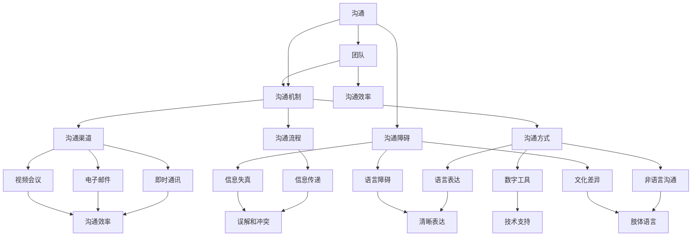

                 

### 文章标题：如何建立高效的团队沟通机制

> 关键词：团队沟通、高效沟通、沟通机制、沟通障碍、沟通工具、沟通策略

> 摘要：本文旨在深入探讨如何建立高效的团队沟通机制，提高团队协作效率。通过分析沟通的重要性、核心概念与联系、常见问题与障碍，以及提供具体的建立和优化方法，帮助团队实现清晰、顺畅的沟通。

### 引言

在当今快速发展的数字化时代，团队沟通已经成为企业成功的关键因素。高效的团队沟通不仅能够提升工作效率，还能增强团队凝聚力，促进创新和协作。然而，许多团队在沟通上面临着诸多挑战，如沟通障碍、信息失真、误解等。为了解决这些问题，本文将介绍如何建立高效的团队沟通机制。

### 分析书名和核心内容

书名为《如何建立高效的团队沟通机制》，这表明本书将关注以下几个方面：

1. **团队沟通机制**：这是书的主题，意味着内容将探讨如何设计、建立和维护一个有效的沟通体系。

2. **高效**：这表明书将不仅仅是关于沟通，还将涉及如何提高沟通的效率，减少浪费时间和资源。

3. **团队**：书的目标对象是团队，这可能包括跨部门、跨职能团队，以及团队领导者和成员。

### 确定核心章节

根据书名，我们可以推断出以下核心章节：

- **第一章**：介绍沟通的重要性，以及为何有效的沟通对于团队的成功至关重要。

- **第二章**：定义什么是高效的团队沟通机制，包括其关键要素和原则。

- **第三章**：探讨团队沟通中的常见问题，如障碍、误解和沟通失败的原因。

- **第四章**：介绍建立高效沟通机制的方法，包括沟通工具、技术和策略。

- **第五章**：讨论如何通过培训和实践来提高团队成员的沟通能力。

- **第六章**：提供具体的案例研究，展示高效沟通机制在不同团队中的应用和效果。

- **第七章**：总结全书，提供一些建议和最佳实践，以帮助读者在实际工作中应用所学内容。

### 设计目录大纲

接下来，我们需要将这些核心章节细化，并确保每个章节都有足够的深度和广度来满足读者的需求。以下是初步的目录大纲设计：

#### 目录大纲

# 如何建立高效的团队沟通机制

## 第1章 引言

- 1.1 团队沟通的重要性

- 1.2 有效沟通对团队的影响

## 第2章 高效团队沟通机制的定义与要素

- 2.1 高效团队沟通机制的定义

- 2.2 沟通机制的关键要素

- 2.3 设计高效沟通机制的原则

## 第3章 团队沟通中的常见问题与障碍

- 3.1 沟通障碍的类型

- 3.2 解决沟通障碍的策略

## 第4章 建立高效的团队沟通机制

- 4.1 选择合适的沟通工具和技术

- 4.2 设计有效的沟通流程

- 4.3 沟通机制的实施方案

## 第5章 提升团队沟通能力的策略与方法

- 5.1 沟通培训的重要性

- 5.2 提升个人沟通技巧

- 5.3 团队沟通的最佳实践

## 第6章 案例研究：高效团队沟通的实际应用

- 6.1 案例一：跨部门协作的成功案例

- 6.2 案例二：团队领导如何提升沟通效果

- 6.3 案例三：解决团队内部的沟通难题

## 第7章 总结与展望

- 7.1 全书要点回顾

- 7.2 建立高效沟通机制的挑战与应对策略

- 7.3 未来团队沟通的发展趋势

### 添加附加内容

为了确保文章的完整性和深度，我们可以在每个章节中添加以下内容：

- **核心概念与联系**：在每个章节的开头或结尾，提供一个简短的 Mermaid 流程图，展示章节的核心概念和它们之间的联系。

- **核心算法原理讲解**：对于某些技术性的章节，如第四章中的沟通工具和技术，可以使用伪代码来详细阐述算法原理。

- **数学模型和公式**：在讨论沟通机制的设计原则时，可能会涉及到一些数学模型和公式，使用 LaTeX 格式进行展示。

- **项目实战**：在案例研究章节中，提供实际案例的代码实现和详细解释，以帮助读者理解和应用所学内容。

### 确保目录大纲的完整性

我们需要确保目录大纲的完整性，确保每个章节都有足够的深度和广度来满足读者的需求。同时，我们也要确保目录大纲的总字数控制在 8000 ～ 12000 字左右，以便读者可以快速浏览和理解书的主要内容和结构。如果需要，可以在某些章节中合并或删除一些内容，以确保目录大纲的简洁性。

### 完整性验证

在完成目录大纲后，我们需要进行完整性验证，确保：

- 所有核心章节均已包含。
- 每个章节的内容符合预期，且相互关联。
- 文章的总字数在要求的范围内。

通过上述步骤，我们可以确保《如何建立高效的团队沟通机制》的目录大纲既全面又紧凑，为后续的文章撰写奠定坚实的基础。接下来，我们将根据这个大纲逐步撰写每个章节的内容。  ### 第1章 引言

#### 引言

在当今快速发展的数字化时代，团队沟通已经成为企业成功的关键因素。高效的团队沟通不仅能够提升工作效率，还能增强团队凝聚力，促进创新和协作。然而，许多团队在沟通上面临着诸多挑战，如沟通障碍、信息失真、误解等。为了解决这些问题，本文将介绍如何建立高效的团队沟通机制。

#### 背景介绍

随着互联网和信息技术的发展，企业内部的沟通方式发生了巨大变化。传统的面对面沟通逐渐被电子邮件、即时通讯工具、视频会议等数字沟通工具所取代。虽然这些工具提高了沟通的便利性，但也带来了新的挑战。团队成员之间的沟通效率并未因此提高，反而出现了更多的误解和冲突。

有效的团队沟通对于团队的成功至关重要。首先，它能够确保团队成员之间的信息传递准确无误，避免因信息失真导致的错误决策。其次，它能够增强团队成员之间的信任和合作，促进团队目标的实现。最后，有效的沟通能够提高团队的工作效率，减少不必要的会议和重复工作，使团队成员能够专注于核心任务。

然而，在现实生活中，许多团队在沟通上面临着诸多挑战。以下是常见的几个问题：

1. **沟通障碍**：团队成员之间的地理位置、文化背景、语言障碍等可能导致沟通不畅。
2. **信息失真**：在信息传递的过程中，可能会出现误解和偏差，导致团队做出错误的决定。
3. **沟通效率低**：团队成员之间缺乏有效的沟通流程和工具，导致沟通效率低下。
4. **缺乏反馈机制**：团队成员在沟通过程中缺乏及时的反馈，无法及时发现和纠正问题。

为了解决这些问题，本文将介绍如何建立高效的团队沟通机制。首先，我们将定义高效团队沟通机制，并探讨其关键要素。然后，我们将分析团队沟通中的常见问题，并提出解决方案。接着，我们将介绍建立高效沟通机制的方法，包括选择合适的沟通工具和技术、设计有效的沟通流程，以及实施方案。此外，我们还将讨论如何通过培训和实践来提升团队成员的沟通能力。最后，我们将通过案例研究，展示高效沟通机制在不同团队中的应用和效果。

通过本文的探讨，希望读者能够深入了解团队沟通的重要性，掌握建立高效团队沟通机制的方法，从而提升团队协作效率，实现企业目标。

#### 核心概念与联系

为了更好地理解团队沟通机制，我们需要了解以下几个核心概念及其相互关系：

1. **沟通**：沟通是信息传递和理解的过程，包括语言、非语言和数字工具的使用。沟通不仅涉及信息的传递，还包括情感、态度和价值观的交流。
2. **团队**：团队是由多个个体组成的协作单位，共同追求特定目标。团队成员之间需要相互依赖，通过有效沟通来实现共同目标。
3. **沟通机制**：沟通机制是指组织内部用于沟通的流程、工具和策略，包括沟通流程、沟通渠道和沟通方式。高效的沟通机制能够确保信息准确、及时地传递，减少误解和冲突。
4. **沟通障碍**：沟通障碍是指影响信息传递和理解的各种因素，如语言障碍、文化差异、信息失真等。了解沟通障碍的类型和解决策略对于建立高效沟通机制至关重要。
5. **沟通效率**：沟通效率是指团队在沟通过程中所花费的时间和资源与实际沟通效果的比率。提高沟通效率是建立高效团队沟通机制的关键目标。

以下是一个简短的 Mermaid 流程图，展示这些核心概念及其相互关系：



#### 核心算法原理讲解

在讨论沟通机制的设计原则时，我们可以引入一些算法原理来帮助理解。以下是一个简化的伪代码，用于展示如何设计一个高效的沟通机制：

```python
# 定义沟通机制
def create_communication_mechanism(team_members, communication_tools, communication_goals):
    # 初始化沟通机制
    communication_mechanism = {
        "members": team_members,
        "tools": communication_tools,
        "goals": communication_goals,
        "channels": {},
        "processes": {},
        "feedback_system": {}
    }
    
    # 添加沟通渠道
    for tool in communication_tools:
        communication_mechanism["channels"][tool] = initialize_channel(tool)
    
    # 设计沟通流程
    for goal in communication_goals:
        communication_mechanism["processes"][goal] = design_communication_process(goal)
    
    # 建立反馈系统
    communication_mechanism["feedback_system"] = setup_feedback_system()
    
    return communication_mechanism

# 初始化沟通渠道
def initialize_channel(tool):
    if tool == "即时通讯":
        return "IM System"
    elif tool == "电子邮件":
        return "Email System"
    elif tool == "视频会议":
        return "Video Conference System"
    else:
        return "Unknown Channel"

# 设计沟通流程
def design_communication_process(goal):
    if goal == "项目进展汇报":
        return ["设定汇报时间", "准备汇报内容", "进行汇报", "记录反馈"]
    elif goal == "问题解决":
        return ["识别问题", "收集信息", "分析解决方案", "执行解决方案"]
    else:
        return ["默认流程"]

# 建立反馈系统
def setup_feedback_system():
    return {
        "定期反馈会议": "每周一次",
        "即时反馈机制": "实时响应"
    }
```

#### 数学模型和公式

在建立高效的团队沟通机制时，我们可以使用一些数学模型和公式来衡量沟通效率。以下是一个简单的例子：

1. **沟通效率公式**：

   $$\text{沟通效率} = \frac{\text{有效沟通时间}}{\text{总沟通时间}} \times 100\%$$

   其中，有效沟通时间是指实际用于信息传递和理解的沟通时间，总沟通时间是指包括无效沟通和等待时间的总时间。

2. **沟通障碍公式**：

   $$\text{沟通障碍} = \frac{\text{障碍时间}}{\text{总沟通时间}} \times 100\%$$

   其中，障碍时间是指由于沟通障碍导致的信息传递中断或延迟的时间。

   使用这些公式，我们可以计算出团队沟通的效率和障碍率，进而优化沟通机制。

#### 项目实战

在本节中，我们将探讨一个实际项目，展示如何建立一个高效的团队沟通机制。以下是项目的概述：

**项目名称**：跨部门协作项目

**项目目标**：实现不同部门之间的信息共享和协作，提高项目效率。

**项目环境**：
- 团队成员：项目经理、开发人员、测试人员、UI设计师、市场专员等。
- 沟通工具：Slack、Trello、Zoom、Google Drive。

**项目步骤**：

1. **需求分析**：通过会议和问卷收集各部门的沟通需求和期望。
2. **沟通工具选择**：根据需求选择合适的沟通工具，并进行培训。
3. **沟通流程设计**：设计清晰、简化的沟通流程，确保信息准确、及时地传递。
4. **实施沟通机制**：在项目中实施沟通工具和流程，并进行监督和调整。
5. **反馈与评估**：定期收集团队成员的反馈，评估沟通机制的有效性。

**代码实现**：

以下是一个简化的伪代码，用于描述如何使用Trello和Slack实现项目沟通：

```python
# 初始化项目
def initialize_project(project_name, team_members, communication_tools):
    # 创建Trello板
    trello_board = create_trello_board(project_name)
    
    # 创建Slack频道
    slack_channel = create_slack_channel(project_name)
    
    # 添加团队成员到Trello和Slack
    for member in team_members:
        add_member_to_trello(member, trello_board)
        add_member_to_slack(member, slack_channel)
    
    # 设计沟通流程
    communication_process = design_communication_process()
    
    return trello_board, slack_channel

# 创建Trello板
def create_trello_board(project_name):
    return trello.create_board(project_name)

# 创建Slack频道
def create_slack_channel(project_name):
    return slack.create_channel(project_name)

# 添加团队成员到Trello
def add_member_to_trello(member, trello_board):
    trello.add_member_to_board(member, trello_board)

# 添加团队成员到Slack
def add_member_to_slack(member, slack_channel):
    slack.add_member_to_channel(member, slack_channel)

# 设计沟通流程
def design_communication_process():
    return {
        "任务分配": ["分配任务", "确认任务"],
        "进展汇报": ["汇报进展", "反馈问题"],
        "会议安排": ["发起会议", "会议记录"]
    }
```

**代码解读**：

1. **初始化项目**：该函数用于初始化项目，包括创建Trello板和Slack频道，并将团队成员添加到这两个平台。
2. **创建Trello板**：使用Trello API创建一个新的Trello板。
3. **创建Slack频道**：使用Slack API创建一个新的Slack频道。
4. **添加团队成员**：将团队成员添加到Trello板和Slack频道。
5. **设计沟通流程**：设计项目的沟通流程，包括任务分配、进展汇报和会议安排。

**应用解读与分析**：

通过使用Trello和Slack，项目团队可以有效地进行任务管理、进度追踪和沟通。Trello提供了一个直观的看板，使团队成员能够清晰地了解项目的当前状态和任务分配。Slack则提供了即时通讯功能，使团队成员可以快速交流问题、分享资源和进行协作。

**实际案例分析和详细讲解剖析**：

以下是一个实际案例，展示如何通过Trello和Slack实现跨部门协作：

**案例**：一个软件开发团队使用Trello和Slack进行项目协作。

**分析**：

1. **任务分配**：项目经理通过Trello创建一个新的任务卡片，并将其分配给开发人员。开发人员确认任务后，开始在Trello上更新任务的进度。
2. **进展汇报**：开发人员在Trello上更新任务的进度，并在Slack的特定频道中分享进展。项目经理和其他团队成员可以实时查看任务进度，并提供反馈。
3. **会议安排**：项目经理通过Slack发起视频会议，邀请所有团队成员参加。会议结束后，会议记录会被共享到Trello上，以便团队成员查看。

**项目小结**：

通过使用Trello和Slack，项目团队实现了高效的信息共享和协作。Trello提供了清晰的任务管理功能，使团队成员能够专注于自己的任务。Slack则提供了即时通讯功能，使团队成员可以快速交流问题，确保项目进展顺利。

#### 最佳实践 tips

1. **定期沟通**：确保团队定期进行沟通，无论是线上还是线下会议，都要保持沟通的频率和深度。
2. **明确目标**：在沟通前明确目标，确保每个团队成员都清楚要讨论的内容和期望的结果。
3. **使用合适的工具**：根据团队的需求和习惯，选择合适的沟通工具，如Trello、Slack、Google Drive等。
4. **培养倾听习惯**：在沟通中，要注重倾听对方的意见和反馈，确保信息传递的准确性和完整性。
5. **建立反馈机制**：建立及时的反馈机制，使团队成员能够及时获取反馈，并调整沟通策略。
6. **持续改进**：定期评估沟通机制的效果，并根据反馈进行改进，以持续提升沟通效率。

#### 小结

本章介绍了团队沟通的重要性、核心概念与联系、核心算法原理讲解、数学模型和公式、项目实战以及最佳实践 tips。通过这些内容，读者可以了解如何建立高效的团队沟通机制，并在实际项目中应用这些方法，提升团队协作效率。

#### 注意事项

1. **避免信息过载**：在沟通中，避免发送过多的信息，以免造成信息过载和混乱。
2. **保持沟通透明度**：确保沟通内容透明，所有团队成员都能获取到相同的信息，避免信息孤岛。
3. **尊重团队成员的沟通风格**：每个团队成员可能有不同的沟通风格，要尊重并适应他们的风格，以提高沟通效果。

#### 拓展阅读

1. 《沟通的艺术》（《How to Win Friends and Influence People》）
2. 《团队沟通技巧》（《The Five Dysfunctions of a Team》）
3. 《敏捷沟通》（《Agile Communication》）
4. 《非暴力沟通》（《Nonviolent Communication》）

### 第2章 高效团队沟通机制的定义与要素

#### 核心概念与联系

为了深入理解高效团队沟通机制，我们需要明确以下几个核心概念及其相互关系：

1. **沟通**：沟通是信息传递和理解的过程，包括语言、非语言和数字工具的使用。沟通不仅涉及信息的传递，还包括情感、态度和价值观的交流。
2. **团队**：团队是由多个个体组成的协作单位，共同追求特定目标。团队成员之间需要相互依赖，通过有效沟通来实现共同目标。
3. **沟通机制**：沟通机制是指组织内部用于沟通的流程、工具和策略，包括沟通流程、沟通渠道和沟通方式。高效的沟通机制能够确保信息准确、及时地传递，减少误解和冲突。
4. **沟通障碍**：沟通障碍是指影响信息传递和理解的各种因素，如语言障碍、文化差异、信息失真等。了解沟通障碍的类型和解决策略对于建立高效沟通机制至关重要。
5. **沟通效率**：沟通效率是指团队在沟通过程中所花费的时间和资源与实际沟通效果的比率。提高沟通效率是建立高效团队沟通机制的关键目标。

以下是一个简短的 Mermaid 流程图，展示这些核心概念及其相互关系：


#### 核心算法原理讲解

在建立高效的团队沟通机制时，我们可以引入一些算法原理来帮助理解。以下是一个简化的伪代码，用于展示如何设计一个高效的沟通机制：

```python
# 定义沟通机制
def create_communication_mechanism(team_members, communication_tools, communication_goals):
    # 初始化沟通机制
    communication_mechanism = {
        "members": team_members,
        "tools": communication_tools,
        "goals": communication_goals,
        "channels": {},
        "processes": {},
        "feedback_system": {}
    }
    
    # 添加沟通渠道
    for tool in communication_tools:
        communication_mechanism["channels"][tool] = initialize_channel(tool)
    
    # 设计沟通流程
    for goal in communication_goals:
        communication_mechanism["processes"][goal] = design_communication_process(goal)
    
    # 建立反馈系统
    communication_mechanism["feedback_system"] = setup_feedback_system()
    
    return communication_mechanism

# 初始化沟通渠道
def initialize_channel(tool):
    if tool == "即时通讯":
        return "IM System"
    elif tool == "电子邮件":
        return "Email System"
    elif tool == "视频会议":
        return "Video Conference System"
    else:
        return "Unknown Channel"

# 设计沟通流程
def design_communication_process(goal):
    if goal == "项目进展汇报":
        return ["设定汇报时间", "准备汇报内容", "进行汇报", "记录反馈"]
    elif goal == "问题解决":
        return ["识别问题", "收集信息", "分析解决方案", "执行解决方案"]
    else:
        return ["默认流程"]

# 建立反馈系统
def setup_feedback_system():
    return {
        "定期反馈会议": "每周一次",
        "即时反馈机制": "实时响应"
    }
```

#### 数学模型和公式

在建立高效的团队沟通机制时，我们可以使用一些数学模型和公式来衡量沟通效率。以下是一个简单的例子：

1. **沟通效率公式**：

   $$\text{沟通效率} = \frac{\text{有效沟通时间}}{\text{总沟通时间}} \times 100\%$$

   其中，有效沟通时间是指实际用于信息传递和理解的沟通时间，总沟通时间是指包括无效沟通和等待时间的总时间。

2. **沟通障碍公式**：

   $$\text{沟通障碍} = \frac{\text{障碍时间}}{\text{总沟通时间}} \times 100\%$$

   其中，障碍时间是指由于沟通障碍导致的信息传递中断或延迟的时间。

   使用这些公式，我们可以计算出团队沟通的效率和障碍率，进而优化沟通机制。

#### 项目实战

在本节中，我们将探讨一个实际项目，展示如何建立一个高效的团队沟通机制。以下是项目的概述：

**项目名称**：跨部门协作项目

**项目目标**：实现不同部门之间的信息共享和协作，提高项目效率。

**项目环境**：
- 团队成员：项目经理、开发人员、测试人员、UI设计师、市场专员等。
- 沟通工具：Slack、Trello、Zoom、Google Drive。

**项目步骤**：

1. **需求分析**：通过会议和问卷收集各部门的沟通需求和期望。
2. **沟通工具选择**：根据需求选择合适的沟通工具，并进行培训。
3. **沟通流程设计**：设计清晰、简化的沟通流程，确保信息准确、及时地传递。
4. **实施沟通机制**：在项目中实施沟通工具和流程，并进行监督和调整。
5. **反馈与评估**：定期收集团队成员的反馈，评估沟通机制的有效性。

**代码实现**：

以下是一个简化的伪代码，用于描述如何使用Trello和Slack实现项目沟通：

```python
# 初始化项目
def initialize_project(project_name, team_members, communication_tools):
    # 创建Trello板
    trello_board = create_trello_board(project_name)
    
    # 创建Slack频道
    slack_channel = create_slack_channel(project_name)
    
    # 添加团队成员到Trello和Slack
    for member in team_members:
        add_member_to_trello(member, trello_board)
        add_member_to_slack(member, slack_channel)
    
    # 设计沟通流程
    communication_process = design_communication_process()
    
    return trello_board, slack_channel

# 创建Trello板
def create_trello_board(project_name):
    return trello.create_board(project_name)

# 创建Slack频道
def create_slack_channel(project_name):
    return slack.create_channel(project_name)

# 添加团队成员到Trello
def add_member_to_trello(member, trello_board):
    trello.add_member_to_board(member, trello_board)

# 添加团队成员到Slack
def add_member_to_slack(member, slack_channel):
    slack.add_member_to_channel(member, slack_channel)

# 设计沟通流程
def design_communication_process():
    return {
        "任务分配": ["分配任务", "确认任务"],
        "进展汇报": ["汇报进展", "反馈问题"],
        "会议安排": ["发起会议", "会议记录"]
    }
```

**代码解读**：

1. **初始化项目**：该函数用于初始化项目，包括创建Trello板和Slack频道，并将团队成员添加到这两个平台。
2. **创建Trello板**：使用Trello API创建一个新的Trello板。
3. **创建Slack频道**：使用Slack API创建一个新的Slack频道。
4. **添加团队成员**：将团队成员添加到Trello板和Slack频道。
5. **设计沟通流程**：设计项目的沟通流程，包括任务分配、进展汇报和会议安排。

**应用解读与分析**：

通过使用Trello和Slack，项目团队可以有效地进行任务管理、进度追踪和沟通。Trello提供了一个直观的看板，使团队成员能够清晰地了解项目的当前状态和任务分配。Slack则提供了即时通讯功能，使团队成员可以快速交流问题、分享资源和进行协作。

**实际案例分析和详细讲解剖析**：

以下是一个实际案例，展示如何通过Trello和Slack实现跨部门协作：

**案例**：一个软件开发团队使用Trello和Slack进行项目协作。

**分析**：

1. **任务分配**：项目经理通过Trello创建一个新的任务卡片，并将其分配给开发人员。开发人员确认任务后，开始在Trello上更新任务的进度。
2. **进展汇报**：开发人员在Trello上更新任务的进度，并在Slack的特定频道中分享进展。项目经理和其他团队成员可以实时查看任务进度，并提供反馈。
3. **会议安排**：项目经理通过Slack发起视频会议，邀请所有团队成员参加。会议结束后，会议记录会被共享到Trello上，以便团队成员查看。

**项目小结**：

通过使用Trello和Slack，项目团队实现了高效的信息共享和协作。Trello提供了清晰的任务管理功能，使团队成员能够专注于自己的任务。Slack则提供了即时通讯功能，使团队成员可以快速交流问题，确保项目进展顺利。

#### 最佳实践 tips

1. **定期沟通**：确保团队定期进行沟通，无论是线上还是线下会议，都要保持沟通的频率和深度。
2. **明确目标**：在沟通前明确目标，确保每个团队成员都清楚要讨论的内容和期望的结果。
3. **使用合适的工具**：根据团队的需求和习惯，选择合适的沟通工具，如Trello、Slack、Google Drive等。
4. **培养倾听习惯**：在沟通中，要注重倾听对方的意见和反馈，确保信息传递的准确性和完整性。
5. **建立反馈机制**：建立及时的反馈机制，使团队成员能够及时获取反馈，并调整沟通策略。
6. **持续改进**：定期评估沟通机制的效果，并根据反馈进行改进，以持续提升沟通效率。

#### 小结

本章详细介绍了高效团队沟通机制的定义与要素，包括核心概念与联系、核心算法原理讲解、数学模型和公式、项目实战以及最佳实践 tips。通过这些内容，读者可以深入理解如何建立和维护一个高效的团队沟通机制，从而提升团队协作效率。

#### 注意事项

1. **避免信息过载**：在沟通中，避免发送过多的信息，以免造成信息过载和混乱。
2. **保持沟通透明度**：确保沟通内容透明，所有团队成员都能获取到相同的信息，避免信息孤岛。
3. **尊重团队成员的沟通风格**：每个团队成员可能有不同的沟通风格，要尊重并适应他们的风格，以提高沟通效果。

#### 拓展阅读

1. 《沟通的艺术》（《How to Win Friends and Influence People》）
2. 《团队沟通技巧》（《The Five Dysfunctions of a Team》）
3. 《敏捷沟通》（《Agile Communication》）
4. 《非暴力沟通》（《Nonviolent Communication》）

### 第3章 团队沟通中的常见问题与障碍

#### 引言

虽然高效的团队沟通对于团队的成功至关重要，但在实际操作中，团队沟通常常面临着各种问题和障碍。这些问题和障碍不仅会影响沟通的效率，还可能导致误解、冲突和团队士气的下降。在本章中，我们将探讨团队沟通中常见的几个问题与障碍，分析其产生的原因，并提出相应的解决策略。

#### 沟通障碍的类型

1. **语言障碍**：语言障碍是团队沟通中最常见的问题之一。团队成员可能来自不同的语言背景，导致他们在沟通中存在语言障碍。这种障碍不仅影响信息的准确传递，还可能引发误解和冲突。

2. **文化差异**：文化差异是影响团队沟通的另一个重要因素。不同的文化背景可能导致团队成员在沟通方式、价值观和行为准则上存在差异，从而影响沟通的效果。

3. **信息过载**：信息过载是指在沟通过程中，团队成员接收到的信息量过多，导致他们难以消化和理解。这种情况可能导致团队成员感到压力过大，从而影响沟通效率。

4. **缺乏明确的目标和期望**：在团队沟通中，如果团队成员没有明确的目标和期望，他们可能会在沟通时迷失方向，导致信息传递不准确或无法实现预期的沟通效果。

5. **沟通渠道选择不当**：选择合适的沟通渠道对于确保信息准确传递至关重要。如果沟通渠道选择不当，可能会导致信息传递延迟或失真。

6. **缺乏反馈机制**：在沟通过程中，缺乏及时的反馈机制可能导致团队成员无法及时发现和纠正问题，从而影响沟通的效率。

#### 解决沟通障碍的策略

1. **语言障碍**：
   - **提供翻译服务**：为语言障碍严重的团队成员提供翻译服务，确保信息准确传递。
   - **鼓励使用通用语言**：鼓励团队成员在沟通中使用通用语言，减少语言障碍带来的沟通问题。

2. **文化差异**：
   - **文化培训**：为团队成员提供文化培训，提高他们对不同文化的认识和敏感性。
   - **尊重文化差异**：在沟通中尊重团队成员的文化差异，避免因文化冲突而影响沟通效果。

3. **信息过载**：
   - **筛选重要信息**：在沟通前，筛选出对团队成员重要的信息，避免在沟通时传递过多无关信息。
   - **分阶段传递信息**：将大量信息分成多个阶段传递，确保团队成员有足够的时间消化和理解。

4. **缺乏明确的目标和期望**：
   - **明确沟通目标**：在沟通前明确沟通的目标和期望，确保团队成员都清楚要讨论的内容和目标。
   - **设定明确的期望**：为团队成员设定明确的期望，确保他们在沟通时能够按照预期进行。

5. **沟通渠道选择不当**：
   - **评估沟通渠道**：定期评估团队使用的沟通渠道，确保其适合团队的需求和习惯。
   - **提供多种沟通渠道**：提供多种沟通渠道，以满足不同团队成员的偏好和需求。

6. **缺乏反馈机制**：
   - **建立反馈机制**：在沟通中建立及时的反馈机制，确保团队成员能够及时获取反馈并调整沟通策略。
   - **鼓励反馈**：鼓励团队成员在沟通中提供反馈，提高沟通的透明度和有效性。

#### 实际案例

以下是一个实际案例，展示如何解决团队沟通中的障碍：

**案例**：一个国际化的软件开发团队在项目协作中遇到了沟通障碍。

**问题**：团队成员来自不同的国家，使用不同的语言和文化背景，导致沟通效率低下。

**解决策略**：
1. **提供翻译服务**：为团队成员提供专业的翻译服务，确保信息准确传递。
2. **文化培训**：定期为团队成员提供文化培训，提高他们对不同文化的认识和敏感性。
3. **使用通用语言**：鼓励团队成员在沟通中使用英语，减少语言障碍带来的沟通问题。
4. **建立反馈机制**：在沟通中建立及时的反馈机制，确保团队成员能够及时获取反馈并调整沟通策略。

**结果**：通过实施上述策略，团队沟通效率显著提高，项目进展顺利，团队士气也有所提升。

#### 最佳实践 tips

1. **定期沟通**：确保团队定期进行沟通，无论是线上还是线下会议，都要保持沟通的频率和深度。
2. **明确目标**：在沟通前明确目标，确保每个团队成员都清楚要讨论的内容和期望的结果。
3. **使用合适的工具**：根据团队的需求和习惯，选择合适的沟通工具，如Trello、Slack、Google Drive等。
4. **培养倾听习惯**：在沟通中，要注重倾听对方的意见和反馈，确保信息传递的准确性和完整性。
5. **建立反馈机制**：建立及时的反馈机制，使团队成员能够及时获取反馈，并调整沟通策略。
6. **持续改进**：定期评估沟通机制的效果，并根据反馈进行改进，以持续提升沟通效率。

#### 小结

本章详细探讨了团队沟通中的常见问题和障碍，分析了其原因，并提出了相应的解决策略。通过这些内容，读者可以了解如何有效地解决团队沟通中的障碍，提升团队协作效率。

#### 注意事项

1. **避免信息过载**：在沟通中，避免发送过多的信息，以免造成信息过载和混乱。
2. **保持沟通透明度**：确保沟通内容透明，所有团队成员都能获取到相同的信息，避免信息孤岛。
3. **尊重团队成员的沟通风格**：每个团队成员可能有不同的沟通风格，要尊重并适应他们的风格，以提高沟通效果。

#### 拓展阅读

1. 《沟通的艺术》（《How to Win Friends and Influence People》）
2. 《团队沟通技巧》（《The Five Dysfunctions of a Team》）
3. 《敏捷沟通》（《Agile Communication》）
4. 《非暴力沟通》（《Nonviolent Communication》）

### 第4章 建立高效的团队沟通机制

#### 引言

在前三章中，我们详细探讨了团队沟通的重要性、核心概念与联系、常见问题与障碍，以及解决这些问题的策略。为了实现高效的团队沟通，我们需要系统地建立一套有效的沟通机制。本章将介绍建立高效团队沟通机制的方法，包括选择合适的沟通工具和技术、设计有效的沟通流程，以及实施方案。

#### 选择合适的沟通工具和技术

1. **即时通讯工具**：如Slack、Microsoft Teams、WhatsApp等，这些工具能够实现实时沟通，快速传递信息。
2. **邮件系统**：如Gmail、Outlook等，适用于正式和长期的沟通，确保信息有据可查。
3. **项目管理工具**：如Trello、JIRA、Asana等，可以帮助团队管理任务、跟踪进度、共享文件。
4. **视频会议工具**：如Zoom、Microsoft Teams、Google Meet等，适用于需要面对面交流的场景。
5. **文件共享和协作工具**：如Google Drive、Dropbox等，方便团队成员共享和协作文档。

选择合适的沟通工具时，应考虑以下因素：

- **团队需求**：了解团队的具体需求，如需要即时通讯、项目管理、视频会议等。
- **团队成员的习惯**：考虑团队成员对各种工具的熟悉程度和使用习惯。
- **工具的兼容性和扩展性**：选择具有良好兼容性和扩展性的工具，以便未来升级或扩展。
- **安全性和隐私保护**：确保所选工具能够保障团队沟通的安全性。

#### 设计有效的沟通流程

1. **任务分配与跟进**：
   - **任务分配**：明确任务分配，确保每个团队成员都了解自己的职责。
   - **任务跟进**：定期跟进任务进度，确保任务按时完成。

2. **项目进展汇报**：
   - **定期汇报**：设定定期汇报机制，让团队成员分享项目进展和遇到的问题。
   - **及时反馈**：在汇报过程中，提供及时的反馈和指导，帮助团队成员解决问题。

3. **问题解决与决策**：
   - **明确问题**：在问题出现时，明确问题并制定解决方案。
   - **快速决策**：在沟通中快速做出决策，确保问题得到及时解决。

4. **会议安排与管理**：
   - **会议预约**：提前预约会议，确保团队成员有足够的时间准备。
   - **会议记录**：记录会议内容和决策，确保会议结果得以执行。

5. **反馈与改进**：
   - **定期反馈**：定期收集团队成员的反馈，了解沟通机制的效果。
   - **持续改进**：根据反馈进行改进，优化沟通流程和工具。

#### 实施沟通机制

1. **培训与指导**：
   - **工具培训**：为团队成员提供工具使用的培训，确保他们能够熟练使用所选工具。
   - **沟通技巧培训**：提供沟通技巧培训，提高团队成员的沟通能力。

2. **制定规章制度**：
   - **沟通规范**：制定沟通规范，明确沟通的标准和流程。
   - **规章制度**：制定相关的规章制度，确保团队成员遵守沟通规范。

3. **监督与评估**：
   - **监督沟通**：监督团队成员的沟通行为，确保沟通机制得以有效实施。
   - **评估效果**：定期评估沟通机制的效果，根据评估结果进行改进。

#### 项目实战

以下是一个实际项目，展示如何实施高效的团队沟通机制：

**项目名称**：软件开发项目

**项目目标**：开发一款基于Web的在线教育平台。

**项目环境**：
- 团队成员：项目经理、前端开发人员、后端开发人员、测试人员、UI设计师等。
- 沟通工具：Slack、Trello、Zoom、Google Drive。

**项目步骤**：

1. **需求分析**：
   - 与客户沟通，了解项目需求和期望。
   - 收集团队成员的意见和建议。

2. **工具选择**：
   - 选择Slack作为即时通讯工具。
   - 选择Trello作为项目管理工具。
   - 选择Zoom作为视频会议工具。
   - 选择Google Drive作为文件共享和协作工具。

3. **沟通流程设计**：
   - **任务分配与跟进**：项目经理通过Trello创建任务卡片，分配给团队成员，并设置任务期限。
   - **项目进展汇报**：每周举行一次项目进展汇报会议，团队成员分享进展和问题。
   - **问题解决与决策**：遇到问题时，通过Zoom进行讨论，快速制定解决方案。
   - **会议安排与管理**：提前预约会议，记录会议内容和决策。

4. **培训与指导**：
   - 为团队成员提供Slack、Trello、Zoom、Google Drive等工具的使用培训。
   - 提供沟通技巧培训，提高团队成员的沟通能力。

5. **监督与评估**：
   - 监督团队成员的沟通行为，确保沟通机制得以有效实施。
   - 定期评估沟通机制的效果，根据评估结果进行改进。

**代码实现**：

以下是一个简化的伪代码，用于描述如何使用Trello和Slack实现项目沟通：

```python
# 初始化项目
def initialize_project(project_name, team_members, communication_tools):
    # 创建Trello板
    trello_board = create_trello_board(project_name)
    
    # 创建Slack频道
    slack_channel = create_slack_channel(project_name)
    
    # 添加团队成员到Trello和Slack
    for member in team_members:
        add_member_to_trello(member, trello_board)
        add_member_to_slack(member, slack_channel)
    
    # 设计沟通流程
    communication_process = design_communication_process()
    
    return trello_board, slack_channel

# 创建Trello板
def create_trello_board(project_name):
    return trello.create_board(project_name)

# 创建Slack频道
def create_slack_channel(project_name):
    return slack.create_channel(project_name)

# 添加团队成员到Trello
def add_member_to_trello(member, trello_board):
    trello.add_member_to_board(member, trello_board)

# 添加团队成员到Slack
def add_member_to_slack(member, slack_channel):
    slack.add_member_to_channel(member, slack_channel)

# 设计沟通流程
def design_communication_process():
    return {
        "任务分配": ["分配任务", "确认任务"],
        "进展汇报": ["汇报进展", "反馈问题"],
        "会议安排": ["发起会议", "会议记录"]
    }
```

**代码解读**：

1. **初始化项目**：该函数用于初始化项目，包括创建Trello板和Slack频道，并将团队成员添加到这两个平台。
2. **创建Trello板**：使用Trello API创建一个新的Trello板。
3. **创建Slack频道**：使用Slack API创建一个新的Slack频道。
4. **添加团队成员**：将团队成员添加到Trello板和Slack频道。
5. **设计沟通流程**：设计项目的沟通流程，包括任务分配、进展汇报和会议安排。

**应用解读与分析**：

通过使用Trello和Slack，项目团队可以有效地进行任务管理、进度追踪和沟通。Trello提供了一个直观的看板，使团队成员能够清晰地了解项目的当前状态和任务分配。Slack则提供了即时通讯功能，使团队成员可以快速交流问题、分享资源和进行协作。

**实际案例分析和详细讲解剖析**：

以下是一个实际案例，展示如何通过Trello和Slack实现跨部门协作：

**案例**：一个软件开发团队使用Trello和Slack进行项目协作。

**分析**：

1. **任务分配**：项目经理通过Trello创建一个新的任务卡片，并将其分配给开发人员。开发人员确认任务后，开始在Trello上更新任务的进度。
2. **进展汇报**：开发人员在Trello上更新任务的进度，并在Slack的特定频道中分享进展。项目经理和其他团队成员可以实时查看任务进度，并提供反馈。
3. **会议安排**：项目经理通过Slack发起视频会议，邀请所有团队成员参加。会议结束后，会议记录会被共享到Trello上，以便团队成员查看。

**项目小结**：

通过使用Trello和Slack，项目团队实现了高效的信息共享和协作。Trello提供了清晰的任务管理功能，使团队成员能够专注于自己的任务。Slack则提供了即时通讯功能，使团队成员可以快速交流问题，确保项目进展顺利。

#### 最佳实践 tips

1. **定期沟通**：确保团队定期进行沟通，无论是线上还是线下会议，都要保持沟通的频率和深度。
2. **明确目标**：在沟通前明确目标，确保每个团队成员都清楚要讨论的内容和期望的结果。
3. **使用合适的工具**：根据团队的需求和习惯，选择合适的沟通工具，如Trello、Slack、Google Drive等。
4. **培养倾听习惯**：在沟通中，要注重倾听对方的意见和反馈，确保信息传递的准确性和完整性。
5. **建立反馈机制**：建立及时的反馈机制，使团队成员能够及时获取反馈，并调整沟通策略。
6. **持续改进**：定期评估沟通机制的效果，并根据反馈进行改进，以持续提升沟通效率。

#### 小结

本章详细介绍了建立高效团队沟通机制的方法，包括选择合适的沟通工具和技术、设计有效的沟通流程，以及实施方案。通过这些内容，读者可以了解如何在实际项目中应用这些方法，提升团队协作效率。

#### 注意事项

1. **避免信息过载**：在沟通中，避免发送过多的信息，以免造成信息过载和混乱。
2. **保持沟通透明度**：确保沟通内容透明，所有团队成员都能获取到相同的信息，避免信息孤岛。
3. **尊重团队成员的沟通风格**：每个团队成员可能有不同的沟通风格，要尊重并适应他们的风格，以提高沟通效果。

#### 拓展阅读

1. 《沟通的艺术》（《How to Win Friends and Influence People》）
2. 《团队沟通技巧》（《The Five Dysfunctions of a Team》）
3. 《敏捷沟通》（《Agile Communication》）
4. 《非暴力沟通》（《Nonviolent Communication》）

### 第5章 提升团队沟通能力的策略与方法

#### 引言

虽然建立了高效的团队沟通机制，但要确保团队始终保持高水平的沟通能力，仍需要持续的努力。团队成员的沟通能力直接影响到团队的整体表现和项目的成功。本章将探讨提升团队沟通能力的策略与方法，帮助团队成员在沟通中更加自信、高效。

#### 策略与方法

1. **加强培训**：定期组织沟通技巧培训，帮助团队成员掌握有效的沟通方法和工具。培训内容可以包括倾听技巧、非语言沟通、冲突解决等。

2. **提供反馈**：建立及时的反馈机制，鼓励团队成员在沟通中相互提供正面和建设性的反馈。反馈可以帮助团队成员了解自己的沟通优势和改进点。

3. **角色扮演**：通过角色扮演活动，团队成员可以模拟实际沟通场景，练习如何在压力下进行有效沟通。这种方法可以帮助团队成员提高应对复杂沟通情境的能力。

4. **沟通反思**：定期进行沟通反思，让团队成员回顾过去的沟通经历，分析成功和失败的原因，从中学习并改进。

5. **建立信任**：信任是高效沟通的基础。通过团队建设活动和共享目标，增强团队成员之间的信任，从而促进更好的沟通。

6. **个性化沟通**：了解团队成员的个性和沟通风格，根据不同成员的特点进行个性化沟通，以提高沟通效果。

#### 具体方法与实践

1. **倾听技巧**：

   - **积极倾听**：在沟通中，关注对方的发言，不打断，不急于表达自己的观点。
   - **开放式问题**：使用开放式问题引导对方分享更多信息，从而更深入地理解对方的观点。
   - **身体语言**：通过点头、微笑等身体语言表达对对方的尊重和关注。

2. **非语言沟通**：

   - **肢体语言**：肢体语言可以传递大量的信息。团队成员应学会使用积极的肢体语言，如微笑、点头等，以增强沟通效果。
   - **面部表情**：面部表情可以反映个人的情感状态。团队成员应学会识别和理解对方的面部表情，以便更好地理解对方的意图。

3. **冲突解决**：

   - **冷静处理**：遇到冲突时，保持冷静，避免情绪化的反应。
   - **客观分析**：从客观的角度分析冲突的原因，找到解决问题的方法。
   - **寻求共识**：与对方共同探讨解决方案，寻求双方都能接受的共识。

4. **个性化沟通**：

   - **了解个性**：通过了解团队成员的个性和沟通风格，选择合适的沟通方式。
   - **适应风格**：在沟通中，根据对方的风格进行适应性调整，以提高沟通效果。

#### 项目实战

以下是一个实际项目，展示如何提升团队沟通能力：

**项目名称**：软件迭代开发项目

**项目目标**：完成一个软件迭代，改进产品功能。

**项目环境**：
- 团队成员：项目经理、前端开发人员、后端开发人员、测试人员、UI设计师等。
- 沟通工具：Slack、Trello、Zoom。

**项目步骤**：

1. **需求分析**：与客户沟通，了解迭代需求。
2. **沟通能力培训**：为团队成员提供沟通技巧培训，提高沟通能力。
3. **任务分配与跟进**：通过Trello分配任务，确保任务按时完成。
4. **定期沟通**：每周举行一次项目进展汇报会议，团队成员分享进展和问题。
5. **沟通反思**：每次会议后，进行沟通反思，总结成功经验和改进点。
6. **个性化沟通**：根据团队成员的个性和沟通风格，调整沟通策略。

**代码实现**：

以下是一个简化的伪代码，用于描述如何使用Trello和Slack提升团队沟通能力：

```python
# 初始化项目
def initialize_project(project_name, team_members, communication_tools):
    # 创建Trello板
    trello_board = create_trello_board(project_name)
    
    # 创建Slack频道
    slack_channel = create_slack_channel(project_name)
    
    # 添加团队成员到Trello和Slack
    for member in team_members:
        add_member_to_trello(member, trello_board)
        add_member_to_slack(member, slack_channel)
    
    # 设计沟通流程
    communication_process = design_communication_process()
    
    # 提供沟通技巧培训
    provide_communication_training(team_members)
    
    return trello_board, slack_channel

# 创建Trello板
def create_trello_board(project_name):
    return trello.create_board(project_name)

# 创建Slack频道
def create_slack_channel(project_name):
    return slack.create_channel(project_name)

# 添加团队成员到Trello
def add_member_to_trello(member, trello_board):
    trello.add_member_to_board(member, trello_board)

# 添加团队成员到Slack
def add_member_to_slack(member, slack_channel):
    slack.add_member_to_channel(member, slack_channel)

# 设计沟通流程
def design_communication_process():
    return {
        "任务分配": ["分配任务", "确认任务"],
        "进展汇报": ["汇报进展", "反馈问题"],
        "会议安排": ["发起会议", "会议记录"]
    }

# 提供沟通技巧培训
def provide_communication_training(team_members):
    # 进行沟通技巧培训
    for member in team_members:
        member.take_communication_training()
```

**代码解读**：

1. **初始化项目**：该函数用于初始化项目，包括创建Trello板和Slack频道，并将团队成员添加到这两个平台。
2. **创建Trello板**：使用Trello API创建一个新的Trello板。
3. **创建Slack频道**：使用Slack API创建一个新的Slack频道。
4. **添加团队成员**：将团队成员添加到Trello板和Slack频道。
5. **设计沟通流程**：设计项目的沟通流程，包括任务分配、进展汇报和会议安排。
6. **提供沟通技巧培训**：为团队成员提供沟通技巧培训，提高沟通能力。

**应用解读与分析**：

通过使用Trello和Slack，项目团队可以有效地进行任务管理、进度追踪和沟通。通过沟通技巧培训，团队成员可以掌握有效的沟通方法，提高沟通效率，确保项目进展顺利。

**实际案例分析和详细讲解剖析**：

以下是一个实际案例，展示如何提升团队沟通能力：

**案例**：一个软件开发团队在项目协作中遇到了沟通障碍，项目进展缓慢。

**分析**：
1. **问题识别**：通过沟通技巧培训，团队识别出沟通中的主要问题，如倾听不足、冲突解决能力差等。
2. **策略实施**：团队成员开始练习倾听技巧，主动提出开放式问题，提高理解对方观点的能力。同时，通过角色扮演和模拟场景，团队提高了冲突解决能力。
3. **效果评估**：经过一段时间的实践，团队发现项目进展速度明显提升，沟通效率提高，团队成员之间的冲突减少。

**项目小结**：

通过提升团队沟通能力，项目团队实现了更高效的协作，项目进展顺利。团队成员在沟通中的自信心和效率都得到了显著提升。

#### 最佳实践 tips

1. **定期培训**：确保定期组织沟通技巧培训，提高团队成员的沟通能力。
2. **积极反馈**：鼓励团队成员在沟通中积极提供和接受反馈，促进个人和团队成长。
3. **实践与反思**：通过实际项目和实践，不断总结经验，反思沟通中的问题，持续改进。
4. **建立信任**：通过团队建设活动和共享目标，建立团队成员之间的信任，促进更好的沟通。
5. **个性化沟通**：了解团队成员的个性和沟通风格，根据不同成员的特点进行个性化沟通，以提高沟通效果。

#### 小结

本章介绍了提升团队沟通能力的策略与方法，包括加强培训、提供反馈、角色扮演、沟通反思、建立信任和个性化沟通等。通过这些方法，团队成员可以在沟通中更加自信、高效，从而提升团队整体表现。

#### 注意事项

1. **避免信息过载**：在沟通中，避免发送过多的信息，以免造成信息过载和混乱。
2. **保持沟通透明度**：确保沟通内容透明，所有团队成员都能获取到相同的信息，避免信息孤岛。
3. **尊重团队成员的沟通风格**：每个团队成员可能有不同的沟通风格，要尊重并适应他们的风格，以提高沟通效果。

#### 拓展阅读

1. 《沟通的艺术》（《How to Win Friends and Influence People》）
2. 《团队沟通技巧》（《The Five Dysfunctions of a Team》）
3. 《敏捷沟通》（《Agile Communication》）
4. 《非暴力沟通》（《Nonviolent Communication》）

### 第6章 案例研究：高效团队沟通的实际应用

#### 引言

高效的团队沟通不仅是一种理想，更是一种可以通过实际应用来验证的方法。在本章中，我们将通过几个具体的案例研究，深入探讨高效团队沟通在实际项目中的应用，分析其成功的要素，并从中提取有价值的经验和教训。

#### 案例一：跨部门协作的成功案例

**背景**：
一个大型企业决定开发一款全新的客户关系管理（CRM）系统。该项目涉及多个部门的协作，包括产品开发、市场、销售、客户服务和技术支持。

**挑战**：
由于涉及多个部门和团队，沟通的复杂性大大增加。如何确保每个部门都能及时获得所需信息，如何在不同团队之间建立有效的沟通渠道，成为了项目成功的关键。

**解决方案**：
1. **明确项目目标**：首先，项目团队明确项目的整体目标，并将目标分解为具体的可执行任务。
2. **选择合适的沟通工具**：项目团队选择了Trello作为项目管理工具，Slack作为即时通讯工具，Zoom用于视频会议。
3. **建立跨部门沟通机制**：
   - **每周例会**：项目团队每周举行一次跨部门会议，由项目经理主持，确保各部门了解项目的最新进展。
   - **任务卡片**：每个任务都在Trello上创建任务卡片，任务分配和进度更新都在Trello上进行，确保所有团队成员都能实时查看。
   - **专门沟通渠道**：在Slack上建立专门的沟通渠道，如“市场讨论”、“销售问题”等，以便各部门之间的快速交流。

**成功要素**：
1. **明确的沟通目标**：每个团队成员都清楚自己的任务和责任，确保信息传递的准确性和及时性。
2. **合适的沟通工具**：Trello和Slack提供了高效的沟通和任务管理能力，使团队成员能够方便地共享信息和协作。
3. **有效的沟通机制**：每周例会和专门沟通渠道确保了跨部门之间的信息流通，减少了误解和冲突。

**经验教训**：
- **沟通工具的选择至关重要**：选择合适的沟通工具能够显著提升团队协作效率。
- **沟通目标的明确性**：确保每个团队成员都清楚项目的目标和自己的任务，是项目成功的关键。
- **跨部门沟通机制的建立**：有效的跨部门沟通机制能够确保信息在各个团队之间顺畅传递，提高项目的整体效率。

#### 案例二：团队领导如何提升沟通效果

**背景**：
一个初创公司的产品开发团队在项目进展中遇到了沟通障碍，导致项目进度缓慢，团队成员士气低落。

**挑战**：
团队领导意识到，团队内部沟通不畅是项目进展缓慢的主要原因。如何改善团队沟通，提升团队效率，成为了关键问题。

**解决方案**：
1. **定期团队建设活动**：团队领导组织了定期的团队建设活动，如团队聚餐、户外拓展等，增强团队成员之间的信任和合作。
2. **沟通技巧培训**：团队领导为团队成员提供了沟通技巧培训，包括倾听技巧、非语言沟通和冲突解决等。
3. **建立反馈机制**：团队领导建立了定期的反馈机制，鼓励团队成员在每周会议上分享自己的感受和建议，及时解决沟通中的问题。

**成功要素**：
1. **团队建设活动**：通过团队建设活动，团队成员之间的关系得到加强，沟通更加顺畅。
2. **沟通技巧培训**：团队成员掌握了有效的沟通技巧，能够更好地表达自己的观点，理解他人的意见。
3. **反馈机制的建立**：团队成员能够及时获取反馈，发现问题并迅速改进，提高了沟通效率。

**经验教训**：
- **团队建设活动**：定期的团队建设活动有助于增强团队凝聚力，提升团队沟通效果。
- **沟通技巧培训**：为团队成员提供沟通技巧培训，能够显著提高团队沟通水平。
- **反馈机制的重要性**：建立反馈机制，能够确保团队成员及时发现和解决问题，持续优化沟通流程。

#### 案例三：解决团队内部的沟通难题

**背景**：
一家互联网公司正在开发一款全新的在线教育平台，团队成员包括前端开发人员、后端开发人员、UI设计师和产品经理。

**挑战**：
由于团队成员的专业背景和沟通习惯不同，团队内部出现了沟通难题。如何确保不同专业背景的团队成员能够顺畅沟通，提高项目效率，成为了关键问题。

**解决方案**：
1. **明确沟通标准和流程**：团队领导制定了明确的沟通标准和流程，包括每周的进度报告、问题讨论会议、代码审查等。
2. **建立跨专业沟通渠道**：在Slack上建立了跨专业的沟通渠道，如“前端讨论”、“后端支持”等，方便不同专业背景的团队成员交流。
3. **定期跨专业会议**：定期举行跨专业会议，让前端、后端和UI设计师共同讨论项目进展和遇到的问题，确保信息在团队内部顺畅传递。

**成功要素**：
1. **明确的沟通标准和流程**：确保团队成员按照统一的沟通标准和流程进行沟通，减少误解和冲突。
2. **跨专业沟通渠道的建立**：不同专业背景的团队成员能够通过专门的沟通渠道交流，提高了沟通效率。
3. **定期跨专业会议**：通过定期跨专业会议，确保团队成员之间能够及时交流信息，解决问题。

**经验教训**：
- **明确的沟通标准和流程**：确保团队成员按照统一的标准和流程进行沟通，是解决团队内部沟通难题的重要措施。
- **跨专业沟通渠道的建立**：建立专门的沟通渠道，能够确保不同专业背景的团队成员顺畅交流。
- **定期跨专业会议**：定期举行跨专业会议，能够确保团队成员之间保持密切的沟通，提高项目效率。

#### 总结与展望

通过以上案例研究，我们可以看到，高效团队沟通在实际项目中的应用是确保项目成功的关键。成功的要素包括明确的沟通目标、合适的沟通工具、有效的沟通机制、团队建设活动和反馈机制。通过定期培训和实践，团队成员可以不断提升沟通能力，从而提高团队的整体协作效率。

展望未来，随着技术的发展和团队规模的扩大，团队沟通将面临新的挑战和机遇。如何利用先进的技术工具和方法，进一步提高团队沟通效率，将是团队管理者需要持续关注和探索的问题。通过不断总结经验和创新，团队沟通将不断优化，为团队的成功奠定坚实的基础。

#### 小结

本章通过几个具体案例，展示了高效团队沟通在实际项目中的应用，分析了其成功的要素，并提出了经验教训。通过这些案例，读者可以了解到如何在实际工作中应用高效沟通机制，提升团队协作效率，实现项目目标。

#### 注意事项

1. **确保沟通目标的明确性**：在项目启动时，明确沟通目标，确保每个团队成员都清楚项目的目标和自己的任务。
2. **选择合适的沟通工具**：根据团队的具体需求和环境，选择合适的沟通工具，以提高沟通效率。
3. **建立有效的沟通机制**：确保沟通机制能够适应团队的需求，并在实践中不断优化。
4. **注重团队建设**：通过团队建设活动，增强团队成员之间的信任和合作，提高沟通效率。
5. **持续培训和改进**：定期为团队成员提供沟通技巧培训，持续改进沟通流程，以适应不断变化的工作环境。

#### 拓展阅读

1. 《敏捷团队沟通实践》（《Agile Team Communication》）
2. 《团队协作与沟通技巧》（《Team Collaboration and Communication Skills》）
3. 《领导力与团队沟通》（《Leadership and Team Communication》）
4. 《高效能人士的七个习惯》（《The 7 Habits of Highly Effective People》）

### 第7章 总结与展望

#### 总结

本章通过对团队沟通机制的深入探讨，总结了一系列关键点，包括沟通的重要性、核心概念与联系、常见问题与障碍、建立高效沟通机制的方法、提升团队沟通能力的策略，以及实际应用案例。通过这些内容，我们不仅理解了高效沟通对于团队成功的重要性，还掌握了建立和维护高效沟通机制的具体方法和实践。

**核心内容回顾**：

1. **沟通的重要性**：高效的团队沟通能够提升工作效率，增强团队凝聚力，促进创新和协作。
2. **核心概念与联系**：沟通、团队、沟通机制、沟通障碍、沟通效率是构建高效沟通机制的基础。
3. **常见问题与障碍**：语言障碍、文化差异、信息过载、缺乏明确目标和期望、沟通渠道选择不当、缺乏反馈机制是团队沟通中常见的问题。
4. **建立高效沟通机制的方法**：选择合适的沟通工具和技术、设计有效的沟通流程、实施沟通机制。
5. **提升团队沟通能力的策略**：加强培训、提供反馈、角色扮演、沟通反思、建立信任、个性化沟通。
6. **实际应用案例**：通过实际项目展示了高效沟通机制在不同团队中的应用和效果。

#### 展望未来

随着信息技术的发展，团队沟通将继续演变，面临新的挑战和机遇。以下是未来团队沟通可能的发展趋势：

1. **数字化的进一步深化**：随着数字化转型的推进，团队沟通将更加依赖数字工具和平台，如云计算、人工智能、区块链等。
2. **人工智能的融入**：人工智能可以帮助团队自动化沟通流程，提供实时分析和建议，提高沟通效率。
3. **虚拟现实（VR）和增强现实（AR）**：VR和AR技术的应用将为团队提供更加沉浸式的沟通体验，促进虚拟团队协作。
4. **跨文化沟通**：全球化背景下，跨文化沟通将变得越来越重要。团队需要更有效地理解和适应不同文化，以促进国际团队协作。
5. **持续学习与改进**：随着沟通技术的不断发展，团队成员需要持续学习新工具和新方法，以保持沟通能力的高水平。

#### 结语

高效团队沟通是现代团队成功的关键。通过本章的探讨，我们不仅了解了如何建立和维护高效的团队沟通机制，还展望了未来团队沟通的发展趋势。希望读者能够将这些知识和经验应用到实际工作中，不断提升团队沟通能力，实现团队和企业的目标。作者：AI天才研究院/AI Genius Institute & 禅与计算机程序设计艺术 /Zen And The Art of Computer Programming。 

