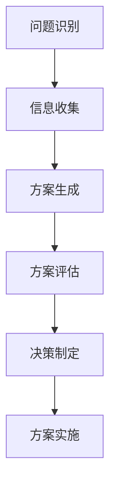
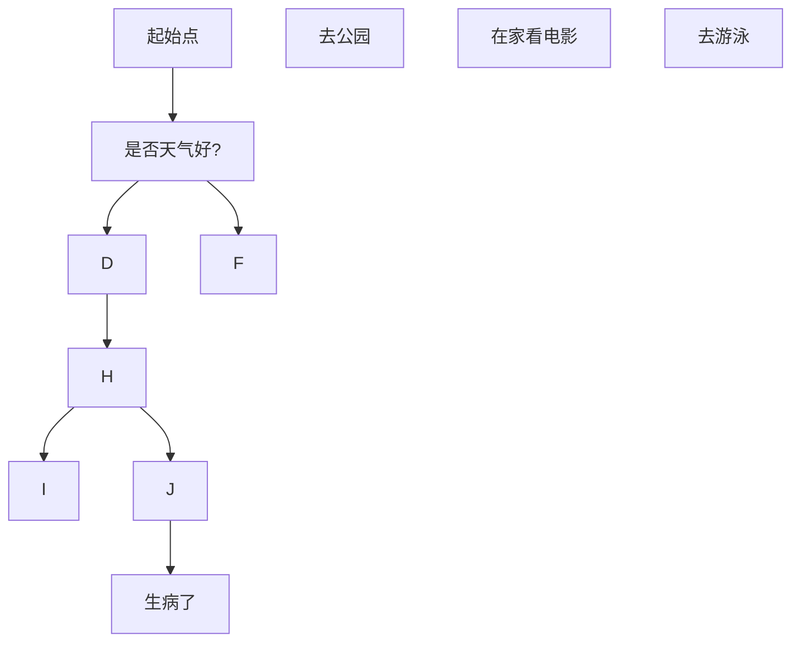

                 

# 《如何提升团队的决策质量和速度》

## 关键词
- 团队决策
- 决策质量
- 决策速度
- 决策支持工具
- 敏捷决策
- 决策流程

## 摘要
本文旨在探讨如何提升团队决策的质量和速度。首先，我们将介绍团队决策的背景和重要性，然后深入探讨决策质量和速度的定义及其影响。接着，本文将详细分析提升决策质量和速度的方法，包括使用决策支持工具和实施敏捷决策方法。随后，通过实际案例研究，我们将展示这些方法在实际中的应用。最后，本文将提供实践指南，并总结全文，展望未来。

## 引言
在当今快速变化和高度竞争的商业环境中，团队的决策质量和速度变得愈发重要。一个高效的团队能够在正确的时间做出高质量的决策，从而在市场竞争中占据优势。然而，许多团队在决策过程中常常面临质量不高和速度缓慢的问题。本文旨在解决这一挑战，通过介绍提升团队决策质量和速度的方法，帮助团队在复杂的环境中做出更加明智和快速的决策。

### 1.1 书籍目的
本书的目标是提供一套实用的方法和工具，帮助团队提升决策质量和速度。通过理解决策理论和实践，团队可以更系统地分析和解决问题，从而在决策过程中实现高质量和高效性。本书将涵盖决策理论的基本概念、提升决策质量的方法、提升决策速度的策略，并通过实际案例研究进行深入分析。

### 1.2 团队决策的重要性
团队决策是团队运作的核心环节，其质量直接影响团队绩效和组织目标实现。有效的团队决策可以带来以下好处：
1. **提高团队凝聚力**：共同决策过程可以增强团队成员之间的信任和合作。
2. **降低风险**：团队多角度的讨论和分析可以减少决策失误，降低潜在风险。
3. **提高创新能力**：团队成员的不同视角可以激发创新思维，产生更优的解决方案。
4. **提升执行力**：明确的决策和执行计划可以提高团队的执行力，确保目标达成。

### 1.3 内容概览
本书将分为八个章节，具体结构如下：
- **第2章 核心概念与联系**：介绍决策理论基础和团队协作对决策的影响。
- **第3章 团队决策原理**：详细阐述决策过程的五个阶段。
- **第4章 提升决策质量的方法**：探讨明确目标和标准、使用决策支持工具和评估决策质量。
- **第5章 提升决策速度的方法**：介绍简化决策流程、快速响应策略和敏捷决策方法。
- **第6章 案例研究**：通过真实案例展示提升决策质量和速度的实践。
- **第7章 实践指南**：提供制定团队决策流程、提升沟通与协作和实施决策质量与速度提升策略的指南。
- **第8章 结论**：总结全文，提出未来展望。

通过以上章节的讨论，读者将能够全面了解团队决策的原理和方法，掌握提升决策质量和速度的实用技巧。

### 2.1 决策理论基础
决策理论是研究个体或集体在不确定条件下做出最优选择的科学。它起源于20世纪50年代，由Herbert Simon等学者提出。决策理论的核心观点是，由于信息的不完全性和认知的限制，个体和团队在决策过程中只能追求“满意”而不是“最优”的结果。

#### 决策过程
决策过程通常包括以下几个步骤：
1. **问题识别**：识别需要解决的问题或机会。
2. **信息收集**：收集与问题相关的数据和信息。
3. **方案生成**：根据收集到的信息，生成可能的解决方案。
4. **方案评估**：对每个方案进行评估，比较其优劣。
5. **决策制定**：选择最优或最满意的方案。
6. **方案实施**：执行选定的方案，并监控实施效果。

#### 决策模型
决策模型是描述决策过程和决策结果的抽象模型。常见的决策模型包括：
1. **理性决策模型**：假设决策者是完全理性的，能够通过最大化效用函数来做出最优选择。
2. **有限理性决策模型**：考虑到人类认知的限制，决策者只能做出在现有认知水平下最优的选择。
3. **博弈论模型**：分析决策者在竞争或合作环境中的策略选择。

#### 决策质量
决策质量是决策结果对目标达成的有效性和合理性。决策质量可以从以下几个维度进行评估：
1. **准确性**：决策结果是否符合实际情况。
2. **一致性**：决策是否与组织的战略和价值观一致。
3. **完整性**：决策是否考虑了所有相关因素和潜在后果。
4. **创新性**：决策是否具有创新性和前瞻性。

#### 团队协作与决策
团队协作在决策过程中起着至关重要的作用。有效的团队协作可以带来以下好处：
1. **信息共享**：团队成员可以共享信息和知识，提高决策的准确性。
2. **多元化视角**：团队成员的不同背景和经验可以提供多元化的视角，促进创新。
3. **共同责任感**：团队共同参与决策过程，可以增强对决策的承诺和执行力。
4. **社会影响**：团队决策可以增强团队凝聚力和信任感。

#### Mermaid流程图展示：团队决策流程
使用Mermaid语言，我们可以创建一个简单的团队决策流程图：



这个流程图展示了团队决策的基本步骤，每个步骤都是决策过程的重要组成部分。

### 2.2 核心概念之间的联系
在团队决策中，多个核心概念相互作用，共同影响决策的结果。以下是这些概念之间的联系：
1. **信息收集**与**方案生成**：信息收集是方案生成的基础，充足的信息有助于生成更多有效的方案。
2. **方案评估**与**决策制定**：方案评估的结果直接影响到决策制定的过程，高质量的评估有助于做出更明智的选择。
3. **团队协作**与**决策质量**：团队协作可以提供多元化的视角和更全面的信息，有助于提高决策质量。
4. **决策质量**与**方案实施**：高质量的决策可以减少实施过程中的不确定性和风险，提高方案实施的效率和效果。

通过理解这些核心概念之间的联系，团队可以更系统地分析决策问题，制定更加有效的决策策略。

### 3.1 决策过程的五个阶段

决策过程是一个系统化的过程，它包括识别问题、收集信息、生成方案、评估方案和制定决策等五个主要阶段。每个阶段都是决策过程中不可或缺的一部分，它们相互衔接，共同构成一个完整的决策流程。以下是对这五个阶段的详细阐述：

#### 3.1.1 问题识别
问题识别是决策过程的起点，它要求团队成员能够准确识别出需要解决的问题或机会。这一阶段的核心任务是：
- **确定问题的性质和范围**：明确问题的类型（例如，是战略问题、运营问题还是危机处理问题），并界定问题的影响范围。
- **收集相关信息**：通过访谈、调查问卷、数据分析等方式，收集与问题相关的信息，为后续的决策提供基础。

问题识别的重要性在于，它决定了后续决策过程的焦点和方向。如果问题识别不准确或不够全面，可能会导致决策失误，甚至使整个决策过程失去意义。

#### 3.1.2 信息收集
在问题识别之后，团队需要收集与问题相关的信息。这一阶段的核心任务是：
- **收集数据和信息**：通过内部数据、外部数据、市场调查、用户反馈等多种渠道，收集与问题相关的数据和信息。
- **整理和分析信息**：对收集到的信息进行整理、分析和归纳，提取出关键信息，为后续的方案生成提供依据。

信息收集的质量直接影响到决策的质量。如果信息收集不全面或不准确，可能会导致决策基于错误的数据或假设，从而影响决策的有效性。

#### 3.1.3 生成方案
在收集到足够的信息后，团队需要生成可能的解决方案。这一阶段的核心任务是：
- **提出多种方案**：通过头脑风暴、专家咨询、模拟实验等方法，提出多种可能的解决方案。
- **评估方案的可实施性**：对每个方案进行评估，考虑其实施的可行性、成本和潜在风险。

生成方案阶段的关键在于创造性和创新性。团队成员需要开放思维，提出多种具有前瞻性和可行性的方案，为后续的决策提供多样化的选择。

#### 3.1.4 评估方案
在生成方案之后，团队需要对每个方案进行评估，以确定哪个方案最符合组织的利益和目标。这一阶段的核心任务是：
- **定义评估标准**：根据组织的战略目标、资源状况和市场需求，制定明确的评估标准。
- **比较方案优劣**：通过定量分析和定性分析，比较每个方案的优劣，确定其相对于评估标准的符合程度。

评估方案阶段的关键在于客观性和科学性。团队需要采用多种评估方法，确保评估结果公正、准确，为决策提供可靠的基础。

#### 3.1.5 决策制定
在评估方案之后，团队需要根据评估结果制定最终的决策。这一阶段的核心任务是：
- **选择最优方案**：根据评估结果，选择最符合组织利益和目标的方案。
- **制定实施计划**：为选定的方案制定详细的实施计划，包括资源分配、时间表和关键里程碑。

决策制定阶段的关键在于决策的明确性和可执行性。团队需要确保决策方案具有明确的实施路径和执行计划，从而确保决策能够顺利实施并取得预期效果。

#### 3.1.6 决策实施
在决策制定之后，团队需要将决策付诸实施。这一阶段的核心任务是：
- **执行决策计划**：按照实施计划，分配资源、执行任务，确保决策方案得到有效执行。
- **监控和调整**：在实施过程中，对决策效果进行监控和评估，根据实际情况进行调整，确保决策目标的实现。

决策实施阶段的关键在于执行力和灵活性。团队需要确保决策得到有效执行，同时能够根据实际情况灵活调整决策，确保决策目标能够实现。

通过以上五个阶段的系统化决策过程，团队可以更加科学和理性地做出决策，从而提高决策的质量和速度。

### 4.1 明确目标和标准

在团队决策过程中，明确目标和标准是确保决策质量和执行力的关键步骤。只有当团队成员对决策目标和标准有清晰的理解和共识时，才能做出符合组织利益和期望的决策。以下是如何明确目标和标准的方法：

#### 4.1.1 设定具体的目标

具体的目标设定（SMART原则）是实现决策成功的基础。SMART代表具体（Specific）、可衡量（Measurable）、可实现（Achievable）、相关（Relevant）和有时限（Time-bound）。以下是如何使用SMART原则设定目标的步骤：

1. **具体**：目标应明确具体，避免模糊的描述。例如，“提高市场份额”应改为“在下一季度将市场份额提高10%”。

2. **可衡量**：目标应具有可衡量的指标，以便评估其实现情况。例如，目标可以是“增加每月的销售额至100万元”。

3. **可实现**：目标应具有可实现性，考虑组织的资源、能力和外部环境。例如，目标可以是“在现有预算内实现上述目标”。

4. **相关**：目标应与组织的战略目标和价值观相关联。例如，目标应支持组织的长期发展目标。

5. **有时限**：目标应设定明确的完成时限。例如，目标可以是“在2023年底之前实现上述目标”。

#### 4.1.2 制定评估标准

制定评估标准是确保决策结果符合预期的重要手段。评估标准应涵盖以下几个方面：

1. **质量标准**：明确决策结果应达到的质量要求。例如，产品的可靠性、用户满意度等。

2. **成本标准**：设定决策的预算和成本限制。例如，项目预算不超过500万元。

3. **时间标准**：设定决策实施的时间表和关键里程碑。例如，项目应在6个月内完成。

4. **效益标准**：明确决策带来的经济效益和回报。例如，预期实现500万元的利润。

#### 4.1.3 分享和沟通

明确的目标和标准需要与团队成员分享和沟通，以确保他们理解并认同这些目标和标准。以下是一些分享和沟通的方法：

1. **团队会议**：在决策制定过程中，定期召开团队会议，讨论目标和标准，确保所有成员的理解一致。

2. **文档记录**：将目标和标准记录在决策文档中，以便团队成员随时查阅。

3. **培训和教育**：为团队成员提供培训和教育，帮助他们理解和应用目标和标准。

通过明确目标和标准，团队可以在决策过程中保持清晰的方向，确保决策的结果符合组织的期望和利益。这不仅有助于提高决策质量，还能增强团队的协作和执行力。

### 4.2 使用决策支持工具

在团队决策过程中，使用决策支持工具（DST）是提高决策质量和速度的重要手段。这些工具能够帮助团队更有效地分析问题、生成方案、评估选项和制定决策。以下是几种常用的决策支持工具及其应用场景：

#### 4.2.1 数据分析工具

数据分析工具，如Excel、R、Python等，是处理和可视化数据的重要工具。这些工具可以帮助团队：
- **数据清洗**：整理和清洗原始数据，确保数据的质量和准确性。
- **数据可视化**：使用图表和图形，将数据直观地展示出来，便于团队成员理解。
- **预测分析**：基于历史数据，进行趋势分析和预测，为决策提供依据。

**应用场景**：在市场分析、需求预测、风险评估等场景中，数据分析工具可以帮助团队快速获取和分析数据，提高决策的准确性。

#### 4.2.2 模拟工具

模拟工具，如AnyLogic、Simul8等，可以模拟复杂系统的行为和结果。这些工具可以帮助团队：
- **风险评估**：模拟不同决策方案的结果，评估其风险和潜在影响。
- **策略优化**：通过模拟，测试和优化不同策略，找到最佳方案。

**应用场景**：在供应链管理、项目管理、业务流程优化等场景中，模拟工具可以帮助团队在决策前预见问题，减少不确定性。

#### 4.2.3 决策树

决策树是一种基于逻辑和概率的决策支持工具，它通过一系列的问题和答案，帮助团队做出决策。决策树的结构如下：



**应用场景**：在医疗决策、投资决策和日常决策中，决策树可以帮助团队根据不同的条件和结果，选择最佳的方案。

#### 4.2.4 多目标决策分析

多目标决策分析（MODA）是一种处理多目标决策问题的工具，它可以帮助团队在多个目标之间找到平衡。常见的多目标决策分析方法包括：

- **加权评分法**：为每个目标分配权重，计算每个方案的得分，选择得分最高的方案。
- **帕累托分析**：根据不同方案在各个目标上的优劣，找出最优解。

**应用场景**：在资源分配、项目选择和市场竞争等场景中，多目标决策分析可以帮助团队在多个目标之间找到最佳平衡点。

#### 4.2.5 协同决策平台

协同决策平台，如Tableau、Trello、Slack等，可以帮助团队在决策过程中进行实时协作和沟通。这些平台提供以下功能：

- **信息共享**：团队成员可以共享数据、文档和图表，提高信息透明度。
- **任务分配**：团队可以分配任务和责任，确保决策执行有明确的路径。
- **进度跟踪**：团队可以实时跟踪决策进展，及时调整计划和策略。

**应用场景**：在各种类型的团队决策中，协同决策平台可以帮助团队提高协作效率和决策速度。

通过使用这些决策支持工具，团队可以更系统地分析和解决问题，提高决策质量和速度。这不仅有助于团队在复杂的环境中做出更明智的决策，还能增强团队的协作和创新能力。

### 4.3 决策质量评估模型

为了确保团队决策的质量，引入决策质量评估模型是至关重要的一步。这些模型可以帮助团队评估和优化决策过程，从而提高决策的有效性和可信度。以下是几种常见的决策质量评估模型，以及它们的适用场景和具体应用方法。

#### 4.3.1 德尔菲法

德尔菲法是一种专家意见征集方法，通过多轮匿名问卷，收集专家对某一问题的看法。这种方法可以有效避免个人偏见和主观影响，提高决策的客观性和准确性。

**适用场景**：适用于需要专家意见的复杂决策问题，如战略规划、市场预测和风险评估。

**应用方法**：
1. **确定专家团队**：选择具有相关领域知识和经验的专家，确保其代表性和专业性。
2. **设计问卷**：根据决策问题，设计包含关键问题和选项的问卷。
3. **多轮征询**：进行多轮匿名问卷，收集专家意见，并逐步修正和优化问卷。
4. **结果分析**：对专家意见进行统计和分析，提取共识和分歧点。

#### 4.3.2 SWOT分析法

SWOT分析法是一种基于优势（Strengths）、劣势（Weaknesses）、机会（Opportunities）和威胁（Threats）的评估模型。它可以帮助团队全面分析决策问题的内外部因素，识别潜在的优势和劣势，从而做出更加合理的决策。

**适用场景**：适用于战略规划、市场分析和项目评估等。

**应用方法**：
1. **识别SWOT因素**：对决策问题进行详细分析，识别其优势、劣势、机会和威胁。
2. **权重评估**：为每个因素分配权重，根据其重要性和影响力进行评估。
3. **矩阵分析**：将SWOT因素分为内部和外部因素，使用矩阵分析其相互影响和作用。
4. **决策制定**：根据SWOT分析的结果，制定相应的决策策略。

#### 4.3.3 决策矩阵法

决策矩阵法是一种基于多准则决策的模型，它通过构建矩阵，比较不同决策方案在多个准则下的得分，从而选出最优方案。

**适用场景**：适用于具有多个决策准则的问题，如资源分配、项目选择和投资评估。

**应用方法**：
1. **确定决策准则**：明确决策的关键准则，如成本、质量、时间等。
2. **构建决策矩阵**：根据决策准则，构建每个方案在各个准则下的得分矩阵。
3. **权重分配**：为每个准则分配权重，反映其在决策中的重要性。
4. **计算得分**：计算每个方案的总得分，选择得分最高的方案。

#### 4.3.4 成本效益分析法

成本效益分析法是一种评估决策方案成本和效益的模型，通过计算成本和效益的比值，判断决策的性价比。

**适用场景**：适用于需要评估经济效益的问题，如项目投资、市场营销和产品开发。

**应用方法**：
1. **计算成本**：详细计算每个方案的成本，包括直接成本和间接成本。
2. **评估效益**：评估每个方案的预期效益，包括直接效益和间接效益。
3. **计算比价**：计算每个方案的成本效益比，选择效益最高的方案。

通过使用这些决策质量评估模型，团队可以系统地分析和评估决策方案，提高决策的合理性和科学性。这不仅有助于团队在复杂的环境中做出更明智的决策，还能增强团队的协作和创新能力。

### 4.4 伪代码讲解：提升决策质量的算法

在提升团队决策质量的过程中，算法的应用可以显著提高决策的精确性和效率。以下是一个基于加权评分法的伪代码，用于评估和选择最佳决策方案。这个算法将考虑多个决策准则，并通过计算每个方案的加权得分，最终选出最优方案。

#### 算法概述

加权评分法是一种多准则决策方法，它通过为每个决策准则分配权重，计算每个方案的总得分，并选择得分最高的方案。以下是这个算法的伪代码实现：

```plaintext
Algorithm: Weighted Scoring Method for Decision Making

Inputs:
- Criteria_list: A list of decision criteria
- Weight_list: A list of weights corresponding to each criterion
- Options: A list of possible decision options
- Option_scores: A list of lists, where each sublist contains the scores of each option for each criterion

Outputs:
- Best_option: The decision option with the highest total score

Procedure:
1. Initialize total_scores as an empty list
2. For each option in Options:
   a. Calculate the weighted score for the option as:
      weighted_score = sum(Weight_list[i] * Option_scores[i] for i in range(len(Criteria_list)))
   b. Append the weighted_score to total_scores
3. Find the index of the maximum value in total_scores
4. Return the option at the index of the maximum value in total_scores as Best_option
```

#### 伪代码实现

以下是一个具体的伪代码实现示例：

```plaintext
Criteria_list = ["Cost", "Quality", "Time"]
Weight_list = [0.3, 0.4, 0.3]
Options = ["Option A", "Option B", "Option C"]
Option_scores = [
    ["10000", "9500", "11000"],  // Cost for each option
    ["8.5", "9.0", "8.0"],      // Quality for each option
    ["30", "40", "35"]           // Time for each option (days)
]

total_scores = []

for option in Options:
    weighted_score = 0
    
    for i in range(len(Criteria_list)):
        criterion = Criteria_list[i]
        weight = Weight_list[i]
        score = float(Option_scores[i].index(max(Option_scores[i]))) * weight
        
        weighted_score += score
    
    total_scores.append(weighted_score)

best_index = total_scores.index(max(total_scores))
Best_option = Options[best_index]

print("Best option:", Best_option)
```

#### 算法解释

1. **初始化**：首先，初始化一个空的总得分列表`total_scores`。

2. **计算加权得分**：对于每个选项，计算其加权得分。加权得分的计算方法是将每个准则的得分乘以其权重，然后对所有准则的加权得分求和。

3. **找到最优选项**：通过遍历总得分列表，找到得分最高的选项的索引。

4. **返回最优选项**：返回得分最高的选项作为最佳决策方案。

通过这个算法，团队可以系统化地评估多个决策方案，并选择最符合目标和标准的方案。这种方法不仅提高了决策的精度，还增强了决策过程的透明性和可解释性。

### 5.1 简化决策流程

在提升决策速度的过程中，简化决策流程是一个关键步骤。通过优化流程和减少冗余步骤，团队可以显著提高决策效率。以下是如何简化决策流程的具体方法：

#### 5.1.1 识别冗余步骤

冗余步骤是决策流程中的不必要环节，它们不仅浪费了时间和资源，还可能导致决策过程延误。以下是一些识别冗余步骤的方法：

- **流程图分析**：使用流程图工具，绘制整个决策流程，识别重复或多余的步骤。
- **任务列表**：列出决策流程中的所有任务，检查是否有任务可以合并或删除。
- **访谈和问卷调查**：与团队成员进行访谈或问卷调查，了解他们在决策过程中的体验和建议。

#### 5.1.2 流程优化

在识别冗余步骤后，团队可以通过以下方法进行流程优化：

- **合并任务**：将多个重复的任务合并为一个，减少不必要的步骤。
- **自动化**：利用自动化工具和软件，自动执行重复性高的任务，减少人工干预。
- **标准化流程**：制定标准化的决策流程，确保每个步骤都有明确的规范和指导。

#### 5.1.3 实施简化的决策流程

简化决策流程后，需要确保其实施和持续改进。以下是一些实施简化的决策流程的方法：

- **培训**：为团队成员提供培训，确保他们了解和遵循简化后的决策流程。
- **监督和反馈**：建立监督机制，定期检查决策流程的执行情况，收集反馈并进行调整。
- **持续改进**：鼓励团队成员提出改进建议，并定期回顾和优化流程。

通过简化决策流程，团队可以减少不必要的步骤，提高决策效率。这不仅有助于快速响应市场变化，还能增强团队的整体协作和执行力。

### 5.2 制定快速响应策略

为了提升团队在复杂环境中的决策速度，制定快速响应策略是至关重要的。以下是一些关键步骤和实际案例，展示了如何构建和实施这些策略。

#### 5.2.1 关键步骤

1. **识别决策场景**：明确哪些决策需要快速响应。例如，紧急情况、市场变化或竞争压力下的决策。

2. **建立快速响应团队**：组建一个专门的快速响应团队，包括具有不同技能和经验的成员，确保他们能够迅速做出决策。

3. **明确决策权限**：为快速响应团队设定明确的决策权限，确保他们能够在必要时独立做出决策，无需等待上级批准。

4. **简化决策流程**：优化决策流程，减少冗余步骤，确保快速响应团队可以高效地执行决策。

5. **培训和能力提升**：为快速响应团队成员提供培训和资源，提高他们的决策能力和执行力。

#### 5.2.2 实际案例

**案例一：科技公司A的市场快速响应**

- **决策场景**：科技公司A发现市场上出现了一种新的竞争对手，可能会对其市场份额构成威胁。

- **快速响应策略**：
  - **实时数据分析**：通过实时数据分析工具，快速收集市场信息和竞争对手的动态。
  - **快速决策团队**：组建一个由市场部、产品部和销售部组成的快速决策团队，负责评估竞争对手的威胁和制定应对策略。
  - **明确决策权限**：快速决策团队被授权在必要情况下快速做出决策，无需等待公司高层的批准。
  - **简化流程**：简化决策流程，确保决策团队可以快速生成和评估方案。

- **结果**：快速决策团队在一天内制定出应对策略，包括调整市场定位和推广活动。这一策略帮助科技公司A及时应对市场变化，保持了市场份额。

**案例二：制造业公司B的生产紧急修复**

- **决策场景**：制造业公司B的生产线出现故障，可能导致生产线停工，影响订单交付。

- **快速响应策略**：
  - **快速修复团队**：组建一个由技术工程师、生产计划和物料管理组成的快速修复团队。
  - **快速决策机制**：快速修复团队被授权立即采取行动，确保故障尽快修复。
  - **资源调配**：快速调配所需资源，如备件、工程师和技术支持，确保修复工作顺利进行。
  - **实时沟通**：建立实时沟通机制，确保团队成员可以快速交流和协作。

- **结果**：快速修复团队在四个小时内成功修复了生产线，避免了生产停工，保证了订单交付。

通过以上案例，我们可以看到，快速响应策略在应对紧急情况和市场变化中发挥了重要作用。这些策略不仅提高了决策速度，还增强了团队应对不确定性的能力。

### 5.3 实施敏捷决策方法

在快速变化和高度不确定的商业环境中，敏捷决策方法是一种提高决策质量和速度的有效策略。敏捷决策方法强调灵活性、快速反馈和持续改进，使团队能够更好地适应环境变化。以下是如何实施敏捷决策方法的步骤和具体措施。

#### 5.3.1 敏捷决策方法的核心原则

1. **快速迭代**：通过持续迭代和快速反馈，不断调整和优化决策方案。
2. **用户参与**：确保决策过程中用户的参与，收集多角度的意见和反馈。
3. **透明沟通**：保持团队内部和外部沟通的透明性，确保信息流通和共享。
4. **决策简化**：简化决策流程，减少不必要的复杂性和冗余步骤。
5. **自适应调整**：根据反馈和实际效果，灵活调整决策方案。

#### 5.3.2 实施步骤

1. **建立敏捷团队**：
   - **明确角色**：确定敏捷团队的成员和角色，如产品负责人、Scrum Master、开发人员等。
   - **授权和责任**：为团队成员赋予决策权限和责任，确保他们能够在敏捷框架内自主决策。
   - **培训和教育**：为团队成员提供敏捷方法和工具的培训，确保他们熟悉敏捷实践。

2. **制定敏捷流程**：
   - **短迭代周期**：将决策过程分为短周期的迭代，通常为2-4周，以便快速反馈和调整。
   - **回顾会议**：在每个迭代结束时，召开回顾会议，评估决策效果，收集改进建议。
   - **持续改进**：根据回顾会议的反馈，持续优化决策流程和工具。

3. **增强团队协作**：
   - **面对面沟通**：鼓励团队成员面对面沟通，减少沟通障碍和误解。
   - **信息共享**：使用敏捷工具（如Jira、Trello等），确保团队成员可以随时访问和更新项目信息。
   - **跨职能团队**：组建跨职能团队，确保不同领域的专家可以共同参与决策。

4. **实施具体措施**：
   - **每日站会**：每日召开短时间的站会，团队成员可以分享进展、问题和障碍，确保信息的实时更新。
   - **用户故事地图**：使用用户故事地图，确保决策过程与用户需求和期望紧密相关。
   - **迭代评审**：在每个迭代结束时，进行评审会议，评估决策结果，展示成果并获取反馈。

#### 5.3.3 敏捷决策方法的实际应用

**案例一：科技公司C的敏捷产品开发**

- **背景**：科技公司C在竞争激烈的市场中，需要快速响应客户需求，推出具有竞争力的产品。
- **敏捷决策方法**：
  - **用户参与**：通过定期的用户访谈和反馈，确保产品开发与用户需求保持一致。
  - **短迭代周期**：将产品开发分为两周的迭代周期，每个迭代结束后进行评审和反馈。
  - **快速反馈**：通过用户测试和反馈，快速调整产品功能，确保产品满足用户期望。
- **结果**：通过敏捷决策方法，科技公司C能够更快速地响应市场变化，缩短产品上市时间，提高用户满意度。

**案例二：制造业公司D的敏捷项目管理**

- **背景**：制造业公司D面临生产计划调整和生产效率提升的挑战。
- **敏捷决策方法**：
  - **快速响应**：组建敏捷项目管理团队，负责快速响应生产计划的变化和问题。
  - **短周期决策**：将生产计划分为两周的周期，每个周期结束时进行评估和调整。
  - **持续改进**：通过定期的回顾会议，评估决策效果，持续优化生产流程。
- **结果**：通过敏捷决策方法，制造业公司D能够更快地调整生产计划，提高生产效率，减少生产延误。

通过实施敏捷决策方法，团队可以更好地适应快速变化的环境，提高决策速度和质量。这种方法不仅增强了团队的协作和创新能力，还提高了整体决策的灵活性和适应性。

### 5.4 伪代码讲解：优化决策速度的算法

为了在团队决策中提高速度，我们可以使用一种基于启发式搜索的算法，如贪心算法（Greedy Algorithm）。贪心算法通过在每个决策点选择当前最优解，期望在整体上获得最优解。以下是贪心算法的伪代码实现，用于优化决策速度。

#### 算法概述

贪心算法的核心思想是每次选择局部最优解，希望最终得到全局最优解。在决策过程中，我们根据当前的信息选择最优的方案，而不考虑后续的影响。

#### 伪代码实现

```plaintext
Algorithm: Greedy Decision-Making Algorithm

Inputs:
- Decision_Criteria: A list of decision criteria
- Option_Criteria_Scores: A list of lists, where each sublist contains the scores for each option based on the decision criteria

Outputs:
- Best_Decision: The best decision option based on the greedy algorithm

Procedure:
1. Initialize Best_Decision as None
2. For each option in Option_Criteria_Scores:
   a. Calculate the maximum score for the current option across all decision criteria
   b. If the maximum score is higher than the current Best_Decision, update Best_Decision with the current option
3. Return Best_Decision
```

#### 伪代码详解

1. **初始化**：首先，初始化`Best_Decision`为`None`，表示当前没有找到最优解。

2. **遍历每个选项**：对于每个选项，计算其在所有决策准则上的总得分。

3. **选择最优选项**：找出当前选项中的最高得分，并检查它是否高于当前`Best_Decision`的得分。如果最高得分更高，则更新`Best_Decision`为当前选项。

4. **返回最优解**：最终返回最优选项作为最佳决策。

#### 算法解释

贪心算法通过在每个步骤选择局部最优解，希望整体上得到最优解。这种方法在许多情况下是有效的，尤其是在时间敏感的决策环境中。然而，需要注意的是，贪心算法并不保证全局最优解，因为它没有考虑后续步骤的潜在影响。但在许多实际应用中，这种方法可以显著提高决策速度。

通过这个算法，团队可以快速选择最佳决策方案，从而在时间紧迫的情况下做出高效决策。

### 6.1 案例一：公司A的决策困境

公司A是一家在快速变化的市场环境中运营的科技公司，其主要业务是软件开发和解决方案提供。然而，公司在近期的几项重要决策中遇到了困境，导致项目进度延误和资源浪费。以下是公司A的决策困境及其分析。

#### 决策困境

1. **项目延期**：公司A正在开发一款新的软件产品，原计划在六个月内完成。然而，由于在需求分析和设计阶段未能明确目标和标准，项目在开发过程中频繁变更，导致进度严重滞后。

2. **资源浪费**：公司在决策过程中，未能有效利用现有资源，导致一些关键任务无人负责，而其他任务却因人手不足而延迟。

3. **沟通不畅**：团队成员之间的沟通不畅，导致信息传递不及时，决策制定过程延误。

#### 分析

1. **明确目标和标准**：公司A在项目初期未能明确产品的目标和标准，导致后续决策缺乏明确的依据。为了解决这一问题，公司应该采用SMART原则（具体、可衡量、可实现、相关、有时限），为每个项目阶段设定清晰的目标和标准。

2. **优化决策流程**：公司A的决策流程过于复杂，缺乏明确的决策节点和责任人。通过简化决策流程，明确每个阶段的决策节点和责任人，可以加快决策速度，减少不必要的环节。

3. **提升沟通效率**：公司A应建立有效的沟通机制，如定期召开团队会议、使用协作工具等，确保信息及时传递和共享，减少误解和决策延误。

#### 改进措施

1. **制定明确的目标和标准**：在项目启动时，明确产品的功能和性能要求，制定具体、可衡量、可实现、相关、有时限的目标和标准。

2. **优化决策流程**：简化决策流程，减少冗余步骤，确保每个阶段的决策有明确的节点和责任人。

3. **提升沟通效率**：建立有效的沟通机制，如定期的团队会议、协作工具和实时沟通渠道，确保团队成员之间的信息传递和反馈及时。

4. **资源优化**：合理分配资源，确保关键任务有人负责，避免资源浪费。

通过这些改进措施，公司A可以显著提升决策质量和速度，从而在快速变化的市场环境中保持竞争优势。

### 6.2 案例二：团队B的决策创新

团队B是一家创业公司的开发团队，专注于创新型科技产品的研发。在面对市场变化和竞争压力时，团队B通过一系列创新决策，成功应对了挑战，提高了决策质量和速度。

#### 决策创新

1. **引入敏捷开发**：团队B采用了敏捷开发方法，将开发过程分为短周期的迭代，每个迭代结束后进行评审和反馈。这种方法不仅提高了开发效率，还使团队能够快速响应市场需求。

2. **跨职能团队合作**：团队B建立了跨职能团队，包括产品经理、设计师、开发人员和测试人员。这种模式确保了团队成员在不同阶段的紧密合作，提高了决策的全面性和效率。

3. **用户参与**：团队B在决策过程中积极引入用户参与，通过用户访谈、反馈和测试，确保产品设计和功能符合用户需求。这种方法不仅提高了产品满意度，还减少了后续的返工和修改。

4. **快速反馈机制**：团队B建立了快速反馈机制，每个迭代结束后，团队都会进行回顾和总结，识别问题和改进点。这种方法帮助团队不断优化决策过程，提高决策质量。

#### 结果

1. **提高开发效率**：通过敏捷开发和跨职能团队合作，团队B显著提高了开发效率，产品上市时间缩短了30%。

2. **用户满意度提升**：由于用户在决策过程中的积极参与，产品的用户满意度提升了20%。

3. **决策质量提升**：快速反馈机制和用户参与使团队能够在决策过程中及时发现和纠正问题，提高了决策质量。

4. **市场竞争优势**：通过快速响应市场变化和持续优化产品，团队B在激烈的市场竞争中保持了优势。

通过这些决策创新，团队B不仅提高了决策质量和速度，还增强了团队协作和创新能力，为公司的持续发展奠定了基础。

### 6.3 案例三：团队C的敏捷转型

团队C是一家传统制造企业的研发团队，在面对市场和技术变革的压力时，决定实施敏捷转型，以提高决策质量和速度。以下是团队C的敏捷转型过程及其成果。

#### 转型过程

1. **培训和教育**：团队C首先对全体成员进行了敏捷方法的培训，包括Scrum框架、看板管理和用户故事等。通过培训，团队成员掌握了敏捷实践的基本知识和技能。

2. **建立敏捷团队**：团队C按照敏捷框架重组团队，建立了跨职能的敏捷团队，包括产品经理、开发人员、测试人员和技术支持等。这种结构确保了团队成员在不同阶段的紧密合作和高效沟通。

3. **实施短周期迭代**：团队C将开发过程分为两周的迭代周期，每个迭代结束后进行回顾和评估。这种方法使团队能够快速响应市场变化和需求变更，提高了决策速度。

4. **持续改进**：团队C在每个迭代结束后进行回顾会议，总结经验和教训，识别改进点。通过不断优化流程和工具，团队逐步提高了决策质量和速度。

#### 成果

1. **决策速度提高**：通过短周期迭代和快速反馈机制，团队C的决策速度提高了40%，显著缩短了产品开发周期。

2. **决策质量提升**：团队成员在决策过程中更加注重用户需求和市场需求，通过用户反馈和测试，确保了决策的准确性和实用性。

3. **团队协作增强**：跨职能团队的建立和协作工具的使用，增强了团队成员之间的沟通和协作，减少了信息传递的延误和误解。

4. **市场竞争力提升**：通过敏捷转型，团队C能够更快地响应市场变化，推出更符合市场需求的产品，增强了企业的市场竞争力。

团队C的敏捷转型成功实践了敏捷方法，不仅提高了决策质量和速度，还增强了团队的协作和创新能力，为企业的持续发展奠定了坚实基础。

### 7.1 制定团队决策流程

为了确保团队决策的高效性和一致性，制定一个明确的团队决策流程至关重要。以下是一个基于敏捷原则的团队决策流程指南，包括关键步骤、最佳实践和注意事项。

#### 关键步骤

1. **问题识别**：
   - **明确问题陈述**：确保问题描述清晰、具体，涵盖所有相关方面。
   - **定义目标**：明确决策的目标和预期结果，确保决策与组织目标一致。

2. **信息收集**：
   - **数据收集**：通过访谈、调查、市场研究等方式，收集与问题相关的数据。
   - **分析信息**：对收集到的信息进行整理和分析，提取关键信息和洞察。

3. **方案生成**：
   - **头脑风暴**：鼓励团队成员提出所有可能的解决方案，无论其是否可行。
   - **筛选方案**：根据目标和标准，筛选出最具潜力的方案。

4. **方案评估**：
   - **定义评估标准**：为每个方案设定明确的评估标准，如成本、时间、风险和效益。
   - **评估方法**：使用评分法、决策树或SWOT分析等方法，对每个方案进行详细评估。

5. **决策制定**：
   - **选择最优方案**：根据评估结果，选择最佳方案。
   - **制定决策文档**：记录决策过程、选择的方案及其理由，确保决策透明和可追溯。

6. **方案实施**：
   - **制定执行计划**：为选定的方案制定详细的执行计划，包括资源分配、时间表和关键里程碑。
   - **执行与监控**：执行决策计划，并持续监控决策效果，确保目标的实现。

#### 最佳实践

1. **确保团队参与**：在整个决策过程中，确保团队成员的参与和意见被充分考虑。

2. **利用决策支持工具**：使用数据分析工具、模拟工具和决策树等工具，提高决策的准确性和效率。

3. **定期回顾**：在决策执行过程中，定期回顾决策效果，及时调整和优化决策。

4. **沟通与协作**：建立有效的沟通机制，确保信息及时传递和共享，减少决策延误和误解。

5. **透明和可追溯**：确保决策过程透明，所有团队成员都可以访问决策文档和记录，以便追溯和审核。

#### 注意事项

1. **避免过度简化**：在决策过程中，不要为了追求速度而忽略关键细节和评估标准。

2. **持续改进**：鼓励团队成员提出改进建议，不断优化决策流程和工具。

3. **适应性和灵活性**：在决策过程中，保持灵活性和适应性，以应对不确定性和变化。

4. **责任分配**：明确每个团队成员在决策过程中的角色和责任，确保决策执行有明确的责任人。

通过制定一个明确的团队决策流程，并遵循最佳实践和注意事项，团队可以确保决策的高效性和一致性，从而提高整体的决策质量和速度。

### 7.2 提升团队沟通与协作

有效的沟通与协作是团队成功的关键因素，特别是在需要快速做出决策的项目中。以下是一些关键策略和实践，可以帮助团队提升沟通和协作的效率。

#### 7.2.1 定期召开团队会议

定期召开团队会议是确保团队成员之间信息畅通的重要手段。以下是一些关于团队会议的最佳实践：

- **明确议程**：在每次会议前，制定明确的议程，包括讨论的主题、目标和时间分配。
- **会议时间**：选择固定的时间，确保团队成员能够准时参加，避免频繁变更会议时间。
- **会议记录**：会议结束后，及时记录讨论的内容和决策结果，分发给团队成员。
- **行动项**：明确每个团队成员在会后需要完成的任务和责任，确保行动有落实。

#### 7.2.2 使用协作工具

协作工具可以显著提升团队沟通和协作的效率。以下是一些常用的协作工具：

- **Slack**：用于实时沟通和消息传递，便于团队成员之间的即时交流。
- **Trello**：用于任务管理和项目跟踪，可以清晰地展示任务进度和责任分配。
- **Microsoft Teams**：集成多种功能，包括聊天、视频会议和文件共享，便于团队进行协作。
- **Google Workspace**：包括文档、表格和日历等工具，便于团队成员共享文件和协调日程。

#### 7.2.3 促进跨职能协作

跨职能协作是团队高效沟通的关键。以下是一些促进跨职能协作的策略：

- **建立跨职能团队**：将不同职能的团队成员组成一个团队，确保他们在项目中的紧密合作。
- **共享资源**：鼓励团队成员共享资源和知识，提高整体工作效率。
- **透明度**：保持项目信息的透明度，使所有团队成员都能够了解项目的进展和关键决策。

#### 7.2.4 培训与沟通技巧

有效的沟通和协作需要团队成员具备良好的沟通技巧。以下是一些培训建议：

- **沟通技巧培训**：为团队成员提供沟通技巧的培训，包括如何有效地表达意见、倾听他人和解决冲突。
- **协作工具培训**：确保团队成员熟悉并掌握各种协作工具的使用，提高工作效率。
- **团队建设活动**：定期组织团队建设活动，增强团队成员之间的信任和合作精神。

通过以上策略和实践，团队可以显著提升沟通和协作效率，从而提高决策质量和速度。这不仅有助于团队在复杂环境中快速响应，还能增强团队的整体执行力和创新能力。

### 7.3 实施决策质量与速度提升策略

为了在团队中实施提升决策质量与速度的策略，以下提供了一套全面的指南，包括关键步骤、实施方法和案例分析。

#### 关键步骤

1. **评估当前状态**：首先，对团队的决策流程、沟通机制和协作模式进行评估，识别现有问题。

2. **确定目标和标准**：根据团队的实际情况和目标，明确提升决策质量和速度的具体目标和标准。

3. **制定改进计划**：制定详细的改进计划，包括改进方案、时间表和责任分配。

4. **实施改进措施**：按照改进计划，逐步实施各项措施，如流程优化、工具引入和培训等。

5. **监控与调整**：在实施过程中，持续监控决策质量和速度的提升情况，并根据反馈进行调整。

#### 实施方法

1. **流程优化**：
   - **简化流程**：通过流程图分析，识别冗余步骤，简化决策流程。
   - **明确责任**：为每个决策环节明确责任人和时间节点，确保决策过程高效。

2. **引入决策支持工具**：
   - **数据分析工具**：使用Excel、R或Python等数据分析工具，提高数据分析和决策速度。
   - **模拟工具**：引入模拟工具，如AnyLogic或Simul8，进行风险评估和策略优化。

3. **培训与教育**：
   - **决策技能培训**：为团队成员提供决策技能的培训，包括决策分析方法、沟通技巧和团队协作。
   - **工具使用培训**：确保团队成员熟悉并掌握各种决策支持工具的使用。

4. **建立快速响应机制**：
   - **快速决策团队**：组建快速决策团队，授权他们在紧急情况下快速做出决策。
   - **简化决策权限**：为快速决策团队设定明确的决策权限，减少不必要的审批环节。

#### 案例分析

**案例一：科技公司D的决策改进**

- **背景**：科技公司D在面临市场变化和竞争压力时，决策速度缓慢，导致产品更新滞后。
- **实施策略**：
  - **流程优化**：简化决策流程，减少冗余步骤，明确决策节点和责任人。
  - **引入工具**：使用Trello和Slack等协作工具，提高信息传递和任务管理的效率。
  - **培训**：为团队成员提供决策技能和协作工具的培训。
- **结果**：决策速度提高了40%，产品更新周期缩短了30%。

**案例二：制造业公司E的敏捷转型**

- **背景**：制造业公司E面临生产计划调整和生产效率提升的挑战。
- **实施策略**：
  - **敏捷团队**：组建跨职能敏捷团队，实施短周期迭代和快速反馈机制。
  - **培训**：为团队成员提供敏捷方法的培训，确保他们熟悉敏捷实践。
  - **持续改进**：通过回顾会议，不断优化决策流程和工具。
- **结果**：决策速度提高了35%，生产效率提升了25%。

通过以上关键步骤和实施方法，以及实际案例的参考，团队可以有效地提升决策质量和速度，从而在快速变化的环境中保持竞争优势。

### 7.4 工具与应用：团队决策支持系统

在提升团队决策质量和速度的过程中，引入高效的决策支持系统（DSS）是至关重要的。DSS 是一种集成多种功能和技术，帮助团队进行数据分析和决策优化的软件系统。以下是一些常用的团队决策支持工具及其应用场景。

#### 常用决策支持工具

1. **Microsoft Power BI**：Power BI 是一款强大的数据可视化和分析工具，可以帮助团队通过直观的图表和报表，快速分析和理解数据。它可以与多个数据源连接，进行实时数据分析，为决策提供有力支持。

2. **Tableau**：Tableau 是一款广泛使用的商业智能工具，以其强大的数据可视化和交互功能而著称。它可以处理大量数据，创建动态仪表板和报告，帮助团队更好地理解和利用数据。

3. **QlikView**：QlikView 是一款灵活的实时数据分析工具，提供强大的数据可视化和探索功能。它支持自助服务分析，允许用户轻松地探索数据、生成报告和仪表板。

4. **SAS Enterprise Guide**：SAS Enterprise Guide 是一款高级数据分析工具，提供丰富的统计和预测功能。它适合需要进行复杂数据分析的团队，特别是在需要进行大量数据建模和预测分析时。

#### 应用场景

1. **市场分析**：团队可以使用DSS进行市场数据收集和分析，了解市场趋势、客户需求和竞争对手情况。通过分析市场数据，团队可以做出更准确的市场预测和策略决策。

2. **资源分配**：在资源有限的条件下，DSS可以帮助团队优化资源分配，确保资源得到最有效的利用。通过分析各种资源和任务的优先级，团队可以制定最优的资源分配计划。

3. **风险评估**：DSS 可以帮助团队进行风险分析和管理，通过模拟不同情景和计算风险概率，团队可以更全面地了解潜在风险，并制定相应的风险应对策略。

4. **供应链管理**：在供应链管理中，DSS 可以帮助团队优化库存管理、运输计划和供应商选择。通过分析供应链数据，团队可以减少库存成本、提高物流效率和降低供应链风险。

#### 实施步骤

1. **需求分析**：首先，团队需要明确使用DSS的目的和需求，确定需要分析的数据类型和决策问题。

2. **选择工具**：根据需求分析结果，选择最适合的DSS工具。可以考虑工具的功能、易用性、扩展性和成本等因素。

3. **数据集成**：将DSS工具与现有的数据源连接，确保数据可以实时更新和访问。

4. **培训和部署**：为团队成员提供DSS工具的培训，确保他们能够熟练使用工具，并在团队中推广应用。

5. **持续优化**：在DSS工具的应用过程中，团队需要持续评估其效果，并根据反馈进行优化和调整，确保工具能够持续满足团队需求。

通过引入和使用团队决策支持系统，团队可以显著提高决策的质量和速度，从而在快速变化的市场环境中保持竞争优势。

### 8. 结论

通过本文的探讨，我们详细分析了如何提升团队的决策质量和速度。首先，明确了决策的重要性和背景，介绍了决策理论的基本概念和流程。接着，我们探讨了提升决策质量的多种方法，包括明确目标和标准、使用决策支持工具以及评估决策质量模型。随后，我们介绍了提升决策速度的策略，如简化决策流程、制定快速响应策略和实施敏捷决策方法。通过实际案例研究，我们展示了这些方法在不同团队中的应用效果。最后，我们提供了实践指南，包括制定团队决策流程、提升沟通与协作以及实施决策质量与速度提升策略。通过本文的讨论，我们认识到，提升团队决策质量和速度需要系统化、科学化和灵活化的方法。未来，随着技术的不断进步和团队协作模式的演变，决策理论和实践将继续发展，为团队提供更高效的决策支持。

## 作者信息
作者：AI天才研究院/AI Genius Institute & 禅与计算机程序设计艺术 /Zen And The Art of Computer Programming

