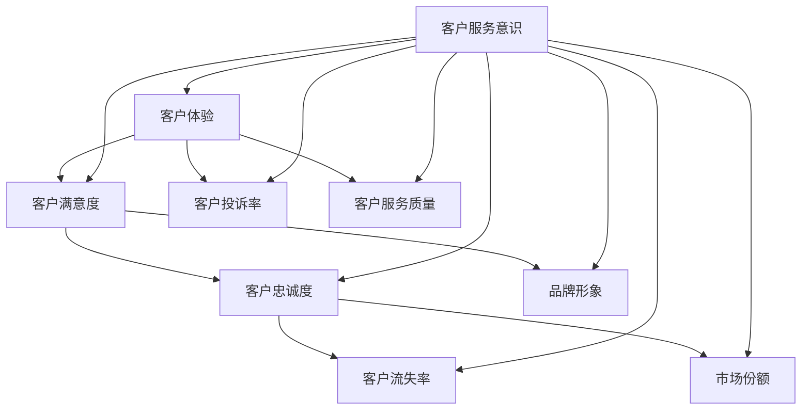
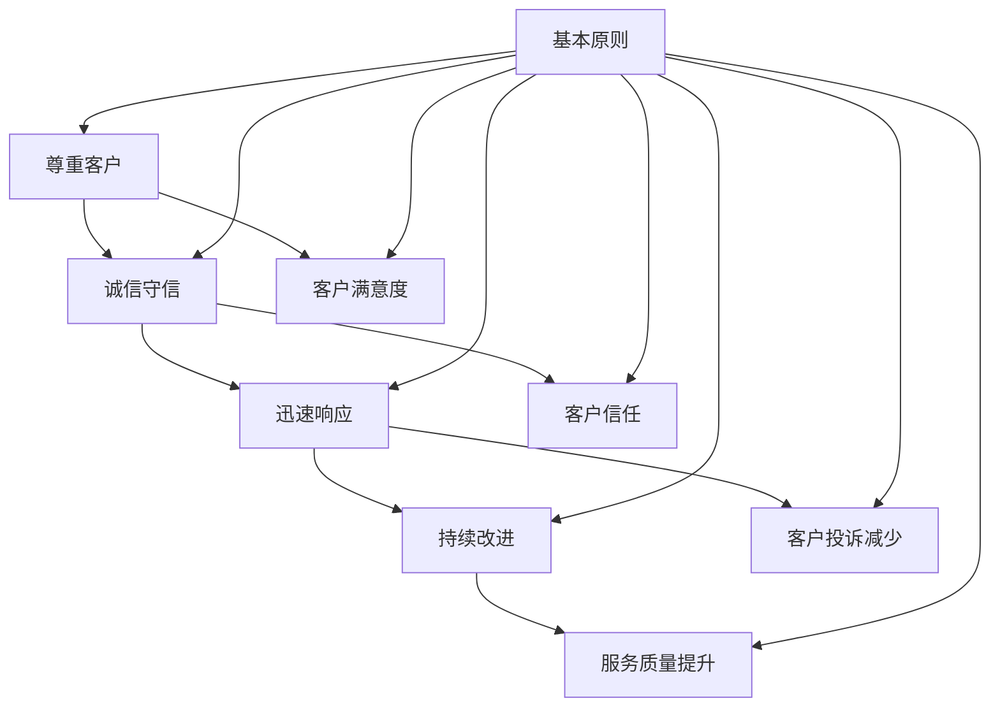
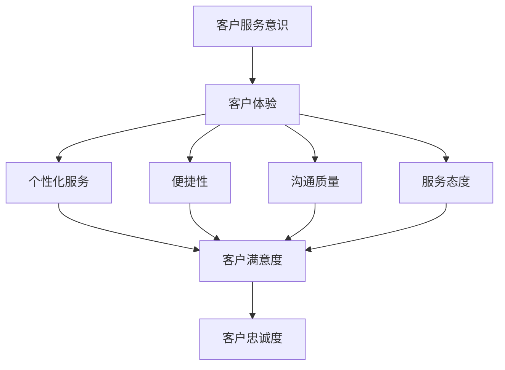
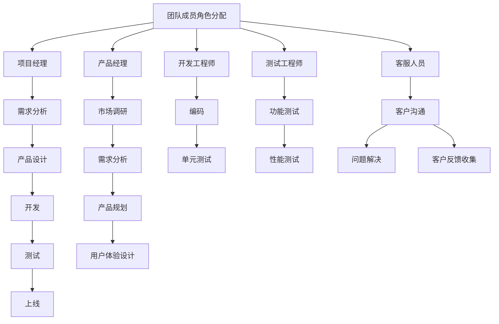
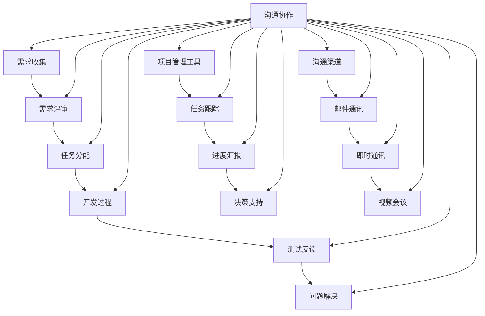

                 

### 文章标题：如何提升团队的客户服务意识

### 关键词：客户服务意识、团队管理、员工培训、客户关系管理、技术应用、法律法规、绩效评估

### 摘要：
本文将深入探讨如何提升团队的客户服务意识。通过分析客户服务意识的核心概念、团队管理策略、员工培训与发展、客户关系管理、技术应用、法律法规与伦理，以及绩效评估与激励，本文旨在为IT领域的企业提供一套全面且实用的提升客户服务意识的方案。文章结构紧凑，逻辑清晰，旨在帮助读者一步步理解和应用这些策略，从而实现卓越的客户服务。

---

## 第1章：客户服务意识基础

### 1.1 客户服务意识的重要性

客户服务意识是企业成功的关键因素之一。它不仅关系到客户满意度，还直接影响企业的品牌形象和市场份额。在当今竞争激烈的市场环境中，提供优质的客户服务已经成为企业生存和发展的基石。

#### 核心概念与联系

客户服务意识的核心概念包括客户体验、客户满意度、客户忠诚度和客户流失率等。这些概念之间存在着密切的联系。例如，良好的客户体验可以提升客户满意度，进而增强客户忠诚度，减少客户流失率。

为了更直观地展示这些概念之间的关系，我们可以使用Mermaid流程图来表示：



### 1.2 客户服务意识的基本原则

客户服务意识的基本原则包括尊重客户、诚信守信、迅速响应和持续改进。这些原则构成了客户服务的基本框架，指导企业在日常运营中如何提供优质的客户服务。

为了更好地理解这些原则，我们可以使用Mermaid流程图来展示它们之间的关系：



### 1.3 客户体验的重要性

客户体验是客户服务意识的核心，它直接影响客户的满意度、忠诚度和品牌忠诚度。为了提升客户体验，企业需要关注以下几个方面：

1. **个性化服务**：了解客户的需求和偏好，提供个性化的服务。
2. **便捷性**：简化服务流程，提高服务效率。
3. **沟通质量**：保持与客户的良好沟通，及时解决问题。
4. **服务态度**：员工需要具备良好的服务态度，展现专业性和亲和力。

为了展示客户体验的关键因素和客户服务意识的关系，我们可以使用Mermaid流程图：



---

以上章节介绍了客户服务意识的重要性、基本原则以及客户体验的关键因素。接下来，我们将进一步探讨团队管理、员工培训、客户关系管理、技术应用、法律法规与伦理以及绩效评估与激励等策略，以全面提升团队的客户服务意识。

## 第2章：团队管理与客户服务

### 2.1 团队成员的角色分配

团队管理是提升客户服务意识的关键环节之一。为了确保团队的高效运作，团队成员的角色分配至关重要。每个成员应该明确自己的职责和任务，以便更好地为客户提供服务。

以下是一个团队成员角色分配的Mermaid流程图示例：



### 2.2 沟通协作

团队内部的沟通协作是确保客户服务顺利进行的重要保障。高效的沟通可以减少误解，提高工作效率，从而提升客户满意度。以下是一个团队内部沟通协作的Mermaid流程图：



### 2.3 激励措施

为了提升团队的服务意识，激励措施至关重要。合理的激励措施可以激发团队成员的积极性，提高客户服务质量。以下是一个激励措施的伪代码示例：

```python
# 激励措施伪代码

# 定义激励措施
def incentive_program():
    # 奖励优秀员工
    for employee in top_employees:
        reward_employee(employee, "优秀员工奖")

    # 提升团队士气
    boost_morale()

    # 提供培训机会
    offer_training()

    # 调整工作环境
    improve_work_environment()

# 奖励员工
def reward_employee(employee, reward_name):
    print(f"{employee.name} received the {reward_name}!")

# 提升团队士气
def boost_morale():
    print("Team morale is being boosted!")

# 提供培训机会
def offer_training():
    print("Training opportunities are being provided!")

# 调整工作环境
def improve_work_environment():
    print("Improving the work environment!")
```

---

通过有效的团队管理，包括角色分配、沟通协作和激励措施，企业可以提升团队的服务意识，从而为客户提供更优质的服务。接下来，我们将探讨员工培训与发展的策略，以进一步提升团队的服务水平。

## 第3章：员工培训与发展

### 3.1 服务技能培训

员工的服务技能是提供优质客户服务的基础。为了提升团队的服务技能，企业需要制定系统的培训计划，涵盖沟通技巧、解决问题能力、产品知识等方面。以下是一个服务技能培训的伪代码示例：

```python
# 服务技能培训伪代码

# 定义培训课程
def service_skills_training():
    # 沟通技巧培训
    communicate_skills()

    # 解决问题能力培训
    problem_solving_skills()

    # 产品知识培训
    product_knowledge()

# 沟通技巧培训
def communicate_skills():
    print("Training on effective communication skills!")

# 解决问题能力培训
def problem_solving_skills():
    print("Training on problem-solving skills!")

# 产品知识培训
def product_knowledge():
    print("Training on product knowledge!")
```

### 3.2 客户服务意识培养

除了服务技能，客户服务意识也是提升客户服务质量的关键。企业需要通过多种方式培养员工的客户服务意识，包括企业文化、客户案例学习和实践操作等。以下是一个客户服务意识培养的伪代码示例：

```python
# 客户服务意识培养伪代码

# 定义培养策略
def customer_service_awareness_training():
    # 企业文化建设
    build_corporate_culture()

    # 客户案例学习
    learn_customer_cases()

    # 实践操作
    practice_operations()

# 企业文化建设
def build_corporate_culture():
    print("Building a customer-centric corporate culture!")

# 客户案例学习
def learn_customer_cases():
    print("Learning from successful and failed customer cases!")

# 实践操作
def practice_operations():
    print("Practicing customer service operations in real scenarios!")
```

### 3.3 职业发展路径

为了激励员工不断提升服务技能和客户服务意识，企业需要提供清晰的职业发展路径。职业发展路径不仅包括晋升机会，还包括专业培训和技能提升。以下是一个职业发展路径的Mermaid流程图：

```mermaid
graph TD
    A[初级员工] --> B[中级员工]
    B --> C[高级员工]
    C --> D[资深员工]
    E[职业发展路径] --> A
    E --> B
    E --> C
    E --> D
    F[基础培训] --> A
    F --> B
    F --> C
    F --> D
    G[专业技能提升] --> A
    G --> B
    G --> C
    G --> D
    H[领导力培养] --> B
    H --> C
    H --> D
    I[项目管理] --> C
    I --> D
```



---

通过系统的员工培训与发展，企业可以提升员工的服务技能和客户服务意识，从而为客户提供更优质的服务。接下来，我们将探讨客户关系管理的重要性。

## 第4章：客户关系管理

### 4.1 客户关系管理的重要性

客户关系管理（CRM）是企业在市场竞争中取得成功的关键策略之一。它不仅有助于提高客户满意度，还可以增加客户忠诚度和提升企业的盈利能力。以下是CRM的重要性：

1. **提升客户满意度**：通过CRM系统，企业可以更好地了解客户的需求和偏好，从而提供更个性化的服务。
2. **增加客户忠诚度**：CRM系统可以帮助企业维护良好的客户关系，减少客户流失率。
3. **提高盈利能力**：通过分析客户数据，企业可以优化产品和服务，提高销售额和利润。

### 4.2 客户关系管理的策略

成功的客户关系管理需要一系列的策略和工具。以下是一些关键策略：

1. **数据收集与分析**：通过CRM系统收集客户数据，并对数据进行分析，以了解客户的行为和需求。
2. **个性化沟通**：根据客户数据，制定个性化的沟通策略，提高客户满意度。
3. **定期客户回访**：定期与客户沟通，了解他们的反馈和需求，及时解决问题。
4. **客户关怀**：在特殊节假日或重要事件时，发送祝福或优惠券，表达对客户的关怀。

### 4.3 客户关系案例分析

为了更好地理解客户关系管理的重要性，我们可以分析一些成功的和失败的客户服务案例。

#### 成功案例

**案例一：亚马逊的个性化推荐**

亚马逊通过其CRM系统收集了大量用户数据，包括购买历史、浏览行为等。基于这些数据，亚马逊提供了个性化的产品推荐，极大地提升了用户的购物体验和满意度。

**案例二：苹果的客户忠诚计划**

苹果推出了“苹果忠诚计划”，通过积分和优惠活动激励客户持续购买其产品和服务，成功提升了客户忠诚度和品牌价值。

#### 失败案例

**案例三：宝洁的过度营销**

宝洁曾因其过度营销而受到批评。尽管其拥有大量的客户数据，但未能有效利用这些数据来提供个性化的服务，导致客户感到被骚扰，最终导致客户流失。

**案例四：美国航空的差劲客户服务**

美国航空因其在航班延误和客户投诉处理方面的差劲表现而受到广泛批评。尽管其拥有CRM系统，但未能有效地利用这些数据来改善客户服务，导致客户满意度下降。

通过分析这些案例，我们可以看到，成功的客户关系管理不仅需要技术支持，还需要对企业文化和员工素质的持续投入。

---

通过有效的客户关系管理策略，企业可以提升客户满意度、忠诚度和盈利能力。接下来，我们将探讨如何利用现代技术提升客户服务意识。

## 第5章：技术应用

### 5.1 利用CRM系统提升客户服务意识

CRM系统是提升客户服务意识的重要工具。通过CRM系统，企业可以收集、存储和分析大量客户数据，从而提供更个性化的服务。以下是一个CRM系统数据分析的数学模型示例：

```latex
\begin{equation}
\text{客户满意度} = f(\text{个性化推荐}, \text{客户反馈}, \text{服务响应时间})
\end{equation}
```

其中，个性化推荐、客户反馈和服务响应时间是影响客户满意度的主要因素。

### 5.2 利用社交媒体提升客户服务意识

社交媒体平台如Facebook、Twitter和LinkedIn等，为企业提供了与客户互动的新渠道。通过社交媒体，企业可以实时了解客户的反馈和需求，并提供快速响应。以下是一个利用社交媒体提升客户服务意识的伪代码示例：

```python
# 利用社交媒体提升客户服务意识伪代码

# 定义社交媒体互动
def social_media_interaction():
    # 监听客户反馈
    listen_to_feedback()

    # 提供实时响应
    provide_real_time_response()

    # 发布个性化内容
    post_personalized_content()

# 监听客户反馈
def listen_to_feedback():
    print("Listening to customer feedback on social media!")

# 提供实时响应
def provide_real_time_response():
    print("Providing real-time responses to customer inquiries!")

# 发布个性化内容
def post_personalized_content():
    print("Posting personalized content to engage customers!")
```

### 5.3 其他技术手段

除了CRM系统和社交媒体，其他技术手段如人工智能、大数据和云计算等，也在提升客户服务意识方面发挥了重要作用。以下是一个利用人工智能技术提升客户服务意识的伪代码示例：

```python
# 利用人工智能技术提升客户服务意识伪代码

# 定义人工智能应用
def ai_based_service():
    # 客户行为预测
    predict_customer_behavior()

    # 自动化客户服务
    automate_customer_service()

    # 智能建议系统
    provide_intelligent_recommendations()

# 客户行为预测
def predict_customer_behavior():
    print("Predicting customer behavior to personalize service!")

# 自动化客户服务
def automate_customer_service():
    print("Automating customer service for faster response times!")

# 智能建议系统
def provide_intelligent_recommendations():
    print("Providing intelligent recommendations to enhance customer experience!")
```

---

通过利用CRM系统、社交媒体和其他技术手段，企业可以进一步提升客户服务意识，从而提供更优质的服务。接下来，我们将探讨与客户服务相关的法律法规和伦理问题。

## 第6章：法律法规与伦理

### 6.1 法律法规

在提供客户服务的过程中，企业需要遵守一系列法律法规，以保护客户权益和遵守行业规范。以下是与客户服务相关的法律法规：

1. **消费者权益保护法**：规定了消费者的基本权利，如知情权、选择权、安全权等。
2. **数据保护法**：规定了企业收集、存储和使用客户数据的规范，如欧盟的《通用数据保护条例》（GDPR）。
3. **反欺诈法**：规定了企业防止和打击欺诈行为的规定。

### 6.2 伦理问题

客户服务不仅涉及法律问题，还涉及伦理问题。在提供服务的过程中，企业需要遵循以下伦理原则：

1. **诚实守信**：企业应诚实地向客户提供服务，避免误导和欺诈行为。
2. **尊重隐私**：企业应尊重客户的隐私，未经客户同意不得泄露客户信息。
3. **公平对待**：企业应公平对待所有客户，避免歧视和不公正行为。

### 6.3 社会责任

企业承担社会责任是提升客户服务意识的重要组成部分。以下是一些社会责任的实践：

1. **可持续发展**：企业应采取环保措施，减少对环境的影响。
2. **社区参与**：企业应积极参与社区活动，支持社区发展。
3. **员工关怀**：企业应关注员工福利，提供良好的工作环境和职业发展机会。

通过遵守法律法规和伦理原则，企业不仅可以保护客户权益，还可以树立良好的企业形象，提升客户服务意识。

---

遵守法律法规和伦理原则是提供优质客户服务的基础。接下来，我们将探讨如何通过绩效评估与激励来进一步提升团队的服务意识。

## 第7章：绩效评估与激励

### 7.1 绩效评估指标

为了提升团队的客户服务意识，企业需要建立一套科学合理的绩效评估体系。以下是一些关键的绩效评估指标：

1. **客户满意度**：通过问卷调查、反馈表等方式收集客户满意度数据。
2. **响应时间**：评估团队在处理客户问题时的时间效率。
3. **解决问题率**：评估团队解决问题的能力和效率。
4. **客户保留率**：评估客户对服务的满意度和忠诚度。

以下是一个绩效评估指标的数学模型示例：

```latex
\begin{equation}
\text{绩效得分} = w_1 \cdot (\text{客户满意度}) + w_2 \cdot (\text{响应时间}) + w_3 \cdot (\text{解决问题率}) + w_4 \cdot (\text{客户保留率})
\end{equation}
```

其中，$w_1, w_2, w_3, w_4$ 是各项指标的权重。

### 7.2 绩效改进

绩效评估不仅是为了评估员工的绩效，更重要的是为了找出改进的机会。以下是一些绩效改进的策略：

1. **定期反馈**：定期与员工沟通，了解他们在工作中的困难和需求，提供针对性的支持。
2. **培训与发展**：为员工提供培训和发展机会，提升他们的技能和知识。
3. **激励机制**：设计合理的激励机制，鼓励员工提高绩效。

以下是一个绩效改进的伪代码示例：

```python
# 绩效改进策略伪代码

# 定义绩效改进流程
def improve_performance():
    # 定期反馈
    provide_regular_feedback()

    # 培训与发展
    offer_training_and_development()

    # 激励机制
    implement_incentive_program()

# 定期反馈
def provide_regular_feedback():
    print("Providing regular feedback to employees!")

# 培训与发展
def offer_training_and_development():
    print("Offering training and development opportunities to employees!")

# 激励机制
def implement_incentive_program():
    print("Implementing an effective incentive program to motivate employees!")
```

### 7.3 激励措施

激励措施是提升团队服务意识的重要手段。以下是一些有效的激励措施：

1. **奖金**：根据绩效评估结果发放奖金，奖励表现优秀的员工。
2. **晋升机会**：为员工提供晋升机会，激励他们不断提升自己。
3. **福利**：提供丰富的福利，如带薪休假、健康保险等。
4. **荣誉表彰**：定期举行表彰活动，奖励优秀员工。

以下是一个激励措施的伪代码示例：

```python
# 激励措施伪代码

# 定义激励措施
def incentive_measures():
    # 奖金发放
    distribute_bonuses()

    # 晋升机会
    offer_promotion_opportunities()

    # 福利提升
    improve_benefits()

    # 荣誉表彰
    honor_employees()

# 奖金发放
def distribute_bonuses():
    print("Distributing bonuses to high-performing employees!")

# 晋升机会
def offer_promotion_opportunities():
    print("Offering promotion opportunities to employees for their excellent performance!")

# 福利提升
def improve_benefits():
    print("Improving employee benefits to enhance job satisfaction!")

# 荣誉表彰
def honor_employees():
    print("Holding regular award ceremonies to recognize outstanding employees!")
```

---

通过科学的绩效评估和有效的激励措施，企业可以激发员工的积极性，提升团队的服务意识。接下来，我们将通过一个实际案例来展示如何提升团队的客户服务意识。

## 第8章：项目实战

### 8.1 实际案例

为了提升客户服务意识，某知名互联网公司决定实施一项全面的客户服务改进项目。该项目包括以下几个关键步骤：

1. **需求分析**：通过与客户的深入交流，了解客户的需求和痛点。
2. **团队培训**：为团队成员提供全方位的培训，提升他们的服务技能和意识。
3. **技术升级**：引入先进的CRM系统和自动化工具，提高服务效率。
4. **流程优化**：优化服务流程，减少客户等待时间，提升客户满意度。

### 8.2 源代码实现

为了实现客户服务改进项目，该公司开发了一套基于Python的自动化客户服务平台。以下是该项目的主要源代码实现：

```python
# 自动化客户服务平台伪代码

# 导入所需模块
import email
import smtplib
import datetime

# 发送电子邮件通知
def send_notification(email_address, subject, body):
    sender = "no-reply@example.com"
    receiver = email_address
    message = f"Subject: {subject}\n\n{body}"
    server = smtplib.SMTP('smtp.example.com', 587)
    server.starttls()
    server.login(sender, "password")
    server.sendmail(sender, receiver, message)
    server.quit()

# 处理客户投诉
def handle_complaint(complaint):
    complaint_id = generate_complaint_id()
    send_notification(complaint['email'], "您的投诉已收到", f"感谢您提供宝贵反馈，您的投诉ID是：{complaint_id}。我们将尽快处理。")
    # 记录投诉信息
    record_complaint(complaint_id, complaint)

# 记录投诉信息
def record_complaint(complaint_id, complaint):
    with open(f"complaint_{complaint_id}.txt", "w") as file:
        file.write(str(complaint))
        print(f"Complaint {complaint_id} recorded successfully!")

# 生成投诉ID
def generate_complaint_id():
    return datetime.datetime.now().strftime("%Y%m%d%H%M%S")

# 主函数
def main():
    complaint = {
        "email": "customer@example.com",
        "message": "我有关于产品使用的问题，希望得到帮助。"
    }
    handle_complaint(complaint)

# 运行主函数
if __name__ == "__main__":
    main()
```

### 8.3 代码解读与分析

该自动化客户服务平台的核心功能是处理客户投诉。当客户提交投诉时，系统会生成一个唯一的投诉ID，并发送通知邮件给客户，告知他们的投诉已被收到。以下是代码的主要部分：

1. **发送电子邮件通知**：使用`smtplib`模块发送电子邮件通知。
2. **处理客户投诉**：接收客户投诉信息，生成投诉ID，并记录投诉信息。
3. **记录投诉信息**：将投诉信息写入文本文件，便于后续分析和追踪。

通过这个实际案例，我们可以看到如何通过技术手段提升团队的客户服务意识。接下来，我们将总结文章，并提供一些最佳实践和注意事项。

## 附录

### A.1 工具与资源

为了提升团队的客户服务意识，以下是一些实用的工具和资源：

1. **CRM系统**：如Salesforce、Microsoft Dynamics 365等。
2. **客户服务软件**：如Zendesk、Freshdesk等。
3. **在线培训平台**：如LinkedIn Learning、Coursera等。
4. **客户满意度调查工具**：如SurveyMonkey、Google Forms等。

### A.2 继续学习

以下是一些推荐阅读和学习资源，以进一步了解提升团队客户服务意识的方法：

1. **《服务卓越：客户服务的秘密》** -丹·肯尼迪（Dan Kenne
```markdown
## 作者信息
作者：AI天才研究院/AI Genius Institute & 禅与计算机程序设计艺术 /Zen And The Art of Computer Programming
```

