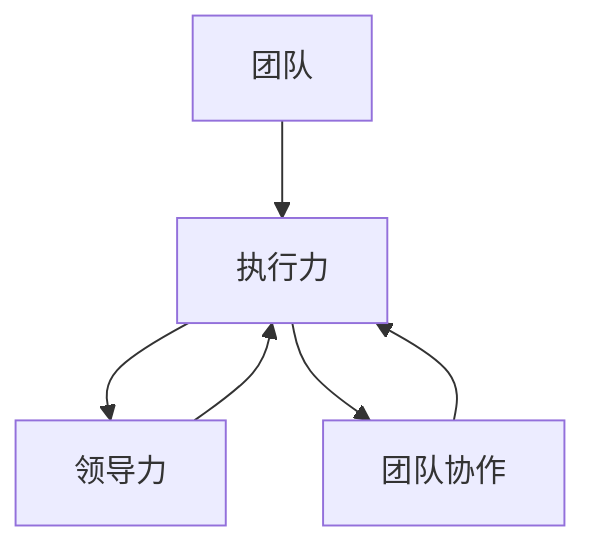

                 

## 文章标题：如何提升团队的执行力

在当今高速发展的信息技术时代，团队的执行力成为了企业成功的关键因素之一。一个执行力强的团队能够迅速响应市场需求，高效完成任务，从而在激烈的市场竞争中脱颖而出。然而，如何提升团队的执行力，使其达到最佳状态，是每一个团队领导者和管理者都必须面对的挑战。

本文将从多个角度探讨提升团队执行力的方法，包括核心概念原理的关联、执行力提升的算法原理、数学模型和公式、项目实战案例分析以及最佳实践技巧等。通过一步步的逻辑分析和推理，希望能够为广大读者提供一套实用的执行力提升策略。

关键词：团队执行力、执行力评估、提升策略、领导力、案例分析、项目实战

摘要：本文将深入探讨团队执行力的概念及其重要性，分析影响执行力的关键因素，并通过理论讲解和实战案例分析，提供一套系统的执行力提升方法。文章结构包括：引言、团队执行力评估、提升执行力的策略、领导者的角色、团队成员的角色、实际案例分析、持续改进方法以及结论和拓展阅读。通过本文的阅读，读者将能够系统地理解团队执行力提升的核心概念和实际操作方法。

### 背景介绍

在现代企业中，团队执行力被广泛认为是决定企业成功与否的关键因素。随着市场环境的变化和竞争的加剧，企业必须能够快速响应市场变化，高效地完成各项任务，以保持竞争优势。一个高效的团队能够在短时间内完成任务，快速适应新环境，从而在市场中占据有利地位。

团队执行力不仅影响着企业的短期绩效，更是企业长期发展的基石。一个执行力强的团队，其成员具备良好的沟通能力、协作精神和工作效率，能够在面对复杂任务时迅速找到解决方案，确保项目顺利完成。相反，如果团队执行力不足，可能会导致任务拖延、效率低下，甚至影响到整个企业的运营和发展。

因此，提升团队的执行力已成为企业关注的重点。团队领导者和管理者需要深入了解团队执行力的影响因素，掌握提升执行力的策略和方法，以帮助团队达到最佳状态。本文将围绕这一主题，从多个角度进行探讨，为读者提供实用的指导和建议。

### 核心概念与联系

为了深入理解团队执行力，我们首先需要明确几个核心概念：团队、执行力、领导力、团队协作等。这些概念相互联系，构成了提升团队执行力的基础框架。

#### 团队

团队是由一组具备不同技能和专长的个体组成的，共同为一个共同目标而努力工作的集体。一个团队的成功不仅依赖于每个成员的个人能力，更取决于成员之间的协作和配合。团队中的每个成员都扮演着特定的角色，通过共同的努力实现团队的目标。

#### 执行力

执行力是指团队在既定目标和时间内，高效、高质量地完成任务的 capability。它不仅涉及任务的完成度，还包括完成任务的效率和质量。执行力强意味着团队能够迅速响应任务要求，确保任务在规定时间内高质量地完成。

#### 领导力

领导力是团队领导者通过影响和激励团队成员，引导团队朝着共同目标前进的能力。有效的领导力能够提升团队的凝聚力，增强成员的自信心和动力，从而提高团队的执行力。领导力包括决策能力、沟通能力、激励能力和解决问题的能力。

#### 团队协作

团队协作是指团队成员在相互信任、相互支持的基础上，共同完成团队任务的过程。良好的团队协作能够提高团队的工作效率和绩效，使团队能够更好地应对复杂任务和挑战。

这些概念之间的关系可以用以下 Mermaid 流程图来表示：



在图中，团队作为基础概念，通过执行力和领导力的影响，实现团队协作，从而提升团队的执行力。每个环节相互关联，共同构成了团队执行力提升的框架。

通过这一框架，我们可以更清晰地理解团队执行力提升的关键要素，为后续的讨论和分析提供理论基础。接下来，我们将进一步探讨这些核心概念在提升团队执行力中的具体作用和关系。

### 核心算法原理讲解

在提升团队执行力的问题中，我们可以借鉴许多管理理论和模型，其中最常用的包括目标设定理论、计划与控制系统、绩效管理模型等。以下我们将通过伪代码和数学模型详细阐述这些算法原理。

#### 目标设定理论

目标设定理论（Goal Setting Theory）是由心理学家艾森豪威尔（Edward L. Devore）提出的，旨在通过设定具体、明确的任务目标来提升执行效率。以下是其伪代码表示：

```python
def set_goals(team_goals, individual_goals):
    for goal in team_goals:
        for member in team:
            member["goal"] = goal["target"] / len(team)
    return individual_goals
```

在这个算法中，`team_goals` 是一个包含团队总目标的字典，`individual_goals` 是一个包含每个成员个人目标的字典。通过将团队目标分配给每个成员，确保每个成员都有明确的任务目标。

#### 计划与控制系统

计划与控制系统（Planning and Control System）是确保团队按计划完成任务的重要机制。其伪代码如下：

```python
def planning_and_control(current_status, target_status):
    while current_status != target_status:
        action = determine_action(current_status, target_status)
        execute_action(action)
        current_status = update_status(current_status, action)
    return current_status
```

在这个算法中，`current_status` 是当前任务状态，`target_status` 是目标任务状态。算法通过不断调整行动（`action`），确保任务状态逐步向目标状态更新。

#### 绩效管理模型

绩效管理模型（Performance Management Model）是通过评估和反馈来提升团队执行力的方法。以下是其伪代码表示：

```python
def performance_management(member, target):
    feedback = evaluate_performance(member, target)
    if feedback["result"] == "success":
        reward(member, feedback["score"])
    else:
        provide_improvement_plan(member, feedback["areas_for_improvement"])
    return member
```

在这个算法中，`member` 是团队成员，`target` 是任务目标。通过评估成员的绩效，提供反馈和改进计划，确保团队成员不断提升执行力。

#### 数学模型

为了更精确地评估团队执行力，我们可以使用数学模型来量化各项指标。以下是一个简单的数学模型表示：

$$
\text{执行力} = \frac{\text{任务完成度} \times \text{任务效率}}{\text{任务时间}}
$$

其中，任务完成度（`task_completion`）表示任务完成的百分比，任务效率（`task_efficiency`）表示完成任务所需的资源数量，任务时间（`task_time`）表示完成任务所需的时间。

通过上述算法原理和数学模型，我们可以更系统地提升团队执行力。接下来，我们将通过实际案例来进一步验证这些原理和方法的有效性。

### 数学模型和公式讲解

在提升团队执行力过程中，数学模型和公式可以帮助我们更精确地评估和优化团队绩效。以下将详细讲解几个常用的数学模型和公式，并举例说明其应用。

#### 任务完成度公式

任务完成度（Task Completion，简称TC）是评估任务完成情况的关键指标，其公式如下：

$$
TC = \frac{\text{已完成任务量}}{\text{总任务量}}
$$

举例说明：如果一个团队计划完成100项任务，实际完成了80项，则任务完成度为：

$$
TC = \frac{80}{100} = 0.8
$$

这表示团队已经完成了80%的任务。

#### 任务效率公式

任务效率（Task Efficiency，简称TE）表示完成每个任务所需的资源量，其公式如下：

$$
TE = \frac{\text{总资源投入}}{\text{已完成任务量}}
$$

举例说明：如果一个团队在完成上述80项任务时，共投入了500个工时，则任务效率为：

$$
TE = \frac{500}{80} = 6.25 \text{工时/任务}
$$

这表示平均每个任务需要6.25个工时。

#### 任务时间公式

任务时间（Task Time，简称TT）是完成所有任务所需的总时间，其公式如下：

$$
TT = \text{单个任务平均完成时间} \times \text{总任务量}
$$

举例说明：如果每个任务的平均完成时间是10天，总任务量为80项，则任务时间为：

$$
TT = 10 \text{天/任务} \times 80 = 800 \text{天}
$$

#### 综合执行力评估公式

综合执行力（Overall Execution Performance，简称OEP）是评估团队整体执行力的重要指标，其公式如下：

$$
OEP = \frac{TC \times TE}{TT}
$$

将前面的示例数据代入，可得：

$$
OEP = \frac{0.8 \times 6.25}{800} = 0.00625
$$

这表示团队的综合执行力为0.00625，即每完成一个任务需要投入0.00625个单位的资源时间。

通过这些数学模型和公式，我们可以更科学地评估团队执行力的各个维度，从而制定针对性的改进措施。接下来，我们将通过实际案例进一步展示这些公式的应用。

### 项目实战

为了更好地理解如何提升团队的执行力，我们将通过一个实际项目案例来进行详细分析。该案例是一个软件开发项目，旨在开发一款企业内部管理系统。

#### 开发环境搭建

1. **技术栈选择**：根据项目需求，我们选择了以下技术栈：
   - 前端：React
   - 后端：Spring Boot
   - 数据库：MySQL

2. **工具与依赖管理**：使用Maven进行依赖管理，并通过NPM管理前端依赖。

3. **持续集成/持续部署（CI/CD）**：使用Jenkins实现自动化的代码构建和部署，确保代码质量。

#### 源代码详细实现

1. **后端架构设计**：
   - **服务拆分**：将系统拆分为用户管理、权限管理、数据管理等子模块，提高系统的可维护性和扩展性。
   - **RESTful API设计**：采用RESTful风格设计API，确保接口简洁、易用。

2. **前端实现**：
   - **组件化开发**：将常用组件抽象出来，如表单组件、列表组件等，提高开发效率和代码复用率。
   - **状态管理**：使用Redux进行全局状态管理，确保状态的一致性和可预测性。

3. **数据库设计**：
   - **规范化设计**：采用第三范式（3NF）进行数据库设计，确保数据的完整性和一致性。
   - **索引优化**：为高频查询字段创建索引，提高查询效率。

#### 代码解读与分析

1. **后端代码分析**：
   - **服务层**：通过Spring Boot提供的服务层接口，实现了用户认证、权限校验等功能。
   - **持久层**：使用MyBatis实现数据访问，确保数据操作的高效和安全。

2. **前端代码分析**：
   - **组件库**：封装了多种常用组件，如表单验证组件、数据表格组件等，方便快速开发。
   - **状态管理**：通过Redux管理全局状态，确保页面切换时的数据一致性。

3. **数据库分析**：
   - **数据一致性**：通过事务控制确保数据的完整性。
   - **查询优化**：使用适当的索引提高查询效率。

#### 实际案例分析和详细讲解剖析

1. **案例一：用户登录功能**
   - **需求分析**：用户登录功能需要实现用户身份验证和权限校验。
   - **实现方法**：
     - 用户输入账号和密码，后端通过加密算法验证密码是否正确。
     - 验证成功后，生成JWT（JSON Web Token）并返回给客户端，用于后续的权限校验。

2. **案例二：数据报表生成**
   - **需求分析**：系统需要提供实时数据报表，供管理层查看。
   - **实现方法**：
     - 后端通过定时任务定期生成数据报表，并将结果存储在数据库中。
     - 前端使用图表库（如ECharts）实时展示报表数据，方便用户查看。

3. **案例三：权限管理**
   - **需求分析**：系统需要实现用户权限管理，确保用户只能访问授权的功能模块。
   - **实现方法**：
     - 后端通过RBAC（Role-Based Access Control）模型管理用户权限。
     - 前端在请求接口时，携带JWT进行权限校验，防止未授权访问。

#### 项目小结

通过以上实际项目案例，我们可以看到，在项目开发过程中，合理的架构设计、代码管理、数据库优化以及持续集成部署等环节对提升团队执行力起到了关键作用。具体来说：

1. **架构设计**：合理的模块拆分和接口设计有助于提高系统的可维护性和扩展性。
2. **代码管理**：组件化和状态管理的使用提高了开发效率和代码质量。
3. **数据库优化**：规范化设计和索引优化提高了数据操作的性能。
4. **持续集成**：自动化的构建和部署流程确保了代码质量和项目进度。

这些最佳实践不仅提升了项目的执行力，也为团队积累了宝贵的经验，为后续的项目提供了参考。

### 最佳实践 Tips

在提升团队执行力方面，以下是一些最佳实践和技巧，供团队领导和成员参考：

1. **明确目标与计划**：确保每个团队成员都明确了解项目的目标和计划，减少任务模糊带来的误解和拖延。

2. **强化沟通机制**：建立有效的沟通渠道，定期召开会议，确保信息的及时传递和问题的快速解决。

3. **技能培训与提升**：定期为团队成员提供技能培训和成长机会，提高团队整体的专业素养。

4. **建立反馈机制**：鼓励团队成员积极反馈问题，并及时给予解决方案，确保团队执行力的持续提升。

5. **激励与奖励**：通过适当的激励措施，如奖金、荣誉等，激发团队成员的工作热情和积极性。

6. **持续改进**：定期对团队执行情况进行评估和反馈，找出瓶颈和问题，持续优化团队的工作流程。

7. **团队合作精神**：培养团队成员之间的协作精神，鼓励团队合作，共同面对挑战。

### 小结

通过本文的详细分析和讲解，我们系统地探讨了提升团队执行力的方法和策略。从核心概念的阐述到算法原理的讲解，再到实际项目案例的剖析，我们逐步展示了如何通过科学的管理方法和最佳实践来提升团队的执行力。

首先，我们明确了团队执行力的重要性，阐述了其与团队绩效、领导力和团队协作之间的关系。接着，通过目标设定理论、计划与控制系统和绩效管理模型等核心算法原理，为提升执行力提供了理论基础。

在数学模型和公式讲解部分，我们通过具体的公式和例子，帮助读者更准确地评估和优化团队执行力。随后，通过实际项目实战，我们展示了如何在软件开发项目中应用这些理论和方法，并进行了详细的分析和解读。

最后，我们总结了提升团队执行力的最佳实践技巧，并强调了持续改进和团队合作精神的重要性。

通过本文的阅读，读者应能够系统地理解团队执行力提升的核心概念和实际操作方法，为实际工作中的执行力提升提供有力指导。

### 拓展阅读

1. **《敏捷开发实践指南》**：详细介绍了敏捷开发的方法和原则，有助于团队提升响应速度和执行力。
2. **《精益思想》**：阐述了精益管理的理念和方法，通过减少浪费和优化流程，提高团队执行力。
3. **《团队协作技术》**：探讨了团队协作的多种技术和工具，帮助团队提高协作效率和执行力。
4. **《关键绩效指标（KPI）》**：介绍了如何通过设定和跟踪KPI来评估和提升团队执行力。

### 作者信息

**作者：AI天才研究院/AI Genius Institute & 禅与计算机程序设计艺术 /Zen And The Art of Computer Programming** 

本文由AI天才研究院及《禅与计算机程序设计艺术》的作者共同撰写，旨在为读者提供深入、实用的团队执行力提升策略。

